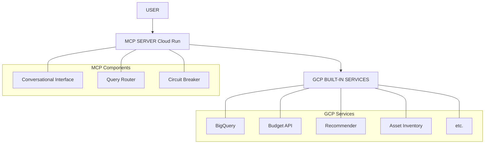

# GCP Cost Monitoring Agent — Complete Specification

## Document Purpose

This document provides a complete high-level specification for implementing the GCP Cost Monitoring Agent. It covers all components, integrations, and considerations needed for development without excessive implementation details.

---

## Table of Contents

1. [Product Overview](#1-product-overview)
2. [System Architecture](#2-system-architecture)
3. [Component Specifications](#3-component-specifications)
4. [MCP Tool Definitions](#4-mcp-tool-definitions)
5. [Data Layer](#5-data-layer)
6. [Authentication & Security](#6-authentication--security)
7. [Conversational Agent Design](#7-conversational-agent-design)
8. [Error Handling](#8-error-handling)
9. [Testing Strategy](#9-testing-strategy)
10. [Deployment Guide](#10-deployment-guide)
11. [Monitoring & Observability](#11-monitoring--observability)
12. [Future Considerations](#12-future-considerations)

---

## 1. Product Overview

### 1.1 Purpose

The GCP Cost Monitoring Agent is a conversational AI assistant that helps SMB owners monitor and control their Google Cloud Platform costs without requiring cloud engineering expertise.

### 1.2 Target Users

- Small and medium businesses with $50K-$500K monthly cloud spend
- Users without dedicated FinOps or cloud engineering staff
- Technical decision makers who need cost visibility without console expertise

### 1.3 Core Value Proposition

| User Problem | Agent Solution |
|--------------|----------------|
| "I don't know why my bill increased" | Natural language spike analysis |
| "I can't navigate GCP console" | Conversational interface for all queries |
| "I find out about overruns too late" | Proactive alerts + circuit breaker |
| "I don't know what to optimize" | ML-powered recommendations |

### 1.4 Key Capabilities

1. **Organization Scanning** — Discover all projects and enabled services
2. **Cost Analysis** — Query and analyze billing data via natural language
3. **Budget Monitoring** — Multi-threshold alerts with forecasting
4. **Anomaly Detection** — Statistical detection of unusual spending
5. **Recommendations** — Surface GCP's ML-powered optimization suggestions
6. **Circuit Breaker** — Automatic cost control when thresholds exceeded
7. **Real-time Tracking** — Instant alerts for expensive resource creation

---

## 2. System Architecture

### 2.1 Architecture Overview



**Legend**: High-level data flow from User to the Agent (MCP Server) and downstream to GCP services.

### 2.2 Design Principles

1. **Use GCP Built-in Tools** — Don't rebuild what Google provides
2. **Stateless Server** — MCP Server has no persistent state
3. **Event-Driven** — React to GCP events, don't poll
4. **On-Demand Queries** — Query APIs only when user asks
5. **Minimal Infrastructure** — Cloud Run + optional Cloud Function only

### 2.3 Component Inventory

| Component | Type | Purpose |
|-----------|------|---------|
| MCP Server | We Deploy | Conversational interface, query routing |
| Cloud Function | We Deploy (Optional) | Automated circuit breaker actions |
| BigQuery | GCP Managed | Cost data storage (billing export) |
| Budget API | GCP Managed | Threshold monitoring and alerts |
| Recommender API | GCP Managed | ML-powered optimization suggestions |
| Asset Inventory | GCP Managed | Resource tracking and change feeds |
| Pub/Sub | GCP Managed | Event delivery |

---

## 3. Component Specifications

### 3.1 Organization Scanner

**Purpose:** Discover all projects and enabled services across the GCP organization.

**GCP APIs Used:**
- Resource Manager API v3 — Hierarchy traversal (org → folders → projects)
- Service Usage API — Enabled services per project
- Billing API — Billing account associations

**Workflow:**
1. Start at organization level
2. Recursively discover all folders
3. List all projects under org and each folder
4. For each project, list enabled services
5. Classify services by cost risk level
6. Return enriched organization structure

**Service Risk Classification:**

| Risk Level | Services | Rationale |
|------------|----------|-----------|
| CRITICAL | Vertex AI (aiplatform) | GPU/TPU training costs |
| HIGH | Compute Engine, BigQuery, GKE, Dataflow | High hourly rates |
| MEDIUM | Cloud SQL, Dataproc, Cloud Run | Moderate costs |
| LOW | Cloud Functions, Cloud Storage | Pay-per-use, typically small |

**Output:** Organization tree with projects, enabled services, and risk flags.

---

### 3.2 Circuit Breaker

**Purpose:** Automatically control costs when thresholds are exceeded.

**Trigger Mechanism:**
- Budget API sends alert to Pub/Sub when threshold reached
- Cloud Function receives event and evaluates action
- Action executed based on threshold level

**Threshold Architecture:**

The circuit breaker operates on two levels:
1. **Per-Service Thresholds** — Monitor specific high-cost services independently
2. **Overall Thresholds** — Monitor total daily spend as a safety net

**Per-Service Threshold Examples:**

| Service | Level | Default Threshold | Action |
|---------|-------|-------------------|--------|
| Vertex AI | WARNING | $500/day | Alert only |
| | ELEVATED | $1,000/day | Alert with escalation |
| | CRITICAL | $2,500/day | Stop non-production endpoints |
| | EMERGENCY | $5,000/day | Stop all endpoints |
| Compute Engine | WARNING | $300/day | Alert only |
| | ELEVATED | $750/day | Alert with escalation |
| | CRITICAL | $1,500/day | Stop non-production VMs |
| | EMERGENCY | $3,000/day | Stop all VMs (except protected) |
| BigQuery | WARNING | $200/day | Alert only |
| | ELEVATED | $500/day | Alert with escalation |
| | CRITICAL | $1,000/day | Throttle queries |
| | EMERGENCY | $2,000/day | Disable non-essential access |

**Overall Threshold Levels (Safety Net):**

| Level | Default Threshold | Action |
|-------|-------------------|--------|
| WARNING | $1,000/day total | Alert only (Slack, email) |
| ELEVATED | $2,500/day total | Alert with escalation |
| CRITICAL | $5,000/day total | Stop high-cost resources |
| EMERGENCY | $10,000/day total | Disable billing (requires approval) |

> **Note:** Either threshold type can independently trip the circuit breaker. Per-service thresholds are customizable via `configure_circuit_breaker` tool.

**State Machine:**
- CLOSED (normal) → OPEN (tripped) → HALF-OPEN (testing) → CLOSED
- Cooldown periods prevent rapid state changes
- Manual override capability for approved exceptions

**Actions Available:**
- Send alerts (Slack, email, PagerDuty)
- Stop VM instances (with specific labels)
- Undeploy Vertex AI endpoints
- Scale GKE node pools to zero
- Disable project billing (emergency only)

**Safety Features:**
- Dry-run mode for testing
- Cooldown periods (configurable)
- Manual override capability
- Approval required for billing disable
- Audit log of all actions

---

### 3.3 Budget Monitor

**Purpose:** Proactive multi-threshold alerts including forecasted spend.

**GCP Service:** Budget API (fully managed)

**Budget Types:**
1. **Project Budget** — Per-project spending limits
2. **Service Budget** — Limits on specific services (e.g., Vertex AI)
3. **Label Budget** — Limits based on resource labels (e.g., team, environment)
4. **Organization Budget** — Global spending cap

**Alert Thresholds:**

| Threshold | Type | Severity |
|-----------|------|----------|
| 50% | Actual spend | Info |
| 70% | Actual spend | Warning |
| 80% | Forecasted spend | Warning |
| 90% | Actual spend | Critical |
| 100% | Actual spend | Critical + Circuit Breaker |
| 100% | Forecasted spend | Critical |

**Notification Channels:**
- Email (built-in, automatic)
- Pub/Sub (for programmatic handling)
- Slack/Teams (via Cloud Function integration)

---

### 3.4 Real-time Resource Tracker

**Purpose:** Instant detection of expensive resource creation.

**GCP Service:** Cloud Asset Inventory Feeds

**Monitored Resource Types:**
- compute.googleapis.com/Instance (VMs)
- compute.googleapis.com/Disk
- container.googleapis.com/Cluster (GKE)
- sqladmin.googleapis.com/Instance (Cloud SQL)
- aiplatform.googleapis.com/Endpoint
- aiplatform.googleapis.com/CustomJob
- dataflow.googleapis.com/Job

**Event Flow:**
1. User creates resource in GCP
2. Asset Inventory detects change
3. Event published to Pub/Sub
4. Agent receives event
5. Estimate cost of new resource
6. Alert if cost exceeds threshold (e.g., >$500/month estimated)

**Cost Estimation:**
- VM cost based on machine type + GPU configuration
- GKE cost based on node pool configuration
- Cloud SQL cost based on tier and HA settings
- Vertex AI endpoints flagged as high-cost by default

---

### 3.5 ML Recommendations Engine

**Purpose:** Surface GCP's optimization recommendations via natural language.

**GCP Service:** Recommender API (fully managed)

**Recommendation Types:**

| Type | Recommender ID | Description |
|------|----------------|-------------|
| Idle VMs | google.compute.instance.IdleResourceRecommender | VMs with <1% CPU for 8+ days |
| Rightsizing | google.compute.instance.MachineTypeRecommender | Oversized VM suggestions |
| Idle Disks | google.compute.disk.IdleResourceRecommender | Unattached persistent disks |
| Idle IPs | google.compute.address.IdleResourceRecommender | Unused static IPs |
| Commitments | google.compute.commitment.UsageCommitmentRecommender | CUD opportunities |
| Idle SQL | google.cloudsql.instance.IdleRecommender | Idle Cloud SQL instances |

**Presentation:**
- Sorted by potential savings (highest first)
- Grouped by type for easy scanning
- Include one-click action for safe recommendations

**Auto-Implementation Rules:**
- Idle VMs (with label "auto-stop: true") → Can auto-stop
- Idle disks → Require user confirmation
- Rightsizing → Require user confirmation (involves downtime)
- CUD purchase → Require explicit approval (financial commitment)

---

### 3.6 Anomaly Detector

**Purpose:** Statistical detection of unusual spending patterns.

**Detection Methods:**

| Method | Description | Threshold |
|--------|-------------|-----------|
| Daily Spike | Today vs 30-day average | >2 standard deviations |
| Service Spike | Service cost vs historical | >2 standard deviations |
| Sustained Increase | Recent 5-day avg vs historical | >20% sustained |
| New Service | Service with no historical cost | >$100 new spend |

**Statistical Approach:**
- Calculate mean and standard deviation over lookback period (30 days)
- Flag current value if it exceeds mean + (threshold × std dev)
- Sensitivity configurable: LOW (3σ), MEDIUM (2σ), HIGH (1.5σ)

**Output:**
- Anomaly type and severity
- Current cost vs expected cost
- Deviation percentage
- Recommended investigation action

---

## 4. MCP Tool Definitions

### 4.1 Tool Overview

| Tool Name | Purpose | Trigger |
|-----------|---------|---------|
| scan_organization | Discover projects and services | User query or scheduled |
| get_cost_summary | Retrieve cost data | User query |
| get_recommendations | Fetch optimization suggestions | User query |
| detect_anomalies | Run anomaly detection | User query |
| get_budget_status | Check budget utilization | User query |
| create_budget | Create new budget with alerts | User request |
| get_circuit_breaker_status | Check circuit breaker state | User query |
| configure_circuit_breaker | Update circuit breaker settings | User request |
| stop_resource | Stop a specific resource | User request (with approval) |
| chat | Process natural language query | Every user message |

### 4.2 Tool Specifications

#### scan_organization

**Purpose:** Discover all projects and enabled services in the organization.

**Input Parameters:**
- organization_id (required): GCP organization ID
- include_services (optional): Whether to enumerate services (default: true)
- include_billing (optional): Whether to include billing info (default: true)

**Output:**
- List of folders with hierarchy
- List of projects with parent, labels, and state
- Enabled services per project with risk classification
- High-cost service summary

**When to Use:** Initial setup, periodic refresh, when user asks about projects/services.

---

#### get_cost_summary

**Purpose:** Retrieve cost data for analysis.

**Input Parameters:**
- scope (optional): "organization", "project", or "service"
- project_id (optional): Specific project to query
- service (optional): Specific service to filter
- days (optional): Lookback period (default: 30)
- group_by (optional): "day", "service", "project"

**Output:**
- Total cost for period
- Cost breakdown by requested grouping
- Daily trend data
- Comparison to previous period

**When to Use:** User asks about costs, spending, bills, or trends.

---

#### get_recommendations

**Purpose:** Fetch ML-powered optimization suggestions from GCP.

**Input Parameters:**
- project_id (optional): Specific project (default: all projects)
- recommendation_types (optional): Filter by type
- min_savings (optional): Minimum monthly savings to include

**Output:**
- List of recommendations sorted by savings
- For each: type, resource, description, estimated savings, priority
- Total potential savings
- Auto-implementable recommendations flagged

**When to Use:** User asks about saving money, optimization, idle resources.

---

#### detect_anomalies

**Purpose:** Run statistical anomaly detection on cost data.

**Input Parameters:**
- project_id (optional): Specific project (default: all)
- sensitivity (optional): "low", "medium", "high" (default: medium)
- check_types (optional): Which anomaly types to check

**Output:**
- List of detected anomalies
- For each: type, severity, current vs expected cost, description
- Recommended actions

**When to Use:** User asks why costs increased, about unusual spending, or spikes.

---

#### get_budget_status

**Purpose:** Check current budget utilization.

**Input Parameters:**
- project_id (optional): Specific project's budget
- budget_name (optional): Specific budget by name

**Output:**
- List of budgets with current spend vs limit
- Percentage utilized
- Forecasted end-of-month spend
- Alert thresholds and which have fired

**When to Use:** User asks about budgets, limits, or remaining allowance.

---

#### create_budget

**Purpose:** Create a new budget with alert thresholds.

**Input Parameters:**
- name (required): Budget display name
- amount_usd (required): Monthly budget amount
- scope_type (required): "project", "service", or "label"
- scope_value (required): Project ID, service name, or label key-value
- alert_thresholds (optional): Custom thresholds (default: 50%, 80%, 100%)
- include_forecasted (optional): Include forecasted alerts (default: true)
- notify_pubsub (optional): Pub/Sub topic for programmatic alerts

**Output:**
- Created budget ID and name
- Configured thresholds
- Notification settings

**When to Use:** User requests to set up a budget or spending limit.

---

#### get_circuit_breaker_status

**Purpose:** Check current circuit breaker configuration and state.

**Input Parameters:**
- project_id (optional): Specific project (default: current context)

**Output:**
- Enabled/disabled status
- Configured thresholds with current state (CLOSED/OPEN)
- Recent events (trips, resets)
- Dry-run mode status

**When to Use:** User asks about circuit breaker, cost protection, or emergency controls.

---

#### configure_circuit_breaker

**Purpose:** Update circuit breaker settings.

**Input Parameters:**
- project_id (required): Target project
- enabled (optional): Enable or disable
- thresholds (optional): Array of threshold configurations
- dry_run (optional): Enable dry-run mode
- notify_channels (optional): Alert destinations

**Output:**
- Updated configuration
- Validation status

**When to Use:** User requests to change cost protection settings.

**Requires:** User confirmation before applying changes.

---

#### stop_resource

**Purpose:** Stop a specific resource to reduce costs.

**Input Parameters:**
- resource_type (required): "vm", "gke_nodepool", "vertex_endpoint", etc.
- resource_name (required): Resource identifier
- project_id (required): Project containing resource

**Output:**
- Action result (success/failure)
- Estimated savings
- Resource state after action

**When to Use:** User explicitly requests to stop a resource.

**Requires:** User approval before execution.

---

#### chat

**Purpose:** Process natural language queries and route to appropriate tools.

**Input Parameters:**
- message (required): User's natural language input
- context (optional): Conversation context from previous turns

**Output:**
- Natural language response
- Data supporting the response
- Suggested follow-up actions
- Approval requests (if action required)

**When to Use:** Every user message.

---

## 5. Data Layer

### 5.1 Data Sources

| Source | Data Type | Update Frequency | Access Method |
|--------|-----------|------------------|---------------|
| BigQuery Billing Export | Cost records | Daily | SQL queries |
| Budget API | Budget status | Real-time | API call |
| Recommender API | Recommendations | Continuous (GCP managed) | API call |
| Asset Inventory | Resource state | Real-time | API call + Pub/Sub |
| Resource Manager | Org structure | On-demand | API call |
| Service Usage | Enabled services | On-demand | API call |

### 5.2 BigQuery Billing Export

**Setup:** Enable billing export in GCP Console → Billing → Billing Export

**Tables Created by GCP:**
- `gcp_billing_export_v1_<billing_account_id>` — Detailed cost data

**Key Fields:**
- billing_account_id
- project.id, project.name
- service.description
- sku.description
- usage_start_time, usage_end_time
- cost (in billing currency)
- credits (discounts, commitments)

**Queries Needed:**

| Query Purpose | Description |
|---------------|-------------|
| Daily cost summary | Aggregate cost by day for trend analysis |
| Service breakdown | Cost grouped by service for a period |
| Project breakdown | Cost grouped by project for a period |
| Cost comparison | Current period vs previous period |
| Anomaly baseline | Calculate mean and std dev for anomaly detection |
| Forecasting | Linear projection based on current month spend |

### 5.3 State Storage

**Stateless Design:** The MCP Server is stateless. All persistent state is stored in GCP services.

| State Type | Storage Location |
|------------|------------------|
| Cost data | BigQuery (billing export) |
| Budget config | Budget API |
| Resource state | Asset Inventory |
| Circuit breaker state | Firestore (optional) or in-memory |
| Conversation context | Passed in each request |

**Circuit Breaker State (if persisted):**
```
Firestore collection: circuit_breaker_state
Document: {project_id}
Fields:
  - thresholds: array of threshold configs
  - states: map of threshold_name → state (CLOSED/OPEN/HALF_OPEN)
  - last_trip_times: map of threshold_name → timestamp
  - event_history: array of recent events
```

---

## 6. Authentication & Security

### 6.1 Service Account Setup

**Service Account:** Create a dedicated service account for the agent.

**Naming Convention:** `gcp-cost-agent@{project-id}.iam.gserviceaccount.com`

### 6.2 Required IAM Roles

| Role | Scope | Purpose |
|------|-------|---------|
| `roles/browser` | Organization | View org hierarchy |
| `roles/resourcemanager.folderViewer` | Organization | List folders |
| `roles/resourcemanager.projectViewer` | Organization | List projects |
| `roles/serviceusage.serviceUsageViewer` | Organization | List enabled services |
| `roles/billing.viewer` | Billing Account | View billing data |
| `roles/billing.budgetsViewer` | Billing Account | View budgets |
| `roles/billing.budgetsEditor` | Billing Account | Create/modify budgets |
| `roles/recommender.computeViewer` | Organization | View recommendations |
| `roles/cloudasset.viewer` | Organization | Query asset inventory |
| `roles/bigquery.dataViewer` | Billing Export Dataset | Query billing data |
| `roles/bigquery.jobUser` | Project | Run BigQuery jobs |
| `roles/compute.instanceAdmin.v1` | Projects (as needed) | Stop/start VMs |

### 6.3 User Authentication

**For Conversational Interface:**

| Deployment Model | Auth Method |
|------------------|-------------|
| Internal tool | Google Workspace SSO |
| SaaS product | OAuth 2.0 with Google |
| API access | Service account key or workload identity |

**OAuth Scopes Needed:**
- `https://www.googleapis.com/auth/cloud-platform.read-only` (minimum)
- `https://www.googleapis.com/auth/cloud-platform` (if making changes)

### 6.4 Security Best Practices

1. **Least Privilege** — Only grant permissions actually needed
2. **No Long-lived Keys** — Use workload identity where possible
3. **Audit Logging** — Enable Cloud Audit Logs for all API calls
4. **Secrets Management** — Store any secrets in Secret Manager
5. **Network Security** — Deploy Cloud Run with VPC connector if needed
6. **Action Approval** — Require user confirmation for destructive actions

---

## 7. Conversational Agent Design

### 7.1 Intent Classification

**Supported Intents:**

| Intent | Example Queries |
|--------|-----------------|
| COST_QUERY | "How much did I spend?", "What's my bill?" |
| COST_BREAKDOWN | "Show costs by service", "Which project costs most?" |
| SPIKE_ANALYSIS | "Why did costs increase?", "What caused the spike?" |
| RECOMMENDATION | "How can I save money?", "Find idle resources" |
| BUDGET_STATUS | "What's my budget?", "Am I over limit?" |
| ANOMALY_CHECK | "Is spending normal?", "Any unusual costs?" |
| CIRCUIT_BREAKER | "Show cost protection status", "Enable circuit breaker" |
| RESOURCE_ACTION | "Stop that VM", "Scale down the cluster" |
| HELP | "What can you do?", "Help" |

### 7.2 Entity Extraction

**Entities to Extract:**

| Entity | Examples | Use |
|--------|----------|-----|
| project_id | "prod-api", "my-project-123" | Scope queries to project |
| service | "compute", "bigquery", "vertex ai" | Filter by service |
| time_period | "last week", "this month", "yesterday" | Set date range |
| amount | "$5000", "five thousand" | Budget amounts |
| resource_name | "vm-1", "my-cluster" | Specific resource actions |

### 7.3 Response Guidelines

**Tone:** Professional but approachable, like a knowledgeable colleague.

**Structure:**
1. Direct answer to the question
2. Supporting data (numbers, charts description)
3. Suggested follow-up actions (as buttons/options)

**Example Response:**
```
📊 Your GCP spend for the last 30 days is $12,450.

Top services:
• Compute Engine: $6,200 (50%)
• BigQuery: $3,100 (25%)
• Cloud Storage: $1,500 (12%)

This is 15% higher than last month, mainly due to increased Compute usage.

[See detailed breakdown] [Find savings] [Set budget alert]
```

### 7.4 Approval Workflow

**Actions Requiring Approval:**
- Stopping resources
- Modifying budgets
- Changing circuit breaker settings
- Any action that affects running workloads

**Approval Flow:**
1. User requests action
2. Agent explains what will happen and impact
3. Agent asks for explicit confirmation
4. User confirms with "yes", "approve", or "confirm"
5. Agent executes and reports result

**Example:**
```
User: "Stop the idle VMs"

Agent: I found 3 idle VMs that can be stopped:
• vm-dev-1 (us-central1) — idle 12 days — saves $45/month
• vm-test-2 (us-east1) — idle 8 days — saves $30/month  
• vm-batch-3 (europe-west1) — idle 15 days — saves $60/month

Total savings: $135/month

⚠️ This will terminate any running processes on these VMs.

Do you want me to stop all 3 VMs? [Yes, stop all] [Select specific] [Cancel]
```

---

## 8. Error Handling

### 8.1 Error Categories

| Category | Examples | Handling |
|----------|----------|----------|
| API Errors | Rate limits, permission denied, not found | Retry with backoff, explain to user |
| Data Errors | Missing billing data, no recommendations | Explain limitation, suggest alternatives |
| User Errors | Invalid project ID, unclear intent | Ask for clarification |
| System Errors | Service unavailable, timeout | Apologize, suggest retry |

### 8.2 API Rate Limits

| API | Quota | Handling |
|-----|-------|----------|
| Resource Manager | 400 requests/min | Batch requests, cache results |
| Service Usage | 100 requests/min | Parallel with semaphore |
| Recommender | 60 requests/min | Sequential with delay |
| BigQuery | 100 concurrent queries | Queue if needed |
| Asset Inventory | 100 requests/min | Batch where possible |

### 8.3 Error Response Format

```
I encountered an issue: [brief explanation]

What happened: [technical detail if helpful]

What you can do:
• [Option 1]
• [Option 2]

[Retry] [Contact support]
```

### 8.4 Graceful Degradation

| Failure | Fallback Behavior |
|---------|-------------------|
| BigQuery unavailable | Use cached summary if available, inform user data may be stale |
| Recommender API fails | Skip recommendations, inform user, answer other parts of query |
| Asset Inventory timeout | Return partial results, offer to retry |
| Budget API error | Show last known status, flag as potentially outdated |

---

## 9. Testing Strategy

### 9.1 Testing Levels

| Level | Purpose | Approach |
|-------|---------|----------|
| Unit Tests | Test individual functions | Mock GCP API responses |
| Integration Tests | Test API interactions | Use GCP test project with minimal resources |
| End-to-End Tests | Test full conversation flows | Scripted conversations with expected outcomes |
| Load Tests | Test under concurrent users | Simulate multiple users, measure response times |

### 9.2 Test Environment

**Dedicated Test Project:**
- Separate GCP project for testing
- Minimal real resources (1-2 small VMs, 1 Cloud SQL)
- Synthetic billing data in BigQuery (copied and anonymized)
- Budget alerts configured but with high thresholds

**Mock Data:**
- Sample organization structure (3 folders, 10 projects)
- Sample billing data (3 months history)
- Sample recommendations (idle VMs, rightsizing)
- Sample anomalies (injected spikes)

### 9.3 Test Cases

**Conversation Tests:**
- Basic cost query returns correct data
- Spike analysis identifies known anomaly
- Recommendations are sorted by savings
- Budget status shows correct utilization
- Unclear query prompts clarification

**Circuit Breaker Tests:**
- Threshold trip changes state to OPEN
- Cooldown prevents immediate re-trip
- Manual reset works with approval
- Dry-run mode logs but doesn't execute

**Error Handling Tests:**
- API timeout returns graceful error
- Invalid project ID prompts correction
- Rate limit triggers retry with backoff
- Partial failure returns partial results

### 9.4 Testing Without Incurring Costs

1. **Mock API Responses** — Unit tests use mocked responses
2. **Small Test Resources** — f1-micro VMs, minimal storage
3. **BigQuery Sandbox** — 1TB/month free tier
4. **Synthetic Data** — Generate fake billing records
5. **Dry-Run Mode** — Circuit breaker testing without real actions

---

## 10. Deployment Guide

### 10.1 Prerequisites

| Requirement | Purpose |
|-------------|---------|
| GCP Organization | Required for org-level scanning |
| Billing Account | Required for billing export and budgets |
| BigQuery Dataset | Billing export destination |
| Pub/Sub Topic | Budget alert delivery |
| Service Account | Agent authentication |

### 10.2 One-Time Setup Steps

**Step 1: Enable Billing Export**
- GCP Console → Billing → Billing Export
- Select or create BigQuery dataset
- Enable detailed usage cost export
- Wait 24-48 hours for initial data

**Step 2: Create Service Account**
- Create service account in agent's host project
- Grant IAM roles as specified in Section 6.2
- Generate key (if not using workload identity)

**Step 3: Create Pub/Sub Topic**
- Create topic for budget alerts
- Create subscription for Cloud Function (if using)
- Grant Budget API permission to publish

**Step 4: Create Initial Budget**
- Create organization-level budget
- Configure thresholds (50%, 80%, 100%)
- Enable Pub/Sub notifications

**Step 5: Deploy MCP Server**
- Build container image
- Deploy to Cloud Run
- Configure environment variables
- Set up custom domain (optional)

**Step 6: Deploy Cloud Function (Optional)**
- Deploy budget alert handler
- Configure Pub/Sub trigger
- Set circuit breaker thresholds

### 10.3 Environment Variables

| Variable | Purpose | Example |
|----------|---------|---------|
| GCP_ORGANIZATION_ID | Target organization | "123456789" |
| GCP_BILLING_ACCOUNT_ID | Billing account | "ABCDEF-123456-GHIJKL" |
| BIGQUERY_PROJECT | Project containing billing export | "billing-data-project" |
| BIGQUERY_DATASET | Billing export dataset | "billing_export" |
| PUBSUB_PROJECT | Project for Pub/Sub | "agent-project" |
| CIRCUIT_BREAKER_ENABLED | Enable circuit breaker | "true" |
| CIRCUIT_BREAKER_DRY_RUN | Dry-run mode | "false" |
| SLACK_WEBHOOK_URL | Slack notifications | "https://hooks.slack.com/..." |

### 10.4 Deployment Commands

```bash
# Build container
docker build -t gcr.io/{project}/gcp-cost-agent:latest .

# Push to Container Registry
docker push gcr.io/{project}/gcp-cost-agent:latest

# Deploy to Cloud Run
gcloud run deploy gcp-cost-agent \
  --image gcr.io/{project}/gcp-cost-agent:latest \
  --platform managed \
  --region us-central1 \
  --service-account gcp-cost-agent@{project}.iam.gserviceaccount.com \
  --set-env-vars "GCP_ORGANIZATION_ID=123456789,..." \
  --allow-unauthenticated  # Or configure IAP for auth
```

---

## 11. Monitoring & Observability

### 11.1 Metrics to Track

| Metric | Purpose | Alert Threshold |
|--------|---------|-----------------|
| Request latency | User experience | p95 > 5 seconds |
| Error rate | Reliability | > 5% of requests |
| API quota usage | Prevent throttling | > 80% of quota |
| Circuit breaker trips | Cost events | Any trip |
| Recommendations implemented | Value delivered | Track weekly |

### 11.2 Logging

**Log Levels:**
- INFO: User queries, API calls, responses
- WARNING: Rate limits, retries, degraded functionality
- ERROR: API failures, unexpected errors
- CRITICAL: Circuit breaker trips, billing changes

**Structured Logging Fields:**
- user_id (if authenticated)
- session_id
- intent
- project_id (if scoped)
- latency_ms
- error_code (if error)

### 11.3 Dashboards

**Recommended Dashboards:**

1. **User Activity**
   - Queries per hour
   - Top intents
   - Average response time

2. **API Health**
   - API call success rate
   - Quota utilization
   - Error breakdown

3. **Cost Impact**
   - Recommendations surfaced
   - Actions taken
   - Estimated savings from actions

### 11.4 Alerting

| Alert | Condition | Channel |
|-------|-----------|---------|
| High error rate | >10% errors for 5 min | PagerDuty |
| API quota critical | >90% quota used | Slack |
| Circuit breaker tripped | Any CRITICAL+ trip | PagerDuty + Email |
| Service unavailable | Health check fails | PagerDuty |

---

## 12. Future Considerations

### 12.1 Potential Enhancements

| Enhancement | Description | Complexity |
|-------------|-------------|------------|
| Multi-cloud support | Add AWS and Azure cost monitoring | High |
| Custom anomaly models | ML-based anomaly detection beyond statistics | Medium |
| Automated remediation | Auto-implement safe recommendations | Medium |
| Cost allocation | Tag-based cost attribution | Low |
| Forecasting | Predictive cost modeling | Medium |
| Slack/Teams bot | Native chat platform integration | Low |

### 12.2 Scalability Considerations

| Aspect | Current Design | Scale Consideration |
|--------|----------------|---------------------|
| Users | Single-tenant | Add user management for multi-tenant |
| Projects | Up to ~100 | Pagination and caching for larger orgs |
| Query volume | On-demand | Add caching layer if query volume high |
| Data retention | GCP default (varies) | Consider data lifecycle policies |

### 12.3 Known Limitations

1. **Billing Export Delay** — Cost data is 24-48 hours behind real-time
2. **Recommender Latency** — New resources need 8+ days to generate recommendations
3. **Organization Requirement** — Requires GCP Organization (not standalone projects)
4. **Budget API Limits** — Maximum 5,000 budgets per billing account

---

## Appendix A: Glossary

| Term | Definition |
|------|------------|
| MCP | Model Context Protocol — interface for LLM tool use |
| CUD | Committed Use Discount — prepaid commitment for lower rates |
| Circuit Breaker | Automatic cost control that trips when thresholds exceeded |
| Asset Inventory | GCP service that tracks all resources across organization |
| Billing Export | GCP feature that exports cost data to BigQuery |

---

## Appendix B: Reference Links

| Resource | URL |
|----------|-----|
| GCP Billing Export | https://cloud.google.com/billing/docs/how-to/export-data-bigquery |
| Budget API | https://cloud.google.com/billing/docs/how-to/budgets |
| Recommender API | https://cloud.google.com/recommender/docs |
| Asset Inventory | https://cloud.google.com/asset-inventory/docs |
| Cloud Run | https://cloud.google.com/run/docs |

---

*Document Version: 1.0*
*Last Updated: February 2025*
