# GCP Cost Monitoring Agent — Architectural Design

## Executive Summary

This document defines the structural and architectural design for a GCP Cost Monitoring Agent that provides:

1. **Organization Scanner** — Resource Manager API + Service Usage API for complete visibility
2. **Circuit Breaker** — Automatic cost control with configurable thresholds
3. **Proactive Budget Monitoring** — Multi-threshold alerts including forecasted spend
4. **Real-time Resource Tracking** — Cloud Asset Inventory feeds for instant notifications
5. **ML-Powered Recommendations** — Recommender API integration
6. **Anomaly Detection** — Statistical analysis of historical costs
7. **Conversational Interface** — Natural language queries

---

## System Architecture

```mermaid
flowchart TD
    UI[User Interface Layer]
    MCP[MCP Server Layer (Port ${MCP_SERVER_PORT})]
    GCP[GCP API Layer]

    UI -->|Conversational Interface| MCP
    MCP -->|Organization Scanner| GCP
    MCP -->|Circuit Breaker| GCP
    MCP -->|Budget Monitor| GCP
    MCP -->|Anomaly Detector| GCP

    subgraph UI
        UI1[Conversational Interface]
    end

    subgraph MCP
        ORG[Organization Scanner]
        CB[Circuit Breaker]
        BUD[Budget Monitor]
        ANOM[Anomaly Detector]
    end

    subgraph GCP
        RM[Resource Manager API]
        SU[Service Usage API]
        BA[Budget API]
        CA[Cloud Asset Inventory]
        BQ[BigQuery]
        CF[Compute Engine]
        PUB[Pub/Sub]
    end

    ORG --> RM
    ORG --> SU
    CB --> BA
    BUD --> PUB
    ANOM --> BQ

    RM --> CF
    SU --> CF
    CA --> PUB
    BQ --> PUB
```

**Legend**: arrows indicate data flow direction between components.
```mermaid
flowchart TD
    UI[User Interface]
    IC[Intent Classification]
    EE[Entity Extraction]
    CM[Context Management]
    RESP[Response]
    UI --> IC --> RESP
    UI --> EE --> "Actions"
    UI --> CM --> "Approvals"
```

**Legend**: arrows show the processing pipeline for user queries.

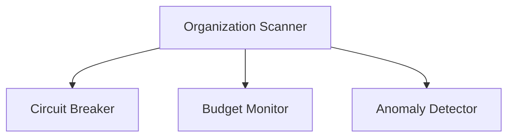

**Legend**: arrows show data flow between core components within the MCP server layer.


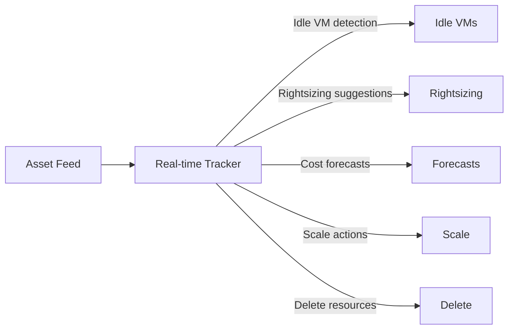

**Legend**: arrows indicate data flow from the asset feed to various real‑time management actions.

```mermaid
flowchart LR
    RM[Resource Manager API]
    SU[Service Usage API]
    BA[Budget API]
    CA[Cloud Asset Inventory]
    RE[Recommender API]
    BIL[Billing API]
    CE[Compute Engine API]
    PS[Pub/Sub]
    BQ[BigQuery (Export)]
    RM --> CE
    SU --> CE
    CA --> PS
    BQ --> PS
    BA --> RE
    RE --> PS
    BIL --> RE
```

**Legend**: arrows indicate data flow between GCP services used by the agent.


---

## Component Architecture

### 1. Organization Scanner

**Purpose:** Discover all projects and enabled services across the GCP organization.

**Method:** Resource Manager API + Service Usage API (detailed enumeration)


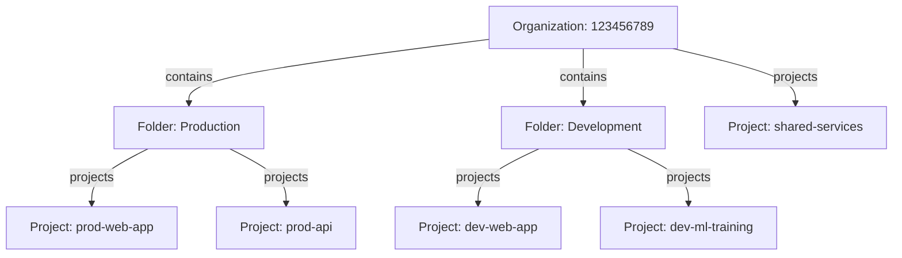

**Legend**: arrows show containment hierarchy (organization → folders → projects).


**Data Flow:**


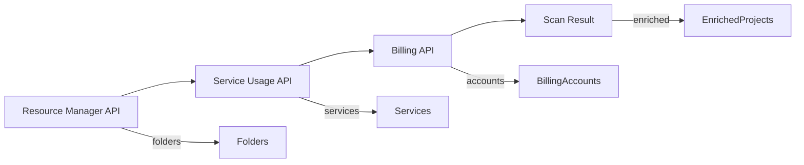

**Legend**: arrows indicate data flow between components of the budget monitoring pipeline.


**Scan Result Schema:**

```yaml
OrganizationScanResult:
  organization_id: string
  scan_timestamp: datetime
  folders:
    - folder_id: string
      display_name: string
      parent: string
  projects:
    - project_id: string
      display_name: string
      parent: string
      enabled_services:
        - name: string
          risk: CRITICAL | HIGH | MEDIUM | LOW
          category: string
      billing_account: string
      monthly_cost: float
  service_summary:
    service_name: [project_ids]
  high_cost_services:
    service_name: [project_ids]
  total_monthly_cost: float
```

---

### 2. Circuit Breaker

**Purpose:** Automatically control costs when thresholds are exceeded.

**Architecture:**


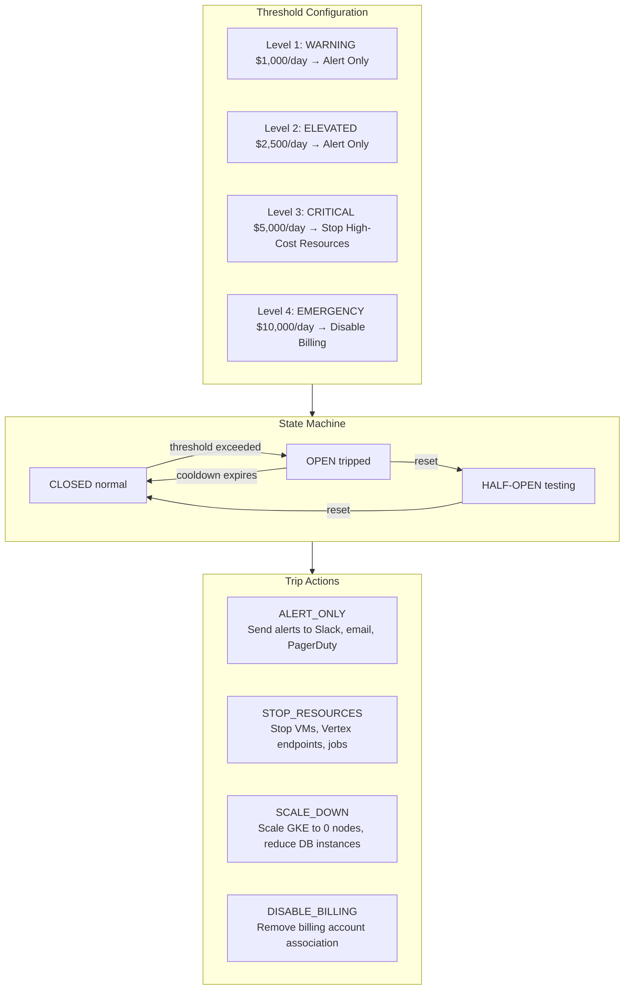

**Legend**: diagram shows the three components of the circuit breaker: threshold configuration, state machine transitions, and available trip actions.

**Threshold Configuration Schema:**

```yaml
CircuitBreakerConfig:
  project_id: string
  enabled: boolean
  dry_run: boolean  # Log actions without executing
  thresholds:
    - name: string
      threshold_usd: float
      action: ALERT_ONLY | STOP_RESOURCES | SCALE_DOWN | DISABLE_BILLING
      services: [string]  # Specific services to affect (null = all)
      cooldown_hours: int
      auto_reset: boolean
      notify_channels: [slack, email, pagerduty]
  global_daily_limit_usd: float
  global_monthly_limit_usd: float
  excluded_services: [string]
  require_approval_for_reset: boolean
```

**Circuit Breaker Flow:**

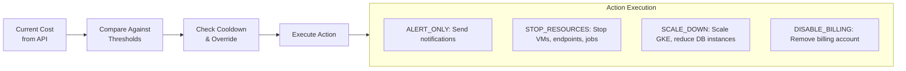

**Legend**: flowchart shows the circuit breaker decision pipeline from cost comparison to action execution.

---

### 3. Proactive Budget Monitoring

**Purpose:** Create and monitor budgets with multi-threshold alerts including forecasted spend.

**Architecture:**

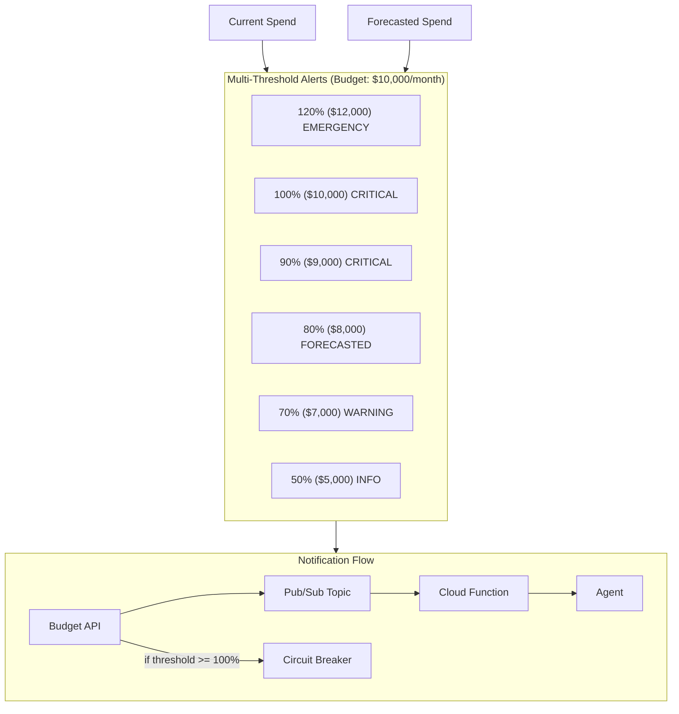

**Legend**: diagram shows budget thresholds, dual sources (current + forecasted spend), and notification flow to the agent and circuit breaker.

**Budget Types:**

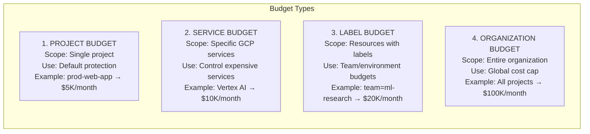

**Legend**: four types of budgets available in the GCP cost monitoring system.

---

### 4. Real-time Resource Tracking

**Purpose:** Instantly detect creation of expensive resources via Cloud Asset Inventory feeds.

**Architecture:**

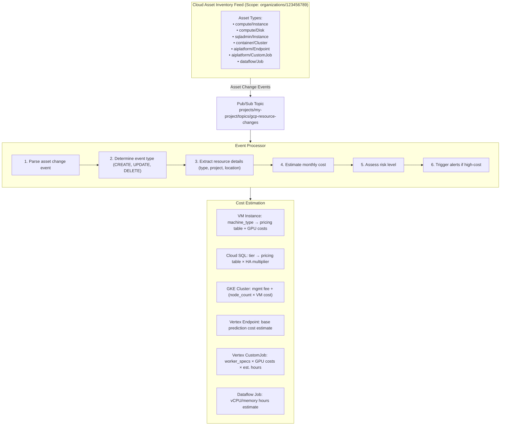

**Legend**: the pipeline shows how asset changes flow from Cloud Asset Inventory through event processing to cost estimation and alerting.

**GPU Pricing Reference:**

| GPU Type | Hourly Cost | Monthly (730 hrs) |
|----------|-------------|-------------------|
| NVIDIA T4 | $0.35 | $255 |
| NVIDIA L4 | $0.55 | $401 |
| NVIDIA P4 | $0.60 | $438 |
| NVIDIA P100 | $1.46 | $1,066 |
| NVIDIA V100 | $2.48 | $1,810 |
| NVIDIA A100 (40GB) | $3.67 | $2,679 |
| NVIDIA H100 (80GB) | $10.20 | $7,446 |

**Alert Trigger:** Any resource with estimated cost > $500/month

**Event Flow:**

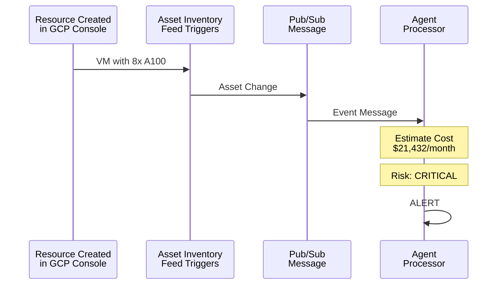

**Legend**: sequence diagram showing real-time flow from resource creation to alert generation.

---

### 5. ML-Powered Recommendations

**Purpose:** Leverage GCP Recommender API for cost optimization suggestions.

**Architecture:**

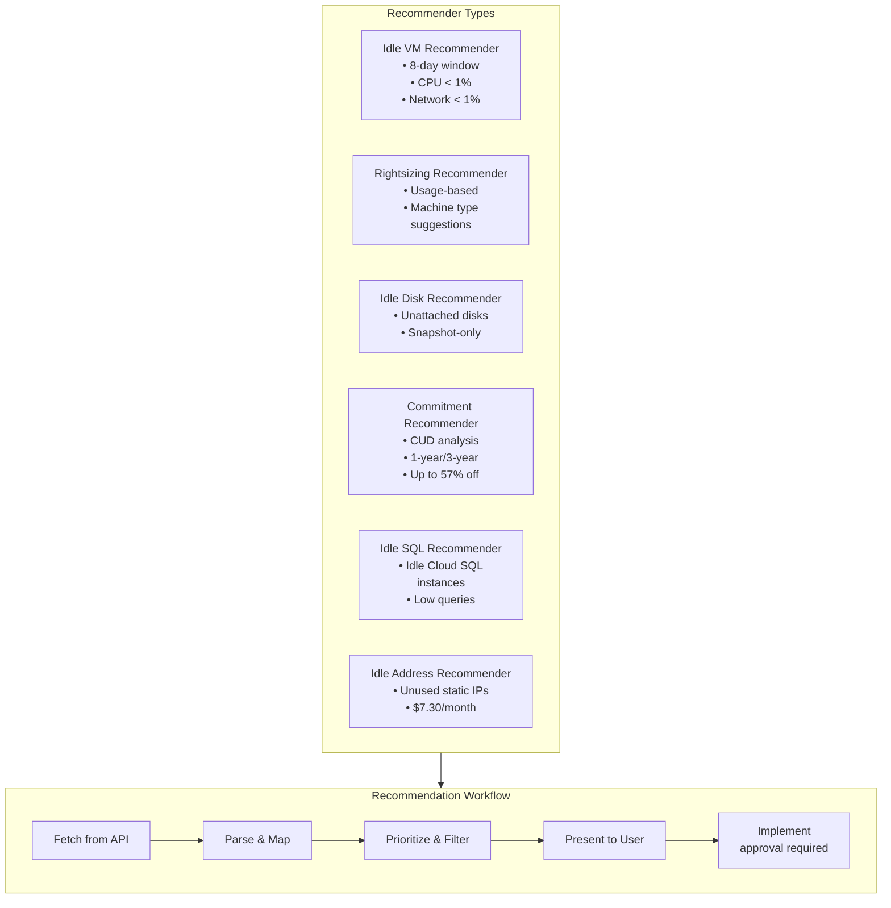

**Legend**: diagram shows six recommendation types and their processing workflow from API fetch to implementation.

**Recommendation Schema:**

```yaml
CostRecommendation:
  recommendation_id: string
  recommendation_type: string  # idle_vm, rightsizing, commitment, etc.
  project_id: string
  resource_name: string
  description: string
  primary_action: string  # stop, resize, delete, purchase_cud
  estimated_monthly_savings: float
  estimated_annual_savings: float
  priority: P1 | P2 | P3 | P4
  state: ACTIVE | CLAIMED | SUCCEEDED | FAILED
  auto_implementable: boolean  # Safe to auto-implement
  risk_level: LOW | MEDIUM | HIGH
```

**Auto-Implementation Rules:**

```
| Recommendation Type | Auto-Implement? | Reason |
|---------------------|-----------------|--------|
| Idle VM (P1/P2) | ✓ YES | Low risk, clear savings |
| Idle Disk | ✓ YES | No running workloads |
| Idle Address | ✓ YES | Unused, safe to release |
| Rightsizing | ✗ NO | Requires downtime |
| CUD Purchase | ✗ NO | Financial commitment |
| Idle Cloud SQL | ✗ NO | Data preservation risk |
```

---

### 6. Anomaly Detection

**Purpose:** Detect unusual spending patterns using statistical analysis.

**Architecture:**

```
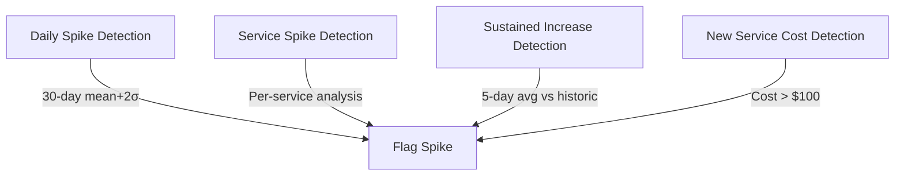

**Legend**: each detection method feeds into a common flagging step that triggers alerts.
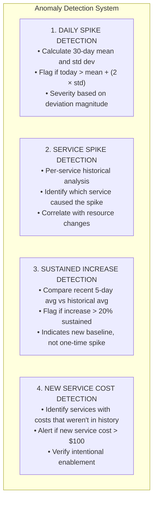

**Legend**: the four primary methods used by the agent to detect cost anomalies.
```

**Statistical Analysis:**

```
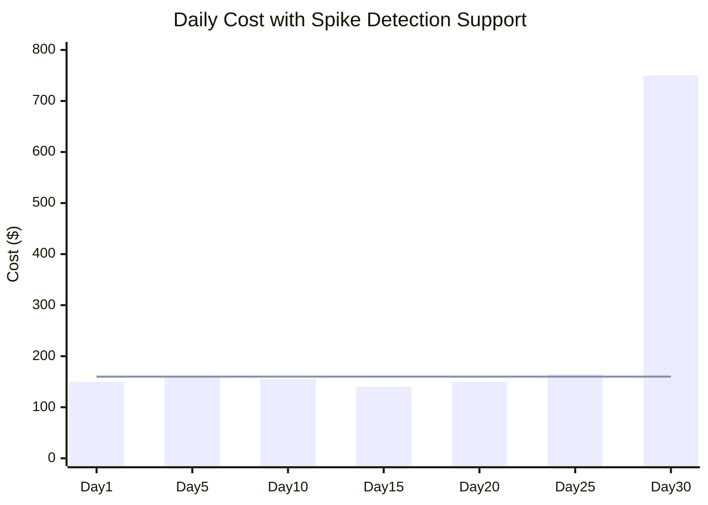

**Legend**: visualization of a cost spike exceeding the standard deviation threshold (simulated data).

**Sensitivity Configuration:**
- **LOW**: 3.0 standard deviations
- **MEDIUM**: 2.0 standard deviations (default)
- **HIGH**: 1.5 standard deviations
```

**Anomaly Schema:**

```yaml
CostAnomaly:
  anomaly_id: string
  anomaly_type: DAILY_SPIKE | SERVICE_SPIKE | SUSTAINED_INCREASE | NEW_SERVICE
  severity: INFO | WARNING | CRITICAL | EMERGENCY
  detected_at: datetime
  project_id: string (optional)
  service: string (optional)
  current_cost: float
  expected_cost: float
  deviation_percent: float
  deviation_std: float
  description: string
  recommended_action: string
  related_resources: [string]
```

---

### 7. Conversational Interface

**Purpose:** Natural language queries that replace the need for GCP console expertise.

**Architecture:**

```
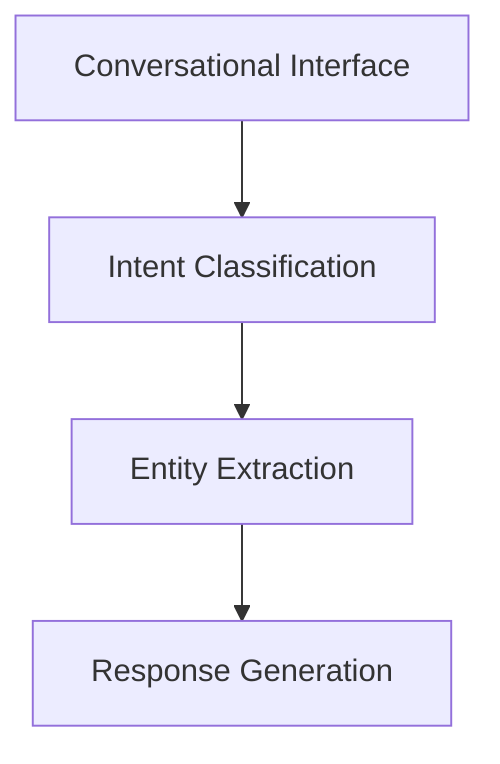

**Legend**: arrows show the processing pipeline from user query to generated response.
│                    CONVERSATIONAL INTERFACE                                  │
├─────────────────────────────────────────────────────────────────────────────┤
│                                                                             │
│  ┌───────────────────────────────────────────────────────────────────────┐ │
│  │                   INTENT CLASSIFICATION                                │ │
│  │                                                                        │ │
│  │   User Query                            Detected Intent                │ │
│  │   ─────────────────────────────────────────────────────────────────   │ │
│  │   "How much did I spend this month?"    → COST_QUERY                  │ │
│  │   "Why did costs spike?"                → SPIKE_ANALYSIS              │ │
│  │   "How can I save money?"               → RECOMMENDATION              │ │
│  │   "What's my budget status?"            → BUDGET_STATUS               │ │
│  │   "Are there any anomalies?"            → ANOMALY_CHECK               │ │
│  │   "Show circuit breaker status"         → CIRCUIT_BREAKER             │ │
│  │   "Stop the expensive VMs"              → REMEDIATION                 │ │
│  │   "Compare to last month"               → COMPARISON                  │ │
│  │   "What will I spend by month end?"     → FORECAST                    │ │
│  │                                                                        │ │
│  └───────────────────────────────────────────────────────────────────────┘ │
│                                    │                                        │
│                                    ▼                                        │
│  ┌───────────────────────────────────────────────────────────────────────┐ │
│  │                   ENTITY EXTRACTION                                    │ │
│  │                                                                        │ │
│  │   "Show costs for project prod-api last week"                         │ │
│  │                      │            │                                    │ │
│  │                      ▼            ▼                                    │ │
│  │              project: prod-api    time: 7 days                         │ │
│  │                                                                        │ │
│  │   Extracted Entities:                                                  │ │
│  │     • project: GCP project ID                                          │ │
│  │     • service: compute, bigquery, etc.                                 │ │
│  │     • amount: dollar amounts                                           │ │
│  │     • time_reference: today, yesterday, last week, etc.               │ │
│  │                                                                        │ │
│  └───────────────────────────────────────────────────────────────────────┘ │
│                                    │                                        │
│                                    ▼                                        │
│  ┌───────────────────────────────────────────────────────────────────────┐ │
│  │                   RESPONSE GENERATION                                  │ │
│  │                                                                        │ │
│  │   ┌─────────────────────────────────────────────────────────────────┐│ │
│  │   │ 📊 **Cost Summary for project prod-api** (last 7 days)          ││ │
│  │   │                                                                  ││ │
│  │   │ **Total Spend:** $2,345.67                                      ││ │
│  │   │ **Daily Average:** $335.10                                       ││ │
│  │   │                                                                  ││ │
│  │   │ **Top Services:**                                                ││ │
│  │   │ • Compute Engine: $1,200.00                                     ││ │
│  │   │ • Cloud SQL: $800.00                                            ││ │
│  │   │ • BigQuery: $345.67                                             ││ │
│  │   │                                                                  ││ │
│  │   │ [See breakdown] [Compare to last week] [Find savings]           ││ │
│  │   └─────────────────────────────────────────────────────────────────┘│ │
│  │                                                                        │ │
│  └───────────────────────────────────────────────────────────────────────┘ │
│                                                                             │
└─────────────────────────────────────────────────────────────────────────────┘
```

**Conversation Flow:**

```
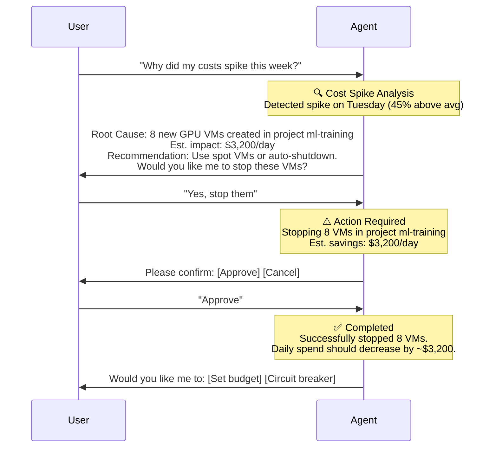

**Legend**: multi-turn conversation showing diagnosis, recommendation, and action confirmation.
```

---

## MCP Tool Definitions

```yaml
# Organization Scanning Tools
scan_organization:
  description: Perform complete scan of GCP organization
  parameters:
    include_services: boolean
    include_billing: boolean
  returns: OrganizationScanResult

list_project_services:
  description: List enabled services for a project
  parameters:
    project_id: string
  returns: ServiceList

# Circuit Breaker Tools
get_circuit_breaker_status:
  description: Get current circuit breaker status
  parameters:
    project_id: string (optional)
  returns: CircuitBreakerStatus

configure_circuit_breaker:
  description: Configure circuit breaker thresholds
  parameters:
    project_id: string
    thresholds: ThresholdConfig[]
    enabled: boolean
    dry_run: boolean
  returns: ConfigurationResult

reset_circuit_breaker:
  description: Reset a tripped circuit breaker
  parameters:
    threshold_name: string
    approval_token: string (optional)
  returns: ResetResult

# Budget Tools
create_budget:
  description: Create budget with multi-threshold alerts
  parameters:
    project_id: string
    monthly_budget_usd: float
    alert_thresholds: float[]
    include_forecasted: boolean
  returns: BudgetResult

list_budgets:
  description: List all configured budgets
  returns: BudgetList

# Real-time Tracking Tools
setup_realtime_monitoring:
  description: Configure Cloud Asset Inventory feed
  parameters:
    resource_types: string[]
    pubsub_topic: string
  returns: MonitoringConfig

get_recent_expensive_resources:
  description: Get recently created expensive resources
  parameters:
    hours_back: int
    min_cost_threshold: float
  returns: ResourceEventList

# Recommendation Tools
get_recommendations:
  description: Get ML-powered cost recommendations
  parameters:
    project_id: string (optional)
    min_savings: float
  returns: RecommendationList

implement_recommendation:
  description: Implement a recommendation
  parameters:
    recommendation_id: string
    dry_run: boolean
  returns: ImplementationResult

# Anomaly Detection Tools
detect_anomalies:
  description: Detect cost anomalies
  parameters:
    project_id: string (optional)
    sensitivity: low | medium | high
  returns: AnomalyList

# Conversational Tool
chat:
  description: Process natural language query
  parameters:
    user_id: string
    message: string
    project_id: string (optional)
  returns: ConversationalResponse
```

---

## Data Flow Summary

```
┌─────────────────────────────────────────────────────────────────────────────┐
│                         COMPLETE DATA FLOW                                   │
├─────────────────────────────────────────────────────────────────────────────┤
│                                                                             │
│   ┌─────────────┐                                                           │
│   │    User     │                                                           │
│   │   Query     │                                                           │
│   └──────┬──────┘                                                           │
│          │                                                                  │
│          ▼                                                                  │
│   ┌─────────────┐     ┌─────────────┐     ┌─────────────┐                  │
│   │   Intent    │────►│   Entity    │────►│   Route to  │                  │
│   │   Classify  │     │   Extract   │     │   Handler   │                  │
│   └─────────────┘     └─────────────┘     └──────┬──────┘                  │
│                                                  │                          │
│          ┌───────────────────────────────────────┼───────────────────┐      │
│          │                                       │                   │      │
│          ▼                                       ▼                   ▼      │
│   ┌─────────────┐                         ┌─────────────┐     ┌───────────┐│
│   │Organization │                         │   Budget    │     │  Anomaly  ││
│   │  Scanner    │                         │   Monitor   │     │  Detector ││
│   └──────┬──────┘                         └──────┬──────┘     └─────┬─────┘│
│          │                                       │                   │      │
│          ▼                                       ▼                   ▼      │
│   ┌─────────────┐                         ┌─────────────┐     ┌───────────┐│
│   │  Resource   │                         │   Budget    │     │ Historical││
│   │  Manager    │                         │    API      │     │   Costs   ││
│   │    API      │                         └─────────────┘     │ (BigQuery)││
│   └─────────────┘                                             └───────────┘│
│          │                                                                  │
│          ▼                                                                  │
│   ┌─────────────┐     ┌─────────────┐     ┌─────────────┐                  │
│   │  Service    │────►│  Billing    │────►│ Recommender │                  │
│   │  Usage API  │     │    API      │     │    API      │                  │
│   └─────────────┘     └─────────────┘     └──────┬──────┘                  │
│                                                  │                          │
│          ┌───────────────────────────────────────┘                          │
│          │                                                                  │
│          ▼                                                                  │
│   ┌─────────────┐     ┌─────────────┐     ┌─────────────┐                  │
│   │   Aggregate │────►│   Format    │────►│   Return    │                  │
│   │   Results   │     │   Response  │     │   to User   │                  │
│   └─────────────┘     └─────────────┘     └─────────────┘                  │
│                                                                             │
│                              ┌───────────┐                                  │
│                              │  Circuit  │◄── Continuous Monitoring         │
│                              │  Breaker  │                                  │
│                              └─────┬─────┘                                  │
│                                    │                                        │
│                                    ▼                                        │
│                           ┌───────────────┐                                 │
│                           │ Auto-Actions  │                                 │
│                           │ (if tripped)  │                                 │
│                           └───────────────┘                                 │
│                                                                             │
└─────────────────────────────────────────────────────────────────────────────┘
```

---

## IAM Requirements

```yaml
Required Permissions:
  
  Organization Level:
    - resourcemanager.organizations.get
    - resourcemanager.folders.list
    - cloudasset.assets.searchAllResources
    - cloudasset.feeds.create
  
  Folder Level:
    - resourcemanager.folders.get
  
  Project Level:
    - resourcemanager.projects.list
    - resourcemanager.projects.get
    - serviceusage.services.list
    - recommender.computeInstanceIdleResourceRecommendations.list
    - recommender.computeInstanceMachineTypeRecommendations.list
    - compute.instances.list
    - compute.instances.stop
    - compute.instances.start
  
  Billing Level:
    - billing.accounts.get
    - billing.budgets.create
    - billing.budgets.list
    - billing.budgets.update
    - billing.resourceCosts.get

Recommended Custom Role:
  name: CostMonitoringAgent
  permissions:
    - All above permissions
```

---

## Summary

This architectural design provides a comprehensive GCP cost monitoring solution that:

| Component | Key Capability |
|-----------|----------------|
| **Organization Scanner** | Complete visibility via Resource Manager + Service Usage APIs |
| **Circuit Breaker** | Automatic cost control with multi-threshold protection |
| **Budget Monitor** | Proactive alerts including forecasted spend |
| **Real-time Tracker** | Instant notification of expensive resource creation |
| **ML Recommendations** | Intelligent optimization suggestions from Recommender API |
| **Anomaly Detection** | Statistical analysis to flag unusual patterns |
| **Conversational Interface** | Natural language queries replacing console expertise |

The architecture enables SMB owners to maintain cloud cost control without requiring deep GCP expertise.
