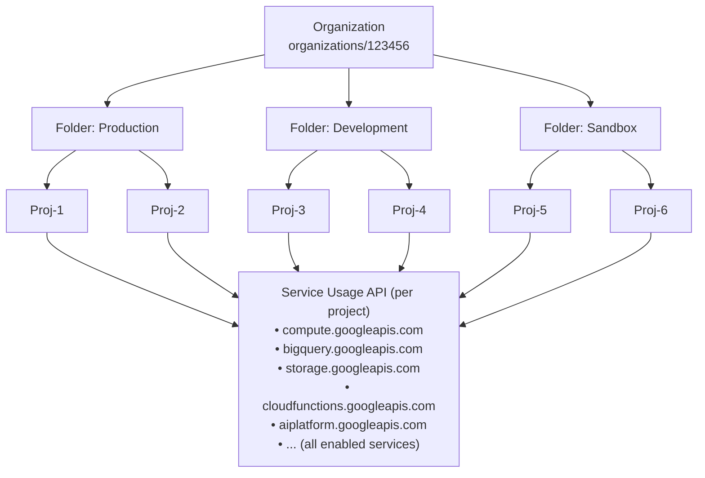
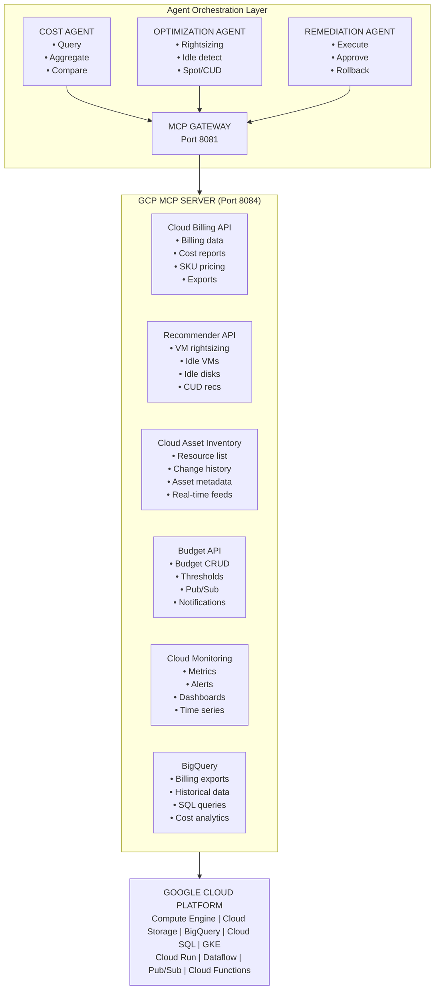
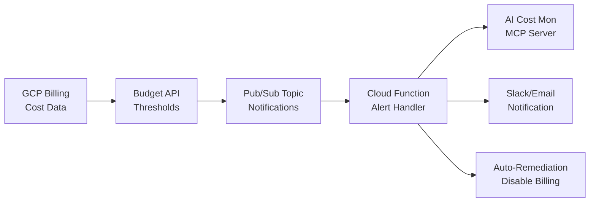

# GCP Agent Architecture: Billing Spike Prevention & Cost Monitoring

## Overview

The GCP Agent is a specialized component within the AI Cost Monitoring system that monitors Google Cloud Platform services to prevent billing spikes and unexpected costs. It operates through the **GCP MCP Server** (Port 8084) and leverages six primary GCP APIs:

1. **Cloud Resource Manager API** — Organization, folder, and project hierarchy traversal
2. **Service Usage API** — Enabled services enumeration per project
3. **Cloud Billing API** — Cost data, billing accounts, and invoice information
4. **Recommender API** — Rightsizing, idle resource detection, commitment recommendations
5. **Cloud Asset Inventory** — Resource discovery, change tracking, metadata analysis
6. **Budget API** — Budget thresholds, alerts, and programmatic notifications

---

## Organization-Wide Monitoring Architecture

The GCP Agent monitors **all enabled services across all projects** in an organization through a hierarchical discovery approach:



**Legend**: organization hierarchy flows from top to bottom, culminating in service enumeration for each project.

### Required IAM Permissions

To monitor all projects and services organization-wide, the service account needs:

| Permission | Resource Level | Purpose |
|------------|----------------|---------|
| `resourcemanager.organizations.get` | Organization | Read org metadata |
| `resourcemanager.folders.list` | Organization | List all folders |
| `resourcemanager.projects.list` | Organization/Folder | List all projects |
| `serviceusage.services.list` | Project | List enabled services |
| `cloudasset.assets.searchAllResources` | Organization | Cross-project resource search |
| `billing.budgets.get` | Billing Account | Read budget status |
| `recommender.computeInstanceIdleResourceRecommendations.list` | Project | Get idle resources |

**Recommended Role:** Create a custom role or use `roles/viewer` + `roles/serviceusage.serviceUsageViewer` at the organization level

---

## Architecture Position



**Legend**: three-tier architecture showing agent orchestration, MCP server with six GCP APIs, and the underlying Google Cloud Platform.

---

## Core Monitoring Capabilities

### 1. Organization-Wide Project & Service Discovery

The GCP Agent first enumerates all projects and their enabled services across the entire organization hierarchy.

**Project Discovery Implementation:**
```python
from google.cloud import resourcemanager_v3
from google.cloud import service_usage_v1
from typing import List, Dict, Any

class GCPOrganizationScanner:
    """
    Scans entire GCP organization to discover all projects and enabled services.
    """
    
    def __init__(self, organization_id: str):
        self.organization_id = organization_id
        self.org_parent = f"organizations/{organization_id}"
        
        # Initialize clients
        self.folders_client = resourcemanager_v3.FoldersClient()
        self.projects_client = resourcemanager_v3.ProjectsClient()
        self.service_usage_client = service_usage_v1.ServiceUsageClient()
    
    async def discover_all_projects(self) -> List[Dict[str, Any]]:
        """
        Recursively discover all projects under the organization.
        Traverses: Organization → Folders (nested) → Projects
        """
        all_projects = []
        
        # 1. Get projects directly under organization
        org_projects = await self._list_projects(self.org_parent)
        all_projects.extend(org_projects)
        
        # 2. Get all folders (including nested) under organization
        all_folders = await self._get_all_folders_recursive(self.org_parent)
        
        # 3. Get projects under each folder
        for folder in all_folders:
            folder_projects = await self._list_projects(folder['name'])
            all_projects.extend(folder_projects)
        
        return all_projects
    
    async def _get_all_folders_recursive(
        self, 
        parent: str, 
        folders: List[Dict] = None
    ) -> List[Dict]:
        """
        Recursively retrieve all folders in the organization hierarchy.
        """
        if folders is None:
            folders = []
        
        request = resourcemanager_v3.ListFoldersRequest(parent=parent)
        
        for folder in self.folders_client.list_folders(request=request):
            folder_info = {
                'name': folder.name,
                'display_name': folder.display_name,
                'parent': folder.parent,
                'state': folder.state.name
            }
            folders.append(folder_info)
            
            # Recursively get nested folders
            await self._get_all_folders_recursive(folder.name, folders)
        
        return folders
    
    async def _list_projects(self, parent: str) -> List[Dict[str, Any]]:
        """
        List all active projects under a parent (org or folder).
        """
        request = resourcemanager_v3.ListProjectsRequest(parent=parent)
        projects = []
        
        for project in self.projects_client.list_projects(request=request):
            if project.state == resourcemanager_v3.Project.State.ACTIVE:
                projects.append({
                    'project_id': project.project_id,
                    'name': project.name,
                    'display_name': project.display_name,
                    'parent': project.parent,
                    'create_time': project.create_time.isoformat(),
                    'labels': dict(project.labels)
                })
        
        return projects
    
    async def get_enabled_services_for_project(
        self, 
        project_id: str
    ) -> List[Dict[str, Any]]:
        """
        List all enabled services for a specific project.
        """
        parent = f"projects/{project_id}"
        request = service_usage_v1.ListServicesRequest(
            parent=parent,
            filter="state:ENABLED"
        )
        
        services = []
        for service in self.service_usage_client.list_services(request=request):
            services.append({
                'name': service.name,
                'service_name': service.config.name,  # e.g., compute.googleapis.com
                'title': service.config.title,
                'state': service.state.name
            })
        
        return services
    
    async def scan_organization_services(self) -> Dict[str, Any]:
        """
        Complete organization scan: all projects and their enabled services.
        Returns a comprehensive map for cost monitoring.
        """
        # Discover all projects
        all_projects = await self.discover_all_projects()
        
        # Build comprehensive service map
        org_services_map = {
            'organization_id': self.organization_id,
            'scan_timestamp': datetime.utcnow().isoformat(),
            'total_projects': len(all_projects),
            'projects': []
        }
        
        # Service aggregation for org-wide view
        service_usage_summary = {}
        
        for project in all_projects:
            project_id = project['project_id']
            
            # Get enabled services for this project
            enabled_services = await self.get_enabled_services_for_project(project_id)
            
            project_entry = {
                **project,
                'enabled_services': enabled_services,
                'service_count': len(enabled_services)
            }
            org_services_map['projects'].append(project_entry)
            
            # Aggregate service usage across org
            for svc in enabled_services:
                svc_name = svc['service_name']
                if svc_name not in service_usage_summary:
                    service_usage_summary[svc_name] = {
                        'title': svc['title'],
                        'enabled_in_projects': []
                    }
                service_usage_summary[svc_name]['enabled_in_projects'].append(project_id)
        
        org_services_map['service_summary'] = service_usage_summary
        org_services_map['unique_services_count'] = len(service_usage_summary)
        
        return org_services_map
```

**Alternative: Cloud Asset Inventory for Organization-Wide Service Scan**

For large organizations, to list the enabled APIs for an organization, run the following command after you set your organization and billing project IDs using Cloud Asset Inventory, which allows exporting the state of all projects under the control of an organization in a single RPC call.

```python
from google.cloud import asset_v1

class GCPAssetBasedServiceScanner:
    """
    Use Cloud Asset Inventory for high-throughput organization-wide service scanning.
    Recommended for organizations with 100+ projects.
    """
    
    def __init__(self, organization_id: str, billing_project_id: str):
        self.organization_id = organization_id
        self.billing_project_id = billing_project_id
        self.client = asset_v1.AssetServiceClient()
    
    async def list_all_enabled_services_org_wide(self) -> List[Dict[str, Any]]:
        """
        List all enabled services across the entire organization using Cloud Asset Inventory.
        Much faster than iterating through each project individually.
        """
        request = asset_v1.SearchAllResourcesRequest(
            scope=f"organizations/{self.organization_id}",
            asset_types=["serviceusage.googleapis.com/Service"],
            page_size=500,
            # Optional: filter by state
            query="state:ENABLED"
        )
        
        services = []
        for asset in self.client.search_all_resources(request=request):
            # Parse project from asset name
            # Format: //serviceusage.googleapis.com/projects/123/services/compute.googleapis.com
            parts = asset.name.split('/')
            project_number = parts[4] if len(parts) > 4 else None
            service_name = parts[-1] if parts else None
            
            services.append({
                'asset_name': asset.name,
                'project_number': project_number,
                'service_name': service_name,
                'display_name': asset.display_name,
                'location': asset.location,
                'labels': dict(asset.labels),
                'state': asset.state
            })
        
        return services
    
    async def list_all_resources_by_type(
        self,
        asset_types: List[str] = None
    ) -> Dict[str, List[Dict]]:
        """
        List all resources across the organization grouped by type.
        
        Common expensive asset types to monitor:
        - compute.googleapis.com/Instance (VMs)
        - compute.googleapis.com/Disk (Persistent disks)
        - sqladmin.googleapis.com/Instance (Cloud SQL)
        - container.googleapis.com/Cluster (GKE clusters)
        - bigquery.googleapis.com/Dataset (BigQuery)
        - storage.googleapis.com/Bucket (Cloud Storage)
        - aiplatform.googleapis.com/Endpoint (Vertex AI)
        """
        if asset_types is None:
            asset_types = [
                "compute.googleapis.com/Instance",
                "compute.googleapis.com/Disk",
                "sqladmin.googleapis.com/Instance",
                "container.googleapis.com/Cluster",
                "bigquery.googleapis.com/Dataset",
                "storage.googleapis.com/Bucket",
                "aiplatform.googleapis.com/Endpoint",
                "cloudfunctions.googleapis.com/CloudFunction",
                "run.googleapis.com/Service",
            ]
        
        resources_by_type = {}
        
        for asset_type in asset_types:
            request = asset_v1.SearchAllResourcesRequest(
                scope=f"organizations/{self.organization_id}",
                asset_types=[asset_type],
                page_size=500
            )
            
            resources = []
            for asset in self.client.search_all_resources(request=request):
                resources.append({
                    'name': asset.name,
                    'asset_type': asset.asset_type,
                    'project': asset.project,
                    'location': asset.location,
                    'display_name': asset.display_name,
                    'labels': dict(asset.labels),
                    'create_time': asset.create_time.isoformat() if asset.create_time else None,
                    'state': asset.state
                })
            
            resources_by_type[asset_type] = {
                'count': len(resources),
                'resources': resources
            }
        
        return resources_by_type
```

### Service Cost Impact Analysis

After discovering all enabled services, the agent correlates them with billing data:

```python
class ServiceCostAnalyzer:
    """
    Analyze cost impact of enabled services across the organization.
    """
    
    # High-cost services that require special monitoring
    HIGH_COST_SERVICES = {
        'compute.googleapis.com': {
            'category': 'Compute',
            'typical_cost': 'HIGH',
            'resources': ['VMs', 'GPUs', 'Persistent Disks']
        },
        'bigquery.googleapis.com': {
            'category': 'Analytics',
            'typical_cost': 'HIGH',
            'resources': ['Queries', 'Storage', 'Streaming']
        },
        'aiplatform.googleapis.com': {
            'category': 'AI/ML',
            'typical_cost': 'VERY_HIGH',
            'resources': ['Training', 'Prediction', 'Custom Jobs']
        },
        'container.googleapis.com': {
            'category': 'Kubernetes',
            'typical_cost': 'HIGH',
            'resources': ['GKE Clusters', 'Node Pools']
        },
        'sqladmin.googleapis.com': {
            'category': 'Database',
            'typical_cost': 'MEDIUM-HIGH',
            'resources': ['Cloud SQL Instances']
        },
        'dataflow.googleapis.com': {
            'category': 'Data Processing',
            'typical_cost': 'HIGH',
            'resources': ['Streaming Jobs', 'Batch Jobs']
        },
        'cloudfunctions.googleapis.com': {
            'category': 'Serverless',
            'typical_cost': 'LOW-MEDIUM',
            'resources': ['Function Invocations']
        },
        'run.googleapis.com': {
            'category': 'Serverless',
            'typical_cost': 'MEDIUM',
            'resources': ['Container Instances']
        },
        'storage.googleapis.com': {
            'category': 'Storage',
            'typical_cost': 'MEDIUM',
            'resources': ['Buckets', 'Objects', 'Egress']
        }
    }
    
    async def analyze_org_service_risk(
        self,
        org_services_map: Dict
    ) -> Dict[str, Any]:
        """
        Analyze cost risk profile based on enabled services.
        """
        risk_analysis = {
            'high_risk_projects': [],
            'service_cost_breakdown': {},
            'recommendations': []
        }
        
        for project in org_services_map['projects']:
            project_risk_score = 0
            high_cost_services_enabled = []
            
            for service in project['enabled_services']:
                svc_name = service['service_name']
                
                if svc_name in self.HIGH_COST_SERVICES:
                    svc_info = self.HIGH_COST_SERVICES[svc_name]
                    
                    if svc_info['typical_cost'] == 'VERY_HIGH':
                        project_risk_score += 10
                    elif svc_info['typical_cost'] == 'HIGH':
                        project_risk_score += 5
                    elif svc_info['typical_cost'] == 'MEDIUM-HIGH':
                        project_risk_score += 3
                    
                    high_cost_services_enabled.append({
                        'service': svc_name,
                        'category': svc_info['category'],
                        'risk_level': svc_info['typical_cost']
                    })
            
            if project_risk_score >= 10:
                risk_analysis['high_risk_projects'].append({
                    'project_id': project['project_id'],
                    'risk_score': project_risk_score,
                    'high_cost_services': high_cost_services_enabled
                })
        
        # Generate recommendations
        if len(risk_analysis['high_risk_projects']) > 0:
            risk_analysis['recommendations'].append({
                'type': 'BUDGET_ALERT',
                'message': f"Create budget alerts for {len(risk_analysis['high_risk_projects'])} high-risk projects",
                'priority': 'HIGH'
            })
        
        # Check for AI services enabled without budgets
        ai_projects = [p for p in org_services_map['projects'] 
                       if any(s['service_name'] == 'aiplatform.googleapis.com' 
                              for s in p['enabled_services'])]
        if ai_projects:
            risk_analysis['recommendations'].append({
                'type': 'AI_MONITORING',
                'message': f"{len(ai_projects)} projects have Vertex AI enabled - monitor GPU/TPU usage closely",
                'priority': 'HIGH',
                'projects': [p['project_id'] for p in ai_projects]
            })
        
        return risk_analysis
```

---

### 2. Cloud Billing API Integration
```python
# GCP MCP Server - Billing data collection
from google.cloud import billing_v1

class GCPBillingCollector:
    def __init__(self, billing_account_id: str):
        self.client = billing_v1.CloudBillingClient()
        self.billing_account = f"billingAccounts/{billing_account_id}"
    
    async def get_cost_breakdown(
        self,
        start_date: str,
        end_date: str,
        granularity: str = "DAILY",
        group_by: list = ["service", "project"]
    ) -> dict:
        """
        Retrieve cost breakdown from GCP billing exports in BigQuery.
        
        The Cloud Billing API itself doesn't provide detailed cost reports;
        cost data must be exported to BigQuery for analysis.
        """
        query = f"""
        SELECT
            invoice.month AS billing_month,
            project.id AS project_id,
            service.description AS service,
            SUM(cost) AS total_cost,
            SUM(IFNULL(credits.amount, 0)) AS total_credits,
            SUM(cost) + SUM(IFNULL(credits.amount, 0)) AS net_cost
        FROM `{self.billing_export_table}`
        LEFT JOIN UNNEST(credits) AS credits
        WHERE DATE(_PARTITIONTIME) BETWEEN '{start_date}' AND '{end_date}'
        GROUP BY billing_month, project_id, service
        ORDER BY net_cost DESC
        """
        return await self.execute_bigquery(query)
```

**Key Billing API Operations:**
| Operation | Purpose | Frequency |
|-----------|---------|-----------|
| `billingAccounts.get` | Retrieve billing account metadata | On-demand |
| `billingAccounts.projects.list` | List projects linked to billing account | Hourly |
| `services.list` | Get available GCP services | Daily |
| `services.skus.list` | Get pricing for specific SKUs | Weekly |
| BigQuery Export | Detailed cost/usage data | Every 1-3 hours |

---

### 3. Budget API: Proactive Threshold Monitoring

The Budget API is the **primary mechanism for preventing billing spikes**. It enables programmatic budget creation, threshold alerts, and automated responses.

**Budget Configuration:**
```python
from google.cloud import billing_budgets_v1

class GCPBudgetManager:
    def __init__(self, billing_account_id: str):
        self.client = billing_budgets_v1.BudgetServiceClient()
        self.parent = f"billingAccounts/{billing_account_id}"
    
    async def create_cost_spike_budget(
        self,
        project_id: str,
        monthly_budget_usd: float,
        alert_thresholds: list = [0.5, 0.8, 0.9, 1.0],
        pubsub_topic: str = None
    ) -> Budget:
        """
        Create a budget with multiple threshold alerts for spike detection.
        """
        budget = billing_budgets_v1.Budget(
            display_name=f"AI-Cost-Monitor-{project_id}",
            budget_filter=billing_budgets_v1.Filter(
                projects=[f"projects/{project_id}"],
                # Can also filter by: services, labels, credit_types
            ),
            amount=billing_budgets_v1.BudgetAmount(
                specified_amount=money_pb2.Money(
                    currency_code="USD",
                    units=int(monthly_budget_usd)
                )
            ),
            threshold_rules=[
                billing_budgets_v1.ThresholdRule(
                    threshold_percent=threshold,
                    spend_basis=billing_budgets_v1.ThresholdRule.Basis.CURRENT_SPEND
                )
                for threshold in alert_thresholds
            ],
            # Enable forecasted cost alerts (catches spikes before they happen)
            threshold_rules_forecasted=[
                billing_budgets_v1.ThresholdRule(
                    threshold_percent=0.8,  # Alert when forecasted to hit 80%
                    spend_basis=billing_budgets_v1.ThresholdRule.Basis.FORECASTED_SPEND
                )
            ],
            notifications_rule=billing_budgets_v1.NotificationsRule(
                pubsub_topic=pubsub_topic,  # For programmatic handling
                schema_version="1.0",
                monitoring_notification_channels=[],  # Cloud Monitoring channels
                disable_default_iam_recipients=False
            )
        )
        
        return self.client.create_budget(parent=self.parent, budget=budget)
```

**Spike Detection Flow:**


**Legend**: budget alert flow from billing data through budget thresholds to multiple notification and remediation channels.

**Budget Alert Payload (Pub/Sub):**
```json
{
  "budgetDisplayName": "AI-Cost-Monitor-my-project",
  "alertThresholdExceeded": 0.8,
  "costAmount": 8500.00,
  "costIntervalStart": "2026-02-01T00:00:00Z",
  "budgetAmount": 10000.00,
  "budgetAmountType": "SPECIFIED_AMOUNT",
  "currencyCode": "USD",
  "forecastedSpend": {
    "amount": 12500.00,
    "forecastedReachDate": "2026-02-28T23:59:59Z"
  }
}
```

---

### 4. Recommender API: Optimization Insights

The Recommender API provides machine-learning-powered insights for cost optimization, identifying idle resources, rightsizing opportunities, and commitment recommendations.

**Recommender Types for Cost Optimization:**

| Recommender ID | Purpose | Data Window |
|----------------|---------|-------------|
| `google.compute.instance.MachineTypeRecommender` | VM rightsizing | 8 days |
| `google.compute.instance.IdleResourceRecommender` | Idle VM detection | 8 days |
| `google.compute.disk.IdleResourceRecommender` | Unattached disk detection | 30 days |
| `google.compute.address.IdleResourceRecommender` | Unused static IPs | 30 days |
| `google.compute.commitment.UsageCommitmentRecommender` | CUD recommendations | 30 days |
| `google.cloudsql.instance.IdleRecommender` | Idle Cloud SQL instances | 30 days |
| `google.storage.bucket.CostInsightsRecommender` | Storage class optimization | 30 days |

**Implementation:**
```python
from google.cloud import recommender_v1

class GCPRecommenderCollector:
    def __init__(self, project_id: str):
        self.client = recommender_v1.RecommenderClient()
        self.project_id = project_id
    
    async def get_idle_vms(self, zone: str = "-") -> list:
        """
        Identify VMs with consistently low CPU/memory utilization.
        """
        parent = (
            f"projects/{self.project_id}/locations/{zone}/"
            f"recommenders/google.compute.instance.IdleResourceRecommender"
        )
        
        recommendations = []
        for rec in self.client.list_recommendations(parent=parent):
            if rec.state.state == recommender_v1.RecommendationStateInfo.State.ACTIVE:
                # Extract cost savings estimate
                primary_impact = rec.primary_impact
                if primary_impact.category == recommender_v1.Impact.Category.COST:
                    savings = primary_impact.cost_projection
                    recommendations.append({
                        "resource": rec.content.operation_groups[0].operations[0].resource,
                        "recommendation": rec.description,
                        "monthly_savings_usd": savings.cost.units + savings.cost.nanos / 1e9,
                        "confidence": rec.priority,
                        "last_refresh": rec.last_refresh_time.isoformat()
                    })
        
        return recommendations
    
    async def get_rightsizing_recommendations(self, zone: str = "-") -> list:
        """
        Get machine type recommendations for oversized VMs.
        Based on CPU/memory metrics from the last 8 days.
        """
        parent = (
            f"projects/{self.project_id}/locations/{zone}/"
            f"recommenders/google.compute.instance.MachineTypeRecommender"
        )
        
        recommendations = []
        for rec in self.client.list_recommendations(parent=parent):
            if rec.state.state == recommender_v1.RecommendationStateInfo.State.ACTIVE:
                content = rec.content
                for op_group in content.operation_groups:
                    for op in op_group.operations:
                        if op.action == "replace":
                            recommendations.append({
                                "vm_name": op.resource.split("/")[-1],
                                "current_machine_type": op.path_filters.get(
                                    "/machineType", "unknown"
                                ),
                                "recommended_machine_type": op.value,
                                "monthly_savings_usd": (
                                    rec.primary_impact.cost_projection.cost.units
                                ),
                                "justification": rec.description
                            })
        
        return recommendations
```

---

### 5. Cloud Asset Inventory: Resource Discovery & Change Tracking

Cloud Asset Inventory provides real-time visibility into all GCP resources, enabling detection of unauthorized or unexpected resource creation that could cause billing spikes.

**Key Capabilities:**
- **Resource Discovery:** List all resources across projects/folders/org
- **Change History:** Track resource create/update/delete events (35-day retention)
- **Real-time Feeds:** Subscribe to resource changes via Pub/Sub
- **IAM Analysis:** Identify over-permissioned resources

**Implementation:**
```python
from google.cloud import asset_v1

class GCPAssetInventory:
    def __init__(self, project_id: str):
        self.client = asset_v1.AssetServiceClient()
        self.project_id = project_id
        self.scope = f"projects/{project_id}"
    
    async def list_compute_resources(self) -> list:
        """
        List all Compute Engine resources to identify potential cost sources.
        """
        request = asset_v1.SearchAllResourcesRequest(
            scope=self.scope,
            asset_types=[
                "compute.googleapis.com/Instance",
                "compute.googleapis.com/Disk",
                "compute.googleapis.com/Address",
                "compute.googleapis.com/Snapshot",
            ],
            page_size=500
        )
        
        resources = []
        for resource in self.client.search_all_resources(request=request):
            resources.append({
                "name": resource.name,
                "asset_type": resource.asset_type,
                "location": resource.location,
                "labels": dict(resource.labels),
                "create_time": resource.create_time.isoformat(),
                "state": resource.state
            })
        
        return resources
    
    async def detect_recent_resource_creation(
        self,
        hours_back: int = 24,
        expensive_types: list = None
    ) -> list:
        """
        Detect recently created resources that could cause billing spikes.
        """
        if expensive_types is None:
            expensive_types = [
                "compute.googleapis.com/Instance",
                "sqladmin.googleapis.com/Instance",
                "container.googleapis.com/Cluster",
                "bigquery.googleapis.com/Dataset",
                "dataflow.googleapis.com/Job",
            ]
        
        cutoff_time = datetime.utcnow() - timedelta(hours=hours_back)
        
        # Get asset history for each type
        new_resources = []
        for asset_type in expensive_types:
            request = asset_v1.BatchGetAssetsHistoryRequest(
                parent=self.scope,
                asset_names=[],  # Get all
                content_type=asset_v1.ContentType.RESOURCE,
                read_time_window=asset_v1.TimeWindow(
                    start_time=cutoff_time,
                    end_time=datetime.utcnow()
                )
            )
            
            # Check for CREATE events
            for asset in self.client.batch_get_assets_history(request=request):
                if asset.window.start_time >= cutoff_time:
                    new_resources.append({
                        "asset": asset.asset.name,
                        "type": asset_type,
                        "created_at": asset.window.start_time.isoformat(),
                        "created_by": self._extract_creator(asset)
                    })
        
        return new_resources
    
    async def setup_realtime_feed(
        self,
        pubsub_topic: str,
        asset_types: list
    ) -> str:
        """
        Create a real-time feed for resource change notifications.
        """
        feed_id = f"cost-monitor-feed-{self.project_id}"
        
        feed = asset_v1.Feed(
            name=f"{self.scope}/feeds/{feed_id}",
            asset_types=asset_types,
            content_type=asset_v1.ContentType.RESOURCE,
            feed_output_config=asset_v1.FeedOutputConfig(
                pubsub_destination=asset_v1.PubsubDestination(
                    topic=pubsub_topic
                )
            ),
            condition=asset_v1.Expr(
                expression='temporal_asset.deleted == false'  # Only creations
            )
        )
        
        request = asset_v1.CreateFeedRequest(
            parent=self.scope,
            feed_id=feed_id,
            feed=feed
        )
        
        created_feed = self.client.create_feed(request=request)
        return created_feed.name
```

---

## Spike Prevention Strategies

### Strategy 1: Multi-Layer Threshold Alerts

```python
class SpikePrevention:
    """
    Implement multi-layer threshold monitoring for comprehensive spike detection.
    """
    
    THRESHOLD_LEVELS = {
        "warning": 0.5,      # 50% - Yellow alert
        "elevated": 0.7,     # 70% - Orange alert  
        "critical": 0.9,     # 90% - Red alert
        "exceeded": 1.0,     # 100% - Budget exceeded
        "forecasted": 0.8,   # 80% forecasted - Proactive alert
    }
    
    async def configure_comprehensive_monitoring(
        self,
        project_id: str,
        monthly_budget: float
    ):
        # 1. Create budget with multiple thresholds
        budget = await self.budget_manager.create_cost_spike_budget(
            project_id=project_id,
            monthly_budget_usd=monthly_budget,
            alert_thresholds=[0.5, 0.7, 0.9, 1.0],
            pubsub_topic=f"projects/{project_id}/topics/budget-alerts"
        )
        
        # 2. Set up real-time resource monitoring
        feed = await self.asset_inventory.setup_realtime_feed(
            pubsub_topic=f"projects/{project_id}/topics/resource-changes",
            asset_types=[
                "compute.googleapis.com/Instance",
                "compute.googleapis.com/Disk",
                "sqladmin.googleapis.com/Instance",
            ]
        )
        
        # 3. Schedule daily recommender checks
        await self.scheduler.create_job(
            name=f"daily-optimization-scan-{project_id}",
            schedule="0 6 * * *",  # 6 AM daily
            target=self.run_optimization_scan,
            args={"project_id": project_id}
        )
        
        return {
            "budget_id": budget.name,
            "feed_id": feed,
            "scan_schedule": "daily at 6:00 AM"
        }
```

### Strategy 2: Anomaly Detection

```python
class CostAnomalyDetector:
    """
    Detect unusual spending patterns that may indicate billing spikes.
    """
    
    async def detect_anomalies(
        self,
        project_id: str,
        lookback_days: int = 30,
        threshold_std_devs: float = 2.0
    ) -> list:
        # Get historical daily costs
        costs = await self.billing_collector.get_daily_costs(
            project_id=project_id,
            days=lookback_days
        )
        
        # Calculate baseline statistics
        mean_cost = statistics.mean(costs)
        std_dev = statistics.stdev(costs)
        threshold = mean_cost + (threshold_std_devs * std_dev)
        
        # Get today's cost (or latest available)
        current_cost = await self.billing_collector.get_current_day_cost(project_id)
        
        anomalies = []
        if current_cost > threshold:
            anomalies.append({
                "type": "COST_SPIKE",
                "severity": self._calculate_severity(current_cost, mean_cost, std_dev),
                "current_cost": current_cost,
                "expected_cost": mean_cost,
                "threshold": threshold,
                "percent_above_average": ((current_cost - mean_cost) / mean_cost) * 100,
                "message": f"Today's cost (${current_cost:.2f}) is {(current_cost - mean_cost) / std_dev:.1f} standard deviations above the 30-day average (${mean_cost:.2f})"
            })
        
        # Also check for service-level anomalies
        service_anomalies = await self._detect_service_anomalies(
            project_id, lookback_days, threshold_std_devs
        )
        anomalies.extend(service_anomalies)
        
        return anomalies
    
    async def _detect_service_anomalies(
        self,
        project_id: str,
        lookback_days: int,
        threshold_std_devs: float
    ) -> list:
        """
        Detect anomalies at the individual service level.
        Catches cases where a single service spikes while total remains normal.
        """
        services_to_monitor = [
            "Compute Engine",
            "Cloud Storage",
            "BigQuery",
            "Cloud SQL",
            "Kubernetes Engine",
            "Cloud Run",
            "Dataflow",
        ]
        
        anomalies = []
        for service in services_to_monitor:
            service_costs = await self.billing_collector.get_service_daily_costs(
                project_id=project_id,
                service=service,
                days=lookback_days
            )
            
            if len(service_costs) < 7:  # Need at least a week of data
                continue
            
            mean_cost = statistics.mean(service_costs)
            std_dev = statistics.stdev(service_costs) if len(service_costs) > 1 else 0
            
            if std_dev == 0:
                continue
            
            current = service_costs[-1]
            threshold = mean_cost + (threshold_std_devs * std_dev)
            
            if current > threshold:
                anomalies.append({
                    "type": "SERVICE_SPIKE",
                    "service": service,
                    "current_cost": current,
                    "expected_cost": mean_cost,
                    "percent_increase": ((current - mean_cost) / mean_cost) * 100
                })
        
        return anomalies
```

### Strategy 3: Proactive Resource Monitoring

```python
class ProactiveResourceMonitor:
    """
    Monitor resource creation and configuration changes that could lead to
    unexpected costs before they appear on the bill.
    """
    
    EXPENSIVE_MACHINE_TYPES = [
        "n2-highmem-128",
        "n2-highcpu-96",
        "a2-highgpu-8g",
        "a2-megagpu-16g",
        "m2-ultramem-416",
    ]
    
    async def analyze_new_resource(self, resource_event: dict) -> dict:
        """
        Analyze a newly created resource for potential cost impact.
        Called via Pub/Sub subscription to Cloud Asset Inventory feed.
        """
        asset_type = resource_event.get("asset_type")
        resource_data = resource_event.get("resource", {}).get("data", {})
        
        analysis = {
            "resource_name": resource_event.get("name"),
            "asset_type": asset_type,
            "potential_monthly_cost": 0,
            "warnings": [],
            "recommendations": []
        }
        
        if asset_type == "compute.googleapis.com/Instance":
            machine_type = resource_data.get("machineType", "").split("/")[-1]
            zone = resource_data.get("zone", "").split("/")[-1]
            
            # Get pricing for this machine type
            hourly_cost = await self._get_vm_hourly_cost(machine_type, zone)
            monthly_cost = hourly_cost * 730  # Hours per month
            
            analysis["potential_monthly_cost"] = monthly_cost
            
            # Check for expensive configurations
            if machine_type in self.EXPENSIVE_MACHINE_TYPES:
                analysis["warnings"].append({
                    "type": "EXPENSIVE_MACHINE_TYPE",
                    "message": f"High-cost machine type: {machine_type}",
                    "monthly_estimate": monthly_cost
                })
            
            # Check for attached GPUs
            guest_accelerators = resource_data.get("guestAccelerators", [])
            if guest_accelerators:
                gpu_type = guest_accelerators[0].get("acceleratorType", "")
                gpu_count = guest_accelerators[0].get("acceleratorCount", 0)
                gpu_cost = await self._get_gpu_hourly_cost(gpu_type, zone) * gpu_count * 730
                
                analysis["potential_monthly_cost"] += gpu_cost
                analysis["warnings"].append({
                    "type": "GPU_ATTACHED",
                    "message": f"{gpu_count}x {gpu_type} GPU(s) attached",
                    "additional_monthly_cost": gpu_cost
                })
            
            # Check scheduling - no sustained use discount if short-lived
            scheduling = resource_data.get("scheduling", {})
            if scheduling.get("preemptible") or scheduling.get("provisioningModel") == "SPOT":
                analysis["recommendations"].append({
                    "type": "SPOT_VM",
                    "message": "Using Spot/Preemptible VM - good for cost savings",
                    "discount": "60-91% off on-demand pricing"
                })
            else:
                analysis["recommendations"].append({
                    "type": "CONSIDER_SPOT",
                    "message": "Consider Spot VMs if workload is fault-tolerant",
                    "potential_savings": f"${monthly_cost * 0.7:.2f}/month"
                })
        
        elif asset_type == "sqladmin.googleapis.com/Instance":
            tier = resource_data.get("settings", {}).get("tier", "")
            analysis["potential_monthly_cost"] = await self._get_cloudsql_monthly_cost(tier)
            
            # Check for high-availability (doubles the cost)
            if resource_data.get("settings", {}).get("availabilityType") == "REGIONAL":
                analysis["warnings"].append({
                    "type": "HA_ENABLED",
                    "message": "High Availability enabled - cost is approximately doubled",
                })
        
        return analysis
```

---

## MCP Server Tool Definitions

The GCP MCP Server exposes these tools to the agent layer:

### Organization & Project Discovery Tools

```python
# GCP MCP Server - Organization-Wide Monitoring Tools
from fastmcp import FastMCP

mcp = FastMCP("gcp-cost-monitoring")

@mcp.tool()
async def list_all_projects(
    organization_id: str = None,
    include_folders: bool = True
) -> dict:
    """
    List all projects in the GCP organization.
    
    Args:
        organization_id: GCP organization ID (uses default if not specified)
        include_folders: Include folder hierarchy information
    
    Returns:
        Complete list of projects with hierarchy information
    """
    scanner = GCPOrganizationScanner(organization_id)
    projects = await scanner.discover_all_projects()
    
    return {
        'organization_id': organization_id,
        'total_projects': len(projects),
        'projects': projects
    }

@mcp.tool()
async def list_enabled_services(
    project_id: str = None,
    organization_wide: bool = False,
    service_filter: str = None
) -> dict:
    """
    List enabled services for a project or entire organization.
    
    Args:
        project_id: Specific project ID (required if organization_wide=False)
        organization_wide: Scan all projects in the organization
        service_filter: Filter services by name pattern (e.g., "compute", "ai")
    
    Returns:
        List of enabled services with metadata
    """
    if organization_wide:
        scanner = GCPAssetBasedServiceScanner(organization_id, billing_project_id)
        services = await scanner.list_all_enabled_services_org_wide()
    else:
        scanner = GCPOrganizationScanner(organization_id)
        services = await scanner.get_enabled_services_for_project(project_id)
    
    # Apply filter if specified
    if service_filter:
        services = [s for s in services if service_filter.lower() in s['service_name'].lower()]
    
    return {
        'scope': 'organization' if organization_wide else f'project/{project_id}',
        'total_services': len(services),
        'services': services
    }

@mcp.tool()
async def scan_organization_resources(
    organization_id: str = None,
    resource_types: list[str] = None,
    include_cost_estimate: bool = True
) -> dict:
    """
    Scan all resources across the organization that could incur costs.
    
    Args:
        organization_id: GCP organization ID
        resource_types: Filter by specific resource types (e.g., compute.googleapis.com/Instance)
        include_cost_estimate: Include estimated monthly cost for each resource
    
    Returns:
        Complete resource inventory grouped by type and project
    """
    scanner = GCPAssetBasedServiceScanner(organization_id, billing_project_id)
    resources = await scanner.list_all_resources_by_type(resource_types)
    
    if include_cost_estimate:
        # Enrich with cost estimates
        for resource_type, data in resources.items():
            for resource in data['resources']:
                resource['estimated_monthly_cost'] = await estimate_resource_cost(
                    resource_type, resource
                )
    
    return {
        'organization_id': organization_id,
        'scan_timestamp': datetime.utcnow().isoformat(),
        'resource_types_scanned': len(resources),
        'resources': resources
    }

@mcp.tool()
async def get_service_cost_risk_analysis(
    organization_id: str = None
) -> dict:
    """
    Analyze cost risk based on enabled services across the organization.
    
    Returns:
        Risk analysis with high-risk projects and recommendations
    """
    scanner = GCPOrganizationScanner(organization_id)
    org_services = await scanner.scan_organization_services()
    
    analyzer = ServiceCostAnalyzer()
    risk_analysis = await analyzer.analyze_org_service_risk(org_services)
    
    return {
        'organization_id': organization_id,
        'total_projects': org_services['total_projects'],
        'unique_services': org_services['unique_services_count'],
        'risk_analysis': risk_analysis
    }
```

### Cost Monitoring Tools

```python
@mcp.tool()
async def get_gcp_billing_data(
    project_id: str,
    start_date: str,
    end_date: str,
    group_by: list[str] = ["service", "sku"]
) -> dict:
    """
    Retrieve GCP billing data for a project within a date range.
    
    Args:
        project_id: GCP project ID
        start_date: Start date (YYYY-MM-DD)
        end_date: End date (YYYY-MM-DD)
        group_by: Dimensions to group by (service, sku, project, label)
    
    Returns:
        Cost breakdown grouped by specified dimensions
    """
    return await billing_collector.get_cost_breakdown(
        project_id=project_id,
        start_date=start_date,
        end_date=end_date,
        group_by=group_by
    )

@mcp.tool()
async def get_gcp_recommendations(
    project_id: str,
    recommendation_types: list[str] = ["idle_vm", "rightsizing", "cud"]
) -> list[dict]:
    """
    Get cost optimization recommendations from GCP Recommender API.
    
    Args:
        project_id: GCP project ID
        recommendation_types: Types of recommendations to fetch
            - idle_vm: Idle VM instances
            - rightsizing: Machine type recommendations  
            - idle_disk: Unattached persistent disks
            - cud: Committed use discount recommendations
    
    Returns:
        List of actionable recommendations with savings estimates
    """
    recommendations = []
    
    if "idle_vm" in recommendation_types:
        recommendations.extend(
            await recommender_collector.get_idle_vms(project_id)
        )
    
    if "rightsizing" in recommendation_types:
        recommendations.extend(
            await recommender_collector.get_rightsizing_recommendations(project_id)
        )
    
    if "idle_disk" in recommendation_types:
        recommendations.extend(
            await recommender_collector.get_idle_disks(project_id)
        )
    
    if "cud" in recommendation_types:
        recommendations.extend(
            await recommender_collector.get_cud_recommendations(project_id)
        )
    
    return recommendations

@mcp.tool()
async def list_gcp_resources(
    project_id: str,
    resource_types: list[str] = None,
    labels: dict = None
) -> list[dict]:
    """
    List GCP resources using Cloud Asset Inventory.
    
    Args:
        project_id: GCP project ID
        resource_types: Filter by resource types (e.g., compute.googleapis.com/Instance)
        labels: Filter by resource labels
    
    Returns:
        List of resources with metadata
    """
    return await asset_inventory.list_resources(
        project_id=project_id,
        asset_types=resource_types,
        labels=labels
    )

@mcp.tool()
async def create_budget_alert(
    project_id: str,
    budget_amount_usd: float,
    alert_thresholds: list[float] = [0.5, 0.8, 1.0],
    include_forecasted: bool = True
) -> dict:
    """
    Create a budget with alert thresholds for a GCP project.
    
    Args:
        project_id: GCP project ID
        budget_amount_usd: Monthly budget in USD
        alert_thresholds: Percentage thresholds for alerts (0.0-1.0)
        include_forecasted: Also alert on forecasted overspend
    
    Returns:
        Created budget details
    """
    return await budget_manager.create_cost_spike_budget(
        project_id=project_id,
        monthly_budget_usd=budget_amount_usd,
        alert_thresholds=alert_thresholds,
        include_forecasted=include_forecasted
    )

@mcp.tool()
async def detect_cost_anomalies(
    project_id: str,
    lookback_days: int = 30,
    sensitivity: str = "medium"
) -> list[dict]:
    """
    Detect unusual spending patterns that may indicate billing spikes.
    
    Args:
        project_id: GCP project ID
        lookback_days: Historical days to analyze
        sensitivity: Detection sensitivity (low, medium, high)
    
    Returns:
        List of detected anomalies with details
    """
    threshold_map = {"low": 3.0, "medium": 2.0, "high": 1.5}
    threshold_std_devs = threshold_map.get(sensitivity, 2.0)
    
    return await anomaly_detector.detect_anomalies(
        project_id=project_id,
        lookback_days=lookback_days,
        threshold_std_devs=threshold_std_devs
    )

@mcp.tool()
async def get_resource_change_history(
    project_id: str,
    resource_name: str = None,
    hours_back: int = 24
) -> list[dict]:
    """
    Get recent resource changes that could impact costs.
    
    Args:
        project_id: GCP project ID
        resource_name: Specific resource to track (optional)
        hours_back: Hours of history to retrieve
    
    Returns:
        List of resource changes with timestamps and actors
    """
    return await asset_inventory.get_change_history(
        project_id=project_id,
        resource_name=resource_name,
        hours_back=hours_back
    )
```

---

## Conversational Examples

**Example 1: Cost Query**
```
User: "Why did my GCP bill spike last week?"

Agent: I'll analyze your GCP costs for the past week.

[Calls get_gcp_billing_data, detect_cost_anomalies, get_resource_change_history]

Your GCP spending increased 340% last week ($2,847 → $12,521). Here's what I found:

🔴 **Root Cause: GPU Instance Left Running**
- 4x a2-highgpu-8g instances were created on Jan 15 by user@company.com
- These ran continuously for 7 days at $12.50/hour each
- Total GPU cost: $8,400 (67% of weekly spend)

📊 **Other Contributing Factors:**
- BigQuery queries increased 45% ($890 → $1,290)
- Cloud Storage egress doubled ($340 → $680)

💡 **Recommendations:**
1. Stop the 4 GPU instances immediately (saves $350/day)
2. The instances appear idle (0% GPU utilization) - consider deleting
3. Set up budget alerts at $3,000/week to catch future spikes

Would you like me to stop these instances now?
```

**Example 2: Proactive Alert**
```
[Budget alert received via Pub/Sub: 80% forecasted threshold]

Agent: ⚠️ **GCP Budget Alert - Forecasted Overspend**

Your project "ml-training-prod" is forecasted to exceed the $10,000 monthly budget by ~25%.

**Current Status:**
- Month-to-date spend: $6,200 (Day 15 of 28)
- Forecasted end-of-month: $12,500
- Budget: $10,000

**Cost Drivers:**
1. Compute Engine: $4,100 (+35% vs. last month)
   - 12 n2-standard-32 instances running
   - 3 appear underutilized (<15% CPU)

2. BigQuery: $1,800 (+80% vs. last month)
   - Large scans on partitioned tables without filters

**Recommended Actions:**
1. Rightsize 3 underutilized VMs → saves ~$800/month
2. Add partition filters to BigQuery queries → saves ~$600/month
3. Consider Spot VMs for batch workloads → saves ~$1,200/month

Implement these changes? [Approve] [Review Details]
```

---

## Summary

The GCP Agent prevents billing spikes through:

1. **Proactive Budget Monitoring** — Multi-threshold alerts including forecasted spend
2. **Real-time Resource Tracking** — Cloud Asset Inventory feeds for instant notification of expensive resource creation
3. **ML-Powered Recommendations** — Recommender API for idle resources, rightsizing, and CUD opportunities
4. **Anomaly Detection** — Statistical analysis of historical costs to flag unusual spending patterns
5. **Conversational Interface** — Natural language queries that replace the need for GCP console expertise

The combination of these capabilities enables SMB owners to maintain cost control without cloud engineering expertise, addressing the core value proposition of AI Cost Monitoring.
