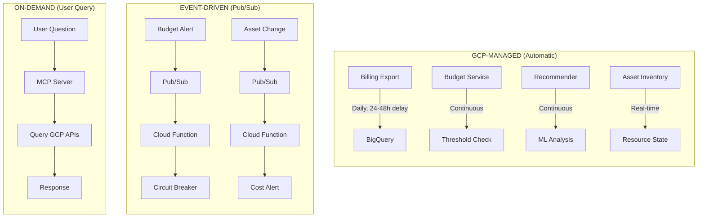
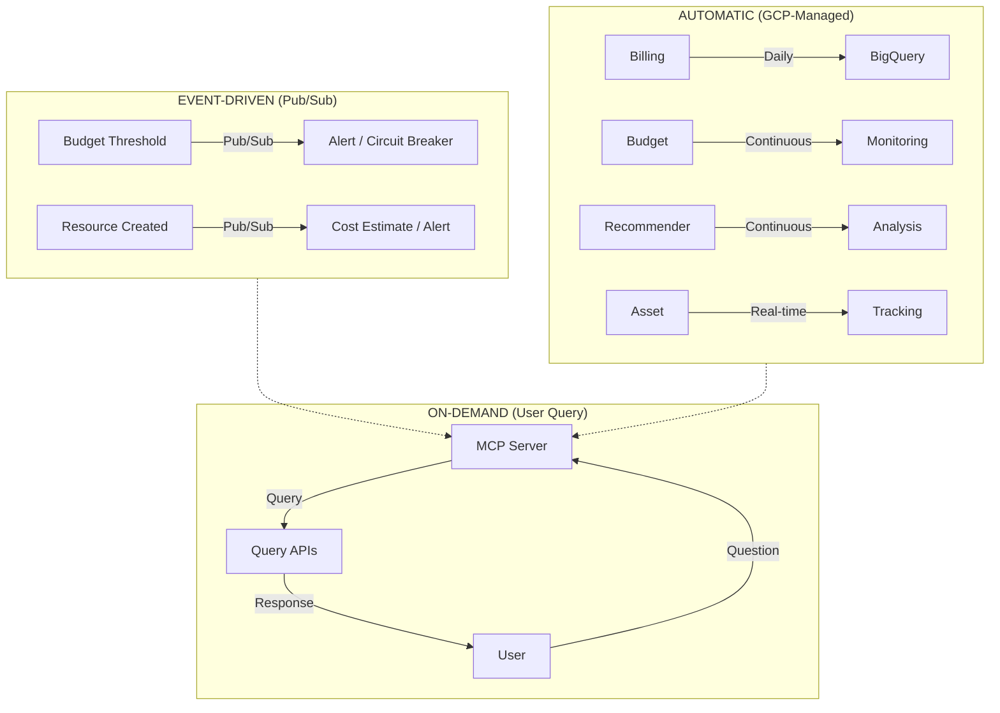

# GCP Cost Monitoring Agent — Technical Summary

## Project Overview

**Product:** Conversational AI agent for GCP cost monitoring and optimization

**Target Market:** SMBs with $50K-$500K monthly cloud spend lacking dedicated FinOps expertise

**Core Problem:** 30-47% of SMB cloud spend is wasted due to lack of visibility and optimization resources

---

## Technical Architecture

### Architecture Pattern

```
Stateless MCP Server (Cloud Run) → GCP Built-in APIs → User Response
```

### Design Principles

| Principle | Implementation |
|-----------|----------------|
| **Use GCP Built-in Tools** | No custom databases, no polling infrastructure |
| **Stateless Server** | All state stored in GCP services |
| **Event-Driven** | Budget alerts and Asset feeds via Pub/Sub |
| **On-Demand Queries** | API calls only when user asks |
| **Minimal Infrastructure** | Cloud Run + optional Cloud Function |

### Infrastructure Cost

| Component | Monthly Cost |
|-----------|-------------|
| MCP Server (Cloud Run) | $10-50 |
| Cloud Function (optional) | $5 |
| BigQuery queries | $5-20 |
| **Total** | **$20-80** |

---

## Triggers, Schedules & Data Collection

### Data Collection Overview



**Legend**: Three modes of data collection: Automatic (GCP), Event-Driven (Pub/Sub), and On-Demand (User Query).

### Trigger Types

| Trigger Type | Mechanism | Who Manages | Our Action |
|--------------|-----------|-------------|------------|
| **Scheduled** | GCP Billing Export | Google | None (automatic) |
| **Continuous** | Budget monitoring | Google | None (automatic) |
| **Continuous** | Recommender analysis | Google | None (automatic) |
| **Real-time Event** | Asset Inventory Feed | Google → Pub/Sub | React via Cloud Function |
| **Threshold Event** | Budget Alert | Google → Pub/Sub | React via Cloud Function |
| **On-demand** | User query | User | Query APIs, return response |

### Usage Statistics Collection

#### What GCP Collects Automatically

| Data Type | Source | Update Frequency | Storage | Retention |
|-----------|--------|------------------|---------|-----------|
| **Cost Data** | Billing Export | Daily (batch) | BigQuery | Configurable (default: unlimited) |
| **Resource Metrics** | Cloud Monitoring | 1-minute intervals | Cloud Monitoring | 6 weeks (free tier) |
| **Resource Inventory** | Asset Inventory | Real-time | Asset Inventory | Current state + history |
| **Recommendations** | Recommender API | Continuous | Recommender | Until acted upon |
| **Budget Status** | Budget API | Real-time | Budget Service | Current state |

#### BigQuery Billing Export (Primary Data Source)

**What's collected:**
```
- billing_account_id
- project.id, project.name, project.labels
- service.id, service.description
- sku.id, sku.description
- usage_start_time, usage_end_time
- usage.amount, usage.unit
- cost (before credits)
- credits (discounts, CUDs, sustained use)
- currency, currency_conversion_rate
- location.region, location.zone
- resource.name, resource.global_name
- labels (resource labels)
- tags (resource tags)
```

**Export schedule:** 
- GCP exports billing data to BigQuery automatically
- Frequency: Multiple times per day (batch)
- Delay: 24-48 hours behind real-time
- No action required from us

#### Cloud Monitoring Metrics (Optional)

**Available metrics we can query:**
```
- compute.googleapis.com/instance/cpu/utilization
- compute.googleapis.com/instance/network/received_bytes_count
- compute.googleapis.com/instance/disk/read_bytes_count
- cloudsql.googleapis.com/database/cpu/utilization
- container.googleapis.com/container/cpu/utilization
```

**Usage:** Query on-demand for detailed resource utilization (supports anomaly investigation)

### Scheduled Jobs

#### We Do NOT Need Scheduled Jobs Because:

| Traditional Approach | Our Approach |
|---------------------|--------------|
| ❌ Cron job to poll billing API | ✅ Query BigQuery on user request |
| ❌ Scheduled job to check budgets | ✅ GCP Budget Service monitors continuously |
| ❌ Periodic scan for idle resources | ✅ GCP Recommender runs continuously |
| ❌ Polling for resource changes | ✅ Asset Inventory Feed pushes events |

#### Optional: Daily Summary (If Desired)

If business requires a daily summary email/Slack message:

| Component | Schedule | Purpose |
|-----------|----------|---------|
| Cloud Scheduler | Daily 8:00 AM | Trigger summary job |
| Cloud Function | On trigger | Query BigQuery, format summary |
| Output | Email/Slack | Daily cost summary to stakeholders |

**This is optional** — users can ask the agent anytime instead.

### Event Flow Details

#### Budget Alert Flow

```
1. GCP Budget Service monitors spend (continuous)
2. Threshold reached (e.g., 80% of budget)
3. GCP publishes to Pub/Sub topic
4. Cloud Function triggered (< 1 second)
5. Function evaluates circuit breaker rules
6. Action executed (alert, stop resources, etc.)
7. Notification sent (Slack, email)
```

**Latency:** Near real-time (seconds)

#### Asset Change Flow

```
1. User creates resource in GCP Console/CLI/API
2. Asset Inventory detects change (real-time)
3. Feed publishes to Pub/Sub topic
4. Cloud Function triggered
5. Function estimates resource cost
6. If cost > threshold: send alert
7. Optionally: trigger circuit breaker
```

**Latency:** Near real-time (seconds to minutes)

#### User Query Flow

```
1. User asks: "Why did costs spike this week?"
2. MCP Server receives query
3. Intent classified: SPIKE_ANALYSIS
4. Server queries BigQuery (cost data)
5. Server queries Recommender (suggestions)
6. Anomaly detection runs (statistical analysis)
7. Response formatted and returned
8. User sees answer with suggested actions
```

**Latency:** 2-5 seconds typical

### Data Freshness

| Data Type | Freshness | Notes |
|-----------|-----------|-------|
| Cost data (BigQuery) | 24-48 hours | GCP billing export delay |
| Budget status | Real-time | Current spend vs budget |
| Recommendations | 8+ days lag | Needs usage history |
| Resource inventory | Real-time | Current state |
| Resource changes | Real-time | Via Asset Feed |
| Metrics | 1 minute | Cloud Monitoring |

### What We Store vs What GCP Stores

| Data | Storage Location | Managed By |
|------|------------------|------------|
| Cost history | BigQuery | GCP (billing export) |
| Budget configuration | Budget API | GCP |
| Recommendations | Recommender API | GCP |
| Resource state | Asset Inventory | GCP |
| Circuit breaker state | Firestore (optional) | Us |
| Conversation context | In-memory (per request) | Us |
| Audit logs | Cloud Logging | GCP |

**Key insight:** We store almost nothing. GCP stores everything.

---

## Component Summary

### 6 Core Components

| # | Component | Purpose | Trigger |
|---|-----------|---------|---------|
| 1 | **Organization Scanner** | Discover projects, services, hierarchy | On-demand |
| 2 | **Circuit Breaker** | Auto-stop resources at cost thresholds | Event-driven (Pub/Sub) |
| 3 | **Budget Monitor** | Multi-threshold alerts with forecasting | GCP-managed |
| 4 | **Real-time Tracker** | Detect expensive resource creation | Event-driven (Asset Feed) |
| 5 | **ML Recommendations** | Surface GCP optimization suggestions | On-demand |
| 6 | **Anomaly Detector** | Statistical spike detection | On-demand |

### Circuit Breaker Thresholds

The circuit breaker operates on two levels: per-service thresholds and overall thresholds.

**Per-Service Thresholds (Examples):**

| Service | Level | Threshold | Action |
|---------|-------|-----------|--------|
| Vertex AI | WARNING | $500/day | Alert only |
| | CRITICAL | $2,500/day | Stop non-production endpoints |
| Compute Engine | WARNING | $300/day | Alert only |
| | CRITICAL | $1,500/day | Stop non-production VMs |
| BigQuery | WARNING | $200/day | Alert only |
| | CRITICAL | $1,000/day | Throttle queries |

**Overall Thresholds (Safety Net):**

| Level | Threshold | Action |
|-------|-----------|--------|
| WARNING | $1,000/day total | Alert only |
| ELEVATED | $2,500/day total | Alert + escalation |
| CRITICAL | $5,000/day total | Stop high-cost resources |
| EMERGENCY | $10,000/day total | Disable billing |

### Service Risk Classification

| Risk | Services |
|------|----------|
| CRITICAL | Vertex AI (aiplatform) |
| HIGH | Compute Engine, BigQuery, GKE, Dataflow |
| MEDIUM | Cloud SQL, Dataproc, Cloud Run |
| LOW | Cloud Functions, Cloud Storage |

---

## GCP API Integration

### APIs Used

| API | Purpose | Access Pattern |
|-----|---------|----------------|
| Resource Manager v3 | Org/folder/project hierarchy | On-demand |
| Service Usage | Enabled services per project | On-demand |
| Budget API | Threshold alerts, forecasting | Managed + on-demand |
| Cloud Asset Inventory | Resource tracking, change feeds | Managed + on-demand |
| Recommender API | ML optimization suggestions | On-demand |
| BigQuery | Billing export queries | On-demand |
| Compute Engine | Stop/start VMs | On user approval |
| Pub/Sub | Event delivery | Event-driven |
| Cloud Monitoring | Resource metrics (optional) | On-demand |

### BigQuery Queries (6 Types)

| Query | Purpose | When Used |
|-------|---------|-----------|
| Daily cost summary | Aggregate by day for trends | Cost queries, forecasting |
| Service breakdown | Cost grouped by service | Breakdown requests |
| Project breakdown | Cost grouped by project | Breakdown requests |
| Cost comparison | Current vs previous period | Comparison queries |
| Anomaly baseline | Mean + standard deviation | Anomaly detection |
| Forecasting | Linear projection for month-end | Forecast queries |

---

## MCP Tool Interface

### 10 Tools

| Tool | Purpose | Approval Required |
|------|---------|-------------------|
| `scan_organization` | Discover projects & services | No |
| `get_cost_summary` | Retrieve cost data | No |
| `get_recommendations` | ML optimization suggestions | No |
| `detect_anomalies` | Statistical analysis | No |
| `get_budget_status` | Check budget utilization | No |
| `create_budget` | Create new budget | No |
| `get_circuit_breaker_status` | Check breaker state | No |
| `configure_circuit_breaker` | Update settings | Yes |
| `stop_resource` | Stop VM/endpoint | Yes |
| `chat` | Natural language router | No |

---

## Conversational Interface

### Supported Intents

| Intent | Example Query |
|--------|---------------|
| COST_QUERY | "How much did I spend this month?" |
| SPIKE_ANALYSIS | "Why did costs increase?" |
| RECOMMENDATION | "How can I save money?" |
| BUDGET_STATUS | "Am I over my limit?" |
| ANOMALY_CHECK | "Is spending normal?" |
| CIRCUIT_BREAKER | "Show cost protection status" |
| RESOURCE_ACTION | "Stop that idle VM" |
| HELP | "What can you do?" |

### Entity Extraction

- `project_id` — GCP project identifier
- `service` — GCP service name
- `time_period` — Date range reference
- `amount` — Dollar amounts
- `resource_name` — Specific resource

---

## Security Model

### Service Account Permissions

**Organization Level:**
- `roles/browser`
- `roles/resourcemanager.folderViewer`
- `roles/resourcemanager.projectViewer`
- `roles/serviceusage.serviceUsageViewer`
- `roles/cloudasset.viewer`
- `roles/recommender.computeViewer`

**Billing Account Level:**
- `roles/billing.viewer`
- `roles/billing.budgetsViewer`
- `roles/billing.budgetsEditor`

**Project Level (for actions):**
- `roles/compute.instanceAdmin.v1`
- `roles/bigquery.dataViewer`
- `roles/bigquery.jobUser`

### Safety Features

- User approval required for destructive actions
- Dry-run mode for circuit breaker testing
- Cooldown periods prevent action flapping
- Audit logging of all actions

---

## Anomaly Detection

### Detection Methods

| Method | Logic | Threshold |
|--------|-------|-----------|
| Daily Spike | Today > mean + 2σ | 30-day baseline |
| Service Spike | Service cost > historical + 2σ | Per-service |
| Sustained Increase | 5-day avg > historical + 20% | Trend detection |
| New Service | >$100 from unused service | New cost source |

### Sensitivity Levels

| Level | Standard Deviations |
|-------|---------------------|
| LOW | 3σ |
| MEDIUM | 2σ (default) |
| HIGH | 1.5σ |

---

## Deployment

### Prerequisites

1. GCP Organization
2. Billing Account with export enabled
3. BigQuery dataset for billing data
4. Pub/Sub topic for alerts
5. Service account with IAM roles

### One-Time Setup Steps

| Step | Action | GCP Service |
|------|--------|-------------|
| 1 | Enable Billing Export | Billing → BigQuery |
| 2 | Create Service Account | IAM |
| 3 | Assign IAM Roles | IAM |
| 4 | Create Pub/Sub Topic | Pub/Sub |
| 5 | Create Budget with Pub/Sub | Billing Budgets |
| 6 | Create Asset Feed (optional) | Asset Inventory |
| 7 | Deploy MCP Server | Cloud Run |
| 8 | Deploy Cloud Function (optional) | Cloud Functions |

### Environment Variables

```
GCP_ORGANIZATION_ID=123456789
GCP_BILLING_ACCOUNT_ID=ABCDEF-123456-GHIJKL
BIGQUERY_PROJECT=billing-data-project
BIGQUERY_DATASET=billing_export
PUBSUB_PROJECT=agent-project
CIRCUIT_BREAKER_ENABLED=true
CIRCUIT_BREAKER_DRY_RUN=false
```

---

## Monitoring

### Key Metrics

| Metric | Alert Threshold |
|--------|-----------------|
| Request latency | p95 > 5 seconds |
| Error rate | > 5% |
| API quota usage | > 80% |
| Circuit breaker trips | Any CRITICAL+ |

### Logging

- INFO: User queries, API calls
- WARNING: Rate limits, retries
- ERROR: API failures
- CRITICAL: Circuit breaker trips

---

## Known Limitations

| Limitation | Impact | Mitigation |
|------------|--------|------------|
| Billing export delay | 24-48 hours behind real-time | Use Budget API for real-time alerts |
| Recommender latency | 8+ days for new resources | Combine with real-time Asset tracking |
| Organization required | Cannot use standalone projects | Require GCP Organization setup |
| Budget API limit | Max 5,000 budgets | Use label-based budgets to consolidate |

---

## Summary: Triggers & Data Flow



**Legend**: Complete data flow summary showing the interaction between GCP managed services, event-driven triggers, and the on-demand user flow.

---

## Documentation Deliverables

| Document | Purpose |
|----------|---------|
| `gcp-agent-complete-specification.md` | Full high-level specification |
| `gcp-agent-complete-specification.svg` | Visual specification overview |
| `gcp-agent-technical-summary.md` | This document |
| `gcp-agent-architecture-v2.md` | Detailed architecture design |
| `gcp-agent-architecture.svg` | Architecture diagram |
| `gcp-agent-monitoring-triggers.md` | Triggers and built-in tools explanation |
| `gcp-agent-monitoring-triggers.svg` | Monitoring architecture visualization |

---

*Technical Summary v1.1 — February 2025*
