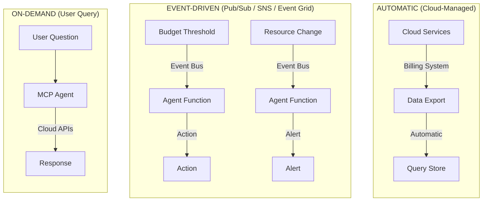
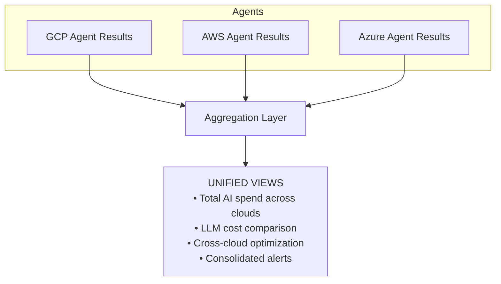

# AI Cost Monitoring — Multi-Agent Architecture

## Overview

The AI Cost Monitoring platform consists of multiple cloud-specific agents, each monitoring its respective cloud provider's services including AI/ML workloads. Each agent uses only native cloud APIs and built-in tools—no external dependencies or proxies required.

---

## Architecture Principles

| Principle | Description |
|-----------|-------------|
| **Cloud-Native** | Each agent uses only its cloud's built-in monitoring tools |
| **No Proxy Required** | Direct monitoring via billing exports and APIs |
| **AI/ML Focus** | Special emphasis on LLM and AI service cost tracking |
| **Stateless Agents** | All state stored in cloud-native services |
| **Event-Driven** | React to cloud events, don't poll |
| **Unified Experience** | Consistent conversational interface across all agents |

---

## Multi-Agent Architecture

```mermaid
flowchart TD
    User[USER / ORGANIZATION] --> Interface[UNIFIED INTERFACE (Future)<br/>Cross-cloud dashboard & orchestration]
    
    Interface --> GCP[GCP AGENT<br/>Google Cloud Services]
    Interface --> AWS[AWS AGENT<br/>Amazon Web Services]
    Interface --> Azure[AZURE AGENT<br/>Microsoft Azure]
```
**Legend**: The multi-agent architecture with a unified interface orchestrating cloud-specific agents.

---

## Agent Specifications

### GCP Agent (Phase 1 — Current Focus)

**Scope:** All Google Cloud Platform services

**AI/ML Services Monitored:**

| Service | What It Does | Cost Model |
|---------|--------------|------------|
| **Vertex AI - Gemini** | LLM API (Gemini 1.5 Pro, Flash, etc.) | Per token (input/output) |
| **Vertex AI - PaLM** | Legacy LLM API | Per token |
| **Vertex AI - Imagen** | Image generation | Per image |
| **Vertex AI - Embeddings** | Text/multimodal embeddings | Per token |
| **Vertex AI - Custom Training** | Model training jobs | Per hour (GPU/TPU) |
| **Vertex AI - Endpoints** | Model serving/inference | Per hour + per prediction |
| **Vertex AI - Pipelines** | ML workflow orchestration | Per run |
| **Vertex AI - Feature Store** | Feature management | Per storage + operations |
| **AutoML** | Automated model training | Per training hour |
| **Document AI** | Document processing & extraction | Per page |
| **Vision AI** | Image analysis & classification | Per image |
| **Video AI** | Video analysis | Per minute |
| **Speech-to-Text** | Audio transcription | Per minute |
| **Text-to-Speech** | Audio generation | Per character |
| **Translation AI** | Language translation | Per character |
| **Natural Language AI** | Text analysis & NLP | Per record |
| **Dialogflow** | Conversational AI | Per request |

**Other Services Monitored:**

| Category | Services |
|----------|----------|
| **Compute** | Compute Engine, GKE, Cloud Run, Cloud Functions, App Engine |
| **Data** | BigQuery, Cloud SQL, Spanner, Dataflow, Dataproc, Firestore |
| **Storage** | Cloud Storage, Filestore, Persistent Disk |
| **Networking** | Load Balancing, Cloud CDN, Cloud DNS, VPC |

**GCP Built-in Tools Used:**

| Tool | Purpose |
|------|---------|
| BigQuery Billing Export | Cost data storage & queries |
| Budget API | Threshold alerts & forecasting |
| Recommender API | ML-powered optimization suggestions |
| Asset Inventory | Resource tracking & change detection |
| Cloud Monitoring | Metrics & custom alerts |
| Pub/Sub | Event delivery |

---

### AWS Agent (Phase 2 — Future)

**Scope:** All Amazon Web Services

**AI/ML Services to Monitor:**

| Service | What It Does | Cost Model |
|---------|--------------|------------|
| **Amazon Bedrock** | LLM API (Claude, Titan, Llama, etc.) | Per token (input/output) |
| **Amazon SageMaker** | ML training & hosting | Per hour (instances) |
| **SageMaker Endpoints** | Model inference | Per hour + per inference |
| **Amazon Comprehend** | NLP & text analysis | Per unit |
| **Amazon Rekognition** | Image/video analysis | Per image/minute |
| **Amazon Textract** | Document extraction | Per page |
| **Amazon Transcribe** | Speech-to-text | Per minute |
| **Amazon Polly** | Text-to-speech | Per character |
| **Amazon Translate** | Language translation | Per character |
| **Amazon Lex** | Conversational AI | Per request |
| **Amazon Kendra** | Intelligent search | Per query |
| **Amazon Personalize** | Recommendations | Per interaction |

**Other Services to Monitor:**

| Category | Services |
|----------|----------|
| **Compute** | EC2, EKS, Lambda, Fargate, ECS |
| **Data** | RDS, DynamoDB, Redshift, EMR, Athena |
| **Storage** | S3, EBS, EFS |
| **Networking** | ELB, CloudFront, Route 53, VPC |

**AWS Built-in Tools to Use:**

| Tool | Purpose |
|------|---------|
| Cost Explorer API | Cost data & analysis |
| AWS Budgets | Threshold alerts |
| Compute Optimizer | Right-sizing recommendations |
| AWS Config | Resource tracking |
| CloudWatch | Metrics & alerts |
| SNS/EventBridge | Event delivery |

---

### Azure Agent (Phase 3 — Future)

**Scope:** All Microsoft Azure services

**AI/ML Services to Monitor:**

| Service | What It Does | Cost Model |
|---------|--------------|------------|
| **Azure OpenAI** | LLM API (GPT-4, GPT-3.5, etc.) | Per token (input/output) |
| **Azure AI Studio** | AI application development | Per resource |
| **Azure Machine Learning** | ML training & hosting | Per hour (compute) |
| **Azure Cognitive Services** | Pre-built AI models | Per transaction |
| **Azure AI Search** | Intelligent search | Per unit |
| **Azure AI Document Intelligence** | Document processing | Per page |
| **Azure AI Vision** | Image analysis | Per transaction |
| **Azure AI Speech** | Speech services | Per hour/character |
| **Azure AI Language** | NLP services | Per record |
| **Azure AI Translator** | Translation | Per character |
| **Azure Bot Service** | Conversational AI | Per message |
| **Azure AI Content Safety** | Content moderation | Per transaction |

**Other Services to Monitor:**

| Category | Services |
|----------|----------|
| **Compute** | Virtual Machines, AKS, Functions, Container Apps |
| **Data** | SQL Database, Cosmos DB, Synapse, Data Factory |
| **Storage** | Blob Storage, Files, Managed Disks |
| **Networking** | Load Balancer, Front Door, CDN, VNet |

**Azure Built-in Tools to Use:**

| Tool | Purpose |
|------|---------|
| Cost Management API | Cost data & analysis |
| Azure Budgets | Threshold alerts |
| Azure Advisor | Optimization recommendations |
| Azure Resource Graph | Resource tracking |
| Azure Monitor | Metrics & alerts |
| Event Grid | Event delivery |

---

## AI/ML Service Monitoring Features

### Common Features Across All Agents

| Feature | Description |
|---------|-------------|
| **Token Usage Tracking** | Track input/output tokens for LLM APIs |
| **Model Cost Comparison** | Compare costs across models (e.g., GPT-4 vs GPT-3.5) |
| **Training Job Monitoring** | Track GPU/TPU hours and training costs |
| **Endpoint Monitoring** | Detect idle/underutilized endpoints |
| **Prediction Cost Tracking** | Monitor inference costs (batch vs online) |
| **AI-Specific Budgets** | Set budgets for AI/ML services specifically |
| **Usage Anomaly Detection** | Detect unusual AI usage patterns |
| **Cost Forecasting** | Predict future AI spend based on trends |

### LLM-Specific Queries

Each agent can answer questions like:

```
"How much did we spend on LLM APIs this month?"
"Compare token usage: this week vs last week"
"Which model is most expensive per request?"
"Are there any idle inference endpoints?"
"Alert me if daily LLM spend exceeds $500"
"What's our cost per 1000 tokens by model?"
"Show training job costs for the last 30 days"
```

---

## Data Flow Architecture

### Per-Agent Data Flow


**Legend**: Data flow within a single agent, covering automatic data collection, event-driven reactions, and user-initiated queries.

### Cross-Cloud Aggregation (Future)


**Legend**: Designing the future cross-cloud aggregation layer to unify insights from all three agents.

---

## Service Risk Classification

### AI/ML Services (High Cost Risk)

| Risk Level | GCP | AWS | Azure |
|------------|-----|-----|-------|
| **CRITICAL** | Vertex AI Training (GPU/TPU) | SageMaker Training | Azure ML Compute |
| **CRITICAL** | Vertex AI Endpoints | Bedrock | Azure OpenAI |
| **HIGH** | Gemini Pro/Ultra | SageMaker Endpoints | Cognitive Services |
| **HIGH** | Custom Training Jobs | Comprehend | AI Document Intelligence |
| **MEDIUM** | Document AI | Textract | AI Vision |
| **MEDIUM** | Vision AI | Rekognition | AI Speech |
| **LOW** | Translation AI | Translate | Translator |

### Traditional Services

| Risk Level | GCP | AWS | Azure |
|------------|-----|-----|-------|
| **HIGH** | BigQuery, GKE | Redshift, EKS | Synapse, AKS |
| **MEDIUM** | Compute Engine | EC2 | Virtual Machines |
| **LOW** | Cloud Storage | S3 | Blob Storage |

---

## Circuit Breaker Thresholds

The circuit breaker operates on two levels: **per-service thresholds** that monitor specific high-cost services, and **overall thresholds** that monitor total cloud spend. Both can trigger independently.

### Per-Service Thresholds (Examples)

Each high-cost service can have its own circuit breaker configuration. Default thresholds for common services:

| Service Category | Level | Daily Threshold | Action |
|------------------|-------|-----------------|--------|
| **AI/ML Services** | WARNING | $500/day | Alert only |
| (Vertex AI, Bedrock, Azure OpenAI) | ELEVATED | $1,000/day | Alert + escalation |
| | CRITICAL | $2,500/day | Stop non-production endpoints |
| | EMERGENCY | $5,000/day | Stop all endpoints + disable APIs |
| **Compute Services** | WARNING | $300/day | Alert only |
| (GCE, EC2, Azure VMs) | ELEVATED | $750/day | Alert + escalation |
| | CRITICAL | $1,500/day | Stop non-production instances |
| | EMERGENCY | $3,000/day | Stop all instances (except tagged protected) |
| **Data Services** | WARNING | $200/day | Alert only |
| (BigQuery, Redshift, Synapse) | ELEVATED | $500/day | Alert + escalation |
| | CRITICAL | $1,000/day | Throttle queries |
| | EMERGENCY | $2,000/day | Disable non-essential access |

> **Note:** Per-service thresholds are customizable based on your workload patterns. Configure via `configure_circuit_breaker` tool.

### Overall Cloud Thresholds

These thresholds monitor total daily spend across all services and trigger regardless of individual service thresholds:

| Level | Daily Threshold | Action |
|-------|-----------------|--------|
| **WARNING** | $1,000/day total | Alert only |
| **ELEVATED** | $2,500/day total | Alert + escalation |
| **CRITICAL** | $5,000/day total | Stop high-cost resources |
| **EMERGENCY** | $10,000/day total | Disable billing |

### Threshold Interaction

- Per-service thresholds provide **granular control** for specific cost centers
- Overall thresholds provide a **safety net** regardless of which service is spending
- Either threshold type can independently trip the circuit breaker
- Example: If AI/ML hits $2,500 (per-service CRITICAL) while total spend is $3,000 (overall WARNING), the per-service CRITICAL action executes

---

## Product Roadmap

| Phase | Deliverable | Timeline | Focus |
|-------|-------------|----------|-------|
| **Phase 1** | GCP Agent | Current | Vertex AI, Compute, Data |
| **Phase 2** | AWS Agent | +3 months | Bedrock, SageMaker, EC2, RDS |
| **Phase 3** | Azure Agent | +6 months | Azure OpenAI, ML, VMs, SQL |
| **Phase 4** | Unified Dashboard | +9 months | Cross-cloud aggregation |
| **Phase 5** | Advanced Analytics | +12 months | Predictive cost optimization |

---

## Summary

### What Each Agent Monitors

| Agent | AI/ML Services | Other Services | Built-in Tools |
|-------|----------------|----------------|----------------|
| **GCP** | Vertex AI, Document AI, Vision AI, Speech AI | Compute, BigQuery, GKE, Cloud SQL | Billing Export, Budget API, Recommender |
| **AWS** | Bedrock, SageMaker, Comprehend, Rekognition | EC2, RDS, EKS, Lambda | Cost Explorer, Budgets, Compute Optimizer |
| **Azure** | Azure OpenAI, Cognitive Services, ML | VMs, SQL, AKS, Functions | Cost Management, Budgets, Advisor |

### Key Design Decisions

| Decision | Rationale |
|----------|-----------|
| **Separate agents per cloud** | Each cloud has unique APIs and built-in tools |
| **No external API monitoring** | Focus on cloud-native services only |
| **No proxy architecture** | Use billing exports and native monitoring |
| **AI/ML emphasis** | Highest cost risk and fastest growing spend |
| **Cloud-native tools** | Minimize infrastructure, maximize reliability |

---

## Infrastructure Cost Per Agent

| Component | GCP Agent | AWS Agent | Azure Agent |
|-----------|-----------|-----------|-------------|
| MCP Server | $10-50/mo | $10-50/mo | $10-50/mo |
| Cloud Function | $5/mo | $5/mo | $5/mo |
| Query costs | $5-20/mo | $5-20/mo | $5-20/mo |
| **Total** | **$20-80/mo** | **$20-80/mo** | **$20-80/mo** |

---

*Multi-Agent Architecture v1.0 — February 2025*
