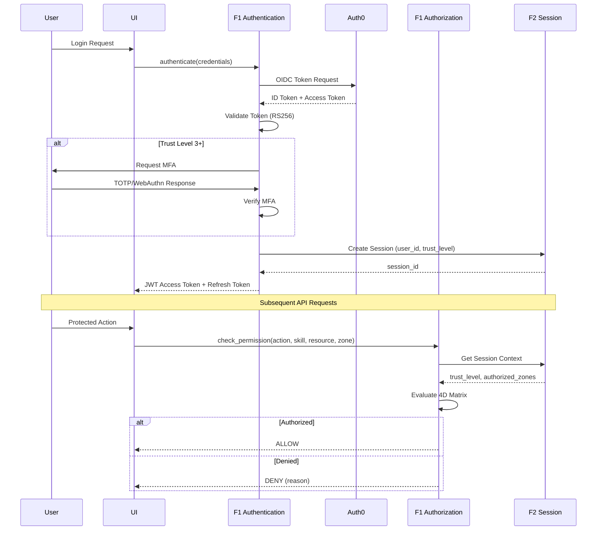

# BRD-01: F1 Identity & Access Management

> **Module Type**: Foundation (Domain-Agnostic)
> **Portability**: This BRD defines generic IAM capabilities reusable across any platform requiring authentication and authorization.

---

## 0. Document Control

| Item | Details |
|------|---------|
| **Project Name** | AI Cost Monitoring Platform v4.2 - F1 IAM Module |
| **Document Version** | 1.0 |
| **Date** | 2026-01-14 |
| **Document Owner** | Chief Architect |
| **Prepared By** | Antigravity AI |
| **Status** | Draft |
| **MVP Target Launch** | Phase 1 |
| **PRD-Ready Score** | 92/100 (Target: ≥90/100) |

### Executive Summary (MVP)

The F1 IAM Module provides enterprise-grade identity and access management for the AI Cost Monitoring Platform. It implements a 4-Dimensional Authorization Matrix (ACTION × SKILL × RESOURCE × ZONE) with multi-provider authentication (Auth0 primary, Google, mTLS, API keys) and a 4-tier trust level system. This foundation module is domain-agnostic and requires no knowledge of business logic—all skills and resources are configuration-injected.

### Document Revision History

| Version | Date | Author | Changes Made | Approver |
|---------|------|--------|--------------|----------|
| 1.0 | 2026-01-14 | Antigravity AI | Initial BRD creation from F1 Spec and Gap Analysis | |

---

## 1. Introduction

### 1.1 Purpose

This Business Requirements Document (BRD) defines the business requirements for the F1 Identity & Access Management Module. The F1 IAM Module handles all authentication and authorization for the platform using a Zero-Trust security model with multi-provider support and fine-grained access control.

@ref: [F1 IAM Technical Specification](../00_REF/foundation/F1_IAM_Technical_Specification.md#1-executive-summary)

### 1.2 Document Scope

This document covers:
- Core authentication capabilities (multi-provider, MFA)
- 4D Authorization Matrix (ACTION × SKILL × RESOURCE × ZONE)
- Trust level system with progressive access rights
- User profile management with encrypted storage
- Gap remediation for enterprise compliance

**Out of Scope**:
- Domain-specific business logic (cloud_accounts, cost_analytics)
- Skill definitions (injected by domain layer)
- UI implementation details

### 1.3 Intended Audience

- Platform administrators (IAM configuration)
- DevOps engineers (deployment, integration)
- Security/Compliance officers (audit, policy)
- Development teams (API integration)

### 1.4 Document Conventions

- **Must/Shall**: P1 critical requirements
- **Should**: P2 important requirements
- **Future**: P3 post-MVP enhancements

---

## 2. Business Objectives

### 2.1 MVP Hypothesis

**If** we implement a domain-agnostic IAM foundation module with Zero-Trust authentication, 4D authorization matrix, and session management capabilities, **then** we will:
1. Enable secure multi-tenant platform operations with fine-grained access control
2. Reduce security incident response time through centralized session revocation
3. Achieve enterprise compliance requirements for authentication and authorization

**Validation Questions**:
- Can users authenticate via Auth0 and complete MFA enrollment within 5 minutes?
- Can the 4D authorization matrix be configured without code changes?
- Can compromised sessions be revoked within 1 second across all devices?

---

### 2.2 Business Problem Statement

**Current State**: Platform lacks centralized identity management with session revocation capabilities, SCIM provisioning, and passwordless authentication options.

**Impact**:
- Security incidents require manual session invalidation across services
- User provisioning is manual, error-prone, and not scalable for enterprise deployments
- Password-based authentication creates friction and security vulnerabilities

**Desired State**: Unified IAM foundation module providing Zero-Trust security, automated provisioning, and modern authentication methods.

---

### 2.3 MVP Business Goals

| Goal ID | Goal Statement | Success Indicator | Priority |
|---------|----------------|-------------------|----------|
| BRD.01.23.01 | Establish Zero-Trust authentication and authorization as platform security baseline | 100% unauthorized access attempts blocked | P1 |
| BRD.01.23.02 | Address identified IAM gaps for enterprise deployment readiness | 6/6 F1 gaps remediated | P1 |
| BRD.01.23.03 | Maintain portable, domain-agnostic design enabling platform reuse | 0 domain-specific code lines in F1 | P1 |

---

### BRD.01.23.01: Zero-Trust Security Posture

**Objective**: Implement Zero-Trust authentication and authorization where all access must be explicitly granted and verified.

**Business Driver**: Autonomous AI agents and financial operations require defense-in-depth security to prevent unauthorized access and data breaches.

@ref: [F1 §1](../00_REF/foundation/F1_IAM_Technical_Specification.md#1-executive-summary)

---

### BRD.01.23.02: Enterprise IAM Compliance

**Objective**: Address identified IAM gaps to meet enterprise-grade platform requirements.

**Business Driver**: Current implementation lacks session revocation, SCIM provisioning, and passwordless authentication capabilities required for enterprise deployments.

@ref: [GAP_Foundation_Module_Gap_Analysis §2.2](../00_REF/foundation/GAP_Foundation_Module_Gap_Analysis.md#22-identified-gaps)

---

### BRD.01.23.03: Portable Foundation Module

**Objective**: Maintain domain-agnostic design allowing F1 IAM to be reused across different platform deployments.

**Business Driver**: Foundation modules must have zero knowledge of business logic to enable portability and reduce coupling.

---

### 2.4 MVP Success Metrics

| Objective ID | Objective Statement | Success Metric | MVP Target | Measurement Period |
|--------------|---------------------|----------------|------------|-------------------|
| BRD.01.23.01 | Zero-Trust Security | Unauthorized access attempts blocked | 100% | 90 days post-launch |
| BRD.01.23.02 | Enterprise Compliance | Gap requirements implemented | 6/6 addressed | MVP + Phase 2 |
| BRD.01.23.03 | Portability | Domain-specific code in F1 | 0 lines | Continuous |

---

### 2.5 Expected Benefits (MVP Scope)

**Quantifiable Benefits**:

| Benefit ID | Benefit Statement | Baseline | Target | Measurement |
|------------|-------------------|----------|--------|-------------|
| BRD.01.25.01 | Reduce security incident response time | Hours (manual) | <1 second | Session revocation latency |
| BRD.01.25.02 | Enterprise compliance readiness | 0/6 gaps addressed | 6/6 addressed | Gap remediation tracking |
| BRD.01.25.03 | Integration efficiency | Multiple auth points | Single IAM integration | Domain layer integrations |

**Qualitative Benefits**:
- Consistent security posture across all platform components
- Reduced authentication complexity for development teams
- Foundation for progressive trust elevation and advanced access patterns
- Domain-agnostic design enabling platform reuse

---

## 3. Project Scope

### 3.1 MVP Scope Statement

The F1 IAM Module provides authentication, authorization, and user profile management as a domain-agnostic foundation layer consumed by all domain layers (D1-D7).

### 3.2 MVP Core Features (In-Scope)

**P1 - Must Have for MVP Launch**:
1. Multi-provider authentication (Auth0 primary, email/password fallback)
2. 4D Authorization Matrix implementation
3. Trust Level system (4 tiers: Viewer → Admin)
4. MFA enforcement (TOTP, WebAuthn) for Trust 3+
5. Token management (JWT access, refresh rotation)
6. User profile with encrypted credential storage
7. Session Revocation API (GAP-F1-01)

**P2 - Should Have**:
1. SCIM 2.0 Provisioning (GAP-F1-02)
2. Passwordless Authentication Mode (GAP-F1-03)
3. Role Hierarchy with inheritance (GAP-F1-05)

**P3 - Future**:
1. Device Trust Verification (GAP-F1-04)
2. Time-Based Access Policies (GAP-F1-06)

### 3.3 Explicitly Out-of-Scope for MVP

- Domain-specific skills (injected by domain layers D1-D7)
- Agent-specific permissions (injected by D1)
- Mobile app authentication flows
- Enterprise SAML/OIDC (v1.3.0 roadmap)

### 3.4 MVP Workflow

The following diagram illustrates the core authentication and authorization flow for the F1 IAM Module:



**Workflow Summary**:
1. **Authentication**: User authenticates via Auth0, F1 validates token and enforces MFA for Trust 3+
2. **Session Creation**: F1 delegates session state to F2 Session module
3. **Authorization**: Each request is evaluated against the 4D Matrix (ACTION × SKILL × RESOURCE × ZONE)

### 3.5 Technology Stack

> **Note:** MVP uses Firebase Auth for simplicity. Production upgrades to Auth0 for enterprise features (SSO, MFA policies, organization management). See [ADR-008](../00_REF/domain/architecture/adr/008-database-strategy-mvp.md).

| Component | MVP | Production | Reference |
|-----------|-----|------------|-----------|
| Primary IdP | Firebase Auth | Auth0 | ADR-008 |
| Token Format | JWT (RS256) | JWT (RS256) | F1 §3.5 |
| Password Hashing | Firebase managed | bcrypt (cost 12) | F1 §3.3 |
| MFA | Firebase (optional) | TOTP + WebAuthn | F1 §3.4 |
| Secrets | GCP Secret Manager | GCP Secret Manager | F6 |
| Database | Firestore | PostgreSQL (users) | ADR-008 |

---

## 4. Stakeholders

### Decision Makers

| Role | Responsibility | Key Decisions |
|------|----------------|---------------|
| **Executive Sponsor** | Final approval authority for F1 scope | Security investment, IdP vendor selection, compliance requirements |
| **Product Owner** | Feature prioritization for IAM capabilities | Trust level design, MFA requirements, gap remediation priority |
| **Technical Lead** | Architecture decisions for F1 implementation | Token strategy, session backend selection, integration patterns |

### Key Contributors

| Role | Involvement | Domain Focus |
|------|-------------|--------------|
| **Platform Administrator** | Configure IAM policies, manage trust levels, monitor access patterns | Policy configuration, trust level management, audit visibility |
| **DevOps Engineer** | Deploy IAM module, integrate with infrastructure, manage secrets | Infrastructure deployment, secret rotation, health monitoring |
| **Security/Compliance Officer** | Audit access, enforce policies, validate compliance | Audit logs, compliance reports, anomaly detection |
| **Development Team** | Integrate F1 APIs, implement authorization checks in domain layers | API contracts, SDK usage, domain layer integration |

---

## 5. User Stories

### 5.1 Primary User Stories (MVP Essential)

| Story ID | User Role | Action | Business Value | Priority |
|----------|-----------|--------|----------------|----------|
| BRD.01.09.01 | User | Login via Auth0 | Secure authentication with enterprise IdP | P1 |
| BRD.01.09.02 | User | Setup MFA (TOTP/WebAuthn) | Protected high-trust operations | P1 |
| BRD.01.09.03 | User | Verify permission for action | Fine-grained access control | P1 |
| BRD.01.09.04 | User | Elevate trust level | Progressive access for advanced features | P1 |
| BRD.01.09.05 | User | Update profile information | Personalized experience | P2 |
| BRD.01.09.06 | User | Logout and terminate session | Security control over access | P1 |
| BRD.01.09.07 | Service | Authenticate via API key | Machine-to-machine integration | P1 |
| BRD.01.09.08 | Admin | View audit logs | Compliance and security monitoring | P1 |

@ref: [F1 §3.1-3.4](../00_REF/foundation/F1_IAM_Technical_Specification.md#3-authentication-system), [F1 §6](../00_REF/foundation/F1_IAM_Technical_Specification.md#6-event-system)

### 5.2 User Story Summary

- **Total MVP User Stories**: 8 (P1: 7, P2: 1)
- **Future Phase Stories**: SCIM provisioning, passwordless login, device trust

---

## 6. Functional Requirements

### 6.1 MVP Requirements Overview

**Priority Definitions**:
- **P1 (Must Have)**: Essential for MVP launch
- **P2 (Should Have)**: Important, implement post-MVP
- **P3 (Future)**: Based on user feedback

---

### BRD.01.01.01: Multi-Provider Authentication

**Business Capability**: Support multiple authentication providers with Auth0 as primary identity provider.

@ref: [F1 §3.1-3.3](../00_REF/foundation/F1_IAM_Technical_Specification.md#3-authentication-system)

**Business Requirements**:
- Auth0 Universal Login as primary authentication method
- Email/password fallback for environments without Auth0 connectivity
- Service authentication via mTLS and API keys
- Google OAuth 2.0 federation through Auth0

**Business Rules**:
- Password minimum 12 characters with complexity requirements
- Account lockout after 5 failed attempts (15-minute window)
- Email verification required before first login

**Business Acceptance Criteria**:

| Criteria ID | Criterion | MVP Target |
|-------------|-----------|------------|
| BRD.01.06.01 | Auth0 login success rate | ≥99.9% |
| BRD.01.06.02 | Authentication latency | <100ms |

**Complexity**: 3/5 (Multi-provider integration with Auth0, email/password fallback, and service authentication requires coordination with external IdP and internal security policies)

**Related Requirements**:
- Platform BRDs: BRD-06 (F6 Infrastructure - GCP Secret Manager, PostgreSQL)
- Feature BRDs: N/A (Foundation module)

**Priority**: P1

---

### BRD.01.01.02: 4D Authorization Matrix

**Business Capability**: Fine-grained access control using ACTION × SKILL × RESOURCE × ZONE dimensions.

@ref: [F1 §4.1-4.2](../00_REF/foundation/F1_IAM_Technical_Specification.md#4-authorization-system)

**Business Requirements**:
- Authorization decision based on four dimensions
- Default deny—all access must be explicitly granted
- Domain-injected skill definitions (F1 has no business knowledge)

**Dimension Definitions**:

| Dimension | Values | Description |
|-----------|--------|-------------|
| ACTION | view, create, update, delete, execute | Operation type |
| SKILL | Domain-injected | Capability identifier |
| RESOURCE | own, workspace, all | Ownership scope |
| ZONE | paper, live, admin, system | Environment context |

**Business Acceptance Criteria**:

| Criteria ID | Criterion | MVP Target |
|-------------|-----------|------------|
| BRD.01.06.03 | Authorization decision latency | <10ms |
| BRD.01.06.04 | Default deny enforcement | 100% |

**Complexity**: 4/5 (Four-dimensional matrix requires careful policy design, caching strategy, and domain injection mechanism)

**Related Requirements**:
- Platform BRDs: BRD-02 (F2 Session - context propagation), BRD-07 (F7 Config - policy injection)
- Feature BRDs: N/A (Foundation module)

**Priority**: P1

---

### BRD.01.01.03: Trust Level System

**Business Capability**: 4-tier trust hierarchy with progressive access rights.

@ref: [F1 §4.3](../00_REF/foundation/F1_IAM_Technical_Specification.md#43-trust-levels)

**Trust Level Definitions**:

| Level | Name | Zones | MFA Required |
|-------|------|-------|--------------|
| 1 | Viewer | paper (read-only) | Optional |
| 2 | Operator | paper | Optional |
| 3 | Producer | paper, live | Required |
| 4 | Admin | paper, live, admin | Required |

**Business Acceptance Criteria**:

| Criteria ID | Criterion | MVP Target |
|-------------|-----------|------------|
| BRD.01.06.05 | Trust level enforcement accuracy | 100% |
| BRD.01.06.06 | Trust elevation success rate | ≥99% |

**Complexity**: 2/5 (Well-defined tier system with clear zone mappings and MFA requirements)

**Related Requirements**:
- Platform BRDs: BRD-02 (F2 Session - trust context storage)
- Feature BRDs: N/A (Foundation module)

**Priority**: P1

---

### BRD.01.01.04: MFA Enforcement

**Business Capability**: Multi-factor authentication with TOTP and WebAuthn support.

@ref: [F1 §3.4](../00_REF/foundation/F1_IAM_Technical_Specification.md#35-multi-factor-authentication-mfa)

**Business Requirements**:
- MFA mandatory for Trust Levels 3 and 4
- TOTP (6-digit, 30-second, RFC 6238 compliant)
- WebAuthn (YubiKey, Touch ID, Windows Hello)

**Business Acceptance Criteria**:

| Criteria ID | Criterion | MVP Target |
|-------------|-----------|------------|
| BRD.01.06.07 | MFA adoption for Trust 3+ | 100% |
| BRD.01.06.08 | WebAuthn registration success | ≥95% |

**Complexity**: 3/5 (TOTP implementation straightforward; WebAuthn requires browser compatibility and credential management)

**Related Requirements**:
- Platform BRDs: BRD-06 (F6 Infrastructure - secret storage for TOTP seeds)
- Feature BRDs: N/A (Foundation module)

**Priority**: P1

---

### BRD.01.01.05: Token Management

**Business Capability**: JWT-based access tokens with secure refresh rotation.

@ref: [F1 §3.5](../00_REF/foundation/F1_IAM_Technical_Specification.md#36-token-management)

**Token Configuration**:

| Token Type | Lifetime | Rotation |
|------------|----------|----------|
| Access (JWT) | 30 minutes | N/A |
| Refresh | 7 days | Single-use |

**Session Limits**:
- Maximum 3 concurrent sessions per user
- Idle timeout: 30 minutes
- Absolute timeout: 24 hours

**Business Acceptance Criteria**:

| Criteria ID | Criterion | MVP Target |
|-------------|-----------|------------|
| BRD.01.06.09 | Token validation latency | <5ms |
| BRD.01.06.10 | Refresh token rotation success | 100% |

**Complexity**: 3/5 (JWT generation and validation straightforward; refresh rotation requires careful session state management)

**Related Requirements**:
- Platform BRDs: BRD-02 (F2 Session - session state), BRD-06 (F6 Infrastructure - key storage)
- Feature BRDs: N/A (Foundation module)

**Priority**: P1

---

### BRD.01.01.06: User Profile System

**Business Capability**: User profile storage with encrypted credential management.

@ref: [F1 §5](../00_REF/foundation/F1_IAM_Technical_Specification.md#5-user-profile-system)

**Core Schema**: user_id, email, name, avatar, timezone, locale, trust_level
**Encrypted Storage**: Broker credentials, TOTP secrets in GCP Secret Manager

**Business Acceptance Criteria**:

| Criteria ID | Criterion | MVP Target |
|-------------|-----------|------------|
| BRD.01.06.11 | Profile retrieval latency | <50ms |
| BRD.01.06.12 | Credential encryption compliance | 100% AES-256-GCM |

**Complexity**: 2/5 (Standard CRUD with encryption wrapper for sensitive fields)

**Related Requirements**:
- Platform BRDs: BRD-06 (F6 Infrastructure - PostgreSQL, GCP Secret Manager)
- Feature BRDs: N/A (Foundation module)

**Priority**: P1

---

### BRD.01.01.07: Session Revocation API

**Business Capability**: Centralized session termination for compromised accounts.

@ref: [GAP-F1-01: Session Revocation](../00_REF/foundation/GAP_Foundation_Module_Gap_Analysis.md#f1-iam-gaps)

**Business Requirements**:
- Bulk session termination by user ID
- Bulk session termination by device ID
- Force logout across all sessions
- Immediate token invalidation

**Business Acceptance Criteria**:

| Criteria ID | Criterion | MVP Target |
|-------------|-----------|------------|
| BRD.01.06.13 | Session revocation latency | <1 second |
| BRD.01.06.14 | Revocation propagation | 100% devices |

**Complexity**: 3/5 (Requires real-time session invalidation across distributed services; pub/sub pattern recommended)

**Related Requirements**:
- Platform BRDs: BRD-02 (F2 Session - session storage), BRD-06 (F6 Infrastructure - Redis pub/sub)
- Feature BRDs: N/A (Foundation module)

**Priority**: P1 (Gap remediation)

---

### BRD.01.01.08: SCIM 2.0 Provisioning

**Business Capability**: Automated user lifecycle management from enterprise IdP.

@ref: [GAP-F1-02: SCIM Provisioning](../00_REF/foundation/GAP_Foundation_Module_Gap_Analysis.md#f1-iam-gaps)

**Business Requirements**:
- SCIM 2.0 server endpoint
- User create/update/delete operations
- Group membership synchronization
- Just-in-time provisioning support

**Business Acceptance Criteria**:

| Criteria ID | Criterion | MVP Target |
|-------------|-----------|------------|
| BRD.01.06.15 | SCIM endpoint response time | <500ms |
| BRD.01.06.16 | User sync accuracy | 100% |

**Complexity**: 4/5 (SCIM 2.0 specification compliance requires careful implementation of filtering, pagination, and attribute mapping)

**Related Requirements**:
- Platform BRDs: BRD-06 (F6 Infrastructure - PostgreSQL), BRD-07 (F7 Config - attribute mapping)
- Feature BRDs: N/A (Foundation module)

**Priority**: P2

---

### BRD.01.01.09: Passwordless Authentication

**Business Capability**: WebAuthn as primary authentication method.

@ref: [GAP-F1-03: Passwordless Authentication](../00_REF/foundation/GAP_Foundation_Module_Gap_Analysis.md#f1-iam-gaps)

**Business Requirements**:
- WebAuthn resident key support
- Biometric binding (Touch ID, Face ID)
- Password-free login flows

**Business Acceptance Criteria**:

| Criteria ID | Criterion | MVP Target |
|-------------|-----------|------------|
| BRD.01.06.17 | Passwordless login success rate | ≥98% |
| BRD.01.06.18 | Biometric authentication latency | <2 seconds |

**Complexity**: 3/5 (WebAuthn standard well-defined; platform compatibility and credential recovery require attention)

**Related Requirements**:
- Platform BRDs: BRD-06 (F6 Infrastructure - credential storage)
- Feature BRDs: N/A (Foundation module)

**Priority**: P2

---

### BRD.01.01.10: Device Trust Verification

**Business Capability**: Managed device checks via MDM integration.

@ref: [GAP-F1-04: Device Trust](../00_REF/foundation/GAP_Foundation_Module_Gap_Analysis.md#f1-iam-gaps)

**Business Requirements**:
- MDM provider integration (Intune, Jamf)
- Device compliance verification
- Conditional access based on device posture

**Business Acceptance Criteria**:

| Criteria ID | Criterion | MVP Target |
|-------------|-----------|------------|
| BRD.01.06.19 | Device posture check latency | <1 second |
| BRD.01.06.20 | MDM sync frequency | Every 15 minutes |

**Complexity**: 4/5 (Requires integration with multiple MDM providers; device posture signals vary by platform)

**Related Requirements**:
- Platform BRDs: BRD-04 (F4 SecOps - compliance policies), BRD-06 (F6 Infrastructure - external API gateway)
- Feature BRDs: N/A (Foundation module)

**Priority**: P3

---

### BRD.01.01.11: Role Hierarchy

**Business Capability**: Trust level inheritance for simplified permission management.

@ref: GAP-F1-05 (BRD-proposed requirement based on enterprise best practices)

**Business Requirements**:
- Higher trust levels inherit lower level permissions
- Explicit permission overrides at each level
- Reduced configuration overhead

**Business Acceptance Criteria**:

| Criteria ID | Criterion | MVP Target |
|-------------|-----------|------------|
| BRD.01.06.21 | Permission inheritance accuracy | 100% |
| BRD.01.06.22 | Configuration reduction | ≥50% fewer rules |

**Complexity**: 2/5 (Inheritance model well-understood; careful design needed to avoid permission escalation bugs)

**Related Requirements**:
- Platform BRDs: BRD-07 (F7 Config - permission configuration)
- Feature BRDs: N/A (Foundation module)

**Priority**: P2

---

### BRD.01.01.12: Time-Based Access

**Business Capability**: Temporal access policies for scheduled restrictions.

@ref: GAP-F1-06 (BRD-proposed requirement based on enterprise best practices)

**Business Requirements**:
- Business hours access restrictions
- After-hours access policies
- Scheduled permission windows

**Business Acceptance Criteria**:

| Criteria ID | Criterion | MVP Target |
|-------------|-----------|------------|
| BRD.01.06.23 | Time policy evaluation latency | <5ms |
| BRD.01.06.24 | Timezone accuracy | 100% (user-configured) |

**Complexity**: 3/5 (Timezone handling and policy overlap resolution require careful implementation)

**Related Requirements**:
- Platform BRDs: BRD-07 (F7 Config - time policy configuration)
- Feature BRDs: N/A (Foundation module)

**Priority**: P3

---

## 7. Quality Attributes

### BRD.01.02.01: Security (Zero-Trust)

**Requirement**: Implement Zero-Trust security model with defense-in-depth.

@ref: [F1 §10](../00_REF/foundation/F1_IAM_Technical_Specification.md#10-security-considerations)

**Measures**:
- Default deny authorization
- MFA for sensitive operations
- Encrypted credential storage (AES-256-GCM)
- Audit logging for all access decisions

**Priority**: P1

---

### BRD.01.02.02: Performance

**Requirement**: Authentication and authorization operations must complete within latency targets.

| Operation | Target Latency |
|-----------|---------------|
| Authentication | <100ms |
| Authorization check | <10ms |
| Token validation | <5ms |

**Priority**: P1

---

### BRD.01.02.03: Reliability

**Requirement**: IAM services must maintain high availability.

| Metric | Target |
|--------|--------|
| Auth service uptime | 99.9% |
| Token service uptime | 99.9% |
| Recovery time (RTO) | <5 minutes |

**Priority**: P1

---

### BRD.01.02.04: Scalability

**Requirement**: Support concurrent user load without degradation.

| Metric | Target |
|--------|--------|
| Concurrent users | 10,000 |
| Auth requests/sec | 1,000 |
| Token validations/sec | 10,000 |

**Priority**: P2

---

### 7.2 Architecture Decision Requirements

#### 7.2.1 Infrastructure

##### BRD.01.10.01: Session State Backend

**Status**: [ ] Pending

**Business Driver**: Session persistence across service restarts

**Options**: Redis, PostgreSQL, In-memory with replication

**PRD Requirements**: Session replication strategy, failover behavior

---

#### 7.2.2 Data Architecture

##### BRD.01.10.02: Token Storage Strategy

**Status**: [X] Selected

**Business Driver**: Secure token storage for stateless authentication

**Recommended Selection**: JWT with RS256 asymmetric signing, refresh tokens hashed in database

**PRD Requirements**: Key rotation policy, token claim schema

---

#### 7.2.3 Integration

##### BRD.01.10.03: Identity Provider Integration

**Status**: [X] Selected

**Business Driver**: Enterprise SSO and user federation

**Recommended Selection**: Auth0 as primary IdP with OIDC federation

**PRD Requirements**: Provider failover strategy, token exchange flow

---

#### 7.2.4 Security

##### BRD.01.10.04: MFA Provider Selection

**Status**: [X] Selected

**Business Driver**: Balance security with user experience

**Recommended Selection**: Auth0 MFA (TOTP + WebAuthn) with platform-native fallback

**PRD Requirements**: Recovery flow design, backup code generation

---

##### BRD.01.10.05: Credential Encryption Strategy

**Status**: [X] Selected

**Business Driver**: Protect stored credentials at rest

**Recommended Selection**: AES-256-GCM with GCP Secret Manager for key management

**PRD Requirements**: Key rotation schedule, encryption scope

---

#### 7.2.5 Observability

##### BRD.01.10.06: Authentication Audit Strategy

**Status**: [ ] Pending

**Business Driver**: Security compliance and incident investigation

**Options**: Cloud Logging, dedicated SIEM, hybrid approach

**PRD Requirements**: Log retention policy, alerting thresholds

---

#### 7.2.6 AI/ML

**Status**: N/A for F1 IAM Module

**Rationale**: F1 IAM is a foundation module focused on authentication and authorization infrastructure. AI/ML capabilities (anomaly detection, behavioral analysis) are handled by D1 Agent Orchestration layer.

---

#### 7.2.7 Technology Selection

##### BRD.01.10.07: Password Hashing Algorithm

**Status**: [X] Selected

**Business Driver**: Secure password storage with future-proof algorithm

**Recommended Selection**: bcrypt with cost factor 12 (Argon2 for future consideration)

**PRD Requirements**: Migration path for algorithm upgrades

---

## 8. Business Constraints and Assumptions

### 8.1 MVP Business Constraints

| ID | Constraint Category | Description | Impact |
|----|---------------------|-------------|--------|
| BRD.01.03.01 | Platform | Auth0 as primary identity provider | Vendor dependency |
| BRD.01.03.02 | Technology | GCP platform (Secret Manager, Cloud SQL) | Cloud lock-in |
| BRD.01.03.03 | Format | JWT token format (RS256) | Interoperability |

### 8.2 MVP Assumptions

| ID | Assumption | Validation Method | Impact if False |
|----|------------|-------------------|-----------------|
| BRD.01.04.01 | Auth0 availability meets 99.9% SLA | Monitor Auth0 status | Enable fallback auth |
| BRD.01.04.02 | Users have MFA-capable devices | Enrollment tracking | Support TOTP-only |

---

## 9. Acceptance Criteria

### 9.1 MVP Launch Criteria

**Must-Have Criteria**:
1. [ ] All P1 functional requirements (BRD.01.01.01-07) implemented
2. [ ] Zero-Trust authorization enforced (100% unauthorized blocks)
3. [ ] MFA enforcement for Trust 3+ (100% adoption)
4. [ ] Audit logging operational for all authentication events
5. [ ] Session revocation API functional (GAP-F1-01)

**Should-Have Criteria**:
1. [ ] SCIM 2.0 endpoint implemented (GAP-F1-02)
2. [ ] Passwordless mode available (GAP-F1-03)

---

## 10. Business Risk Management

| Risk ID | Risk Description | Likelihood | Impact | Mitigation Strategy | Owner |
|---------|------------------|------------|--------|---------------------|-------|
| BRD.01.07.01 | Auth provider lock-in | Medium | High | Multi-provider adapter pattern | Architect |
| BRD.01.07.02 | Credential theft | Low | Critical | MFA enforcement, session limits | Security |
| BRD.01.07.03 | Session hijacking | Low | High | Device fingerprinting, anomaly detection | Security |

---

## 11. Implementation Approach

### 11.1 MVP Development Phases

**Phase 1 - Core Authentication**:
- Auth0 integration
- Email/password fallback
- JWT token management

**Phase 2 - Authorization**:
- 4D Matrix implementation
- Trust level system
- MFA enforcement

**Phase 3 - Gap Remediation**:
- Session Revocation API (GAP-F1-01)
- SCIM 2.0 (GAP-F1-02)
- Passwordless mode (GAP-F1-03)

---

## 12. Cost-Benefit Analysis

**Development Costs**:
- Auth0 subscription: Included in platform budget
- Secret Manager: ~$6/10K operations
- Development effort: Foundation module priority

**Risk Reduction**:
- Session revocation: Prevents prolonged access after compromise
- MFA enforcement: Reduces credential theft impact by 99%

---

## 13. Traceability

### 13.1 Upstream Dependencies

| Upstream Artifact | Reference | Relevance |
|-------------------|-----------|-----------|
| F1 IAM Technical Specification | [F1 Spec](../00_REF/foundation/F1_IAM_Technical_Specification.md) | Technical requirements source |
| Gap Analysis | [GAP Analysis](../00_REF/foundation/GAP_Foundation_Module_Gap_Analysis.md) | 6 F1 gaps identified |

### 13.2 Downstream Artifacts

- **PRD-01**: Product Requirements Document (Layer 2)
- **ADR**: Token Storage Strategy, Session Backend, MFA Provider
- **BDD**: Authentication and authorization test scenarios

### 13.3 Cross-BRD References

| Related BRD | Dependency Type | Data Exchange |
|-------------|-----------------|---------------|
| BRD-02 (F2 Session) | Downstream | F1 provides: user_id, trust_level, authorized_zones for session context enrichment |
| BRD-02 (F2 Session) | Upstream | F2 provides: session_id, device_fingerprint for authorization context |
| BRD-03 (F3 Observability) | Downstream | F1 emits: auth.success, auth.failure, authz.decision, mfa.enrolled events |
| BRD-06 (F6 Infrastructure) | Upstream | F6 provides: PostgreSQL (user profiles), Redis (session cache), Secret Manager (credentials) |
| BRD-07 (F7 Config) | Upstream | F7 provides: session timeout settings, MFA requirements, trust level policies |

### 13.4 Requirements Traceability Matrix

| BRD Requirement | Source Spec Reference | GAP Reference | PRD Target | Priority |
|-----------------|----------------------|---------------|------------|----------|
| BRD.01.01.01 | F1 §3.1-3.3 | - | PRD-01.01.01 | P1 |
| BRD.01.01.02 | F1 §4.1-4.2 | - | PRD-01.01.02 | P1 |
| BRD.01.01.03 | F1 §4.3 | - | PRD-01.01.03 | P1 |
| BRD.01.01.04 | F1 §3.4 | - | PRD-01.01.04 | P1 |
| BRD.01.01.05 | F1 §3.5 | - | PRD-01.01.05 | P1 |
| BRD.01.01.06 | F1 §5 | - | PRD-01.01.06 | P1 |
| BRD.01.01.07 | - | GAP-F1-01 | PRD-01.01.07 | P1 |
| BRD.01.01.08 | - | GAP-F1-02 | PRD-01.01.08 | P2 |
| BRD.01.01.09 | - | GAP-F1-03 | PRD-01.01.09 | P2 |
| BRD.01.01.10 | - | GAP-F1-04 | PRD-01.01.10 | P3 |
| BRD.01.01.11 | - | GAP-F1-05 | PRD-01.01.11 | P2 |
| BRD.01.01.12 | - | GAP-F1-06 | PRD-01.01.12 | P3 |

---

## 14. Glossary

**Master Glossary**: See [BRD-00_GLOSSARY.md](../BRD-00_GLOSSARY.md)

### F1-Specific Terms

| Term | Definition | Context |
|------|------------|---------|
| 4D Matrix | ACTION × SKILL × RESOURCE × ZONE authorization model | Section 6 |
| Trust Level | 4-tier access hierarchy (Viewer → Admin) | BRD.01.01.03 |
| Zone | Environment context (paper, live, admin, system) | Section 6 |
| SCIM | System for Cross-domain Identity Management | BRD.01.01.08 |

---

## 15. Appendices

### Appendix A: Trust Level Matrix

| Level | Name | Paper Zone | Live Zone | Admin Zone | MFA |
|-------|------|------------|-----------|------------|-----|
| 1 | Viewer | Read | - | - | Optional |
| 2 | Operator | Full | - | - | Optional |
| 3 | Producer | Full | Full | - | Required |
| 4 | Admin | Full | Full | Full | Required |

### Appendix B: 4D Authorization Example

```
Query: Can user "alice" execute "protected_operation" on "own" resources in "live" zone?

1. Load alice's trust_level = 3 (Producer)
2. Check zone: "live" in alice.authorized_zones → PASS
3. Check MFA: alice.mfa_verified = true → PASS
4. Check skill: protected_operation requires trust 3+ → PASS
5. Check resource: "own" allowed for trust 3 → PASS
6. Check action: "execute" allowed for skill → PASS
7. Decision: ALLOW
```

**Note**: Skill names (e.g., `protected_operation`) are domain-injected at runtime. F1 IAM has no knowledge of specific business operations.

---

*BRD-01: F1 Identity & Access Management — AI Cost Monitoring Platform v4.2 — January 2026*
