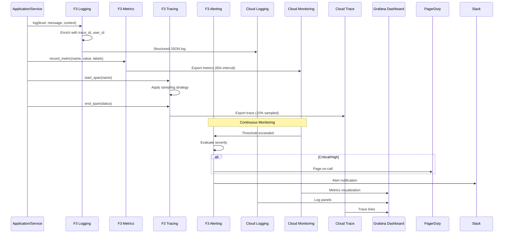

# BRD-03: F3 Observability

> **Module Type**: Foundation (Domain-Agnostic)
> **Portability**: This BRD defines generic observability capabilities (logging, metrics, tracing, alerting) reusable across any platform requiring operational visibility.

---

## 0. Document Control

| Item | Details |
|------|---------|
| **Project Name** | AI Cost Monitoring Platform v4.2 - F3 Observability Module |
| **Document Version** | 1.0 |
| **Date** | 2026-01-14 |
| **Document Owner** | Chief Architect |
| **Prepared By** | Antigravity AI |
| **Status** | Draft |
| **MVP Target Launch** | Phase 1 |
| **PRD-Ready Score** | 92/100 (Target: >=90/100) |

### Executive Summary (MVP)

The F3 Observability Module provides comprehensive monitoring, logging, tracing, alerting, and analytics for the AI Cost Monitoring Platform. It implements structured JSON logging with 4 log levels, multi-exporter metrics collection (Prometheus + Cloud Monitoring), OpenTelemetry distributed tracing with 10% sampling, 4-severity alerting with PagerDuty/Slack integration, and built-in LLM analytics for token, latency, and cost tracking. This foundation module is domain-agnostic—collecting telemetry without understanding business meaning—enabling reuse across any platform requiring operational visibility.

### Document Revision History

| Version | Date | Author | Changes Made | Approver |
|---------|------|--------|--------------|----------|
| 1.0 | 2026-01-14 | Antigravity AI | Initial BRD creation from F3 Spec and Gap Analysis | |

---

## 1. Introduction

### 1.1 Purpose

This Business Requirements Document (BRD) defines the business requirements for the F3 Observability Module. The F3 Observability Module handles all monitoring, logging, distributed tracing, alerting, and analytics for the platform, providing comprehensive operational visibility without domain-specific knowledge.

@ref: [F3 Observability Technical Specification](../00_REF/foundation/F3_Observability_Technical_Specification.md#1-executive-summary)

### 1.2 Document Scope

This document covers:
- Core logging capabilities (structured JSON, 4 log levels, Cloud Logging)
- Metrics collection system (Counter, Gauge, Histogram with Prometheus + Cloud Monitoring)
- Distributed tracing (OpenTelemetry, sampling policies, Cloud Trace)
- Alerting system (4 severities, multi-channel notifications)
- LLM-specific analytics (token, latency, cost tracking)
- Auto-generated dashboards (Grafana)
- Gap remediation for enterprise observability

**Out of Scope**:
- Domain-specific business logic (cloud_accounts, cost_analytics)
- Business metric definitions (injected by domain layer)
- UI implementation details
- SIEM integration (covered by F4 SecOps)

### 1.3 Intended Audience

- Platform administrators (observability configuration, dashboard management)
- DevOps engineers (deployment, Cloud Monitoring/Logging/Trace integration)
- Security/Compliance officers (audit log access, retention compliance)
- Development teams (instrumentation, custom metrics)
- SRE teams (SLO/SLI definition, incident response)

### 1.4 Document Conventions

- **Must/Shall**: P1 critical requirements
- **Should**: P2 important requirements
- **Future**: P3 post-MVP enhancements

---

## 2. Business Objectives

### 2.1 MVP Hypothesis

**If** we implement a domain-agnostic observability foundation module with structured logging, metrics collection, distributed tracing, alerting, and LLM analytics capabilities, **then** we will:
1. Enable proactive incident detection and resolution through real-time operational visibility
2. Reduce mean time to resolution (MTTR) through correlated logs, metrics, and traces
3. Achieve operational excellence through SLO/SLI tracking and reliability measurement

**Validation Questions**:
- Can developers emit structured logs with trace correlation within 1 minute of SDK integration?
- Can SREs configure alert rules without code changes?
- Can operations teams identify root cause of incidents within 5 minutes using correlated telemetry?

---

### 2.2 Business Problem Statement

**Current State**: Platform lacks comprehensive observability with log analytics, SLO/SLI tracking, and intelligent anomaly detection capabilities.

**Impact**:
- Incident diagnosis requires manual log correlation across services
- No reliability targets exist for measuring service health
- Threshold-based alerting generates false positives and alert fatigue
- LLM costs lack visibility and trend analysis

**Desired State**: Unified observability foundation module providing structured telemetry, correlated traces, proactive alerting, and reliability measurement.

---

### 2.3 MVP Business Goals

| Goal ID | Goal Statement | Success Indicator | Priority |
|---------|----------------|-------------------|----------|
| BRD.03.23.01 | Establish unified observability as platform operational baseline | 100% of services instrumented with F3 | P1 |
| BRD.03.23.02 | Address identified observability gaps for enterprise deployment readiness | 7/7 F3 gaps remediated | P1 |
| BRD.03.23.03 | Maintain portable, domain-agnostic design enabling platform reuse | 0 domain-specific code lines in F3 | P1 |

---

### BRD.03.23.01: Unified Observability Baseline

**Objective**: Implement comprehensive observability where all services emit correlated logs, metrics, and traces to a central platform.

**Business Driver**: Distributed microservices and AI agent operations require unified visibility to diagnose issues, measure performance, and ensure reliability.

@ref: [F3 Section 1](../00_REF/foundation/F3_Observability_Technical_Specification.md#1-executive-summary)

---

### BRD.03.23.02: Enterprise Observability Compliance

**Objective**: Address identified observability gaps to meet enterprise-grade platform requirements.

**Business Driver**: Current implementation lacks log analytics, SLO tracking, ML anomaly detection, and alert fatigue management required for enterprise deployments.

@ref: [GAP_Foundation_Module_Gap_Analysis Section 4.2](../00_REF/foundation/GAP_Foundation_Module_Gap_Analysis.md#42-identified-gaps)

---

### BRD.03.23.03: Portable Foundation Module

**Objective**: Maintain domain-agnostic design allowing F3 Observability to be reused across different platform deployments.

**Business Driver**: Foundation modules must have zero knowledge of business logic to enable portability and reduce coupling.

---

### 2.4 MVP Success Metrics

| Objective ID | Objective Statement | Success Metric | MVP Target | Measurement Period |
|--------------|---------------------|----------------|------------|-------------------|
| BRD.03.23.01 | Unified Observability | Services instrumented with F3 | 100% | 90 days post-launch |
| BRD.03.23.02 | Enterprise Compliance | Gap requirements implemented | 7/7 addressed | MVP + Phase 2 |
| BRD.03.23.03 | Portability | Domain-specific code in F3 | 0 lines | Continuous |

---

### 2.5 Expected Benefits (MVP Scope)

**Quantifiable Benefits**:

| Benefit ID | Benefit Statement | Baseline | Target | Measurement |
|------------|-------------------|----------|--------|-------------|
| BRD.03.25.01 | Reduce mean time to resolution (MTTR) | Hours (manual correlation) | <15 minutes | Incident resolution tracking |
| BRD.03.25.02 | Enterprise compliance readiness | 0/7 gaps addressed | 7/7 addressed | Gap remediation tracking |
| BRD.03.25.03 | Operational visibility coverage | Partial instrumentation | 100% services | Service telemetry audit |

**Qualitative Benefits**:
- Consistent telemetry format across all platform components
- Reduced debugging complexity through trace correlation
- Foundation for proactive incident detection and reliability measurement
- Domain-agnostic design enabling platform reuse

---

## 3. Project Scope

### 3.1 MVP Scope Statement

The F3 Observability Module provides logging, metrics, tracing, alerting, LLM analytics, and dashboards as a domain-agnostic foundation layer consumed by all foundation modules (F1-F7) and domain layers (D1-D7).

### 3.2 MVP Core Features (In-Scope)

**P1 - Must Have for MVP Launch**:
1. Structured logging (JSON format, 4 levels, Cloud Logging integration)
2. Metrics collection (Counter, Gauge, Histogram; Prometheus + Cloud Monitoring)
3. Distributed tracing (OpenTelemetry, sampling policies, Cloud Trace)
4. Alerting system (4 severities, PagerDuty + Slack integration)
5. LLM analytics (token, latency, cost tracking per model)
6. Auto-generated dashboards (Grafana)
7. Log Analytics via BigQuery (GAP-F3-01)
8. SLO/SLI Tracking (GAP-F3-03)

**P2 - Should Have**:
1. Custom Dashboards (GAP-F3-02)
2. ML Anomaly Detection (GAP-F3-04)
3. Trace Journey Visualization (GAP-F3-05)
4. Alert Fatigue Management (GAP-F3-07)

**P3 - Future**:
1. Profiling Integration (GAP-F3-06)

### 3.3 Explicitly Out-of-Scope for MVP

- Domain-specific metrics (injected by domain layers D1-D7)
- Business KPI definitions (injected by domain layers)
- SIEM integration (covered by F4 SecOps)
- Security event correlation (covered by F4 SecOps)

### 3.4 MVP Workflow

The following diagram illustrates the core observability data flow for the F3 Observability Module:



**Workflow Summary**:
1. **Logging**: Services emit structured logs enriched with trace/session context to Cloud Logging
2. **Metrics**: Application metrics exported to Cloud Monitoring via Prometheus
3. **Tracing**: Distributed traces sampled and exported to Cloud Trace
4. **Alerting**: Threshold violations trigger severity-routed notifications
5. **Dashboards**: Grafana auto-generates visualizations from collected telemetry

### 3.5 Technology Stack

| Component | Technology | Reference |
|-----------|------------|-----------|
| Log Backend | GCP Cloud Logging | ADR-00 |
| Metrics Backend | Prometheus + Cloud Monitoring | F3 Section 4.3 |
| Trace Backend | OpenTelemetry + Cloud Trace | F3 Section 5.4 |
| Dashboard | Grafana | F3 Section 8.1 |
| Alerting | PagerDuty + Slack | F3 Section 6.2 |
| Log Analytics | BigQuery | GAP-F3-01 |

---

## 4. Stakeholders

### Decision Makers

| Role | Responsibility | Key Decisions |
|------|----------------|---------------|
| **Executive Sponsor** | Final approval authority for F3 scope | SLO targets, observability investment |
| **Product Owner** | Feature prioritization for observability capabilities | Dashboard design, alert policies |
| **Technical Lead** | Architecture decisions for F3 implementation | Tracing strategy, metrics cardinality limits |

### Key Contributors

| Role | Involvement | Domain Focus |
|------|-------------|--------------|
| **Platform Administrator** | Configure observability policies, manage dashboards | Alert routing, retention policies |
| **DevOps Engineer** | Deploy module, integrate Cloud Monitoring/Logging/Trace | Prometheus setup, Grafana configuration |
| **Security/Compliance Officer** | Audit log access, validate retention compliance | Log access controls, 7-year audit retention |
| **Development Team** | Instrument code, implement custom metrics | Tracing context, structured logging |
| **SRE Team** | Define SLOs/SLIs, manage on-call rotations | Error budgets, incident response |

---

## 5. User Stories

### 5.1 Primary User Stories (MVP Essential)

| Story ID | User Role | Action | Business Value | Priority |
|----------|-----------|--------|----------------|----------|
| BRD.03.09.01 | Developer | Emit structured logs with context | Consistent log format for analysis | P1 |
| BRD.03.09.02 | Developer | Record custom metrics | Track application-specific KPIs | P1 |
| BRD.03.09.03 | Developer | Propagate trace context | End-to-end request visibility | P1 |
| BRD.03.09.04 | SRE | Configure alert rules | Proactive incident detection | P1 |
| BRD.03.09.05 | SRE | View service dashboard | Real-time operational visibility | P1 |
| BRD.03.09.06 | SRE | Track SLO/SLI metrics | Measure service reliability | P2 |
| BRD.03.09.07 | Admin | Query logs via BigQuery | Historical trend analysis | P2 |
| BRD.03.09.08 | Developer | Track LLM usage metrics | Cost and performance optimization | P1 |
| BRD.03.09.09 | SRE | Receive ML-based anomaly alerts | Detect unknown-unknown failures | P2 |
| BRD.03.09.10 | Admin | Create custom dashboards | Role-specific monitoring views | P2 |

@ref: [F3 Sections 3-8](../00_REF/foundation/F3_Observability_Technical_Specification.md#3-logging-system)

### 5.2 User Story Summary

- **Total MVP User Stories**: 10 (P1: 6, P2: 4)
- **Future Phase Stories**: Profiling integration, advanced trace visualization

---

## 6. Functional Requirements

### 6.1 MVP Requirements Overview

**Priority Definitions**:
- **P1 (Must Have)**: Essential for MVP launch
- **P2 (Should Have)**: Important, implement post-MVP
- **P3 (Future)**: Based on user feedback

---

### BRD.03.01.01: Structured Logging

**Business Capability**: Provide consistent, structured JSON logging with trace correlation across all platform services.

@ref: [F3 Section 3](../00_REF/foundation/F3_Observability_Technical_Specification.md#3-logging-system)

**Business Requirements**:
- JSON-formatted logs with mandatory fields (timestamp, level, message, module)
- 4 log levels (ERROR, WARN, INFO, DEBUG)
- Automatic trace_id and span_id injection for correlated debugging
- User/session context enrichment when available
- Multiple output destinations (Console, Cloud Logging, File)

**Business Rules**:
- Default log level: INFO in production, DEBUG in development
- Cloud Logging retention: 30 days standard
- PII must be sanitized before logging

**Business Acceptance Criteria**:

| Criteria ID | Criterion | MVP Target |
|-------------|-----------|------------|
| BRD.03.06.01 | Log write latency | <1ms |
| BRD.03.06.02 | Log delivery to Cloud Logging | >=99.9% |

**Complexity**: 2/5 (Standard structured logging with Cloud Logging integration; JSON serialization and context injection are well-understood patterns)

**Related Requirements**:
- Platform BRDs: BRD-01 (F1 IAM - user_id enrichment), BRD-02 (F2 Session - session_id enrichment)
- Feature BRDs: N/A (Foundation module)

**Priority**: P1

---

### BRD.03.01.02: Metrics Collection

**Business Capability**: Collect and export system, application, and LLM metrics for operational visibility.

@ref: [F3 Section 4](../00_REF/foundation/F3_Observability_Technical_Specification.md#4-metrics-system)

**Business Requirements**:
- Three metric types: Counter (monotonic), Gauge (point-in-time), Histogram (distribution)
- System metrics: CPU, Memory, Disk I/O, Network I/O (60s interval)
- Application metrics: Domain-injected custom metrics
- LLM metrics: Token usage, latency, cost per model
- Dual export: Prometheus (:9090/metrics) + Cloud Monitoring

**Business Rules**:
- System metrics collected every 60 seconds
- Metric cardinality limits enforced to prevent unbounded growth
- Cloud Monitoring retention: 90 days

**Business Acceptance Criteria**:

| Criteria ID | Criterion | MVP Target |
|-------------|-----------|------------|
| BRD.03.06.03 | Metric record latency | <0.1ms |
| BRD.03.06.04 | Prometheus scrape success | >=99.9% |

**Complexity**: 3/5 (Dual-exporter architecture requires careful metric registry management and cardinality controls)

**Related Requirements**:
- Platform BRDs: BRD-06 (F6 Infrastructure - Cloud Monitoring endpoints)
- Feature BRDs: N/A (Foundation module)

**Priority**: P1

---

### BRD.03.01.03: Distributed Tracing

**Business Capability**: Enable end-to-end request tracing across distributed services using OpenTelemetry.

@ref: [F3 Section 5](../00_REF/foundation/F3_Observability_Technical_Specification.md#5-distributed-tracing)

**Business Requirements**:
- OpenTelemetry-compatible trace context propagation
- Span creation with standard attributes (service.name, http.method, http.status_code)
- Custom attributes (costmon.user_id, costmon.session_id, costmon.tenant, llm.model)
- Configurable sampling policies (probabilistic, always-on for errors/slow)
- Cloud Trace export

**Sampling Strategy**:

| Strategy | Configuration |
|----------|---------------|
| Probabilistic | 10% of requests |
| Always On | Errors, Slow (>2s) |
| Parent-Based | Inherit decision |

**Business Acceptance Criteria**:

| Criteria ID | Criterion | MVP Target |
|-------------|-----------|------------|
| BRD.03.06.05 | Span creation latency | <0.5ms |
| BRD.03.06.06 | Trace export success | >=99% |

**Complexity**: 3/5 (OpenTelemetry integration is standardized; sampling configuration and context propagation require careful implementation)

**Related Requirements**:
- Platform BRDs: BRD-02 (F2 Session - session_id for trace context)
- Feature BRDs: N/A (Foundation module)

**Priority**: P1

---

### BRD.03.01.04: Alerting System

**Business Capability**: Provide multi-severity alerting with configurable notification channels.

@ref: [F3 Section 6](../00_REF/foundation/F3_Observability_Technical_Specification.md#6-alerting-system)

**Business Requirements**:
- 4 severity levels: CRITICAL (P1), HIGH (P2), MEDIUM (P3), LOW (P4)
- Multi-channel notifications: PagerDuty (Critical/High), Slack (all severities)
- Domain-injected alert rules (threshold conditions, duration)
- Manual alert trigger and resolve APIs

**Severity Routing**:

| Severity | Response | Notification |
|----------|----------|--------------|
| CRITICAL | Immediate | PagerDuty page + Slack |
| HIGH | 15 min | PagerDuty alert + Slack |
| MEDIUM | 1 hour | Slack only |
| LOW | Next day | Log only |

**Business Acceptance Criteria**:

| Criteria ID | Criterion | MVP Target |
|-------------|-----------|------------|
| BRD.03.06.07 | Alert delivery latency (Critical) | <30 seconds |
| BRD.03.06.08 | PagerDuty integration uptime | >=99.9% |

**Complexity**: 3/5 (Multi-channel integration with severity routing requires careful configuration and failover handling)

**Related Requirements**:
- Platform BRDs: BRD-05 (F5 Self-Ops - remediation triggers), BRD-04 (F4 SecOps - security alerts)
- Feature BRDs: N/A (Foundation module)

**Priority**: P1

---

### BRD.03.01.05: LLM Analytics

**Business Capability**: Provide built-in tracking for LLM token usage, latency, and cost across all models.

@ref: [F3 Section 7](../00_REF/foundation/F3_Observability_Technical_Specification.md#7-llm-analytics)

**Business Requirements**:
- Token tracking: Input tokens, output tokens, total per request
- Latency tracking: TTFB (ms), total (ms), p50/p95/p99 percentiles
- Cost tracking: Per-request cost, daily total, monthly projection
- Per-model segmentation (claude-3-5-sonnet, gpt-4o, etc.)
- Cost controls: Daily budget ($50 default), warning at 80%, optional hard limit

**Business Acceptance Criteria**:

| Criteria ID | Criterion | MVP Target |
|-------------|-----------|------------|
| BRD.03.06.09 | LLM call tracking accuracy | 100% |
| BRD.03.06.10 | Cost calculation accuracy | >=99% |

**Complexity**: 2/5 (Well-defined metric categories; model-specific pricing requires configuration management)

**Related Requirements**:
- Platform BRDs: BRD-06 (F6 Infrastructure - Vertex AI cost data)
- Feature BRDs: N/A (Foundation module)

**Priority**: P1

---

### BRD.03.01.06: Dashboards

**Business Capability**: Provide auto-generated Grafana dashboards for operational visibility.

@ref: [F3 Section 8](../00_REF/foundation/F3_Observability_Technical_Specification.md#8-dashboards)

**Business Requirements**:
- Auto-generated dashboards: System Health, LLM Performance, Cost Tracking
- Panel types: Gauges, time series, tables, heatmaps
- Data retention alignment: Logs (30 days), Metrics (90 days), Traces (7 days)
- Read-only access for all authenticated users

**Dashboard Templates**:

| Dashboard | Panels |
|-----------|--------|
| System Health | CPU, Memory, Disk, Network, Uptime |
| LLM Performance | Tokens, Latency, Cost by Model |
| Cost Tracking | Daily spend, Budget vs Actual |

**Business Acceptance Criteria**:

| Criteria ID | Criterion | MVP Target |
|-------------|-----------|------------|
| BRD.03.06.11 | Dashboard load time | <3 seconds |
| BRD.03.06.12 | Dashboard availability | >=99.5% |

**Complexity**: 2/5 (Grafana dashboard provisioning is standardized; data source configuration requires coordination)

**Related Requirements**:
- Platform BRDs: BRD-06 (F6 Infrastructure - Grafana hosting)
- Feature BRDs: N/A (Foundation module)

**Priority**: P1

---

### BRD.03.01.07: Log Analytics (BigQuery)

**Business Capability**: Enable historical log analysis and trend detection via BigQuery integration.

@ref: [GAP-F3-01: No Log Analytics](../00_REF/foundation/GAP_Foundation_Module_Gap_Analysis.md#42-identified-gaps)

**Business Requirements**:
- Log export to BigQuery for long-term storage
- SQL-based log query interface
- Trend detection and pattern analysis
- Configurable retention (30 days standard, extended for compliance)

**Business Acceptance Criteria**:

| Criteria ID | Criterion | MVP Target |
|-------------|-----------|------------|
| BRD.03.06.13 | Log export latency to BigQuery | <5 minutes |
| BRD.03.06.14 | Query response time (1M logs) | <30 seconds |

**Complexity**: 3/5 (BigQuery log sink configuration and query optimization require careful implementation)

**Related Requirements**:
- Platform BRDs: BRD-06 (F6 Infrastructure - BigQuery, Cloud Logging)
- Feature BRDs: N/A (Foundation module)

**Priority**: P1 (Gap remediation)

---

### BRD.03.01.08: Custom Dashboards

**Business Capability**: Enable users to create role-specific monitoring views.

@ref: [GAP-F3-02: No Custom Dashboards](../00_REF/foundation/GAP_Foundation_Module_Gap_Analysis.md#42-identified-gaps)

**Business Requirements**:
- User-defined dashboard creation
- Panel configuration (metric selection, visualization type)
- Dashboard sharing and permissions
- Template library for common patterns

**Business Acceptance Criteria**:

| Criteria ID | Criterion | MVP Target |
|-------------|-----------|------------|
| BRD.03.06.15 | Dashboard creation time | <5 minutes |
| BRD.03.06.16 | Panel configuration options | >=10 types |

**Complexity**: 2/5 (Grafana supports custom dashboards natively; permission model requires integration with F1 IAM)

**Related Requirements**:
- Platform BRDs: BRD-01 (F1 IAM - dashboard access control)
- Feature BRDs: N/A (Foundation module)

**Priority**: P2

---

### BRD.03.01.09: SLO/SLI Tracking

**Business Capability**: Define and track Service Level Objectives and Indicators for reliability measurement.

@ref: [GAP-F3-03: No SLO/SLI Tracking](../00_REF/foundation/GAP_Foundation_Module_Gap_Analysis.md#42-identified-gaps)

**Business Requirements**:
- SLI definition: Availability, latency, error rate, throughput
- SLO target configuration per service
- Error budget calculation and tracking
- SLO burn rate alerting
- Historical SLO compliance reporting

**Business Acceptance Criteria**:

| Criteria ID | Criterion | MVP Target |
|-------------|-----------|------------|
| BRD.03.06.17 | SLO calculation accuracy | 100% |
| BRD.03.06.18 | Error budget update frequency | Every 1 minute |

**Complexity**: 4/5 (SLO/SLI tracking requires careful metric selection, window calculations, and error budget mathematics)

**Related Requirements**:
- Platform BRDs: BRD-05 (F5 Self-Ops - reliability targets)
- Feature BRDs: N/A (Foundation module)

**Priority**: P1 (Gap remediation)

---

### BRD.03.01.10: ML Anomaly Detection

**Business Capability**: Detect anomalies using machine learning instead of static thresholds.

@ref: [GAP-F3-04: No ML Anomaly Detection](../00_REF/foundation/GAP_Foundation_Module_Gap_Analysis.md#42-identified-gaps)

**Business Requirements**:
- Baseline learning from historical metrics
- Dynamic threshold adjustment
- Seasonal pattern recognition
- Unknown-unknown failure detection
- Anomaly severity scoring

**Business Acceptance Criteria**:

| Criteria ID | Criterion | MVP Target |
|-------------|-----------|------------|
| BRD.03.06.19 | Anomaly detection latency | <5 minutes |
| BRD.03.06.20 | False positive rate | <10% |

**Complexity**: 4/5 (ML anomaly detection requires model training, baseline establishment, and tuning to reduce false positives)

**Related Requirements**:
- Platform BRDs: BRD-05 (F5 Self-Ops - anomaly-triggered remediation)
- Feature BRDs: N/A (Foundation module)

**Priority**: P2

---

### BRD.03.01.11: Trace Journey Visualization

**Business Capability**: Visualize end-to-end request flows across distributed services.

@ref: [GAP-F3-05: No Trace Journey Visualization](../00_REF/foundation/GAP_Foundation_Module_Gap_Analysis.md#42-identified-gaps)

**Business Requirements**:
- Service dependency graph generation
- Request path visualization (Gantt-style)
- Latency breakdown by service/operation
- Error highlighting in trace view
- Trace search and filtering

**Business Acceptance Criteria**:

| Criteria ID | Criterion | MVP Target |
|-------------|-----------|------------|
| BRD.03.06.21 | Trace visualization load time | <5 seconds |
| BRD.03.06.22 | Trace search response | <3 seconds |

**Complexity**: 3/5 (Cloud Trace provides baseline; enhanced visualization requires custom UI components)

**Related Requirements**:
- Platform BRDs: BRD-06 (F6 Infrastructure - Cloud Trace)
- Feature BRDs: N/A (Foundation module)

**Priority**: P2

---

### BRD.03.01.12: Profiling Integration

**Business Capability**: Integrate CPU/memory profiling for performance bottleneck identification.

@ref: [GAP-F3-06: No Profiling Integration](../00_REF/foundation/GAP_Foundation_Module_Gap_Analysis.md#42-identified-gaps)

**Business Requirements**:
- Cloud Profiler integration
- CPU profiling (flame graphs)
- Memory profiling (heap analysis)
- Profile-to-trace correlation
- On-demand profiling triggers

**Business Acceptance Criteria**:

| Criteria ID | Criterion | MVP Target |
|-------------|-----------|------------|
| BRD.03.06.23 | Profile capture overhead | <5% CPU |
| BRD.03.06.24 | Profile availability | Within 2 minutes |

**Complexity**: 3/5 (Cloud Profiler integration is standardized; correlation with traces requires additional implementation)

**Related Requirements**:
- Platform BRDs: BRD-06 (F6 Infrastructure - Cloud Profiler)
- Feature BRDs: N/A (Foundation module)

**Priority**: P3

---

### BRD.03.01.13: Alert Fatigue Management

**Business Capability**: Reduce alert noise through deduplication, grouping, and intelligent routing.

@ref: [GAP-F3-07: No Alert Fatigue Management](../00_REF/foundation/GAP_Foundation_Module_Gap_Analysis.md#42-identified-gaps)

**Business Requirements**:
- Alert deduplication (suppress duplicate alerts within window)
- Alert grouping by service/category
- Alert routing rules by time/severity/team
- Alert suppression during maintenance windows
- Alert statistics and fatigue scoring

**Business Acceptance Criteria**:

| Criteria ID | Criterion | MVP Target |
|-------------|-----------|------------|
| BRD.03.06.25 | Alert deduplication rate | >=50% reduction |
| BRD.03.06.26 | Alert routing accuracy | 100% |

**Complexity**: 3/5 (Alert management patterns are well-understood; integration with existing alerting requires careful coordination)

**Related Requirements**:
- Platform BRDs: BRD-05 (F5 Self-Ops - maintenance windows)
- Feature BRDs: N/A (Foundation module)

**Priority**: P2

---

## 7. Quality Attributes

### BRD.03.02.01: Performance

**Requirement**: Observability operations must complete within latency targets to minimize application impact.

@ref: [F3 Section 12](../00_REF/foundation/F3_Observability_Technical_Specification.md#12-performance)

| Operation | Target Latency |
|-----------|---------------|
| Log write | <1ms |
| Metric record | <0.1ms |
| Span creation | <0.5ms |

**Priority**: P1

---

### BRD.03.02.02: Reliability

**Requirement**: Observability services must maintain high availability to ensure continuous monitoring.

| Metric | Target |
|--------|--------|
| Log delivery uptime | 99.9% |
| Metrics export uptime | 99.9% |
| Alert delivery uptime | 99.9% |
| Recovery time (RTO) | <5 minutes |

**Priority**: P1

---

### BRD.03.02.03: Scalability

**Requirement**: Support platform telemetry volume without degradation.

| Metric | Target |
|--------|--------|
| Logs per second | 10,000 |
| Metrics per second | 100,000 |
| Traces per second | 1,000 |

**Priority**: P2

---

### BRD.03.02.04: Security

**Requirement**: Protect observability data with appropriate access controls and encryption.

@ref: [F3 Section 11](../00_REF/foundation/F3_Observability_Technical_Specification.md#11-security)

**Measures**:
- Encryption at rest (GCP-managed keys)
- Encryption in transit (TLS 1.3)
- Log sanitization (PII removal)
- Access control via F1 IAM integration
- Audit logging for dashboard access

**Priority**: P1

---

### 7.2 Architecture Decision Requirements

#### 7.2.1 Infrastructure

##### BRD.03.10.01: Log Backend Selection

**Status**: [X] Selected

**Business Driver**: Centralized log storage with query capabilities

**Recommended Selection**: GCP Cloud Logging with BigQuery sink for analytics

**PRD Requirements**: Log retention policies, BigQuery query optimization

---

##### BRD.03.10.02: Metrics Backend Selection

**Status**: [X] Selected

**Business Driver**: Real-time metrics visualization and alerting

**Recommended Selection**: Prometheus + Cloud Monitoring dual-export

**PRD Requirements**: Metric cardinality limits, scrape interval configuration

---

#### 7.2.2 Data Architecture

##### BRD.03.10.03: Telemetry Data Retention

**Status**: [X] Selected

**Business Driver**: Balance cost with historical analysis needs

**Recommended Selection**: Logs 30 days, Metrics 90 days, Traces 7 days (extended via BigQuery)

**PRD Requirements**: Retention policy automation, cost projections

---

#### 7.2.3 Integration

##### BRD.03.10.04: Trace Context Propagation

**Status**: [X] Selected

**Business Driver**: End-to-end request correlation across services

**Recommended Selection**: OpenTelemetry W3C Trace Context standard

**PRD Requirements**: SDK integration guide, context injection patterns

---

#### 7.2.4 Security

##### BRD.03.10.05: Log Access Control

**Status**: [ ] Pending

**Business Driver**: Protect sensitive operational data

**Options**: IAM-based Cloud Logging roles, custom RBAC via F1

**PRD Requirements**: Role definitions, audit trail requirements

---

#### 7.2.5 Observability

##### BRD.03.10.06: Self-Monitoring Strategy

**Status**: [ ] Pending

**Business Driver**: Ensure observability system is itself observable

**Options**: Dedicated monitoring namespace, synthetic health checks

**PRD Requirements**: Self-monitoring metrics, alerting on F3 health

---

#### 7.2.6 AI/ML

##### BRD.03.10.07: Anomaly Detection Model

**Status**: [ ] Pending

**Business Driver**: Detect unknown failures beyond static thresholds

**Options**: Cloud Monitoring ML, Custom model, Third-party (Datadog)

**PRD Requirements**: Model training requirements, baseline establishment

---

#### 7.2.7 Technology Selection

##### BRD.03.10.08: Dashboard Platform

**Status**: [X] Selected

**Business Driver**: Unified visualization for all telemetry types

**Recommended Selection**: Grafana with Cloud Logging, Prometheus, and Cloud Trace data sources

**PRD Requirements**: Dashboard provisioning, data source configuration

---

## 8. Business Constraints and Assumptions

### 8.1 MVP Business Constraints

| ID | Constraint Category | Description | Impact |
|----|---------------------|-------------|--------|
| BRD.03.03.01 | Platform | GCP as primary cloud provider | Cloud-native observability tools |
| BRD.03.03.02 | Technology | OpenTelemetry as tracing standard | SDK compatibility |
| BRD.03.03.03 | Budget | Cloud Monitoring/Logging usage within platform budget | Cost optimization required |
| BRD.03.03.04 | Retention | Standard retention: Logs 30d, Metrics 90d, Traces 7d | Extended retention via BigQuery |

### 8.2 MVP Assumptions

| ID | Assumption | Validation Method | Impact if False |
|----|------------|-------------------|-----------------|
| BRD.03.04.01 | Cloud Logging availability meets 99.9% SLA | Monitor GCP status | Implement local log buffer |
| BRD.03.04.02 | Services can be instrumented with OpenTelemetry | SDK compatibility testing | Provide alternative instrumentation |
| BRD.03.04.03 | Prometheus scrape overhead acceptable | Performance benchmarking | Reduce scrape frequency |

---

## 9. Acceptance Criteria

### 9.1 MVP Launch Criteria

**Must-Have Criteria**:
1. [ ] All P1 functional requirements (BRD.03.01.01-07, BRD.03.01.09) implemented
2. [ ] Structured logging operational for all platform services
3. [ ] Metrics export to Cloud Monitoring functional
4. [ ] Distributed tracing with 10% sampling active
5. [ ] Alert routing to PagerDuty/Slack configured
6. [ ] LLM analytics tracking token usage and cost
7. [ ] Auto-generated Grafana dashboards accessible
8. [ ] Log Analytics via BigQuery operational (GAP-F3-01)
9. [ ] SLO/SLI tracking configured for core services (GAP-F3-03)

**Should-Have Criteria**:
1. [ ] Custom dashboard creation enabled (GAP-F3-02)
2. [ ] ML anomaly detection baseline established (GAP-F3-04)
3. [ ] Alert fatigue management rules configured (GAP-F3-07)

---

## 10. Business Risk Management

| Risk ID | Risk Description | Likelihood | Impact | Mitigation Strategy | Owner |
|---------|------------------|------------|--------|---------------------|-------|
| BRD.03.07.01 | Log volume exceeds budget | Medium | High | Implement log sampling, severity-based routing | DevOps |
| BRD.03.07.02 | Metric cardinality explosion | Medium | High | Enforce label cardinality limits, drop high-cardinality metrics | Architect |
| BRD.03.07.03 | Alert fatigue from false positives | High | Medium | Implement ML anomaly detection, alert deduplication | SRE |
| BRD.03.07.04 | Trace sampling misses critical issues | Low | High | Always-on sampling for errors and slow requests | Architect |
| BRD.03.07.05 | BigQuery query costs exceed budget | Medium | Medium | Query optimization, result caching, budget alerts | DevOps |

---

## 11. Implementation Approach

### 11.1 MVP Development Phases

**Phase 1 - Core Telemetry**:
- Structured logging with Cloud Logging integration
- Prometheus metrics collection
- OpenTelemetry tracing setup
- Cloud Trace export

**Phase 2 - Alerting and Dashboards**:
- Alert rule engine
- PagerDuty/Slack integration
- Grafana dashboard provisioning
- LLM analytics dashboard

**Phase 3 - Gap Remediation**:
- Log Analytics via BigQuery (GAP-F3-01)
- SLO/SLI Tracking (GAP-F3-03)
- Custom Dashboards (GAP-F3-02)
- Alert Fatigue Management (GAP-F3-07)

**Phase 4 - Advanced Analytics**:
- ML Anomaly Detection (GAP-F3-04)
- Trace Journey Visualization (GAP-F3-05)
- Profiling Integration (GAP-F3-06)

---

## 12. Cost-Benefit Analysis

**Development Costs**:
- Cloud Logging: ~$0.50/GiB ingested
- Cloud Monitoring: ~$0.258/1000 metric samples
- Cloud Trace: ~$0.20/million spans
- BigQuery: ~$5/TB queried
- Development effort: Foundation module priority

**Operational Value**:
- MTTR reduction: Hours to <15 minutes
- Proactive incident detection: Prevents revenue-impacting outages
- Cost visibility: LLM spending optimization
- Compliance: Audit log retention for regulatory requirements

---

## 13. Traceability

### 13.1 Upstream Dependencies

| Upstream Artifact | Reference | Relevance |
|-------------------|-----------|-----------|
| F3 Observability Technical Specification | [F3 Spec](../00_REF/foundation/F3_Observability_Technical_Specification.md) | Technical requirements source |
| Gap Analysis | [GAP Analysis Section 4](../00_REF/foundation/GAP_Foundation_Module_Gap_Analysis.md#4-f3-observability) | 7 F3 gaps identified |

### 13.2 Downstream Artifacts

- **PRD-03**: Product Requirements Document (Layer 2)
- **ADR-03**: Log Backend, Metrics Backend, Dashboard Platform
- **BDD-03**: Logging, metrics, tracing, alerting test scenarios

### 13.3 Cross-BRD References

| Related BRD | Dependency Type | Data Exchange |
|-------------|-----------------|---------------|
| BRD-01 (F1 IAM) | Upstream | F1 provides: user_id, trust_level for log enrichment and dashboard access control |
| BRD-02 (F2 Session) | Upstream | F2 provides: session_id, workspace_id for trace context propagation |
| BRD-04 (F4 SecOps) | Downstream | F3 provides: Security event logs, audit trails, threat detection alerts |
| BRD-05 (F5 Self-Ops) | Downstream | F3 provides: Health metrics, anomaly signals, remediation triggers, incident data |
| BRD-06 (F6 Infrastructure) | Upstream | F6 provides: Cloud Logging, Cloud Monitoring, Cloud Trace, BigQuery endpoints |

### 13.4 Requirements Traceability Matrix

| BRD Requirement | Source Spec Reference | GAP Reference | PRD Target | Priority |
|-----------------|----------------------|---------------|------------|----------|
| BRD.03.01.01 | F3 Section 3 | - | PRD-03.01.01 | P1 |
| BRD.03.01.02 | F3 Section 4 | - | PRD-03.01.02 | P1 |
| BRD.03.01.03 | F3 Section 5 | - | PRD-03.01.03 | P1 |
| BRD.03.01.04 | F3 Section 6 | - | PRD-03.01.04 | P1 |
| BRD.03.01.05 | F3 Section 7 | - | PRD-03.01.05 | P1 |
| BRD.03.01.06 | F3 Section 8 | - | PRD-03.01.06 | P1 |
| BRD.03.01.07 | - | GAP-F3-01 | PRD-03.01.07 | P1 |
| BRD.03.01.08 | - | GAP-F3-02 | PRD-03.01.08 | P2 |
| BRD.03.01.09 | - | GAP-F3-03 | PRD-03.01.09 | P1 |
| BRD.03.01.10 | - | GAP-F3-04 | PRD-03.01.10 | P2 |
| BRD.03.01.11 | - | GAP-F3-05 | PRD-03.01.11 | P2 |
| BRD.03.01.12 | - | GAP-F3-06 | PRD-03.01.12 | P3 |
| BRD.03.01.13 | - | GAP-F3-07 | PRD-03.01.13 | P2 |

---

## 14. Glossary

**Master Glossary**: See [BRD-00_GLOSSARY.md](../BRD-00_GLOSSARY.md)

### F3-Specific Terms

| Term | Definition | Context |
|------|------------|---------|
| SLO | Service Level Objective - Target reliability level | BRD.03.01.09 |
| SLI | Service Level Indicator - Metric measuring reliability | BRD.03.01.09 |
| Error Budget | Allowable unreliability before impacting users | Section 6 |
| Span | Single operation within a distributed trace | BRD.03.01.03 |
| Trace Context | Metadata propagated across services for correlation | Section 6 |
| Cardinality | Number of unique label combinations for a metric | BRD.03.01.02 |
| MTTR | Mean Time To Resolution - Average incident fix time | Section 2 |
| TTFB | Time To First Byte - Initial response latency | BRD.03.01.05 |

---

## 15. Appendices

### Appendix A: Log Format Example

```json
{
  "timestamp": "2026-01-14T10:30:00.000Z",
  "level": "INFO",
  "message": "Request processed successfully",
  "trace_id": "abc123def456",
  "span_id": "span789",
  "user_id": "user-uuid-001",
  "session_id": "session-uuid-002",
  "module": "api.cost",
  "context": {
    "endpoint": "/api/v1/orders",
    "method": "POST",
    "latency_ms": 45,
    "status_code": 200
  }
}
```

### Appendix B: Metric Types Reference

| Type | Description | Example |
|------|-------------|---------|
| Counter | Monotonically increasing | `http_requests_total` |
| Gauge | Point-in-time value | `memory_usage_bytes` |
| Histogram | Value distribution | `request_duration_seconds` |

### Appendix C: Alert Severity Matrix

| Severity | Response Time | On-Call Page | Slack | Log |
|----------|---------------|--------------|-------|-----|
| CRITICAL | Immediate | Yes | Yes | Yes |
| HIGH | 15 minutes | Yes | Yes | Yes |
| MEDIUM | 1 hour | No | Yes | Yes |
| LOW | Next day | No | No | Yes |

### Appendix D: Data Retention Summary

| Data Type | Standard Retention | Extended (BigQuery) |
|-----------|-------------------|---------------------|
| Logs | 30 days | 1 year |
| Metrics | 90 days | N/A |
| Traces | 7 days | 30 days |
| Alerts | 90 days | 1 year |

### Appendix E: Observability Architecture Diagram

```
┌─────────────────────────────────────────────────────────────────────────────┐
│                         F3 OBSERVABILITY MODULE                              │
├─────────────────────────────────────────────────────────────────────────────┤
│                                                                              │
│   ┌───────────────┐  ┌───────────────┐  ┌───────────────┐  ┌─────────────┐ │
│   │   LOGGING     │  │   METRICS     │  │   TRACING     │  │  ALERTING   │ │
│   │               │  │               │  │               │  │             │ │
│   │ • JSON Format │  │ • Counter     │  │ • Spans       │  │ • 4 Levels  │ │
│   │ • 4 Levels    │  │ • Gauge       │  │ • Context     │  │ • PagerDuty │ │
│   │ • Context     │  │ • Histogram   │  │ • Sampling    │  │ • Slack     │ │
│   └───────┬───────┘  └───────┬───────┘  └───────┬───────┘  └──────┬──────┘ │
│           │                  │                  │                  │        │
│           ▼                  ▼                  ▼                  │        │
│   ┌───────────────┐  ┌───────────────┐  ┌───────────────┐         │        │
│   │ Cloud Logging │  │ Prometheus    │  │ Cloud Trace   │         │        │
│   │               │  │      +        │  │               │         │        │
│   │ + BigQuery    │  │ Cloud Monitor │  │               │         │        │
│   └───────────────┘  └───────────────┘  └───────────────┘         │        │
│                                                                    │        │
│   ┌───────────────────────────────────────────────────────────────┘        │
│   │                                                                         │
│   ▼                                                                         │
│   ┌─────────────────────────────────────────────────────────────────────┐  │
│   │                         GRAFANA DASHBOARDS                           │  │
│   │  ┌─────────────┐  ┌─────────────┐  ┌─────────────┐  ┌────────────┐  │  │
│   │  │ System      │  │ LLM         │  │ Cost        │  │ SLO/SLI    │  │  │
│   │  │ Health      │  │ Performance │  │ Tracking    │  │ Dashboard  │  │  │
│   │  └─────────────┘  └─────────────┘  └─────────────┘  └────────────┘  │  │
│   └─────────────────────────────────────────────────────────────────────┘  │
│                                                                              │
└─────────────────────────────────────────────────────────────────────────────┘
```

---

*BRD-03: F3 Observability — AI Cost Monitoring Platform v4.2 — January 2026*
