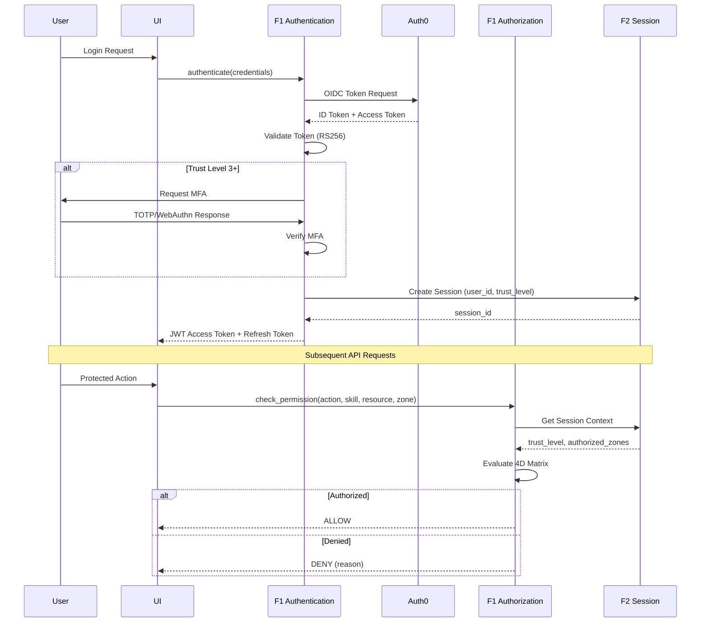

# BRD-01.1: F1 Identity & Access Management - Core

> **Navigation**: [Index](BRD-01.0_index.md) | [Next: Requirements](BRD-01.2_requirements.md)
> **Parent**: BRD-01 | **Section**: 1 of 3

---

## 0. Document Control

| Item | Details |
|------|---------|
| **Project Name** | AI Cost Monitoring Platform v4.2 - F1 IAM Module |
| **Document Version** | 1.0 |
| **Date** | 2026-01-14 |
| **Document Owner** | Chief Architect |
| **Prepared By** | Antigravity AI |
| **Status** | Draft |
| **MVP Target Launch** | Phase 1 |
| **PRD-Ready Score** | 92/100 (Target: >=90/100) |

### Executive Summary (MVP)

The F1 IAM Module provides enterprise-grade identity and access management for the AI Cost Monitoring Platform. It implements a 4-Dimensional Authorization Matrix (ACTION x SKILL x RESOURCE x ZONE) with multi-provider authentication (Auth0 primary, Google, mTLS, API keys) and a 4-tier trust level system. This foundation module is domain-agnostic and requires no knowledge of business logic—all skills and resources are configuration-injected.

### Document Revision History

| Version | Date | Author | Changes Made | Approver |
|---------|------|--------|--------------|----------|
| 1.0 | 2026-01-14 | Antigravity AI | Initial BRD creation from F1 Spec and Gap Analysis | |

---

## 1. Introduction

### 1.1 Purpose

This Business Requirements Document (BRD) defines the business requirements for the F1 Identity & Access Management Module. The F1 IAM Module handles all authentication and authorization for the platform using a Zero-Trust security model with multi-provider support and fine-grained access control.

@ref: [F1 IAM Technical Specification](../../00_REF/foundation/F1_IAM_Technical_Specification.md#1-executive-summary)

### 1.2 Document Scope

This document covers:
- Core authentication capabilities (multi-provider, MFA)
- 4D Authorization Matrix (ACTION x SKILL x RESOURCE x ZONE)
- Trust level system with progressive access rights
- User profile management with encrypted storage
- Gap remediation for enterprise compliance

**Out of Scope**:
- Domain-specific business logic (cloud_accounts, cost_analytics)
- Skill definitions (injected by domain layer)
- UI implementation details

### 1.3 Intended Audience

- Platform administrators (IAM configuration)
- DevOps engineers (deployment, integration)
- Security/Compliance officers (audit, policy)
- Development teams (API integration)

### 1.4 Document Conventions

- **Must/Shall**: P1 critical requirements
- **Should**: P2 important requirements
- **Future**: P3 post-MVP enhancements

---

## 2. Business Objectives

### 2.1 MVP Hypothesis

**If** we implement a domain-agnostic IAM foundation module with Zero-Trust authentication, 4D authorization matrix, and session management capabilities, **then** we will:
1. Enable secure multi-tenant platform operations with fine-grained access control
2. Reduce security incident response time through centralized session revocation
3. Achieve enterprise compliance requirements for authentication and authorization

**Validation Questions**:
- Can users authenticate via Auth0 and complete MFA enrollment within 5 minutes?
- Can the 4D authorization matrix be configured without code changes?
- Can compromised sessions be revoked within 1 second across all devices?

---

### 2.2 Business Problem Statement

**Current State**: Platform lacks centralized identity management with session revocation capabilities, SCIM provisioning, and passwordless authentication options.

**Impact**:
- Security incidents require manual session invalidation across services
- User provisioning is manual, error-prone, and not scalable for enterprise deployments
- Password-based authentication creates friction and security vulnerabilities

**Desired State**: Unified IAM foundation module providing Zero-Trust security, automated provisioning, and modern authentication methods.

---

### 2.3 MVP Business Goals

| Goal ID | Goal Statement | Success Indicator | Priority |
|---------|----------------|-------------------|----------|
| BRD.01.23.01 | Establish Zero-Trust authentication and authorization as platform security baseline | 100% unauthorized access attempts blocked | P1 |
| BRD.01.23.02 | Address identified IAM gaps for enterprise deployment readiness | 6/6 F1 gaps remediated | P1 |
| BRD.01.23.03 | Maintain portable, domain-agnostic design enabling platform reuse | 0 domain-specific code lines in F1 | P1 |

---

### BRD.01.23.01: Zero-Trust Security Posture

**Objective**: Implement Zero-Trust authentication and authorization where all access must be explicitly granted and verified.

**Business Driver**: Autonomous AI agents and financial operations require defense-in-depth security to prevent unauthorized access and data breaches.

@ref: [F1 Section 1](../../00_REF/foundation/F1_IAM_Technical_Specification.md#1-executive-summary)

---

### BRD.01.23.02: Enterprise IAM Compliance

**Objective**: Address identified IAM gaps to meet enterprise-grade platform requirements.

**Business Driver**: Current implementation lacks session revocation, SCIM provisioning, and passwordless authentication capabilities required for enterprise deployments.

@ref: [GAP_Foundation_Module_Gap_Analysis Section 2.2](../../00_REF/foundation/GAP_Foundation_Module_Gap_Analysis.md#22-identified-gaps)

---

### BRD.01.23.03: Portable Foundation Module

**Objective**: Maintain domain-agnostic design allowing F1 IAM to be reused across different platform deployments.

**Business Driver**: Foundation modules must have zero knowledge of business logic to enable portability and reduce coupling.

---

### 2.4 MVP Success Metrics

| Objective ID | Objective Statement | Success Metric | MVP Target | Measurement Period |
|--------------|---------------------|----------------|------------|-------------------|
| BRD.01.23.01 | Zero-Trust Security | Unauthorized access attempts blocked | 100% | 90 days post-launch |
| BRD.01.23.02 | Enterprise Compliance | Gap requirements implemented | 6/6 addressed | MVP + Phase 2 |
| BRD.01.23.03 | Portability | Domain-specific code in F1 | 0 lines | Continuous |

---

### 2.5 Expected Benefits (MVP Scope)

**Quantifiable Benefits**:

| Benefit ID | Benefit Statement | Baseline | Target | Measurement |
|------------|-------------------|----------|--------|-------------|
| BRD.01.25.01 | Reduce security incident response time | Hours (manual) | <1 second | Session revocation latency |
| BRD.01.25.02 | Enterprise compliance readiness | 0/6 gaps addressed | 6/6 addressed | Gap remediation tracking |
| BRD.01.25.03 | Integration efficiency | Multiple auth points | Single IAM integration | Domain layer integrations |

**Qualitative Benefits**:
- Consistent security posture across all platform components
- Reduced authentication complexity for development teams
- Foundation for progressive trust elevation and advanced access patterns
- Domain-agnostic design enabling platform reuse

---

## 3. Project Scope

### 3.1 MVP Scope Statement

The F1 IAM Module provides authentication, authorization, and user profile management as a domain-agnostic foundation layer consumed by all domain layers (D1-D7).

### 3.2 MVP Core Features (In-Scope)

**P1 - Must Have for MVP Launch**:
1. Multi-provider authentication (Auth0 primary, email/password fallback)
2. 4D Authorization Matrix implementation
3. Trust Level system (4 tiers: Viewer -> Admin)
4. MFA enforcement (TOTP, WebAuthn) for Trust 3+
5. Token management (JWT access, refresh rotation)
6. User profile with encrypted credential storage
7. Session Revocation API (GAP-F1-01)

**P2 - Should Have**:
1. SCIM 2.0 Provisioning (GAP-F1-02)
2. Passwordless Authentication Mode (GAP-F1-03)
3. Role Hierarchy with inheritance (GAP-F1-05)

**P3 - Future**:
1. Device Trust Verification (GAP-F1-04)
2. Time-Based Access Policies (GAP-F1-06)

### 3.3 Explicitly Out-of-Scope for MVP

- Domain-specific skills (injected by domain layers D1-D7)
- Agent-specific permissions (injected by D1)
- Mobile app authentication flows
- Enterprise SAML/OIDC (v1.3.0 roadmap)

### 3.4 MVP Workflow

The following diagram illustrates the core authentication and authorization flow for the F1 IAM Module:

**Workflow Summary**:
1. **Authentication**: User authenticates via Auth0, F1 validates token and enforces MFA for Trust 3+
2. **Session Creation**: F1 delegates session state to F2 Session module
3. **Authorization**: Each request is evaluated against the 4D Matrix (ACTION x SKILL x RESOURCE x ZONE)

### 3.5 Technology Stack

> **Note:** MVP uses Firebase Auth for simplicity. Production upgrades to Auth0 for enterprise features (SSO, MFA policies, organization management). See [ADR-008](../../00_REF/domain/architecture/adr/008-database-strategy-mvp.md).

| Component | MVP | Production | Reference |
|-----------|-----|------------|-----------|
| Primary IdP | Firebase Auth | Auth0 | ADR-008 |
| Token Format | JWT (RS256) | JWT (RS256) | F1 Section 3.5 |
| Password Hashing | Firebase managed | bcrypt (cost 12) | F1 Section 3.3 |
| MFA | Firebase (optional) | TOTP + WebAuthn | F1 Section 3.4 |
| Secrets | GCP Secret Manager | GCP Secret Manager | F6 |
| Database | Firestore | PostgreSQL (users) | ADR-008 |

---

## 4. Stakeholders

### Decision Makers

| Role | Responsibility | Key Decisions |
|------|----------------|---------------|
| **Executive Sponsor** | Final approval authority for F1 scope | Security investment, IdP vendor selection, compliance requirements |
| **Product Owner** | Feature prioritization for IAM capabilities | Trust level design, MFA requirements, gap remediation priority |
| **Technical Lead** | Architecture decisions for F1 implementation | Token strategy, session backend selection, integration patterns |

### Key Contributors

| Role | Involvement | Domain Focus |
|------|-------------|--------------|
| **Platform Administrator** | Configure IAM policies, manage trust levels, monitor access patterns | Policy configuration, trust level management, audit visibility |
| **DevOps Engineer** | Deploy IAM module, integrate with infrastructure, manage secrets | Infrastructure deployment, secret rotation, health monitoring |
| **Security/Compliance Officer** | Audit access, enforce policies, validate compliance | Audit logs, compliance reports, anomaly detection |
| **Development Team** | Integrate F1 APIs, implement authorization checks in domain layers | API contracts, SDK usage, domain layer integration |

---

## 5. User Stories

### 5.1 Primary User Stories (MVP Essential)

| Story ID | User Role | Action | Business Value | Priority |
|----------|-----------|--------|----------------|----------|
| BRD.01.09.01 | User | Login via Auth0 | Secure authentication with enterprise IdP | P1 |
| BRD.01.09.02 | User | Setup MFA (TOTP/WebAuthn) | Protected high-trust operations | P1 |
| BRD.01.09.03 | User | Verify permission for action | Fine-grained access control | P1 |
| BRD.01.09.04 | User | Elevate trust level | Progressive access for advanced features | P1 |
| BRD.01.09.05 | User | Update profile information | Personalized experience | P2 |
| BRD.01.09.06 | User | Logout and terminate session | Security control over access | P1 |
| BRD.01.09.07 | Service | Authenticate via API key | Machine-to-machine integration | P1 |
| BRD.01.09.08 | Admin | View audit logs | Compliance and security monitoring | P1 |

@ref: [F1 Sections 3.1-3.4](../../00_REF/foundation/F1_IAM_Technical_Specification.md#3-authentication-system), [F1 Section 6](../../00_REF/foundation/F1_IAM_Technical_Specification.md#6-event-system)

### 5.2 User Story Summary

- **Total MVP User Stories**: 8 (P1: 7, P2: 1)
- **Future Phase Stories**: SCIM provisioning, passwordless login, device trust

---

> **Navigation**: [Index](BRD-01.0_index.md) | [Next: Requirements](BRD-01.2_requirements.md)
