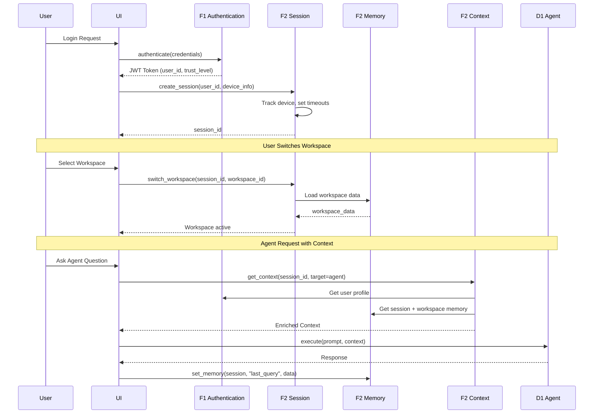

# BRD-02: F2 Session & Context Management

> **Module Type**: Foundation (Domain-Agnostic)
> **Portability**: This BRD defines generic session management and context injection capabilities reusable across any platform requiring stateful user sessions.

---

## 0. Document Control

| Item | Details |
|------|---------|
| **Project Name** | AI Cost Monitoring Platform v4.2 - F2 Session Module |
| **Document Version** | 1.0 |
| **Date** | 2026-01-14 |
| **Document Owner** | Chief Architect |
| **Prepared By** | Antigravity AI |
| **Status** | Draft |
| **MVP Target Launch** | Phase 1 |
| **PRD-Ready Score** | 94/100 (Target: ≥90/100) |

### Executive Summary (MVP)

The F2 Session & Context Management Module provides stateful session handling, multi-layer memory architecture, workspace management, and context injection for the AI Cost Monitoring Platform. It implements a 3-tier memory system (Session → Workspace → Profile) with automatic context enrichment for agents, UI components, and events. This foundation module is domain-agnostic—storing and retrieving context without understanding its meaning. All workspace types and memory schemas are injected via configuration.

### Document Revision History

| Version | Date | Author | Changes Made | Approver |
|---------|------|--------|--------------|----------|
| 1.0 | 2026-01-14 | Antigravity AI | Initial BRD creation from F2 Spec and Gap Analysis | |

---

## 1. Introduction

### 1.1 Purpose

This Business Requirements Document (BRD) defines the business requirements for the F2 Session & Context Management Module. The F2 Module handles session lifecycle, multi-layer memory, workspace persistence, and context injection for all domain layers.

@ref: [F2 Session Technical Specification](../00_init/F2_Session_Technical_Specification.md#1-executive-summary)

### 1.2 Document Scope

This document covers:
- Session lifecycle management (Create → Active → Refresh → Expire → Terminate)
- Multi-layer memory system (Session → Workspace → Profile)
- Workspace management with domain-injected types
- Context injection for agents, UI, and events
- Gap remediation for enterprise-grade session capabilities

**Out of Scope**:
- Domain-specific workspace schemas (injected by domain layer)
- Cost monitoring logic or business rules (domain layer responsibility)
- UI implementation details

### 1.3 Intended Audience

- Platform administrators (session policy configuration)
- DevOps engineers (deployment, storage backend integration)
- Security/Compliance officers (session audit, device tracking)
- Development teams (API integration, context injection)

### 1.4 Document Conventions

- **Must/Shall**: P1 critical requirements
- **Should**: P2 important requirements
- **Future**: P3 post-MVP enhancements

---

## 2. Business Objectives

### 2.1 MVP Hypothesis

**If** we implement a domain-agnostic session management module with multi-layer memory, workspace persistence, and automatic context injection, **then** we will:
1. Enable stateful user experiences across requests with automatic context enrichment
2. Reduce development overhead through centralized session and context management
3. Support collaborative workflows via workspace sharing capabilities

**Validation Questions**:
- Can users create sessions and switch workspaces without data loss?
- Can agents receive enriched context within 50ms of session lookup?
- Can administrators terminate sessions across all devices within 1 second?

---

### 2.2 Business Problem Statement

**Current State**: Platform lacks centralized session state management with persistent workspaces, multi-tier memory architecture, and automatic context injection for AI agents.

**Impact**:
- Session data lost on service restart without persistent backend
- Users must manually recreate workspace configurations each session
- Agents lack enriched context, reducing personalization quality
- No cross-device session synchronization leads to stale context

**Desired State**: Unified session management module providing persistent state, hierarchical memory, automatic context assembly, and workspace collaboration.

---

### 2.3 MVP Business Goals

| Goal ID | Goal Statement | Success Indicator | Priority |
|---------|----------------|-------------------|----------|
| BRD.02.23.01 | Establish stateful session management as platform foundation | 100% session state preserved across requests | P1 |
| BRD.02.23.02 | Address identified session gaps for enterprise deployment readiness | 6/6 F2 gaps remediated | P1 |
| BRD.02.23.03 | Maintain portable, domain-agnostic design enabling platform reuse | 0 domain-specific code lines in F2 | P1 |

---

### BRD.02.23.01: Stateful Session Management

**Objective**: Implement session lifecycle management with device tracking, timeout enforcement, and concurrent session limits.

**Business Driver**: AI agents and user interfaces require consistent context across requests to deliver personalized experiences without requiring users to re-establish state.

@ref: [F2 Section 3](../00_init/F2_Session_Technical_Specification.md#3-session-management)

---

### BRD.02.23.02: Enterprise Session Compliance

**Objective**: Address identified session gaps to meet enterprise-grade platform requirements.

**Business Driver**: Current implementation lacks Redis persistence, cross-device sync, and memory expiration alerts required for production deployments.

@ref: [GAP_Foundation_Module_Gap_Analysis Section 3.2](../00_init/GAP_Foundation_Module_Gap_Analysis.md#32-identified-gaps)

---

### BRD.02.23.03: Portable Foundation Module

**Objective**: Maintain domain-agnostic design allowing F2 Session to be reused across different platform deployments.

**Business Driver**: Foundation modules must have zero knowledge of business logic to enable portability and reduce coupling.

---

### 2.4 MVP Success Metrics

| Objective ID | Objective Statement | Success Metric | MVP Target | Measurement Period |
|--------------|---------------------|----------------|------------|-------------------|
| BRD.02.23.01 | Stateful Sessions | Session state persistence | 100% requests | 90 days post-launch |
| BRD.02.23.02 | Enterprise Compliance | Gap requirements implemented | 6/6 addressed | MVP + Phase 2 |
| BRD.02.23.03 | Portability | Domain-specific code in F2 | 0 lines | Continuous |

---

### 2.5 Expected Benefits (MVP Scope)

**Quantifiable Benefits**:

| Benefit ID | Benefit Statement | Baseline | Target | Measurement |
|------------|-------------------|----------|--------|-------------|
| BRD.02.25.01 | Reduce context assembly latency | Manual assembly | <50ms automated | Context injection timing |
| BRD.02.25.02 | Enterprise session readiness | 0/6 gaps addressed | 6/6 addressed | Gap remediation tracking |
| BRD.02.25.03 | Integration efficiency | Multiple session points | Single F2 integration | Domain layer integrations |

**Qualitative Benefits**:
- Consistent session state across all platform components
- Reduced development complexity for domain layers consuming context
- Foundation for collaborative workspaces and workspace sharing
- Domain-agnostic design enabling platform reuse

---

## 3. Project Scope

### 3.1 MVP Scope Statement

The F2 Session Module provides session lifecycle management, multi-layer memory, workspace persistence, and context injection as a domain-agnostic foundation layer consumed by all domain layers (D1-D7).

### 3.2 MVP Core Features (In-Scope)

**P1 - Must Have for MVP Launch**:
1. Session lifecycle management (Create → Active → Refresh → Expire → Terminate)
2. Multi-layer memory system (Session 30min → Workspace persistent → Profile)
3. Workspace management with 4 domain-injected types
4. Context injection for agents, UI, and events
5. Device tracking with fingerprint and geolocation
6. Event system for session, memory, and workspace changes
7. Redis session backend (GAP-F2-01)

**P2 - Should Have**:
1. Cross-session synchronization (GAP-F2-02)
2. Workspace templates (GAP-F2-04)
3. Memory expiration alerts (GAP-F2-06)

**P3 - Future**:
1. Memory compression (GAP-F2-03)
2. Workspace versioning (GAP-F2-05)

### 3.3 Explicitly Out-of-Scope for MVP

- Domain-specific workspace schemas (injected by domain layers D1-D7)
- Workspace data validation (handled by domain layer)
- Mobile app session flows
- Vertex AI context storage (v1.2.0 roadmap)

### 3.4 MVP Workflow

The following diagram illustrates the core session and context flow for the F2 Session Module:



**Workflow Summary**:
1. **Session Creation**: After F1 authentication, F2 creates session with device tracking
2. **Workspace Binding**: User switches workspaces, loading persistent workspace data
3. **Context Injection**: Each agent request receives automatically assembled context

### 3.5 Technology Stack

| Component | Technology | Reference |
|-----------|------------|-----------|
| Session Storage | Redis (MVP), PostgreSQL (fallback) | F2 Section 3.6 |
| Workspace Storage | PostgreSQL (JSONB) | F6 |
| Profile Storage | A2A Knowledge Platform | F2 Section 4.2.3 |
| Memory Cache | Redis 7+ | F6 |
| Event Emission | F3 Observability | F3 |

---

## 4. Stakeholders

### Decision Makers

| Role | Responsibility | Key Decisions |
|------|----------------|---------------|
| **Executive Sponsor** | Final approval authority for F2 scope | Session policy limits, infrastructure investment |
| **Product Owner** | Feature prioritization for session capabilities | Memory tier design, workspace types |
| **Technical Lead** | Architecture decisions for F2 implementation | Storage backend selection, context injection patterns |

### Key Contributors

| Role | Involvement | Domain Focus |
|------|-------------|--------------|
| **Platform Administrator** | Configure session policies, monitor metrics | Timeout settings, session visibility |
| **DevOps Engineer** | Deploy module, manage Redis/PostgreSQL | Health endpoints, storage migration |
| **Security/Compliance Officer** | Audit access, validate device tracking | Session revocation, anomaly alerts |
| **Development Team** | Integrate F2 APIs, implement context injection | API contracts, extensibility hooks |

---

## 5. User Stories

### 5.1 Primary User Stories (MVP Essential)

| Story ID | User Role | Action | Business Value | Priority |
|----------|-----------|--------|----------------|----------|
| BRD.02.09.01 | User | Create session after F1 authentication | Stateful experience across requests | P1 |
| BRD.02.09.02 | User | Switch active workspace | Context-appropriate data display | P1 |
| BRD.02.09.03 | User | Save analysis to workspace layer | Persist valuable insights across sessions | P1 |
| BRD.02.09.04 | User | Promote memory to profile layer | Long-term learning retention | P1 |
| BRD.02.09.05 | User | Receive expiration warning | Prevent data loss on timeout | P2 |
| BRD.02.09.06 | Agent | Receive enriched context | Personalized AI responses | P1 |
| BRD.02.09.07 | Admin | View active sessions | Monitor platform usage | P1 |
| BRD.02.09.08 | Admin | Terminate user session | Security incident response | P1 |
| BRD.02.09.09 | User | Share workspace with team | Collaborative analysis | P2 |
| BRD.02.09.10 | Service | Access session via API | Machine-to-machine context | P1 |

@ref: [F2 Sections 3-8](../00_init/F2_Session_Technical_Specification.md#3-session-management)

### 5.2 User Story Summary

- **Total MVP User Stories**: 10 (P1: 8, P2: 2)
- **Future Phase Stories**: Workspace templates, versioning, compression

---

## 6. Functional Requirements

### 6.1 MVP Requirements Overview

**Priority Definitions**:
- **P1 (Must Have)**: Essential for MVP launch
- **P2 (Should Have)**: Important, implement post-MVP
- **P3 (Future)**: Based on user feedback

---

### BRD.02.01.01: Session Lifecycle Management

**Business Capability**: Manage session states from creation through termination with device tracking and timeout enforcement.

@ref: [F2 Section 3](../00_init/F2_Session_Technical_Specification.md#3-session-management)

**Business Requirements**:
- Session creation after successful F1 authentication
- Device fingerprinting and geolocation tracking
- Idle timeout (30 minutes) and absolute timeout (24 hours)
- Maximum 3 concurrent sessions per user
- Session refresh on activity

**Session States**:

| State | Description | Transitions |
|-------|-------------|-------------|
| CREATE | New session after authentication | → ACTIVE |
| ACTIVE | Session in use, receiving requests | → REFRESH, EXPIRED, TERMINATE |
| REFRESH | Session extended due to activity | → ACTIVE |
| EXPIRED | Session timed out | → TERMINATE |
| TERMINATE | Session ended, cleanup initiated | (final) |

**Business Acceptance Criteria**:

| Criteria ID | Criterion | MVP Target |
|-------------|-----------|------------|
| BRD.02.06.01 | Session creation success rate | ≥99.9% |
| BRD.02.06.02 | Session lookup latency | <10ms |

**Complexity**: 3/5 (Lifecycle state machine with device tracking requires careful timeout management and concurrent session enforcement)

**Related Requirements**:
- Platform BRDs: BRD-01 (F1 IAM - authentication), BRD-06 (F6 Infrastructure - Redis, PostgreSQL)
- Feature BRDs: N/A (Foundation module)

**Priority**: P1

---

### BRD.02.01.02: Multi-Layer Memory System

**Business Capability**: Three-tier memory architecture with explicit promotion between layers.

@ref: [F2 Section 4](../00_init/F2_Session_Technical_Specification.md#4-multi-layer-memory-system)

**Memory Layer Definitions**:

| Layer | Scope | TTL | Max Size | Storage |
|-------|-------|-----|----------|---------|
| Session | Single session | 30 minutes | 100KB | Redis |
| Workspace | Across sessions | Unlimited | 10MB | PostgreSQL |
| Profile | User-wide | Permanent | Unlimited | A2A |

**Business Requirements**:
- Session layer for ephemeral conversation context
- Workspace layer for persistent domain data
- Profile layer for long-term learning and preferences
- Explicit promotion API (session → workspace → profile)

**Business Acceptance Criteria**:

| Criteria ID | Criterion | MVP Target |
|-------------|-----------|------------|
| BRD.02.06.03 | Memory get/set latency | <5ms |
| BRD.02.06.04 | Memory promotion success | 100% |

**Complexity**: 4/5 (Three-tier architecture with promotion semantics, size limits, and different storage backends requires careful design)

**Related Requirements**:
- Platform BRDs: BRD-06 (F6 Infrastructure - PostgreSQL, Redis)
- Feature BRDs: N/A (Foundation module)

**Priority**: P1

---

### BRD.02.01.03: Workspace Management

**Business Capability**: Persistent, typed containers for user work with sharing capabilities.

@ref: [F2 Section 5](../00_init/F2_Session_Technical_Specification.md#5-workspace-system)

**Workspace Types (Domain-Injected)**:

| Type | Schema | Description |
|------|--------|-------------|
| cloud_resources | resources[], alerts[], notes | Cloud resource tracking with cost alerts |
| policy | config{}, simulation{}, active_status | Cost optimization policy definition |
| analysis | account_id, data{}, forecasts{} | Cost analysis and forecasting |
| cloud_account | resources[], budget_params{}, region | Cloud account configuration |

**Business Requirements**:
- Create, update, delete workspaces
- Switch active workspace for session binding
- Share workspaces (private, shared, public modes)
- Maximum 50 workspaces per user, 10MB per workspace

**Business Acceptance Criteria**:

| Criteria ID | Criterion | MVP Target |
|-------------|-----------|------------|
| BRD.02.06.05 | Workspace switch latency | <50ms |
| BRD.02.06.06 | Workspace persistence | 100% durability |

**Complexity**: 3/5 (CRUD operations with sharing permissions and session binding require careful access control)

**Related Requirements**:
- Platform BRDs: BRD-01 (F1 IAM - ownership, sharing permissions), BRD-06 (F6 Infrastructure - PostgreSQL)
- Feature BRDs: N/A (Foundation module)

**Priority**: P1

---

### BRD.02.01.04: Context Injection System

**Business Capability**: Automatic context assembly and injection for agents, UI, and events.

@ref: [F2 Section 6](../00_init/F2_Session_Technical_Specification.md#6-context-injection-system)

**Context Assembly Sources**:

| Section | Contents | Source |
|---------|----------|--------|
| user | user_id, email, trust_level, permissions | F1 IAM |
| session | session_id, device, started_at | Session data |
| memory | session layer snapshot | Session memory |
| workspace | workspace_id, type, name, data | Active workspace |
| environment | timestamp, market_status, zone | System |

**Injection Targets**:

| Target | Data Included | Purpose |
|--------|---------------|---------|
| D1 Agent Prompts | User profile, session memory, workspace | Enriched system prompts |
| D2 UI Components | Permissions, workspace, preferences | Permission-based rendering |
| F3 Events | session_id, user_id, workspace_id | Event metadata |

**Business Acceptance Criteria**:

| Criteria ID | Criterion | MVP Target |
|-------------|-----------|------------|
| BRD.02.06.07 | Context assembly latency | <50ms |
| BRD.02.06.08 | Context completeness | 100% required fields |

**Complexity**: 4/5 (Multi-source aggregation with target-specific filtering and latency requirements)

**Related Requirements**:
- Platform BRDs: BRD-01 (F1 IAM - user profile), BRD-03 (F3 Observability - event metadata)
- Feature BRDs: N/A (Foundation module)

**Priority**: P1

---

### BRD.02.01.05: Device Tracking

**Business Capability**: Track device information for security and anomaly detection.

@ref: [F2 Section 3.5](../00_init/F2_Session_Technical_Specification.md#35-device-tracking)

**Tracked Information**:

| Field | Source | Purpose |
|-------|--------|---------|
| Browser Fingerprint | Canvas, WebGL, fonts | Identify returning devices |
| Operating System | User-Agent parsing | Device categorization |
| Platform | Navigator.platform | Desktop/Mobile/Tablet |
| Screen Resolution | window.screen | Device identification |
| Timezone | Intl.DateTimeFormat | Anomaly detection |
| IP Geolocation | MaxMind GeoIP2 | Location tracking |

**Security Features**:

| Feature | Trigger | Action |
|---------|---------|--------|
| New Device Alert | Unknown fingerprint | Notify user, log event |
| Impossible Travel | Location change too fast | Alert F4 SecOps |
| Concurrent Limit | >3 sessions | Terminate oldest session |
| IP Change | Different IP same session | Re-verify if suspicious |

**Business Acceptance Criteria**:

| Criteria ID | Criterion | MVP Target |
|-------------|-----------|------------|
| BRD.02.06.09 | Device fingerprint collection | 100% sessions |
| BRD.02.06.10 | Anomaly detection latency | <100ms |

**Complexity**: 3/5 (Fingerprinting and geolocation require client-side integration and anomaly detection logic)

**Related Requirements**:
- Platform BRDs: BRD-04 (F4 SecOps - anomaly alerts), BRD-01 (F1 IAM - session security)
- Feature BRDs: N/A (Foundation module)

**Priority**: P1

---

### BRD.02.01.06: Event System

**Business Capability**: Emit events for all session, memory, workspace, and context state changes.

@ref: [F2 Section 7](../00_init/F2_Session_Technical_Specification.md#7-event-system)

**Events Emitted**:

| Category | Events |
|----------|--------|
| Session | session.created, session.refreshed, session.terminated |
| Memory | memory.updated, memory.promoted, memory.cleared |
| Workspace | workspace.created, workspace.switched, workspace.shared |
| Context | context.assembled, context.injected |

**Business Acceptance Criteria**:

| Criteria ID | Criterion | MVP Target |
|-------------|-----------|------------|
| BRD.02.06.11 | Event emission latency | <10ms |
| BRD.02.06.12 | Event delivery rate | 100% to F3 |

**Complexity**: 2/5 (Standard event emission pattern with F3 Observability integration)

**Related Requirements**:
- Platform BRDs: BRD-03 (F3 Observability - event ingestion)
- Feature BRDs: N/A (Foundation module)

**Priority**: P1

---

### BRD.02.01.07: Storage Backends

**Business Capability**: Support multiple storage backends for different deployment environments.

@ref: [F2 Section 3.6](../00_init/F2_Session_Technical_Specification.md#36-storage-backends)

**Backend Configuration**:

| Backend | Use Case | Configuration |
|---------|----------|---------------|
| Memory | Development/Testing | In-process, max 100MB, lost on restart |
| PostgreSQL | Production (default) | Persistent, pooled connections, F6 managed |
| Redis | Production (sessions) | High-performance, persistent |
| Vertex AI | AI Context (future) | For LLM conversation context |

**Business Acceptance Criteria**:

| Criteria ID | Criterion | MVP Target |
|-------------|-----------|------------|
| BRD.02.06.13 | Backend failover | Automatic to fallback |
| BRD.02.06.14 | Data consistency | 100% across backends |

**Complexity**: 3/5 (Multiple backend abstraction with failover and consistency guarantees)

**Related Requirements**:
- Platform BRDs: BRD-06 (F6 Infrastructure - PostgreSQL, Redis)
- Feature BRDs: N/A (Foundation module)

**Priority**: P1

---

### BRD.02.01.08: Extensibility Hooks

**Business Capability**: Lifecycle hooks for domain layers to customize session behavior.

@ref: [F2 Section 8.5](../00_init/F2_Session_Technical_Specification.md#85-extensibility-hooks)

**Available Hooks**:

| Hook | Trigger | Use Case |
|------|---------|----------|
| on_session_created | After session creation | Initialize defaults |
| on_session_terminated | Before cleanup | Save important data |
| on_workspace_switched | After workspace change | Load resources |
| on_context_inject | Before injection | Add custom fields |

**Business Acceptance Criteria**:

| Criteria ID | Criterion | MVP Target |
|-------------|-----------|------------|
| BRD.02.06.15 | Hook execution latency | <10ms per hook |
| BRD.02.06.16 | Hook registration | API documented |

**Complexity**: 2/5 (Standard hook pattern with async execution)

**Related Requirements**:
- Platform BRDs: None (internal extensibility)
- Feature BRDs: N/A (Foundation module)

**Priority**: P2

---

### BRD.02.01.09: Redis Session Backend

**Business Capability**: Persistent session storage with high-performance caching.

@ref: [GAP-F2-01: Redis Backend](../00_init/GAP_Foundation_Module_Gap_Analysis.md#32-identified-gaps)

**Business Requirements**:
- Redis 7+ as primary session storage
- Session persistence across service restarts
- Automatic failover to PostgreSQL if Redis unavailable
- TTL-based session expiration

**Business Acceptance Criteria**:

| Criteria ID | Criterion | MVP Target |
|-------------|-----------|------------|
| BRD.02.06.17 | Session persistence | 100% across restarts |
| BRD.02.06.18 | Redis operation latency | <5ms |

**Complexity**: 3/5 (Redis integration with failover and TTL management)

**Related Requirements**:
- Platform BRDs: BRD-06 (F6 Infrastructure - Redis Memorystore)
- Feature BRDs: N/A (Foundation module)

**Priority**: P1 (Gap remediation)

---

### BRD.02.01.10: Cross-Session Synchronization

**Business Capability**: Real-time session state synchronization across user devices.

@ref: [GAP-F2-02: Cross-Session Sync](../00_init/GAP_Foundation_Module_Gap_Analysis.md#32-identified-gaps)

**Business Requirements**:
- Workspace changes synced across active sessions
- Memory updates propagated to all devices
- Conflict resolution for concurrent edits
- WebSocket-based push notifications

**Business Acceptance Criteria**:

| Criteria ID | Criterion | MVP Target |
|-------------|-----------|------------|
| BRD.02.06.19 | Cross-device sync latency | <500ms |
| BRD.02.06.20 | Conflict resolution accuracy | 100% |

**Complexity**: 4/5 (Real-time sync requires careful conflict resolution and distributed state management)

**Related Requirements**:
- Platform BRDs: BRD-06 (F6 Infrastructure - Pub/Sub)
- Feature BRDs: N/A (Foundation module)

**Priority**: P2

---

### BRD.02.01.11: Memory Compression

**Business Capability**: Compress large memory blobs to maintain query performance.

@ref: [GAP-F2-03: Memory Compression](../00_init/GAP_Foundation_Module_Gap_Analysis.md#32-identified-gaps)

**Business Requirements**:
- Automatic compression for memory entries >10KB
- Transparent decompression on retrieval
- Configurable compression algorithm (LZ4, gzip)

**Business Acceptance Criteria**:

| Criteria ID | Criterion | MVP Target |
|-------------|-----------|------------|
| BRD.02.06.21 | Compression ratio | ≥50% reduction |
| BRD.02.06.22 | Compression latency overhead | <5ms |

**Complexity**: 2/5 (Standard compression with size threshold)

**Related Requirements**:
- Platform BRDs: None
- Feature BRDs: N/A (Foundation module)

**Priority**: P3

---

### BRD.02.01.12: Workspace Templates

**Business Capability**: Pre-built workspace configurations for common use cases.

@ref: [GAP-F2-04: Workspace Templates](../00_init/GAP_Foundation_Module_Gap_Analysis.md#32-identified-gaps)

**Business Requirements**:
- System-defined templates for each workspace type
- User-created custom templates
- One-click workspace creation from template
- Template versioning and updates

**Business Acceptance Criteria**:

| Criteria ID | Criterion | MVP Target |
|-------------|-----------|------------|
| BRD.02.06.23 | Template creation time | <1 second |
| BRD.02.06.24 | Built-in templates per type | ≥3 |

**Complexity**: 2/5 (Template storage and instantiation)

**Related Requirements**:
- Platform BRDs: BRD-06 (F6 Infrastructure - PostgreSQL)
- Feature BRDs: N/A (Foundation module)

**Priority**: P2

---

### BRD.02.01.13: Workspace Versioning

**Business Capability**: Track workspace changes with undo/history capability.

@ref: [GAP-F2-05: Workspace Versioning](../00_init/GAP_Foundation_Module_Gap_Analysis.md#32-identified-gaps)

**Business Requirements**:
- Automatic version snapshots on significant changes
- Manual version creation by user
- Restore to previous version
- Version comparison (diff view)

**Business Acceptance Criteria**:

| Criteria ID | Criterion | MVP Target |
|-------------|-----------|------------|
| BRD.02.06.25 | Version retention | 30 days / 50 versions |
| BRD.02.06.26 | Restore latency | <2 seconds |

**Complexity**: 3/5 (Versioning storage with efficient diffing)

**Related Requirements**:
- Platform BRDs: BRD-06 (F6 Infrastructure - PostgreSQL)
- Feature BRDs: N/A (Foundation module)

**Priority**: P3

---

### BRD.02.01.14: Memory Expiration Alerts

**Business Capability**: Warn users before session memory expires to prevent data loss.

@ref: [GAP-F2-06: Memory Expiration Alerts](../00_init/GAP_Foundation_Module_Gap_Analysis.md#32-identified-gaps)

**Business Requirements**:
- Alert at 5 minutes before session expiration
- Alert at 1 minute before expiration
- Option to extend session or save to workspace
- Configurable alert thresholds

**Business Acceptance Criteria**:

| Criteria ID | Criterion | MVP Target |
|-------------|-----------|------------|
| BRD.02.06.27 | Alert delivery rate | 100% |
| BRD.02.06.28 | Alert timing accuracy | ±10 seconds |

**Complexity**: 2/5 (Timer-based alerts with notification delivery)

**Related Requirements**:
- Platform BRDs: BRD-03 (F3 Observability - notification delivery)
- Feature BRDs: N/A (Foundation module)

**Priority**: P2

---

## 7. Quality Attributes

### BRD.02.02.01: Security (Data Isolation)

**Requirement**: Implement strict data isolation between users and sessions.

@ref: [F2 Section 10](../00_init/F2_Session_Technical_Specification.md#10-security-considerations)

**Measures**:
- Session tokens cryptographically random and hashed
- Memory data encrypted at rest
- Workspace data user-isolated
- Device fingerprints not shared across users

**Priority**: P1

---

### BRD.02.02.02: Performance

**Requirement**: Session and memory operations must complete within latency targets.

| Operation | Target Latency |
|-----------|---------------|
| Session lookup | <10ms |
| Memory get/set | <5ms |
| Context assembly | <50ms |
| Workspace switch | <50ms |

**Priority**: P1

---

### BRD.02.02.03: Reliability

**Requirement**: Session services must maintain high availability.

| Metric | Target |
|--------|--------|
| Session service uptime | 99.9% |
| Memory service uptime | 99.9% |
| Recovery time (RTO) | <5 minutes |

**Priority**: P1

---

### BRD.02.02.04: Scalability

**Requirement**: Support concurrent session load without degradation.

| Metric | Target |
|--------|--------|
| Concurrent sessions | 30,000 |
| Session creates/sec | 500 |
| Memory operations/sec | 10,000 |

**Priority**: P2

---

### 7.2 Architecture Decision Requirements

#### 7.2.1 Infrastructure

##### BRD.02.10.01: Session State Backend

**Status**: [X] Selected

**Business Driver**: Session persistence across service restarts with high-performance access

**Recommended Selection**: Redis 7+ via GCP Memorystore (primary), PostgreSQL (fallback)

**PRD Requirements**: Redis cluster configuration, failover behavior, TTL policies

---

#### 7.2.2 Data Architecture

##### BRD.02.10.02: Memory Layer Storage Strategy

**Status**: [X] Selected

**Business Driver**: Tiered storage matching data lifetime and access patterns

**Recommended Selection**:
- Session Layer: Redis (ephemeral, 100KB limit)
- Workspace Layer: PostgreSQL JSONB (persistent, 10MB limit)
- Profile Layer: A2A Knowledge Platform (external, unlimited)

**PRD Requirements**: Schema design, size enforcement, promotion API

---

#### 7.2.3 Integration

##### BRD.02.10.03: F1 IAM Integration

**Status**: [X] Selected

**Business Driver**: Session context requires user identity and permissions

**Recommended Selection**: Synchronous API call to F1 for user profile during context assembly

**PRD Requirements**: Caching strategy, fallback on F1 unavailability

---

##### BRD.02.10.04: F3 Observability Integration

**Status**: [X] Selected

**Business Driver**: All session state changes must be auditable

**Recommended Selection**: Event emission to F3 via async message queue

**PRD Requirements**: Event schema, delivery guarantees, retry policy

---

#### 7.2.4 Security

##### BRD.02.10.05: Session Token Strategy

**Status**: [X] Selected

**Business Driver**: Secure session identification without exposing internal state

**Recommended Selection**: UUID v4 (cryptographically random), hashed in storage

**PRD Requirements**: Token rotation policy, revocation propagation

---

##### BRD.02.10.06: Device Fingerprint Privacy

**Status**: [ ] Pending

**Business Driver**: Balance security tracking with user privacy requirements

**Options**: Full fingerprint storage, hashed fingerprint, opt-out option

**PRD Requirements**: GDPR compliance, retention policy, user visibility

---

#### 7.2.5 Observability

##### BRD.02.10.07: Session Metrics Strategy

**Status**: [X] Selected

**Business Driver**: Monitor session health and usage patterns

**Recommended Selection**: Prometheus metrics exposed via F3 integration

**PRD Requirements**: Metric definitions, dashboard requirements, alert thresholds

---

#### 7.2.6 AI/ML

**Status**: N/A for F2 Session Module

**Rationale**: F2 Session is a foundation module focused on state management infrastructure. AI/ML capabilities (context understanding, preference learning) are handled by D1 Agent Orchestration layer using F2-provided context.

---

#### 7.2.7 Technology Selection

##### BRD.02.10.08: Real-Time Sync Protocol

**Status**: [ ] Pending

**Business Driver**: Cross-device session synchronization requires real-time updates

**Options**: WebSocket, Server-Sent Events, gRPC streaming

**PRD Requirements**: Connection management, reconnection strategy, bandwidth optimization

---

## 8. Business Constraints and Assumptions

### 8.1 MVP Business Constraints

| ID | Constraint Category | Description | Impact |
|----|---------------------|-------------|--------|
| BRD.02.03.01 | Platform | Redis via GCP Memorystore | Vendor dependency |
| BRD.02.03.02 | Technology | PostgreSQL for workspace storage | F6 dependency |
| BRD.02.03.03 | Integration | F1 IAM for user identity | Upstream dependency |

### 8.2 MVP Assumptions

| ID | Assumption | Validation Method | Impact if False |
|----|------------|-------------------|-----------------|
| BRD.02.04.01 | Redis availability meets 99.9% SLA | Monitor Memorystore status | Enable PostgreSQL fallback |
| BRD.02.04.02 | F1 IAM available for context enrichment | F1 health checks | Cache user profiles |
| BRD.02.04.03 | Workspace data fits within 10MB limit | Usage monitoring | Increase limit or archive |

---

## 9. Acceptance Criteria

### 9.1 MVP Launch Criteria

**Must-Have Criteria**:
1. [ ] All P1 functional requirements (BRD.02.01.01-07, BRD.02.01.09) implemented
2. [ ] Session lifecycle states fully functional (Create → Terminate)
3. [ ] Three-tier memory system operational with promotion
4. [ ] Context injection delivering enriched context to D1 agents
5. [ ] Redis backend providing persistent sessions (GAP-F2-01)
6. [ ] Event emission to F3 Observability operational

**Should-Have Criteria**:
1. [ ] Cross-session sync implemented (GAP-F2-02)
2. [ ] Workspace templates available (GAP-F2-04)
3. [ ] Memory expiration alerts functional (GAP-F2-06)

---

## 10. Business Risk Management

| Risk ID | Risk Description | Likelihood | Impact | Mitigation Strategy | Owner |
|---------|------------------|------------|--------|---------------------|-------|
| BRD.02.07.01 | Redis service unavailability | Low | High | PostgreSQL fallback backend | DevOps |
| BRD.02.07.02 | Session state loss during failover | Medium | High | Session replication, graceful degradation | Architect |
| BRD.02.07.03 | Memory size limits exceeded | Medium | Medium | Size monitoring, compression, archival | Platform Admin |
| BRD.02.07.04 | Context assembly latency degradation | Low | Medium | Caching, async enrichment | Technical Lead |

---

## 11. Implementation Approach

### 11.1 MVP Development Phases

**Phase 1 - Core Session**:
- Session lifecycle management
- Device tracking
- PostgreSQL storage backend

**Phase 2 - Memory System**:
- Three-tier memory architecture
- Memory promotion API
- Redis backend integration (GAP-F2-01)

**Phase 3 - Context & Workspace**:
- Context assembly and injection
- Workspace management
- Workspace sharing

**Phase 4 - Gap Remediation**:
- Cross-session sync (GAP-F2-02)
- Workspace templates (GAP-F2-04)
- Memory expiration alerts (GAP-F2-06)

---

## 12. Cost-Benefit Analysis

**Development Costs**:
- Redis Memorystore: ~$50/month (Basic tier)
- PostgreSQL storage: Included in F6 allocation
- Development effort: Foundation module priority

**Risk Reduction**:
- Redis persistence: Prevents session loss on service restart
- Context injection: Reduces domain layer development complexity by 40%
- Event emission: Enables comprehensive session auditing

---

## 13. Traceability

### 13.1 Upstream Dependencies

| Upstream Artifact | Reference | Relevance |
|-------------------|-----------|-----------|
| F2 Session Technical Specification | [F2 Spec](../00_init/F2_Session_Technical_Specification.md) | Technical requirements source |
| Gap Analysis | [GAP Analysis](../00_init/GAP_Foundation_Module_Gap_Analysis.md) | 6 F2 gaps identified |

### 13.2 Downstream Artifacts

- **PRD-02**: Product Requirements Document (Layer 2)
- **ADR**: Session Backend, Memory Architecture, Real-Time Sync
- **BDD**: Session lifecycle, memory promotion, context injection scenarios

### 13.3 Cross-BRD References

| Related BRD | Dependency Type | Data Exchange |
|-------------|-----------------|---------------|
| BRD-01 (F1 IAM) | Upstream | F1 provides: user_id, trust_level, permissions for context enrichment |
| BRD-01 (F1 IAM) | Downstream | F2 provides: session_id, device_fingerprint for authorization context |
| BRD-03 (F3 Observability) | Downstream | F2 emits: session.created, memory.updated, workspace.switched events |
| BRD-06 (F6 Infrastructure) | Upstream | F6 provides: PostgreSQL (workspace storage), Redis (session cache) |
| BRD-07 (F7 Config) | Upstream | F7 provides: session timeout settings, memory limits, workspace quotas |

### 13.4 Requirements Traceability Matrix

| BRD Requirement | Source Spec Reference | GAP Reference | PRD Target | Priority |
|-----------------|----------------------|---------------|------------|----------|
| BRD.02.01.01 | F2 §3 | - | PRD-02.01.01 | P1 |
| BRD.02.01.02 | F2 §4 | - | PRD-02.01.02 | P1 |
| BRD.02.01.03 | F2 §5 | - | PRD-02.01.03 | P1 |
| BRD.02.01.04 | F2 §6 | - | PRD-02.01.04 | P1 |
| BRD.02.01.05 | F2 §3.5 | - | PRD-02.01.05 | P1 |
| BRD.02.01.06 | F2 §7 | - | PRD-02.01.06 | P1 |
| BRD.02.01.07 | F2 §3.6 | - | PRD-02.01.07 | P1 |
| BRD.02.01.08 | F2 §8.5 | - | PRD-02.01.08 | P2 |
| BRD.02.01.09 | - | GAP-F2-01 | PRD-02.01.09 | P1 |
| BRD.02.01.10 | - | GAP-F2-02 | PRD-02.01.10 | P2 |
| BRD.02.01.11 | - | GAP-F2-03 | PRD-02.01.11 | P3 |
| BRD.02.01.12 | - | GAP-F2-04 | PRD-02.01.12 | P2 |
| BRD.02.01.13 | - | GAP-F2-05 | PRD-02.01.13 | P3 |
| BRD.02.01.14 | - | GAP-F2-06 | PRD-02.01.14 | P2 |

---

## 14. Glossary

**Master Glossary**: See [BRD-00_GLOSSARY.md](../BRD-00_GLOSSARY.md)

### F2-Specific Terms

| Term | Definition | Context |
|------|------------|---------|
| Session Layer | Ephemeral memory tier with 30-minute TTL | BRD.02.01.02 |
| Workspace Layer | Persistent memory tier surviving sessions | BRD.02.01.02 |
| Profile Layer | Long-term memory in A2A Knowledge Platform | BRD.02.01.02 |
| Memory Promotion | Explicit move of data from lower to higher tier | BRD.02.01.02 |
| Context Injection | Automatic assembly and delivery of enriched context | BRD.02.01.04 |
| Device Fingerprint | Browser/device identification for security tracking | BRD.02.01.05 |

---

## 15. Appendices

### Appendix A: Memory Layer Architecture

```
┌─────────────────────────────────────────────────────────────────────┐
│                    MEMORY LAYER ARCHITECTURE                         │
├─────────────────────────────────────────────────────────────────────┤
│                                                                      │
│  ┌─────────────────┐                                                │
│  │  SESSION LAYER  │  Ephemeral • 30 min TTL • 100KB max            │
│  │                 │  Current conversation, active analysis          │
│  │  Storage: Redis │                                                │
│  └────────┬────────┘                                                │
│           │ promote()                                               │
│           ▼                                                         │
│  ┌─────────────────┐                                                │
│  │ WORKSPACE LAYER │  Persistent • Unlimited TTL • 10MB/workspace   │
│  │                 │  Watchlists, policies, saved analyses         │
│  │  Storage: PG    │                                                │
│  └────────┬────────┘                                                │
│           │ promote()                                               │
│           ▼                                                         │
│  ┌─────────────────┐                                                │
│  │  PROFILE LAYER  │  Long-term • Permanent • External storage      │
│  │                 │  Cost patterns, learned preferences              │
│  │  Storage: A2A   │                                                │
│  └─────────────────┘                                                │
│                                                                      │
└─────────────────────────────────────────────────────────────────────┘
```

### Appendix B: Context Assembly Example

```
Request: Agent needs context for session "sess-abc123"

1. Load session data:
   - session_id: sess-abc123
   - device: { fingerprint: "fp-xyz", platform: "desktop" }
   - started_at: 2026-01-14T10:00:00Z

2. Fetch F1 user profile:
   - user_id: user-456
   - email: alice@example.com
   - trust_level: 3 (Producer)
   - permissions: [view_all, execute_remediations]

3. Get session memory snapshot:
   - last_query: "Analyze AAPL earnings"
   - current_context: { ticker: "AAPL" }

4. Load active workspace:
   - workspace_id: ws-789
   - type: analysis
   - name: "Q4 Earnings Review"
   - data: { tickers: ["AAPL", "GOOGL"], notes: [...] }

5. Add environment:
   - timestamp: 2026-01-14T14:30:00Z
   - market_status: open
   - zone: live

6. Assemble context for target=agent:
   {
     user: { user_id, trust_level, permissions },
     session: { session_id, device },
     memory: { last_query, current_context },
     workspace: { type, name, data },
     environment: { timestamp, market_status, zone }
   }

7. Inject to D1 Agent system prompt
```

**Note**: Workspace types (e.g., `analysis`) and memory keys (e.g., `last_query`) are domain-injected at runtime. F2 Session has no knowledge of specific business operations.

---

*BRD-02: F2 Session & Context Management — AI Cost Monitoring Platform v4.2 — January 2026*
