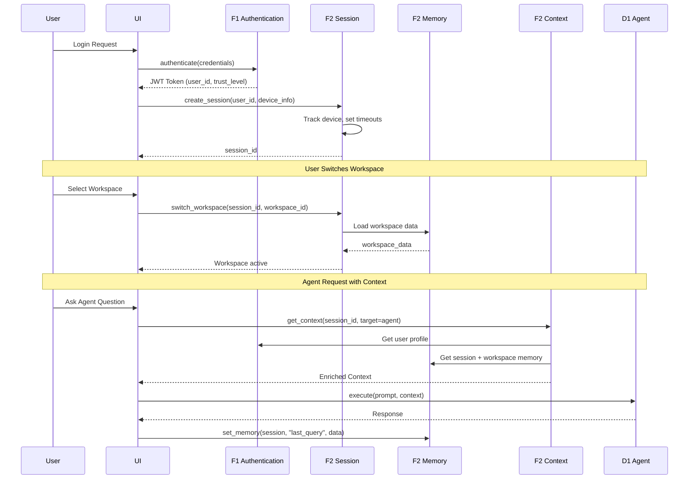

# BRD-02.1: F2 Session & Context Management - Core

> **Navigation**: [Index](BRD-02.0_index.md) | [Next: Requirements](BRD-02.2_requirements.md)
> **Parent**: BRD-02 | **Section**: 1 of 3

---

## 0. Document Control

| Item | Details |
|------|---------|
| **Project Name** | AI Cost Monitoring Platform v4.2 - F2 Session Module |
| **Document Version** | 1.0 |
| **Date** | 2026-01-14T00:00:00 |
| **Document Owner** | Chief Architect |
| **Prepared By** | Antigravity AI |
| **Status** | Draft |
| **MVP Target Launch** | Phase 1 |
| **PRD-Ready Score** | 94/100 (Target: >=90/100) |

### Executive Summary (MVP)

The F2 Session & Context Management Module provides stateful session handling, multi-layer memory architecture, workspace management, and context injection for the AI Cost Monitoring Platform. It implements a 3-tier memory system (Session -> Workspace -> Profile) with automatic context enrichment for agents, UI components, and events. This foundation module is domain-agnostic--storing and retrieving context without understanding its meaning. All workspace types and memory schemas are injected via configuration.

### Document Revision History

| Version | Date | Author | Changes Made | Approver |
|---------|------|--------|--------------|----------|
| 1.0 | 2026-01-14T00:00:00 | Antigravity AI | Initial BRD creation from F2 Spec and Gap Analysis | |

---

## 1. Introduction

### 1.1 Purpose

This Business Requirements Document (BRD) defines the business requirements for the F2 Session & Context Management Module. The F2 Module handles session lifecycle, multi-layer memory, workspace persistence, and context injection for all domain layers.

@ref: [F2 Session Technical Specification](../../00_REF/foundation/F2_Session_Technical_Specification.md#1-executive-summary)

### 1.2 Document Scope

This document covers:
- Session lifecycle management (Create -> Active -> Refresh -> Expire -> Terminate)
- Multi-layer memory system (Session -> Workspace -> Profile)
- Workspace management with domain-injected types
- Context injection for agents, UI, and events
- Gap remediation for enterprise-grade session capabilities

**Out of Scope**:
- Domain-specific workspace schemas (injected by domain layer)
- Cost monitoring logic or business rules (domain layer responsibility)
- UI implementation details

### 1.3 Intended Audience

- Platform administrators (session policy configuration)
- DevOps engineers (deployment, storage backend integration)
- Security/Compliance officers (session audit, device tracking)
- Development teams (API integration, context injection)

### 1.4 Document Conventions

- **Must/Shall**: P1 critical requirements
- **Should**: P2 important requirements
- **Future**: P3 post-MVP enhancements

---

## 2. Business Objectives

### 2.1 MVP Hypothesis

**If** we implement a domain-agnostic session management module with multi-layer memory, workspace persistence, and automatic context injection, **then** we will:
1. Enable stateful user experiences across requests with automatic context enrichment
2. Reduce development overhead through centralized session and context management
3. Support collaborative workflows via workspace sharing capabilities

**Validation Questions**:
- Can users create sessions and switch workspaces without data loss?
- Can agents receive enriched context within 50ms of session lookup?
- Can administrators terminate sessions across all devices within 1 second?

---

### 2.2 Business Problem Statement

**Current State**: Platform lacks centralized session state management with persistent workspaces, multi-tier memory architecture, and automatic context injection for AI agents.

**Impact**:
- Session data lost on service restart without persistent backend
- Users must manually recreate workspace configurations each session
- Agents lack enriched context, reducing personalization quality
- No cross-device session synchronization leads to stale context

**Desired State**: Unified session management module providing persistent state, hierarchical memory, automatic context assembly, and workspace collaboration.

---

### 2.3 MVP Business Goals

| Goal ID | Goal Statement | Success Indicator | Priority |
|---------|----------------|-------------------|----------|
| BRD.02.23.01 | Establish stateful session management as platform foundation | 100% session state preserved across requests | P1 |
| BRD.02.23.02 | Address identified session gaps for enterprise deployment readiness | 6/6 F2 gaps remediated | P1 |
| BRD.02.23.03 | Maintain portable, domain-agnostic design enabling platform reuse | 0 domain-specific code lines in F2 | P1 |

---

### BRD.02.23.01: Stateful Session Management

**Objective**: Implement session lifecycle management with device tracking, timeout enforcement, and concurrent session limits.

**Business Driver**: AI agents and user interfaces require consistent context across requests to deliver personalized experiences without requiring users to re-establish state.

@ref: [F2 Section 3](../../00_REF/foundation/F2_Session_Technical_Specification.md#3-session-management)

---

### BRD.02.23.02: Enterprise Session Compliance

**Objective**: Address identified session gaps to meet enterprise-grade platform requirements.

**Business Driver**: Current implementation lacks Redis persistence, cross-device sync, and memory expiration alerts required for production deployments.

@ref: [GAP_Foundation_Module_Gap_Analysis Section 3.2](../../00_REF/foundation/GAP_Foundation_Module_Gap_Analysis.md#32-identified-gaps)

---

### BRD.02.23.03: Portable Foundation Module

**Objective**: Maintain domain-agnostic design allowing F2 Session to be reused across different platform deployments.

**Business Driver**: Foundation modules must have zero knowledge of business logic to enable portability and reduce coupling.

---

### 2.4 MVP Success Metrics

| Objective ID | Objective Statement | Success Metric | MVP Target | Measurement Period |
|--------------|---------------------|----------------|------------|-------------------|
| BRD.02.23.01 | Stateful Sessions | Session state persistence | 100% requests | 90 days post-launch |
| BRD.02.23.02 | Enterprise Compliance | Gap requirements implemented | 6/6 addressed | MVP + Phase 2 |
| BRD.02.23.03 | Portability | Domain-specific code in F2 | 0 lines | Continuous |

---

### 2.5 Expected Benefits (MVP Scope)

**Quantifiable Benefits**:

| Benefit ID | Benefit Statement | Baseline | Target | Measurement |
|------------|-------------------|----------|--------|-------------|
| BRD.02.25.01 | Reduce context assembly latency | Manual assembly | <50ms automated | Context injection timing |
| BRD.02.25.02 | Enterprise session readiness | 0/6 gaps addressed | 6/6 addressed | Gap remediation tracking |
| BRD.02.25.03 | Integration efficiency | Multiple session points | Single F2 integration | Domain layer integrations |

**Qualitative Benefits**:
- Consistent session state across all platform components
- Reduced development complexity for domain layers consuming context
- Foundation for collaborative workspaces and workspace sharing
- Domain-agnostic design enabling platform reuse

---

## 3. Project Scope

### 3.1 MVP Scope Statement

The F2 Session Module provides session lifecycle management, multi-layer memory, workspace persistence, and context injection as a domain-agnostic foundation layer consumed by all domain layers (D1-D7).

### 3.2 MVP Core Features (In-Scope)

**P1 - Must Have for MVP Launch**:
1. Session lifecycle management (Create -> Active -> Refresh -> Expire -> Terminate)
2. Multi-layer memory system (Session 30min -> Workspace persistent -> Profile)
3. Workspace management with 4 domain-injected types
4. Context injection for agents, UI, and events
5. Device tracking with fingerprint and geolocation
6. Event system for session, memory, and workspace changes
7. Redis session backend (GAP-F2-01)

**P2 - Should Have**:
1. Cross-session synchronization (GAP-F2-02)
2. Workspace templates (GAP-F2-04)
3. Memory expiration alerts (GAP-F2-06)

**P3 - Future**:
1. Memory compression (GAP-F2-03)
2. Workspace versioning (GAP-F2-05)

### 3.3 Explicitly Out-of-Scope for MVP

- Domain-specific workspace schemas (injected by domain layers D1-D7)
- Workspace data validation (handled by domain layer)
- Mobile app session flows
- Vertex AI context storage (v1.2.0 roadmap)

### 3.4 MVP Workflow

The following diagram illustrates the core session and context flow for the F2 Session Module:

**Workflow Summary**:
1. **Session Creation**: After F1 authentication, F2 creates session with device tracking
2. **Workspace Binding**: User switches workspaces, loading persistent workspace data
3. **Context Injection**: Each agent request receives automatically assembled context

### 3.5 Technology Stack

| Component | Technology | Reference |
|-----------|------------|-----------|
| Session Storage | Redis (MVP), PostgreSQL (fallback) | F2 Section 3.6 |
| Workspace Storage | PostgreSQL (JSONB) | F6 |
| Profile Storage | A2A Knowledge Platform | F2 Section 4.2.3 |
| Memory Cache | Redis 7+ | F6 |
| Event Emission | F3 Observability | F3 |

---

## 4. Stakeholders

### Decision Makers

| Role | Responsibility | Key Decisions |
|------|----------------|---------------|
| **Executive Sponsor** | Final approval authority for F2 scope | Session policy limits, infrastructure investment |
| **Product Owner** | Feature prioritization for session capabilities | Memory tier design, workspace types |
| **Technical Lead** | Architecture decisions for F2 implementation | Storage backend selection, context injection patterns |

### Key Contributors

| Role | Involvement | Domain Focus |
|------|-------------|--------------|
| **Platform Administrator** | Configure session policies, monitor metrics | Timeout settings, session visibility |
| **DevOps Engineer** | Deploy module, manage Redis/PostgreSQL | Health endpoints, storage migration |
| **Security/Compliance Officer** | Audit access, validate device tracking | Session revocation, anomaly alerts |
| **Development Team** | Integrate F2 APIs, implement context injection | API contracts, extensibility hooks |

---

## 5. User Stories

### 5.1 Primary User Stories (MVP Essential)

| Story ID | User Role | Action | Business Value | Priority |
|----------|-----------|--------|----------------|----------|
| BRD.02.09.01 | User | Create session after F1 authentication | Stateful experience across requests | P1 |
| BRD.02.09.02 | User | Switch active workspace | Context-appropriate data display | P1 |
| BRD.02.09.03 | User | Save analysis to workspace layer | Persist valuable insights across sessions | P1 |
| BRD.02.09.04 | User | Promote memory to profile layer | Long-term learning retention | P1 |
| BRD.02.09.05 | User | Receive expiration warning | Prevent data loss on timeout | P2 |
| BRD.02.09.06 | Agent | Receive enriched context | Personalized AI responses | P1 |
| BRD.02.09.07 | Admin | View active sessions | Monitor platform usage | P1 |
| BRD.02.09.08 | Admin | Terminate user session | Security incident response | P1 |
| BRD.02.09.09 | User | Share workspace with team | Collaborative analysis | P2 |
| BRD.02.09.10 | Service | Access session via API | Machine-to-machine context | P1 |

@ref: [F2 Sections 3-8](../../00_REF/foundation/F2_Session_Technical_Specification.md#3-session-management)

### 5.2 User Story Summary

- **Total MVP User Stories**: 10 (P1: 8, P2: 2)
- **Future Phase Stories**: Workspace templates, versioning, compression

---

> **Navigation**: [Index](BRD-02.0_index.md) | [Next: Requirements](BRD-02.2_requirements.md)
