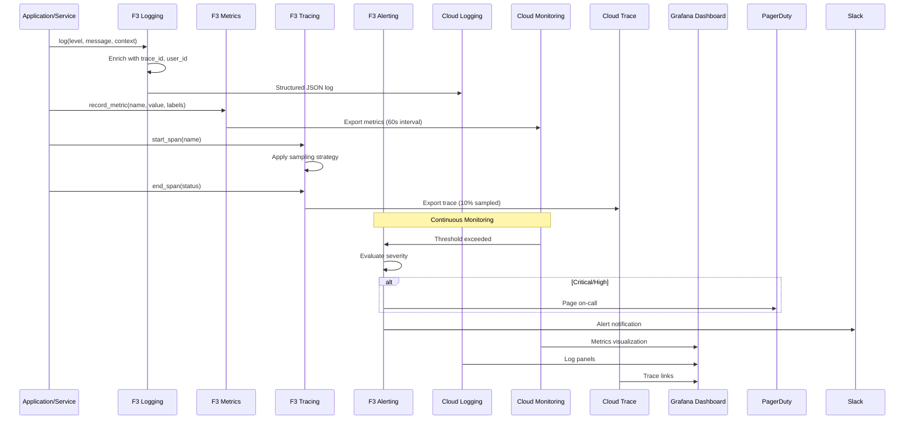

# BRD-03.1: F3 Observability - Core

> **Navigation**: [Index](BRD-03.0_index.md) | [Next: Requirements](BRD-03.2_requirements.md)
> **Parent**: BRD-03 | **Section**: 1 of 3

---

## 0. Document Control

| Item | Details |
|------|---------|
| **Project Name** | AI Cost Monitoring Platform v4.2 - F3 Observability Module |
| **Document Version** | 1.0 |
| **Date** | 2026-01-14T00:00:00 |
| **Document Owner** | Chief Architect |
| **Prepared By** | Antigravity AI |
| **Status** | Draft |
| **MVP Target Launch** | Phase 1 |
| **PRD-Ready Score** | 92/100 (Target: >=90/100) |

### Executive Summary (MVP)

The F3 Observability Module provides comprehensive monitoring, logging, tracing, alerting, and analytics for the AI Cost Monitoring Platform. It implements structured JSON logging with 4 log levels, multi-exporter metrics collection (Prometheus + Cloud Monitoring), OpenTelemetry distributed tracing with 10% sampling, 4-severity alerting with PagerDuty/Slack integration, and built-in LLM analytics for token, latency, and cost tracking. This foundation module is domain-agnostic--collecting telemetry without understanding business meaning--enabling reuse across any platform requiring operational visibility.

### Document Revision History

| Version | Date | Author | Changes Made | Approver |
|---------|------|--------|--------------|----------|
| 1.0 | 2026-01-14T00:00:00 | Antigravity AI | Initial BRD creation from F3 Spec and Gap Analysis | |

---

## 1. Introduction

### 1.1 Purpose

This Business Requirements Document (BRD) defines the business requirements for the F3 Observability Module. The F3 Observability Module handles all monitoring, logging, distributed tracing, alerting, and analytics for the platform, providing comprehensive operational visibility without domain-specific knowledge.

@ref: [F3 Observability Technical Specification](../../00_REF/foundation/F3_Observability_Technical_Specification.md#1-executive-summary)

### 1.2 Document Scope

This document covers:
- Core logging capabilities (structured JSON, 4 log levels, Cloud Logging)
- Metrics collection system (Counter, Gauge, Histogram with Prometheus + Cloud Monitoring)
- Distributed tracing (OpenTelemetry, sampling policies, Cloud Trace)
- Alerting system (4 severities, multi-channel notifications)
- LLM-specific analytics (token, latency, cost tracking)
- Auto-generated dashboards (Grafana)
- Gap remediation for enterprise observability

**Out of Scope**:
- Domain-specific business logic (cloud_accounts, cost_analytics)
- Business metric definitions (injected by domain layer)
- UI implementation details
- SIEM integration (covered by F4 SecOps)

### 1.3 Intended Audience

- Platform administrators (observability configuration, dashboard management)
- DevOps engineers (deployment, Cloud Monitoring/Logging/Trace integration)
- Security/Compliance officers (audit log access, retention compliance)
- Development teams (instrumentation, custom metrics)
- SRE teams (SLO/SLI definition, incident response)

### 1.4 Document Conventions

- **Must/Shall**: P1 critical requirements
- **Should**: P2 important requirements
- **Future**: P3 post-MVP enhancements

---

## 2. Business Objectives

### 2.1 MVP Hypothesis

**If** we implement a domain-agnostic observability foundation module with structured logging, metrics collection, distributed tracing, alerting, and LLM analytics capabilities, **then** we will:
1. Enable proactive incident detection and resolution through real-time operational visibility
2. Reduce mean time to resolution (MTTR) through correlated logs, metrics, and traces
3. Achieve operational excellence through SLO/SLI tracking and reliability measurement

**Validation Questions**:
- Can developers emit structured logs with trace correlation within 1 minute of SDK integration?
- Can SREs configure alert rules without code changes?
- Can operations teams identify root cause of incidents within 5 minutes using correlated telemetry?

---

### 2.2 Business Problem Statement

**Current State**: Platform lacks comprehensive observability with log analytics, SLO/SLI tracking, and intelligent anomaly detection capabilities.

**Impact**:
- Incident diagnosis requires manual log correlation across services
- No reliability targets exist for measuring service health
- Threshold-based alerting generates false positives and alert fatigue
- LLM costs lack visibility and trend analysis

**Desired State**: Unified observability foundation module providing structured telemetry, correlated traces, proactive alerting, and reliability measurement.

---

### 2.3 MVP Business Goals

| Goal ID | Goal Statement | Success Indicator | Priority |
|---------|----------------|-------------------|----------|
| BRD.03.23.01 | Establish unified observability as platform operational baseline | 100% of services instrumented with F3 | P1 |
| BRD.03.23.02 | Address identified observability gaps for enterprise deployment readiness | 7/7 F3 gaps remediated | P1 |
| BRD.03.23.03 | Maintain portable, domain-agnostic design enabling platform reuse | 0 domain-specific code lines in F3 | P1 |

---

### BRD.03.23.01: Unified Observability Baseline

**Objective**: Implement comprehensive observability where all services emit correlated logs, metrics, and traces to a central platform.

**Business Driver**: Distributed microservices and AI agent operations require unified visibility to diagnose issues, measure performance, and ensure reliability.

@ref: [F3 Section 1](../../00_REF/foundation/F3_Observability_Technical_Specification.md#1-executive-summary)

---

### BRD.03.23.02: Enterprise Observability Compliance

**Objective**: Address identified observability gaps to meet enterprise-grade platform requirements.

**Business Driver**: Current implementation lacks log analytics, SLO tracking, ML anomaly detection, and alert fatigue management required for enterprise deployments.

@ref: [GAP_Foundation_Module_Gap_Analysis Section 4.2](../../00_REF/foundation/GAP_Foundation_Module_Gap_Analysis.md#42-identified-gaps)

---

### BRD.03.23.03: Portable Foundation Module

**Objective**: Maintain domain-agnostic design allowing F3 Observability to be reused across different platform deployments.

**Business Driver**: Foundation modules must have zero knowledge of business logic to enable portability and reduce coupling.

---

### 2.4 MVP Success Metrics

| Objective ID | Objective Statement | Success Metric | MVP Target | Measurement Period |
|--------------|---------------------|----------------|------------|-------------------|
| BRD.03.23.01 | Unified Observability | Services instrumented with F3 | 100% | 90 days post-launch |
| BRD.03.23.02 | Enterprise Compliance | Gap requirements implemented | 7/7 addressed | MVP + Phase 2 |
| BRD.03.23.03 | Portability | Domain-specific code in F3 | 0 lines | Continuous |

---

### 2.5 Expected Benefits (MVP Scope)

**Quantifiable Benefits**:

| Benefit ID | Benefit Statement | Baseline | Target | Measurement |
|------------|-------------------|----------|--------|-------------|
| BRD.03.25.01 | Reduce mean time to resolution (MTTR) | Hours (manual correlation) | <15 minutes | Incident resolution tracking |
| BRD.03.25.02 | Enterprise compliance readiness | 0/7 gaps addressed | 7/7 addressed | Gap remediation tracking |
| BRD.03.25.03 | Operational visibility coverage | Partial instrumentation | 100% services | Service telemetry audit |

**Qualitative Benefits**:
- Consistent telemetry format across all platform components
- Reduced debugging complexity through trace correlation
- Foundation for proactive incident detection and reliability measurement
- Domain-agnostic design enabling platform reuse

---

## 3. Project Scope

### 3.1 MVP Scope Statement

The F3 Observability Module provides logging, metrics, tracing, alerting, LLM analytics, and dashboards as a domain-agnostic foundation layer consumed by all foundation modules (F1-F7) and domain layers (D1-D7).

### 3.2 MVP Core Features (In-Scope)

**P1 - Must Have for MVP Launch**:
1. Structured logging (JSON format, 4 levels, Cloud Logging integration)
2. Metrics collection (Counter, Gauge, Histogram; Prometheus + Cloud Monitoring)
3. Distributed tracing (OpenTelemetry, sampling policies, Cloud Trace)
4. Alerting system (4 severities, PagerDuty + Slack integration)
5. LLM analytics (token, latency, cost tracking per model)
6. Auto-generated dashboards (Grafana)
7. Log Analytics via BigQuery (GAP-F3-01)
8. SLO/SLI Tracking (GAP-F3-03)

**P2 - Should Have**:
1. Custom Dashboards (GAP-F3-02)
2. ML Anomaly Detection (GAP-F3-04)
3. Trace Journey Visualization (GAP-F3-05)
4. Alert Fatigue Management (GAP-F3-07)

**P3 - Future**:
1. Profiling Integration (GAP-F3-06)

### 3.3 Explicitly Out-of-Scope for MVP

- Domain-specific metrics (injected by domain layers D1-D7)
- Business KPI definitions (injected by domain layers)
- SIEM integration (covered by F4 SecOps)
- Security event correlation (covered by F4 SecOps)

### 3.4 MVP Workflow

The following diagram illustrates the core observability data flow for the F3 Observability Module:

**Workflow Summary**:
1. **Logging**: Services emit structured logs enriched with trace/session context to Cloud Logging
2. **Metrics**: Application metrics exported to Cloud Monitoring via Prometheus
3. **Tracing**: Distributed traces sampled and exported to Cloud Trace
4. **Alerting**: Threshold violations trigger severity-routed notifications
5. **Dashboards**: Grafana auto-generates visualizations from collected telemetry

### 3.5 Technology Stack

| Component | Technology | Reference |
|-----------|------------|-----------|
| Log Backend | GCP Cloud Logging | ADR-00 |
| Metrics Backend | Prometheus + Cloud Monitoring | F3 Section 4.3 |
| Trace Backend | OpenTelemetry + Cloud Trace | F3 Section 5.4 |
| Dashboard | Grafana | F3 Section 8.1 |
| Alerting | PagerDuty + Slack | F3 Section 6.2 |
| Log Analytics | BigQuery | GAP-F3-01 |

---

## 4. Stakeholders

### Decision Makers

| Role | Responsibility | Key Decisions |
|------|----------------|---------------|
| **Executive Sponsor** | Final approval authority for F3 scope | SLO targets, observability investment |
| **Product Owner** | Feature prioritization for observability capabilities | Dashboard design, alert policies |
| **Technical Lead** | Architecture decisions for F3 implementation | Tracing strategy, metrics cardinality limits |

### Key Contributors

| Role | Involvement | Domain Focus |
|------|-------------|--------------|
| **Platform Administrator** | Configure observability policies, manage dashboards | Alert routing, retention policies |
| **DevOps Engineer** | Deploy module, integrate Cloud Monitoring/Logging/Trace | Prometheus setup, Grafana configuration |
| **Security/Compliance Officer** | Audit log access, validate retention compliance | Log access controls, 7-year audit retention |
| **Development Team** | Instrument code, implement custom metrics | Tracing context, structured logging |
| **SRE Team** | Define SLOs/SLIs, manage on-call rotations | Error budgets, incident response |

---

## 5. User Stories

### 5.1 Primary User Stories (MVP Essential)

| Story ID | User Role | Action | Business Value | Priority |
|----------|-----------|--------|----------------|----------|
| BRD.03.09.01 | Developer | Emit structured logs with context | Consistent log format for analysis | P1 |
| BRD.03.09.02 | Developer | Record custom metrics | Track application-specific KPIs | P1 |
| BRD.03.09.03 | Developer | Propagate trace context | End-to-end request visibility | P1 |
| BRD.03.09.04 | SRE | Configure alert rules | Proactive incident detection | P1 |
| BRD.03.09.05 | SRE | View service dashboard | Real-time operational visibility | P1 |
| BRD.03.09.06 | SRE | Track SLO/SLI metrics | Measure service reliability | P2 |
| BRD.03.09.07 | Admin | Query logs via BigQuery | Historical trend analysis | P2 |
| BRD.03.09.08 | Developer | Track LLM usage metrics | Cost and performance optimization | P1 |
| BRD.03.09.09 | SRE | Receive ML-based anomaly alerts | Detect unknown-unknown failures | P2 |
| BRD.03.09.10 | Admin | Create custom dashboards | Role-specific monitoring views | P2 |

@ref: [F3 Sections 3-8](../../00_REF/foundation/F3_Observability_Technical_Specification.md#3-logging-system)

### 5.2 User Story Summary

- **Total MVP User Stories**: 10 (P1: 6, P2: 4)
- **Future Phase Stories**: Profiling integration, advanced trace visualization

---

> **Navigation**: [Index](BRD-03.0_index.md) | [Next: Requirements](BRD-03.2_requirements.md)
