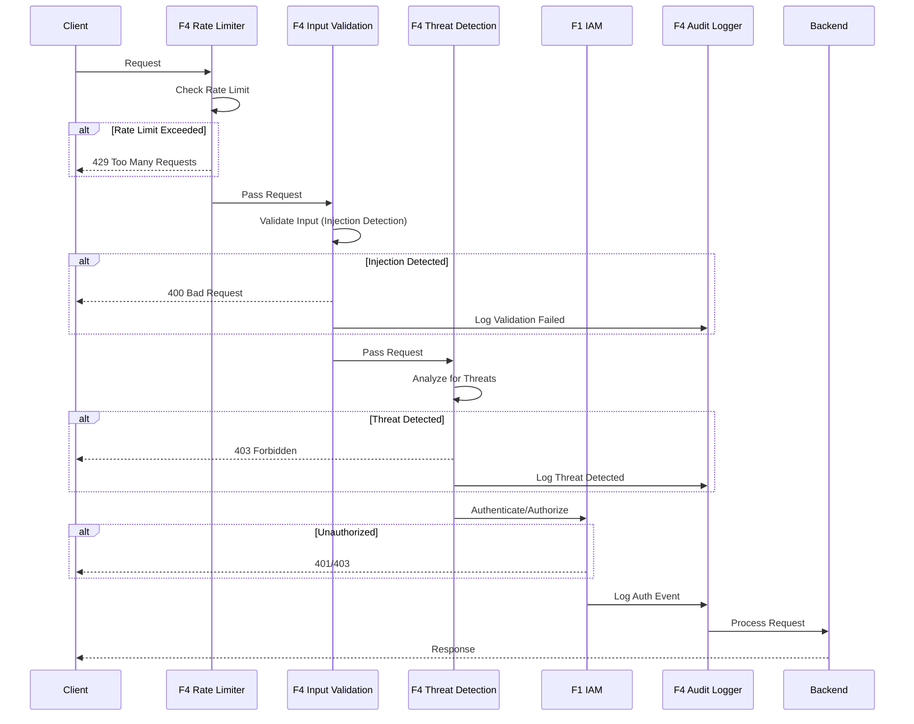

# BRD-04: F4 Security Operations (SecOps)

> **Module Type**: Foundation (Domain-Agnostic)
> **Portability**: This BRD defines generic security operations capabilities including input validation, compliance enforcement, audit logging, and threat detection reusable across any platform requiring runtime security controls.

---

## 0. Document Control

| Item | Details |
|------|---------|
| **Project Name** | AI Cost Monitoring Platform v4.2 - F4 SecOps Module |
| **Document Version** | 1.0 |
| **Date** | 2026-01-14 |
| **Document Owner** | Chief Architect |
| **Prepared By** | Antigravity AI |
| **Status** | Draft |
| **MVP Target Launch** | Phase 1 |
| **PRD-Ready Score** | 92/100 (Target: >=90/100) |

### Executive Summary (MVP)

The F4 Security Operations Module provides runtime security for the AI Cost Monitoring Platform including input validation (injection detection, rate limiting, sanitization), compliance enforcement (OWASP ASVS 5.0 Level 2, OWASP LLM Top 10 2025), immutable audit logging with cryptographic chaining (7-year retention), and threat detection with automated response. This foundation module is domain-agnostic with special attention to LLM-specific threats, enforcing security controls without understanding business logic.

### Document Revision History

| Version | Date | Author | Changes Made | Approver |
|---------|------|--------|--------------|----------|
| 1.0 | 2026-01-14 | Antigravity AI | Initial BRD creation from F4 Spec and Gap Analysis | |

---

## 1. Introduction

### 1.1 Purpose

This Business Requirements Document (BRD) defines the business requirements for the F4 Security Operations Module. The F4 SecOps Module provides runtime security including input validation, compliance enforcement, audit logging, and threat detection for the platform using a Zero-Trust security model with defense-in-depth.

@ref: [F4 SecOps Technical Specification](../00_init/F4_SecOps_Technical_Specification.md#1-executive-summary)

### 1.2 Document Scope

This document covers:
- Input validation capabilities (injection detection, rate limiting, sanitization)
- Compliance enforcement (OWASP ASVS 5.0 Level 2, OWASP LLM Top 10 2025)
- Audit logging with immutable, cryptographically-chained records
- Threat detection and automated response
- LLM security defense-in-depth
- Gap remediation for enterprise compliance

**Out of Scope**:
- Domain-specific business logic (trading, cloud_accounts)
- Security policy definitions (injected by domain layer)
- UI implementation details

### 1.3 Intended Audience

- Platform administrators (security configuration)
- DevOps engineers (deployment, integration)
- Security/Compliance officers (audit, policy)
- Development teams (API integration)

### 1.4 Document Conventions

- **Must/Shall**: P1 critical requirements
- **Should**: P2 important requirements
- **Future**: P3 post-MVP enhancements

---

## 2. Business Objectives

### 2.1 MVP Hypothesis

**If** we implement a domain-agnostic security operations foundation module with input validation, compliance enforcement, immutable audit logging, and threat detection capabilities, **then** we will:
1. Enable secure platform operations with defense-in-depth against injection attacks and LLM-specific threats
2. Achieve enterprise compliance requirements for security standards (OWASP ASVS 5.0, LLM Top 10)
3. Provide immutable audit trail for security events with 7-year retention for regulatory compliance

**Validation Questions**:
- Can the system detect and block prompt injection attempts with <100ms latency?
- Can compliance reports be generated on schedule and pass OWASP ASVS Level 2 verification?
- Can audit logs demonstrate tamper-proof integrity through cryptographic hash chain validation?

---

### 2.2 Business Problem Statement

**Current State**: Platform lacks unified runtime security with SIEM integration, WAF synchronization, automated penetration testing, and external threat intelligence feeds.

**Impact**:
- Security incidents require manual investigation across siloed logs
- WAF rules must be updated manually, creating security gaps
- No proactive threat detection from external intelligence sources
- Ad-hoc incident response without documented runbooks

**Desired State**: Unified SecOps foundation module providing defense-in-depth, automated threat response, and enterprise-grade compliance reporting.

---

### 2.3 MVP Business Goals

| Goal ID | Goal Statement | Success Indicator | Priority |
|---------|----------------|-------------------|----------|
| BRD.04.23.01 | Establish defense-in-depth security as platform runtime baseline | 100% injection attacks blocked, <100ms detection latency | P1 |
| BRD.04.23.02 | Address identified SecOps gaps for enterprise deployment readiness | 6/6 F4 gaps remediated | P1 |
| BRD.04.23.03 | Maintain portable, domain-agnostic design enabling platform reuse | 0 domain-specific code lines in F4 | P1 |

---

### BRD.04.23.01: Defense-in-Depth Security Posture

**Objective**: Implement defense-in-depth security with multiple validation layers and automated threat response.

**Business Driver**: Autonomous AI agents and financial operations require comprehensive runtime security to prevent injection attacks, data breaches, and compliance violations.

@ref: [F4 Section 1](../00_init/F4_SecOps_Technical_Specification.md#1-executive-summary)

---

### BRD.04.23.02: Enterprise SecOps Compliance

**Objective**: Address identified SecOps gaps to meet enterprise-grade platform requirements.

**Business Driver**: Current implementation lacks SIEM integration, WAF synchronization, automated pen testing, and threat intelligence capabilities required for enterprise deployments.

@ref: [GAP_Foundation_Module_Gap_Analysis Section 5](../00_init/GAP_Foundation_Module_Gap_Analysis.md#5-f4-security-operations)

---

### BRD.04.23.03: Portable Foundation Module

**Objective**: Maintain domain-agnostic design allowing F4 SecOps to be reused across different platform deployments.

**Business Driver**: Foundation modules must have zero knowledge of business logic to enable portability and reduce coupling.

---

### 2.4 MVP Success Metrics

| Objective ID | Objective Statement | Success Metric | MVP Target | Measurement Period |
|--------------|---------------------|----------------|------------|-------------------|
| BRD.04.23.01 | Defense-in-Depth Security | Injection attacks blocked | 100% | 90 days post-launch |
| BRD.04.23.02 | Enterprise Compliance | Gap requirements implemented | 6/6 addressed | MVP + Phase 2 |
| BRD.04.23.03 | Portability | Domain-specific code in F4 | 0 lines | Continuous |

---

### 2.5 Expected Benefits (MVP Scope)

**Quantifiable Benefits**:

| Benefit ID | Benefit Statement | Baseline | Target | Measurement |
|------------|-------------------|----------|--------|-------------|
| BRD.04.25.01 | Reduce security incident response time | Hours (manual) | <5 minutes | SIEM alert to response |
| BRD.04.25.02 | Enterprise compliance readiness | 0/6 gaps addressed | 6/6 addressed | Gap remediation tracking |
| BRD.04.25.03 | Audit log integrity | No chain verification | 100% tamper-proof | Daily chain validation |

**Qualitative Benefits**:
- Consistent security posture across all platform components
- Reduced compliance audit effort through automated reporting
- Foundation for proactive threat intelligence and automated response
- Domain-agnostic design enabling platform reuse

---

## 3. Project Scope

### 3.1 MVP Scope Statement

The F4 SecOps Module provides input validation, compliance enforcement, audit logging, threat detection, and LLM security as a domain-agnostic foundation layer consumed by all domain layers (D1-D7).

### 3.2 MVP Core Features (In-Scope)

**P1 - Must Have for MVP Launch**:
1. Input validation (prompt injection, SQL injection, XSS detection)
2. Rate limiting with sliding window algorithm
3. Compliance enforcement (OWASP ASVS 5.0 Level 2, OWASP LLM Top 10 2025)
4. Immutable audit logging with cryptographic hash chain
5. Threat detection (brute force, anomaly, suspicious patterns)
6. LLM security (defense-in-depth, PII redaction, context isolation)
7. SIEM integration connector (GAP-F4-01)

**P2 - Should Have**:
1. WAF integration with Cloud Armor (GAP-F4-02)
2. Automated penetration testing (GAP-F4-03)
3. Threat intelligence feed integration (GAP-F4-04)

**P3 - Future**:
1. Security scoring system (GAP-F4-05)
2. Incident response runbook engine (GAP-F4-06)

### 3.3 Explicitly Out-of-Scope for MVP

- Domain-specific security policies (injected by domain layers D1-D7)
- Custom threat patterns (injected by domain layer)
- Mobile app security flows
- Hardware security modules (HSM) integration

### 3.4 MVP Workflow

The following diagram illustrates the core request security flow for the F4 SecOps Module:



**Workflow Summary**:
1. **Rate Limiting**: Request checked against sliding window counter
2. **Input Validation**: Injection detection (prompt, SQL, XSS)
3. **Threat Analysis**: Brute force, anomaly, suspicious pattern detection
4. **Authentication/Authorization**: Delegated to F1 IAM
5. **Audit Logging**: All security events logged with cryptographic chain

### 3.5 Technology Stack

| Component | Technology | Reference |
|-----------|------------|-----------|
| Audit Storage | BigQuery | F4 Section 5.3 |
| Rate Limit Backend | Redis | F4 Section 3.2 |
| Hash Algorithm | SHA-256 | F4 Section 5.4 |
| Compliance Standards | OWASP ASVS 5.0, LLM Top 10 | F4 Section 4 |
| WAF | Cloud Armor | F6 |
| Alerting | PagerDuty, Slack | F4 Section 6.2 |

---

## 4. Stakeholders

### Decision Makers

| Role | Responsibility | Key Decisions |
|------|----------------|---------------|
| **Executive Sponsor** | Final approval authority for F4 scope | Security budget, compliance standards |
| **Product Owner** | Feature prioritization for security capabilities | Threat detection rules, audit retention |
| **Technical Lead** | Architecture decisions for F4 implementation | Storage backend (BigQuery), detection algorithms |

### Key Contributors

| Role | Involvement | Domain Focus |
|------|-------------|--------------|
| **Security Officer** | Define compliance requirements, review configurations | OWASP standards, LLM security |
| **Compliance/Legal** | Regulatory guidance, audit requirements | 7-year retention, evidence export |
| **DevOps Engineer** | Deploy module, integrate with Cloud Armor | Rate limiting infrastructure, WAF rules |
| **Development Team** | Integrate F4 APIs, implement validation hooks | API contracts, extensibility hooks |

---

## 5. User Stories

### 5.1 Primary User Stories (MVP Essential)

| Story ID | User Role | Action | Business Value | Priority |
|----------|-----------|--------|----------------|----------|
| BRD.04.09.01 | User | Submit input validated for injection attacks | Protection from malicious inputs | P1 |
| BRD.04.09.02 | User | Be rate-limited when exceeding request thresholds | Platform stability under load | P1 |
| BRD.04.09.03 | Admin | View compliance status dashboard | Continuous compliance visibility | P1 |
| BRD.04.09.04 | Admin | Query audit logs for security events | Incident investigation capability | P1 |
| BRD.04.09.05 | Admin | Unblock IP addresses manually | Incident response flexibility | P1 |
| BRD.04.09.06 | System | Detect and block brute force attempts | Automated threat mitigation | P1 |
| BRD.04.09.07 | System | Generate compliance reports on schedule | Regulatory evidence generation | P1 |
| BRD.04.09.08 | Admin | Export audit logs to external SIEM | Unified security visibility | P2 |
| BRD.04.09.09 | Admin | Receive threat intelligence alerts | Proactive threat awareness | P2 |
| BRD.04.09.10 | Agent | Receive LLM-safe sanitized context | AI security protection | P1 |

@ref: [F4 Sections 3-9](../00_init/F4_SecOps_Technical_Specification.md#3-input-validation)

### 5.2 User Story Summary

- **Total MVP User Stories**: 10 (P1: 8, P2: 2)
- **Future Phase Stories**: Security scoring, incident runbooks

---

## 6. Functional Requirements

### 6.1 MVP Requirements Overview

**Priority Definitions**:
- **P1 (Must Have)**: Essential for MVP launch
- **P2 (Should Have)**: Important, implement post-MVP
- **P3 (Future)**: Based on user feedback

---

### BRD.04.01.01: Input Validation (Injection Detection)

**Business Capability**: Detect and block injection attacks including prompt injection, SQL injection, and cross-site scripting.

@ref: [F4 Section 3](../00_init/F4_SecOps_Technical_Specification.md#3-input-validation)

**Business Requirements**:
- Prompt injection detection with pattern matching and heuristics
- SQL injection detection with parameterized query enforcement
- XSS detection with HTML parsing and sanitization
- Rate limiting with sliding window counter algorithm

**Business Rules**:
- Prompt injection: Block request, return 400 Bad Request
- SQL injection: Block request, return 400 Bad Request
- XSS: Sanitize input, continue processing with cleaned input
- Rate limits configurable per endpoint

**Business Acceptance Criteria**:

| Criteria ID | Criterion | MVP Target |
|-------------|-----------|------------|
| BRD.04.06.01 | Injection detection accuracy | >=99% |
| BRD.04.06.02 | Detection latency | <100ms |

**Complexity**: 4/5 (Multiple injection types require different detection algorithms; prompt injection for LLMs requires semantic analysis)

**Related Requirements**:
- Platform BRDs: BRD-06 (F6 Infrastructure - Redis for rate limiting)
- Feature BRDs: N/A (Foundation module)

**Priority**: P1

---

### BRD.04.01.02: Compliance Enforcement

**Business Capability**: Enforce OWASP ASVS 5.0 Level 2 and OWASP LLM Top 10 2025 security standards.

@ref: [F4 Section 4](../00_init/F4_SecOps_Technical_Specification.md#4-compliance-enforcement)

**Business Requirements**:
- OWASP ASVS 5.0 Level 2 compliance (149 controls)
- OWASP LLM Top 10 2025 mitigations
- Startup compliance check (block if critical failures)
- Scheduled daily compliance checks
- On-demand compliance reporting via API

**Compliance Coverage**:

| Standard | Controls | Coverage |
|----------|----------|----------|
| OWASP ASVS 5.0 L2 | 149 controls | 14 categories implemented |
| OWASP LLM Top 10 | 10 threats | 8 mitigated (2 N/A external models) |

**Business Acceptance Criteria**:

| Criteria ID | Criterion | MVP Target |
|-------------|-----------|------------|
| BRD.04.06.03 | ASVS compliance percentage | >=98% |
| BRD.04.06.04 | Compliance report generation time | <5 minutes |

**Complexity**: 3/5 (Standards well-defined; implementation requires systematic control mapping)

**Related Requirements**:
- Platform BRDs: BRD-06 (F6 Infrastructure - Cloud Storage for reports)
- Feature BRDs: N/A (Foundation module)

**Priority**: P1

---

### BRD.04.01.03: Audit Logging (Immutable)

**Business Capability**: Provide immutable, cryptographically-chained audit trail with 7-year retention.

@ref: [F4 Section 5](../00_init/F4_SecOps_Technical_Specification.md#5-audit-logging)

**Business Requirements**:
- Immutable audit log with SHA-256 hash chain
- Security events (auth, authz, threat, session)
- Operational events (data access, config changes) - domain-injected
- 7-year (2,555 days) retention in BigQuery
- Daily automated chain integrity verification

**Audit Log Schema Fields**:
- event_id, timestamp, event_type, actor_id, actor_type
- resource_id, resource_type, action, outcome
- ip_address, user_agent, session_id, context
- previous_hash, hash (SHA-256)

**Business Acceptance Criteria**:

| Criteria ID | Criterion | MVP Target |
|-------------|-----------|------------|
| BRD.04.06.05 | Audit log write latency | <50ms |
| BRD.04.06.06 | Hash chain integrity | 100% verified |

**Complexity**: 3/5 (BigQuery storage straightforward; cryptographic chaining requires careful implementation for tamper detection)

**Related Requirements**:
- Platform BRDs: BRD-06 (F6 Infrastructure - BigQuery), BRD-03 (F3 Observability - logging integration)
- Feature BRDs: N/A (Foundation module)

**Priority**: P1

---

### BRD.04.01.04: Threat Detection

**Business Capability**: Detect and respond to security threats including brute force, anomalies, and suspicious patterns.

@ref: [F4 Section 6](../00_init/F4_SecOps_Technical_Specification.md#6-threat-detection)

**Business Requirements**:
- Brute force detection (5 failed attempts in 5 minutes)
- Statistical anomaly detection (Z-score, 7-day baseline)
- Suspicious pattern detection (credential stuffing, enumeration, traversal)
- Automated response (block IP, lock account, force re-auth, alert)

**Threat Detection Rules**:

| Threat Type | Threshold | Response |
|-------------|-----------|----------|
| Brute Force | 5 failures / 5 min | Block IP 30 min |
| Credential Stuffing | Multiple accounts, same IP | Block IP |
| Account Enumeration | Sequential ID probing | Block IP + Alert |
| Geographic Anomaly | Unusual location | Alert + MFA prompt |

**Business Acceptance Criteria**:

| Criteria ID | Criterion | MVP Target |
|-------------|-----------|------------|
| BRD.04.06.07 | Brute force detection rate | 100% |
| BRD.04.06.08 | False positive rate | <1% |

**Complexity**: 4/5 (Statistical anomaly detection requires baseline establishment and tuning; automated response requires careful orchestration)

**Related Requirements**:
- Platform BRDs: BRD-01 (F1 IAM - auth events), BRD-06 (F6 Infrastructure - Redis for blocked entities)
- Feature BRDs: N/A (Foundation module)

**Priority**: P1

---

### BRD.04.01.05: LLM Security

**Business Capability**: Defense-in-depth security for LLM interactions including prompt injection prevention, PII redaction, and context isolation.

@ref: [F4 Section 7](../00_init/F4_SecOps_Technical_Specification.md#7-llm-security)

**Business Requirements**:
- Input layer: Prompt injection detection, input sanitization, rate limiting, token limits
- Processing layer: Context isolation, system prompt protection, cost monitoring, timeout enforcement
- Output layer: PII redaction, response filtering, instruction leak detection, audit logging

**OWASP LLM Top 10 Mitigations**:

| Threat ID | Threat | Mitigation |
|-----------|--------|------------|
| LLM01 | Prompt Injection | Pattern detection, context isolation |
| LLM02 | Insecure Output | PII redaction, output filtering |
| LLM04 | Model DoS | Token limits, rate limiting, cost caps |
| LLM06 | Sensitive Disclosure | Context boundaries, output scanning |
| LLM07 | Insecure Plugin | MCP sandboxing, permission scoping |

**Business Acceptance Criteria**:

| Criteria ID | Criterion | MVP Target |
|-------------|-----------|------------|
| BRD.04.06.09 | Prompt injection block rate | >=99% |
| BRD.04.06.10 | PII redaction accuracy | >=99.9% |

**Complexity**: 4/5 (LLM-specific threats require semantic analysis; context isolation between user and system prompts requires careful implementation)

**Related Requirements**:
- Platform BRDs: BRD-01 (F1 IAM - trust levels for human-in-loop), BRD-06 (F6 Infrastructure - Vertex AI)
- Feature BRDs: N/A (Foundation module)

**Priority**: P1

---

### BRD.04.01.06: Extensibility Hooks

**Business Capability**: Provide hooks for domain layers to register custom audit events, threat patterns, and event handlers.

@ref: [F4 Section 9.6](../00_init/F4_SecOps_Technical_Specification.md#96-extensibility-hooks)

**Business Requirements**:
- on_threat_detected hook for custom response and escalation
- on_validation_failed hook for custom handling and logging
- on_compliance_violation hook for custom notification
- on_audit_event hook for custom processing
- register_audit_event_type for domain-specific events
- register_threat_pattern for domain-specific patterns

**Business Acceptance Criteria**:

| Criteria ID | Criterion | MVP Target |
|-------------|-----------|------------|
| BRD.04.06.11 | Hook registration latency | <10ms |
| BRD.04.06.12 | Hook execution latency overhead | <5ms |

**Complexity**: 2/5 (Well-defined hook pattern; requires clear API contracts for domain integration)

**Related Requirements**:
- Platform BRDs: BRD-07 (F7 Config - hook configuration)
- Feature BRDs: N/A (Foundation module)

**Priority**: P2

---

### BRD.04.01.07: SIEM Integration

**Business Capability**: Export security events to external SIEM platforms (Splunk, Microsoft Sentinel) for unified security visibility.

@ref: [GAP-F4-01: SIEM Integration](../00_init/GAP_Foundation_Module_Gap_Analysis.md#52-identified-gaps)

**Business Requirements**:
- Real-time event streaming to SIEM
- Support for common SIEM formats (CEF, LEEF, JSON)
- Configurable event filtering
- Secure transport (TLS, API keys)

**Business Acceptance Criteria**:

| Criteria ID | Criterion | MVP Target |
|-------------|-----------|------------|
| BRD.04.06.13 | Event export latency | <1 second |
| BRD.04.06.14 | Export reliability | >=99.9% |

**Complexity**: 3/5 (SIEM connectors well-documented; requires format translation and reliable delivery)

**Related Requirements**:
- Platform BRDs: BRD-06 (F6 Infrastructure - Pub/Sub for streaming)
- Feature BRDs: N/A (Foundation module)

**Priority**: P1 (Gap remediation)

---

### BRD.04.01.08: WAF Integration

**Business Capability**: Synchronize threat detection rules with Cloud Armor Web Application Firewall for automated protection.

@ref: [GAP-F4-02: WAF Integration](../00_init/GAP_Foundation_Module_Gap_Analysis.md#52-identified-gaps)

**Business Requirements**:
- Automated Cloud Armor rule updates from threat detection
- Bidirectional sync (F4 rules to WAF, WAF blocks to F4 audit)
- Rate limit policy synchronization
- IP blocklist synchronization

**Business Acceptance Criteria**:

| Criteria ID | Criterion | MVP Target |
|-------------|-----------|------------|
| BRD.04.06.15 | Rule sync latency | <30 seconds |
| BRD.04.06.16 | Sync accuracy | 100% |

**Complexity**: 3/5 (Cloud Armor API well-documented; bidirectional sync requires state management)

**Related Requirements**:
- Platform BRDs: BRD-06 (F6 Infrastructure - Cloud Armor, VPC)
- Feature BRDs: N/A (Foundation module)

**Priority**: P2

---

### BRD.04.01.09: Automated Penetration Testing

**Business Capability**: Scheduled automated security scans to identify vulnerabilities proactively.

@ref: [GAP-F4-03: Automated Pen Testing](../00_init/GAP_Foundation_Module_Gap_Analysis.md#52-identified-gaps)

**Business Requirements**:
- Scheduled security scans (weekly minimum)
- OWASP ZAP or equivalent scanning engine
- Vulnerability reporting with severity classification
- Integration with compliance reporting

**Business Acceptance Criteria**:

| Criteria ID | Criterion | MVP Target |
|-------------|-----------|------------|
| BRD.04.06.17 | Scan coverage | 100% exposed endpoints |
| BRD.04.06.18 | Critical finding response time | <24 hours |

**Complexity**: 3/5 (Automated scanning tools available; integration with CI/CD and reporting requires coordination)

**Related Requirements**:
- Platform BRDs: BRD-06 (F6 Infrastructure - Cloud Build for CI/CD)
- Feature BRDs: N/A (Foundation module)

**Priority**: P2

---

### BRD.04.01.10: Threat Intelligence Feed

**Business Capability**: Integrate external threat intelligence feeds to proactively detect emerging attack patterns.

@ref: [GAP-F4-04: Threat Intelligence](../00_init/GAP_Foundation_Module_Gap_Analysis.md#52-identified-gaps)

**Business Requirements**:
- Integration with threat intelligence providers
- Automated IP reputation checking
- Emerging threat pattern updates
- Alert generation for matched indicators

**Business Acceptance Criteria**:

| Criteria ID | Criterion | MVP Target |
|-------------|-----------|------------|
| BRD.04.06.19 | Feed update frequency | Every 15 minutes |
| BRD.04.06.20 | Known bad IP block rate | 100% |

**Complexity**: 3/5 (Threat feeds have standard formats; real-time integration requires efficient lookup structures)

**Related Requirements**:
- Platform BRDs: BRD-06 (F6 Infrastructure - external API gateway)
- Feature BRDs: N/A (Foundation module)

**Priority**: P2

---

### BRD.04.01.11: Security Scoring

**Business Capability**: Calculate risk scores per user and action to prioritize security response.

@ref: [GAP-F4-05: Security Scoring](../00_init/GAP_Foundation_Module_Gap_Analysis.md#52-identified-gaps)

**Business Requirements**:
- User risk score based on behavior patterns
- Action risk score based on sensitivity
- Composite scoring for response prioritization
- Threshold-based automated response triggers

**Business Acceptance Criteria**:

| Criteria ID | Criterion | MVP Target |
|-------------|-----------|------------|
| BRD.04.06.21 | Score calculation latency | <50ms |
| BRD.04.06.22 | Score accuracy (validated incidents) | >=90% |

**Complexity**: 4/5 (Risk scoring requires behavioral baseline and machine learning for accuracy)

**Related Requirements**:
- Platform BRDs: BRD-01 (F1 IAM - trust levels), BRD-02 (F2 Session - user context)
- Feature BRDs: N/A (Foundation module)

**Priority**: P3

---

### BRD.04.01.12: Incident Response Runbooks

**Business Capability**: Documented and automated incident response procedures for consistent handling.

@ref: [GAP-F4-06: Incident Response Runbooks](../00_init/GAP_Foundation_Module_Gap_Analysis.md#52-identified-gaps)

**Business Requirements**:
- Pre-built runbooks for common incident types
- Automated runbook execution on threat detection
- Human approval gates for sensitive actions
- Runbook execution audit trail

**Business Acceptance Criteria**:

| Criteria ID | Criterion | MVP Target |
|-------------|-----------|------------|
| BRD.04.06.23 | Runbook coverage (incident types) | >=80% |
| BRD.04.06.24 | Automated response time | <1 minute |

**Complexity**: 3/5 (Runbook automation well-understood; requires coordination with operations team for procedure validation)

**Related Requirements**:
- Platform BRDs: BRD-05 (F5 Self-Ops - remediation playbooks)
- Feature BRDs: N/A (Foundation module)

**Priority**: P3

---

## 7. Quality Attributes

### BRD.04.02.01: Security (Defense-in-Depth)

**Requirement**: Implement defense-in-depth security model with multiple validation layers.

@ref: [F4 Section 2.2](../00_init/F4_SecOps_Technical_Specification.md#22-design-principles)

**Measures**:
- Defense in Depth: Multiple security layers, no single point of failure
- Fail Secure: On error, deny access rather than allow
- Zero Trust: Validate every request, assume breach
- Audit Everything: Complete audit trail for all security events

**Priority**: P1

---

### BRD.04.02.02: Performance

**Requirement**: Security operations must complete within latency targets without impacting user experience.

| Operation | Target Latency |
|-----------|---------------|
| Input validation | <100ms |
| Rate limit check | <10ms |
| Threat analysis | <100ms |
| Audit log write | <50ms |

**Priority**: P1

---

### BRD.04.02.03: Reliability

**Requirement**: SecOps services must maintain high availability.

| Metric | Target |
|--------|--------|
| Security service uptime | 99.9% |
| Audit service uptime | 99.99% |
| Recovery time (RTO) | <5 minutes |

**Priority**: P1

---

### BRD.04.02.04: Scalability

**Requirement**: Support concurrent request load without security degradation.

| Metric | Target |
|--------|--------|
| Concurrent validations | 10,000 |
| Audit events/sec | 1,000 |
| Threat analyses/sec | 1,000 |

**Priority**: P2

---

### 7.2 Architecture Decision Requirements

#### 7.2.1 Infrastructure

##### BRD.04.10.01: Audit Log Storage Backend

**Status**: [X] Selected

**Business Driver**: Immutable audit storage with 7-year retention and query capability

**Recommended Selection**: BigQuery with daily partitioning and clustering by event_type, actor_id

**PRD Requirements**: Partition strategy, retention policy, query optimization

---

#### 7.2.2 Data Architecture

##### BRD.04.10.02: Rate Limit Storage Strategy

**Status**: [X] Selected

**Business Driver**: High-performance rate limit checking with distributed counter support

**Recommended Selection**: Redis with sliding window counter algorithm

**PRD Requirements**: Key format, TTL configuration, cluster topology

---

#### 7.2.3 Integration

##### BRD.04.10.03: SIEM Integration Pattern

**Status**: [ ] Pending

**Business Driver**: Real-time security event export to enterprise SIEM

**Options**: Direct API push, Pub/Sub streaming, batch export

**PRD Requirements**: Event format (CEF/LEEF/JSON), transport security, delivery guarantees

---

#### 7.2.4 Security

##### BRD.04.10.04: Hash Chain Algorithm

**Status**: [X] Selected

**Business Driver**: Tamper-proof audit log integrity

**Recommended Selection**: SHA-256 with each event including hash of previous event

**PRD Requirements**: Chain validation frequency, integrity check procedures

---

##### BRD.04.10.05: Threat Detection Model

**Status**: [X] Selected

**Business Driver**: Balance detection accuracy with false positive rate

**Recommended Selection**: Statistical (Z-score based) with 7-day rolling baseline

**PRD Requirements**: Sensitivity tuning, baseline calculation, alert thresholds

---

#### 7.2.5 Observability

##### BRD.04.10.06: Security Event Alerting Strategy

**Status**: [X] Selected

**Business Driver**: Rapid incident response notification

**Recommended Selection**: PagerDuty for critical alerts, Slack for informational

**PRD Requirements**: Alert routing rules, escalation policy, on-call schedule

---

#### 7.2.6 AI/ML

##### BRD.04.10.07: LLM Threat Detection Model

**Status**: [X] Selected

**Business Driver**: Detect semantic prompt injection attempts

**Recommended Selection**: Built-in pattern matching + heuristics (ML model for v1.1.0)

**PRD Requirements**: Pattern library, heuristic rules, false positive handling

---

#### 7.2.7 Technology Selection

##### BRD.04.10.08: Compliance Standard Selection

**Status**: [X] Selected

**Business Driver**: Enterprise-grade security compliance baseline

**Recommended Selection**: OWASP ASVS 5.0 Level 2 + OWASP LLM Top 10 2025

**PRD Requirements**: Control mapping, evidence collection, reporting format

---

## 8. Business Constraints and Assumptions

### 8.1 MVP Business Constraints

| ID | Constraint Category | Description | Impact |
|----|---------------------|-------------|--------|
| BRD.04.03.01 | Platform | GCP platform (BigQuery, Cloud Armor, Redis) | Cloud lock-in |
| BRD.04.03.02 | Standard | OWASP ASVS 5.0 Level 2 compliance target | Control implementation |
| BRD.04.03.03 | Retention | 7-year audit log retention requirement | Storage costs |

### 8.2 MVP Assumptions

| ID | Assumption | Validation Method | Impact if False |
|----|------------|-------------------|-----------------|
| BRD.04.04.01 | BigQuery availability meets 99.99% SLA | Monitor GCP status | Enable backup audit storage |
| BRD.04.04.02 | Redis cluster provides <10ms latency | Performance testing | Scale cluster or optimize algorithm |

---

## 9. Acceptance Criteria

### 9.1 MVP Launch Criteria

**Must-Have Criteria**:
1. [ ] All P1 functional requirements (BRD.04.01.01-05, BRD.04.01.07) implemented
2. [ ] Input validation blocking 100% of known injection patterns
3. [ ] OWASP ASVS Level 2 compliance >=98%
4. [ ] Audit logging operational with verified hash chain integrity
5. [ ] Threat detection operational (brute force, anomaly detection)
6. [ ] SIEM integration connector functional (GAP-F4-01)

**Should-Have Criteria**:
1. [ ] WAF integration with Cloud Armor (GAP-F4-02)
2. [ ] Automated penetration testing scheduled (GAP-F4-03)

---

## 10. Business Risk Management

| Risk ID | Risk Description | Likelihood | Impact | Mitigation Strategy | Owner |
|---------|------------------|------------|--------|---------------------|-------|
| BRD.04.07.01 | False positive injection detection | Medium | Medium | Tunable sensitivity, whitelist capability | Security |
| BRD.04.07.02 | Audit log storage costs | Medium | Medium | Compression, tiered storage, archival policy | Architect |
| BRD.04.07.03 | Detection bypass by novel attacks | Low | High | Threat intelligence integration, pattern updates | Security |
| BRD.04.07.04 | Hash chain corruption | Low | Critical | Daily integrity verification, backup chain | Architect |

---

## 11. Implementation Approach

### 11.1 MVP Development Phases

**Phase 1 - Core Validation**:
- Input validation (prompt, SQL, XSS)
- Rate limiting with Redis
- Basic audit logging

**Phase 2 - Compliance & Detection**:
- OWASP compliance enforcement
- Threat detection (brute force, anomaly)
- Hash chain immutability

**Phase 3 - LLM Security & Integration**:
- LLM security defense-in-depth
- SIEM integration (GAP-F4-01)
- Extensibility hooks

**Phase 4 - Gap Remediation**:
- WAF integration (GAP-F4-02)
- Automated pen testing (GAP-F4-03)
- Threat intelligence (GAP-F4-04)

---

## 12. Cost-Benefit Analysis

**Development Costs**:
- BigQuery: ~$5/TB storage, $5/TB query
- Redis: Memorystore pricing per GB-hour
- Development effort: Foundation module priority

**Risk Reduction**:
- Injection blocking: Prevents data breach, regulatory penalties
- Audit trail: Enables incident investigation, compliance evidence
- Threat detection: Reduces mean time to detection (MTTD)

---

## 13. Traceability

### 13.1 Upstream Dependencies

| Upstream Artifact | Reference | Relevance |
|-------------------|-----------|-----------|
| F4 SecOps Technical Specification | [F4 Spec](../00_init/F4_SecOps_Technical_Specification.md) | Technical requirements source |
| Gap Analysis | [GAP Analysis](../00_init/GAP_Foundation_Module_Gap_Analysis.md) | 6 F4 gaps identified |

### 13.2 Downstream Artifacts

- **PRD-04**: Product Requirements Document (Layer 2)
- **ADR**: Audit Storage Strategy, Rate Limit Backend, SIEM Integration
- **BDD**: Input validation, threat detection test scenarios

### 13.3 Cross-BRD References

| Related BRD | Dependency Type | Data Exchange |
|-------------|-----------------|---------------|
| BRD-01 (F1 IAM) | Upstream | F1 provides: user_id, trust_level, permissions for access control decisions |
| BRD-02 (F2 Session) | Upstream | F2 provides: session_id for audit context, session validation |
| BRD-03 (F3 Observability) | Downstream | F4 emits: security events, audit logs for monitoring integration |
| BRD-06 (F6 Infrastructure) | Upstream | F6 provides: BigQuery (audit storage), Cloud Armor (WAF), Redis (rate limiting) |

### 13.4 Requirements Traceability Matrix

| BRD Requirement | Source Spec Reference | GAP Reference | PRD Target | Priority |
|-----------------|----------------------|---------------|------------|----------|
| BRD.04.01.01 | F4 Section 3 | - | PRD-04.01.01 | P1 |
| BRD.04.01.02 | F4 Section 4 | - | PRD-04.01.02 | P1 |
| BRD.04.01.03 | F4 Section 5 | - | PRD-04.01.03 | P1 |
| BRD.04.01.04 | F4 Section 6 | - | PRD-04.01.04 | P1 |
| BRD.04.01.05 | F4 Section 7 | - | PRD-04.01.05 | P1 |
| BRD.04.01.06 | F4 Section 9.6 | - | PRD-04.01.06 | P2 |
| BRD.04.01.07 | - | GAP-F4-01 | PRD-04.01.07 | P1 |
| BRD.04.01.08 | - | GAP-F4-02 | PRD-04.01.08 | P2 |
| BRD.04.01.09 | - | GAP-F4-03 | PRD-04.01.09 | P2 |
| BRD.04.01.10 | - | GAP-F4-04 | PRD-04.01.10 | P2 |
| BRD.04.01.11 | - | GAP-F4-05 | PRD-04.01.11 | P3 |
| BRD.04.01.12 | - | GAP-F4-06 | PRD-04.01.12 | P3 |

---

## 14. Glossary

**Master Glossary**: See [BRD-00_GLOSSARY.md](../BRD-00_GLOSSARY.md)

### F4-Specific Terms

| Term | Definition | Context |
|------|------------|---------|
| Defense-in-Depth | Multiple security layers to prevent single point of failure | Section 2.2 |
| Hash Chain | Cryptographic linking where each record includes hash of previous record | BRD.04.01.03 |
| OWASP ASVS | Application Security Verification Standard from OWASP | BRD.04.01.02 |
| Prompt Injection | Attack attempting to override LLM system instructions | BRD.04.01.05 |
| SIEM | Security Information and Event Management platform | BRD.04.01.07 |
| WAF | Web Application Firewall for HTTP traffic filtering | BRD.04.01.08 |

---

## 15. Appendices

### Appendix A: Request Security Flow

```
Request Flow:
1. Rate Limit Check
   - Under limit? → Continue
   - Over limit? → 429 Too Many Requests

2. Input Validation
   - Prompt injection? → Block (400)
   - SQL injection? → Block (400)
   - XSS? → Sanitize and continue

3. Threat Analysis
   - Brute force pattern? → Block IP (403)
   - Anomaly detected? → Alert + MFA prompt
   - Suspicious pattern? → Block + Alert (403)

4. Authentication (F1 IAM)
   - Valid credentials? → Continue
   - Invalid? → 401 Unauthorized

5. Audit Logging
   - Log event with hash chain
   - Continue to backend processing
```

### Appendix B: Compliance Control Matrix Example

| OWASP ASVS Category | Controls | F4 Implementation |
|---------------------|----------|-------------------|
| V1: Architecture | 14 | Design principles enforced |
| V2: Authentication | 21 | Delegated to F1 IAM |
| V3: Session | 16 | Delegated to F2 Session |
| V4: Access Control | 12 | Delegated to F1 IAM |
| V5: Validation | 25 | Input validation module |
| V6: Cryptography | 8 | Hash chain, encryption |
| V7: Error Handling | 4 | Fail-secure patterns |
| V8: Data Protection | 14 | Audit logging, PII redaction |

### Appendix C: Threat Detection Thresholds

| Threat Type | Detection Threshold | Response | Duration |
|-------------|---------------------|----------|----------|
| Brute Force | 5 failures / 5 min | Block IP | 30 minutes |
| Credential Stuffing | Multi-account / same IP | Block IP | 30 minutes |
| Account Enumeration | Sequential ID probing | Block IP + Alert | 60 minutes |
| Path Traversal | ../ patterns detected | Block + Alert | Immediate |
| Rate Limit | Configurable per endpoint | 429 response | Window-based |

---

*BRD-04: F4 Security Operations (SecOps) — AI Cost Monitoring Platform v4.2 — January 2026*
