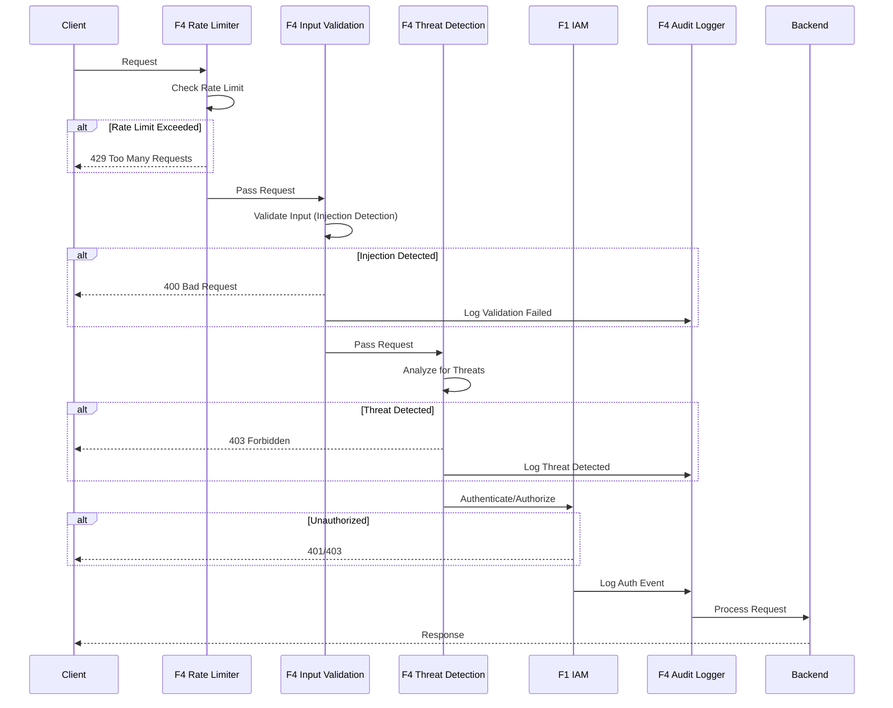

# BRD-04.1: F4 Security Operations (SecOps) - Core

> **Navigation**: [Index](BRD-04.0_index.md) | [Next: Requirements](BRD-04.2_requirements.md)
> **Parent**: BRD-04 | **Section**: 1 of 3

---

## 0. Document Control

| Item | Details |
|------|---------|
| **Project Name** | AI Cost Monitoring Platform v4.2 - F4 SecOps Module |
| **Document Version** | 1.0 |
| **Date** | 2026-01-14 |
| **Document Owner** | Chief Architect |
| **Prepared By** | Antigravity AI |
| **Status** | Draft |
| **MVP Target Launch** | Phase 1 |
| **PRD-Ready Score** | 92/100 (Target: >=90/100) |

### Executive Summary (MVP)

The F4 Security Operations Module provides runtime security for the AI Cost Monitoring Platform including input validation (injection detection, rate limiting, sanitization), compliance enforcement (OWASP ASVS 5.0 Level 2, OWASP LLM Top 10 2025), immutable audit logging with cryptographic chaining (7-year retention), and threat detection with automated response. This foundation module is domain-agnostic with special attention to LLM-specific threats, enforcing security controls without understanding business logic.

### Document Revision History

| Version | Date | Author | Changes Made | Approver |
|---------|------|--------|--------------|----------|
| 1.0 | 2026-01-14 | Antigravity AI | Initial BRD creation from F4 Spec and Gap Analysis | |

---

## 1. Introduction

### 1.1 Purpose

This Business Requirements Document (BRD) defines the business requirements for the F4 Security Operations Module. The F4 SecOps Module provides runtime security including input validation, compliance enforcement, audit logging, and threat detection for the platform using a Zero-Trust security model with defense-in-depth.

@ref: [F4 SecOps Technical Specification](../../00_REF/foundation/F4_SecOps_Technical_Specification.md#1-executive-summary)

### 1.2 Document Scope

This document covers:
- Input validation capabilities (injection detection, rate limiting, sanitization)
- Compliance enforcement (OWASP ASVS 5.0 Level 2, OWASP LLM Top 10 2025)
- Audit logging with immutable, cryptographically-chained records
- Threat detection and automated response
- LLM security defense-in-depth
- Gap remediation for enterprise compliance

**Out of Scope**:
- Domain-specific business logic (cloud_accounts, cost_analytics)
- Security policy definitions (injected by domain layer)
- UI implementation details

### 1.3 Intended Audience

- Platform administrators (security configuration)
- DevOps engineers (deployment, integration)
- Security/Compliance officers (audit, policy)
- Development teams (API integration)

### 1.4 Document Conventions

- **Must/Shall**: P1 critical requirements
- **Should**: P2 important requirements
- **Future**: P3 post-MVP enhancements

---

## 2. Business Objectives

### 2.1 MVP Hypothesis

**If** we implement a domain-agnostic security operations foundation module with input validation, compliance enforcement, immutable audit logging, and threat detection capabilities, **then** we will:
1. Enable secure platform operations with defense-in-depth against injection attacks and LLM-specific threats
2. Achieve enterprise compliance requirements for security standards (OWASP ASVS 5.0, LLM Top 10)
3. Provide immutable audit trail for security events with 7-year retention for regulatory compliance

**Validation Questions**:
- Can the system detect and block prompt injection attempts with <100ms latency?
- Can compliance reports be generated on schedule and pass OWASP ASVS Level 2 verification?
- Can audit logs demonstrate tamper-proof integrity through cryptographic hash chain validation?

---

### 2.2 Business Problem Statement

**Current State**: Platform lacks unified runtime security with SIEM integration, WAF synchronization, automated penetration testing, and external threat intelligence feeds.

**Impact**:
- Security incidents require manual investigation across siloed logs
- WAF rules must be updated manually, creating security gaps
- No proactive threat detection from external intelligence sources
- Ad-hoc incident response without documented runbooks

**Desired State**: Unified SecOps foundation module providing defense-in-depth, automated threat response, and enterprise-grade compliance reporting.

---

### 2.3 MVP Business Goals

| Goal ID | Goal Statement | Success Indicator | Priority |
|---------|----------------|-------------------|----------|
| BRD.04.23.01 | Establish defense-in-depth security as platform runtime baseline | 100% injection attacks blocked, <100ms detection latency | P1 |
| BRD.04.23.02 | Address identified SecOps gaps for enterprise deployment readiness | 6/6 F4 gaps remediated | P1 |
| BRD.04.23.03 | Maintain portable, domain-agnostic design enabling platform reuse | 0 domain-specific code lines in F4 | P1 |

---

### BRD.04.23.01: Defense-in-Depth Security Posture

**Objective**: Implement defense-in-depth security with multiple validation layers and automated threat response.

**Business Driver**: Autonomous AI agents and financial operations require comprehensive runtime security to prevent injection attacks, data breaches, and compliance violations.

@ref: [F4 Section 1](../../00_REF/foundation/F4_SecOps_Technical_Specification.md#1-executive-summary)

---

### BRD.04.23.02: Enterprise SecOps Compliance

**Objective**: Address identified SecOps gaps to meet enterprise-grade platform requirements.

**Business Driver**: Current implementation lacks SIEM integration, WAF synchronization, automated pen testing, and threat intelligence capabilities required for enterprise deployments.

@ref: [GAP_Foundation_Module_Gap_Analysis Section 5](../../00_REF/foundation/GAP_Foundation_Module_Gap_Analysis.md#5-f4-security-operations)

---

### BRD.04.23.03: Portable Foundation Module

**Objective**: Maintain domain-agnostic design allowing F4 SecOps to be reused across different platform deployments.

**Business Driver**: Foundation modules must have zero knowledge of business logic to enable portability and reduce coupling.

---

### 2.4 MVP Success Metrics

| Objective ID | Objective Statement | Success Metric | MVP Target | Measurement Period |
|--------------|---------------------|----------------|------------|-------------------|
| BRD.04.23.01 | Defense-in-Depth Security | Injection attacks blocked | 100% | 90 days post-launch |
| BRD.04.23.02 | Enterprise Compliance | Gap requirements implemented | 6/6 addressed | MVP + Phase 2 |
| BRD.04.23.03 | Portability | Domain-specific code in F4 | 0 lines | Continuous |

---

### 2.5 Expected Benefits (MVP Scope)

**Quantifiable Benefits**:

| Benefit ID | Benefit Statement | Baseline | Target | Measurement |
|------------|-------------------|----------|--------|-------------|
| BRD.04.25.01 | Reduce security incident response time | Hours (manual) | <5 minutes | SIEM alert to response |
| BRD.04.25.02 | Enterprise compliance readiness | 0/6 gaps addressed | 6/6 addressed | Gap remediation tracking |
| BRD.04.25.03 | Audit log integrity | No chain verification | 100% tamper-proof | Daily chain validation |

**Qualitative Benefits**:
- Consistent security posture across all platform components
- Reduced compliance audit effort through automated reporting
- Foundation for proactive threat intelligence and automated response
- Domain-agnostic design enabling platform reuse

---

## 3. Project Scope

### 3.1 MVP Scope Statement

The F4 SecOps Module provides input validation, compliance enforcement, audit logging, threat detection, and LLM security as a domain-agnostic foundation layer consumed by all domain layers (D1-D7).

### 3.2 MVP Core Features (In-Scope)

**P1 - Must Have for MVP Launch**:
1. Input validation (prompt injection, SQL injection, XSS detection)
2. Rate limiting with sliding window algorithm
3. Compliance enforcement (OWASP ASVS 5.0 Level 2, OWASP LLM Top 10 2025)
4. Immutable audit logging with cryptographic hash chain
5. Threat detection (brute force, anomaly, suspicious patterns)
6. LLM security (defense-in-depth, PII redaction, context isolation)
7. SIEM integration connector (GAP-F4-01)

**P2 - Should Have**:
1. WAF integration with Cloud Armor (GAP-F4-02)
2. Automated penetration testing (GAP-F4-03)
3. Threat intelligence feed integration (GAP-F4-04)

**P3 - Future**:
1. Security scoring system (GAP-F4-05)
2. Incident response runbook engine (GAP-F4-06)

### 3.3 Explicitly Out-of-Scope for MVP

- Domain-specific security policies (injected by domain layers D1-D7)
- Custom threat patterns (injected by domain layer)
- Mobile app security flows
- Hardware security modules (HSM) integration

### 3.4 MVP Workflow

The following diagram illustrates the core request security flow for the F4 SecOps Module:

**Workflow Summary**:
1. **Rate Limiting**: Request checked against sliding window counter
2. **Input Validation**: Injection detection (prompt, SQL, XSS)
3. **Threat Analysis**: Brute force, anomaly, suspicious pattern detection
4. **Authentication/Authorization**: Delegated to F1 IAM
5. **Audit Logging**: All security events logged with cryptographic chain

### 3.5 Technology Stack

| Component | Technology | Reference |
|-----------|------------|-----------|
| Audit Storage | BigQuery | F4 Section 5.3 |
| Rate Limit Backend | Redis | F4 Section 3.2 |
| Hash Algorithm | SHA-256 | F4 Section 5.4 |
| Compliance Standards | OWASP ASVS 5.0, LLM Top 10 | F4 Section 4 |
| WAF | Cloud Armor | F6 |
| Alerting | PagerDuty, Slack | F4 Section 6.2 |

---

## 4. Stakeholders

### Decision Makers

| Role | Responsibility | Key Decisions |
|------|----------------|---------------|
| **Executive Sponsor** | Final approval authority for F4 scope | Security budget, compliance standards |
| **Product Owner** | Feature prioritization for security capabilities | Threat detection rules, audit retention |
| **Technical Lead** | Architecture decisions for F4 implementation | Storage backend (BigQuery), detection algorithms |

### Key Contributors

| Role | Involvement | Domain Focus |
|------|-------------|--------------|
| **Security Officer** | Define compliance requirements, review configurations | OWASP standards, LLM security |
| **Compliance/Legal** | Regulatory guidance, audit requirements | 7-year retention, evidence export |
| **DevOps Engineer** | Deploy module, integrate with Cloud Armor | Rate limiting infrastructure, WAF rules |
| **Development Team** | Integrate F4 APIs, implement validation hooks | API contracts, extensibility hooks |

---

## 5. User Stories

### 5.1 Primary User Stories (MVP Essential)

| Story ID | User Role | Action | Business Value | Priority |
|----------|-----------|--------|----------------|----------|
| BRD.04.09.01 | User | Submit input validated for injection attacks | Protection from malicious inputs | P1 |
| BRD.04.09.02 | User | Be rate-limited when exceeding request thresholds | Platform stability under load | P1 |
| BRD.04.09.03 | Admin | View compliance status dashboard | Continuous compliance visibility | P1 |
| BRD.04.09.04 | Admin | Query audit logs for security events | Incident investigation capability | P1 |
| BRD.04.09.05 | Admin | Unblock IP addresses manually | Incident response flexibility | P1 |
| BRD.04.09.06 | System | Detect and block brute force attempts | Automated threat mitigation | P1 |
| BRD.04.09.07 | System | Generate compliance reports on schedule | Regulatory evidence generation | P1 |
| BRD.04.09.08 | Admin | Export audit logs to external SIEM | Unified security visibility | P2 |
| BRD.04.09.09 | Admin | Receive threat intelligence alerts | Proactive threat awareness | P2 |
| BRD.04.09.10 | Agent | Receive LLM-safe sanitized context | AI security protection | P1 |

@ref: [F4 Sections 3-9](../../00_REF/foundation/F4_SecOps_Technical_Specification.md#3-input-validation)

### 5.2 User Story Summary

- **Total MVP User Stories**: 10 (P1: 8, P2: 2)
- **Future Phase Stories**: Security scoring, incident runbooks

---

> **Navigation**: [Index](BRD-04.0_index.md) | [Next: Requirements](BRD-04.2_requirements.md)
