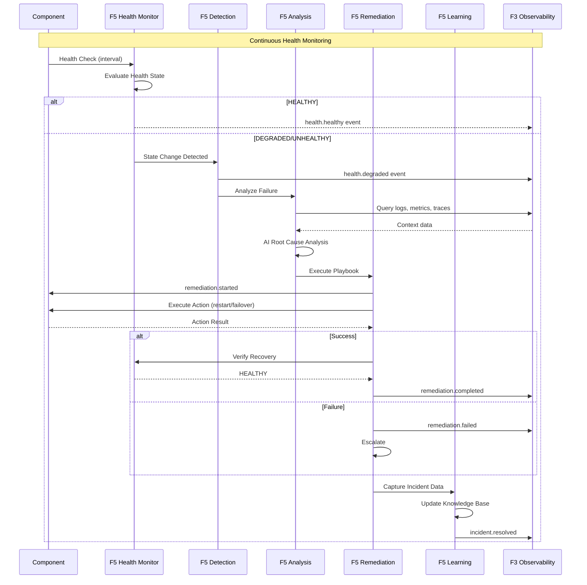

# BRD-05: F5 Self-Sustaining Operations

> **Module Type**: Foundation (Domain-Agnostic)
> **Portability**: This BRD defines generic self-healing, health monitoring, and auto-remediation capabilities reusable across any platform requiring autonomous operations.

---

## 0. Document Control

| Item | Details |
|------|---------|
| **Project Name** | AI Cost Monitoring Platform v4.2 - F5 Self-Ops Module |
| **Document Version** | 1.0 |
| **Date** | 2026-01-14 |
| **Document Owner** | Chief Architect |
| **Prepared By** | Antigravity AI |
| **Status** | Draft |
| **MVP Target Launch** | Phase 1 |
| **PRD-Ready Score** | 92/100 (Target: >=90/100) |

### Executive Summary (MVP)

The F5 Self-Sustaining Operations Module provides autonomous platform operations including health monitoring, auto-remediation, incident learning, and AI-assisted development. It implements a continuous self-healing loop (Monitor -> Detect -> Analyze -> Remediate -> Learn) with configurable playbooks for automated recovery. This foundation module is domain-agnostic and requires no knowledge of business logic--all components and playbooks are configuration-injected.

### Document Revision History

| Version | Date | Author | Changes Made | Approver |
|---------|------|--------|--------------|----------|
| 1.0 | 2026-01-14 | Antigravity AI | Initial BRD creation from F5 Spec and Gap Analysis | |

---

## 1. Introduction

### 1.1 Purpose

This Business Requirements Document (BRD) defines the business requirements for the F5 Self-Sustaining Operations Module. The F5 Self-Ops Module handles all autonomous operations for the platform including health monitoring, auto-remediation, incident learning, and AI-assisted development using a self-healing architecture.

@ref: [F5 Self-Ops Technical Specification](../00_init/F5_SelfOps_Technical_Specification.md#1-executive-summary)

### 1.2 Document Scope

This document covers:
- Health monitoring with component registration and status aggregation
- Auto-remediation via configurable playbooks (restart, failover, scale)
- Incident learning with AI-powered root cause analysis
- AI-assisted development (code generation, documentation, tests)
- Self-healing loop implementation
- Gap remediation for enterprise SRE capabilities

**Out of Scope**:
- Domain-specific component definitions (injected by domain layer)
- Playbook definitions (injected by domain layer)
- UI implementation details

### 1.3 Intended Audience

- SRE/DevOps engineers (playbook configuration, incident response)
- Platform administrators (health monitoring, escalation policies)
- Security/Compliance officers (incident audit, retention policies)
- Development teams (API integration, custom health checks)

### 1.4 Document Conventions

- **Must/Shall**: P1 critical requirements
- **Should**: P2 important requirements
- **Future**: P3 post-MVP enhancements

---

## 2. Business Objectives

### 2.1 MVP Hypothesis

**If** we implement a domain-agnostic self-ops foundation module with health monitoring, auto-remediation, and incident learning capabilities, **then** we will:
1. Reduce Mean Time to Recovery (MTTR) through automated remediation playbooks
2. Improve platform reliability through continuous health monitoring
3. Enable organizational learning from incidents via AI-powered analysis

**Validation Questions**:
- Can platform components be registered for health monitoring within 5 minutes?
- Can auto-remediation playbooks execute without human intervention?
- Can similar past incidents be retrieved within 30 seconds for faster resolution?

---

### 2.2 Business Problem Statement

**Current State**: Platform lacks centralized health monitoring with auto-remediation capabilities, predictive maintenance, and systematic incident learning.

**Impact**:
- Manual intervention required for component failures increases MTTR
- Reactive-only operations without proactive failure prevention
- No systematic capture and analysis of incident patterns for improvement

**Desired State**: Unified self-ops foundation module providing autonomous health monitoring, automated remediation, and continuous learning from incidents.

---

### 2.3 MVP Business Goals

| Goal ID | Goal Statement | Success Indicator | Priority |
|---------|----------------|-------------------|----------|
| BRD.05.23.01 | Establish autonomous health monitoring and auto-remediation as platform operations baseline | >80% incidents auto-remediated without human intervention | P1 |
| BRD.05.23.02 | Address identified Self-Ops gaps for enterprise SRE readiness | 6/6 F5 gaps remediated | P1 |
| BRD.05.23.03 | Maintain portable, domain-agnostic design enabling platform reuse | 0 domain-specific code lines in F5 | P1 |

---

### BRD.05.23.01: Autonomous Operations Posture

**Objective**: Implement autonomous health monitoring and auto-remediation where failures are automatically detected and recovered.

**Business Driver**: Autonomous AI agents and financial operations require high availability with minimal human intervention to prevent revenue loss and user impact.

@ref: [F5 Section 1](../00_init/F5_SelfOps_Technical_Specification.md#1-executive-summary)

---

### BRD.05.23.02: Enterprise SRE Compliance

**Objective**: Address identified Self-Ops gaps to meet enterprise-grade SRE requirements.

**Business Driver**: Current implementation lacks auto-scaling, chaos engineering, and predictive maintenance capabilities required for enterprise deployments.

@ref: [GAP_Foundation_Module_Gap_Analysis Section 6.2](../00_init/GAP_Foundation_Module_Gap_Analysis.md#62-identified-gaps)

---

### BRD.05.23.03: Portable Foundation Module

**Objective**: Maintain domain-agnostic design allowing F5 Self-Ops to be reused across different platform deployments.

**Business Driver**: Foundation modules must have zero knowledge of business logic to enable portability and reduce coupling.

---

### 2.4 MVP Success Metrics

| Objective ID | Objective Statement | Success Metric | MVP Target | Measurement Period |
|--------------|---------------------|----------------|------------|-------------------|
| BRD.05.23.01 | Autonomous Operations | Auto-remediation success rate | >80% | 90 days post-launch |
| BRD.05.23.02 | Enterprise SRE | Gap requirements implemented | 6/6 addressed | MVP + Phase 2 |
| BRD.05.23.03 | Portability | Domain-specific code in F5 | 0 lines | Continuous |

---

### 2.5 Expected Benefits (MVP Scope)

**Quantifiable Benefits**:

| Benefit ID | Benefit Statement | Baseline | Target | Measurement |
|------------|-------------------|----------|--------|-------------|
| BRD.05.25.01 | Reduce Mean Time to Recovery (MTTR) | Manual (>15 min) | <5 minutes | Incident resolution time |
| BRD.05.25.02 | Reduce Mean Time to Detect (MTTD) | Minutes | <1 minute | Health check detection latency |
| BRD.05.25.03 | Enterprise SRE readiness | 0/6 gaps addressed | 6/6 addressed | Gap remediation tracking |

**Qualitative Benefits**:
- Consistent operational posture across all platform components
- Reduced operational burden for SRE teams through automation
- Foundation for predictive maintenance and proactive operations
- Domain-agnostic design enabling platform reuse

---

## 3. Project Scope

### 3.1 MVP Scope Statement

The F5 Self-Ops Module provides health monitoring, auto-remediation, incident learning, and AI-assisted development as a domain-agnostic foundation layer consumed by all domain layers (D1-D7).

### 3.2 MVP Core Features (In-Scope)

**P1 - Must Have for MVP Launch**:
1. Health Monitoring with component registration and 4-state model
2. Auto-Remediation via playbook system (restart, failover)
3. Incident Learning with AI-powered root cause analysis
4. Self-Healing Loop (Monitor -> Detect -> Analyze -> Remediate -> Learn)
5. Event System for health and remediation events
6. Auto-Scaling capability (GAP-F5-01)

**P2 - Should Have**:
1. Chaos Engineering framework (GAP-F5-02)
2. Predictive Maintenance engine (GAP-F5-03)
3. Dependency Health Monitoring (GAP-F5-04)

**P3 - Future**:
1. Runbook Library with pre-built playbooks (GAP-F5-05)
2. Automated Post-Incident Review (GAP-F5-06)

### 3.3 Explicitly Out-of-Scope for MVP

- Domain-specific components (injected by domain layers D1-D7)
- Domain-specific playbooks (injected by domain layers)
- Mobile app health monitoring
- Enterprise SIEM integration (handled by F4 SecOps)

### 3.4 MVP Workflow

The following diagram illustrates the core self-healing loop for the F5 Self-Ops Module:



**Workflow Summary**:
1. **Monitor**: Continuous health checks at configured intervals
2. **Detect**: State change detection (HEALTHY -> DEGRADED -> UNHEALTHY)
3. **Analyze**: AI-powered root cause analysis using logs, metrics, traces
4. **Remediate**: Execute playbook actions (restart, failover, scale)
5. **Learn**: Capture incident data for future pattern matching

### 3.5 Technology Stack

| Component | Technology | Reference |
|-----------|------------|-----------|
| Health Checks | Custom HTTP/TCP/Custom probes | F5 Section 3 |
| Playbook Engine | YAML-based declarative playbooks | F5 Section 4 |
| Incident Storage | BigQuery | F5 Section 5.4 |
| AI Analysis | Vertex AI (Claude, Gemini) | F5 Section 5.2 |
| Event Bus | GCP Pub/Sub | F6 |
| Notifications | Slack, PagerDuty | F5 Section 4 |

---

## 4. Stakeholders

### Decision Makers

| Role | Responsibility | Key Decisions |
|------|----------------|---------------|
| **Executive Sponsor** | Final approval authority for F5 scope | SRE investment, incident response policy |
| **Product Owner** | Feature prioritization for self-ops capabilities | Playbook strategy, auto-remediation limits |
| **Technical Lead** | Architecture decisions for F5 implementation | Health check patterns, incident learning pipeline |

### Key Contributors

| Role | Involvement | Domain Focus |
|------|-------------|--------------|
| **SRE/DevOps Engineer** | Configure playbooks, monitor health, manage incidents | Remediation policies, SLO targets |
| **Platform Administrator** | Define component health checks, manage notifications | Health monitoring thresholds |
| **Security/Compliance Officer** | Audit incident data, validate remediation actions | Incident retention, access controls |
| **Development Team** | Integrate F5 APIs, implement custom health checks | API contracts, extensibility hooks |

---

## 5. User Stories

### 5.1 Primary User Stories (MVP Essential)

| Story ID | User Role | Action | Business Value | Priority |
|----------|-----------|--------|----------------|----------|
| BRD.05.09.01 | Platform Admin | Register component health checks | Proactive monitoring of system health | P1 |
| BRD.05.09.02 | SRE | View aggregated health status | Quick assessment of platform state | P1 |
| BRD.05.09.03 | SRE | Define remediation playbooks | Automated recovery reduces MTTR | P1 |
| BRD.05.09.04 | System | Execute auto-remediation on failure | Reduced manual intervention, faster recovery | P1 |
| BRD.05.09.05 | SRE | Review incident root cause analysis | Learn from failures, prevent recurrence | P1 |
| BRD.05.09.06 | SRE | Search similar past incidents | Faster resolution with historical context | P2 |
| BRD.05.09.07 | Developer | Generate code/tests via aidoc-flow | Accelerated development workflow | P2 |
| BRD.05.09.08 | Platform Admin | Receive escalation notifications | Critical issues reach appropriate responders | P1 |
| BRD.05.09.09 | SRE | Access health history and metrics | Trend analysis for capacity planning | P2 |
| BRD.05.09.10 | System | Scale components based on demand | Handle traffic spikes automatically | P2 |

@ref: [F5 Sections 3-10](../00_init/F5_SelfOps_Technical_Specification.md#3-health-monitoring)

### 5.2 User Story Summary

- **Total MVP User Stories**: 10 (P1: 6, P2: 4)
- **Future Phase Stories**: Chaos engineering UI, predictive alerts dashboard

---

## 6. Functional Requirements

### 6.1 MVP Requirements Overview

**Priority Definitions**:
- **P1 (Must Have)**: Essential for MVP launch
- **P2 (Should Have)**: Important, implement post-MVP
- **P3 (Future)**: Based on user feedback

---

### BRD.05.01.01: Health Monitoring

**Business Capability**: Continuous health monitoring with component registration, state tracking, and status aggregation.

@ref: [F5 Section 3](../00_init/F5_SelfOps_Technical_Specification.md#3-health-monitoring)

**Business Requirements**:
- Domain-injected component registration (name, type, check interval)
- 4-state health model (HEALTHY, DEGRADED, UNHEALTHY, UNKNOWN)
- Configurable status aggregation (worst-case, majority, all-healthy)
- Health check types: postgres, redis, http, custom, external

**Business Rules**:
- Default check interval: 60 seconds
- Default check timeout: 5 seconds
- UNHEALTHY triggered after >=3 consecutive failures
- DEGRADED triggered after 1-2 consecutive failures

**Business Acceptance Criteria**:

| Criteria ID | Criterion | MVP Target |
|-------------|-----------|------------|
| BRD.05.06.01 | Health check execution success rate | >=99.9% |
| BRD.05.06.02 | Health state change detection latency | <1 minute |

**Complexity**: 3/5 (Multiple check types, state machine management, aggregation policies require coordination)

**Related Requirements**:
- Platform BRDs: BRD-03 (F3 Observability - metrics storage), BRD-06 (F6 Infrastructure - component access)
- Feature BRDs: N/A (Foundation module)

**Priority**: P1

---

### BRD.05.01.02: Auto-Remediation

**Business Capability**: Automated recovery via configurable playbooks with restart, failover, and scale actions.

@ref: [F5 Section 4](../00_init/F5_SelfOps_Technical_Specification.md#4-auto-remediation)

**Business Requirements**:
- YAML-based playbook definition (name, trigger, steps, on_failure)
- Available actions: notify, restart, failover, verify, scale, wait
- Backoff strategy: exponential with configurable initial delay
- Escalation on playbook failure

**Business Rules**:
- Maximum 3 restart attempts before escalation
- Restart backoff: 2x multiplier, 5-second initial delay
- Auto-failback enabled by default
- Verification timeout: 30 seconds post-action

**Business Acceptance Criteria**:

| Criteria ID | Criterion | MVP Target |
|-------------|-----------|------------|
| BRD.05.06.03 | Auto-remediation success rate | >80% |
| BRD.05.06.04 | Remediation execution latency | <5 minutes |

**Complexity**: 4/5 (Playbook orchestration, backoff policies, action execution, and verification require careful state management)

**Related Requirements**:
- Platform BRDs: BRD-06 (F6 Infrastructure - restart/failover execution), BRD-07 (F7 Config - playbook configuration)
- Feature BRDs: N/A (Foundation module)

**Priority**: P1

---

### BRD.05.01.03: Incident Learning

**Business Capability**: AI-powered incident analysis with root cause detection and similar incident search.

@ref: [F5 Section 5](../00_init/F5_SelfOps_Technical_Specification.md#5-incident-learning)

**Business Requirements**:
- Data capture: logs (+-5 min), metrics (+-10 min), traces (related), context (current)
- AI-powered categorization: Infrastructure, Application, External, User Error
- Root cause detection via pattern matching, correlation, timeline analysis
- Similar incident search via vector embedding

**Business Rules**:
- Incident retention: 365 days
- Storage backend: BigQuery
- Incident lifecycle: OPEN -> ANALYZING -> WORKING -> CLOSED (or ESCALATED)
- Full-text and vector search enabled

**Business Acceptance Criteria**:

| Criteria ID | Criterion | MVP Target |
|-------------|-----------|------------|
| BRD.05.06.05 | Root cause analysis accuracy | >=80% |
| BRD.05.06.06 | Similar incident search latency | <30 seconds |

**Complexity**: 4/5 (AI analysis, vector embeddings, and multi-source data correlation require sophisticated implementation)

**Related Requirements**:
- Platform BRDs: BRD-03 (F3 Observability - logs, metrics, traces), BRD-06 (F6 Infrastructure - BigQuery)
- Feature BRDs: N/A (Foundation module)

**Priority**: P1

---

### BRD.05.01.04: AI-Assisted Development

**Business Capability**: Code generation, documentation, test generation, and code review via aidoc-flow.

@ref: [F5 Section 6](../00_init/F5_SelfOps_Technical_Specification.md#6-ai-assisted-development-aidoc-flow)

**Business Requirements**:
- Code generation from specifications
- Auto-documentation generation for APIs
- Unit and integration test generation
- AI-powered PR code review

**Business Rules**:
- Trigger on PR creation/update (configurable)
- Manual trigger always available
- Repository integration via GitHub App
- Push trigger disabled by default

**Business Acceptance Criteria**:

| Criteria ID | Criterion | MVP Target |
|-------------|-----------|------------|
| BRD.05.06.07 | Code generation success rate | >=90% |
| BRD.05.06.08 | PR review completion time | <5 minutes |

**Complexity**: 3/5 (LLM integration well-defined; GitHub webhook handling and code quality require attention)

**Related Requirements**:
- Platform BRDs: BRD-06 (F6 Infrastructure - Vertex AI access)
- Feature BRDs: N/A (Foundation module)

**Priority**: P2

---

### BRD.05.01.05: Self-Healing Loop

**Business Capability**: Continuous autonomous cycle of Monitor -> Detect -> Analyze -> Remediate -> Learn.

@ref: [F5 Section 7](../00_init/F5_SelfOps_Technical_Specification.md#7-self-healing-loop)

**Business Requirements**:
- Automated progression through all loop stages
- Stage duration targets: Detect <1 min, Analyze <30 sec, Remediate <5 min
- Learning stage executes asynchronously
- Loop operates autonomously without human intervention

**Business Rules**:
- Detection triggers analysis automatically
- Remediation requires successful analysis
- Learning captures all incidents (success and failure)
- Loop continues on remediation failure (escalation path)

**Business Acceptance Criteria**:

| Criteria ID | Criterion | MVP Target |
|-------------|-----------|------------|
| BRD.05.06.09 | Full loop completion rate | >=95% |
| BRD.05.06.10 | MTTR (Mean Time to Recovery) | <5 minutes |

**Complexity**: 4/5 (Orchestrating multiple stages with timing targets and failure handling requires careful design)

**Related Requirements**:
- Platform BRDs: BRD-03 (F3 Observability - metrics), BRD-04 (F4 SecOps - security events)
- Feature BRDs: N/A (Foundation module)

**Priority**: P1

---

### BRD.05.01.06: Event System

**Business Capability**: Event emission for health changes, remediation actions, and incident lifecycle.

@ref: [F5 Section 10](../00_init/F5_SelfOps_Technical_Specification.md#10-events-emitted)

**Business Requirements**:
- Health events: health.degraded, health.recovered
- Remediation events: remediation.started, remediation.completed, remediation.failed
- Incident events: incident.created, incident.resolved

**Business Rules**:
- All events published to F6 Pub/Sub
- Events include timestamp, component, severity, context
- Events consumable by F3 Observability for alerting
- Hooks available: on_health_change, on_remediation_failed, on_incident_created

**Business Acceptance Criteria**:

| Criteria ID | Criterion | MVP Target |
|-------------|-----------|------------|
| BRD.05.06.11 | Event delivery success rate | >=99.9% |
| BRD.05.06.12 | Event emission latency | <1 second |

**Complexity**: 2/5 (Standard pub/sub pattern with well-defined event schema)

**Related Requirements**:
- Platform BRDs: BRD-03 (F3 Observability - event consumption), BRD-06 (F6 Infrastructure - Pub/Sub)
- Feature BRDs: N/A (Foundation module)

**Priority**: P1

---

### BRD.05.01.07: Auto-Scaling

**Business Capability**: Horizontal scaling of components based on demand.

@ref: [GAP-F5-01: Auto-Scaling](../00_init/GAP_Foundation_Module_Gap_Analysis.md#62-identified-gaps)

**Business Requirements**:
- Demand-based horizontal scaling
- Configurable min/max instance limits
- Scale-up and scale-down policies
- Integration with F6 Infrastructure compute services

**Business Rules**:
- Default minimum instances: 1
- Default maximum instances: 10
- Cooldown period between scaling events
- Health verification after scale operations

**Business Acceptance Criteria**:

| Criteria ID | Criterion | MVP Target |
|-------------|-----------|------------|
| BRD.05.06.13 | Scale operation success rate | >=99% |
| BRD.05.06.14 | Scale operation latency | <2 minutes |

**Complexity**: 4/5 (Integration with cloud compute APIs, policy evaluation, and cooldown management)

**Related Requirements**:
- Platform BRDs: BRD-06 (F6 Infrastructure - Cloud Run scaling), BRD-03 (F3 Observability - scaling metrics)
- Feature BRDs: N/A (Foundation module)

**Priority**: P1 (Gap remediation)

---

### BRD.05.01.08: Chaos Engineering

**Business Capability**: Controlled failure injection for resilience testing.

@ref: [GAP-F5-02: Chaos Engineering](../00_init/GAP_Foundation_Module_Gap_Analysis.md#62-identified-gaps)

**Business Requirements**:
- Controlled failure injection framework
- Experiment definition and scheduling
- Blast radius controls (scope, duration)
- Automatic experiment termination on excessive impact

**Business Rules**:
- Chaos experiments require explicit authorization
- Production chaos limited to non-critical components by default
- Automatic rollback on safety threshold breach
- Detailed experiment logging for analysis

**Business Acceptance Criteria**:

| Criteria ID | Criterion | MVP Target |
|-------------|-----------|------------|
| BRD.05.06.15 | Chaos experiment success rate | >=95% |
| BRD.05.06.16 | Automatic termination latency | <30 seconds |

**Complexity**: 4/5 (Failure injection requires safety controls, blast radius management, and careful experiment design)

**Related Requirements**:
- Platform BRDs: BRD-04 (F4 SecOps - chaos authorization), BRD-03 (F3 Observability - experiment metrics)
- Feature BRDs: N/A (Foundation module)

**Priority**: P2

---

### BRD.05.01.09: Predictive Maintenance

**Business Capability**: Proactive failure prevention through pattern analysis and prediction.

@ref: [GAP-F5-03: Predictive Maintenance](../00_init/GAP_Foundation_Module_Gap_Analysis.md#62-identified-gaps)

**Business Requirements**:
- Historical pattern analysis for failure prediction
- Anomaly detection using ML models
- Proactive alerting before failures occur
- Maintenance scheduling recommendations

**Business Rules**:
- Prediction confidence threshold: >=80% before alerting
- Minimum historical data: 30 days for predictions
- Integration with F3 Observability for data sourcing
- Predictions logged for accuracy tracking

**Business Acceptance Criteria**:

| Criteria ID | Criterion | MVP Target |
|-------------|-----------|------------|
| BRD.05.06.17 | Prediction accuracy | >=75% |
| BRD.05.06.18 | Proactive alert lead time | >=15 minutes |

**Complexity**: 5/5 (ML model training, anomaly detection, and prediction accuracy require sophisticated implementation)

**Related Requirements**:
- Platform BRDs: BRD-03 (F3 Observability - historical metrics), BRD-06 (F6 Infrastructure - Vertex AI)
- Feature BRDs: N/A (Foundation module)

**Priority**: P2

---

### BRD.05.01.10: Dependency Health Monitoring

**Business Capability**: External service and dependency health tracking.

@ref: [GAP-F5-04: Dependency Health](../00_init/GAP_Foundation_Module_Gap_Analysis.md#62-identified-gaps)

**Business Requirements**:
- External service health monitoring (APIs, databases, third-party services)
- Dependency status aggregation
- Impact analysis when dependencies degrade
- Alternative route activation on dependency failure

**Business Rules**:
- External check timeout: 10 seconds (longer than internal)
- Dependency status included in overall health aggregation
- Degraded dependency triggers proactive notifications
- Dependency health history retained for SLA tracking

**Business Acceptance Criteria**:

| Criteria ID | Criterion | MVP Target |
|-------------|-----------|------------|
| BRD.05.06.19 | External dependency check success rate | >=99% |
| BRD.05.06.20 | Dependency degradation detection latency | <2 minutes |

**Complexity**: 3/5 (External API integration, timeout handling, and dependency mapping)

**Related Requirements**:
- Platform BRDs: BRD-06 (F6 Infrastructure - external connectivity), BRD-03 (F3 Observability - dependency metrics)
- Feature BRDs: N/A (Foundation module)

**Priority**: P2

---

### BRD.05.01.11: Runbook Library

**Business Capability**: Pre-built remediation playbooks for common failure scenarios.

@ref: [GAP-F5-05: Runbook Library](../00_init/GAP_Foundation_Module_Gap_Analysis.md#62-identified-gaps)

**Business Requirements**:
- Library of pre-built playbooks for common scenarios
- Playbook categorization (database, network, compute, application)
- Customization hooks for domain-specific adaptation
- Version control for playbook updates

**Business Rules**:
- Default playbooks read-only (copy to customize)
- Playbook versioning with rollback capability
- Documentation required for each playbook
- Testing required before production deployment

**Business Acceptance Criteria**:

| Criteria ID | Criterion | MVP Target |
|-------------|-----------|------------|
| BRD.05.06.21 | Pre-built playbook coverage | >=20 scenarios |
| BRD.05.06.22 | Playbook customization success rate | >=95% |

**Complexity**: 2/5 (YAML-based templates with documentation; testing framework required)

**Related Requirements**:
- Platform BRDs: BRD-07 (F7 Config - playbook storage)
- Feature BRDs: N/A (Foundation module)

**Priority**: P3

---

### BRD.05.01.12: Post-Incident Review Automation

**Business Capability**: Automated blameless post-incident review generation.

@ref: [GAP-F5-06: Post-Incident Reviews](../00_init/GAP_Foundation_Module_Gap_Analysis.md#62-identified-gaps)

**Business Requirements**:
- Automated PIR document generation
- Timeline reconstruction from incident data
- Contributing factor analysis
- Action item extraction and tracking

**Business Rules**:
- PIR generated within 24 hours of incident closure
- Blameless format enforced (no individual attribution)
- Action items tracked to completion
- PIR templates customizable per team

**Business Acceptance Criteria**:

| Criteria ID | Criterion | MVP Target |
|-------------|-----------|------------|
| BRD.05.06.23 | PIR auto-generation rate | >=90% |
| BRD.05.06.24 | PIR generation latency | <24 hours |

**Complexity**: 3/5 (Document generation, timeline reconstruction, and action item extraction)

**Related Requirements**:
- Platform BRDs: BRD-03 (F3 Observability - incident timeline data)
- Feature BRDs: N/A (Foundation module)

**Priority**: P3

---

## 7. Quality Attributes

### BRD.05.02.01: Reliability (High Availability)

**Requirement**: Implement highly available self-ops services that continue operating during partial failures.

@ref: [F5 Section 8](../00_init/F5_SelfOps_Technical_Specification.md#8-operational-metrics)

**Measures**:
- Service availability target: 99.9%
- Graceful degradation when subsystems fail
- No single point of failure for health monitoring
- Redundant notification channels

**Priority**: P1

---

### BRD.05.02.02: Performance

**Requirement**: Self-ops operations must complete within SRE latency targets.

| Operation | Target Latency |
|-----------|---------------|
| Health check execution | <5 seconds |
| State change detection (MTTD) | <1 minute |
| Remediation completion (MTTR) | <5 minutes |
| Root cause analysis | <30 seconds |

**Priority**: P1

---

### BRD.05.02.03: Scalability

**Requirement**: Support large-scale component monitoring without degradation.

| Metric | Target |
|--------|--------|
| Monitored components | 1,000 |
| Health checks/minute | 10,000 |
| Concurrent playbook executions | 100 |
| Incident storage capacity | 10 million records |

**Priority**: P2

---

### BRD.05.02.04: Security

**Requirement**: Implement secure operations with audit trails and access controls.

**Measures**:
- Playbook execution requires authorization
- Incident data access controlled via F1 IAM
- Audit logging for all remediation actions
- Encrypted storage for incident context data

**Priority**: P1

---

### 7.2 Architecture Decision Requirements

#### 7.2.1 Infrastructure

##### BRD.05.10.01: Health Check Execution Engine

**Status**: [ ] Pending

**Business Driver**: Reliable execution of health checks across distributed components

**Options**: Kubernetes probes, Custom async executor, Cloud Scheduler

**PRD Requirements**: Check scheduling strategy, failure handling, timeout policies

---

#### 7.2.2 Data Architecture

##### BRD.05.10.02: Incident Storage Backend

**Status**: [X] Selected

**Business Driver**: Long-term incident storage with full-text and vector search

**Recommended Selection**: BigQuery with vector embedding support

**PRD Requirements**: Schema design, retention policies, search index configuration

---

#### 7.2.3 Integration

##### BRD.05.10.03: Notification Provider Integration

**Status**: [X] Selected

**Business Driver**: Multi-channel alerting for escalations and notifications

**Recommended Selection**: Slack (primary) + PagerDuty (escalation)

**PRD Requirements**: Channel configuration, escalation policies, notification templates

---

#### 7.2.4 Security

##### BRD.05.10.04: Playbook Authorization Model

**Status**: [ ] Pending

**Business Driver**: Control who can execute remediation playbooks

**Options**: F1 IAM integration, Playbook-specific ACLs, Approval workflows

**PRD Requirements**: Authorization flow, audit logging, emergency override procedures

---

##### BRD.05.10.05: Incident Data Access Control

**Status**: [X] Selected

**Business Driver**: Protect sensitive incident context data

**Recommended Selection**: F1 IAM trust level integration with incident-specific permissions

**PRD Requirements**: Access control matrix, data masking rules, audit requirements

---

#### 7.2.5 Observability

##### BRD.05.10.06: Self-Ops Metrics Strategy

**Status**: [X] Selected

**Business Driver**: Monitor the self-ops module itself (meta-monitoring)

**Recommended Selection**: F3 Observability integration with dedicated self-ops dashboard

**PRD Requirements**: Metric definitions, alert thresholds, SLO targets

---

#### 7.2.6 AI/ML

##### BRD.05.10.07: Root Cause Analysis Model

**Status**: [ ] Pending

**Business Driver**: AI-powered incident analysis and pattern matching

**Options**: Vertex AI Claude, Vertex AI Gemini, Custom trained model

**PRD Requirements**: Model selection criteria, training data requirements, accuracy targets

---

##### BRD.05.10.08: Predictive Maintenance Model

**Status**: [ ] Pending

**Business Driver**: Proactive failure prediction using historical patterns

**Options**: AutoML Tables, Custom LSTM, Anomaly Detection API

**PRD Requirements**: Training pipeline, prediction thresholds, accuracy validation

---

#### 7.2.7 Technology Selection

##### BRD.05.10.09: Playbook Engine

**Status**: [X] Selected

**Business Driver**: Declarative playbook definition and execution

**Recommended Selection**: Custom YAML-based engine with async execution

**PRD Requirements**: Playbook schema, action library, execution lifecycle

---

---

## 8. Business Constraints and Assumptions

### 8.1 MVP Business Constraints

| ID | Constraint Category | Description | Impact |
|----|---------------------|-------------|--------|
| BRD.05.03.01 | Platform | GCP platform (Cloud Run, BigQuery, Pub/Sub) | Cloud lock-in |
| BRD.05.03.02 | Technology | Vertex AI for LLM capabilities | AI vendor dependency |
| BRD.05.03.03 | Integration | F3 Observability required for data access | Foundation dependency |
| BRD.05.03.04 | Notification | Slack and PagerDuty as notification channels | Channel lock-in |

### 8.2 MVP Assumptions

| ID | Assumption | Validation Method | Impact if False |
|----|------------|-------------------|-----------------|
| BRD.05.04.01 | F3 Observability provides sufficient data for analysis | Integration testing | Limited root cause analysis |
| BRD.05.04.02 | BigQuery vector search meets latency requirements | Performance testing | Alternative storage needed |
| BRD.05.04.03 | Components expose health check endpoints | Component audit | Custom probes required |
| BRD.05.04.04 | Slack/PagerDuty availability meets 99.9% SLA | Monitor provider status | Backup notification channel |

---

## 9. Acceptance Criteria

### 9.1 MVP Launch Criteria

**Must-Have Criteria**:
1. [ ] All P1 functional requirements (BRD.05.01.01-07) implemented
2. [ ] Self-healing loop operational (MTTD <1 min, MTTR <5 min)
3. [ ] Auto-remediation success rate >80% in testing
4. [ ] Health monitoring for all registered components
5. [ ] Incident learning with root cause analysis operational
6. [ ] Auto-scaling capability functional (GAP-F5-01)

**Should-Have Criteria**:
1. [ ] Chaos engineering framework implemented (GAP-F5-02)
2. [ ] Predictive maintenance with anomaly detection (GAP-F5-03)
3. [ ] Dependency health monitoring (GAP-F5-04)

---

## 10. Business Risk Management

| Risk ID | Risk Description | Likelihood | Impact | Mitigation Strategy | Owner |
|---------|------------------|------------|--------|---------------------|-------|
| BRD.05.07.01 | Auto-remediation causes cascading failures | Low | Critical | Blast radius limits, verification steps, rollback capability | SRE Lead |
| BRD.05.07.02 | Incorrect root cause analysis | Medium | High | Human review for critical incidents, accuracy tracking, model tuning | Data Engineering |
| BRD.05.07.03 | Health check overload degrades performance | Medium | Medium | Adaptive check intervals, circuit breakers, sampling | Platform Team |
| BRD.05.07.04 | Notification fatigue from excessive alerts | Medium | Medium | Alert deduplication, severity routing, escalation policies | SRE Lead |
| BRD.05.07.05 | BigQuery latency impacts incident search | Low | Medium | Query optimization, caching, fallback to recent incidents | Data Engineering |

---

## 11. Implementation Approach

### 11.1 MVP Development Phases

**Phase 1 - Health Monitoring Foundation**:
- Component registration API
- Health check execution engine
- State machine implementation
- Status aggregation

**Phase 2 - Auto-Remediation**:
- Playbook engine implementation
- Action library (restart, failover, verify)
- Escalation system
- Notification integration

**Phase 3 - Incident Learning**:
- Data capture pipeline (logs, metrics, traces)
- AI analysis integration
- Similar incident search
- Incident lifecycle management

**Phase 4 - Gap Remediation**:
- Auto-Scaling (GAP-F5-01)
- Chaos Engineering framework (GAP-F5-02)
- Predictive Maintenance (GAP-F5-03)
- Dependency Health Monitoring (GAP-F5-04)

---

## 12. Cost-Benefit Analysis

**Development Costs**:
- BigQuery: ~$5/TB stored, ~$5/TB scanned
- Vertex AI: ~$0.003/1K tokens (Claude)
- Pub/Sub: ~$40/TB published
- Development effort: Foundation module priority

**Risk Reduction**:
- Auto-remediation: Reduces MTTR from hours to minutes
- Incident learning: Prevents recurrence of known issues
- Predictive maintenance: Avoids unplanned downtime

**Operational Savings**:
- Reduced SRE on-call burden through automation
- Faster incident resolution via AI-assisted analysis
- Lower customer impact through proactive detection

---

## 13. Traceability

### 13.1 Upstream Dependencies

| Upstream Artifact | Reference | Relevance |
|-------------------|-----------|-----------|
| F5 Self-Ops Technical Specification | [F5 Spec](../00_init/F5_SelfOps_Technical_Specification.md) | Technical requirements source |
| Gap Analysis | [GAP Analysis](../00_init/GAP_Foundation_Module_Gap_Analysis.md) | 6 F5 gaps identified |

### 13.2 Downstream Artifacts

- **PRD-05**: Product Requirements Document (Layer 2)
- **ADR-05**: Incident Storage, Playbook Engine, AI Model Selection
- **BDD-05**: Health monitoring, remediation, and incident learning test scenarios

### 13.3 Cross-BRD References

| Related BRD | Dependency Type | Data Exchange |
|-------------|-----------------|---------------|
| BRD-03 (F3 Observability) | Upstream | F3 provides: metrics, logs, traces, alerts for health monitoring and incident analysis |
| BRD-04 (F4 SecOps) | Upstream | F4 provides: security events for incident correlation, threat response integration |
| BRD-06 (F6 Infrastructure) | Upstream | F6 provides: Cloud Operations services (restart, scale, failover), compute/DB resources |
| BRD-07 (F7 Config) | Downstream | F5 triggers: remediation-triggered config changes, feature flag adjustments |

### 13.4 Requirements Traceability Matrix

| BRD Requirement | Source Spec Reference | GAP Reference | PRD Target | Priority |
|-----------------|----------------------|---------------|------------|----------|
| BRD.05.01.01 | F5 Section 3 | - | PRD-05.01.01 | P1 |
| BRD.05.01.02 | F5 Section 4 | - | PRD-05.01.02 | P1 |
| BRD.05.01.03 | F5 Section 5 | - | PRD-05.01.03 | P1 |
| BRD.05.01.04 | F5 Section 6 | - | PRD-05.01.04 | P2 |
| BRD.05.01.05 | F5 Section 7 | - | PRD-05.01.05 | P1 |
| BRD.05.01.06 | F5 Section 10 | - | PRD-05.01.06 | P1 |
| BRD.05.01.07 | - | GAP-F5-01 | PRD-05.01.07 | P1 |
| BRD.05.01.08 | - | GAP-F5-02 | PRD-05.01.08 | P2 |
| BRD.05.01.09 | - | GAP-F5-03 | PRD-05.01.09 | P2 |
| BRD.05.01.10 | - | GAP-F5-04 | PRD-05.01.10 | P2 |
| BRD.05.01.11 | - | GAP-F5-05 | PRD-05.01.11 | P3 |
| BRD.05.01.12 | - | GAP-F5-06 | PRD-05.01.12 | P3 |

---

## 14. Glossary

**Master Glossary**: See [BRD-00_GLOSSARY.md](../BRD-00_GLOSSARY.md)

### F5-Specific Terms

| Term | Definition | Context |
|------|------------|---------|
| Self-Healing Loop | Monitor -> Detect -> Analyze -> Remediate -> Learn cycle | BRD.05.01.05 |
| MTTD | Mean Time to Detect - time from failure to detection | Section 7 |
| MTTR | Mean Time to Recovery - time from detection to resolution | Section 7 |
| Playbook | YAML-based remediation definition with trigger, steps, and escalation | BRD.05.01.02 |
| Health State | HEALTHY, DEGRADED, UNHEALTHY, UNKNOWN component status | BRD.05.01.01 |
| PIR | Post-Incident Review - blameless incident analysis document | BRD.05.01.12 |
| Chaos Engineering | Controlled failure injection for resilience testing | BRD.05.01.08 |

---

## 15. Appendices

### Appendix A: Self-Healing Loop Diagram

```
    +-----------+      +-----------+      +-----------+
    |  MONITOR  |----->|  DETECT   |----->|  ANALYZE  |
    |           |      |           |      |           |
    | Interval  |      | <1 minute |      | <30 secs  |
    +-----------+      +-----------+      +-----+-----+
         ^                                      |
         |                                      v
    +----+------+                        +-----------+
    |   LEARN   |<-----------------------| REMEDIATE |
    |           |                        |           |
    |   Async   |                        | <5 mins   |
    +-----------+                        +-----------+
```

**Stage Targets**:
- **Monitor**: Continuous at configured interval (default 60s)
- **Detect**: <1 minute from failure to detection
- **Analyze**: <30 seconds for root cause analysis
- **Remediate**: <5 minutes for recovery completion
- **Learn**: Asynchronous, post-incident

### Appendix B: Example Remediation Playbook

```yaml
name: database_connection_recovery
description: Recover from database connection pool exhaustion
trigger: postgres_pool.unhealthy

steps:
  - action: notify
    channel: slack
    message: "Database connection pool unhealthy - initiating recovery"

  - action: wait
    duration_seconds: 10
    reason: "Allow in-flight transactions to complete"

  - action: restart
    target: connection_pool
    delay_seconds: 5
    max_attempts: 3
    backoff_multiplier: 2

  - action: verify
    target: postgres_pool
    timeout_seconds: 30
    expected_state: HEALTHY

  - action: notify
    channel: slack
    message: "Database connection pool recovered successfully"

on_failure:
  escalate_to: pagerduty
  create_incident: true
  severity: high
  runbook_url: "https://wiki.internal/db-recovery"
```

**Playbook Structure**:
- `name`: Unique playbook identifier
- `description`: Human-readable description
- `trigger`: Health event that activates playbook
- `steps`: Ordered list of remediation actions
- `on_failure`: Escalation configuration when playbook fails

**Note**: Playbook definitions are domain-injected at runtime. F5 Self-Ops has no knowledge of specific infrastructure components.

---

*BRD-05: F5 Self-Sustaining Operations -- AI Cost Monitoring Platform v4.2 -- January 2026*
