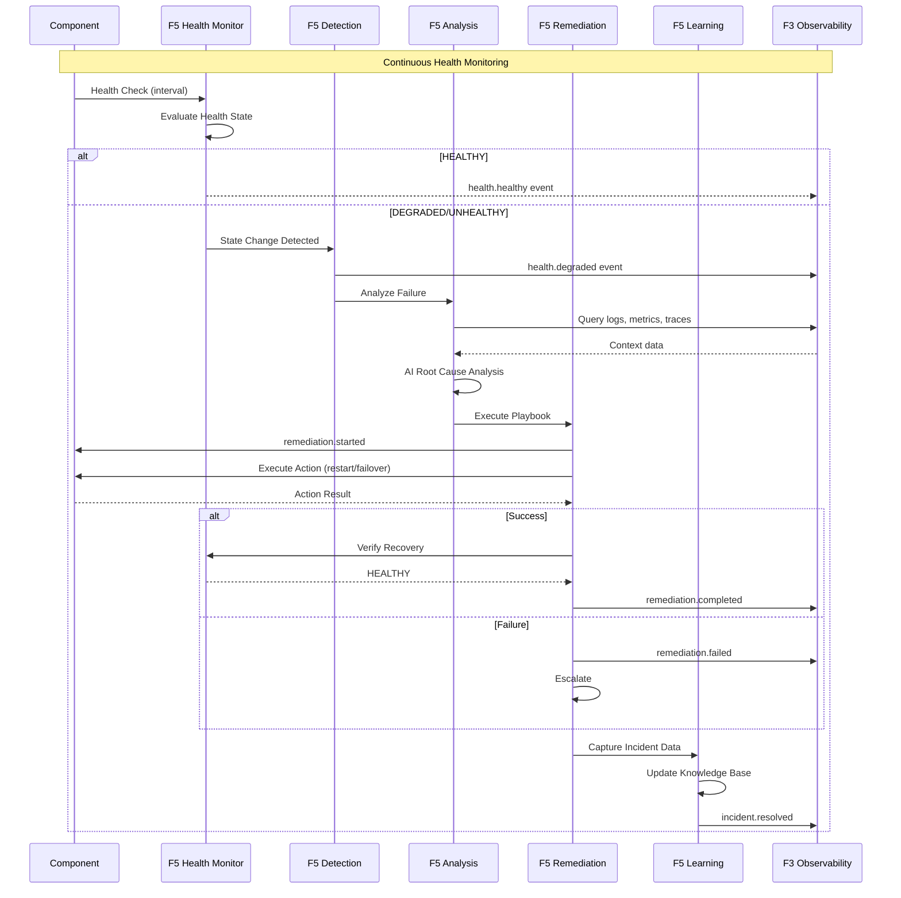

# BRD-05.1: F5 Self-Sustaining Operations - Core

> **Navigation**: [Index](BRD-05.0_index.md) | [Next: Requirements](BRD-05.2_requirements.md)
> **Parent**: BRD-05 | **Section**: 1 of 3

---

## 0. Document Control

| Item | Details |
|------|---------|
| **Project Name** | AI Cost Monitoring Platform v4.2 - F5 Self-Ops Module |
| **Document Version** | 1.0 |
| **Date** | 2026-01-14 |
| **Document Owner** | Chief Architect |
| **Prepared By** | Antigravity AI |
| **Status** | Draft |
| **MVP Target Launch** | Phase 1 |
| **PRD-Ready Score** | 92/100 (Target: >=90/100) |

### Executive Summary (MVP)

The F5 Self-Sustaining Operations Module provides autonomous platform operations including health monitoring, auto-remediation, incident learning, and AI-assisted development. It implements a continuous self-healing loop (Monitor -> Detect -> Analyze -> Remediate -> Learn) with configurable playbooks for automated recovery. This foundation module is domain-agnostic and requires no knowledge of business logic--all components and playbooks are configuration-injected.

### Document Revision History

| Version | Date | Author | Changes Made | Approver |
|---------|------|--------|--------------|----------|
| 1.0 | 2026-01-14 | Antigravity AI | Initial BRD creation from F5 Spec and Gap Analysis | |

---

## 1. Introduction

### 1.1 Purpose

This Business Requirements Document (BRD) defines the business requirements for the F5 Self-Sustaining Operations Module. The F5 Self-Ops Module handles all autonomous operations for the platform including health monitoring, auto-remediation, incident learning, and AI-assisted development using a self-healing architecture.

@ref: [F5 Self-Ops Technical Specification](../../00_REF/foundation/F5_SelfOps_Technical_Specification.md#1-executive-summary)

### 1.2 Document Scope

This document covers:
- Health monitoring with component registration and status aggregation
- Auto-remediation via configurable playbooks (restart, failover, scale)
- Incident learning with AI-powered root cause analysis
- AI-assisted development (code generation, documentation, tests)
- Self-healing loop implementation
- Gap remediation for enterprise SRE capabilities

**Out of Scope**:
- Domain-specific component definitions (injected by domain layer)
- Playbook definitions (injected by domain layer)
- UI implementation details

### 1.3 Intended Audience

- SRE/DevOps engineers (playbook configuration, incident response)
- Platform administrators (health monitoring, escalation policies)
- Security/Compliance officers (incident audit, retention policies)
- Development teams (API integration, custom health checks)

### 1.4 Document Conventions

- **Must/Shall**: P1 critical requirements
- **Should**: P2 important requirements
- **Future**: P3 post-MVP enhancements

---

## 2. Business Objectives

### 2.1 MVP Hypothesis

**If** we implement a domain-agnostic self-ops foundation module with health monitoring, auto-remediation, and incident learning capabilities, **then** we will:
1. Reduce Mean Time to Recovery (MTTR) through automated remediation playbooks
2. Improve platform reliability through continuous health monitoring
3. Enable organizational learning from incidents via AI-powered analysis

**Validation Questions**:
- Can platform components be registered for health monitoring within 5 minutes?
- Can auto-remediation playbooks execute without human intervention?
- Can similar past incidents be retrieved within 30 seconds for faster resolution?

---

### 2.2 Business Problem Statement

**Current State**: Platform lacks centralized health monitoring with auto-remediation capabilities, predictive maintenance, and systematic incident learning.

**Impact**:
- Manual intervention required for component failures increases MTTR
- Reactive-only operations without proactive failure prevention
- No systematic capture and analysis of incident patterns for improvement

**Desired State**: Unified self-ops foundation module providing autonomous health monitoring, automated remediation, and continuous learning from incidents.

---

### 2.3 MVP Business Goals

| Goal ID | Goal Statement | Success Indicator | Priority |
|---------|----------------|-------------------|----------|
| BRD.05.23.01 | Establish autonomous health monitoring and auto-remediation as platform operations baseline | >80% incidents auto-remediated without human intervention | P1 |
| BRD.05.23.02 | Address identified Self-Ops gaps for enterprise SRE readiness | 6/6 F5 gaps remediated | P1 |
| BRD.05.23.03 | Maintain portable, domain-agnostic design enabling platform reuse | 0 domain-specific code lines in F5 | P1 |

---

### BRD.05.23.01: Autonomous Operations Posture

**Objective**: Implement autonomous health monitoring and auto-remediation where failures are automatically detected and recovered.

**Business Driver**: Autonomous AI agents and financial operations require high availability with minimal human intervention to prevent revenue loss and user impact.

@ref: [F5 Section 1](../../00_REF/foundation/F5_SelfOps_Technical_Specification.md#1-executive-summary)

---

### BRD.05.23.02: Enterprise SRE Compliance

**Objective**: Address identified Self-Ops gaps to meet enterprise-grade SRE requirements.

**Business Driver**: Current implementation lacks auto-scaling, chaos engineering, and predictive maintenance capabilities required for enterprise deployments.

@ref: [GAP_Foundation_Module_Gap_Analysis Section 6.2](../../00_REF/foundation/GAP_Foundation_Module_Gap_Analysis.md#62-identified-gaps)

---

### BRD.05.23.03: Portable Foundation Module

**Objective**: Maintain domain-agnostic design allowing F5 Self-Ops to be reused across different platform deployments.

**Business Driver**: Foundation modules must have zero knowledge of business logic to enable portability and reduce coupling.

---

### 2.4 MVP Success Metrics

| Objective ID | Objective Statement | Success Metric | MVP Target | Measurement Period |
|--------------|---------------------|----------------|------------|-------------------|
| BRD.05.23.01 | Autonomous Operations | Auto-remediation success rate | >80% | 90 days post-launch |
| BRD.05.23.02 | Enterprise SRE | Gap requirements implemented | 6/6 addressed | MVP + Phase 2 |
| BRD.05.23.03 | Portability | Domain-specific code in F5 | 0 lines | Continuous |

---

### 2.5 Expected Benefits (MVP Scope)

**Quantifiable Benefits**:

| Benefit ID | Benefit Statement | Baseline | Target | Measurement |
|------------|-------------------|----------|--------|-------------|
| BRD.05.25.01 | Reduce Mean Time to Recovery (MTTR) | Manual (>15 min) | <5 minutes | Incident resolution time |
| BRD.05.25.02 | Reduce Mean Time to Detect (MTTD) | Minutes | <1 minute | Health check detection latency |
| BRD.05.25.03 | Enterprise SRE readiness | 0/6 gaps addressed | 6/6 addressed | Gap remediation tracking |

**Qualitative Benefits**:
- Consistent operational posture across all platform components
- Reduced operational burden for SRE teams through automation
- Foundation for predictive maintenance and proactive operations
- Domain-agnostic design enabling platform reuse

---

## 3. Project Scope

### 3.1 MVP Scope Statement

The F5 Self-Ops Module provides health monitoring, auto-remediation, incident learning, and AI-assisted development as a domain-agnostic foundation layer consumed by all domain layers (D1-D7).

### 3.2 MVP Core Features (In-Scope)

**P1 - Must Have for MVP Launch**:
1. Health Monitoring with component registration and 4-state model
2. Auto-Remediation via playbook system (restart, failover)
3. Incident Learning with AI-powered root cause analysis
4. Self-Healing Loop (Monitor -> Detect -> Analyze -> Remediate -> Learn)
5. Event System for health and remediation events
6. Auto-Scaling capability (GAP-F5-01)

**P2 - Should Have**:
1. Chaos Engineering framework (GAP-F5-02)
2. Predictive Maintenance engine (GAP-F5-03)
3. Dependency Health Monitoring (GAP-F5-04)

**P3 - Future**:
1. Runbook Library with pre-built playbooks (GAP-F5-05)
2. Automated Post-Incident Review (GAP-F5-06)

### 3.3 Explicitly Out-of-Scope for MVP

- Domain-specific components (injected by domain layers D1-D7)
- Domain-specific playbooks (injected by domain layers)
- Mobile app health monitoring
- Enterprise SIEM integration (handled by F4 SecOps)

### 3.4 MVP Workflow

The following diagram illustrates the core self-healing loop for the F5 Self-Ops Module:

**Workflow Summary**:
1. **Monitor**: Continuous health checks at configured intervals
2. **Detect**: State change detection (HEALTHY -> DEGRADED -> UNHEALTHY)
3. **Analyze**: AI-powered root cause analysis using logs, metrics, traces
4. **Remediate**: Execute playbook actions (restart, failover, scale)
5. **Learn**: Capture incident data for future pattern matching

### 3.5 Technology Stack

| Component | Technology | Reference |
|-----------|------------|-----------|
| Health Checks | Custom HTTP/TCP/Custom probes | F5 Section 3 |
| Playbook Engine | YAML-based declarative playbooks | F5 Section 4 |
| Incident Storage | BigQuery | F5 Section 5.4 |
| AI Analysis | Vertex AI (Claude, Gemini) | F5 Section 5.2 |
| Event Bus | GCP Pub/Sub | F6 |
| Notifications | Slack, PagerDuty | F5 Section 4 |

---

## 4. Stakeholders

### Decision Makers

| Role | Responsibility | Key Decisions |
|------|----------------|---------------|
| **Executive Sponsor** | Final approval authority for F5 scope | SRE investment, incident response policy |
| **Product Owner** | Feature prioritization for self-ops capabilities | Playbook strategy, auto-remediation limits |
| **Technical Lead** | Architecture decisions for F5 implementation | Health check patterns, incident learning pipeline |

### Key Contributors

| Role | Involvement | Domain Focus |
|------|-------------|--------------|
| **SRE/DevOps Engineer** | Configure playbooks, monitor health, manage incidents | Remediation policies, SLO targets |
| **Platform Administrator** | Define component health checks, manage notifications | Health monitoring thresholds |
| **Security/Compliance Officer** | Audit incident data, validate remediation actions | Incident retention, access controls |
| **Development Team** | Integrate F5 APIs, implement custom health checks | API contracts, extensibility hooks |

---

## 5. User Stories

### 5.1 Primary User Stories (MVP Essential)

| Story ID | User Role | Action | Business Value | Priority |
|----------|-----------|--------|----------------|----------|
| BRD.05.09.01 | Platform Admin | Register component health checks | Proactive monitoring of system health | P1 |
| BRD.05.09.02 | SRE | View aggregated health status | Quick assessment of platform state | P1 |
| BRD.05.09.03 | SRE | Define remediation playbooks | Automated recovery reduces MTTR | P1 |
| BRD.05.09.04 | System | Execute auto-remediation on failure | Reduced manual intervention, faster recovery | P1 |
| BRD.05.09.05 | SRE | Review incident root cause analysis | Learn from failures, prevent recurrence | P1 |
| BRD.05.09.06 | SRE | Search similar past incidents | Faster resolution with historical context | P2 |
| BRD.05.09.07 | Developer | Generate code/tests via aidoc-flow | Accelerated development workflow | P2 |
| BRD.05.09.08 | Platform Admin | Receive escalation notifications | Critical issues reach appropriate responders | P1 |
| BRD.05.09.09 | SRE | Access health history and metrics | Trend analysis for capacity planning | P2 |
| BRD.05.09.10 | System | Scale components based on demand | Handle traffic spikes automatically | P2 |

@ref: [F5 Sections 3-10](../../00_REF/foundation/F5_SelfOps_Technical_Specification.md#3-health-monitoring)

### 5.2 User Story Summary

- **Total MVP User Stories**: 10 (P1: 6, P2: 4)
- **Future Phase Stories**: Chaos engineering UI, predictive alerts dashboard

---

> **Navigation**: [Index](BRD-05.0_index.md) | [Next: Requirements](BRD-05.2_requirements.md)
