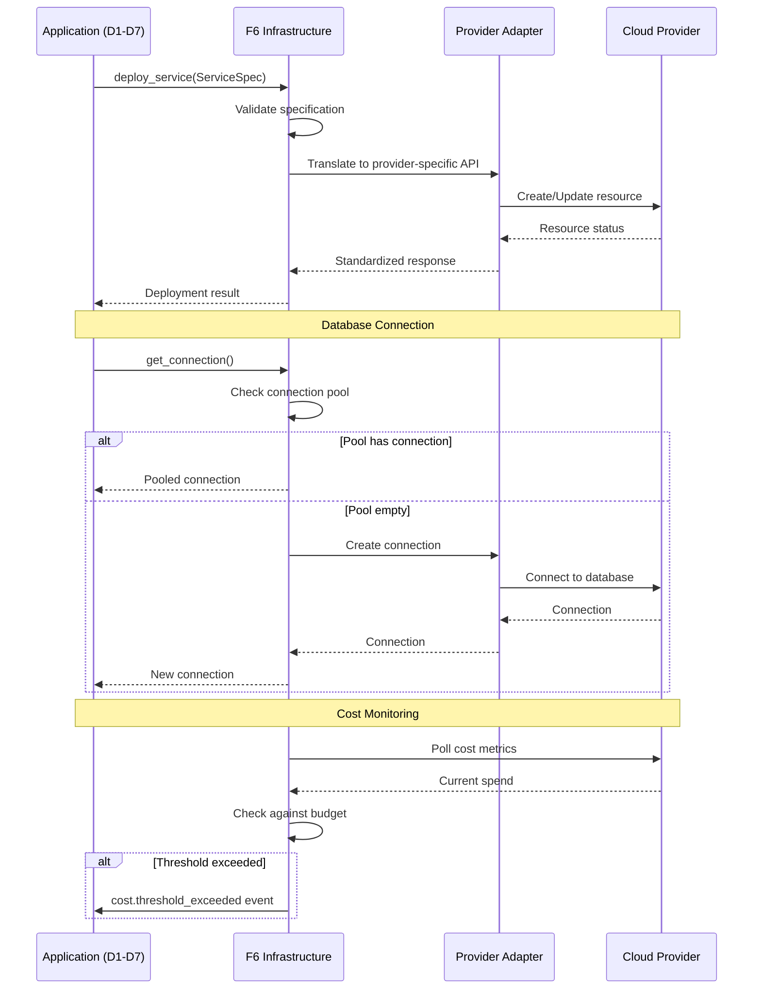

# BRD-06: F6 Infrastructure

> **Module Type**: Foundation (Domain-Agnostic)
> **Portability**: This BRD defines generic cloud infrastructure abstraction capabilities reusable across any platform requiring compute, database, AI services, messaging, storage, networking, and cost management.

---

## 0. Document Control

| Item | Details |
|------|---------|
| **Project Name** | AI Cost Monitoring Platform v4.2 - F6 Infrastructure Module |
| **Document Version** | 1.0 |
| **Date** | 2026-01-14 |
| **Document Owner** | Chief Architect |
| **Prepared By** | Antigravity AI |
| **Status** | Draft |
| **MVP Target Launch** | Phase 1 |
| **PRD-Ready Score** | 92/100 (Target: >=90/100) |

### Executive Summary (MVP)

The F6 Infrastructure Module provides cloud-agnostic infrastructure abstraction for the AI Cost Monitoring Platform. It manages compute services (Cloud Run, ECS, Container Apps), database services (PostgreSQL with HA, pgvector, connection pooling), AI services (LLM gateway with ensemble voting and fallback), messaging (Pub/Sub event-driven architecture), storage (object storage and secret management), networking (VPC, load balancing, DNS, WAF), and cost management (budget controls, alerts, optimization) through provider adapters. This foundation module enables seamless multi-cloud deployment while maintaining domain-agnostic design with zero business logic coupling.

### Document Revision History

| Version | Date | Author | Changes Made | Approver |
|---------|------|--------|--------------|----------|
| 1.0 | 2026-01-14 | Antigravity AI | Initial BRD creation from F6 Spec and Gap Analysis | |

---

## 1. Introduction

### 1.1 Purpose

This Business Requirements Document (BRD) defines the business requirements for the F6 Infrastructure Module. The F6 Infrastructure Module provides cloud-agnostic infrastructure abstraction enabling seamless multi-cloud deployment through standardized provider adapters for compute, database, AI, messaging, storage, networking, and cost management services.

@ref: [F6 Infrastructure Technical Specification](../00_REF/foundation/F6_Infrastructure_Technical_Specification.md#1-executive-summary)

### 1.2 Document Scope

This document covers:
- Compute services abstraction (Cloud Run, ECS, Container Apps)
- Database services with HA and connection pooling
- AI services gateway with LLM ensemble and fallback
- Messaging services for event-driven architecture
- Storage services including object storage and secret management
- Networking with VPC, load balancing, and security
- Cost management with budget controls and optimization
- Gap remediation for enterprise deployment readiness

**Out of Scope**:
- Domain-specific business logic (cloud_accounts, cost_analytics)
- Application-level service definitions (injected by domain layers)
- UI implementation details

### 1.3 Intended Audience

- Platform administrators (infrastructure configuration, cost monitoring)
- DevOps engineers (deployment, cloud resource management)
- Security/Compliance officers (network isolation, audit)
- Development teams (API integration, service deployment)

### 1.4 Document Conventions

- **Must/Shall**: P1 critical requirements
- **Should**: P2 important requirements
- **Future**: P3 post-MVP enhancements

---

## 2. Business Objectives

### 2.1 MVP Hypothesis

**If** we implement a domain-agnostic infrastructure foundation module with cloud-agnostic abstractions, provider adapters, and cost management capabilities, **then** we will:
1. Enable seamless deployment across GCP, AWS, and Azure without application code changes
2. Reduce infrastructure management overhead through unified APIs
3. Achieve cost predictability through budget controls and optimization features

**Validation Questions**:
- Can developers deploy services without cloud-specific SDK knowledge?
- Can infrastructure costs be monitored and controlled within budget thresholds?
- Can the platform fail over to alternative cloud providers within 5 minutes?

---

### 2.2 Business Problem Statement

**Current State**: Platform lacks unified infrastructure abstraction, leading to cloud-specific code in application layers, manual cost tracking, and no multi-region or zero-downtime deployment capabilities.

**Impact**:
- Cloud vendor lock-in through direct SDK usage in application code
- Unpredictable infrastructure costs without budget controls
- Service downtime during deployments without blue-green capability
- Single region deployment creates availability risk

**Desired State**: Unified infrastructure foundation module providing cloud-agnostic abstractions, automated cost management, and enterprise deployment patterns.

---

### 2.3 MVP Business Goals

| Goal ID | Goal Statement | Success Indicator | Priority |
|---------|----------------|-------------------|----------|
| BRD.06.23.01 | Establish cloud-agnostic infrastructure abstraction for platform portability | 0 direct cloud SDK calls in application code | P1 |
| BRD.06.23.02 | Address identified infrastructure gaps for enterprise deployment readiness | 6/6 F6 gaps remediated | P1 |
| BRD.06.23.03 | Implement cost management with budget controls and alerting | Budget alerts triggered before overspend | P1 |

---

### BRD.06.23.01: Cloud-Agnostic Infrastructure

**Objective**: Implement cloud-agnostic infrastructure abstraction enabling deployment across GCP, AWS, and Azure without application code changes.

**Business Driver**: Multi-cloud portability reduces vendor lock-in risk and enables deployment flexibility based on cost, compliance, or performance requirements.

@ref: [F6 SS2](../00_REF/foundation/F6_Infrastructure_Technical_Specification.md#2-architecture-overview)

---

### BRD.06.23.02: Enterprise Infrastructure Compliance

**Objective**: Address identified infrastructure gaps to meet enterprise-grade platform requirements.

**Business Driver**: Current implementation lacks multi-region deployment, blue-green releases, and advanced cost analytics required for production enterprise deployments.

@ref: [GAP_Foundation_Module_Gap_Analysis SS7.2](../00_REF/foundation/GAP_Foundation_Module_Gap_Analysis.md#72-identified-gaps)

---

### BRD.06.23.03: Cost Management Foundation

**Objective**: Implement cost management with budget controls, threshold alerts, and optimization recommendations.

**Business Driver**: Cloud cost unpredictability threatens budget compliance; proactive cost management prevents overspend and enables informed resource decisions.

@ref: [F6 SS9](../00_REF/foundation/F6_Infrastructure_Technical_Specification.md#9-cost-management)

---

### 2.4 MVP Success Metrics

| Objective ID | Objective Statement | Success Metric | MVP Target | Measurement Period |
|--------------|---------------------|----------------|------------|-------------------|
| BRD.06.23.01 | Cloud-Agnostic Abstraction | Direct cloud SDK calls in application code | 0 calls | Continuous |
| BRD.06.23.02 | Enterprise Compliance | Gap requirements implemented | 6/6 addressed | MVP + Phase 2 |
| BRD.06.23.03 | Cost Management | Budget alert accuracy | 100% triggered before threshold | 90 days post-launch |

---

### 2.5 Expected Benefits (MVP Scope)

**Quantifiable Benefits**:

| Benefit ID | Benefit Statement | Baseline | Target | Measurement |
|------------|-------------------|----------|--------|-------------|
| BRD.06.25.01 | Reduce cloud migration effort | Weeks (full rewrite) | Days (adapter swap) | Migration time tracking |
| BRD.06.25.02 | Enterprise deployment readiness | 0/6 gaps addressed | 6/6 addressed | Gap remediation tracking |
| BRD.06.25.03 | Cost predictability | Reactive (bill surprise) | Proactive (alerts before overspend) | Budget alert accuracy |

**Qualitative Benefits**:
- Consistent infrastructure patterns across all platform components
- Reduced infrastructure complexity for development teams
- Foundation for multi-region and hybrid cloud deployment
- Domain-agnostic design enabling platform reuse

---

## 3. Project Scope

### 3.1 MVP Scope Statement

The F6 Infrastructure Module provides compute, database, AI, messaging, storage, networking, and cost management as a domain-agnostic foundation layer consumed by all domain layers (D1-D7) and foundation modules (F1-F5, F7).

### 3.2 MVP Core Features (In-Scope)

**P1 - Must Have for MVP Launch**:
1. Compute services abstraction (Cloud Run primary, AWS/Azure adapters)
2. Database services with PostgreSQL HA and connection pooling
3. AI services gateway with LLM ensemble and auto-fallback
4. Messaging services with Pub/Sub event-driven architecture
5. Storage services with object storage and secret management
6. Networking with VPC, load balancing, and WAF
7. Cost management with budget controls and alerts
8. Multi-Region Deployment capability (GAP-F6-01)
9. Blue-Green Deployments for zero-downtime releases (GAP-F6-05)

**P2 - Should Have**:
1. FinOps Dashboard with advanced cost analytics (GAP-F6-03)

**P3 - Future**:
1. Hybrid Cloud on-premises integration (GAP-F6-02)
2. Terraform Export for IaC configuration (GAP-F6-04)
3. Database Sharding for horizontal scaling (GAP-F6-06)

### 3.3 Explicitly Out-of-Scope for MVP

- Domain-specific resource definitions (injected by domain layers D1-D7)
- Application-specific scaling policies (defined by consuming services)
- Mobile app infrastructure patterns
- Enterprise private cloud integration (v1.3.0 roadmap)

### 3.4 MVP Workflow

The following diagram illustrates the core infrastructure abstraction flow for the F6 Infrastructure Module:



**Workflow Summary**:
1. **Service Deployment**: Applications request infrastructure through F6 abstraction layer
2. **Provider Translation**: F6 translates requests to cloud-specific APIs via adapters
3. **Connection Pooling**: Database connections managed with pooling and health checks
4. **Cost Monitoring**: Continuous cost tracking with threshold-based alerting

### 3.5 Technology Stack

| Component | Technology | Reference |
|-----------|------------|-----------|
| Primary Cloud | GCP (Cloud Run, Cloud SQL, Vertex AI) | ADR-00 |
| Secondary Clouds | AWS (ECS, RDS, Bedrock), Azure (Container Apps, Azure SQL) | F6 SS3.3 |
| Database | PostgreSQL 16 with pgvector | F6 SS4 |
| AI Gateway | Vertex AI Model Garden | F6 SS5 |
| Messaging | Cloud Pub/Sub | F6 SS6 |
| Storage | Cloud Storage, Secret Manager | F6 SS7 |
| Networking | VPC, Cloud Load Balancing, Cloud Armor | F6 SS8 |

---

## 4. Stakeholders

### Decision Makers

| Role | Responsibility | Key Decisions |
|------|----------------|---------------|
| **Executive Sponsor** | Final approval authority for F6 scope | Cloud provider selection, budget limits, multi-cloud strategy |
| **Product Owner** | Feature prioritization for infrastructure capabilities | Service tier selection, scaling policies, cost thresholds |
| **Technical Lead** | Architecture decisions for F6 implementation | Multi-cloud strategy, provider adapter design, database architecture |

### Key Contributors

| Role | Involvement | Domain Focus |
|------|-------------|--------------|
| **Platform Administrator** | Configure infrastructure resources, monitor costs | Budget alerts, resource quotas, scaling policies |
| **DevOps Engineer** | Deploy services, manage cloud resources, CI/CD pipelines | Infrastructure automation, deployment patterns, monitoring |
| **Security/Compliance Officer** | Audit access, validate network isolation, review encryption | VPC policies, encryption standards, compliance reporting |
| **Development Team** | Integrate F6 APIs, implement service abstractions | API contracts, provider adapters, domain layer integration |

---

## 5. User Stories

### 5.1 Primary User Stories (MVP Essential)

| Story ID | User Role | Action | Business Value | Priority |
|----------|-----------|--------|----------------|----------|
| BRD.06.09.01 | Developer | Deploy service to Cloud Run | Consistent deployment without cloud-specific code | P1 |
| BRD.06.09.02 | Developer | Get database connection with pooling | Reliable database access with connection management | P1 |
| BRD.06.09.03 | Developer | Access AI models via unified gateway | LLM ensemble with automatic fallback | P1 |
| BRD.06.09.04 | Service | Publish events to message queue | Async communication between services | P1 |
| BRD.06.09.05 | Developer | Store and retrieve secrets | Secure credential management | P1 |
| BRD.06.09.06 | Admin | View current infrastructure costs | Budget monitoring and forecasting | P1 |
| BRD.06.09.07 | Admin | Receive cost threshold alerts | Prevent budget overruns | P2 |
| BRD.06.09.08 | Developer | Scale service instances | Respond to demand changes | P1 |
| BRD.06.09.09 | Developer | Upload files to object storage | Durable file storage with lifecycle management | P2 |
| BRD.06.09.10 | Admin | Configure network security rules | VPC isolation and firewall management | P1 |

@ref: [F6 SS3-SS9](../00_REF/foundation/F6_Infrastructure_Technical_Specification.md#3-compute-services)

### 5.2 User Story Summary

- **Total MVP User Stories**: 10 (P1: 8, P2: 2)
- **Future Phase Stories**: FinOps dashboard, Terraform export, hybrid cloud integration

---

## 6. Functional Requirements

### 6.1 MVP Requirements Overview

**Priority Definitions**:
- **P1 (Must Have)**: Essential for MVP launch
- **P2 (Should Have)**: Important, implement post-MVP
- **P3 (Future)**: Based on user feedback

---

### BRD.06.01.01: Compute Services

**Business Capability**: Cloud-agnostic compute abstraction with auto-scaling and multi-provider support.

@ref: [F6 SS3](../00_REF/foundation/F6_Infrastructure_Technical_Specification.md#3-compute-services)

**Business Requirements**:
- Cloud Run as primary compute with configurable scaling (1-10 instances)
- Provider adapters for AWS ECS Fargate and Azure Container Apps
- Auto-scaling based on request load with optional scale-to-zero
- Container configuration: 2 vCPU, 4Gi memory, 300s timeout, 80 concurrency

**Business Rules**:
- No direct cloud SDK calls in application code
- All compute operations through F6 abstraction layer
- Cold start must complete within 2 seconds

**Business Acceptance Criteria**:

| Criteria ID | Criterion | MVP Target |
|-------------|-----------|------------|
| BRD.06.06.01 | Service deployment success rate | >=99.9% |
| BRD.06.06.02 | Auto-scaling response time | <30 seconds |

**Complexity**: 3/5 (Multi-provider adapter pattern requires careful abstraction design and testing across cloud platforms)

**Related Requirements**:
- Platform BRDs: BRD-05 (F5 Self-Ops - scaling operations, health monitoring)
- Feature BRDs: N/A (Foundation module)

**Priority**: P1

---

### BRD.06.01.02: Database Services

**Business Capability**: Managed PostgreSQL with HA, connection pooling, and vector storage support.

@ref: [F6 SS4](../00_REF/foundation/F6_Infrastructure_Technical_Specification.md#4-database-services)

**Business Requirements**:
- Cloud SQL PostgreSQL with regional failover (HA enabled)
- Connection pooling with 20 active connections, 10 overflow
- pgvector extension for embedding storage and similarity search
- Automated backups with 7-day retention and point-in-time recovery
- Alembic-based migrations with version control and rollback

**Database Configuration**:

| Setting | Value | Description |
|---------|-------|-------------|
| Tier | db-custom-2-4096 | 2 vCPU, 4GB RAM |
| Storage | 50 GB SSD | Expandable storage |
| Pool Size | 20 | Active connections |
| Max Overflow | 10 | Additional connections |
| Connection Timeout | 30s | Connection acquisition |
| SSL | Required | Encrypted connections |

**Business Acceptance Criteria**:

| Criteria ID | Criterion | MVP Target |
|-------------|-----------|------------|
| BRD.06.06.03 | Connection acquisition latency | <100ms |
| BRD.06.06.04 | Failover completion time | <60 seconds |
| BRD.06.06.05 | Backup success rate | 100% |

**Complexity**: 3/5 (PostgreSQL HA and connection pooling well-established; pgvector integration requires embedding pipeline coordination)

**Related Requirements**:
- Platform BRDs: BRD-01 (F1 IAM - user profile storage), BRD-02 (F2 Session - workspace storage)
- Feature BRDs: N/A (Foundation module)

**Priority**: P1

---

### BRD.06.01.03: AI Services

**Business Capability**: Unified LLM gateway with ensemble voting, auto-fallback, and multi-provider support.

@ref: [F6 SS5](../00_REF/foundation/F6_Infrastructure_Technical_Specification.md#5-ai-services)

**Business Requirements**:
- Vertex AI as primary with gemini-1.5-pro (2M context, multimodal)
- Auto-fallback to gemini-1.5-flash on primary failure
- 4-model LLM ensemble voting with confidence scores
- Provider adapters for AWS Bedrock (Claude, Titan) and Azure OpenAI
- Text embeddings via text-embedding-004 (768 dimensions)
- Cost optimization through smart model selection based on task complexity

**Business Acceptance Criteria**:

| Criteria ID | Criterion | MVP Target |
|-------------|-----------|------------|
| BRD.06.06.06 | LLM request success rate | >=99.5% |
| BRD.06.06.07 | Fallback activation time | <2 seconds |
| BRD.06.06.08 | Embedding generation latency | <500ms |

**Complexity**: 4/5 (Multi-model ensemble with voting requires careful coordination; provider adapter differences in token counting and rate limiting)

**Related Requirements**:
- Platform BRDs: BRD-03 (F3 Observability - LLM analytics, token tracking)
- Feature BRDs: N/A (Foundation module)

**Priority**: P1

---

### BRD.06.01.04: Messaging Services

**Business Capability**: Event-driven architecture with Pub/Sub messaging and dead-letter support.

@ref: [F6 SS6](../00_REF/foundation/F6_Infrastructure_Technical_Specification.md#6-messaging-services)

**Business Requirements**:
- At-least-once delivery guarantee
- Optional per-key message ordering
- Dead-letter queues for failed message handling
- Exponential backoff retry policy
- Push and Pull subscription modes
- Provider adapters for AWS SNS/SQS and Azure Service Bus

**Business Acceptance Criteria**:

| Criteria ID | Criterion | MVP Target |
|-------------|-----------|------------|
| BRD.06.06.09 | Message delivery success rate | >=99.99% |
| BRD.06.06.10 | Message publish latency | <100ms |
| BRD.06.06.11 | Dead-letter capture rate | 100% |

**Complexity**: 2/5 (Pub/Sub well-established; provider adapters require careful handling of delivery semantics differences)

**Related Requirements**:
- Platform BRDs: BRD-03 (F3 Observability - event logging), BRD-05 (F5 Self-Ops - event-driven remediation)
- Feature BRDs: N/A (Foundation module)

**Priority**: P1

---

### BRD.06.01.05: Storage Services

**Business Capability**: Object storage and secret management with encryption and lifecycle policies.

@ref: [F6 SS7](../00_REF/foundation/F6_Infrastructure_Technical_Specification.md#7-storage-services)

**Business Requirements**:
- Cloud Storage for object storage with Standard/Nearline classes
- Automatic lifecycle tiering and optional versioning
- AES-256 encryption at rest for all stored objects
- Secret Manager for credential storage with IAM-based access
- Automatic secret versioning with rotation support
- Full audit logging for secret access

**Business Acceptance Criteria**:

| Criteria ID | Criterion | MVP Target |
|-------------|-----------|------------|
| BRD.06.06.12 | File upload success rate | >=99.9% |
| BRD.06.06.13 | Secret retrieval latency | <50ms |
| BRD.06.06.14 | Encryption compliance | 100% AES-256 |

**Complexity**: 2/5 (Standard storage patterns; secret rotation requires careful coordination with consuming services)

**Related Requirements**:
- Platform BRDs: BRD-01 (F1 IAM - credential storage), BRD-07 (F7 Config - sensitive configuration)
- Feature BRDs: N/A (Foundation module)

**Priority**: P1

---

### BRD.06.01.06: Networking

**Business Capability**: VPC isolation with load balancing, DNS, and WAF protection.

@ref: [F6 SS8](../00_REF/foundation/F6_Infrastructure_Technical_Specification.md#8-networking)

**Business Requirements**:
- VPC with 10.0.0.0/16 CIDR and auto-managed subnets
- Private Google Access enabled for internal services
- Global HTTP(S) load balancer with managed SSL certificate
- Cloud CDN enabled for static content
- Cloud DNS with DNSSEC enabled
- Cloud Armor with DDoS protection and OWASP rules
- Optional geo-blocking for regional restrictions

**Business Acceptance Criteria**:

| Criteria ID | Criterion | MVP Target |
|-------------|-----------|------------|
| BRD.06.06.15 | Load balancer availability | >=99.99% |
| BRD.06.06.16 | SSL certificate validity | 100% managed renewal |
| BRD.06.06.17 | WAF rule effectiveness | Block 100% known attack patterns |

**Complexity**: 3/5 (VPC and load balancing well-established; WAF rule tuning requires ongoing security analysis)

**Related Requirements**:
- Platform BRDs: BRD-04 (F4 SecOps - WAF configuration, firewall rules)
- Feature BRDs: N/A (Foundation module)

**Priority**: P1

---

### BRD.06.01.07: Cost Management

**Business Capability**: Budget controls with threshold alerts and cost optimization recommendations.

@ref: [F6 SS9](../00_REF/foundation/F6_Infrastructure_Technical_Specification.md#9-cost-management)

**Business Requirements**:
- Monthly budget limit with configurable threshold alerts
- Alerts at 50%, 75%, 90%, and 100% of budget
- Real-time cost reporting by service and resource
- ML-based 30-day cost forecasting
- Right-sizing and idle resource recommendations
- Auto-scaling enabled; spot instances and committed use disabled for production

**Budget Configuration**:

| Threshold | Amount | Action |
|-----------|--------|--------|
| 50% | $100 | Notification |
| 75% | $150 | Warning |
| 90% | $180 | Critical |
| 100% | $200 | Budget exceeded |

**Business Acceptance Criteria**:

| Criteria ID | Criterion | MVP Target |
|-------------|-----------|------------|
| BRD.06.06.18 | Budget alert accuracy | 100% triggered before threshold |
| BRD.06.06.19 | Cost reporting latency | <1 hour |
| BRD.06.06.20 | Forecast accuracy (30-day) | +/-15% |

**Complexity**: 3/5 (Budget alerting straightforward; ML-based forecasting requires historical data and model tuning)

**Related Requirements**:
- Platform BRDs: BRD-03 (F3 Observability - cost metrics)
- Feature BRDs: N/A (Foundation module)

**Priority**: P1

---

### BRD.06.01.08: Multi-Region Deployment

**Business Capability**: Active-active deployment across multiple regions for high availability.

@ref: [GAP-F6-01: Multi-Region Deployment](../00_REF/foundation/GAP_Foundation_Module_Gap_Analysis.md#72-identified-gaps)

**Business Requirements**:
- Active-active deployment across two or more regions
- Automatic traffic routing based on latency and availability
- Data replication between regions for stateful services
- Failover capability with <5 minute RTO

**Business Acceptance Criteria**:

| Criteria ID | Criterion | MVP Target |
|-------------|-----------|------------|
| BRD.06.06.21 | Regional failover time | <5 minutes |
| BRD.06.06.22 | Cross-region data consistency | Eventual (< 30 seconds) |

**Complexity**: 4/5 (Multi-region deployment requires careful data replication design and traffic management; significant infrastructure coordination)

**Related Requirements**:
- Platform BRDs: BRD-02 (F2 Session - cross-region session sync), BRD-05 (F5 Self-Ops - failover operations)
- Feature BRDs: N/A (Foundation module)

**Priority**: P1 (Gap remediation)

---

### BRD.06.01.09: Hybrid Cloud

**Business Capability**: On-premises integration for hybrid cloud deployments.

@ref: [GAP-F6-02: Hybrid Cloud](../00_REF/foundation/GAP_Foundation_Module_Gap_Analysis.md#72-identified-gaps)

**Business Requirements**:
- VPN or dedicated interconnect to on-premises infrastructure
- Unified management plane across cloud and on-premises
- Data residency compliance for regulated workloads

**Business Acceptance Criteria**:

| Criteria ID | Criterion | MVP Target |
|-------------|-----------|------------|
| BRD.06.06.23 | Hybrid connectivity availability | >=99.9% |
| BRD.06.06.24 | Latency to on-premises | <50ms |

**Complexity**: 4/5 (Hybrid cloud requires significant network infrastructure and security coordination with enterprise IT)

**Related Requirements**:
- Platform BRDs: BRD-04 (F4 SecOps - hybrid security policies)
- Feature BRDs: N/A (Foundation module)

**Priority**: P3

---

### BRD.06.01.10: FinOps Dashboard

**Business Capability**: Advanced cost analytics with visualization and optimization insights.

@ref: [GAP-F6-03: FinOps Dashboard](../00_REF/foundation/GAP_Foundation_Module_Gap_Analysis.md#72-identified-gaps)

**Business Requirements**:
- Interactive cost visualization by service, team, and project
- Trend analysis with historical comparison
- Optimization recommendations with estimated savings
- Chargeback and showback reporting

**Business Acceptance Criteria**:

| Criteria ID | Criterion | MVP Target |
|-------------|-----------|------------|
| BRD.06.06.25 | Dashboard data freshness | <1 hour |
| BRD.06.06.26 | Recommendation accuracy | >=80% actionable |

**Complexity**: 3/5 (Dashboard development straightforward; optimization recommendation engine requires ML model training)

**Related Requirements**:
- Platform BRDs: BRD-03 (F3 Observability - metrics visualization)
- Feature BRDs: N/A (Foundation module)

**Priority**: P2

---

### BRD.06.01.11: Terraform Export

**Business Capability**: Infrastructure-as-Code export for reproducible deployments.

@ref: [GAP-F6-04: Terraform Export](../00_REF/foundation/GAP_Foundation_Module_Gap_Analysis.md#72-identified-gaps)

**Business Requirements**:
- Export current infrastructure configuration to Terraform HCL
- Support for all F6-managed resources
- Version-controlled export with change tracking

**Business Acceptance Criteria**:

| Criteria ID | Criterion | MVP Target |
|-------------|-----------|------------|
| BRD.06.06.27 | Export completeness | 100% F6 resources |
| BRD.06.06.28 | Terraform plan success rate | >=99% |

**Complexity**: 3/5 (Terraform generation requires careful mapping of F6 abstractions to provider-specific resources)

**Related Requirements**:
- Platform BRDs: BRD-07 (F7 Config - configuration export)
- Feature BRDs: N/A (Foundation module)

**Priority**: P3

---

### BRD.06.01.12: Blue-Green Deployments

**Business Capability**: Zero-downtime releases through blue-green deployment pattern.

@ref: [GAP-F6-05: Blue-Green Deployments](../00_REF/foundation/GAP_Foundation_Module_Gap_Analysis.md#72-identified-gaps)

**Business Requirements**:
- Parallel deployment of new version alongside current
- Traffic switching with instant rollback capability
- Health validation before traffic cutover
- Support for gradual traffic shifting (canary)

**Business Acceptance Criteria**:

| Criteria ID | Criterion | MVP Target |
|-------------|-----------|------------|
| BRD.06.06.29 | Deployment downtime | 0 seconds |
| BRD.06.06.30 | Rollback time | <30 seconds |

**Complexity**: 3/5 (Blue-green pattern well-established; health validation and traffic management require careful orchestration)

**Related Requirements**:
- Platform BRDs: BRD-05 (F5 Self-Ops - deployment health checks)
- Feature BRDs: N/A (Foundation module)

**Priority**: P1 (Gap remediation)

---

### BRD.06.01.13: Database Sharding

**Business Capability**: Horizontal database scaling through sharding.

@ref: [GAP-F6-06: Database Sharding](../00_REF/foundation/GAP_Foundation_Module_Gap_Analysis.md#72-identified-gaps)

**Business Requirements**:
- Transparent sharding for large datasets
- Shard key selection and distribution
- Cross-shard query support
- Shard rebalancing without downtime

**Business Acceptance Criteria**:

| Criteria ID | Criterion | MVP Target |
|-------------|-----------|------------|
| BRD.06.06.31 | Shard query latency | <100ms |
| BRD.06.06.32 | Rebalancing impact | <5% performance degradation |

**Complexity**: 5/5 (Database sharding significantly increases complexity; requires careful application design and query routing)

**Related Requirements**:
- Platform BRDs: BRD-02 (F2 Session - workspace sharding)
- Feature BRDs: N/A (Foundation module)

**Priority**: P3

---

## 7. Quality Attributes

### BRD.06.02.01: Security (Defense-in-Depth)

**Requirement**: Implement defense-in-depth security model for all infrastructure resources.

@ref: [F6 SS15](../00_REF/foundation/F6_Infrastructure_Technical_Specification.md#15-security-considerations)

**Measures**:
- VPC isolation with private subnets
- IAM roles and service accounts for all access
- TLS encryption in transit for all connections
- AES-256 encryption at rest for storage and secrets
- Cloud Armor WAF with OWASP rules
- Full API and access audit logging

**Priority**: P1

---

### BRD.06.02.02: Performance

**Requirement**: Infrastructure operations must complete within latency targets.

| Operation | Target Latency |
|-----------|---------------|
| Service deployment | <60 seconds |
| Database connection | <100ms |
| Secret retrieval | <50ms |
| Message publish | <100ms |
| Cost report generation | <5 seconds |

**Priority**: P1

---

### BRD.06.02.03: Reliability

**Requirement**: Infrastructure services must maintain high availability.

| Metric | Target |
|--------|--------|
| Compute service uptime | 99.9% |
| Database uptime | 99.95% |
| Messaging service uptime | 99.99% |
| Recovery time (RTO) | <5 minutes |
| Recovery point (RPO) | <1 hour |

**Priority**: P1

---

### BRD.06.02.04: Scalability

**Requirement**: Support growth without degradation.

| Metric | Target |
|--------|--------|
| Concurrent service instances | 100 |
| Database connections | 30 pooled |
| Messages per second | 10,000 |
| Storage capacity | 100 TB |

**Priority**: P2

---

### 7.2 Architecture Decision Requirements

#### 7.2.1 Infrastructure

##### BRD.06.10.01: Cloud Provider Strategy

**Status**: [X] Selected

**Business Driver**: Multi-cloud portability and vendor risk mitigation

**Recommended Selection**: GCP primary with AWS and Azure adapter support

**PRD Requirements**: Provider adapter interface design, failover procedures

---

##### BRD.06.10.02: Compute Platform Selection

**Status**: [X] Selected

**Business Driver**: Serverless compute with auto-scaling for cost optimization

**Recommended Selection**: Cloud Run (GCP primary), ECS Fargate (AWS), Container Apps (Azure)

**PRD Requirements**: Container specifications, scaling thresholds, cold start optimization

---

#### 7.2.2 Data Architecture

##### BRD.06.10.03: Database Technology Selection

**Status**: [X] Selected

**Business Driver**: Relational data with vector storage for AI workloads

**Recommended Selection**: PostgreSQL 16 with pgvector extension, Cloud SQL managed service

**PRD Requirements**: Schema design, connection pooling configuration, migration strategy

---

##### BRD.06.10.04: Storage Strategy

**Status**: [X] Selected

**Business Driver**: Durable object storage with secret management

**Recommended Selection**: Cloud Storage for objects, Secret Manager for credentials

**PRD Requirements**: Bucket structure, lifecycle policies, secret rotation schedule

---

#### 7.2.3 Integration

##### BRD.06.10.05: Messaging Architecture

**Status**: [X] Selected

**Business Driver**: Event-driven architecture for async service communication

**Recommended Selection**: Cloud Pub/Sub with SNS/SQS and Service Bus adapters

**PRD Requirements**: Topic naming conventions, subscription patterns, dead-letter handling

---

#### 7.2.4 Security

##### BRD.06.10.06: Network Security Architecture

**Status**: [X] Selected

**Business Driver**: Defense-in-depth with WAF and DDoS protection

**Recommended Selection**: VPC isolation, Cloud Armor WAF, managed SSL certificates

**PRD Requirements**: Firewall rules, WAF policies, certificate management

---

##### BRD.06.10.07: Encryption Strategy

**Status**: [X] Selected

**Business Driver**: Data protection at rest and in transit

**Recommended Selection**: TLS 1.3 in transit, AES-256-GCM at rest, customer-managed keys optional

**PRD Requirements**: Key rotation schedule, encryption scope documentation

---

#### 7.2.5 Observability

##### BRD.06.10.08: Infrastructure Monitoring Strategy

**Status**: [ ] Pending

**Business Driver**: Visibility into infrastructure health and cost

**Options**: Cloud Monitoring native, third-party APM, hybrid approach

**PRD Requirements**: Metric collection, alerting thresholds, dashboard design

---

#### 7.2.6 AI/ML

##### BRD.06.10.09: LLM Gateway Architecture

**Status**: [X] Selected

**Business Driver**: Unified AI access with multi-model support

**Recommended Selection**: Vertex AI Model Garden with Bedrock and OpenAI adapters

**PRD Requirements**: Model selection logic, fallback chain, token tracking

---

#### 7.2.7 Technology Selection

##### BRD.06.10.10: Provider Adapter Framework

**Status**: [ ] Pending

**Business Driver**: Consistent interface across cloud providers

**Options**: Abstract factory pattern, adapter pattern, plugin architecture

**PRD Requirements**: Interface design, provider registration, fallback behavior

---

## 8. Business Constraints and Assumptions

### 8.1 MVP Business Constraints

| ID | Constraint Category | Description | Impact |
|----|---------------------|-------------|--------|
| BRD.06.03.01 | Platform | GCP as primary cloud provider | Provider-specific optimizations |
| BRD.06.03.02 | Technology | PostgreSQL for relational data | Database portability limited |
| BRD.06.03.03 | Budget | $200/month infrastructure budget | Limits resource allocation |
| BRD.06.03.04 | Region | us-central1 as primary region | Latency for non-US users |

### 8.2 MVP Assumptions

| ID | Assumption | Validation Method | Impact if False |
|----|------------|-------------------|-----------------|
| BRD.06.04.01 | GCP service availability meets 99.9% SLA | Monitor GCP status | Enable multi-region failover |
| BRD.06.04.02 | Vertex AI model availability for LLM requests | Model quota monitoring | Implement Bedrock fallback |
| BRD.06.04.03 | Development team has GCP experience | Skills assessment | Additional training required |

---

## 9. Acceptance Criteria

### 9.1 MVP Launch Criteria

**Must-Have Criteria**:
1. [ ] All P1 functional requirements (BRD.06.01.01-07, 08, 12) implemented
2. [ ] Cloud-agnostic abstraction enforced (0 direct SDK calls)
3. [ ] Database HA operational with failover tested
4. [ ] Cost management with budget alerts functional
5. [ ] Multi-region deployment capability (GAP-F6-01)
6. [ ] Blue-green deployment capability (GAP-F6-05)

**Should-Have Criteria**:
1. [ ] FinOps Dashboard implemented (GAP-F6-03)
2. [ ] Provider adapters for AWS and Azure tested

---

## 10. Business Risk Management

| Risk ID | Risk Description | Likelihood | Impact | Mitigation Strategy | Owner |
|---------|------------------|------------|--------|---------------------|-------|
| BRD.06.07.01 | Cloud provider lock-in | Medium | High | Multi-provider adapter pattern | Architect |
| BRD.06.07.02 | Budget overrun | Medium | Medium | Threshold alerts, auto-scaling limits | Platform Admin |
| BRD.06.07.03 | Single region failure | Low | Critical | Multi-region deployment (GAP-F6-01) | DevOps |
| BRD.06.07.04 | Deployment downtime | Medium | High | Blue-green deployment (GAP-F6-05) | DevOps |
| BRD.06.07.05 | AI service unavailability | Low | High | Multi-provider fallback chain | Architect |

---

## 11. Implementation Approach

### 11.1 MVP Development Phases

**Phase 1 - Core Infrastructure**:
- GCP provider adapter implementation
- Compute services (Cloud Run)
- Database services (Cloud SQL)
- Cost management foundation

**Phase 2 - Services**:
- AI services gateway (Vertex AI)
- Messaging services (Pub/Sub)
- Storage services (Cloud Storage, Secret Manager)

**Phase 3 - Networking & Security**:
- VPC configuration
- Load balancer setup
- Cloud Armor WAF
- SSL certificate management

**Phase 4 - Gap Remediation**:
- Multi-Region Deployment (GAP-F6-01)
- Blue-Green Deployments (GAP-F6-05)
- FinOps Dashboard (GAP-F6-03)

---

## 12. Cost-Benefit Analysis

**Development Costs**:
- GCP services: ~$200/month (budget cap)
- Cloud SQL: Included in budget
- Vertex AI: Usage-based billing
- Development effort: Foundation module priority

**Risk Reduction**:
- Multi-region deployment: Eliminates single point of failure
- Blue-green deployments: Zero-downtime releases
- Cost management: Prevents budget overruns

---

## 13. Traceability

### 13.1 Upstream Dependencies

| Upstream Artifact | Reference | Relevance |
|-------------------|-----------|-----------|
| F6 Infrastructure Technical Specification | [F6 Spec](../00_REF/foundation/F6_Infrastructure_Technical_Specification.md) | Technical requirements source |
| Gap Analysis | [GAP Analysis](../00_REF/foundation/GAP_Foundation_Module_Gap_Analysis.md) | 6 F6 gaps identified |

### 13.2 Downstream Artifacts

- **PRD-06**: Product Requirements Document (Layer 2)
- **ADR-06**: Cloud Provider Strategy, Database Selection, Networking Architecture
- **BDD-06**: Infrastructure deployment and cost management test scenarios

### 13.3 Cross-BRD References

| Related BRD | Dependency Type | Data Exchange |
|-------------|-----------------|---------------|
| BRD-01 (F1 IAM) | Downstream | F6 provides: PostgreSQL (user profiles), Secret Manager (credentials), service account provisioning |
| BRD-02 (F2 Session) | Downstream | F6 provides: PostgreSQL (workspace storage), Redis (session cache via Memorystore) |
| BRD-03 (F3 Observability) | Downstream | F6 provides: Cloud Logging, Cloud Monitoring, Cloud Trace infrastructure |
| BRD-04 (F4 SecOps) | Downstream | F6 provides: Cloud Armor WAF, VPC firewall rules, network isolation |
| BRD-05 (F5 Self-Ops) | Downstream | F6 provides: Cloud Run scaling APIs, compute restart operations, health check infrastructure |
| BRD-07 (F7 Config) | Downstream | F6 provides: Configuration storage backend, Secret Manager for sensitive configuration values |

### 13.4 Requirements Traceability Matrix

| BRD Requirement | Source Spec Reference | GAP Reference | PRD Target | Priority |
|-----------------|----------------------|---------------|------------|----------|
| BRD.06.01.01 | F6 SS3 | - | PRD-06.01.01 | P1 |
| BRD.06.01.02 | F6 SS4 | - | PRD-06.01.02 | P1 |
| BRD.06.01.03 | F6 SS5 | - | PRD-06.01.03 | P1 |
| BRD.06.01.04 | F6 SS6 | - | PRD-06.01.04 | P1 |
| BRD.06.01.05 | F6 SS7 | - | PRD-06.01.05 | P1 |
| BRD.06.01.06 | F6 SS8 | - | PRD-06.01.06 | P1 |
| BRD.06.01.07 | F6 SS9 | - | PRD-06.01.07 | P1 |
| BRD.06.01.08 | - | GAP-F6-01 | PRD-06.01.08 | P1 |
| BRD.06.01.09 | - | GAP-F6-02 | PRD-06.01.09 | P3 |
| BRD.06.01.10 | - | GAP-F6-03 | PRD-06.01.10 | P2 |
| BRD.06.01.11 | - | GAP-F6-04 | PRD-06.01.11 | P3 |
| BRD.06.01.12 | - | GAP-F6-05 | PRD-06.01.12 | P1 |
| BRD.06.01.13 | - | GAP-F6-06 | PRD-06.01.13 | P3 |

---

## 14. Glossary

**Master Glossary**: See [BRD-00_GLOSSARY.md](../BRD-00_GLOSSARY.md)

### F6-Specific Terms

| Term | Definition | Context |
|------|------------|---------|
| Provider Adapter | Abstraction layer translating F6 API calls to cloud-specific SDKs | Section 6 |
| Connection Pool | Managed set of reusable database connections | BRD.06.01.02 |
| LLM Ensemble | Multiple AI models voting on responses for improved accuracy | BRD.06.01.03 |
| Blue-Green Deployment | Zero-downtime release pattern with parallel environments | BRD.06.01.12 |
| FinOps | Financial operations discipline for cloud cost management | BRD.06.01.10 |
| pgvector | PostgreSQL extension for vector similarity search | BRD.06.01.02 |
| Dead-Letter Queue | Queue for messages that cannot be processed | BRD.06.01.04 |

---

## 15. Appendices

### Appendix A: Provider Adapter Architecture

```
┌─────────────────────────────────────────────────────────────────────┐
│              F6: INFRASTRUCTURE MODULE (Abstraction Layer)          │
│  Unified API • Provider Adapters • Resource Management • Cost       │
└───────────┬───────────────────┬───────────────────┬─────────────────┘
            │                   │                   │
            ▼                   ▼                   ▼
    ┌───────────────┐   ┌───────────────┐   ┌───────────────┐
    │  GCP (Primary)│   │  AWS (Adapter)│   │ Azure (Adapter)│
    │  Cloud Run    │   │  ECS Fargate  │   │ Container Apps │
    │  Cloud SQL    │   │  RDS          │   │ Azure SQL      │
    │  Vertex AI    │   │  Bedrock      │   │ OpenAI         │
    │  Pub/Sub      │   │  SNS/SQS      │   │ Service Bus    │
    │  Cloud Storage│   │  S3           │   │ Blob Storage   │
    └───────────────┘   └───────────────┘   └───────────────┘
```

### Appendix B: Configuration Example

```yaml
# f6-infrastructure-config.yaml
module: infrastructure
version: "1.2.0"

provider: gcp  # gcp | aws | azure | hybrid

gcp:
  project: ${GCP_PROJECT}
  region: us-central1

  compute:
    type: cloud_run
    settings:
      min_instances: 1
      max_instances: 10
      cpu: 2
      memory: 4Gi
      timeout_seconds: 300
      concurrency: 80

  database:
    type: cloud_sql
    settings:
      tier: db-custom-2-4096
      storage_gb: 50
      ha_enabled: true
      backup_enabled: true
      backup_retention_days: 7

cost_management:
  budget:
    monthly_limit_usd: 200
    alert_thresholds: [50, 75, 90, 100]
```

### Appendix C: Budget Threshold Alerts

| Threshold | Amount | Severity | Action |
|-----------|--------|----------|--------|
| 50% | $100 | Info | Notification sent to Platform Admin |
| 75% | $150 | Warning | Review resource utilization |
| 90% | $180 | Critical | Consider scaling down non-essential services |
| 100% | $200 | Alert | Budget exceeded - immediate review required |

---

*BRD-06: F6 Infrastructure - AI Cost Monitoring Platform v4.2 - January 2026*
