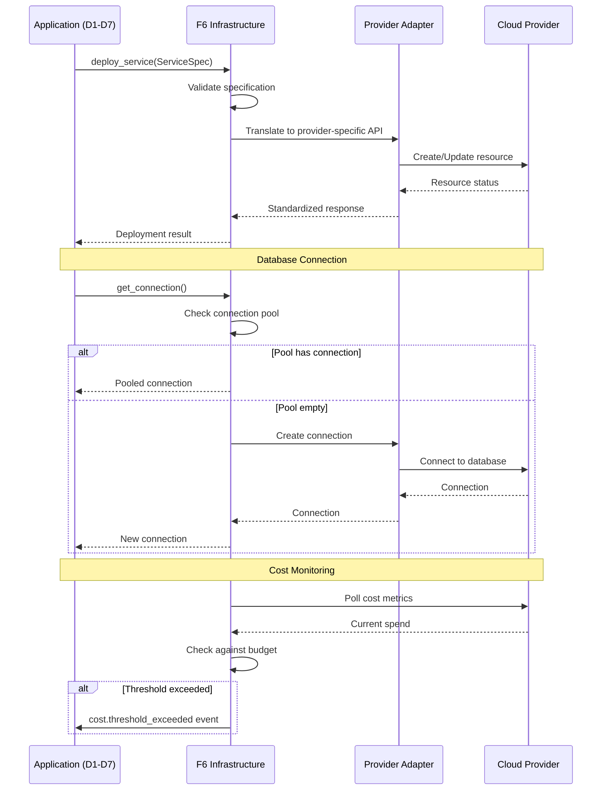

# BRD-06.1: F6 Infrastructure - Core

> **Navigation**: [Index](BRD-06.0_index.md) | [Next: Requirements](BRD-06.2_requirements.md)
> **Parent**: BRD-06 | **Section**: 1 of 3

---

## 0. Document Control

| Item | Details |
|------|---------|
| **Project Name** | AI Cost Monitoring Platform v4.2 - F6 Infrastructure Module |
| **Document Version** | 1.0 |
| **Date** | 2026-01-14 |
| **Document Owner** | Chief Architect |
| **Prepared By** | Antigravity AI |
| **Status** | Draft |
| **MVP Target Launch** | Phase 1 |
| **PRD-Ready Score** | 92/100 (Target: >=90/100) |

### Executive Summary (MVP)

The F6 Infrastructure Module provides cloud-agnostic infrastructure abstraction for the AI Cost Monitoring Platform. It manages compute services (Cloud Run, ECS, Container Apps), database services (PostgreSQL with HA, pgvector, connection pooling), AI services (LLM gateway with ensemble voting and fallback), messaging (Pub/Sub event-driven architecture), storage (object storage and secret management), networking (VPC, load balancing, DNS, WAF), and cost management (budget controls, alerts, optimization) through provider adapters. This foundation module enables seamless multi-cloud deployment while maintaining domain-agnostic design with zero business logic coupling.

### Document Revision History

| Version | Date | Author | Changes Made | Approver |
|---------|------|--------|--------------|----------|
| 1.0 | 2026-01-14 | Antigravity AI | Initial BRD creation from F6 Spec and Gap Analysis | |

---

## 1. Introduction

### 1.1 Purpose

This Business Requirements Document (BRD) defines the business requirements for the F6 Infrastructure Module. The F6 Infrastructure Module provides cloud-agnostic infrastructure abstraction enabling seamless multi-cloud deployment through standardized provider adapters for compute, database, AI, messaging, storage, networking, and cost management services.

@ref: [F6 Infrastructure Technical Specification](../../00_REF/foundation/F6_Infrastructure_Technical_Specification.md#1-executive-summary)

### 1.2 Document Scope

This document covers:
- Compute services abstraction (Cloud Run, ECS, Container Apps)
- Database services with HA and connection pooling
- AI services gateway with LLM ensemble and fallback
- Messaging services for event-driven architecture
- Storage services including object storage and secret management
- Networking with VPC, load balancing, and security
- Cost management with budget controls and optimization
- Gap remediation for enterprise deployment readiness

**Out of Scope**:
- Domain-specific business logic (cloud_accounts, cost_analytics)
- Application-level service definitions (injected by domain layers)
- UI implementation details

### 1.3 Intended Audience

- Platform administrators (infrastructure configuration, cost monitoring)
- DevOps engineers (deployment, cloud resource management)
- Security/Compliance officers (network isolation, audit)
- Development teams (API integration, service deployment)

### 1.4 Document Conventions

- **Must/Shall**: P1 critical requirements
- **Should**: P2 important requirements
- **Future**: P3 post-MVP enhancements

---

## 2. Business Objectives

### 2.1 MVP Hypothesis

**If** we implement a domain-agnostic infrastructure foundation module with cloud-agnostic abstractions, provider adapters, and cost management capabilities, **then** we will:
1. Enable seamless deployment across GCP, AWS, and Azure without application code changes
2. Reduce infrastructure management overhead through unified APIs
3. Achieve cost predictability through budget controls and optimization features

**Validation Questions**:
- Can developers deploy services without cloud-specific SDK knowledge?
- Can infrastructure costs be monitored and controlled within budget thresholds?
- Can the platform fail over to alternative cloud providers within 5 minutes?

---

### 2.2 Business Problem Statement

**Current State**: Platform lacks unified infrastructure abstraction, leading to cloud-specific code in application layers, manual cost tracking, and no multi-region or zero-downtime deployment capabilities.

**Impact**:
- Cloud vendor lock-in through direct SDK usage in application code
- Unpredictable infrastructure costs without budget controls
- Service downtime during deployments without blue-green capability
- Single region deployment creates availability risk

**Desired State**: Unified infrastructure foundation module providing cloud-agnostic abstractions, automated cost management, and enterprise deployment patterns.

---

### 2.3 MVP Business Goals

| Goal ID | Goal Statement | Success Indicator | Priority |
|---------|----------------|-------------------|----------|
| BRD.06.23.01 | Establish cloud-agnostic infrastructure abstraction for platform portability | 0 direct cloud SDK calls in application code | P1 |
| BRD.06.23.02 | Address identified infrastructure gaps for enterprise deployment readiness | 6/6 F6 gaps remediated | P1 |
| BRD.06.23.03 | Implement cost management with budget controls and alerting | Budget alerts triggered before overspend | P1 |

---

### BRD.06.23.01: Cloud-Agnostic Infrastructure

**Objective**: Implement cloud-agnostic infrastructure abstraction enabling deployment across GCP, AWS, and Azure without application code changes.

**Business Driver**: Multi-cloud portability reduces vendor lock-in risk and enables deployment flexibility based on cost, compliance, or performance requirements.

@ref: [F6 SS2](../../00_REF/foundation/F6_Infrastructure_Technical_Specification.md#2-architecture-overview)

---

### BRD.06.23.02: Enterprise Infrastructure Compliance

**Objective**: Address identified infrastructure gaps to meet enterprise-grade platform requirements.

**Business Driver**: Current implementation lacks multi-region deployment, blue-green releases, and advanced cost analytics required for production enterprise deployments.

@ref: [GAP_Foundation_Module_Gap_Analysis SS7.2](../../00_REF/foundation/GAP_Foundation_Module_Gap_Analysis.md#72-identified-gaps)

---

### BRD.06.23.03: Cost Management Foundation

**Objective**: Implement cost management with budget controls, threshold alerts, and optimization recommendations.

**Business Driver**: Cloud cost unpredictability threatens budget compliance; proactive cost management prevents overspend and enables informed resource decisions.

@ref: [F6 SS9](../../00_REF/foundation/F6_Infrastructure_Technical_Specification.md#9-cost-management)

---

### 2.4 MVP Success Metrics

| Objective ID | Objective Statement | Success Metric | MVP Target | Measurement Period |
|--------------|---------------------|----------------|------------|-------------------|
| BRD.06.23.01 | Cloud-Agnostic Abstraction | Direct cloud SDK calls in application code | 0 calls | Continuous |
| BRD.06.23.02 | Enterprise Compliance | Gap requirements implemented | 6/6 addressed | MVP + Phase 2 |
| BRD.06.23.03 | Cost Management | Budget alert accuracy | 100% triggered before threshold | 90 days post-launch |

---

### 2.5 Expected Benefits (MVP Scope)

**Quantifiable Benefits**:

| Benefit ID | Benefit Statement | Baseline | Target | Measurement |
|------------|-------------------|----------|--------|-------------|
| BRD.06.25.01 | Reduce cloud migration effort | Weeks (full rewrite) | Days (adapter swap) | Migration time tracking |
| BRD.06.25.02 | Enterprise deployment readiness | 0/6 gaps addressed | 6/6 addressed | Gap remediation tracking |
| BRD.06.25.03 | Cost predictability | Reactive (bill surprise) | Proactive (alerts before overspend) | Budget alert accuracy |

**Qualitative Benefits**:
- Consistent infrastructure patterns across all platform components
- Reduced infrastructure complexity for development teams
- Foundation for multi-region and hybrid cloud deployment
- Domain-agnostic design enabling platform reuse

---

## 3. Project Scope

### 3.1 MVP Scope Statement

The F6 Infrastructure Module provides compute, database, AI, messaging, storage, networking, and cost management as a domain-agnostic foundation layer consumed by all domain layers (D1-D7) and foundation modules (F1-F5, F7).

### 3.2 MVP Core Features (In-Scope)

**P1 - Must Have for MVP Launch**:
1. Compute services abstraction (Cloud Run primary, AWS/Azure adapters)
2. Database services with PostgreSQL HA and connection pooling
3. AI services gateway with LLM ensemble and auto-fallback
4. Messaging services with Pub/Sub event-driven architecture
5. Storage services with object storage and secret management
6. Networking with VPC, load balancing, and WAF
7. Cost management with budget controls and alerts
8. Multi-Region Deployment capability (GAP-F6-01)
9. Blue-Green Deployments for zero-downtime releases (GAP-F6-05)

**P2 - Should Have**:
1. FinOps Dashboard with advanced cost analytics (GAP-F6-03)

**P3 - Future**:
1. Hybrid Cloud on-premises integration (GAP-F6-02)
2. Terraform Export for IaC configuration (GAP-F6-04)
3. Database Sharding for horizontal scaling (GAP-F6-06)

### 3.3 Explicitly Out-of-Scope for MVP

- Domain-specific resource definitions (injected by domain layers D1-D7)
- Application-specific scaling policies (defined by consuming services)
- Mobile app infrastructure patterns
- Enterprise private cloud integration (v1.3.0 roadmap)

### 3.4 MVP Workflow

The following diagram illustrates the core infrastructure abstraction flow for the F6 Infrastructure Module:

**Workflow Summary**:
1. **Service Deployment**: Applications request infrastructure through F6 abstraction layer
2. **Provider Translation**: F6 translates requests to cloud-specific APIs via adapters
3. **Connection Pooling**: Database connections managed with pooling and health checks
4. **Cost Monitoring**: Continuous cost tracking with threshold-based alerting

### 3.5 Technology Stack

| Component | Technology | Reference |
|-----------|------------|-----------|
| Primary Cloud | GCP (Cloud Run, Cloud SQL, Vertex AI) | ADR-00 |
| Secondary Clouds | AWS (ECS, RDS, Bedrock), Azure (Container Apps, Azure SQL) | F6 SS3.3 |
| Database | PostgreSQL 16 with pgvector | F6 SS4 |
| AI Gateway | Vertex AI Model Garden | F6 SS5 |
| Messaging | Cloud Pub/Sub | F6 SS6 |
| Storage | Cloud Storage, Secret Manager | F6 SS7 |
| Networking | VPC, Cloud Load Balancing, Cloud Armor | F6 SS8 |

---

## 4. Stakeholders

### Decision Makers

| Role | Responsibility | Key Decisions |
|------|----------------|---------------|
| **Executive Sponsor** | Final approval authority for F6 scope | Cloud provider selection, budget limits, multi-cloud strategy |
| **Product Owner** | Feature prioritization for infrastructure capabilities | Service tier selection, scaling policies, cost thresholds |
| **Technical Lead** | Architecture decisions for F6 implementation | Multi-cloud strategy, provider adapter design, database architecture |

### Key Contributors

| Role | Involvement | Domain Focus |
|------|-------------|--------------|
| **Platform Administrator** | Configure infrastructure resources, monitor costs | Budget alerts, resource quotas, scaling policies |
| **DevOps Engineer** | Deploy services, manage cloud resources, CI/CD pipelines | Infrastructure automation, deployment patterns, monitoring |
| **Security/Compliance Officer** | Audit access, validate network isolation, review encryption | VPC policies, encryption standards, compliance reporting |
| **Development Team** | Integrate F6 APIs, implement service abstractions | API contracts, provider adapters, domain layer integration |

---

## 5. User Stories

### 5.1 Primary User Stories (MVP Essential)

| Story ID | User Role | Action | Business Value | Priority |
|----------|-----------|--------|----------------|----------|
| BRD.06.09.01 | Developer | Deploy service to Cloud Run | Consistent deployment without cloud-specific code | P1 |
| BRD.06.09.02 | Developer | Get database connection with pooling | Reliable database access with connection management | P1 |
| BRD.06.09.03 | Developer | Access AI models via unified gateway | LLM ensemble with automatic fallback | P1 |
| BRD.06.09.04 | Service | Publish events to message queue | Async communication between services | P1 |
| BRD.06.09.05 | Developer | Store and retrieve secrets | Secure credential management | P1 |
| BRD.06.09.06 | Admin | View current infrastructure costs | Budget monitoring and forecasting | P1 |
| BRD.06.09.07 | Admin | Receive cost threshold alerts | Prevent budget overruns | P2 |
| BRD.06.09.08 | Developer | Scale service instances | Respond to demand changes | P1 |
| BRD.06.09.09 | Developer | Upload files to object storage | Durable file storage with lifecycle management | P2 |
| BRD.06.09.10 | Admin | Configure network security rules | VPC isolation and firewall management | P1 |

@ref: [F6 SS3-SS9](../../00_REF/foundation/F6_Infrastructure_Technical_Specification.md#3-compute-services)

### 5.2 User Story Summary

- **Total MVP User Stories**: 10 (P1: 8, P2: 2)
- **Future Phase Stories**: FinOps dashboard, Terraform export, hybrid cloud integration

---

> **Navigation**: [Index](BRD-06.0_index.md) | [Next: Requirements](BRD-06.2_requirements.md)
