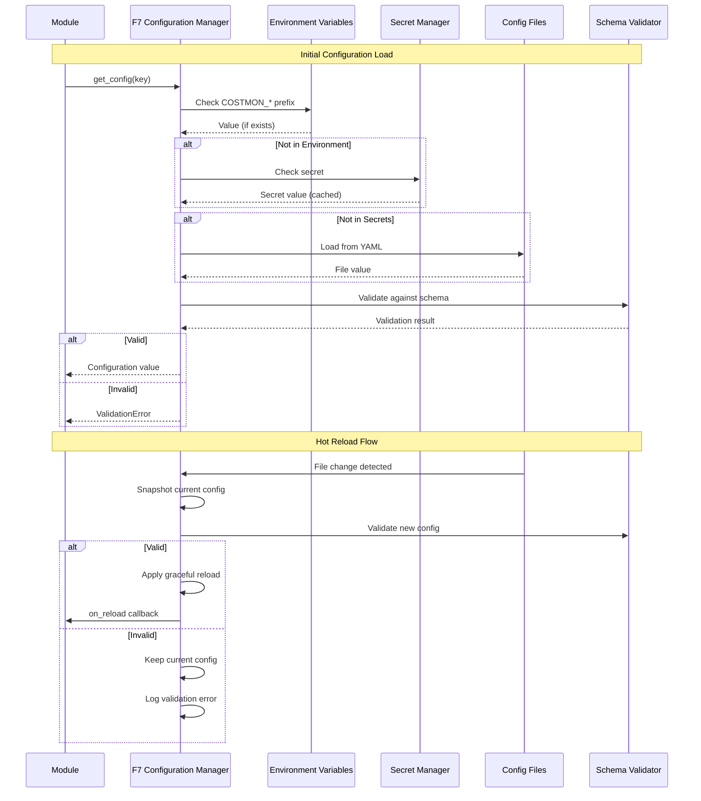

# BRD-07: F7 Configuration Manager

> **Module Type**: Foundation (Domain-Agnostic)
> **Portability**: This BRD defines generic configuration management capabilities reusable across any platform requiring centralized config loading, validation, hot-reload, and feature flags.

---

## 0. Document Control

| Item | Details |
|------|---------|
| **Project Name** | AI Cost Monitoring Platform v4.2 - F7 Configuration Manager Module |
| **Document Version** | 1.0 |
| **Date** | 2026-01-14 |
| **Document Owner** | Chief Architect |
| **Prepared By** | Antigravity AI |
| **Status** | Draft |
| **MVP Target Launch** | Phase 1 |
| **PRD-Ready Score** | 92/100 (Target: >=90/100) |

### Executive Summary (MVP)

The F7 Configuration Manager Module provides centralized configuration management for the AI Cost Monitoring Platform. It implements multi-source configuration loading (environment variables, secrets, files, defaults), YAML schema validation with type coercion, hot-reload without service restarts, feature flags with targeting policies, AI-powered configuration optimization, and version control with rollback capabilities. This foundation module is domain-agnostic and serves as the single source of truth for all configuration consumed by Foundation (F1-F6) and Domain (D1-D7) modules.

### Document Revision History

| Version | Date | Author | Changes Made | Approver |
|---------|------|--------|--------------|----------|
| 1.0 | 2026-01-14 | Antigravity AI | Initial BRD creation from F7 Spec and Gap Analysis | |

---

## 1. Introduction

### 1.1 Purpose

This Business Requirements Document (BRD) defines the business requirements for the F7 Configuration Manager Module. The F7 Configuration Manager handles all configuration loading, validation, hot-reload, feature flags, and version control for the platform using a schema-first approach with fail-safe defaults.

@ref: [F7 Configuration Manager Technical Specification](../00_REF/foundation/F7_Config_Manager_Technical_Specification.md#1-executive-summary)

### 1.2 Document Scope

This document covers:
- Multi-source configuration loading with priority ordering
- YAML schema validation with type coercion
- Hot-reload policies for zero-downtime updates
- Feature flags with percentage, user list, and attribute targeting
- AI-powered configuration optimization and drift detection
- Version control with snapshots and rollback

**Out of Scope**:
- Domain-specific configuration schemas (injected by domain layers)
- UI for configuration management (covered by D2 Adaptive UI)
- Secret generation or rotation logic (handled by F6 Infrastructure)

### 1.3 Intended Audience

- Platform administrators (configuration management)
- DevOps engineers (deployment, secret management)
- Security/Compliance officers (audit, encryption)
- Development teams (API integration)

### 1.4 Document Conventions

- **Must/Shall**: P1 critical requirements
- **Should**: P2 important requirements
- **Future**: P3 post-MVP enhancements

---

## 2. Business Objectives

### 2.1 MVP Hypothesis

**If** we implement a domain-agnostic configuration management foundation module with multi-source loading, schema validation, hot-reload, and feature flags, **then** we will:
1. Enable zero-downtime configuration changes across all platform modules
2. Reduce configuration-related incidents through schema validation and testing
3. Support progressive feature rollouts without deployment cycles

**Validation Questions**:
- Can administrators update configurations without service restarts?
- Can feature flags be targeted to specific users or user segments?
- Can configuration changes be rolled back within 30 seconds?

---

### 2.2 Business Problem Statement

**Current State**: Platform modules require restarts for configuration changes, lack centralized schema validation, and have no standardized feature flag system.

**Impact**:
- Service disruptions during configuration updates
- Configuration errors reaching production due to lack of validation
- All-or-nothing feature releases without gradual rollout capability

**Desired State**: Unified configuration management providing hot-reload, schema validation, feature flags, and version control across all platform modules.

---

### 2.3 MVP Business Goals

| Goal ID | Goal Statement | Success Indicator | Priority |
|---------|----------------|-------------------|----------|
| BRD.07.23.01 | Establish centralized configuration management as platform foundation | 100% modules consume config via F7 | P1 |
| BRD.07.23.02 | Address identified Config Manager gaps for enterprise deployment readiness | 6/6 F7 gaps remediated | P1 |
| BRD.07.23.03 | Maintain portable, domain-agnostic design enabling platform reuse | 0 domain-specific code lines in F7 | P1 |

---

### BRD.07.23.01: Centralized Configuration Management

**Objective**: Implement centralized configuration management where all modules consume configuration through F7 interfaces.

**Business Driver**: Consistent configuration handling across all Foundation and Domain modules reduces operational complexity and enables uniform hot-reload, validation, and auditing.

@ref: [F7 Section 1](../00_REF/foundation/F7_Config_Manager_Technical_Specification.md#1-executive-summary)

---

### BRD.07.23.02: Enterprise Config Manager Compliance

**Objective**: Address identified Config Manager gaps to meet enterprise-grade platform requirements.

**Business Driver**: Current implementation lacks config testing framework, drift detection, and schema registry capabilities required for enterprise deployments.

@ref: [GAP_Foundation_Module_Gap_Analysis Section 8.2](../00_REF/foundation/GAP_Foundation_Module_Gap_Analysis.md#82-identified-gaps)

---

### BRD.07.23.03: Portable Foundation Module

**Objective**: Maintain domain-agnostic design allowing F7 Configuration Manager to be reused across different platform deployments.

**Business Driver**: Foundation modules must have zero knowledge of business logic to enable portability and reduce coupling.

---

### 2.4 MVP Success Metrics

| Objective ID | Objective Statement | Success Metric | MVP Target | Measurement Period |
|--------------|---------------------|----------------|------------|-------------------|
| BRD.07.23.01 | Centralized Config | Modules using F7 | 100% | 90 days post-launch |
| BRD.07.23.02 | Enterprise Compliance | Gap requirements implemented | 6/6 addressed | MVP + Phase 2 |
| BRD.07.23.03 | Portability | Domain-specific code in F7 | 0 lines | Continuous |

---

### 2.5 Expected Benefits (MVP Scope)

**Quantifiable Benefits**:

| Benefit ID | Benefit Statement | Baseline | Target | Measurement |
|------------|-------------------|----------|--------|-------------|
| BRD.07.25.01 | Reduce configuration change downtime | Minutes (restart) | <5 seconds | Hot-reload completion time |
| BRD.07.25.02 | Enterprise compliance readiness | 0/6 gaps addressed | 6/6 addressed | Gap remediation tracking |
| BRD.07.25.03 | Configuration validation coverage | Manual review | 100% schema-validated | Validation pass rate |

**Qualitative Benefits**:
- Consistent configuration patterns across all platform modules
- Reduced configuration-related incidents through validation
- Foundation for progressive feature rollouts and A/B testing
- Domain-agnostic design enabling platform reuse

---

## 3. Project Scope

### 3.1 MVP Scope Statement

The F7 Configuration Manager Module provides configuration loading, validation, hot-reload, feature flags, and version control as a domain-agnostic foundation layer consumed by all Foundation (F1-F6) and Domain (D1-D7) modules.

### 3.2 MVP Core Features (In-Scope)

**P1 - Must Have for MVP Launch**:
1. Multi-source configuration loading (environment, secrets, files, defaults)
2. YAML schema validation with type coercion
3. Hot-reload with graceful strategy
4. Feature flags with percentage and attribute targeting
5. Configuration encryption for sensitive values
6. Version control with snapshots and rollback
7. Config Testing Framework (GAP-F7-03)

**P2 - Should Have**:
1. External Flag Service Integration (GAP-F7-01)
2. Config Drift Detection (GAP-F7-02)
3. Schema Registry (GAP-F7-06)

**P3 - Future**:
1. Staged Rollouts for Config (GAP-F7-04)
2. Config API Gateway (GAP-F7-05)

### 3.3 Explicitly Out-of-Scope for MVP

- Domain-specific schemas (injected by domain layers D1-D7)
- Configuration UI (covered by D2 Adaptive UI)
- Secret generation and rotation (handled by F6 Infrastructure)
- Enterprise LDAP/AD integration (v1.3.0 roadmap)

### 3.4 MVP Workflow

The following diagram illustrates the core configuration loading and hot-reload flow for the F7 Configuration Manager Module:



**Workflow Summary**:
1. **Priority Resolution**: Environment variables > Secrets > Files > Defaults
2. **Validation**: All configuration validated against YAML schema before use
3. **Hot Reload**: File changes trigger graceful reload with validation

### 3.5 Technology Stack

| Component | Technology | Reference |
|-----------|------------|-----------|
| Schema Format | YAML | F7 Section 4 |
| Secret Backend | GCP Secret Manager | F7 Section 3.4 |
| Encryption | AES-256-GCM | F7 Section 9 |
| Feature Flag Backend | PostgreSQL | F7 Section 6.1 |
| AI Model | Gemini 1.5 Pro | F7 Section 7.2 |
| File Watching | inotify/fsevents | F7 Section 5.4 |

---

## 4. Stakeholders

### Decision Makers

| Role | Responsibility | Key Decisions |
|------|----------------|---------------|
| **Executive Sponsor** | Final approval authority for F7 scope | Config architecture investment, compliance requirements |
| **Product Owner** | Feature prioritization for config capabilities | Hot-reload scope, feature flag design |
| **Technical Lead** | Architecture decisions for F7 implementation | Schema validation patterns, encryption strategy |

### Key Contributors

| Role | Involvement | Domain Focus |
|------|-------------|--------------|
| **Platform Administrator** | Configure system settings, manage feature flags | Rollout policies, environment configs |
| **DevOps Engineer** | Deploy module, manage secrets, monitor health | Secret Manager integration, config file management |
| **Security/Compliance Officer** | Audit sensitive configs, validate encryption | Encryption patterns, audit logging |
| **Development Team** | Integrate F7 APIs, consume configurations | API contracts, hot-reload callbacks |

---

## 5. User Stories

### 5.1 Primary User Stories (MVP Essential)

| Story ID | User Role | Action | Business Value | Priority |
|----------|-----------|--------|----------------|----------|
| BRD.07.09.01 | Service | Load configuration from multiple sources | Environment-aware config without code changes | P1 |
| BRD.07.09.02 | Service | Validate configuration against schema | Prevent invalid configs from breaking services | P1 |
| BRD.07.09.03 | Admin | Update configuration without restart | Zero-downtime config changes in production | P1 |
| BRD.07.09.04 | Admin | Enable feature flag for subset of users | Progressive rollout of new features | P1 |
| BRD.07.09.05 | Service | Access encrypted secrets securely | Protect sensitive values from exposure | P1 |
| BRD.07.09.06 | Admin | Rollback to previous configuration | Recover from bad config deployment | P1 |
| BRD.07.09.07 | Developer | Receive config change notification | React to config updates programmatically | P2 |
| BRD.07.09.08 | Admin | View configuration diff between snapshots | Audit configuration changes over time | P2 |
| BRD.07.09.09 | Admin | Test configuration before deployment | Validate configs in staging environment | P2 |
| BRD.07.09.10 | Service | Get AI-powered config recommendations | Optimize configuration for performance | P3 |

@ref: [F7 Sections 3-8](../00_REF/foundation/F7_Config_Manager_Technical_Specification.md#3-configuration-sources)

### 5.2 User Story Summary

- **Total MVP User Stories**: 10 (P1: 6, P2: 3, P3: 1)
- **Future Phase Stories**: External flag service integration, staged rollouts

---

## 6. Functional Requirements

### 6.1 MVP Requirements Overview

**Priority Definitions**:
- **P1 (Must Have)**: Essential for MVP launch
- **P2 (Should Have)**: Important, implement post-MVP
- **P3 (Future)**: Based on user feedback

---

### BRD.07.01.01: Multi-Source Configuration Loading

**Business Capability**: Load configuration from multiple sources with deterministic priority ordering.

@ref: [F7 Section 3](../00_REF/foundation/F7_Config_Manager_Technical_Specification.md#3-configuration-sources)

**Business Requirements**:
- Environment variables with COSTMON_ prefix as highest priority
- GCP Secret Manager integration for sensitive values
- YAML configuration files with environment-specific overrides
- Built-in defaults as fallback for all configuration values

**Business Rules**:
- Priority order: Environment (1) > Secrets (2) > Files (3) > Defaults (4)
- Environment variable transform: COSTMON_DB_HOST becomes db.host
- Secret cache TTL: 300 seconds
- Deep merge strategy for configuration files

**Business Acceptance Criteria**:

| Criteria ID | Criterion | MVP Target |
|-------------|-----------|------------|
| BRD.07.06.01 | Config lookup latency | <1ms |
| BRD.07.06.02 | Secret retrieval success rate | >=99.9% |

**Complexity**: 3/5 (Multi-source integration with priority resolution, caching strategy, and environment-specific handling)

**Related Requirements**:
- Platform BRDs: BRD-06 (F6 Infrastructure - GCP Secret Manager, PostgreSQL)
- Feature BRDs: N/A (Foundation module)

**Priority**: P1

---

### BRD.07.01.02: Schema Validation

**Business Capability**: Validate all configuration against YAML schemas with automatic type coercion.

@ref: [F7 Section 4](../00_REF/foundation/F7_Config_Manager_Technical_Specification.md#4-schema-validation)

**Business Requirements**:
- Type checking against expected data types
- Required field enforcement
- Pattern matching for string validation
- Range validation for numeric values
- Type coercion for common patterns (*_port, *_enabled, *_timeout_*)

**Validation Modes**:

| Mode | Behavior | Use Case |
|------|----------|----------|
| Strict | Fail on unknown keys | Production |
| Permissive | Warn on unknown keys | Development |
| Dry-Run | Validate without applying | Pre-deployment |

**Business Acceptance Criteria**:

| Criteria ID | Criterion | MVP Target |
|-------------|-----------|------------|
| BRD.07.06.03 | Validation latency | <100ms |
| BRD.07.06.04 | Type coercion accuracy | 100% |

**Complexity**: 3/5 (YAML schema parsing with type coercion rules and multiple validation modes)

**Related Requirements**:
- Platform BRDs: BRD-03 (F3 Observability - validation error logging)
- Feature BRDs: N/A (Foundation module)

**Priority**: P1

---

### BRD.07.01.03: Hot Reload

**Business Capability**: Apply configuration changes without service restarts using graceful reload policies.

@ref: [F7 Section 5](../00_REF/foundation/F7_Config_Manager_Technical_Specification.md#5-hot-reload)

**Business Requirements**:
- Graceful reload with connection draining (default)
- Immediate reload for non-critical configs
- Scheduled reload for maintenance windows
- Excluded keys requiring restart (database.connection_string, infrastructure.provider)

**Graceful Reload Process**:

| Step | Duration | Description |
|------|----------|-------------|
| 1 | 0s | Validate new configuration |
| 2 | 0-5s | Stop accepting new requests |
| 3 | 0-30s | Drain in-flight requests |
| 4 | <1s | Apply new configuration |
| 5 | 0s | Resume accepting requests |

**Business Acceptance Criteria**:

| Criteria ID | Criterion | MVP Target |
|-------------|-----------|------------|
| BRD.07.06.05 | Full reload completion | <5 seconds |
| BRD.07.06.06 | Zero request drops during reload | 100% |

**Complexity**: 4/5 (Connection draining, callback management, and handling excluded keys require careful coordination)

**Related Requirements**:
- Platform BRDs: BRD-05 (F5 Self-Ops - reload playbooks), BRD-03 (F3 Observability - reload events)
- Feature BRDs: N/A (Foundation module)

**Priority**: P1

---

### BRD.07.01.04: Feature Flags

**Business Capability**: Control feature availability using targeted rollout policies.

@ref: [F7 Section 6](../00_REF/foundation/F7_Config_Manager_Technical_Specification.md#6-feature-flags)

**Business Requirements**:
- Percentage-based rollouts (random sample of users)
- User list targeting (specific user IDs)
- Attribute matching (trust_level, workspace_id, environment)
- Default-to-false on evaluation errors

**Targeting Attributes**:

| Attribute | Description |
|-----------|-------------|
| user_id | Individual user targeting |
| workspace_id | Workspace-level targeting |
| trust_level | Permission-based targeting |
| environment | paper/live/admin zone |

**Business Acceptance Criteria**:

| Criteria ID | Criterion | MVP Target |
|-------------|-----------|------------|
| BRD.07.06.07 | Flag evaluation latency | <5ms |
| BRD.07.06.08 | Targeting accuracy | 100% |

**Complexity**: 3/5 (Multiple targeting policies with attribute resolution and caching)

**Related Requirements**:
- Platform BRDs: BRD-01 (F1 IAM - trust_level, user_id), BRD-06 (F6 Infrastructure - PostgreSQL backend)
- Feature BRDs: N/A (Foundation module)

**Priority**: P1

---

### BRD.07.01.05: AI Optimization

**Business Capability**: Provide AI-powered configuration analysis, recommendations, and natural language to YAML generation.

@ref: [F7 Section 7](../00_REF/foundation/F7_Config_Manager_Technical_Specification.md#7-ai-powered-features)

**Business Requirements**:
- Natural language to YAML schema generation
- Cross-reference validation for config consistency
- Security checks for insecure configurations
- Impact analysis for proposed changes
- Optimization suggestions for performance tuning

**AI Capabilities**:

| Capability | Description |
|------------|-------------|
| NL to YAML | Convert natural language to valid YAML config |
| Cross-Ref Validation | Detect inconsistent references |
| Security Checks | Identify insecure configurations |
| Impact Analysis | Predict effect of config changes |
| Optimization | Performance tuning recommendations |

**Business Acceptance Criteria**:

| Criteria ID | Criterion | MVP Target |
|-------------|-----------|------------|
| BRD.07.06.09 | NL to YAML accuracy | >=90% valid output |
| BRD.07.06.10 | Security check coverage | 100% sensitive patterns |

**Complexity**: 4/5 (LLM integration with prompt engineering, validation of generated output, and security analysis)

**Related Requirements**:
- Platform BRDs: BRD-06 (F6 Infrastructure - Vertex AI, Gemini 1.5 Pro)
- Feature BRDs: N/A (Foundation module)

**Priority**: P2

---

### BRD.07.01.06: Version Control

**Business Capability**: Maintain configuration history with snapshots, rollback, and change audit.

@ref: [F7 Section 8](../00_REF/foundation/F7_Config_Manager_Technical_Specification.md#8-version-control)

**Business Requirements**:
- Automatic snapshots before every reload
- Manual snapshot creation on demand
- Point-in-time rollback to any snapshot
- Selective rollback of specific keys
- Change audit with timestamp, user_id, old/new values

**Snapshot Configuration**:

| Setting | Value |
|---------|-------|
| Retention | 30 days / 100 snapshots |
| Auto-Snapshot | Before every reload |
| Diff View | Compare any two snapshots |

**Business Acceptance Criteria**:

| Criteria ID | Criterion | MVP Target |
|-------------|-----------|------------|
| BRD.07.06.11 | Rollback completion time | <30 seconds |
| BRD.07.06.12 | Snapshot retention | 30 days minimum |

**Complexity**: 3/5 (Snapshot storage, diff generation, and selective rollback require careful state management)

**Related Requirements**:
- Platform BRDs: BRD-06 (F6 Infrastructure - PostgreSQL snapshot storage)
- Feature BRDs: N/A (Foundation module)

**Priority**: P1

---

### BRD.07.01.07: External Flag Service Integration

**Business Capability**: Integrate with external feature flag services (LaunchDarkly, Split) for enterprise environments.

@ref: [GAP-F7-01: External Flag Service](../00_REF/foundation/GAP_Foundation_Module_Gap_Analysis.md#82-identified-gaps)

**Business Requirements**:
- Adapter pattern for external flag services
- LaunchDarkly and Split connector support
- Fallback to internal flag system on external service failure
- Unified API regardless of backend

**Business Acceptance Criteria**:

| Criteria ID | Criterion | MVP Target |
|-------------|-----------|------------|
| BRD.07.06.13 | External service latency | <50ms |
| BRD.07.06.14 | Fallback on failure | 100% automatic |

**Complexity**: 3/5 (External API integration with adapter pattern and fallback logic)

**Related Requirements**:
- Platform BRDs: BRD-06 (F6 Infrastructure - external API connectivity)
- Feature BRDs: N/A (Foundation module)

**Priority**: P2

---

### BRD.07.01.08: Config Drift Detection

**Business Capability**: Detect and alert on configuration drift between environments and running state.

@ref: [GAP-F7-02: Config Drift Detection](../00_REF/foundation/GAP_Foundation_Module_Gap_Analysis.md#82-identified-gaps)

**Business Requirements**:
- File vs running configuration comparison on reload
- Environment vs Secret Manager comparison hourly
- Cross-environment drift detection daily
- Alert on detected drift via F3 Observability

**Drift Detection Schedule**:

| Check | Frequency |
|-------|-----------|
| File vs Running | On reload |
| Env vs Secret Manager | Hourly |
| Cross-Environment | Daily |

**Business Acceptance Criteria**:

| Criteria ID | Criterion | MVP Target |
|-------------|-----------|------------|
| BRD.07.06.15 | Drift detection latency | <1 minute |
| BRD.07.06.16 | Alert delivery on drift | <5 minutes |

**Complexity**: 3/5 (Scheduled comparisons with state management and alerting integration)

**Related Requirements**:
- Platform BRDs: BRD-03 (F3 Observability - drift alerts), BRD-05 (F5 Self-Ops - drift remediation)
- Feature BRDs: N/A (Foundation module)

**Priority**: P2

---

### BRD.07.01.09: Config Testing Framework

**Business Capability**: Validate configuration changes before deployment in staging or dry-run mode.

@ref: [GAP-F7-03: Config Testing](../00_REF/foundation/GAP_Foundation_Module_Gap_Analysis.md#82-identified-gaps)

**Business Requirements**:
- Dry-run validation without applying changes
- Staging environment config testing
- Dependency validation (ensure referenced configs exist)
- Integration test hooks for config changes

**Business Acceptance Criteria**:

| Criteria ID | Criterion | MVP Target |
|-------------|-----------|------------|
| BRD.07.06.17 | Dry-run validation accuracy | 100% |
| BRD.07.06.18 | Staging test coverage | >=90% of configs |

**Complexity**: 3/5 (Dry-run mode implementation with dependency checking and test integration)

**Related Requirements**:
- Platform BRDs: BRD-03 (F3 Observability - test result logging)
- Feature BRDs: N/A (Foundation module)

**Priority**: P1 (Gap remediation)

---

### BRD.07.01.10: Staged Rollouts for Config

**Business Capability**: Progressive configuration changes across percentage of instances or users.

@ref: [GAP-F7-04: Staged Rollouts](../00_REF/foundation/GAP_Foundation_Module_Gap_Analysis.md#82-identified-gaps)

**Business Requirements**:
- Percentage-based config rollout (10%, 25%, 50%, 100%)
- Instance-level targeting for gradual deployment
- Automatic rollback on error rate threshold
- Manual promotion between stages

**Business Acceptance Criteria**:

| Criteria ID | Criterion | MVP Target |
|-------------|-----------|------------|
| BRD.07.06.19 | Staged rollout accuracy | >=98% |
| BRD.07.06.20 | Auto-rollback trigger time | <30 seconds |

**Complexity**: 4/5 (Percentage distribution with instance coordination and error monitoring)

**Related Requirements**:
- Platform BRDs: BRD-03 (F3 Observability - rollout metrics), BRD-05 (F5 Self-Ops - auto-rollback)
- Feature BRDs: N/A (Foundation module)

**Priority**: P3

---

### BRD.07.01.11: Config API Gateway

**Business Capability**: Centralized API for all configuration access with rate limiting and audit logging.

@ref: [GAP-F7-05: Config API Gateway](../00_REF/foundation/GAP_Foundation_Module_Gap_Analysis.md#82-identified-gaps)

**Business Requirements**:
- RESTful API for configuration CRUD operations
- Rate limiting per client/endpoint
- Authentication via F1 IAM
- Complete audit logging for all API calls

**Business Acceptance Criteria**:

| Criteria ID | Criterion | MVP Target |
|-------------|-----------|------------|
| BRD.07.06.21 | API response time | <50ms |
| BRD.07.06.22 | Rate limit enforcement | 100% |

**Complexity**: 3/5 (API design with rate limiting, auth integration, and audit logging)

**Related Requirements**:
- Platform BRDs: BRD-01 (F1 IAM - API authentication), BRD-04 (F4 SecOps - rate limiting)
- Feature BRDs: N/A (Foundation module)

**Priority**: P3

---

### BRD.07.01.12: Schema Registry

**Business Capability**: Central repository for versioned configuration schemas with evolution support.

@ref: [GAP-F7-06: Schema Registry](../00_REF/foundation/GAP_Foundation_Module_Gap_Analysis.md#82-identified-gaps)

**Business Requirements**:
- Versioned schema storage with semantic versioning
- Backward compatibility checking
- Schema migration support
- Cross-module schema dependency tracking

**Business Acceptance Criteria**:

| Criteria ID | Criterion | MVP Target |
|-------------|-----------|------------|
| BRD.07.06.23 | Schema lookup latency | <10ms |
| BRD.07.06.24 | Compatibility check accuracy | 100% |

**Complexity**: 4/5 (Schema versioning with compatibility checking and migration support)

**Related Requirements**:
- Platform BRDs: BRD-06 (F6 Infrastructure - PostgreSQL schema storage)
- Feature BRDs: N/A (Foundation module)

**Priority**: P2

---

## 7. Quality Attributes

### BRD.07.02.01: Security (Encryption by Default)

**Requirement**: Implement automatic encryption for sensitive configuration values.

@ref: [F7 Section 9](../00_REF/foundation/F7_Config_Manager_Technical_Specification.md#9-encryption)

**Measures**:
- AES-256-GCM encryption for sensitive values
- Automatic encryption for patterns: *.password, *.secret, *.api_key, *.private_key, *.token
- Key rotation every 90 days via GCP Secret Manager
- Sensitive values redacted in logs

**Priority**: P1

---

### BRD.07.02.02: Performance

**Requirement**: Configuration operations must complete within latency targets.

| Operation | Target Latency |
|-----------|---------------|
| Config lookup | <1ms |
| Flag evaluation | <5ms |
| Full reload | <5 seconds |
| Validation | <100ms |

**Priority**: P1

---

### BRD.07.02.03: Reliability

**Requirement**: Configuration services must maintain high availability with fail-safe behavior.

| Metric | Target |
|--------|--------|
| Config service uptime | 99.9% |
| Secret retrieval success | 99.9% |
| Recovery time (RTO) | <5 minutes |

**Fallback Behavior**:
- File unreadable: Use last known good configuration
- Secret unavailable: Use cached value (300s TTL)
- Validation failed: Keep current configuration, log error

**Priority**: P1

---

### BRD.07.02.04: Scalability

**Requirement**: Support concurrent configuration access without degradation.

| Metric | Target |
|--------|--------|
| Concurrent config lookups | 10,000/sec |
| Feature flag evaluations | 10,000/sec |
| Active watchers | 1,000 |

**Priority**: P2

---

### 7.2 Architecture Decision Requirements

#### 7.2.1 Infrastructure

##### BRD.07.10.01: Configuration Storage Backend

**Status**: [X] Selected

**Business Driver**: Persistent configuration storage with high availability

**Recommended Selection**: PostgreSQL for feature flags and snapshots, YAML files for static config

**PRD Requirements**: Connection pooling, backup strategy, replication configuration

---

#### 7.2.2 Data Architecture

##### BRD.07.10.02: Schema Storage Strategy

**Status**: [ ] Pending

**Business Driver**: Versioned schema storage with evolution support

**Options**: PostgreSQL tables, Git-based storage, dedicated schema registry service

**PRD Requirements**: Schema versioning format, migration procedures, compatibility checking

---

#### 7.2.3 Integration

##### BRD.07.10.03: Secret Manager Integration

**Status**: [X] Selected

**Business Driver**: Secure storage for sensitive configuration values

**Recommended Selection**: GCP Secret Manager with 300-second cache TTL

**PRD Requirements**: Cache invalidation strategy, rotation handling, fallback behavior

---

#### 7.2.4 Security

##### BRD.07.10.04: Encryption Strategy

**Status**: [X] Selected

**Business Driver**: Protect sensitive configuration values at rest

**Recommended Selection**: AES-256-GCM with GCP Secret Manager for key management

**PRD Requirements**: Key rotation schedule (90 days), encrypted key patterns, audit logging

---

##### BRD.07.10.05: Configuration Access Control

**Status**: [ ] Pending

**Business Driver**: Restrict configuration access based on role and trust level

**Options**: F1 IAM integration, dedicated config ACLs, namespace-based isolation

**PRD Requirements**: Access control model, audit trail, permission inheritance

---

#### 7.2.5 Observability

##### BRD.07.10.06: Configuration Audit Strategy

**Status**: [X] Selected

**Business Driver**: Track all configuration changes for compliance and debugging

**Recommended Selection**: F3 Observability integration with structured event logging

**PRD Requirements**: Event schema, retention policy, alerting thresholds

---

#### 7.2.6 AI/ML

##### BRD.07.10.07: AI Model Selection

**Status**: [X] Selected

**Business Driver**: Accurate NL-to-YAML generation and configuration optimization

**Recommended Selection**: Gemini 1.5 Pro via Vertex AI

**PRD Requirements**: Prompt templates, output validation, fallback behavior

---

#### 7.2.7 Technology Selection

##### BRD.07.10.08: File Watching Implementation

**Status**: [X] Selected

**Business Driver**: Detect configuration file changes for hot-reload

**Recommended Selection**: inotify (Linux) / fsevents (macOS) with 5-second interval and 2-second debounce

**PRD Requirements**: Watch interval configuration, debounce settings, retry on failure

---

## 8. Business Constraints and Assumptions

### 8.1 MVP Business Constraints

| ID | Constraint Category | Description | Impact |
|----|---------------------|-------------|--------|
| BRD.07.03.01 | Platform | GCP as primary cloud provider | Secret Manager, Vertex AI dependency |
| BRD.07.03.02 | Technology | PostgreSQL for persistent storage | Feature flags and snapshots backend |
| BRD.07.03.03 | Format | YAML as primary configuration format | Schema validation complexity |

### 8.2 MVP Assumptions

| ID | Assumption | Validation Method | Impact if False |
|----|------------|-------------------|-----------------|
| BRD.07.04.01 | GCP Secret Manager availability meets 99.9% SLA | Monitor Secret Manager status | Enable cached fallback |
| BRD.07.04.02 | Configuration files are accessible at startup | Health check on boot | Fail startup with clear error |
| BRD.07.04.03 | Modules can handle hot-reload callbacks | Integration testing | Require restart for some modules |

---

## 9. Acceptance Criteria

### 9.1 MVP Launch Criteria

**Must-Have Criteria**:
1. [ ] All P1 functional requirements (BRD.07.01.01-06, BRD.07.01.09) implemented
2. [ ] Schema validation enforced for all configuration (100% coverage)
3. [ ] Hot-reload operational with graceful strategy (<5s completion)
4. [ ] Feature flags functional with percentage and attribute targeting
5. [ ] Encryption enabled for all sensitive patterns
6. [ ] Config Testing Framework operational (GAP-F7-03)

**Should-Have Criteria**:
1. [ ] External Flag Service adapter implemented (GAP-F7-01)
2. [ ] Drift Detection operational (GAP-F7-02)
3. [ ] Schema Registry implemented (GAP-F7-06)

---

## 10. Business Risk Management

| Risk ID | Risk Description | Likelihood | Impact | Mitigation Strategy | Owner |
|---------|------------------|------------|--------|---------------------|-------|
| BRD.07.07.01 | Secret Manager unavailability | Low | High | Cached fallback with 300s TTL | DevOps |
| BRD.07.07.02 | Invalid configuration reaches production | Medium | Critical | Schema validation in strict mode, config testing framework | QA |
| BRD.07.07.03 | Hot-reload causes service disruption | Low | High | Graceful drain strategy, rollback capability | Architect |
| BRD.07.07.04 | Feature flag misconfiguration | Medium | Medium | Targeting validation, dry-run mode | Product |
| BRD.07.07.05 | Configuration drift between environments | Medium | Medium | Drift detection service with alerting | DevOps |

---

## 11. Implementation Approach

### 11.1 MVP Development Phases

**Phase 1 - Core Configuration**:
- Multi-source loading (environment, secrets, files, defaults)
- YAML schema validation
- Type coercion rules

**Phase 2 - Hot Reload & Flags**:
- Hot-reload with graceful strategy
- Feature flag system with targeting
- Callback notification system

**Phase 3 - Version Control & Security**:
- Snapshot and rollback system
- Encryption for sensitive values
- Change audit logging

**Phase 4 - Gap Remediation**:
- Config Testing Framework (GAP-F7-03)
- Drift Detection (GAP-F7-02)
- Schema Registry (GAP-F7-06)

---

## 12. Cost-Benefit Analysis

**Development Costs**:
- GCP Secret Manager: ~$0.03/10K access operations
- PostgreSQL (feature flags, snapshots): Included in F6 infrastructure
- Vertex AI (AI features): ~$0.00025/1K characters (Gemini 1.5 Pro)

**Risk Reduction**:
- Schema validation: Prevents configuration errors reaching production
- Hot-reload: Eliminates downtime for configuration changes
- Config testing: Catches issues before deployment
- Version control: Enables rapid rollback from bad configurations

---

## 13. Traceability

### 13.1 Upstream Dependencies

| Upstream Artifact | Reference | Relevance |
|-------------------|-----------|-----------|
| F7 Config Manager Technical Specification | [F7 Spec](../00_REF/foundation/F7_Config_Manager_Technical_Specification.md) | Technical requirements source |
| Gap Analysis | [GAP Analysis](../00_REF/foundation/GAP_Foundation_Module_Gap_Analysis.md) | 6 F7 gaps identified |

### 13.2 Downstream Artifacts

- **PRD-07**: Product Requirements Document (Layer 2)
- **ADR**: Schema Storage Strategy, Configuration Access Control
- **BDD**: Configuration loading, validation, hot-reload test scenarios

### 13.3 Cross-BRD References

| Related BRD | Dependency Type | Data Exchange |
|-------------|-----------------|---------------|
| BRD-01 (F1 IAM) | Downstream | F7 provides: oauth2_clients config, zone permissions, trust level policies, session timeout settings |
| BRD-02 (F2 Session) | Downstream | F7 provides: session timeout settings, memory layer limits, workspace config, cache TTL values |
| BRD-03 (F3 Observability) | Downstream | F7 provides: logging levels, metrics endpoints, tracing sample rates, alert thresholds |
| BRD-04 (F4 SecOps) | Downstream | F7 provides: security policy config, rate limits, compliance rules, threat detection thresholds |
| BRD-05 (F5 Self-Ops) | Upstream | F5 provides: remediation playbook triggers for config changes, health check thresholds |
| BRD-06 (F6 Infrastructure) | Upstream | F6 provides: PostgreSQL (feature flags, snapshots), Secret Manager (secrets backend), file storage paths |

### 13.4 Requirements Traceability Matrix

| BRD Requirement | Source Spec Reference | GAP Reference | PRD Target | Priority |
|-----------------|----------------------|---------------|------------|----------|
| BRD.07.01.01 | F7 Section 3 | - | PRD-07.01.01 | P1 |
| BRD.07.01.02 | F7 Section 4 | - | PRD-07.01.02 | P1 |
| BRD.07.01.03 | F7 Section 5 | - | PRD-07.01.03 | P1 |
| BRD.07.01.04 | F7 Section 6 | - | PRD-07.01.04 | P1 |
| BRD.07.01.05 | F7 Section 7 | - | PRD-07.01.05 | P2 |
| BRD.07.01.06 | F7 Section 8 | - | PRD-07.01.06 | P1 |
| BRD.07.01.07 | - | GAP-F7-01 | PRD-07.01.07 | P2 |
| BRD.07.01.08 | - | GAP-F7-02 | PRD-07.01.08 | P2 |
| BRD.07.01.09 | - | GAP-F7-03 | PRD-07.01.09 | P1 |
| BRD.07.01.10 | - | GAP-F7-04 | PRD-07.01.10 | P3 |
| BRD.07.01.11 | - | GAP-F7-05 | PRD-07.01.11 | P3 |
| BRD.07.01.12 | - | GAP-F7-06 | PRD-07.01.12 | P2 |

---

## 14. Glossary

**Master Glossary**: See [BRD-00_GLOSSARY.md](../BRD-00_GLOSSARY.md)

### F7-Specific Terms

| Term | Definition | Context |
|------|------------|---------|
| Hot Reload | Apply configuration changes without service restart | BRD.07.01.03 |
| Feature Flag | Boolean or value-based feature toggle with targeting | BRD.07.01.04 |
| Config Drift | Difference between intended and actual configuration state | BRD.07.01.08 |
| Type Coercion | Automatic conversion of string values to expected types | BRD.07.01.02 |
| Schema Registry | Central repository for versioned configuration schemas | BRD.07.01.12 |
| Graceful Reload | Hot-reload strategy with connection draining | Section 6 |
| Snapshot | Point-in-time capture of configuration state | BRD.07.01.06 |

---

## 15. Appendices

### Appendix A: Configuration Source Priority

```
Priority Resolution (highest to lowest):
1. Environment Variables (COSTMON_*)
   └── Example: COSTMON_DB_HOST=prod.db.example.com
2. GCP Secret Manager
   └── Example: costmon-db-password
3. Configuration Files (YAML)
   └── ./config/production.yaml
   └── ./config/base.yaml (merged)
4. Built-in Defaults
   └── Hardcoded fallback values
```

### Appendix B: Schema Validation Example

```yaml
# Schema Definition
database:
  type: object
  required: [host, port, name]
  properties:
    host:
      type: string
      pattern: "^[a-zA-Z0-9.-]+$"
    port:
      type: integer
      minimum: 1
      maximum: 65535
    name:
      type: string
      minLength: 1
      maxLength: 64

# Configuration (validated against schema)
database:
  host: postgres.example.com
  port: 5432
  name: costmon_db
```

### Appendix C: Feature Flag Definition Example

```yaml
feature_flags:
  new_monitoring_ui:
    enabled: true
    description: "New cost monitoring interface"
    targeting:
      strategy: percentage
      percentage: 25
      attributes:
        trust_level: [3, 4]  # Only producers and admins
    fallback: false
```

### Appendix D: Hot Reload Events

| Event | Trigger | Payload |
|-------|---------|---------|
| config.loaded | Initial load | Full config snapshot |
| config.reloaded | Hot-reload complete | Changed keys list |
| config.key_changed | Specific key update | key, old_value, new_value |
| config.validation_failed | Schema error | Error details, rejected config |

---

*BRD-07: F7 Configuration Manager - AI Cost Monitoring Platform v4.2 - January 2026*
