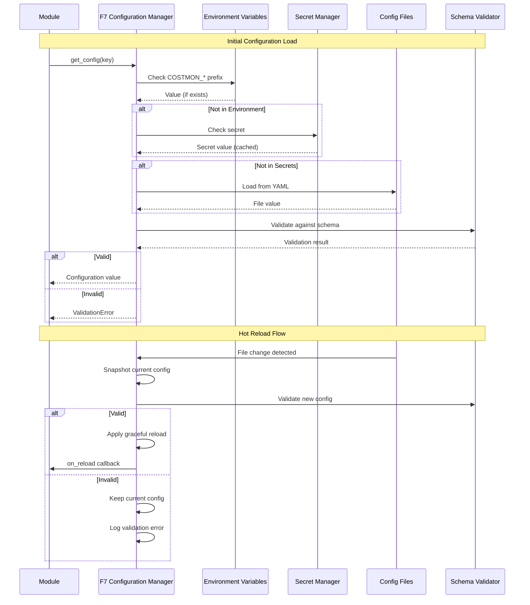

# BRD-07.1: F7 Configuration Manager - Core

> **Navigation**: [Index](BRD-07.0_index.md) | [Next: Requirements](BRD-07.2_requirements.md)
> **Parent**: BRD-07 | **Section**: 1 of 3

---

## 0. Document Control

| Item | Details |
|------|---------|
| **Project Name** | AI Cost Monitoring Platform v4.2 - F7 Configuration Manager Module |
| **Document Version** | 1.0 |
| **Date** | 2026-01-14T00:00:00 |
| **Document Owner** | Chief Architect |
| **Prepared By** | Antigravity AI |
| **Status** | Draft |
| **MVP Target Launch** | Phase 1 |
| **PRD-Ready Score** | 92/100 (Target: >=90/100) |

### Executive Summary (MVP)

The F7 Configuration Manager Module provides centralized configuration management for the AI Cost Monitoring Platform. It implements multi-source configuration loading (environment variables, secrets, files, defaults), YAML schema validation with type coercion, hot-reload without service restarts, feature flags with targeting policies, AI-powered configuration optimization, and version control with rollback capabilities. This foundation module is domain-agnostic and serves as the single source of truth for all configuration consumed by Foundation (F1-F6) and Domain (D1-D7) modules.

### Document Revision History

| Version | Date | Author | Changes Made | Approver |
|---------|------|--------|--------------|----------|
| 1.0 | 2026-01-14T00:00:00 | Antigravity AI | Initial BRD creation from F7 Spec and Gap Analysis | |

---

## 1. Introduction

### 1.1 Purpose

This Business Requirements Document (BRD) defines the business requirements for the F7 Configuration Manager Module. The F7 Configuration Manager handles all configuration loading, validation, hot-reload, feature flags, and version control for the platform using a schema-first approach with fail-safe defaults.

@ref: [F7 Configuration Manager Technical Specification](../../00_REF/foundation/F7_Config_Manager_Technical_Specification.md#1-executive-summary)

### 1.2 Document Scope

This document covers:
- Multi-source configuration loading with priority ordering
- YAML schema validation with type coercion
- Hot-reload policies for zero-downtime updates
- Feature flags with percentage, user list, and attribute targeting
- AI-powered configuration optimization and drift detection
- Version control with snapshots and rollback

**Out of Scope**:
- Domain-specific configuration schemas (injected by domain layers)
- UI for configuration management (covered by D2 Adaptive UI)
- Secret generation or rotation logic (handled by F6 Infrastructure)

### 1.3 Intended Audience

- Platform administrators (configuration management)
- DevOps engineers (deployment, secret management)
- Security/Compliance officers (audit, encryption)
- Development teams (API integration)

### 1.4 Document Conventions

- **Must/Shall**: P1 critical requirements
- **Should**: P2 important requirements
- **Future**: P3 post-MVP enhancements

---

## 2. Business Objectives

### 2.1 MVP Hypothesis

**If** we implement a domain-agnostic configuration management foundation module with multi-source loading, schema validation, hot-reload, and feature flags, **then** we will:
1. Enable zero-downtime configuration changes across all platform modules
2. Reduce configuration-related incidents through schema validation and testing
3. Support progressive feature rollouts without deployment cycles

**Validation Questions**:
- Can administrators update configurations without service restarts?
- Can feature flags be targeted to specific users or user segments?
- Can configuration changes be rolled back within 30 seconds?

---

### 2.2 Business Problem Statement

**Current State**: Platform modules require restarts for configuration changes, lack centralized schema validation, and have no standardized feature flag system.

**Impact**:
- Service disruptions during configuration updates
- Configuration errors reaching production due to lack of validation
- All-or-nothing feature releases without gradual rollout capability

**Desired State**: Unified configuration management providing hot-reload, schema validation, feature flags, and version control across all platform modules.

---

### 2.3 MVP Business Goals

| Goal ID | Goal Statement | Success Indicator | Priority |
|---------|----------------|-------------------|----------|
| BRD.07.23.01 | Establish centralized configuration management as platform foundation | 100% modules consume config via F7 | P1 |
| BRD.07.23.02 | Address identified Config Manager gaps for enterprise deployment readiness | 6/6 F7 gaps remediated | P1 |
| BRD.07.23.03 | Maintain portable, domain-agnostic design enabling platform reuse | 0 domain-specific code lines in F7 | P1 |

---

### BRD.07.23.01: Centralized Configuration Management

**Objective**: Implement centralized configuration management where all modules consume configuration through F7 interfaces.

**Business Driver**: Consistent configuration handling across all Foundation and Domain modules reduces operational complexity and enables uniform hot-reload, validation, and auditing.

@ref: [F7 Section 1](../../00_REF/foundation/F7_Config_Manager_Technical_Specification.md#1-executive-summary)

---

### BRD.07.23.02: Enterprise Config Manager Compliance

**Objective**: Address identified Config Manager gaps to meet enterprise-grade platform requirements.

**Business Driver**: Current implementation lacks config testing framework, drift detection, and schema registry capabilities required for enterprise deployments.

@ref: [GAP_Foundation_Module_Gap_Analysis Section 8.2](../../00_REF/foundation/GAP_Foundation_Module_Gap_Analysis.md#82-identified-gaps)

---

### BRD.07.23.03: Portable Foundation Module

**Objective**: Maintain domain-agnostic design allowing F7 Configuration Manager to be reused across different platform deployments.

**Business Driver**: Foundation modules must have zero knowledge of business logic to enable portability and reduce coupling.

---

### 2.4 MVP Success Metrics

| Objective ID | Objective Statement | Success Metric | MVP Target | Measurement Period |
|--------------|---------------------|----------------|------------|-------------------|
| BRD.07.23.01 | Centralized Config | Modules using F7 | 100% | 90 days post-launch |
| BRD.07.23.02 | Enterprise Compliance | Gap requirements implemented | 6/6 addressed | MVP + Phase 2 |
| BRD.07.23.03 | Portability | Domain-specific code in F7 | 0 lines | Continuous |

---

### 2.5 Expected Benefits (MVP Scope)

**Quantifiable Benefits**:

| Benefit ID | Benefit Statement | Baseline | Target | Measurement |
|------------|-------------------|----------|--------|-------------|
| BRD.07.25.01 | Reduce configuration change downtime | Minutes (restart) | <5 seconds | Hot-reload completion time |
| BRD.07.25.02 | Enterprise compliance readiness | 0/6 gaps addressed | 6/6 addressed | Gap remediation tracking |
| BRD.07.25.03 | Configuration validation coverage | Manual review | 100% schema-validated | Validation pass rate |

**Qualitative Benefits**:
- Consistent configuration patterns across all platform modules
- Reduced configuration-related incidents through validation
- Foundation for progressive feature rollouts and A/B testing
- Domain-agnostic design enabling platform reuse

---

## 3. Project Scope

### 3.1 MVP Scope Statement

The F7 Configuration Manager Module provides configuration loading, validation, hot-reload, feature flags, and version control as a domain-agnostic foundation layer consumed by all Foundation (F1-F6) and Domain (D1-D7) modules.

### 3.2 MVP Core Features (In-Scope)

**P1 - Must Have for MVP Launch**:
1. Multi-source configuration loading (environment, secrets, files, defaults)
2. YAML schema validation with type coercion
3. Hot-reload with graceful strategy
4. Feature flags with percentage and attribute targeting
5. Configuration encryption for sensitive values
6. Version control with snapshots and rollback
7. Config Testing Framework (GAP-F7-03)

**P2 - Should Have**:
1. External Flag Service Integration (GAP-F7-01)
2. Config Drift Detection (GAP-F7-02)
3. Schema Registry (GAP-F7-06)

**P3 - Future**:
1. Staged Rollouts for Config (GAP-F7-04)
2. Config API Gateway (GAP-F7-05)

### 3.3 Explicitly Out-of-Scope for MVP

- Domain-specific schemas (injected by domain layers D1-D7)
- Configuration UI (covered by D2 Adaptive UI)
- Secret generation and rotation (handled by F6 Infrastructure)
- Enterprise LDAP/AD integration (v1.3.0 roadmap)

### 3.4 MVP Workflow

The following diagram illustrates the core configuration loading and hot-reload flow for the F7 Configuration Manager Module:

**Workflow Summary**:
1. **Priority Resolution**: Environment variables > Secrets > Files > Defaults
2. **Validation**: All configuration validated against YAML schema before use
3. **Hot Reload**: File changes trigger graceful reload with validation

### 3.5 Technology Stack

| Component | Technology | Reference |
|-----------|------------|-----------|
| Schema Format | YAML | F7 Section 4 |
| Secret Backend | GCP Secret Manager | F7 Section 3.4 |
| Encryption | AES-256-GCM | F7 Section 9 |
| Feature Flag Backend | PostgreSQL | F7 Section 6.1 |
| AI Model | Gemini 1.5 Pro | F7 Section 7.2 |
| File Watching | inotify/fsevents | F7 Section 5.4 |

---

## 4. Stakeholders

### Decision Makers

| Role | Responsibility | Key Decisions |
|------|----------------|---------------|
| **Executive Sponsor** | Final approval authority for F7 scope | Config architecture investment, compliance requirements |
| **Product Owner** | Feature prioritization for config capabilities | Hot-reload scope, feature flag design |
| **Technical Lead** | Architecture decisions for F7 implementation | Schema validation patterns, encryption strategy |

### Key Contributors

| Role | Involvement | Domain Focus |
|------|-------------|--------------|
| **Platform Administrator** | Configure system settings, manage feature flags | Rollout policies, environment configs |
| **DevOps Engineer** | Deploy module, manage secrets, monitor health | Secret Manager integration, config file management |
| **Security/Compliance Officer** | Audit sensitive configs, validate encryption | Encryption patterns, audit logging |
| **Development Team** | Integrate F7 APIs, consume configurations | API contracts, hot-reload callbacks |

---

## 5. User Stories

### 5.1 Primary User Stories (MVP Essential)

| Story ID | User Role | Action | Business Value | Priority |
|----------|-----------|--------|----------------|----------|
| BRD.07.09.01 | Service | Load configuration from multiple sources | Environment-aware config without code changes | P1 |
| BRD.07.09.02 | Service | Validate configuration against schema | Prevent invalid configs from breaking services | P1 |
| BRD.07.09.03 | Admin | Update configuration without restart | Zero-downtime config changes in production | P1 |
| BRD.07.09.04 | Admin | Enable feature flag for subset of users | Progressive rollout of new features | P1 |
| BRD.07.09.05 | Service | Access encrypted secrets securely | Protect sensitive values from exposure | P1 |
| BRD.07.09.06 | Admin | Rollback to previous configuration | Recover from bad config deployment | P1 |
| BRD.07.09.07 | Developer | Receive config change notification | React to config updates programmatically | P2 |
| BRD.07.09.08 | Admin | View configuration diff between snapshots | Audit configuration changes over time | P2 |
| BRD.07.09.09 | Admin | Test configuration before deployment | Validate configs in staging environment | P2 |
| BRD.07.09.10 | Service | Get AI-powered config recommendations | Optimize configuration for performance | P3 |

@ref: [F7 Sections 3-8](../../00_REF/foundation/F7_Config_Manager_Technical_Specification.md#3-configuration-sources)

### 5.2 User Story Summary

- **Total MVP User Stories**: 10 (P1: 6, P2: 3, P3: 1)
- **Future Phase Stories**: External flag service integration, staged rollouts

---

> **Navigation**: [Index](BRD-07.0_index.md) | [Next: Requirements](BRD-07.2_requirements.md)
