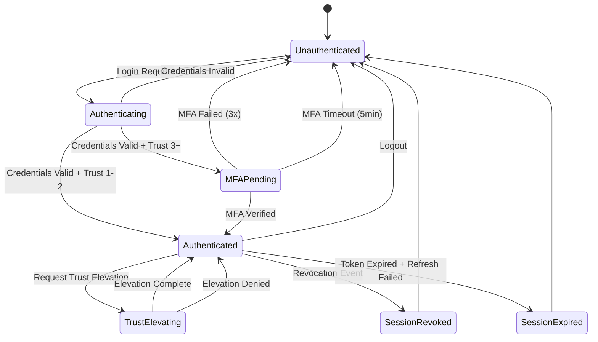

# PRD-01.17: F1 Identity & Access Management - Appendices

> **Navigation**: [Index](PRD-01.0_index.md) | [Previous: Traceability](PRD-01.16_traceability.md)
> **Parent**: PRD-01 | **Section**: 17 of 17

---

## Appendix A: Glossary

**Master Glossary Reference**: See [BRD-00_GLOSSARY.md](../../01_BRD/BRD-00_GLOSSARY.md)

### F1-Specific Terms

| Term | Definition |
|------|------------|
| 4D Matrix | ACTION × SKILL × RESOURCE × ZONE authorization model |
| Trust Level | 4-tier access hierarchy (Viewer → Operator → Producer → Admin) |
| Zone | Environment context (paper, live, admin, system) |
| SCIM | System for Cross-domain Identity Management (RFC 7643/7644) |
| TOTP | Time-based One-Time Password (RFC 6238) |
| WebAuthn | Web Authentication standard for passwordless auth |
| JWT | JSON Web Token (RFC 7519) |
| OIDC | OpenID Connect authentication protocol |
| mTLS | Mutual TLS for service-to-service authentication |

---

## Appendix B: EARS Enhancement (Timing, Boundary, State, Fallback)

### B.1 Timing Profile Matrix

| Operation | p50 | p95 | p99 | Unit | Reference |
|-----------|-----|-----|-----|------|-----------|
| Authentication (Auth0) | 50 | 80 | 100 | ms | @threshold: BRD.01.perf.auth |
| Authentication (fallback) | 30 | 60 | 80 | ms | |
| Authorization check | 3 | 8 | 10 | ms | @threshold: BRD.01.perf.authz |
| Token validation | 1 | 3 | 5 | ms | @threshold: BRD.01.perf.token |
| Token refresh | 20 | 40 | 60 | ms | |
| Session revocation | 100 | 500 | 1000 | ms | @threshold: BRD.01.perf.revoke |
| MFA verification (TOTP) | 10 | 30 | 50 | ms | |
| MFA verification (WebAuthn) | 50 | 150 | 300 | ms | |
| Profile retrieval | 20 | 40 | 50 | ms | |
| SCIM endpoint | 100 | 300 | 500 | ms | |

---

### B.2 Boundary Value Matrix

| Parameter | Min | Max | Invalid Behavior |
|-----------|-----|-----|------------------|
| Password length | 12 | 128 | Reject with error |
| Username length | 3 | 64 | Reject with error |
| Session limit per user | 1 | 3 | Force logout oldest |
| Token lifetime (access) | 5 min | 60 min | Default 30 min |
| Token lifetime (refresh) | 1 day | 30 days | Default 7 days |
| Failed login attempts | 0 | 5 | Lock account 15 min |
| MFA backup codes | 10 | 10 | Fixed count |
| TOTP code length | 6 | 6 | Fixed format |
| API key length | 32 | 64 | Default 32 |

---

### B.3 State Transition Diagram

**State Definitions**:
- **Unauthenticated**: No valid session
- **Authenticating**: Credentials being validated
- **MFAPending**: Awaiting MFA verification
- **Authenticated**: Valid session active
- **TrustElevating**: Trust level upgrade in progress
- **SessionRevoked**: Session terminated by admin
- **SessionExpired**: Session timeout reached

---

### B.4 Fallback Documentation

| Primary | Fallback | Trigger | Recovery |
|---------|----------|---------|----------|
| Auth0 OIDC | Email/Password | Auth0 unavailable >30s | Automatic failover |
| Redis session | PostgreSQL session | Redis unavailable | Degraded performance (5-10ms → 50-100ms) |
| TOTP MFA | Backup codes | TOTP device unavailable | User-initiated |
| WebAuthn | TOTP | WebAuthn unsupported | User selection |
| Secret Manager | Local encryption | SM unavailable | Local key cache (24h) |

---

## Appendix C: Future Roadmap (Post-MVP)

### C.1 Phase 2 Features (If MVP Succeeds)

| Feature | Priority | Estimated Effort | Dependency |
|---------|----------|------------------|------------|
| Device Trust Verification (GAP-F1-04) | P1 | 3-4 weeks | MDM integration |
| Time-Based Access Policies (GAP-F1-06) | P2 | 2-3 weeks | Timezone handling |
| Enterprise SAML/OIDC | P2 | 2-3 weeks | Auth0 enterprise |
| Mobile Authentication Flows | P2 | 4-6 weeks | Mobile SDK |
| Behavioral Anomaly Detection | P3 | 4-6 weeks | ML pipeline |

### C.2 Scaling Considerations

| Area | MVP Capacity | Scale Target | Approach |
|------|--------------|--------------|----------|
| Concurrent Users | 10,000 | 100,000 | Horizontal scaling, caching |
| Auth RPS | 1,000 | 10,000 | Load balancing, connection pooling |
| Token Validations/sec | 10,000 | 100,000 | Edge caching, distributed validation |
| Session Storage | 30,000 | 300,000 | Redis Cluster expansion |

---

## Appendix D: Migration to Full PRD Template

### D.1 When to Migrate

- [ ] MVP validation complete and proceeding to full product
- [ ] Feature count exceeds 20
- [ ] Need detailed user story matrices
- [ ] Require comprehensive non-functional requirements
- [ ] Enterprise stakeholder communication required

### D.2 Migration Steps

1. Copy MVP PRD to full template structure
2. Expand user stories with detailed acceptance criteria
3. Add comprehensive NFR sections
4. Include enterprise communication plan
5. Update traceability matrix
6. Archive MVP version with "superseded by PRD-01 v2.0" note

---

**Document Version**: 1.0
**Template Version**: MVP (17 sections)
**Last Updated**: 2026-02-08T00:00:00
**Generated By**: PRD Autopilot

---

*PRD-01: F1 Identity & Access Management - AI Cost Monitoring Platform v4.2*

> **Navigation**: [Index](PRD-01.0_index.md) | [Previous: Traceability](PRD-01.16_traceability.md)
