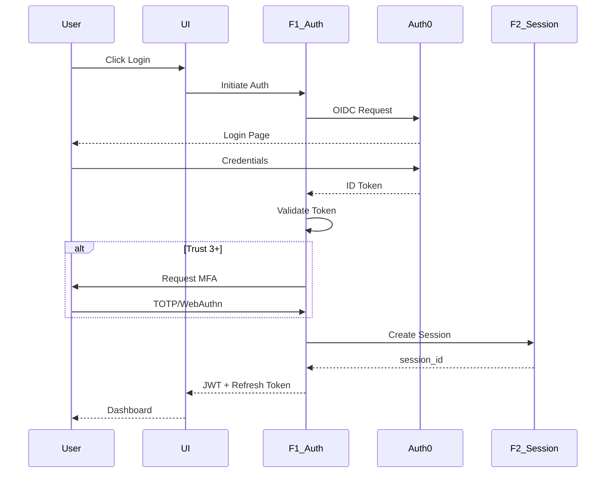

# PRD-01.7: F1 Identity & Access Management - User Stories

> **Navigation**: [Index](PRD-01.0_index.md) | [Previous: Scope & Requirements](PRD-01.6_scope_requirements.md) | [Next: Functional Requirements](PRD-01.8_functional_requirements.md)
> **Parent**: PRD-01 | **Section**: 7 of 17

---

## 7. User Stories & User Roles

**Scope Split**: PRD = roles + story summaries; EARS = detailed behaviors; BDD = executable scenarios.

@brd: BRD.01.09.01, BRD.01.09.02, BRD.01.09.03, BRD.01.09.04, BRD.01.09.05, BRD.01.09.06, BRD.01.09.07, BRD.01.09.08

---

### 7.1 Core User Stories

| ID | User Story | Priority | Acceptance Criteria |
|----|------------|----------|---------------------|
| PRD.01.09.01 | As a **User**, I want to **login via Auth0**, so that **I can securely authenticate with enterprise SSO** | P1 | Auth0 Universal Login completes in <100ms; session created on success |
| PRD.01.09.02 | As a **User**, I want to **setup MFA (TOTP/WebAuthn)**, so that **high-trust operations are protected** | P1 | MFA enrollment completes in <5 minutes; WebAuthn registration >=95% success |
| PRD.01.09.03 | As a **User**, I want to **verify my permission for an action**, so that **I know what I can access** | P1 | Authorization decision in <10ms; 4D Matrix evaluation complete |
| PRD.01.09.04 | As a **User**, I want to **elevate my trust level**, so that **I can access advanced features** | P1 | Trust elevation requires MFA; zone access updated immediately |
| PRD.01.09.05 | As a **User**, I want to **update my profile information**, so that **I have a personalized experience** | P2 | Profile update persists in <50ms; encrypted fields protected |
| PRD.01.09.06 | As a **User**, I want to **logout and terminate my session**, so that **I maintain security control** | P1 | Session terminated immediately; refresh token invalidated |
| PRD.01.09.07 | As a **Service**, I want to **authenticate via API key**, so that **machine-to-machine integration works** | P1 | API key validation in <5ms; mTLS optional for higher security |
| PRD.01.09.08 | As an **Admin**, I want to **view audit logs**, so that **I can monitor compliance and security** | P1 | Audit logs available within 5 seconds; 30-day hot storage |

---

### 7.2 User Roles

| Role | Purpose | Permissions | Trust Level |
|------|---------|-------------|-------------|
| Viewer | Read-only access for monitoring | view:* on own resources in paper zone | 1 |
| Operator | Development and testing access | view, create, update on own/workspace in paper | 2 |
| Producer | Production access for operations | All actions on paper and live zones | 3 |
| Admin | Full administrative access | All actions including admin zone | 4 |
| Service | Machine-to-machine integration | Scoped to granted skills and resources | System |

---

### 7.3 Story Summary

| Priority | Count | Notes |
|----------|-------|-------|
| P1 (Must-Have) | 7 | Required for MVP launch |
| P2 (Should-Have) | 1 | Include if time permits |
| **Total** | **8** | |

---

### 7.4 User Journey (Authentication Flow)

---

> **Navigation**: [Index](PRD-01.0_index.md) | [Previous: Scope & Requirements](PRD-01.6_scope_requirements.md) | [Next: Functional Requirements](PRD-01.8_functional_requirements.md)
