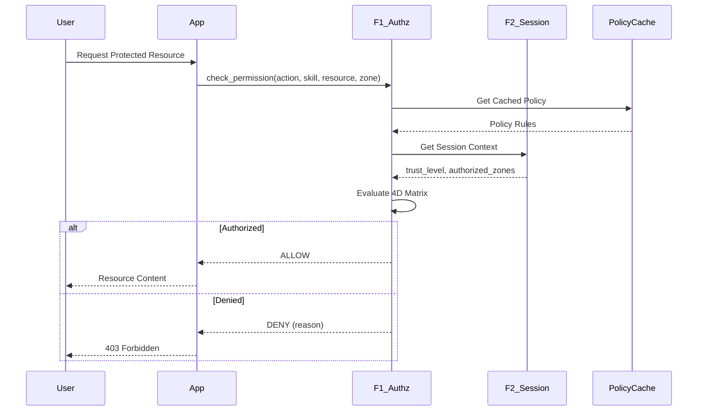

# PRD-01.8: F1 Identity & Access Management - Functional Requirements

> **Navigation**: [Index](PRD-01.0_index.md) | [Previous: User Stories](PRD-01.7_user_stories.md) | [Next: Quality Attributes](PRD-01.9_quality_attributes.md)
> **Parent**: PRD-01 | **Section**: 8 of 17

---

## 8. Functional Requirements

@brd: BRD.01.01.01, BRD.01.01.02, BRD.01.01.03, BRD.01.01.04, BRD.01.01.05, BRD.01.01.06, BRD.01.01.07, BRD.01.01.08

---

### 8.1 Core Capabilities

| ID | Capability | Success Criteria | Priority |
|----|------------|------------------|----------|
| PRD.01.01.01 | Multi-Provider Authentication | Auth0 login >=99.9% success; <100ms latency | P1 |
| PRD.01.01.02 | 4D Authorization Matrix | Authorization decision <10ms; 100% default deny | P1 |
| PRD.01.01.03 | Trust Level System | 100% trust enforcement accuracy; >=99% elevation success | P1 |
| PRD.01.01.04 | MFA Enforcement | 100% MFA adoption for Trust 3+; >=95% WebAuthn registration | P1 |
| PRD.01.01.05 | Token Management | Token validation <5ms; 100% refresh rotation success | P1 |
| PRD.01.01.06 | User Profile System | Profile retrieval <50ms; 100% AES-256-GCM encryption | P1 |
| PRD.01.01.07 | Session Revocation API | Revocation <1 second; 100% device propagation | P1 |
| PRD.01.01.08 | SCIM 2.0 Provisioning | Endpoint response <500ms; 100% sync accuracy | P2 |

---

### 8.2 PRD.01.01.01: Multi-Provider Authentication

**Product Capability**: Enable users to authenticate through multiple identity providers with Auth0 as primary.

**Product Requirements**:
- Auth0 Universal Login as primary authentication method
- Email/password fallback for environments without Auth0 connectivity
- Service authentication via mTLS and API keys
- Google OAuth 2.0 federation through Auth0

**User Experience**:
1. User clicks "Login" on application
2. System redirects to Auth0 Universal Login
3. User authenticates with preferred method
4. System validates ID token and creates session
5. User receives JWT access token

**Acceptance Criteria**:

| Criteria ID | Criterion | Target |
|-------------|-----------|--------|
| PRD.01.06.01 | Auth0 login success rate | >=99.9% |
| PRD.01.06.02 | Authentication latency (p99) | <100ms |

---

### 8.2 PRD.01.01.02: 4D Authorization Matrix

**Product Capability**: Fine-grained access control using four-dimensional evaluation.

**Dimension Definitions**:

| Dimension | Values | Description |
|-----------|--------|-------------|
| ACTION | view, create, update, delete, execute | Operation type |
| SKILL | Domain-injected (e.g., cost_analytics, agent_control) | Capability identifier |
| RESOURCE | own, workspace, all | Ownership scope |
| ZONE | paper, live, admin, system | Environment context |

**Product Requirements**:
- Authorization decision based on all four dimensions
- Default deny—all access must be explicitly granted
- Domain-injected skill definitions (F1 has no business knowledge)
- Cached policy evaluation for performance

**Acceptance Criteria**:

| Criteria ID | Criterion | Target |
|-------------|-----------|--------|
| PRD.01.06.03 | Authorization decision latency (p99) | <10ms |
| PRD.01.06.04 | Default deny enforcement | 100% |

---

### 8.3 PRD.01.01.03: Trust Level System

**Product Capability**: 4-tier trust hierarchy with progressive access rights.

**Trust Level Definitions**:

| Level | Name | Zones | MFA Required | Capabilities |
|-------|------|-------|--------------|--------------|
| 1 | Viewer | paper (read-only) | Optional | View dashboards, reports |
| 2 | Operator | paper | Optional | Create/update in paper zone |
| 3 | Producer | paper, live | Required | Full access to production |
| 4 | Admin | paper, live, admin | Required | System configuration, user management |

**Acceptance Criteria**:

| Criteria ID | Criterion | Target |
|-------------|-----------|--------|
| PRD.01.06.05 | Trust level enforcement accuracy | 100% |
| PRD.01.06.06 | Trust elevation success rate | >=99% |

---

### 8.4 PRD.01.01.07: Session Revocation API

**Product Capability**: Centralized session termination for security incident response.

**Product Requirements**:
- Bulk session termination by user ID
- Bulk session termination by device ID
- Force logout across all sessions
- Immediate token invalidation via Redis pub/sub

**API Endpoints**:

| Endpoint | Method | Description |
|----------|--------|-------------|
| `/api/v1/sessions/{user_id}/revoke` | POST | Revoke all sessions for user |
| `/api/v1/sessions/{session_id}` | DELETE | Revoke specific session |
| `/api/v1/devices/{device_id}/revoke` | POST | Revoke all sessions for device |

**Acceptance Criteria**:

| Criteria ID | Criterion | Target |
|-------------|-----------|--------|
| PRD.01.06.13 | Session revocation latency | <1 second |
| PRD.01.06.14 | Revocation propagation | 100% devices |

---

### 8.5 User Journey (Authorization Flow)

---

### 8.6 Error Handling (MVP)

| Error Scenario | User Experience | System Behavior |
|----------------|-----------------|-----------------|
| Auth0 unavailable | "Try alternate login" message | Fallback to email/password |
| Token expired | Automatic refresh attempt | Silent token rotation |
| MFA failure | Retry prompt with lockout warning | Log failure, increment counter |
| Authorization denied | Clear error message with reason | Log decision, emit event |
| Session revoked | Immediate logout with explanation | Clear all tokens, redirect to login |

---

> **Navigation**: [Index](PRD-01.0_index.md) | [Previous: User Stories](PRD-01.7_user_stories.md) | [Next: Quality Attributes](PRD-01.9_quality_attributes.md)
