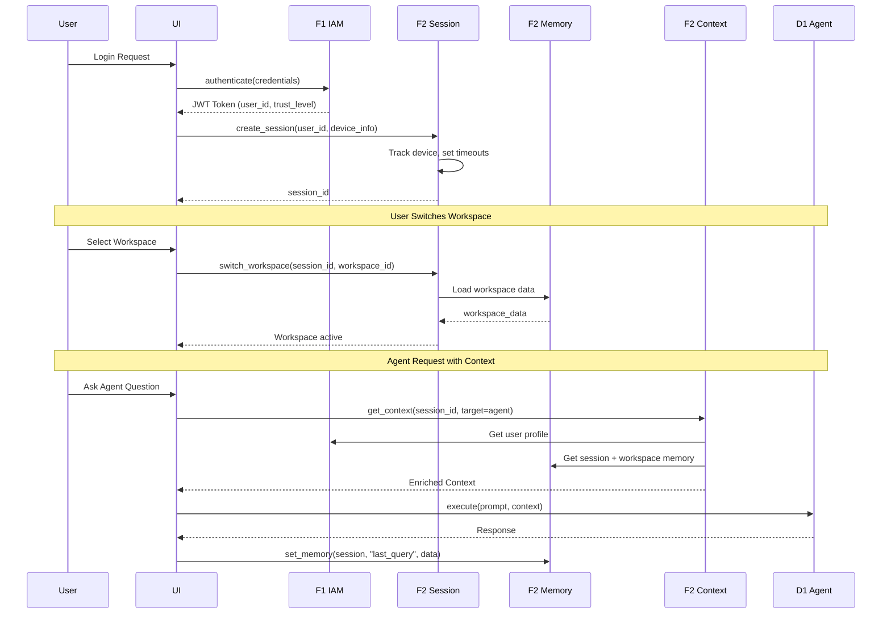
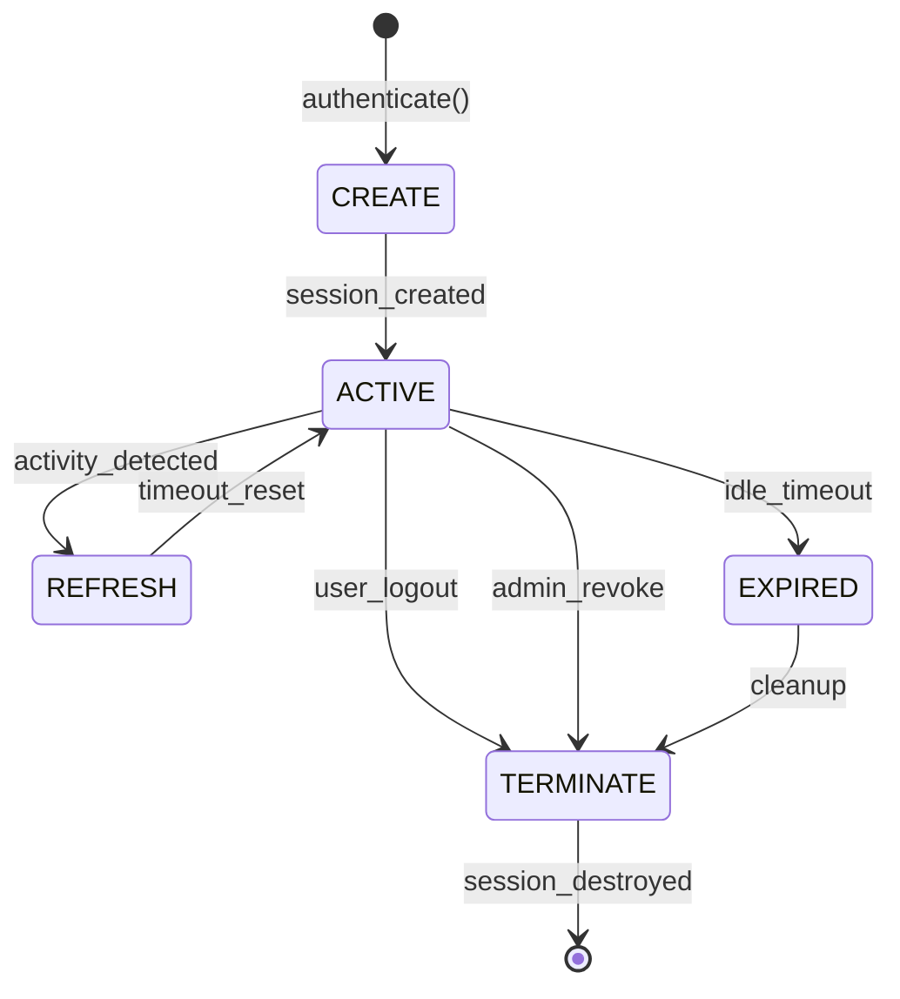

# PRD-02: F2 Session & Context Management

**Upstream guardrails**: @brd: BRD-02

**Thresholds pointer**: Define thresholds once; reuse via `@threshold:` tags.

## 1. Document Control

| Item | Details |
|------|---------|
| **Status** | Draft |
| **Version** | 1.0.0 |
| **Date Created** | 2026-02-08 |
| **Last Updated** | 2026-02-08 |
| **Author** | AI Assistant |
| **Reviewer** | Technical Lead |
| **Approver** | Chief Architect |
| **BRD Reference** | @brd: BRD.02 |
| **Priority** | High (Foundation Module) |
| **Target Release** | Phase 1 (MVP) |
| **Estimated Effort** | 8 person-weeks |
| **SYS-Ready Score** | 92/100 (Target: >=85 for MVP) |
| **EARS-Ready Score** | 90/100 (Target: >=85 for MVP) |

### 1.1 Document Revision History

| Version | Date | Author | Changes Made |
|---------|------|--------|--------------|
| 1.0.0 | 2026-02-08 | AI Assistant | Initial PRD generated from BRD-02 |

---

## 2. Executive Summary

The F2 Session & Context Management Module provides stateful session handling, multi-layer memory architecture, workspace management, and context injection for the AI Cost Monitoring Platform. This foundation module enables personalized user experiences across requests through automatic context enrichment for agents, UI components, and events.

### 2.1 MVP Hypothesis

**We believe that** platform users and AI agents **will** experience seamless context continuity across sessions **if we** implement a domain-agnostic session management module with multi-layer memory and automatic context injection.

**We will know this is true when**:
- 100% session state preserved across requests
- Context assembly latency <50ms
- 6/6 identified F2 gaps remediated

### 2.2 Timeline Overview

| Phase | Duration | Deliverables |
|-------|----------|--------------|
| Phase 1: Core Session | 2 weeks | Session lifecycle, device tracking, PostgreSQL backend |
| Phase 2: Memory System | 2 weeks | Three-tier memory, promotion API, Redis integration |
| Phase 3: Context & Workspace | 2 weeks | Context injection, workspace management, sharing |
| Phase 4: Gap Remediation | 2 weeks | Cross-session sync, templates, expiration alerts |
| **Total MVP** | **8 weeks** | Full F2 module operational |

---

## 3. Problem Statement

### 3.1 Current State

- **No centralized session state**: Session data lost on service restart without persistent backend
- **Manual workspace recreation**: Users must recreate workspace configurations each session
- **Limited agent context**: Agents lack enriched context, reducing personalization quality
- **No cross-device sync**: Session state not synchronized across user devices, leading to stale context
- **Missing enterprise features**: No Redis persistence, memory expiration alerts, or workspace templates

### 3.2 Business Impact

- Development overhead: Each domain layer implements its own context management
- User experience degradation: Loss of session state requires users to re-establish context
- Reduced personalization: AI agents cannot deliver context-aware responses without enriched context
- Competitive disadvantage: Modern platforms expect seamless stateful experiences

### 3.3 Opportunity

Unified session management module providing persistent state, hierarchical memory, automatic context assembly, and workspace collaboration as a reusable foundation layer.

---

## 4. Target Audience & User Personas

### 4.1 Primary User Personas

**Platform User** - End user of AI Cost Monitoring Platform

- **Key characteristic**: Requires stateful sessions with context persistence
- **Main pain point**: Context loss between sessions, manual workspace recreation
- **Success criteria**: Seamless session continuity, automatic context enrichment
- **Usage frequency**: Daily, multiple sessions

**AI Agent (D1)** - Agent Orchestration Layer consumer

- **Key characteristic**: Requires enriched context for personalized responses
- **Main pain point**: Lack of user profile, session memory, and workspace data
- **Success criteria**: Context assembly <50ms with 100% required fields
- **Usage frequency**: Every agent request

### 4.2 Secondary Users

| Role | Purpose | Key Needs |
|------|---------|-----------|
| Platform Administrator | Configure session policies | Timeout settings, session visibility, metrics |
| DevOps Engineer | Deploy and manage infrastructure | Health endpoints, storage migration, monitoring |
| Security/Compliance Officer | Audit session access | Session revocation, device tracking, anomaly alerts |
| Development Team | Integrate F2 APIs | Context injection, extensibility hooks |

---

## 5. Success Metrics (KPIs)

### 5.1 MVP Validation Metrics (30-Day)

| Metric | Baseline | Target | Measurement |
|--------|----------|--------|-------------|
| Session state persistence | 0% | 100% | Session survived service restart |
| Context assembly latency | N/A | <50ms | p95 timing via F3 Observability |
| Session creation success rate | N/A | >=99.9% | F3 metrics |
| Memory promotion success | N/A | 100% | API success rate |

### 5.2 Business Success Metrics (90-Day)

| Metric | Target | Decision Threshold |
|--------|--------|-------------------|
| Gap remediation | 6/6 addressed | <4/6 = Escalate |
| Domain layer integration | All D1-D7 consuming F2 | <50% = Iterate |
| Session service uptime | 99.9% | <99% = Critical |

### 5.3 Go/No-Go Decision Gate

**At MVP+90 days**, evaluate:
- **Proceed to Phase 2 (Enhancement)**: All targets met, 6/6 gaps addressed
- **Iterate**: 4-5 gaps addressed, performance targets partially met
- **Escalate**: <4 gaps addressed or critical uptime issues

---

## 6. Scope & Requirements

### 6.1 In-Scope (MVP Core Features)

| # | Feature | Priority | Description | BRD Ref |
|---|---------|----------|-------------|---------|
| 1 | Session Lifecycle Management | P1-Must | Create -> Active -> Refresh -> Expire -> Terminate | BRD.02.01.01 |
| 2 | Multi-Layer Memory System | P1-Must | Session (30min) -> Workspace (persistent) -> Profile | BRD.02.01.02 |
| 3 | Workspace Management | P1-Must | CRUD, workspace switching, sharing modes | BRD.02.01.03 |
| 4 | Context Injection System | P1-Must | Automatic context assembly for agents, UI, events | BRD.02.01.04 |
| 5 | Device Tracking | P1-Must | Fingerprint, geolocation, anomaly detection | BRD.02.01.05 |
| 6 | Event System | P1-Must | Session, memory, workspace, context events | BRD.02.01.06 |
| 7 | Storage Backends | P1-Must | Memory, PostgreSQL, Redis backends | BRD.02.01.07 |
| 8 | Redis Session Backend | P1-Must | Persistent sessions, TTL expiration (GAP-F2-01) | BRD.02.01.09 |
| 9 | Extensibility Hooks | P2-Should | Lifecycle hooks for domain layers | BRD.02.01.08 |
| 10 | Cross-Session Sync | P2-Should | Real-time sync across devices (GAP-F2-02) | BRD.02.01.10 |
| 11 | Workspace Templates | P2-Should | Pre-built configurations (GAP-F2-04) | BRD.02.01.12 |
| 12 | Memory Expiration Alerts | P2-Should | Warnings before timeout (GAP-F2-06) | BRD.02.01.14 |
| 13 | Memory Compression | P3-Future | Compress large memory blobs (GAP-F2-03) | BRD.02.01.11 |
| 14 | Workspace Versioning | P3-Future | Undo/history capability (GAP-F2-05) | BRD.02.01.13 |

### 6.2 Dependencies

| Dependency | Type | Status | Impact | Owner |
|------------|------|--------|--------|-------|
| BRD-01 (F1 IAM) | Upstream | Active | User identity for context enrichment | IAM Team |
| BRD-06 (F6 Infrastructure) | Upstream | Active | PostgreSQL, Redis storage backends | Platform Team |
| BRD-07 (F7 Config) | Upstream | Active | Session timeout settings, memory limits | Config Team |
| BRD-03 (F3 Observability) | Downstream | Active | Event emission target | Observability Team |

### 6.3 Out-of-Scope (Post-MVP)

- Domain-specific workspace schemas (injected by domain layers D1-D7)
- Workspace data validation (handled by domain layer)
- Mobile app session flows
- Vertex AI context storage (v1.2.0 roadmap)
- Memory compression (P3)
- Workspace versioning (P3)

---

## 7. User Stories & User Roles

### 7.1 Core User Stories

| ID | User Story | Priority | Acceptance Criteria | BRD Ref |
|----|------------|----------|---------------------|---------|
| PRD.02.09.01 | As a User, I want to create a session after authentication, so that I have a stateful experience across requests | P1 | Session created with device tracking, timeout set | BRD.02.09.01 |
| PRD.02.09.02 | As a User, I want to switch active workspace, so that I see context-appropriate data | P1 | Workspace switch <50ms, data loaded | BRD.02.09.02 |
| PRD.02.09.03 | As a User, I want to save analysis to workspace layer, so that insights persist across sessions | P1 | Data promoted to workspace, survives session end | BRD.02.09.03 |
| PRD.02.09.04 | As a User, I want to promote memory to profile layer, so that I retain long-term learning | P1 | Data promoted to A2A, permanent storage | BRD.02.09.04 |
| PRD.02.09.05 | As a User, I want to receive expiration warning, so that I can prevent data loss on timeout | P2 | Alert at 5min and 1min before expiration | BRD.02.09.05 |
| PRD.02.09.06 | As an Agent, I want to receive enriched context, so that I can deliver personalized responses | P1 | Context includes user, session, memory, workspace, environment | BRD.02.09.06 |
| PRD.02.09.07 | As an Admin, I want to view active sessions, so that I can monitor platform usage | P1 | Session list with device, user, timestamp | BRD.02.09.07 |
| PRD.02.09.08 | As an Admin, I want to terminate user session, so that I can respond to security incidents | P1 | Session terminated <1s, across all devices | BRD.02.09.08 |
| PRD.02.09.09 | As a User, I want to share workspace with team, so that we can collaborate on analysis | P2 | Workspace sharing modes: private, shared, public | BRD.02.09.09 |
| PRD.02.09.10 | As a Service, I want to access session via API, so that machine-to-machine context is available | P1 | Service authentication, session lookup via API | BRD.02.09.10 |

### 7.2 User Roles

| Role | Purpose | Permissions |
|------|---------|-------------|
| User | Platform end user | Create/manage own sessions, workspaces |
| Agent | D1 Agent consumer | Read context, emit events |
| Admin | Platform administrator | View all sessions, terminate sessions, configure policies |
| Service | M2M integration | API access to sessions, context |

### 7.3 Story Summary

| Priority | Count | Notes |
|----------|-------|-------|
| P1 (Must-Have) | 8 | Required for MVP launch |
| P2 (Should-Have) | 2 | Include if time permits |
| **Total** | 10 | |

---

## 8. Functional Requirements

### 8.1 Core Capabilities

| ID | Capability | Success Criteria | BRD Ref |
|----|------------|------------------|---------|
| PRD.02.01.01 | Session Lifecycle Management | Session states: Create -> Active -> Refresh -> Expire -> Terminate | BRD.02.01.01 |
| PRD.02.01.02 | Multi-Layer Memory System | 3 tiers: Session (30min, 100KB) -> Workspace (unlimited, 10MB) -> Profile (permanent) | BRD.02.01.02 |
| PRD.02.01.03 | Workspace Management | 4 workspace types, 50 max per user, 10MB limit per workspace | BRD.02.01.03 |
| PRD.02.01.04 | Context Injection | Context assembly <50ms, 100% required fields for agents, UI, events | BRD.02.01.04 |
| PRD.02.01.05 | Device Tracking | Fingerprint + geolocation, anomaly detection <100ms | BRD.02.01.05 |
| PRD.02.01.06 | Event System | Events: session.*, memory.*, workspace.*, context.* | BRD.02.01.06 |
| PRD.02.01.07 | Storage Backends | Memory (dev), PostgreSQL (prod), Redis (sessions) | BRD.02.01.07 |
| PRD.02.01.09 | Redis Session Backend | Persistent sessions, TTL expiration, failover to PostgreSQL | BRD.02.01.09 |

### 8.2 User Journey (Happy Path)



### 8.3 Error Handling (MVP)

| Error Scenario | User Experience | System Behavior |
|----------------|-----------------|-----------------|
| Session expired | "Session expired" message, redirect to login | Terminate session, clear memory, emit event |
| Redis unavailable | Transparent failover | Automatic fallback to PostgreSQL backend |
| Workspace not found | "Workspace not found" error | Return 404, log error to F3 |
| Context assembly timeout | Degraded agent response | Return partial context, emit warning event |
| Memory size exceeded | "Memory limit reached" warning | Reject write, suggest promotion to workspace |

---

## 9. Quality Attributes

### 9.1 Performance (@threshold: f2_performance)

| Metric | Target | Notes |
|--------|--------|-------|
| Session lookup | <10ms | p95 |
| Session creation | <10ms | p95 |
| Memory get/set | <5ms | p95 |
| Context assembly | <50ms | p95 |
| Workspace switch | <50ms | p95 |
| Event emission | <10ms | p95 |
| Hook execution | <10ms per hook | p95 |
| Redis operation | <5ms | p95 |

### 9.2 Security (@threshold: f2_security)

- [x] Session tokens: UUID v4, cryptographically random, hashed in storage
- [x] Memory data: Encrypted at rest
- [x] Workspace data: User-isolated, permission-based access
- [x] Device fingerprints: Not shared across users
- [ ] Device fingerprint privacy: GDPR compliance (Pending ADR)

### 9.3 Availability (@threshold: f2_availability)

| Metric | Target |
|--------|--------|
| Session service uptime | 99.9% |
| Memory service uptime | 99.9% |
| Recovery time (RTO) | <5 minutes |

### 9.4 Scalability (@threshold: f2_scalability)

| Metric | Target |
|--------|--------|
| Concurrent sessions | 30,000 |
| Session creates/sec | 500 |
| Memory operations/sec | 10,000 |

---

## 10. Architecture Requirements

### 10.1 Infrastructure (PRD.02.32.01)

**Status**: [X] Selected

**Business Driver**: Session persistence across service restarts with high-performance access

**MVP Approach**: Redis 7+ via GCP Memorystore (primary), PostgreSQL (fallback)

**Rationale**: Redis provides sub-millisecond latency for session lookups; PostgreSQL fallback ensures durability during Redis maintenance.

**Estimated Cost**: ~$50/month (Memorystore Basic tier)

@brd: BRD.02.10.01

---

### 10.2 Data Architecture (PRD.02.32.02)

**Status**: [X] Selected

**Business Driver**: Tiered storage matching data lifetime and access patterns

**MVP Approach**:
- Session Layer: Redis (ephemeral, 100KB limit, 30min TTL)
- Workspace Layer: PostgreSQL JSONB (persistent, 10MB limit)
- Profile Layer: A2A Knowledge Platform (external, unlimited)

**Rationale**: Optimizes storage costs and performance by matching data characteristics to appropriate backends.

@brd: BRD.02.10.02

---

### 10.3 Integration (PRD.02.32.03)

**Status**: [X] Selected

**Business Driver**: Session context requires user identity, permissions, and event emission

**MVP Approach**:
- F1 IAM: Synchronous API call for user profile during context assembly
- F3 Observability: Async event emission via message queue

**Rationale**: Synchronous F1 call ensures fresh permissions; async F3 emission avoids latency impact.

@brd: BRD.02.10.03, BRD.02.10.04

---

### 10.4 Security (PRD.02.32.04)

**Status**: [X] Selected (partial)

**Business Driver**: Secure session identification and device tracking privacy

**MVP Approach**:
- Session tokens: UUID v4, hashed in storage
- Token rotation policy and revocation propagation required
- Device fingerprint privacy: Pending ADR (GDPR compliance)

**Rationale**: Cryptographically random tokens prevent session hijacking; fingerprint privacy requires stakeholder decision.

@brd: BRD.02.10.05, BRD.02.10.06

---

### 10.5 Observability (PRD.02.32.05)

**Status**: [X] Selected

**Business Driver**: Monitor session health, usage patterns, and performance metrics

**MVP Approach**: Prometheus metrics exposed via F3 integration

**Rationale**: Standard observability stack; metrics feed into existing platform monitoring.

@brd: BRD.02.10.07

---

### 10.6 AI/ML (PRD.02.32.06)

**Status**: N/A

**Business Driver**: F2 Session is foundation infrastructure; AI/ML handled by D1 Agent layer

**MVP Approach**: N/A - F2 provides context to D1, which handles AI/ML capabilities

**Rationale**: Clear separation of concerns; foundation modules remain domain-agnostic.

@brd: BRD.02 Section 7.2.6

---

### 10.7 Technology Selection (PRD.02.32.07)

**Status**: [ ] Pending

**Business Driver**: Cross-device session synchronization requires real-time updates

**Options**: WebSocket, Server-Sent Events, gRPC streaming

**PRD Requirements**: Connection management, reconnection strategy, bandwidth optimization

**Rationale**: ADR required to evaluate latency, complexity, and browser support tradeoffs.

@brd: BRD.02.10.08

---

## 11. Constraints & Assumptions

### 11.1 Constraints

| ID | Category | Description | Impact |
|----|----------|-------------|--------|
| PRD.02.03.01 | Platform | Redis via GCP Memorystore | Vendor dependency, cost |
| PRD.02.03.02 | Technology | PostgreSQL for workspace storage | F6 infrastructure dependency |
| PRD.02.03.03 | Integration | F1 IAM for user identity | Upstream availability |
| PRD.02.03.04 | Resource | 8 person-weeks development | Timeline constraint |

### 11.2 Assumptions

| ID | Assumption | Risk | Validation |
|----|------------|------|------------|
| PRD.02.04.01 | Redis availability meets 99.9% SLA | Medium | Monitor Memorystore status |
| PRD.02.04.02 | F1 IAM available for context enrichment | Low | F1 health checks |
| PRD.02.04.03 | Workspace data fits within 10MB limit | Medium | Usage monitoring |
| PRD.02.04.04 | Maximum 3 concurrent sessions sufficient | Low | User feedback |

---

## 12. Risk Assessment

| Risk ID | Risk Description | Likelihood | Impact | Mitigation | Owner |
|---------|------------------|------------|--------|------------|-------|
| PRD.02.07.01 | Redis service unavailability | Low | High | PostgreSQL fallback backend | DevOps |
| PRD.02.07.02 | Session state loss during failover | Medium | High | Session replication, graceful degradation | Architect |
| PRD.02.07.03 | Memory size limits exceeded | Medium | Medium | Size monitoring, compression, archival | Platform Admin |
| PRD.02.07.04 | Context assembly latency degradation | Low | Medium | Caching, async enrichment | Technical Lead |
| PRD.02.07.05 | F1 IAM dependency failure | Low | High | Cache user profiles, graceful degradation | IAM Team |

---

## 13. Implementation Approach

### 13.1 MVP Development Phases

| Phase | Duration | Deliverables | Success Criteria |
|-------|----------|--------------|------------------|
| **Phase 1: Core Session** | 2 weeks | Session lifecycle, device tracking, PostgreSQL backend | Session CRUD functional, 99.9% success rate |
| **Phase 2: Memory System** | 2 weeks | Three-tier memory, promotion API, Redis integration | Memory ops <5ms, promotion 100% |
| **Phase 3: Context & Workspace** | 2 weeks | Context injection, workspace management, sharing | Context assembly <50ms, workspace switch <50ms |
| **Phase 4: Gap Remediation** | 2 weeks | Cross-session sync, templates, expiration alerts | GAP-F2-01/02/04/06 addressed |

### 13.2 Testing Strategy (MVP)

| Test Type | Coverage | Responsible |
|-----------|----------|-------------|
| Unit Tests | 80% minimum | Development |
| Integration Tests | Session/Memory/Context flows | Development |
| Performance Tests | Latency targets per @threshold | QA |
| Security Tests | Token handling, data isolation | Security |
| UAT | Core user stories (10) | Product/QA |

---

## 14. Acceptance Criteria

### 14.1 Business Acceptance

- [ ] All P1 functional requirements (8 stories) implemented
- [ ] Session lifecycle states fully functional
- [ ] Three-tier memory system operational with promotion
- [ ] Context injection delivering enriched context to D1 agents
- [ ] KPIs instrumented via F3 Observability

### 14.2 Technical Acceptance

- [ ] Redis backend providing persistent sessions (GAP-F2-01)
- [ ] Event emission to F3 Observability operational
- [ ] Performance targets met per Section 9.1
- [ ] Security baseline per Section 9.2 checked
- [ ] Logging/monitoring enabled

### 14.3 QA Acceptance

- [ ] All P1 test cases passed
- [ ] No critical bugs open
- [ ] Basic API documentation ready
- [ ] Runbook for session administration created

---

## 15. Budget & Resources

### 15.1 MVP Development Cost

| Category | Estimate | Notes |
|----------|----------|-------|
| Development | 8 person-weeks | Foundation module priority |
| Infrastructure (Monthly) | $50 | Redis Memorystore Basic |
| PostgreSQL | Included | F6 allocation |
| **Total MVP Cost** | **8 person-weeks + $50/month** | |

### 15.2 ROI Hypothesis

**Investment**: 8 person-weeks development + $50/month infrastructure

**Expected Return**:
- 40% reduction in domain layer development complexity
- 100% session state persistence (vs 0% currently)
- Foundation for all domain layer context consumption

**Decision Logic**: If MVP metrics met, proceed to Phase 2 enhancements (P2/P3 features).

---

## 16. Traceability

### 16.1 Upstream References

| Source | Document | Relationship |
|--------|----------|--------------|
| BRD | @brd: BRD-02 | Business requirements source |
| Technical Spec | F2 Session Technical Specification | Technical requirements source |
| Gap Analysis | GAP_Foundation_Module_Gap_Analysis | 6 F2 gaps identified |

### 16.2 Downstream Artifacts

| Artifact Type | Status | Notes |
|---------------|--------|-------|
| EARS | Pending | Create after PRD approval |
| BDD | Pending | Session lifecycle, memory promotion scenarios |
| ADR | Pending | Session Backend, Memory Architecture, Real-Time Sync |
| SYS | Pending | System requirements |

### 16.3 Traceability Tags

```markdown
@brd: BRD.02.01.01, BRD.02.01.02, BRD.02.01.03, BRD.02.01.04, BRD.02.01.05, BRD.02.01.06, BRD.02.01.07, BRD.02.01.08, BRD.02.01.09, BRD.02.01.10, BRD.02.01.11, BRD.02.01.12, BRD.02.01.13, BRD.02.01.14
@brd: BRD.02.23.01, BRD.02.23.02, BRD.02.23.03
@brd: BRD.02.10.01, BRD.02.10.02, BRD.02.10.03, BRD.02.10.04, BRD.02.10.05, BRD.02.10.06, BRD.02.10.07, BRD.02.10.08
```

### 16.4 Cross-Links (Same-Layer)

@depends: PRD-01 (F1 IAM for user identity and authentication)
@discoverability: PRD-03 (F3 Observability - event emission target); PRD-06 (F6 Infrastructure - storage backends); PRD-07 (F7 Config - session settings)

---

## 17. Glossary

| Term | Definition |
|------|------------|
| Session Layer | Ephemeral memory tier with 30-minute TTL stored in Redis |
| Workspace Layer | Persistent memory tier surviving sessions stored in PostgreSQL |
| Profile Layer | Long-term memory in A2A Knowledge Platform |
| Memory Promotion | Explicit move of data from lower to higher tier |
| Context Injection | Automatic assembly and delivery of enriched context to consumers |
| Device Fingerprint | Browser/device identification for security tracking |

**Master Glossary Reference**: See [BRD-00_GLOSSARY.md](../01_BRD/BRD-00_GLOSSARY.md)

---

## 18. Appendix A: Future Roadmap (Post-MVP)

### 18.1 Phase 2 Features (If MVP Succeeds)

| Feature | Priority | Estimated Effort | Dependency |
|---------|----------|------------------|------------|
| Memory Compression | P3 | 1 week | MVP complete |
| Workspace Versioning | P3 | 2 weeks | MVP complete |
| Vertex AI Context Storage | P3 | 2 weeks | v1.2.0 roadmap |

### 18.2 Scaling Considerations

- **Infrastructure**: Increase Redis cluster size for >30,000 concurrent sessions
- **Performance**: Add context caching layer for high-frequency agent requests
- **Features**: Multi-region session replication for global deployments

---

## 19. EARS Enhancement Appendix

### 19.1 Timing Profile Matrix (@threshold: f2_timing)

| Operation | p50 | p95 | p99 | Unit |
|-----------|-----|-----|-----|------|
| Session lookup | 5ms | 10ms | 15ms | ms |
| Session creation | 5ms | 10ms | 20ms | ms |
| Memory get | 2ms | 5ms | 8ms | ms |
| Memory set | 2ms | 5ms | 8ms | ms |
| Context assembly | 25ms | 50ms | 75ms | ms |
| Workspace switch | 25ms | 50ms | 75ms | ms |
| Event emission | 5ms | 10ms | 15ms | ms |

### 19.2 Boundary Value Matrix

| Parameter | Min | Max | Default | Unit |
|-----------|-----|-----|---------|------|
| Session idle timeout | 5 | 1440 | 30 | minutes |
| Session absolute timeout | 60 | 1440 | 1440 | minutes |
| Concurrent sessions per user | 1 | 10 | 3 | count |
| Session memory size | 0 | 100 | 100 | KB |
| Workspace memory size | 0 | 10 | 10 | MB |
| Workspaces per user | 1 | 100 | 50 | count |

### 19.3 State Transition Diagram



### 19.4 Fallback Documentation

| Failure | Fallback Behavior | User Experience |
|---------|-------------------|-----------------|
| Redis unavailable | Automatic failover to PostgreSQL | Slightly increased latency (<50ms) |
| F1 IAM unavailable | Use cached user profile (5min) | Permissions may be stale |
| Workspace load failure | Retry 3x, then error | "Workspace unavailable" message |
| Context assembly timeout | Return partial context | Agent uses available context |
| Memory promotion failure | Retry with exponential backoff | "Save failed, retrying" message |

---

**Document Version**: 1.0.0
**Template Version**: MVP 1.0
**Last Updated**: 2026-02-08
**Maintained By**: AI Assistant

---

*PRD-02: F2 Session & Context Management - AI Cost Monitoring Platform v4.2*
