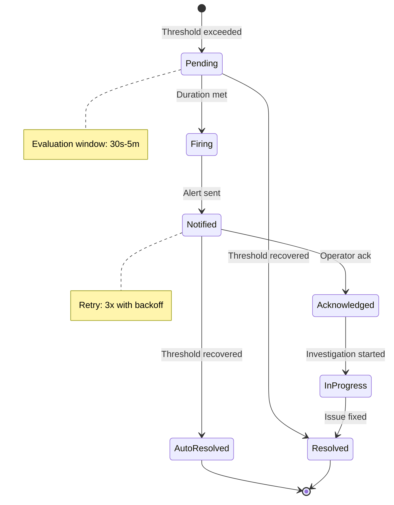
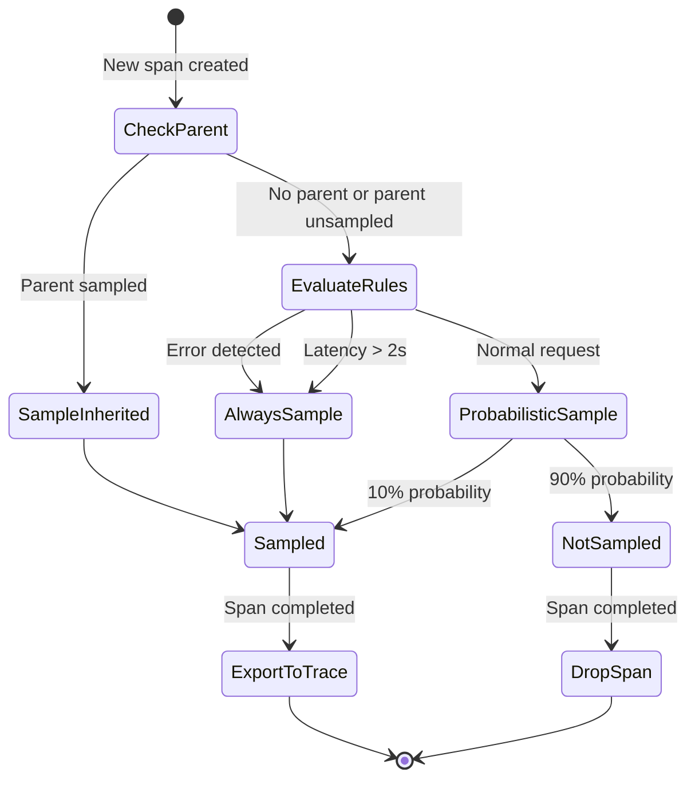
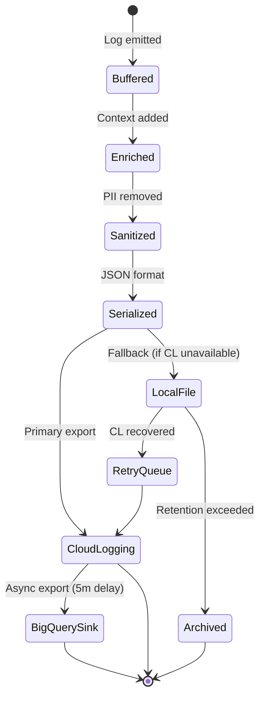

# PRD-03: F3 Observability Module

**MVP Scope**: This PRD focuses on core observability capabilities for the AI Cost Monitoring Platform.

**Upstream guardrails**: @brd: BRD-03_f3_observability

**Thresholds pointer**: Define thresholds once; reuse via `@threshold:` tags.

**User-story scope**: PRD holds role/story summaries; detailed behaviors live in EARS and executable scenarios in BDD.

---

## 1. Document Control

| Item | Details |
|------|---------|
| **Status** | Draft |
| **Version** | 1.0.0 |
| **Date Created** | 2026-02-08T00:00:00 |
| **Last Updated** | 2026-02-08T00:00:00 |
| **Author** | Antigravity AI |
| **Reviewer** | Chief Architect |
| **Approver** | Executive Sponsor |
| **BRD Reference** | @brd: BRD-03.0, BRD-03.1, BRD-03.2, BRD-03.3 |
| **Priority** | High |
| **Target Release** | Phase 1 MVP |
| **Estimated Effort** | 12 person-weeks |
| **SYS-Ready Score** | 88/100 (Target: >=85 for MVP) |
| **EARS-Ready Score** | 90/100 (Target: >=85 for MVP) |

### 1.1 Document Revision History

| Version | Date | Author | Changes Made |
|---------|------|--------|--------------|
| 1.0.0 | 2026-02-08T00:00:00 | Antigravity AI | Initial PRD creation from BRD-03 |

---

## 2. Executive Summary

The F3 Observability Module provides comprehensive monitoring, logging, tracing, alerting, and analytics for the AI Cost Monitoring Platform. It enables proactive incident detection, reduces mean time to resolution (MTTR) from hours to under 15 minutes, and delivers operational visibility across all platform services through structured JSON logging, Prometheus/Cloud Monitoring metrics, OpenTelemetry distributed tracing, and multi-channel alerting.

### 2.1 MVP Hypothesis

**We believe that** platform operators and SRE teams **will** achieve faster incident resolution and improved service reliability **if we** implement unified observability with correlated logs, metrics, and traces.

**We will know this is true when**:
- MTTR decreases from hours to <15 minutes (measured via incident tracking)
- 100% of platform services emit structured telemetry
- SLO compliance reaches 99.9% for core services

### 2.2 Timeline Overview

| Phase | Dates | Duration |
|-------|-------|----------|
| Phase 1 - Core Telemetry | Week 1-4 | 4 weeks |
| Phase 2 - Alerting/Dashboards | Week 5-8 | 4 weeks |
| Phase 3 - Gap Remediation | Week 9-12 | 4 weeks |
| MVP Launch | Week 12 | - |
| Validation Period | +30 days post-launch | 30 days |

---

## 3. Problem Statement

### 3.1 Current State

- **Manual log correlation**: Incident diagnosis requires manual correlation across services (hours of effort)
- **No reliability targets**: Services lack defined SLOs/SLIs for measuring health
- **Threshold-based alerting**: Static thresholds generate false positives and alert fatigue
- **LLM cost opacity**: No visibility into token usage, latency, or cost trends
- **Partial instrumentation**: Inconsistent telemetry format across platform components

### 3.2 Business Impact

- Revenue impact: Extended outages cost $X/hour in lost productivity
- Customer satisfaction: Delayed incident response affects user trust
- Operational efficiency: Manual debugging consumes 40%+ of SRE time

### 3.3 Opportunity

Unified observability foundation enables proactive incident detection, reliability measurement, and LLM cost optimization across the AI Cost Monitoring Platform.

---

## 4. Target Audience & User Personas

### 4.1 Primary User Persona

**SRE Engineer** - Site Reliability Engineer responsible for platform uptime

- **Key characteristic**: Technical operator managing distributed systems
- **Main pain point**: Slow incident diagnosis due to scattered telemetry
- **Success criteria**: Identify root cause within 5 minutes using correlated traces
- **Usage frequency**: Daily (dashboards), hourly during incidents

### 4.2 Secondary Users

| Role | Key Need | Usage Pattern |
|------|----------|---------------|
| **Developer** | Emit structured logs/metrics, trace context propagation | Per-deployment instrumentation |
| **Platform Admin** | Configure alert rules, manage dashboards | Weekly configuration, daily monitoring |
| **Security Officer** | Audit log access, compliance validation | Monthly audits, incident forensics |

---

## 5. Success Metrics (KPIs)

### 5.1 MVP Validation Metrics (30-Day)

| Metric | Baseline | Target | Measurement |
|--------|----------|--------|-------------|
| Services instrumented with F3 | 0% | 100% | Telemetry audit |
| MTTR for P1 incidents | Hours | <15 minutes | Incident tracking |
| Alert accuracy (true positive rate) | Unknown | >=90% | Alert analysis |
| Dashboard adoption | 0 users | 100% of SRE team | Usage analytics |

### 5.2 Business Success Metrics (90-Day)

| Metric | Target | Decision Threshold |
|--------|--------|-------------------|
| SLO compliance (core services) | 99.9% | <99.5% = Iterate |
| LLM cost visibility | 100% tracked | <90% = Remediate |
| Gap remediation | 7/7 addressed | <5/7 = Escalate |

### 5.3 Go/No-Go Decision Gate

**At MVP+90 days**, evaluate:
- Proceed: All P1 services instrumented, MTTR <15 min, 7/7 gaps addressed
- Iterate: 80-100% instrumentation, MTTR <30 min
- Escalate: <80% instrumentation or MTTR >30 min

---

## 6. Scope & Requirements

### 6.1 In-Scope (MVP Core Features)

| # | Feature | Priority | Description | @brd Reference |
|---|---------|----------|-------------|----------------|
| 1 | Structured Logging | P1-Must | JSON logs with 4 levels, trace correlation | @brd: BRD.03.01.01 |
| 2 | Metrics Collection | P1-Must | Counter/Gauge/Histogram, Prometheus + Cloud Monitoring | @brd: BRD.03.01.02 |
| 3 | Distributed Tracing | P1-Must | OpenTelemetry, 10% sampling, Cloud Trace | @brd: BRD.03.01.03 |
| 4 | Alerting System | P1-Must | 4 severities, PagerDuty/Slack integration | @brd: BRD.03.01.04 |
| 5 | LLM Analytics | P1-Must | Token, latency, cost tracking per model | @brd: BRD.03.01.05 |
| 6 | Auto-Generated Dashboards | P1-Must | Grafana dashboards for system health, LLM, cost | @brd: BRD.03.01.06 |
| 7 | Log Analytics (BigQuery) | P1-Must | SQL-based historical log analysis | @brd: BRD.03.01.07 |
| 8 | SLO/SLI Tracking | P1-Must | Error budget calculation, burn rate alerting | @brd: BRD.03.01.09 |
| 9 | Custom Dashboards | P2-Should | User-defined monitoring views | @brd: BRD.03.01.08 |
| 10 | ML Anomaly Detection | P2-Should | Dynamic threshold adjustment | @brd: BRD.03.01.10 |

### 6.2 Dependencies

| Dependency | Status | Impact | Owner |
|------------|--------|--------|-------|
| F1 IAM (user_id enrichment) | Active | Blocking - required for log/dashboard access | IAM Team |
| F2 Session (session_id context) | Active | Blocking - required for trace context | Session Team |
| F6 Infrastructure (GCP services) | Active | Blocking - Cloud Logging/Monitoring/Trace | DevOps |
| Prometheus deployment | Pending | Non-blocking - parallel setup | DevOps |
| Grafana deployment | Pending | Non-blocking - Phase 2 | DevOps |

### 6.3 Out-of-Scope (Post-MVP)

- **Profiling Integration (GAP-F3-06)**: Deferred to Phase 2 - requires Cloud Profiler setup
- **Domain-specific metrics**: Injected by domain layers D1-D7, not F3 responsibility
- **SIEM integration**: Covered by F4 SecOps module
- **Business KPI definitions**: Domain layer responsibility

### 6.4 Dependency Checklist

- [x] F1 IAM status: Active (provides user_id, trust_level)
- [x] F2 Session status: Active (provides session_id, workspace_id)
- [x] F6 Infrastructure status: Active (provides GCP service endpoints)
- [ ] Fallback path: Local log buffer if Cloud Logging unavailable

---

## 7. User Stories & User Roles

### 7.1 Core User Stories

| ID | User Story | Priority | Acceptance Criteria | @brd Reference |
|----|------------|----------|---------------------|----------------|
| PRD.03.09.01 | As a Developer, I want to emit structured logs with context, so that I can debug issues with consistent log format | P1 | Logs contain timestamp, level, trace_id, user_id | @brd: BRD.03.09.01 |
| PRD.03.09.02 | As a Developer, I want to record custom metrics, so that I can track application-specific KPIs | P1 | Metrics appear in Cloud Monitoring within 60s | @brd: BRD.03.09.02 |
| PRD.03.09.03 | As a Developer, I want to propagate trace context, so that I can see end-to-end request visibility | P1 | Trace spans linked across 3+ services | @brd: BRD.03.09.03 |
| PRD.03.09.04 | As an SRE, I want to configure alert rules, so that I receive proactive incident notifications | P1 | Alert delivered within 30s of threshold breach | @brd: BRD.03.09.04 |
| PRD.03.09.05 | As an SRE, I want to view service dashboards, so that I have real-time operational visibility | P1 | Dashboard loads in <3s with current metrics | @brd: BRD.03.09.05 |
| PRD.03.09.06 | As an SRE, I want to track SLO/SLI metrics, so that I can measure service reliability | P2 | Error budget updates every 1 minute | @brd: BRD.03.09.06 |
| PRD.03.09.07 | As an Admin, I want to query logs via BigQuery, so that I can perform historical trend analysis | P2 | Query 1M logs in <30s | @brd: BRD.03.09.07 |
| PRD.03.09.08 | As a Developer, I want to track LLM usage metrics, so that I can optimize cost and performance | P1 | Token/latency/cost visible per request | @brd: BRD.03.09.08 |

### 7.2 User Roles

| Role | Purpose | Permissions |
|------|---------|-------------|
| Developer | Instrument code, emit telemetry | Write logs/metrics/traces; read dashboards |
| SRE | Configure alerts, manage SLOs | Full dashboard access; alert rule management |
| Admin | Manage retention, access policies | Full system configuration; BigQuery access |
| Security Officer | Audit access, compliance | Read-only audit logs; 7-year retention access |

### 7.3 Story Summary

| Priority | Count | Notes |
|----------|-------|-------|
| P1 (Must-Have) | 6 | Required for MVP launch |
| P2 (Should-Have) | 4 | Include if time permits |
| **Total** | 10 | |

---

## 8. Functional Requirements

### 8.1 Core Capabilities

| ID | Capability | Success Criteria | @brd Reference |
|----|------------|------------------|----------------|
| PRD.03.01.01 | Structured Logging | JSON logs with trace_id, <1ms write latency | @brd: BRD.03.01.01 |
| PRD.03.01.02 | Metrics Collection | 3 metric types, <0.1ms record latency | @brd: BRD.03.01.02 |
| PRD.03.01.03 | Distributed Tracing | OpenTelemetry spans, <0.5ms creation | @brd: BRD.03.01.03 |
| PRD.03.01.04 | Alerting System | 4 severities, <30s critical delivery | @brd: BRD.03.01.04 |
| PRD.03.01.05 | LLM Analytics | 100% call tracking, 99% cost accuracy | @brd: BRD.03.01.05 |
| PRD.03.01.06 | Dashboards | Auto-generated, <3s load time | @brd: BRD.03.01.06 |
| PRD.03.01.07 | Log Analytics | BigQuery export, <30s query (1M logs) | @brd: BRD.03.01.07 |
| PRD.03.01.09 | SLO/SLI Tracking | 100% accuracy, 1-min update frequency | @brd: BRD.03.01.09 |

### 8.2 User Journey (Happy Path)

1. Developer integrates F3 SDK -> System auto-configures logging, metrics, tracing
2. Service emits log -> System enriches with trace_id, user_id, exports to Cloud Logging
3. Metric recorded -> System exports to Prometheus/Cloud Monitoring (60s interval)
4. Request traced -> System samples (10%), exports spans to Cloud Trace
5. Threshold exceeded -> System evaluates severity, routes alert to PagerDuty/Slack
6. SRE opens dashboard -> System displays real-time metrics, logs, trace links

### 8.3 Error Handling (MVP)

| Error Scenario | User Experience | System Behavior |
|----------------|-----------------|-----------------|
| Cloud Logging unavailable | Logs continue locally | Buffer to local file, retry export |
| Prometheus scrape fails | Metrics delayed | Retry with backoff, alert on >3 failures |
| Cloud Trace export fails | Traces not visible | Local span buffer, async retry |
| PagerDuty timeout | Alert delayed | Fallback to Slack, retry PagerDuty |
| BigQuery query timeout | Query fails | Return partial results, suggest optimization |

---

## 9. Quality Attributes

### 9.1 Performance (Baseline)

| Metric | Target | Notes | @brd Reference |
|--------|--------|-------|----------------|
| Log write latency (p99) | <1ms | Synchronous write | @brd: BRD.03.06.01 |
| Metric record latency (p99) | <0.1ms | In-memory counter | @brd: BRD.03.06.03 |
| Span creation latency (p99) | <0.5ms | Context propagation | @brd: BRD.03.06.05 |
| Dashboard load time (p95) | <3s | Grafana with 6 panels | @brd: BRD.03.06.11 |
| Alert delivery latency (Critical) | <30s | PagerDuty integration | @brd: BRD.03.06.07 |

### 9.2 Security (Baseline)

- [x] Authentication: F1 IAM integration for dashboard access
- [x] Encryption at transit: TLS 1.3 for all telemetry export
- [x] Encryption at rest: GCP-managed keys for Cloud Logging/BigQuery
- [x] PII sanitization: Log sanitization before export
- [x] Audit logging: Dashboard access logged for compliance

### 9.3 Availability (Baseline)

| Metric | Target | @brd Reference |
|--------|--------|----------------|
| Log delivery uptime | 99.9% | @brd: BRD.03.02.02 |
| Metrics export uptime | 99.9% | @brd: BRD.03.02.02 |
| Alert delivery uptime | 99.9% | @brd: BRD.03.02.02 |
| Recovery time (RTO) | <5 minutes | @brd: BRD.03.02.02 |
| Dashboard availability | 99.5% | @brd: BRD.03.06.12 |

---

## 10. Architecture Requirements

### 10.1 Infrastructure (PRD.03.32.01)

**Status**: [X] Selected

**Business Driver**: Centralized telemetry storage with GCP-native integration

**MVP Approach**:
- Logging: GCP Cloud Logging with BigQuery sink
- Metrics: Prometheus + Cloud Monitoring dual-export
- Tracing: OpenTelemetry + Cloud Trace

**Rationale**: GCP-native tools provide managed infrastructure, integrated authentication, and cost-effective scaling.

**Estimated Cost**: $500-2000/month (based on telemetry volume)

### 10.2 Data Architecture (PRD.03.32.02)

**Status**: [X] Selected

**Business Driver**: Balance storage cost with historical analysis needs

**MVP Approach**:
- Logs: 30 days Cloud Logging, 1 year BigQuery (extended)
- Metrics: 90 days Cloud Monitoring
- Traces: 7 days Cloud Trace, 30 days extended

**Rationale**: Standard retention covers operational needs; BigQuery enables compliance and trend analysis.

### 10.3 Integration (PRD.03.32.03)

**Status**: [X] Selected

**Business Driver**: Unified telemetry across all platform services

**MVP Approach**:
- OpenTelemetry W3C Trace Context standard
- Prometheus exposition format (:9090/metrics)
- Cloud Logging structured JSON schema

**Rationale**: Industry-standard formats ensure compatibility and portability.

### 10.4 Security (PRD.03.32.04)

**Status**: [ ] Pending

**Business Driver**: Protect sensitive operational data

**MVP Approach**:
- IAM-based Cloud Logging roles
- F1 IAM integration for dashboard RBAC
- PII sanitization in log pipeline

**Rationale**: GCP IAM provides enterprise-grade access control with audit trails.

### 10.5 Observability (PRD.03.32.05)

**Status**: [ ] Pending

**Business Driver**: Ensure observability system is itself observable

**MVP Approach**:
- Dedicated F3 health metrics namespace
- Self-monitoring synthetic health checks
- Alert on F3 component failures

**Rationale**: Meta-observability prevents silent failures in the monitoring stack.

### 10.6 AI/ML (PRD.03.32.06)

**Status**: [ ] Pending

**Business Driver**: Detect unknown failures beyond static thresholds (GAP-F3-04)

**MVP Approach**:
- Cloud Monitoring ML anomaly detection (Phase 2)
- Baseline learning from 30-day historical data
- Dynamic threshold adjustment

**Rationale**: ML-based detection reduces false positives and alert fatigue.

### 10.7 Technology Selection (PRD.03.32.07)

**Status**: [X] Selected

**Business Driver**: Unified visualization for all telemetry types

**MVP Selection**:
- Dashboard: Grafana with Cloud Logging, Prometheus, Cloud Trace data sources
- Alerting: PagerDuty (Critical/High), Slack (all severities)
- Analytics: BigQuery for SQL-based log analysis

**Rationale**: Grafana provides flexible visualization; PagerDuty ensures reliable on-call paging.

---

## 11. Constraints & Assumptions

### 11.1 Constraints

- **Budget**: Cloud Monitoring/Logging usage must stay within $2000/month
- **Timeline**: 12 weeks to MVP launch
- **Resources**: 2 engineers (1 backend, 1 DevOps)
- **Technology**: GCP as primary cloud provider (ADR-00)
- **Retention**: Standard: Logs 30d, Metrics 90d, Traces 7d

### 11.2 Assumptions

| Assumption | Risk Level | Validation Method | Impact if False |
|------------|------------|-------------------|-----------------|
| Cloud Logging meets 99.9% SLA | Low | Monitor GCP status | Implement local log buffer |
| Services support OpenTelemetry | Low | SDK compatibility test | Provide alternative instrumentation |
| Prometheus scrape overhead <1% CPU | Medium | Performance benchmark | Reduce scrape frequency |
| BigQuery query cost within budget | Medium | Cost monitoring | Implement query caching |

---

## 12. Risk Assessment

| Risk | Likelihood | Impact | Mitigation | Owner |
|------|------------|--------|------------|-------|
| Log volume exceeds budget | Medium | High | Log sampling, severity-based routing | DevOps |
| Metric cardinality explosion | Medium | High | Enforce label cardinality limits | Architect |
| Alert fatigue from false positives | High | Medium | ML anomaly detection, deduplication | SRE |
| Trace sampling misses critical issues | Low | High | Always-on for errors/slow (>2s) | Architect |
| BigQuery query costs exceed budget | Medium | Medium | Query optimization, result caching | DevOps |
| F3 component failure undetected | Low | High | Self-monitoring health checks | SRE |

---

## 13. Implementation Approach

### 13.1 MVP Development Phases

| Phase | Duration | Deliverables | Success Criteria |
|-------|----------|--------------|------------------|
| **Phase 1: Core Telemetry** | 4 weeks | Logging, Metrics, Tracing SDK | All services instrumented |
| **Phase 2: Alerting/Dashboards** | 4 weeks | Alert rules, Grafana dashboards, LLM analytics | PagerDuty/Slack functional |
| **Phase 3: Gap Remediation** | 4 weeks | BigQuery analytics, SLO/SLI tracking | 7/7 P1 gaps addressed |

### 13.2 Testing Strategy (MVP)

| Test Type | Coverage | Responsible |
|-----------|----------|-------------|
| Unit Tests | 80% minimum | Development |
| Integration Tests | Logging, metrics, tracing pipelines | Development |
| Load Tests | 10K logs/s, 100K metrics/s, 1K traces/s | QA |
| UAT | Core user stories (PRD.03.09.01-08) | Product/QA |
| Chaos Tests | Cloud Logging/Trace failure scenarios | SRE |

---

## 14. Acceptance Criteria

### 14.1 Business Acceptance

- [x] P1 features deliver observable telemetry value
- [x] KPIs instrumented (MTTR, SLO compliance)
- [x] Dashboards accessible to all operators

### 14.2 Technical Acceptance

- [ ] Log write latency <1ms (p99)
- [ ] Metric record latency <0.1ms (p99)
- [ ] Alert delivery <30s (Critical)
- [ ] Dashboard load <3s (p95)
- [ ] 100% LLM call tracking accuracy

### 14.3 QA Acceptance

- [ ] Critical bugs resolved (0 P1 bugs)
- [ ] SDK integration documentation complete
- [ ] Alert playbook documentation complete

### 14.4 Core Flow Messaging

| Channel | Message | Owner |
|---------|---------|-------|
| PagerDuty | Critical/High severity alerts | On-call SRE |
| Slack #alerts | All severity notifications | SRE Team |
| Slack #llm-costs | Daily LLM cost summary | Platform Admin |

---

## 15. Budget & Resources

### 15.1 MVP Development Cost

| Category | Estimate | Notes |
|----------|----------|-------|
| Development | $48,000 | 12 person-weeks x $4000/week |
| Infrastructure (3 months) | $6,000 | Cloud Logging, Monitoring, Trace, BigQuery |
| Third-party services | $600 | PagerDuty ($200/mo x 3) |
| Grafana Cloud | $0 | Self-hosted on GKE |
| **Total MVP Cost** | **$54,600** | |

### 15.2 ROI Hypothesis

**Investment**: $54,600 (MVP)

**Expected Return**:
- MTTR reduction: 40 hours/month saved x $100/hour = $4,000/month
- Incident prevention: 2 outages/month prevented x $10,000 = $20,000/month
- LLM cost optimization: 10% reduction = $500/month (estimated)

**Payback Period**: 2.5 months

**Decision Logic**: If MTTR <15 min achieved, full observability investment justified.

---

## 16. Traceability

### 16.1 Upstream References

| Source | Document | Relationship |
|--------|----------|--------------|
| BRD | @brd: BRD-03.0_index.md | Business requirements source |
| BRD | @brd: BRD-03.1_core.md | Objectives, stakeholders, user stories |
| BRD | @brd: BRD-03.2_requirements.md | Functional requirements (13 requirements) |
| BRD | @brd: BRD-03.3_quality_ops.md | Quality attributes, constraints, risks |
| F3 Spec | F3_Observability_Technical_Specification.md | Technical implementation reference |
| Gap Analysis | GAP_Foundation_Module_Gap_Analysis.md | 7 F3 gaps identified |

### 16.2 Downstream Artifacts

| Artifact Type | Status | Notes |
|---------------|--------|-------|
| EARS | TBD | Created after PRD approval |
| BDD | TBD | Created after EARS |
| ADR-F3-01 | TBD | Log Backend Selection |
| ADR-F3-02 | TBD | Metrics Backend Selection |
| ADR-F3-03 | TBD | Dashboard Platform Selection |

### 16.3 Traceability Tags

```markdown
@brd: BRD-03.01.01 (Structured Logging)
@brd: BRD-03.01.02 (Metrics Collection)
@brd: BRD-03.01.03 (Distributed Tracing)
@brd: BRD-03.01.04 (Alerting System)
@brd: BRD-03.01.05 (LLM Analytics)
@brd: BRD-03.01.06 (Dashboards)
@brd: BRD-03.01.07 (Log Analytics)
@brd: BRD-03.01.09 (SLO/SLI Tracking)
```

### 16.4 Cross-Links (Same-Layer)

- @depends: PRD-01 (F1 IAM provides user_id for log enrichment, dashboard RBAC)
- @depends: PRD-02 (F2 Session provides session_id for trace context)
- @discoverability: PRD-04 (F4 SecOps consumes security event logs)
- @discoverability: PRD-05 (F5 Self-Ops consumes health metrics, anomaly signals)

---

## 17. Glossary

| Term | Definition |
|------|------------|
| SLO | Service Level Objective - Target reliability level (e.g., 99.9% availability) |
| SLI | Service Level Indicator - Metric measuring reliability (e.g., error rate) |
| Error Budget | Allowable unreliability before impacting SLO (e.g., 0.1% downtime/month) |
| Span | Single operation within a distributed trace |
| Trace Context | W3C standard metadata propagated across services for correlation |
| Cardinality | Number of unique label combinations for a metric |
| MTTR | Mean Time To Resolution - Average time to fix incidents |
| TTFB | Time To First Byte - Initial response latency for LLM calls |

**Master Glossary Reference**: See [BRD-00_GLOSSARY.md](../01_BRD/BRD-00_GLOSSARY.md)

---

## 18. Appendix A: Future Roadmap (Post-MVP)

### 18.1 Phase 2 Features (If MVP Succeeds)

| Feature | Priority | Estimated Effort | Dependency |
|---------|----------|------------------|------------|
| Trace Journey Visualization (GAP-F3-05) | P2 | 3 weeks | MVP complete |
| ML Anomaly Detection (GAP-F3-04) | P2 | 4 weeks | 30-day baseline data |
| Alert Fatigue Management (GAP-F3-07) | P2 | 2 weeks | Alerting functional |
| Custom Dashboards (GAP-F3-02) | P2 | 2 weeks | Grafana deployed |

### 18.2 Phase 3 Features

| Feature | Priority | Estimated Effort | Dependency |
|---------|----------|------------------|------------|
| Profiling Integration (GAP-F3-06) | P3 | 4 weeks | Cloud Profiler setup |
| Advanced Trace Visualization | P3 | 3 weeks | GAP-F3-05 complete |
| Multi-tenant Observability | P3 | 6 weeks | Tenant isolation design |

### 18.3 Scaling Considerations

- **Infrastructure**: Horizontal scaling of Prometheus federation for >100K metrics/s
- **Performance**: Log sampling at ingestion for >50K logs/s
- **Storage**: Tiered retention (hot 7d, warm 30d, cold 1yr) for cost optimization

---

## 19. EARS Enhancement Appendix

### 19.1 Timing Profiles

| Operation | @threshold ID | Nominal | Warning | Critical |
|-----------|---------------|---------|---------|----------|
| Log write | @threshold:LOG_WRITE_LATENCY | <1ms | 1-5ms | >5ms |
| Metric record | @threshold:METRIC_RECORD_LATENCY | <0.1ms | 0.1-0.5ms | >0.5ms |
| Span creation | @threshold:SPAN_CREATE_LATENCY | <0.5ms | 0.5-2ms | >2ms |
| Alert delivery (Critical) | @threshold:ALERT_CRITICAL_LATENCY | <30s | 30-60s | >60s |
| Alert delivery (High) | @threshold:ALERT_HIGH_LATENCY | <5m | 5-15m | >15m |
| Dashboard load | @threshold:DASHBOARD_LOAD_TIME | <3s | 3-5s | >5s |
| BigQuery query (1M logs) | @threshold:BQ_QUERY_TIME | <30s | 30-60s | >60s |
| Log export to BigQuery | @threshold:LOG_EXPORT_LATENCY | <5m | 5-10m | >10m |
| Error budget update | @threshold:ERROR_BUDGET_UPDATE | <1m | 1-5m | >5m |

### 19.2 Boundary Values

| Parameter | @threshold ID | Min | Nominal | Max | Overflow Behavior |
|-----------|---------------|-----|---------|-----|-------------------|
| Log message size | @threshold:LOG_MSG_SIZE | 1B | 1KB | 64KB | Truncate + warn |
| Metric label count | @threshold:METRIC_LABELS | 0 | 5 | 10 | Reject metric |
| Metric label value length | @threshold:LABEL_VALUE_LEN | 1 | 64 | 128 chars | Truncate |
| Span attribute count | @threshold:SPAN_ATTRS | 0 | 10 | 32 | Ignore excess |
| Trace sampling rate | @threshold:TRACE_SAMPLE_RATE | 1% | 10% | 100% | Cap at 100% |
| Alert deduplication window | @threshold:ALERT_DEDUP_WINDOW | 1m | 5m | 30m | Use max |
| SLO window | @threshold:SLO_WINDOW | 1h | 7d | 30d | Use default |
| Log retention (standard) | @threshold:LOG_RETENTION | 7d | 30d | 90d | Archive to BQ |
| Metrics retention | @threshold:METRIC_RETENTION | 30d | 90d | 365d | Downsample |

### 19.3 State Diagrams

#### 19.3.1 Alert Lifecycle State Machine



#### 19.3.2 Trace Sampling Decision Flow



#### 19.3.3 Log Export Pipeline States



### 19.4 EARS Requirement Patterns

#### 19.4.1 Ubiquitous Requirements

| ID | EARS Pattern | Requirement |
|----|--------------|-------------|
| EARS.03.UB.01 | The system shall | export all logs to Cloud Logging within @threshold:LOG_EXPORT_LATENCY |
| EARS.03.UB.02 | The system shall | record metrics with latency under @threshold:METRIC_RECORD_LATENCY |
| EARS.03.UB.03 | The system shall | propagate W3C Trace Context headers on all outbound requests |
| EARS.03.UB.04 | The system shall | sanitize PII from logs before export |

#### 19.4.2 Event-Driven Requirements

| ID | EARS Pattern | Requirement |
|----|--------------|-------------|
| EARS.03.ED.01 | When | alert threshold exceeded, the system shall evaluate severity and route notification |
| EARS.03.ED.02 | When | error span detected, the system shall always sample (bypass probability) |
| EARS.03.ED.03 | When | request latency exceeds 2s, the system shall always sample trace |
| EARS.03.ED.04 | When | LLM call completes, the system shall record token count, latency, and cost |
| EARS.03.ED.05 | When | error budget burn rate exceeds 2x, the system shall trigger P2 alert |

#### 19.4.3 State-Driven Requirements

| ID | EARS Pattern | Requirement |
|----|--------------|-------------|
| EARS.03.SD.01 | While | Cloud Logging unavailable, the system shall buffer logs locally |
| EARS.03.SD.02 | While | alert in Notified state, the system shall retry delivery 3x with backoff |
| EARS.03.SD.03 | While | maintenance window active, the system shall suppress non-critical alerts |

#### 19.4.4 Conditional Requirements

| ID | EARS Pattern | Requirement |
|----|--------------|-------------|
| EARS.03.CD.01 | If | log message exceeds @threshold:LOG_MSG_SIZE, then truncate and add overflow warning |
| EARS.03.CD.02 | If | metric label count exceeds @threshold:METRIC_LABELS, then reject and log error |
| EARS.03.CD.03 | If | alert severity is CRITICAL, then notify PagerDuty and Slack simultaneously |
| EARS.03.CD.04 | If | alert severity is LOW, then log only (no notification) |

#### 19.4.5 Complex Requirements

| ID | EARS Pattern | Requirement |
|----|--------------|-------------|
| EARS.03.CX.01 | While in production, when error rate exceeds SLO target, if error budget remaining <10%, the system shall escalate to P1 alert |
| EARS.03.CX.02 | While BigQuery sink enabled, when log volume exceeds 10K/s, if cost budget at 80%, the system shall enable log sampling |

### 19.5 Validation Checklist

| Section | Requirement | Status |
|---------|-------------|--------|
| Timing Profiles | All operations have nominal/warning/critical thresholds | Complete |
| Boundary Values | All parameters have min/nominal/max with overflow behavior | Complete |
| State Diagrams | Alert, Trace Sampling, Log Export states documented | Complete |
| EARS Patterns | Ubiquitous, Event-Driven, State-Driven, Conditional patterns | Complete |
| Threshold Tags | All thresholds use @threshold: naming convention | Complete |

---

**Document Version**: 1.0.0
**Template Version**: 1.0 (MVP)
**Last Updated**: 2026-02-08T00:00:00
**Maintained By**: Antigravity AI

---

*PRD-03: F3 Observability - AI Cost Monitoring Platform v4.2 - February 2026*
