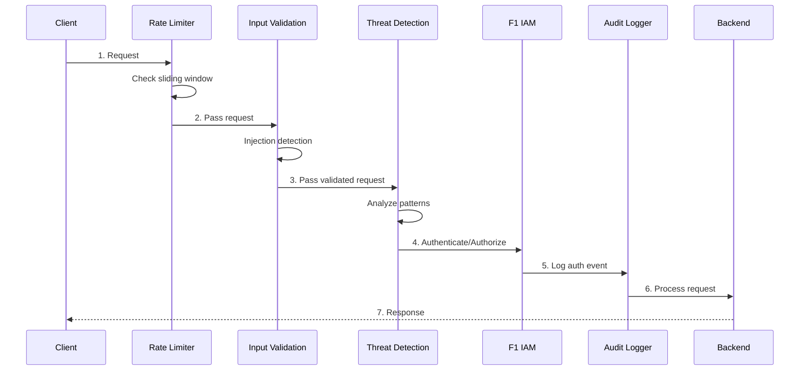

# PRD-04: F4 Security Operations (SecOps)

> **Module Type**: Foundation (Domain-Agnostic)
> **Portability**: This PRD defines generic security operations capabilities reusable across any platform requiring input validation, compliance enforcement, audit logging, and threat detection.

@brd: BRD-04
@depends: PRD-06 (F6 Infrastructure - BigQuery, Redis, Cloud Armor)
@discoverability: PRD-01 (F1 IAM - trust levels, permissions); PRD-02 (F2 Session - session context for audit); PRD-03 (F3 Observability - logging integration)

---

## 1. Document Control

| Item | Details |
|------|---------|
| **Status** | Draft |
| **Version** | 1.0 |
| **Date Created** | 2026-02-09T00:00:00 |
| **Last Updated** | 2026-02-09T00:00:00 |
| **Author** | Antigravity AI |
| **Reviewer** | Chief Architect |
| **Approver** | Executive Sponsor |
| **BRD Reference** | @brd: BRD-04 |
| **Priority** | P1 - Critical |
| **Target Release** | Phase 1 MVP |
| **EARS-Ready Score** | 90/100 (Target: ≥85 for MVP) |

### 1.1 Document Revision History

| Version | Date | Author | Changes Made |
|---------|------|--------|--------------|
| 1.0 | 2026-02-09T00:00:00 | Antigravity AI | Initial PRD generation from BRD-04 |

---

## 2. Executive Summary

The F4 Security Operations Module provides runtime security for the AI Cost Monitoring Platform including input validation (injection detection, rate limiting, sanitization), compliance enforcement (OWASP ASVS 5.0 Level 2, OWASP LLM Top 10 2025), immutable audit logging with cryptographic chaining (7-year retention), and threat detection with automated response. This foundation module is domain-agnostic with special attention to LLM-specific threats, enforcing security controls without understanding business logic.

### 2.1 MVP Hypothesis

**We believe that** platform operators and security teams **will** achieve rapid incident detection and compliance verification **if we** implement defense-in-depth security with automated threat detection, immutable audit logging, and compliance enforcement.

**We will know this is true when**:
- 100% of injection attacks are blocked with <100ms detection latency
- OWASP ASVS Level 2 compliance reaches ≥98%
- Audit log hash chain integrity is verified at 100%
- Security incident response time reduces from hours to <5 minutes

### 2.2 Timeline Overview

| Phase | Duration | Deliverables |
|-------|----------|--------------|
| Phase 1: Core Validation | 3 weeks | Input validation, rate limiting, basic audit logging |
| Phase 2: Compliance & Detection | 3 weeks | OWASP compliance, threat detection, hash chain immutability |
| Phase 3: LLM Security & Integration | 2 weeks | LLM security defense-in-depth, SIEM integration |
| Phase 4: Gap Remediation | 2 weeks | WAF integration, automated pen testing, threat intelligence |

---

## 3. Problem Statement

### 3.1 Current State

- **Siloed Security Logs**: Security incidents require manual investigation across siloed logs
- **Manual WAF Updates**: WAF rules must be updated manually, creating security gaps during response windows
- **No Proactive Detection**: No proactive threat detection from external intelligence sources
- **Ad-hoc Incident Response**: No documented runbooks for consistent incident handling
- **LLM-Specific Threats**: Limited protection against prompt injection, PII leakage, and context manipulation

### 3.2 Business Impact

- Security incident response measured in hours rather than minutes
- Manual compliance verification effort for each audit cycle
- Risk of data breach from undetected injection attacks
- Potential regulatory penalties from inadequate audit trails

### 3.3 Opportunity

Unified SecOps foundation module providing defense-in-depth, automated threat response, enterprise-grade compliance reporting, and LLM-specific security controls with zero domain-specific coupling.

---

## 4. Target Audience & User Personas

### 4.1 Primary User Personas

**Platform Administrator** - Security Configuration Manager
- **Key characteristic**: Configures security policies, monitors threat dashboards
- **Main pain point**: Manual WAF rule updates and incident investigation
- **Success criteria**: Single dashboard for security posture and rapid threat response
- **Usage frequency**: Daily monitoring, on-demand incident response

**Security Officer** - Compliance and Audit Manager
- **Key characteristic**: Ensures regulatory compliance, manages audit processes
- **Main pain point**: Manual compliance verification and evidence collection
- **Success criteria**: Automated compliance reports and tamper-proof audit trails
- **Usage frequency**: Weekly compliance checks, quarterly audits

### 4.2 Secondary Users

- **DevOps Engineer**: Integrates security controls into CI/CD pipelines
- **Development Team**: Consumes F4 APIs for input validation and extensibility hooks
- **AI Agent**: Receives LLM-safe sanitized context for secure processing

---

## 5. Success Metrics (KPIs)

### 5.1 MVP Validation Metrics (30-Day)

| Metric ID | Metric | Baseline | Target | Measurement |
|-----------|--------|----------|--------|-------------|
| PRD.04.05.01 | Injection detection rate | 0% | 100% | Security event logs |
| PRD.04.05.02 | Detection latency (p95) | N/A | <100ms | Performance monitoring |
| PRD.04.05.03 | Brute force detection rate | 0% | 100% | Threat event logs |
| PRD.04.05.04 | False positive rate | N/A | <1% | Security analyst review |

### 5.2 Business Success Metrics (90-Day)

| Metric ID | Metric | Target | Decision Threshold |
|-----------|--------|--------|-------------------|
| PRD.04.05.05 | OWASP ASVS compliance | ≥98% | <95% = Remediate |
| PRD.04.05.06 | Audit chain integrity | 100% | <100% = Critical |
| PRD.04.05.07 | Incident response time | <5 minutes | >15 minutes = Iterate |
| PRD.04.05.08 | SIEM export reliability | ≥99.9% | <99% = Fix |

### 5.3 Go/No-Go Decision Gate

**At MVP+90 days**, evaluate:
- ✅ **Proceed to Full Product**: All P1 metrics met, 0 critical security incidents
- 🔄 **Iterate**: 80-95% of targets met, no critical breaches
- ❌ **Remediate**: <80% of targets or any critical security incident

---

## 6. Scope & Requirements

### 6.1 In-Scope (MVP Core Features)

| # | Feature | Priority | BRD Reference |
|---|---------|----------|---------------|
| 1 | Input Validation (Injection Detection) | P1-Must | BRD.04.01.01 |
| 2 | Compliance Enforcement (OWASP ASVS 5.0, LLM Top 10) | P1-Must | BRD.04.01.02 |
| 3 | Immutable Audit Logging (Hash Chain) | P1-Must | BRD.04.01.03 |
| 4 | Threat Detection (Brute Force, Anomaly) | P1-Must | BRD.04.01.04 |
| 5 | LLM Security (Defense-in-Depth) | P1-Must | BRD.04.01.05 |
| 6 | SIEM Integration Connector | P1-Must | BRD.04.01.07 |
| 7 | Extensibility Hooks | P2-Should | BRD.04.01.06 |
| 8 | WAF Integration (Cloud Armor) | P2-Should | BRD.04.01.08 |
| 9 | Automated Penetration Testing | P2-Should | BRD.04.01.09 |
| 10 | Threat Intelligence Feed | P2-Should | BRD.04.01.10 |

### 6.2 Dependencies

| Dependency | Status | Impact | Owner |
|------------|--------|--------|-------|
| F6 Infrastructure (BigQuery) | Available | Required for audit storage | Platform Team |
| F6 Infrastructure (Redis) | Available | Required for rate limiting | Platform Team |
| F6 Infrastructure (Cloud Armor) | Available | Required for WAF integration | Platform Team |
| F1 IAM (Trust Levels) | Available | Required for permission context | IAM Team |
| F2 Session (Session Context) | Available | Required for audit enrichment | Session Team |

### 6.3 Out-of-Scope (Post-MVP)

| Feature | Reason | Target Phase |
|---------|--------|--------------|
| Security Scoring System | Requires ML baseline | Phase 2 (BRD.04.01.11) |
| Incident Response Runbooks | Operations team coordination | Phase 2 (BRD.04.01.12) |
| Hardware Security Modules | Enterprise-only requirement | Future |
| Custom Domain Threat Patterns | Domain layer responsibility | N/A |

---

## 7. User Stories & User Roles

### 7.1 Core User Stories

| ID | User Story | Priority | Acceptance Criteria | BRD Trace |
|----|------------|----------|---------------------|-----------|
| PRD.04.09.01 | As a User, I want my input validated for injection attacks, so that malicious inputs are blocked | P1 | 100% known injection patterns blocked, <100ms latency | BRD.04.09.01 |
| PRD.04.09.02 | As a User, I want to be rate-limited when exceeding request thresholds, so that platform remains stable | P1 | Sliding window rate limiting with configurable thresholds | BRD.04.09.02 |
| PRD.04.09.03 | As an Admin, I want to view compliance status dashboard, so that I have continuous visibility | P1 | Real-time OWASP compliance percentage display | BRD.04.09.03 |
| PRD.04.09.04 | As an Admin, I want to query audit logs for security events, so that I can investigate incidents | P1 | BigQuery audit log queries with actor, event type, timestamp filters | BRD.04.09.04 |
| PRD.04.09.05 | As an Admin, I want to manually unblock IP addresses, so that I can respond to false positives | P1 | IP unblock API with audit trail | BRD.04.09.05 |
| PRD.04.09.06 | As the System, I want to detect and block brute force attempts, so that accounts are protected | P1 | 5 failures in 5 minutes triggers 30-minute IP block | BRD.04.09.06 |
| PRD.04.09.07 | As the System, I want to generate compliance reports on schedule, so that regulatory evidence is ready | P1 | Daily/weekly/monthly automated reports | BRD.04.09.07 |
| PRD.04.09.08 | As an Admin, I want to export audit logs to external SIEM, so that I have unified visibility | P2 | CEF/LEEF/JSON export with <1s latency | BRD.04.09.08 |
| PRD.04.09.09 | As an Admin, I want to receive threat intelligence alerts, so that I'm aware of emerging threats | P2 | 15-minute feed update frequency | BRD.04.09.09 |
| PRD.04.09.10 | As an AI Agent, I want to receive LLM-safe sanitized context, so that my responses are secure | P1 | PII redaction ≥99.9%, prompt injection blocked ≥99% | BRD.04.09.10 |

### 7.2 User Roles

| Role | Purpose | Permissions |
|------|---------|-------------|
| User | Submit requests through platform | Read own audit events |
| Admin | Configure security policies, manage incidents | Full security administration |
| Security Officer | Review compliance, manage audits | Compliance reporting, audit export |
| System | Automated threat detection and response | Autonomous security enforcement |
| AI Agent | Process LLM requests with sanitized context | Receive sanitized inputs only |

### 7.3 Story Summary

| Priority | Count | Notes |
|----------|-------|-------|
| P1 (Must-Have) | 8 | Required for MVP launch |
| P2 (Should-Have) | 2 | Include in Phase 2 |
| **Total** | 10 | |

---

## 8. Functional Requirements

### 8.1 Core Capabilities

| ID | Capability | Description | Success Criteria | BRD Trace |
|----|------------|-------------|------------------|-----------|
| PRD.04.01.01 | Input Validation | Detect and block prompt injection, SQL injection, XSS attacks | ≥99% detection accuracy, <100ms latency | BRD.04.01.01 |
| PRD.04.01.02 | Rate Limiting | Sliding window counter algorithm for request throttling | <10ms check latency, configurable per endpoint | BRD.04.01.01 |
| PRD.04.01.03 | Compliance Enforcement | OWASP ASVS 5.0 Level 2 (149 controls), LLM Top 10 mitigations | ≥98% compliance, <5 minute report generation | BRD.04.01.02 |
| PRD.04.01.04 | Audit Logging | SHA-256 hash chain, 7-year retention in BigQuery | <50ms write latency, 100% chain integrity | BRD.04.01.03 |
| PRD.04.01.05 | Threat Detection | Brute force, statistical anomaly, suspicious pattern detection | 100% brute force detection, <1% false positives | BRD.04.01.04 |
| PRD.04.01.06 | LLM Security | Defense-in-depth with PII redaction, context isolation | ≥99% injection block, ≥99.9% PII redaction | BRD.04.01.05 |
| PRD.04.01.07 | SIEM Integration | Real-time export to Splunk, Microsoft Sentinel | <1s export latency, ≥99.9% reliability | BRD.04.01.07 |
| PRD.04.01.08 | Extensibility Hooks | Domain layer registration for custom events, patterns | <10ms registration, <5ms execution overhead | BRD.04.01.06 |

### 8.2 Request Security Flow (Happy Path)



### 8.3 Error Handling (MVP)

| Error Scenario | User Experience | System Behavior |
|----------------|-----------------|-----------------|
| Rate limit exceeded | 429 Too Many Requests with retry-after header | Block request, log event, no backend call |
| Prompt injection detected | 400 Bad Request with sanitized error | Block request, log threat event with payload hash |
| SQL injection detected | 400 Bad Request | Block request, log threat event, increment actor risk score |
| Brute force detected | 403 Forbidden | Block IP for 30 minutes, log threat event, alert |
| Anomaly detected | Continue with MFA prompt | Log alert, send notification, require step-up auth |

### 8.4 Injection Detection Patterns

| Attack Type | Detection Method | Response |
|-------------|------------------|----------|
| Prompt Injection | Pattern matching + heuristics | Block (400) |
| SQL Injection | Parameterized query enforcement | Block (400) |
| XSS | HTML parsing + sanitization | Sanitize and continue |
| Path Traversal | Pattern detection (../) | Block (403) + Alert |

### 8.5 Threat Detection Thresholds

| Threat Type | Detection Threshold | Response | Block Duration |
|-------------|---------------------|----------|----------------|
| Brute Force | 5 failures / 5 min | Block IP | 30 minutes |
| Credential Stuffing | Multi-account / same IP | Block IP | 30 minutes |
| Account Enumeration | Sequential ID probing | Block IP + Alert | 60 minutes |
| Geographic Anomaly | Unusual location | Alert + MFA prompt | N/A |

---

## 9. Quality Attributes

### 9.1 Performance

| Metric | Target | Measurement |
|--------|--------|-------------|
| Input validation latency (p95) | <100ms | Request tracing |
| Rate limit check latency (p95) | <10ms | Redis metrics |
| Threat analysis latency (p95) | <100ms | Performance monitoring |
| Audit log write latency (p95) | <50ms | BigQuery insert metrics |

### 9.2 Security

- [x] Defense-in-depth with multiple validation layers
- [x] Fail-secure on error (deny access rather than allow)
- [x] Zero-trust model (validate every request)
- [x] Complete audit trail for all security events
- [x] Cryptographic hash chain for tamper detection

### 9.3 Reliability

| Metric | Target |
|--------|--------|
| Security service uptime | 99.9% |
| Audit service uptime | 99.99% |
| Recovery time (RTO) | <5 minutes |

### 9.4 Scalability

| Metric | MVP Target |
|--------|------------|
| Concurrent validations | 10,000 |
| Audit events/sec | 1,000 |
| Threat analyses/sec | 1,000 |

---

## 10. Architecture Requirements

### 10.1 Infrastructure (PRD.04.32.01)

**Status**: [X] Selected

**Business Driver**: Immutable audit storage with 7-year retention and query capability

**MVP Approach**: BigQuery with daily partitioning and clustering by event_type, actor_id

**Estimated Cost**: ~$5/TB storage, $5/TB query

---

### 10.2 Data Architecture (PRD.04.32.02)

**Status**: [X] Selected

**Business Driver**: High-performance rate limit checking with distributed counter support

**MVP Approach**: Redis with sliding window counter algorithm

**Key Design Decisions**:
- Key format: `ratelimit:{endpoint}:{actor_id}:{window}`
- TTL: Window duration + buffer
- Cluster topology: 3-node minimum for HA

---

### 10.3 Integration (PRD.04.32.03)

**Status**: [ ] Pending

**Business Driver**: Real-time security event export to enterprise SIEM

**Options**: Direct API push, Pub/Sub streaming, batch export

**MVP Approach**: Pub/Sub streaming with CEF/LEEF/JSON format support

---

### 10.4 Security (PRD.04.32.04)

**Status**: [X] Selected

**Business Driver**: Tamper-proof audit log integrity

**MVP Approach**: SHA-256 hash chain with each event including hash of previous event

**Validation**: Daily automated chain integrity verification

---

### 10.5 Observability (PRD.04.32.05)

**Status**: [X] Selected

**Business Driver**: Rapid incident response notification

**MVP Approach**: PagerDuty for critical alerts (P1), Slack for informational (P2-P3)

**Alert Routing**:
- Critical threats: PagerDuty → On-call security
- Compliance violations: Slack #security-alerts
- Audit anomalies: Email to security officer

---

### 10.6 AI/ML (PRD.04.32.06)

**Status**: [X] Selected

**Business Driver**: Detect semantic prompt injection attempts

**MVP Approach**: Built-in pattern matching + heuristics

**Future (v1.1.0)**: ML model for semantic analysis

---

### 10.7 Technology Selection (PRD.04.32.07)

**Status**: [X] Selected

**Business Driver**: Enterprise-grade security compliance baseline

**MVP Selection**:
- Compliance Standards: OWASP ASVS 5.0 Level 2, OWASP LLM Top 10 2025
- Audit Storage: BigQuery
- Rate Limiting: Redis Memorystore
- WAF: Cloud Armor
- Hash Algorithm: SHA-256

---

## 11. Constraints & Assumptions

### 11.1 Constraints

| ID | Category | Description | Impact |
|----|----------|-------------|--------|
| PRD.04.03.01 | Platform | GCP platform (BigQuery, Cloud Armor, Redis) | Cloud lock-in |
| PRD.04.03.02 | Standard | OWASP ASVS 5.0 Level 2 compliance target | 149 controls to implement |
| PRD.04.03.03 | Retention | 7-year audit log retention requirement | Storage cost implications |
| PRD.04.03.04 | Domain-Agnostic | Zero domain-specific code in F4 | All business logic injected by domain layers |

### 11.2 Assumptions

| ID | Assumption | Risk | Validation |
|----|------------|------|------------|
| PRD.04.04.01 | BigQuery availability meets 99.99% SLA | Low | Monitor GCP status |
| PRD.04.04.02 | Redis cluster provides <10ms latency | Medium | Performance testing |
| PRD.04.04.03 | Existing threat patterns cover 99%+ of attacks | Medium | Security analyst review |

---

## 12. Risk Assessment

| Risk ID | Risk | Likelihood | Impact | Mitigation | Owner |
|---------|------|------------|--------|------------|-------|
| PRD.04.07.01 | False positive injection detection | Medium | Medium | Tunable sensitivity, whitelist capability | Security |
| PRD.04.07.02 | Audit log storage costs | Medium | Medium | Compression, tiered storage, archival policy | Architect |
| PRD.04.07.03 | Detection bypass by novel attacks | Low | High | Threat intelligence integration, pattern updates | Security |
| PRD.04.07.04 | Hash chain corruption | Low | Critical | Daily integrity verification, backup chain | Architect |
| PRD.04.07.05 | LLM prompt injection evolution | Medium | High | Pattern library updates, ML model in v1.1.0 | Security |

---

## 13. Implementation Approach

### 13.1 MVP Development Phases

| Phase | Duration | Deliverables | Success Criteria |
|-------|----------|--------------|------------------|
| **Phase 1: Core Validation** | 3 weeks | Input validation, rate limiting, basic audit | Injection blocking active |
| **Phase 2: Compliance & Detection** | 3 weeks | OWASP compliance, threat detection, hash chain | ≥98% compliance |
| **Phase 3: LLM Security & Integration** | 2 weeks | LLM defense-in-depth, SIEM connector | PII redaction ≥99.9% |
| **Phase 4: Gap Remediation** | 2 weeks | WAF integration, pen testing, threat intel | All P2 features |

### 13.2 Testing Strategy (MVP)

| Test Type | Coverage | Responsible |
|-----------|----------|-------------|
| Unit Tests | 90% minimum for detection logic | Development |
| Integration Tests | All security flows | Development |
| Penetration Testing | OWASP testing guide coverage | Security |
| Performance Tests | Latency targets validation | QA |
| Compliance Validation | ASVS control verification | Security |

---

## 14. Acceptance Criteria

### 14.1 MVP Launch Criteria

**Must-Have (P1)**:
- [ ] All P1 functional requirements (PRD.04.01.01-07) implemented
- [ ] Input validation blocking 100% of known injection patterns
- [ ] OWASP ASVS Level 2 compliance ≥98%
- [ ] Audit logging operational with verified hash chain integrity
- [ ] Threat detection operational (brute force, anomaly detection)
- [ ] SIEM integration connector functional

**Should-Have (P2)**:
- [ ] WAF integration with Cloud Armor
- [ ] Automated penetration testing scheduled
- [ ] Extensibility hooks documented and tested

### 14.2 Compliance Validation

| Standard | Controls | Target Coverage |
|----------|----------|-----------------|
| OWASP ASVS 5.0 L2 | 149 controls | 14 categories |
| OWASP LLM Top 10 | 10 threats | 8 mitigated (2 N/A external models) |

---

## 15. Budget & Resources

### 15.1 MVP Development Cost

| Category | Estimate | Notes |
|----------|----------|-------|
| BigQuery Storage | ~$5/TB/month | 7-year retention |
| BigQuery Queries | ~$5/TB | On-demand pricing |
| Redis Memorystore | Per GB-hour | Rate limiting backend |
| Cloud Armor | Per policy/request | WAF rules |
| Development | Foundation module priority | Team allocation |

### 15.2 ROI Hypothesis

**Investment**: F4 SecOps implementation

**Expected Return**:
- Prevents data breach (potential $1M+ regulatory penalty)
- Reduces incident response time from hours to minutes
- Automated compliance reporting reduces audit effort by 80%

**Decision Logic**: Security is non-negotiable; ROI measured in risk reduction.

---

## 16. Traceability

### 16.1 Upstream References

| Source | Document | Relationship |
|--------|----------|--------------|
| BRD | @brd: BRD-04 | Business requirements source |
| Technical Spec | F4_SecOps_Technical_Specification.md | Technical design |
| Gap Analysis | GAP_Foundation_Module_Gap_Analysis.md | 6 F4 gaps identified |

### 16.2 Downstream Artifacts

| Artifact Type | Status | Notes |
|---------------|--------|-------|
| EARS | Pending | After PRD approval |
| BDD | Pending | After EARS |
| ADR | Pending | Hash chain, SIEM integration decisions |

### 16.3 Cross-PRD References

| Related PRD | Dependency Type | Integration Point |
|-------------|-----------------|-------------------|
| PRD-01 (F1 IAM) | Upstream | user_id, trust_level, permissions for access control |
| PRD-02 (F2 Session) | Upstream | session_id for audit context, session validation |
| PRD-03 (F3 Observability) | Downstream | Security events, audit logs for monitoring |
| PRD-06 (F6 Infrastructure) | Upstream | BigQuery, Cloud Armor, Redis |

### 16.4 Requirements Traceability Matrix

| PRD Requirement | BRD Source | Priority | Status |
|-----------------|------------|----------|--------|
| PRD.04.01.01 | BRD.04.01.01 | P1 | Mapped |
| PRD.04.01.02 | BRD.04.01.01 | P1 | Mapped |
| PRD.04.01.03 | BRD.04.01.02 | P1 | Mapped |
| PRD.04.01.04 | BRD.04.01.03 | P1 | Mapped |
| PRD.04.01.05 | BRD.04.01.04 | P1 | Mapped |
| PRD.04.01.06 | BRD.04.01.05 | P1 | Mapped |
| PRD.04.01.07 | BRD.04.01.07 | P1 | Mapped |
| PRD.04.01.08 | BRD.04.01.06 | P2 | Mapped |

---

## 17. Glossary

| Term | Definition |
|------|------------|
| Defense-in-Depth | Multiple security layers to prevent single point of failure |
| Hash Chain | Cryptographic linking where each record includes hash of previous record |
| OWASP ASVS | Application Security Verification Standard from OWASP |
| Prompt Injection | Attack attempting to override LLM system instructions |
| SIEM | Security Information and Event Management platform |
| WAF | Web Application Firewall for HTTP traffic filtering |
| Zero Trust | Security model that validates every request, assumes breach |

**Master Glossary Reference**: See [BRD-00_GLOSSARY.md](../01_BRD/BRD-00_GLOSSARY.md)

---

## 18. Appendix A: Future Roadmap (Post-MVP)

### 18.1 Phase 2 Features (If MVP Succeeds)

| Feature | Priority | BRD Reference | Dependency |
|---------|----------|---------------|------------|
| Security Scoring System | P3 | BRD.04.01.11 | MVP complete + ML baseline |
| Incident Response Runbooks | P3 | BRD.04.01.12 | Operations team coordination |
| ML-based Prompt Injection | P2 | BRD.04.01.05 enhancement | v1.1.0 |

### 18.2 Scaling Considerations

- **Audit Storage**: Partitioning strategy for multi-TB growth
- **Rate Limiting**: Redis cluster scaling for 100K+ concurrent users
- **Threat Detection**: ML model for semantic attack detection

---

## 19. EARS Enhancement Appendix

### 19.1 Timing Profiles

| Operation | p50 | p95 | p99 | Max |
|-----------|-----|-----|-----|-----|
| Input validation | 20ms | 100ms | 150ms | 200ms |
| Rate limit check | 2ms | 10ms | 15ms | 20ms |
| Threat analysis | 30ms | 100ms | 150ms | 200ms |
| Audit log write | 10ms | 50ms | 80ms | 100ms |
| Hash chain verify | 50ms | 200ms | 500ms | 1000ms |

### 19.2 Boundary Values

| Parameter | Min | Typical | Max | Invalid |
|-----------|-----|---------|-----|---------|
| Rate limit window | 1s | 60s | 3600s | 0, negative |
| Brute force threshold | 1 | 5 | 100 | 0, negative |
| Block duration | 1min | 30min | 24h | 0, negative |
| Audit retention | 1day | 2555days (7yr) | 3650days | 0, negative |
| Hash algorithm | SHA-256 | SHA-256 | SHA-256 | MD5, SHA-1 |

### 19.3 State Diagrams

**IP Block State Machine**:
```
[Normal] --threat detected--> [Blocked]
[Blocked] --duration expires--> [Normal]
[Blocked] --admin unblock--> [Normal]
[Blocked] --threat recurs--> [Blocked] (reset timer)
```

**Compliance State Machine**:
```
[Unknown] --startup check--> [Compliant|Non-Compliant]
[Compliant] --daily check--> [Compliant|Non-Compliant]
[Non-Compliant] --critical--> [Blocked Startup]
[Non-Compliant] --non-critical--> [Warning Mode]
[Warning Mode] --remediation--> [Compliant]
```

---

*PRD-04: F4 Security Operations (SecOps) - AI Cost Monitoring Platform v4.2*
*Generated: 2026-02-09T00:00:00 | EARS-Ready Score: 90/100*
