# PRD-05: F5 Self-Sustaining Operations (SelfOps)

> **Module Type**: Foundation (Domain-Agnostic)
> **Portability**: This PRD defines generic self-ops capabilities reusable across any platform requiring health monitoring, auto-remediation, incident learning, and AI-assisted operations.

@brd: BRD-05
@depends: PRD-06 (F6 Infrastructure - Cloud Run, BigQuery, Pub/Sub); PRD-03 (F3 Observability - metrics, logs, traces)
@discoverability: PRD-04 (F4 SecOps - security events for incident correlation); PRD-07 (F7 Config - config changes triggered by remediation)

---

## 1. Document Control

| Item | Details |
|------|---------|
| **Status** | Draft |
| **Version** | 1.0 |
| **Date Created** | 2026-02-09 |
| **Last Updated** | 2026-02-09 |
| **Author** | Antigravity AI |
| **Reviewer** | Chief Architect |
| **Approver** | Executive Sponsor |
| **BRD Reference** | @brd: BRD-05 |
| **Priority** | P1 - Critical |
| **Target Release** | Phase 1 MVP |
| **EARS-Ready Score** | 90/100 (Target: ≥85 for MVP) |

### 1.1 Document Revision History

| Version | Date | Author | Changes Made |
|---------|------|--------|--------------|
| 1.0 | 2026-02-09 | Antigravity AI | Initial PRD generation from BRD-05 |

---

## 2. Executive Summary

The F5 Self-Sustaining Operations Module provides autonomous platform operations including health monitoring with 4-state tracking, auto-remediation via configurable YAML playbooks, AI-powered incident learning with root cause analysis, and horizontal auto-scaling. It implements a continuous self-healing loop (Monitor → Detect → Analyze → Remediate → Learn) enabling >80% of incidents to be resolved without human intervention. This foundation module is domain-agnostic—all components and playbooks are configuration-injected.

### 2.1 MVP Hypothesis

**We believe that** SRE teams and platform operators **will** reduce operational burden and improve system reliability **if we** implement autonomous health monitoring with auto-remediation playbooks and AI-powered incident learning.

**We will know this is true when**:
- Auto-remediation success rate exceeds 80%
- Mean Time to Detect (MTTD) reduces to <1 minute
- Mean Time to Recovery (MTTR) reduces to <5 minutes
- Similar incident search completes in <30 seconds

### 2.2 Timeline Overview

| Phase | Duration | Deliverables |
|-------|----------|--------------|
| Phase 1: Health Monitoring | 2 weeks | Component registration, health checks, state machine |
| Phase 2: Auto-Remediation | 3 weeks | Playbook engine, action library, escalation |
| Phase 3: Incident Learning | 2 weeks | AI analysis, similar search, incident lifecycle |
| Phase 4: Gap Remediation | 3 weeks | Auto-scaling, chaos engineering, predictive maintenance |

---

## 3. Problem Statement

### 3.1 Current State

- **Manual Intervention Required**: Component failures require manual investigation and recovery
- **Reactive Operations**: No proactive failure prevention or prediction
- **No Systematic Learning**: Incident patterns not captured for future prevention
- **Siloed Health Data**: Health status scattered across multiple monitoring tools

### 3.2 Business Impact

- MTTR measured in hours when manual intervention required
- SRE on-call burden leads to burnout and turnover
- Recurring incidents from lack of systematic learning
- Customer impact during extended recovery periods

### 3.3 Opportunity

Unified self-ops foundation module providing autonomous health monitoring, automated remediation, continuous learning from incidents, and proactive failure prevention.

---

## 4. Target Audience & User Personas

### 4.1 Primary User Personas

**SRE/DevOps Engineer** - Incident Response Specialist
- **Key characteristic**: Configures playbooks, monitors health, responds to escalations
- **Main pain point**: Manual recovery during off-hours, repetitive incident patterns
- **Success criteria**: Auto-remediation handles 80%+ of incidents without intervention
- **Usage frequency**: Daily monitoring, on-demand incident response

**Platform Administrator** - Health Configuration Manager
- **Key characteristic**: Registers components, defines health thresholds
- **Main pain point**: Scattered health data, inconsistent monitoring
- **Success criteria**: Single dashboard for all component health status
- **Usage frequency**: Weekly configuration, daily monitoring

### 4.2 Secondary Users

- **Security/Compliance Officer**: Audit incident data, validate remediation actions
- **Development Team**: Integrate F5 APIs, implement custom health checks
- **System (Autonomous)**: Execute self-healing loop without human intervention

---

## 5. Success Metrics (KPIs)

### 5.1 MVP Validation Metrics (30-Day)

| Metric ID | Metric | Baseline | Target | Measurement |
|-----------|--------|----------|--------|-------------|
| PRD.05.05.01 | Health check execution success rate | N/A | ≥99.9% | Health check logs |
| PRD.05.05.02 | Auto-remediation success rate | 0% | >80% | Remediation event logs |
| PRD.05.05.03 | Mean Time to Detect (MTTD) | Minutes | <1 minute | Detection latency metrics |
| PRD.05.05.04 | Root cause analysis accuracy | N/A | ≥80% | Analyst validation |

### 5.2 Business Success Metrics (90-Day)

| Metric ID | Metric | Target | Decision Threshold |
|-----------|--------|--------|-------------------|
| PRD.05.05.05 | Mean Time to Recovery (MTTR) | <5 minutes | >15 minutes = Iterate |
| PRD.05.05.06 | Similar incident search latency | <30 seconds | >60 seconds = Optimize |
| PRD.05.05.07 | Self-healing loop completion rate | ≥95% | <90% = Remediate |
| PRD.05.05.08 | Scale operation success rate | ≥99% | <95% = Fix |

### 5.3 Go/No-Go Decision Gate

**At MVP+90 days**, evaluate:
- ✅ **Proceed to Full Product**: MTTR <5 min, auto-remediation >80%, all P1 metrics met
- 🔄 **Iterate**: 70-80% of targets met, no critical operational incidents
- ❌ **Remediate**: <70% of targets or cascading failure from auto-remediation

---

## 6. Scope & Requirements

### 6.1 In-Scope (MVP Core Features)

| # | Feature | Priority | BRD Reference |
|---|---------|----------|---------------|
| 1 | Health Monitoring (4-state model) | P1-Must | BRD.05.01.01 |
| 2 | Auto-Remediation (YAML playbooks) | P1-Must | BRD.05.01.02 |
| 3 | Incident Learning (AI root cause) | P1-Must | BRD.05.01.03 |
| 4 | Self-Healing Loop | P1-Must | BRD.05.01.05 |
| 5 | Event System | P1-Must | BRD.05.01.06 |
| 6 | Auto-Scaling | P1-Must | BRD.05.01.07 |
| 7 | AI-Assisted Development | P2-Should | BRD.05.01.04 |
| 8 | Chaos Engineering | P2-Should | BRD.05.01.08 |
| 9 | Predictive Maintenance | P2-Should | BRD.05.01.09 |
| 10 | Dependency Health Monitoring | P2-Should | BRD.05.01.10 |

### 6.2 Dependencies

| Dependency | Status | Impact | Owner |
|------------|--------|--------|-------|
| F3 Observability (metrics, logs, traces) | Available | Required for incident analysis | Observability Team |
| F6 Infrastructure (Cloud Run, BigQuery) | Available | Required for scaling and storage | Platform Team |
| F6 Infrastructure (Pub/Sub) | Available | Required for event distribution | Platform Team |
| Slack/PagerDuty | Available | Required for notifications | External |

### 6.3 Out-of-Scope (Post-MVP)

| Feature | Reason | Target Phase |
|---------|--------|--------------|
| Runbook Library | Requires operations team input | Phase 2 (BRD.05.01.11) |
| Post-Incident Review Automation | Requires PIR template approval | Phase 2 (BRD.05.01.12) |
| Domain-specific playbooks | Domain layer responsibility | N/A |

---

## 7. User Stories & User Roles

### 7.1 Core User Stories

| ID | User Story | Priority | Acceptance Criteria | BRD Trace |
|----|------------|----------|---------------------|-----------|
| PRD.05.09.01 | As a Platform Admin, I want to register component health checks, so that I can monitor system health proactively | P1 | Component registered in <5 minutes, health status visible immediately | BRD.05.09.01 |
| PRD.05.09.02 | As an SRE, I want to view aggregated health status, so that I can quickly assess platform state | P1 | Dashboard shows all components with color-coded health states | BRD.05.09.02 |
| PRD.05.09.03 | As an SRE, I want to define remediation playbooks, so that failures are automatically recovered | P1 | YAML playbook deployed and triggered on matching health event | BRD.05.09.03 |
| PRD.05.09.04 | As the System, I want to execute auto-remediation on failure, so that MTTR is minimized | P1 | Playbook executes within 30 seconds of trigger, success rate >80% | BRD.05.09.04 |
| PRD.05.09.05 | As an SRE, I want to review incident root cause analysis, so that I can prevent recurrence | P1 | AI-generated root cause with ≥80% accuracy | BRD.05.09.05 |
| PRD.05.09.06 | As an SRE, I want to search similar past incidents, so that I can resolve issues faster | P2 | Similar incidents returned in <30 seconds | BRD.05.09.06 |
| PRD.05.09.07 | As a Developer, I want to generate code/tests via aidoc-flow, so that development is accelerated | P2 | Code generated with ≥90% success rate | BRD.05.09.07 |
| PRD.05.09.08 | As a Platform Admin, I want to receive escalation notifications, so that critical issues reach me | P1 | PagerDuty escalation within 30 seconds of playbook failure | BRD.05.09.08 |
| PRD.05.09.09 | As an SRE, I want to access health history and metrics, so that I can plan capacity | P2 | 30-day health history with trend visualization | BRD.05.09.09 |
| PRD.05.09.10 | As the System, I want to scale components based on demand, so that traffic spikes are handled | P2 | Scale operation completes in <2 minutes | BRD.05.09.10 |

### 7.2 User Roles

| Role | Purpose | Permissions |
|------|---------|-------------|
| Platform Admin | Register components, configure health checks | Health check CRUD, notification config |
| SRE | Define playbooks, monitor health, manage incidents | Full self-ops administration |
| Developer | Use AI-assisted development features | Code generation, test generation |
| System | Autonomous self-healing loop execution | Full remediation actions |

### 7.3 Story Summary

| Priority | Count | Notes |
|----------|-------|-------|
| P1 (Must-Have) | 6 | Required for MVP launch |
| P2 (Should-Have) | 4 | Include in Phase 2 |
| **Total** | 10 | |

---

## 8. Functional Requirements

### 8.1 Core Capabilities

| ID | Capability | Description | Success Criteria | BRD Trace |
|----|------------|-------------|------------------|-----------|
| PRD.05.01.01 | Health Monitoring | 4-state model (HEALTHY, DEGRADED, UNHEALTHY, UNKNOWN) with component registration | ≥99.9% check success rate, <1 min detection latency | BRD.05.01.01 |
| PRD.05.01.02 | Auto-Remediation | YAML playbooks with restart, failover, scale, verify actions | >80% success rate, <5 min execution | BRD.05.01.02 |
| PRD.05.01.03 | Incident Learning | AI root cause analysis with log/metric/trace correlation | ≥80% accuracy, <30s similar search | BRD.05.01.03 |
| PRD.05.01.04 | Self-Healing Loop | Autonomous Monitor→Detect→Analyze→Remediate→Learn cycle | ≥95% completion rate | BRD.05.01.05 |
| PRD.05.01.05 | Event System | Health and remediation events to Pub/Sub | ≥99.9% delivery, <1s emission latency | BRD.05.01.06 |
| PRD.05.01.06 | Auto-Scaling | Horizontal scaling based on demand | ≥99% success rate, <2 min latency | BRD.05.01.07 |

### 8.2 Self-Healing Loop Flow

```mermaid
sequenceDiagram
    participant Component
    participant F5_Health as Health Monitor
    participant F5_Detect as Detection
    participant F5_Analyze as Analysis
    participant F5_Remediate as Remediation
    participant F5_Learn as Learning
    participant F3 as F3 Observability

    loop Continuous Monitoring
        Component->>F5_Health: Health Check (60s interval)
        F5_Health->>F5_Health: Evaluate State
    end

    alt DEGRADED/UNHEALTHY
        F5_Health->>F5_Detect: State Change (<1 min)
        F5_Detect->>F3: Emit health.degraded event
        F5_Detect->>F5_Analyze: Trigger Analysis
        F5_Analyze->>F3: Query logs, metrics, traces
        F3-->>F5_Analyze: Context data
        F5_Analyze->>F5_Analyze: AI Root Cause (<30s)
        F5_Analyze->>F5_Remediate: Execute Playbook
        F5_Remediate->>Component: Action (restart/failover/scale)
        Component-->>F5_Remediate: Result
        alt Success
            F5_Remediate->>F3: remediation.completed
        else Failure
            F5_Remediate->>F3: remediation.failed → Escalate
        end
        F5_Remediate->>F5_Learn: Capture Incident (async)
        F5_Learn->>F5_Learn: Update Knowledge Base
    end
```



### 8.3 Health State Machine

| Current State | Trigger | Next State | Action |
|---------------|---------|------------|--------|
| HEALTHY | 1-2 consecutive failures | DEGRADED | Emit health.degraded event |
| HEALTHY | ≥3 consecutive failures | UNHEALTHY | Emit health.unhealthy, trigger playbook |
| DEGRADED | 1 more failure | UNHEALTHY | Emit health.unhealthy, trigger playbook |
| DEGRADED | 1 success | HEALTHY | Emit health.recovered event |
| UNHEALTHY | Remediation success | HEALTHY | Emit health.recovered event |
| UNKNOWN | Check timeout | UNKNOWN | Log warning, retry with backoff |

### 8.4 Error Handling (MVP)

| Error Scenario | User Experience | System Behavior |
|----------------|-----------------|-----------------|
| Health check timeout | Component marked UNKNOWN | Retry with exponential backoff, alert after 3 failures |
| Playbook step failure | Escalation notification | Execute on_failure block, create incident |
| Remediation timeout | PagerDuty alert | Escalate with context, mark remediation failed |
| AI analysis failure | Fallback to pattern matching | Use rule-based analysis, log for model improvement |
| Scale operation failure | Alert with details | Retry once, then escalate to infrastructure team |

### 8.5 Playbook Action Library

| Action | Description | Parameters |
|--------|-------------|------------|
| notify | Send notification to channel | channel, message, severity |
| restart | Restart target component | target, delay_seconds, max_attempts, backoff_multiplier |
| failover | Activate standby replica | target, auto_failback |
| scale | Adjust instance count | target, instances, direction |
| verify | Check component health | target, timeout_seconds, expected_state |
| wait | Delay before next action | duration_seconds, reason |

---

## 9. Quality Attributes

### 9.1 Performance

| Metric | Target | Measurement |
|--------|--------|-------------|
| Health check execution | <5 seconds | Check execution time |
| State change detection (MTTD) | <1 minute | Detection latency |
| Root cause analysis | <30 seconds | Analysis completion time |
| Remediation completion (MTTR) | <5 minutes | Total recovery time |

### 9.2 Reliability

| Metric | Target |
|--------|--------|
| Self-ops service availability | 99.9% |
| Health check success rate | ≥99.9% |
| Event delivery success rate | ≥99.9% |
| Playbook execution success rate | >80% |

### 9.3 Scalability

| Metric | MVP Target |
|--------|------------|
| Monitored components | 1,000 |
| Health checks/minute | 10,000 |
| Concurrent playbook executions | 100 |
| Incident storage capacity | 10 million records |

### 9.4 Security

- [x] Playbook execution requires F1 IAM authorization
- [x] Incident data access controlled by trust levels
- [x] Audit logging for all remediation actions
- [x] Encrypted storage for incident context data

---

## 10. Architecture Requirements

### 10.1 Infrastructure (PRD.05.32.01)

**Status**: [ ] Pending

**Business Driver**: Reliable execution of health checks across distributed components

**Options**: Kubernetes probes, Custom async executor, Cloud Scheduler

**MVP Approach**: Custom async executor with Cloud Run scheduling

---

### 10.2 Data Architecture (PRD.05.32.02)

**Status**: [X] Selected

**Business Driver**: Long-term incident storage with full-text and vector search

**MVP Approach**: BigQuery with vector embedding support

**Key Design Decisions**:
- 365-day incident retention
- Vector embeddings for similar incident search
- Partitioned by incident date

---

### 10.3 Integration (PRD.05.32.03)

**Status**: [X] Selected

**Business Driver**: Multi-channel alerting for escalations

**MVP Approach**: Slack (primary) + PagerDuty (escalation)

**Notification Routing**:
- Informational: Slack #ops-alerts
- Warning: Slack #sre-oncall
- Critical: PagerDuty → On-call responder

---

### 10.4 Security (PRD.05.32.04)

**Status**: [ ] Pending

**Business Driver**: Control who can execute remediation playbooks

**Options**: F1 IAM integration, Playbook-specific ACLs, Approval workflows

**MVP Approach**: F1 IAM integration with playbook execution permissions

---

### 10.5 Observability (PRD.05.32.05)

**Status**: [X] Selected

**Business Driver**: Monitor the self-ops module itself (meta-monitoring)

**MVP Approach**: F3 Observability integration with dedicated self-ops dashboard

**Key Metrics**:
- self_ops_health_checks_total
- self_ops_remediation_duration_seconds
- self_ops_incidents_total

---

### 10.6 AI/ML (PRD.05.32.06)

**Status**: [ ] Pending

**Business Driver**: AI-powered incident analysis and pattern matching

**Options**: Vertex AI Claude, Vertex AI Gemini, Custom trained model

**MVP Approach**: Vertex AI Claude for root cause analysis

---

### 10.7 Technology Selection (PRD.05.32.07)

**Status**: [X] Selected

**Business Driver**: Declarative playbook definition and execution

**MVP Selection**:
- Playbook Engine: Custom YAML-based with async execution
- Incident Storage: BigQuery
- Event Bus: GCP Pub/Sub
- AI Analysis: Vertex AI (Claude/Gemini)
- Notifications: Slack + PagerDuty

---

## 11. Constraints & Assumptions

### 11.1 Constraints

| ID | Category | Description | Impact |
|----|----------|-------------|--------|
| PRD.05.03.01 | Platform | GCP platform (Cloud Run, BigQuery, Pub/Sub) | Cloud lock-in |
| PRD.05.03.02 | Technology | Vertex AI for LLM capabilities | AI vendor dependency |
| PRD.05.03.03 | Integration | F3 Observability required for data access | Foundation dependency |
| PRD.05.03.04 | Notification | Slack and PagerDuty as notification channels | Channel lock-in |

### 11.2 Assumptions

| ID | Assumption | Risk | Validation |
|----|------------|------|------------|
| PRD.05.04.01 | F3 Observability provides sufficient data for analysis | Medium | Integration testing |
| PRD.05.04.02 | BigQuery vector search meets latency requirements | Low | Performance testing |
| PRD.05.04.03 | Components expose health check endpoints | Medium | Component audit |
| PRD.05.04.04 | Slack/PagerDuty availability meets 99.9% SLA | Low | Monitor provider status |

---

## 12. Risk Assessment

| Risk ID | Risk | Likelihood | Impact | Mitigation | Owner |
|---------|------|------------|--------|------------|-------|
| PRD.05.07.01 | Auto-remediation causes cascading failures | Low | Critical | Blast radius limits, verification steps, rollback | SRE Lead |
| PRD.05.07.02 | Incorrect root cause analysis | Medium | High | Human review for critical incidents, accuracy tracking | Data Eng |
| PRD.05.07.03 | Health check overload degrades performance | Medium | Medium | Adaptive intervals, circuit breakers, sampling | Platform |
| PRD.05.07.04 | Notification fatigue from excessive alerts | Medium | Medium | Alert deduplication, severity routing | SRE Lead |
| PRD.05.07.05 | Playbook infinite loop | Low | High | Max execution time, step limits, circuit breaker | SRE Lead |

---

## 13. Implementation Approach

### 13.1 MVP Development Phases

| Phase | Duration | Deliverables | Success Criteria |
|-------|----------|--------------|------------------|
| **Phase 1: Health Monitoring** | 2 weeks | Component registration, health checks, state machine | Health status visible for all components |
| **Phase 2: Auto-Remediation** | 3 weeks | Playbook engine, action library, escalation | Playbooks execute on health events |
| **Phase 3: Incident Learning** | 2 weeks | AI analysis, similar search, lifecycle | Root cause generated for incidents |
| **Phase 4: Gap Remediation** | 3 weeks | Auto-scaling, chaos engineering, predictive | All P1 gaps addressed |

### 13.2 Testing Strategy (MVP)

| Test Type | Coverage | Responsible |
|-----------|----------|-------------|
| Unit Tests | 85% for core logic | Development |
| Integration Tests | Health check, playbook, incident flows | Development |
| Chaos Testing | Failure injection scenarios | SRE |
| Performance Tests | Latency and throughput targets | QA |
| Failover Tests | Remediation success validation | SRE |

---

## 14. Acceptance Criteria

### 14.1 MVP Launch Criteria

**Must-Have (P1)**:
- [ ] All P1 functional requirements (PRD.05.01.01-06) implemented
- [ ] Self-healing loop operational (MTTD <1 min, MTTR <5 min)
- [ ] Auto-remediation success rate >80% in testing
- [ ] Health monitoring for all registered components
- [ ] Incident learning with root cause analysis operational
- [ ] Auto-scaling capability functional

**Should-Have (P2)**:
- [ ] Chaos engineering framework implemented
- [ ] Predictive maintenance with anomaly detection
- [ ] Dependency health monitoring operational

---

## 15. Budget & Resources

### 15.1 MVP Development Cost

| Category | Estimate | Notes |
|----------|----------|-------|
| BigQuery Storage | ~$5/TB/month | 365-day incident retention |
| BigQuery Queries | ~$5/TB | On-demand pricing |
| Vertex AI | ~$0.003/1K tokens | Claude for analysis |
| Pub/Sub | ~$40/TB | Event streaming |
| Development | Foundation module priority | Team allocation |

### 15.2 ROI Hypothesis

**Investment**: F5 SelfOps implementation

**Expected Return**:
- Reduces SRE on-call burden by 60%+ through automation
- Decreases MTTR from hours to <5 minutes
- Prevents recurring incidents through systematic learning

**Decision Logic**: Operational efficiency gains justify investment.

---

## 16. Traceability

### 16.1 Upstream References

| Source | Document | Relationship |
|--------|----------|--------------|
| BRD | @brd: BRD-05 | Business requirements source |
| Technical Spec | F5_SelfOps_Technical_Specification.md | Technical design |
| Gap Analysis | GAP_Foundation_Module_Gap_Analysis.md | 6 F5 gaps identified |

### 16.2 Downstream Artifacts

| Artifact Type | Status | Notes |
|---------------|--------|-------|
| EARS | Pending | After PRD approval |
| BDD | Pending | After EARS |
| ADR | Pending | Incident storage, playbook engine, AI model |

### 16.3 Cross-PRD References

| Related PRD | Dependency Type | Integration Point |
|-------------|-----------------|-------------------|
| PRD-03 (F3 Observability) | Upstream | metrics, logs, traces for incident analysis |
| PRD-04 (F4 SecOps) | Upstream | security events for incident correlation |
| PRD-06 (F6 Infrastructure) | Upstream | Cloud Run scaling, BigQuery, Pub/Sub |
| PRD-07 (F7 Config) | Downstream | remediation-triggered config changes |

### 16.4 Requirements Traceability Matrix

| PRD Requirement | BRD Source | Priority | Status |
|-----------------|------------|----------|--------|
| PRD.05.01.01 | BRD.05.01.01 | P1 | Mapped |
| PRD.05.01.02 | BRD.05.01.02 | P1 | Mapped |
| PRD.05.01.03 | BRD.05.01.03 | P1 | Mapped |
| PRD.05.01.04 | BRD.05.01.05 | P1 | Mapped |
| PRD.05.01.05 | BRD.05.01.06 | P1 | Mapped |
| PRD.05.01.06 | BRD.05.01.07 | P1 | Mapped |

---

## 17. Glossary

| Term | Definition |
|------|------------|
| Self-Healing Loop | Monitor → Detect → Analyze → Remediate → Learn cycle |
| MTTD | Mean Time to Detect - time from failure to detection |
| MTTR | Mean Time to Recovery - time from detection to resolution |
| Playbook | YAML-based remediation definition with trigger, steps, escalation |
| Health State | HEALTHY, DEGRADED, UNHEALTHY, UNKNOWN component status |
| PIR | Post-Incident Review - blameless incident analysis document |
| Chaos Engineering | Controlled failure injection for resilience testing |

**Master Glossary Reference**: See [BRD-00_GLOSSARY.md](../01_BRD/BRD-00_GLOSSARY.md)

---

## 18. Appendix A: Future Roadmap (Post-MVP)

### 18.1 Phase 2 Features (If MVP Succeeds)

| Feature | Priority | BRD Reference | Dependency |
|---------|----------|---------------|------------|
| Runbook Library | P3 | BRD.05.01.11 | Operations team input |
| Post-Incident Review Automation | P3 | BRD.05.01.12 | PIR template approval |
| ML-based Predictive Maintenance | P2 | BRD.05.01.09 enhancement | 30-day historical data |

### 18.2 Scaling Considerations

- **Incident Storage**: Partitioning strategy for multi-million record growth
- **Health Checks**: Adaptive intervals based on component criticality
- **AI Analysis**: Model fine-tuning for domain-specific patterns

---

## 19. EARS Enhancement Appendix

### 19.1 Timing Profiles

| Operation | p50 | p95 | p99 | Max |
|-----------|-----|-----|-----|-----|
| Health check execution | 1s | 5s | 8s | 10s |
| State change detection | 10s | 60s | 90s | 120s |
| Root cause analysis | 10s | 30s | 45s | 60s |
| Remediation completion | 60s | 300s | 450s | 600s |
| Similar incident search | 5s | 30s | 45s | 60s |

### 19.2 Boundary Values

| Parameter | Min | Typical | Max | Invalid |
|-----------|-----|---------|-----|---------|
| Check interval | 10s | 60s | 3600s | <10s, 0 |
| Check timeout | 1s | 5s | 60s | 0, >interval |
| Consecutive failures for UNHEALTHY | 1 | 3 | 10 | 0, negative |
| Max restart attempts | 1 | 3 | 10 | 0, negative |
| Incident retention | 1 day | 365 days | 730 days | 0, negative |
| Backoff multiplier | 1.0 | 2.0 | 5.0 | <1.0, 0 |

### 19.3 State Diagrams

**Health State Machine**:
```
[HEALTHY] --1-2 failures--> [DEGRADED]
[HEALTHY] --≥3 failures--> [UNHEALTHY]
[DEGRADED] --1 failure--> [UNHEALTHY]
[DEGRADED] --1 success--> [HEALTHY]
[UNHEALTHY] --remediation success--> [HEALTHY]
[UNKNOWN] --check success--> [HEALTHY]
[UNKNOWN] --check timeout--> [UNKNOWN] (retry with backoff)
```

**Playbook Execution State Machine**:
```
[PENDING] --trigger matched--> [EXECUTING]
[EXECUTING] --step complete--> [EXECUTING] (next step)
[EXECUTING] --all steps complete--> [COMPLETED]
[EXECUTING] --step failed--> [FAILED]
[FAILED] --on_failure--> [ESCALATED]
```

---

*PRD-05: F5 Self-Sustaining Operations (SelfOps) - AI Cost Monitoring Platform v4.2*
*Generated: 2026-02-09 | EARS-Ready Score: 90/100*
