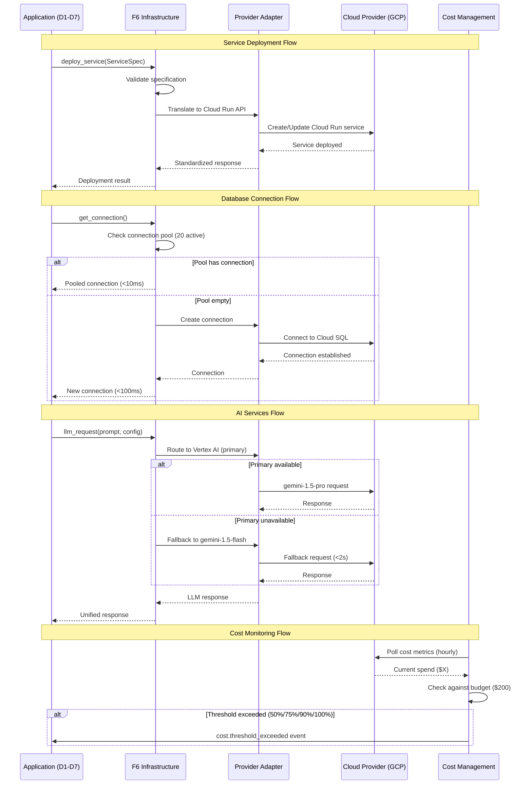
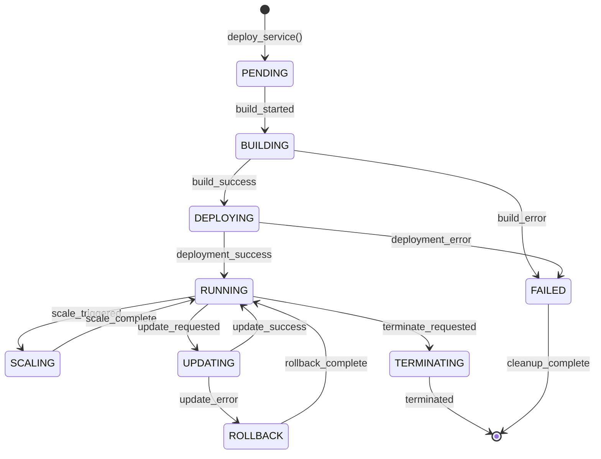
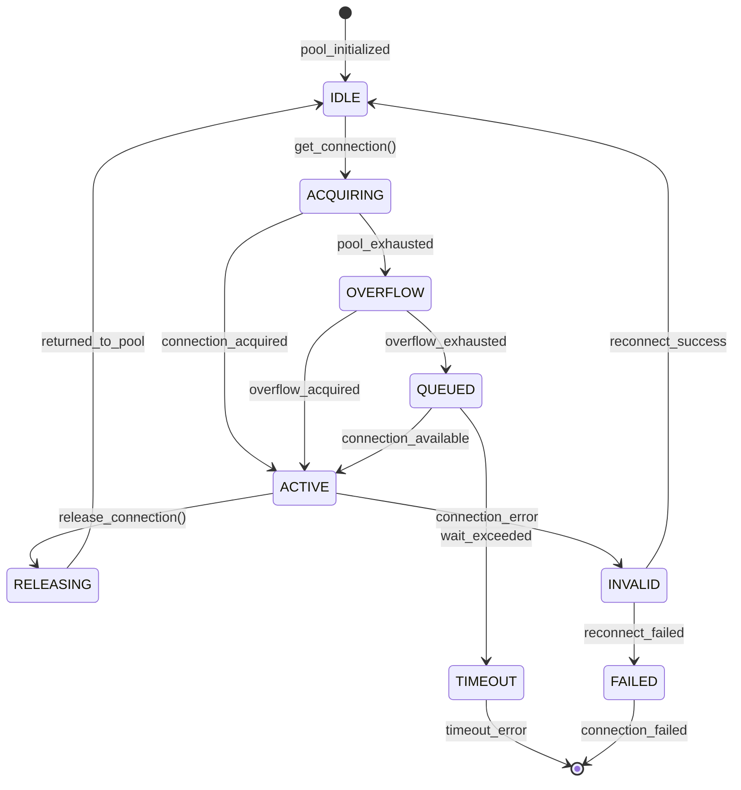
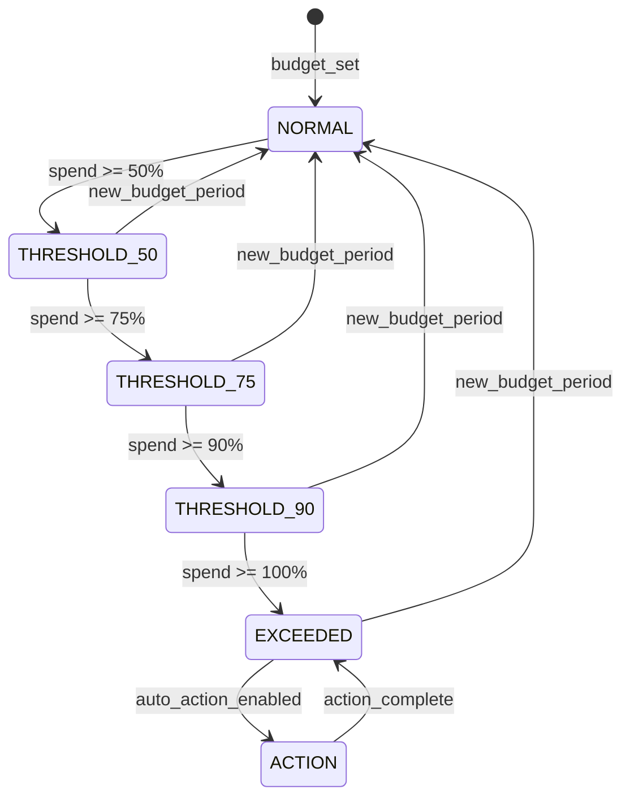

# PRD-06: F6 Infrastructure

**Upstream guardrails**: @brd: BRD-06

**Thresholds pointer**: Define thresholds once; reuse via `@threshold:` tags.

## 1. Document Control

| Item | Details |
|------|---------|
| **Status** | Draft |
| **Version** | 1.0.0 |
| **Date Created** | 2026-02-08 |
| **Last Updated** | 2026-02-08 |
| **Author** | AI Assistant |
| **Reviewer** | Technical Lead |
| **Approver** | Chief Architect |
| **BRD Reference** | @brd: BRD.06 |
| **Priority** | High (Foundation Module) |
| **Target Release** | Phase 1 (MVP) |
| **Estimated Effort** | 12 person-weeks |
| **SYS-Ready Score** | 92/100 (Target: >=85 for MVP) |
| **EARS-Ready Score** | 90/100 (Target: >=85 for MVP) |

### 1.1 Document Revision History

| Version | Date | Author | Changes Made |
|---------|------|--------|--------------|
| 1.0.0 | 2026-02-08 | AI Assistant | Initial PRD generated from BRD-06 |

---

## 2. Executive Summary

The F6 Infrastructure Module provides cloud-agnostic infrastructure abstraction for the AI Cost Monitoring Platform. It manages compute services (Cloud Run, ECS, Container Apps), database services (PostgreSQL with HA, pgvector, connection pooling), AI services (LLM gateway with ensemble voting and fallback), messaging (Pub/Sub event-driven architecture), storage (object storage and secret management), networking (VPC, load balancing, DNS, WAF), and cost management (budget controls, alerts, optimization) through provider adapters. This foundation module enables seamless multi-cloud deployment while maintaining domain-agnostic design with zero business logic coupling.

### 2.1 MVP Hypothesis

**We believe that** platform teams and domain layers **will** achieve cloud-agnostic deployment with predictable infrastructure costs **if we** implement a domain-agnostic infrastructure foundation module with provider adapters, unified APIs, and cost management capabilities.

**We will know this is true when**:
- 0 direct cloud SDK calls in application code
- 6/6 identified F6 gaps remediated
- Budget alerts triggered 100% before threshold exceeded

### 2.2 Timeline Overview

| Phase | Duration | Deliverables |
|-------|----------|--------------|
| Phase 1: Core Infrastructure | 3 weeks | GCP adapter, Cloud Run compute, Cloud SQL database, cost foundation |
| Phase 2: Services | 3 weeks | AI gateway (Vertex AI), Pub/Sub messaging, Cloud Storage, Secret Manager |
| Phase 3: Networking & Security | 3 weeks | VPC, load balancer, Cloud Armor WAF, SSL certificates |
| Phase 4: Gap Remediation | 3 weeks | Multi-region (GAP-F6-01), Blue-Green (GAP-F6-05), FinOps Dashboard (GAP-F6-03) |
| **Total MVP** | **12 weeks** | Full F6 module operational |

---

## 3. Problem Statement

### 3.1 Current State

- **Cloud vendor lock-in**: Direct SDK usage in application code prevents cloud portability
- **Manual cost tracking**: No automated budget controls or threshold alerting
- **Single region deployment**: Creates availability risk without failover capability
- **Deployment downtime**: No blue-green pattern for zero-downtime releases
- **Missing enterprise features**: No multi-region, Terraform export, or FinOps dashboard

### 3.2 Business Impact

- Migration effort: Full rewrite required for cloud provider changes (weeks of effort)
- Budget surprises: Reactive cost discovery instead of proactive alerting
- Service availability: Single point of failure without regional redundancy
- User experience: Deployment windows cause service interruptions
- Competitive disadvantage: Enterprise customers expect multi-cloud and FinOps capabilities

### 3.3 Opportunity

Unified infrastructure foundation module providing cloud-agnostic abstractions, automated cost management, multi-region deployment, and zero-downtime releases as a reusable foundation layer for all domain layers (D1-D7) and foundation modules (F1-F5, F7).

---

## 4. Target Audience & User Personas

### 4.1 Primary User Personas

**Platform Administrator** - Infrastructure configuration and cost monitoring

- **Key characteristic**: Responsible for infrastructure budgets and resource allocation
- **Main pain point**: Unpredictable cloud costs, manual resource management
- **Success criteria**: Budget alerts before overspend, cost visibility by service
- **Usage frequency**: Daily cost monitoring, weekly resource reviews

**DevOps Engineer** - Deployment and cloud resource management

- **Key characteristic**: Manages CI/CD pipelines and cloud infrastructure
- **Main pain point**: Cloud-specific deployment scripts, manual failover procedures
- **Success criteria**: Cloud-agnostic deployments, automated blue-green releases
- **Usage frequency**: Multiple deployments per day

### 4.2 Secondary Users

| Role | Purpose | Key Needs |
|------|---------|-----------|
| Developer | Integrate F6 APIs for infrastructure access | Cloud-agnostic SDKs, connection pooling |
| Security/Compliance Officer | Audit network isolation and encryption | VPC policies, WAF logs, encryption status |
| Technical Lead | Architecture decisions for infrastructure | Multi-cloud strategy, provider adapter design |
| Executive Sponsor | Budget approval and cloud strategy | Cost forecasts, vendor risk assessment |

---

## 5. Success Metrics (KPIs)

### 5.1 MVP Validation Metrics (30-Day)

| Metric | Baseline | Target | Measurement |
|--------|----------|--------|-------------|
| Direct cloud SDK calls | Unknown | 0 | Code scan audit |
| Service deployment success rate | N/A | >=99.9% | F3 metrics |
| Budget alert accuracy | N/A | 100% before threshold | Alert logs |
| Database failover time | N/A | <60 seconds | Failover tests |

### 5.2 Business Success Metrics (90-Day)

| Metric | Target | Decision Threshold |
|--------|--------|-------------------|
| Gap remediation | 6/6 addressed | <4/6 = Escalate |
| Infrastructure uptime | 99.9% | <99% = Critical |
| Cost forecast accuracy | +/-15% | >25% variance = Iterate |

### 5.3 Go/No-Go Decision Gate

**At MVP+90 days**, evaluate:
- **Proceed to Phase 2 (Enhancement)**: All targets met, 6/6 gaps addressed
- **Iterate**: 4-5 gaps addressed, performance targets partially met
- **Escalate**: <4 gaps addressed or critical uptime issues

---

## 6. Scope & Requirements

### 6.1 In-Scope (MVP Core Features)

| # | Feature | Priority | Description | BRD Ref |
|---|---------|----------|-------------|---------|
| 1 | Compute Services | P1-Must | Cloud Run primary, ECS/Container Apps adapters, auto-scaling | BRD.06.01.01 |
| 2 | Database Services | P1-Must | PostgreSQL HA, connection pooling, pgvector, migrations | BRD.06.01.02 |
| 3 | AI Services Gateway | P1-Must | Vertex AI primary, LLM ensemble, auto-fallback | BRD.06.01.03 |
| 4 | Messaging Services | P1-Must | Pub/Sub, dead-letter queues, provider adapters | BRD.06.01.04 |
| 5 | Storage Services | P1-Must | Cloud Storage, Secret Manager, lifecycle policies | BRD.06.01.05 |
| 6 | Networking | P1-Must | VPC, load balancing, Cloud Armor WAF, DNS | BRD.06.01.06 |
| 7 | Cost Management | P1-Must | Budget controls, threshold alerts, real-time reporting | BRD.06.01.07 |
| 8 | Multi-Region Deployment | P1-Must | Active-active, traffic routing, data replication (GAP-F6-01) | BRD.06.01.08 |
| 9 | Blue-Green Deployments | P1-Must | Zero-downtime releases, instant rollback (GAP-F6-05) | BRD.06.01.12 |
| 10 | FinOps Dashboard | P2-Should | Cost visualization, trend analysis, recommendations (GAP-F6-03) | BRD.06.01.10 |
| 11 | Hybrid Cloud | P3-Future | On-premises integration, VPN/interconnect (GAP-F6-02) | BRD.06.01.09 |
| 12 | Terraform Export | P3-Future | Infrastructure-as-Code export (GAP-F6-04) | BRD.06.01.11 |
| 13 | Database Sharding | P3-Future | Horizontal scaling, cross-shard queries (GAP-F6-06) | BRD.06.01.13 |

### 6.2 Dependencies

| Dependency | Type | Status | Impact | Owner |
|------------|------|--------|--------|-------|
| GCP Service Availability | External | Active | Core cloud provider | GCP |
| Vertex AI Model Access | External | Active | LLM gateway functionality | GCP |
| PostgreSQL 16 | Technical | Active | Database services | Platform Team |
| Redis (Memorystore) | Technical | Active | Session caching (F2) | Platform Team |

### 6.3 Out-of-Scope (Post-MVP)

- Domain-specific resource definitions (injected by domain layers D1-D7)
- Application-specific scaling policies (defined by consuming services)
- Mobile app infrastructure patterns
- Enterprise private cloud integration (v1.3.0 roadmap)
- Hybrid Cloud integration (P3)
- Terraform Export (P3)
- Database Sharding (P3)

---

## 7. User Stories & User Roles

### 7.1 Core User Stories

| ID | User Story | Priority | Acceptance Criteria | BRD Ref |
|----|------------|----------|---------------------|---------|
| PRD.06.09.01 | As a Developer, I want to deploy a service to Cloud Run, so that I have consistent deployment without cloud-specific code | P1 | Service deployed via F6 API, no direct SDK calls | BRD.06.09.01 |
| PRD.06.09.02 | As a Developer, I want to get a database connection with pooling, so that I have reliable database access with connection management | P1 | Connection acquired <100ms, pool managed | BRD.06.09.02 |
| PRD.06.09.03 | As a Developer, I want to access AI models via unified gateway, so that I have LLM ensemble with automatic fallback | P1 | Request success >=99.5%, fallback <2s | BRD.06.09.03 |
| PRD.06.09.04 | As a Service, I want to publish events to message queue, so that I have async communication between services | P1 | Message delivered >=99.99%, latency <100ms | BRD.06.09.04 |
| PRD.06.09.05 | As a Developer, I want to store and retrieve secrets, so that I have secure credential management | P1 | Secret retrieval <50ms, AES-256 encrypted | BRD.06.09.05 |
| PRD.06.09.06 | As an Admin, I want to view current infrastructure costs, so that I can monitor budget and forecast spend | P1 | Real-time cost by service, <1 hour latency | BRD.06.09.06 |
| PRD.06.09.07 | As an Admin, I want to receive cost threshold alerts, so that I can prevent budget overruns | P2 | Alerts at 50%, 75%, 90%, 100% thresholds | BRD.06.09.07 |
| PRD.06.09.08 | As a Developer, I want to scale service instances, so that I can respond to demand changes | P1 | Auto-scaling response <30s | BRD.06.09.08 |
| PRD.06.09.09 | As a Developer, I want to upload files to object storage, so that I have durable file storage with lifecycle management | P2 | Upload success >=99.9%, encryption 100% | BRD.06.09.09 |
| PRD.06.09.10 | As an Admin, I want to configure network security rules, so that I have VPC isolation and firewall management | P1 | WAF blocks 100% known attacks | BRD.06.09.10 |

### 7.2 User Roles

| Role | Purpose | Permissions |
|------|---------|-------------|
| Developer | Integrate F6 APIs, deploy services | Service deployment, connection pooling, AI access |
| Platform Admin | Configure infrastructure, monitor costs | Budget controls, network rules, scaling policies |
| DevOps Engineer | Manage cloud resources, CI/CD | Deployment automation, blue-green releases |
| Security Officer | Audit access, validate encryption | WAF configuration, VPC policies, audit logs |

### 7.3 Story Summary

| Priority | Count | Notes |
|----------|-------|-------|
| P1 (Must-Have) | 8 | Required for MVP launch |
| P2 (Should-Have) | 2 | Include if time permits |
| **Total** | 10 | |

---

## 8. Functional Requirements

### 8.1 Core Capabilities

| ID | Capability | Success Criteria | BRD Ref |
|----|------------|------------------|---------|
| PRD.06.01.01 | Compute Services | Cloud Run deployment >=99.9% success, auto-scale <30s, cold start <2s | BRD.06.01.01 |
| PRD.06.01.02 | Database Services | Connection <100ms, failover <60s, backup 100%, pgvector operational | BRD.06.01.02 |
| PRD.06.01.03 | AI Services Gateway | LLM success >=99.5%, fallback <2s, embedding <500ms | BRD.06.01.03 |
| PRD.06.01.04 | Messaging Services | Delivery >=99.99%, publish <100ms, dead-letter 100% | BRD.06.01.04 |
| PRD.06.01.05 | Storage Services | Upload >=99.9%, secret <50ms, encryption 100% | BRD.06.01.05 |
| PRD.06.01.06 | Networking | Load balancer 99.99%, SSL managed, WAF 100% known attacks | BRD.06.01.06 |
| PRD.06.01.07 | Cost Management | Alert 100% before threshold, reporting <1hr, forecast +/-15% | BRD.06.01.07 |
| PRD.06.01.08 | Multi-Region Deployment | Failover <5min, consistency <30s | BRD.06.01.08 |
| PRD.06.01.12 | Blue-Green Deployments | Downtime 0s, rollback <30s | BRD.06.01.12 |

### 8.2 User Journey (Happy Path)



### 8.3 Error Handling (MVP)

| Error Scenario | User Experience | System Behavior |
|----------------|-----------------|-----------------|
| Cloud provider timeout | Retry with exponential backoff | 3 retries, then error with provider status |
| Database connection exhausted | "Service temporarily unavailable" | Queue request, expand overflow pool |
| LLM primary unavailable | Transparent fallback | Auto-switch to fallback model <2s |
| Message delivery failed | Message to dead-letter queue | DLQ capture, retry configurable |
| Budget exceeded | Admin notification, optional auto-action | Alert triggered, logging enabled |
| Secret not found | "Configuration error" | 404 response, audit log entry |

---

## 9. Quality Attributes

### 9.1 Performance (@threshold: f6_performance)

| Metric | Target | Notes |
|--------|--------|-------|
| Service deployment | <60s | End-to-end deployment time |
| Database connection | <100ms | Connection acquisition from pool |
| Secret retrieval | <50ms | p95 |
| Message publish | <100ms | p95 |
| Cost report generation | <5s | On-demand report |
| LLM fallback activation | <2s | Time to switch models |
| Auto-scaling response | <30s | Scale-up decision to running |
| Cold start | <2s | Container initialization |

### 9.2 Security (@threshold: f6_security)

- [x] VPC isolation with private subnets
- [x] IAM roles and service accounts for all access
- [x] TLS 1.3 encryption in transit for all connections
- [x] AES-256 encryption at rest for storage and secrets
- [x] Cloud Armor WAF with OWASP rules
- [x] Full API and access audit logging
- [x] Customer-managed encryption keys optional

### 9.3 Availability (@threshold: f6_availability)

| Metric | Target |
|--------|--------|
| Compute service uptime | 99.9% |
| Database uptime | 99.95% |
| Messaging service uptime | 99.99% |
| Load balancer availability | 99.99% |
| Recovery time (RTO) | <5 minutes |
| Recovery point (RPO) | <1 hour |

### 9.4 Scalability (@threshold: f6_scalability)

| Metric | Target |
|--------|--------|
| Concurrent service instances | 100 |
| Database connections (pooled) | 30 (20 active + 10 overflow) |
| Messages per second | 10,000 |
| Storage capacity | 100 TB |
| Multi-region support | 2+ regions |

---

## 10. Architecture Requirements

### 10.1 Infrastructure (PRD.06.32.01)

**Status**: [X] Selected

**Business Driver**: Multi-cloud portability and vendor risk mitigation

**MVP Approach**: GCP primary (Cloud Run, Cloud SQL, Vertex AI) with AWS (ECS, RDS, Bedrock) and Azure (Container Apps, Azure SQL, OpenAI) adapter support

**Rationale**: GCP provides integrated AI services; adapter pattern enables future cloud migration without application changes.

**Estimated Cost**: ~$200/month (budget cap)

@brd: BRD.06.10.01, BRD.06.10.02

---

### 10.2 Data Architecture (PRD.06.32.02)

**Status**: [X] Selected

**Business Driver**: Relational data with vector storage for AI workloads

**MVP Approach**:
- PostgreSQL 16 with pgvector extension via Cloud SQL
- Connection pooling: 20 active, 10 overflow, 30s timeout
- Automated backups: 7-day retention, point-in-time recovery
- Storage tier: db-custom-2-4096 (2 vCPU, 4GB RAM, 50GB SSD)

**Rationale**: PostgreSQL with pgvector supports both relational data and embedding storage; Cloud SQL provides managed HA.

@brd: BRD.06.10.03, BRD.06.10.04

---

### 10.3 Integration (PRD.06.32.03)

**Status**: [X] Selected

**Business Driver**: Event-driven architecture for async service communication

**MVP Approach**:
- Cloud Pub/Sub primary with SNS/SQS (AWS) and Service Bus (Azure) adapters
- At-least-once delivery, optional per-key ordering
- Dead-letter queues with exponential backoff retry

**Rationale**: Pub/Sub provides reliable messaging with provider adapters for multi-cloud support.

@brd: BRD.06.10.05

---

### 10.4 Security (PRD.06.32.04)

**Status**: [X] Selected

**Business Driver**: Defense-in-depth with WAF and DDoS protection

**MVP Approach**:
- VPC with 10.0.0.0/16 CIDR, private subnets, Private Google Access
- Cloud Armor WAF with OWASP rules, DDoS protection
- TLS 1.3 in transit, AES-256-GCM at rest
- Managed SSL certificates with auto-renewal
- Optional geo-blocking for regional restrictions

**Rationale**: Comprehensive security posture meeting enterprise requirements.

@brd: BRD.06.10.06, BRD.06.10.07

---

### 10.5 Observability (PRD.06.32.05)

**Status**: [ ] Pending

**Business Driver**: Visibility into infrastructure health and cost

**Options**: Cloud Monitoring native, third-party APM (Datadog), hybrid approach

**PRD Requirements**: Metric collection for all F6 services, alerting thresholds, cost dashboard design

**Rationale**: ADR required to evaluate integration complexity and cost.

@brd: BRD.06.10.08

---

### 10.6 AI/ML (PRD.06.32.06)

**Status**: [X] Selected

**Business Driver**: Unified AI access with multi-model support

**MVP Approach**:
- Vertex AI Model Garden primary (gemini-1.5-pro, 2M context)
- Auto-fallback chain: gemini-1.5-pro -> gemini-1.5-flash
- 4-model LLM ensemble voting with confidence scores
- Provider adapters: AWS Bedrock (Claude, Titan), Azure OpenAI
- Text embeddings: text-embedding-004 (768 dimensions)

**Rationale**: Vertex AI provides integrated AI services; ensemble voting improves accuracy; fallback ensures availability.

@brd: BRD.06.10.09

---

### 10.7 Technology Selection (PRD.06.32.07)

**Status**: [ ] Pending

**Business Driver**: Consistent interface across cloud providers

**Options**: Abstract factory pattern, adapter pattern, plugin architecture

**PRD Requirements**: Interface design, provider registration mechanism, fallback behavior specification

**Rationale**: ADR required to evaluate extensibility, testing, and maintenance tradeoffs.

@brd: BRD.06.10.10

---

## 11. Constraints & Assumptions

### 11.1 Constraints

| ID | Category | Description | Impact |
|----|----------|-------------|--------|
| PRD.06.03.01 | Platform | GCP as primary cloud provider | Provider-specific optimizations |
| PRD.06.03.02 | Technology | PostgreSQL for relational data | Database portability limited |
| PRD.06.03.03 | Budget | $200/month infrastructure budget | Limits resource allocation |
| PRD.06.03.04 | Region | us-central1 as primary region | Latency for non-US users |
| PRD.06.03.05 | Resource | 12 person-weeks development | Timeline constraint |

### 11.2 Assumptions

| ID | Assumption | Risk | Validation |
|----|------------|------|------------|
| PRD.06.04.01 | GCP service availability meets 99.9% SLA | Medium | Monitor GCP status dashboard |
| PRD.06.04.02 | Vertex AI model availability for LLM requests | Medium | Model quota monitoring |
| PRD.06.04.03 | Development team has GCP experience | Low | Skills assessment |
| PRD.06.04.04 | Monthly budget sufficient for MVP workload | Medium | Cost monitoring |
| PRD.06.04.05 | Provider adapter pattern scales to 3 clouds | Low | Architecture review |

---

## 12. Risk Assessment

| Risk ID | Risk Description | Likelihood | Impact | Mitigation | Owner |
|---------|------------------|------------|--------|------------|-------|
| PRD.06.07.01 | Cloud provider lock-in | Medium | High | Multi-provider adapter pattern, abstraction layer | Architect |
| PRD.06.07.02 | Budget overrun | Medium | Medium | Threshold alerts at 50/75/90/100%, auto-scaling limits | Platform Admin |
| PRD.06.07.03 | Single region failure | Low | Critical | Multi-region deployment (GAP-F6-01) | DevOps |
| PRD.06.07.04 | Deployment downtime | Medium | High | Blue-green deployment (GAP-F6-05) | DevOps |
| PRD.06.07.05 | AI service unavailability | Low | High | Multi-provider fallback chain (Vertex -> Bedrock -> OpenAI) | Architect |
| PRD.06.07.06 | Database connection exhaustion | Medium | High | Connection pooling, overflow capacity | Platform Admin |
| PRD.06.07.07 | Provider adapter complexity | Medium | Medium | Standard interface contracts, integration testing | Technical Lead |

---

## 13. Implementation Approach

### 13.1 MVP Development Phases

| Phase | Duration | Deliverables | Success Criteria |
|-------|----------|--------------|------------------|
| **Phase 1: Core Infrastructure** | 3 weeks | GCP provider adapter, Cloud Run compute, Cloud SQL database, cost foundation | Deployment 99.9% success, connection <100ms |
| **Phase 2: Services** | 3 weeks | AI gateway (Vertex AI), Pub/Sub messaging, Cloud Storage, Secret Manager | LLM 99.5% success, messaging 99.99% |
| **Phase 3: Networking & Security** | 3 weeks | VPC configuration, load balancer, Cloud Armor WAF, SSL certificates | WAF blocks attacks, SSL auto-renewal |
| **Phase 4: Gap Remediation** | 3 weeks | Multi-region (GAP-F6-01), Blue-Green (GAP-F6-05), FinOps Dashboard (GAP-F6-03) | Failover <5min, downtime 0s |

### 13.2 Testing Strategy (MVP)

| Test Type | Coverage | Responsible |
|-----------|----------|-------------|
| Unit Tests | 80% minimum | Development |
| Integration Tests | Provider adapters, service flows | Development |
| Performance Tests | Latency targets per @threshold | QA |
| Security Tests | VPC isolation, encryption, WAF | Security |
| Failover Tests | Database HA, regional failover | DevOps |
| UAT | Core user stories (10) | Product/QA |

---

## 14. Acceptance Criteria

### 14.1 Business Acceptance

- [ ] All P1 functional requirements (9 capabilities) implemented
- [ ] 0 direct cloud SDK calls in application code
- [ ] Budget alerts triggered before threshold exceeded
- [ ] Multi-region deployment operational (GAP-F6-01)
- [ ] Blue-green deployment operational (GAP-F6-05)
- [ ] KPIs instrumented via F3 Observability

### 14.2 Technical Acceptance

- [ ] Cloud Run deployment >=99.9% success rate
- [ ] Database failover <60 seconds
- [ ] LLM fallback activation <2 seconds
- [ ] Message delivery >=99.99%
- [ ] Performance targets met per Section 9.1
- [ ] Security baseline per Section 9.2 checked
- [ ] Logging/monitoring enabled

### 14.3 QA Acceptance

- [ ] All P1 test cases passed
- [ ] No critical bugs open
- [ ] Provider adapter integration tests passed
- [ ] Failover tests completed successfully
- [ ] Basic API documentation ready
- [ ] Runbook for infrastructure administration created

---

## 15. Budget & Resources

### 15.1 MVP Development Cost

| Category | Estimate | Notes |
|----------|----------|-------|
| Development | 12 person-weeks | Foundation module priority |
| Infrastructure (Monthly) | $200 | Budget cap |
| Cloud SQL | ~$80/month | db-custom-2-4096, HA enabled |
| Cloud Run | ~$50/month | Auto-scaling, scale-to-zero |
| Vertex AI | Usage-based | ~$40/month estimated |
| Storage/Networking | ~$30/month | Cloud Storage, load balancer |
| **Total MVP Cost** | **12 person-weeks + $200/month** | |

### 15.2 ROI Hypothesis

**Investment**: 12 person-weeks development + $200/month infrastructure

**Expected Return**:
- Cloud migration effort reduced from weeks to days (adapter swap)
- 100% budget alert accuracy (vs reactive discovery)
- Zero deployment downtime (vs maintenance windows)
- Foundation for all domain layers (D1-D7) and modules (F1-F5, F7)

**Decision Logic**: If MVP metrics met, proceed to Phase 2 enhancements (P2/P3 features).

---

## 16. Traceability

### 16.1 Upstream References

| Source | Document | Relationship |
|--------|----------|--------------|
| BRD | @brd: BRD-06 | Business requirements source |
| Technical Spec | F6 Infrastructure Technical Specification | Technical requirements source |
| Gap Analysis | GAP_Foundation_Module_Gap_Analysis | 6 F6 gaps identified |

### 16.2 Downstream Artifacts

| Artifact Type | Status | Notes |
|---------------|--------|-------|
| EARS | Pending | Create after PRD approval |
| BDD | Pending | Compute, database, AI, messaging scenarios |
| ADR | Pending | Cloud Provider Strategy, Observability, Provider Adapter Framework |
| SYS | Pending | System requirements |

### 16.3 Traceability Tags

```markdown
@brd: BRD.06.01.01, BRD.06.01.02, BRD.06.01.03, BRD.06.01.04, BRD.06.01.05, BRD.06.01.06, BRD.06.01.07, BRD.06.01.08, BRD.06.01.09, BRD.06.01.10, BRD.06.01.11, BRD.06.01.12, BRD.06.01.13
@brd: BRD.06.23.01, BRD.06.23.02, BRD.06.23.03
@brd: BRD.06.10.01, BRD.06.10.02, BRD.06.10.03, BRD.06.10.04, BRD.06.10.05, BRD.06.10.06, BRD.06.10.07, BRD.06.10.08, BRD.06.10.09, BRD.06.10.10
```

### 16.4 Cross-Links (Same-Layer)

@depends: None (Foundation infrastructure module)
@discoverability: PRD-01 (F1 IAM - PostgreSQL user profiles, Secret Manager credentials); PRD-02 (F2 Session - PostgreSQL workspace storage, Redis cache); PRD-03 (F3 Observability - Cloud Logging/Monitoring/Trace); PRD-04 (F4 SecOps - Cloud Armor WAF, VPC firewall); PRD-05 (F5 Self-Ops - Cloud Run scaling, health checks); PRD-07 (F7 Config - configuration storage, Secret Manager)

---

## 17. Glossary

| Term | Definition |
|------|------------|
| Provider Adapter | Abstraction layer translating F6 API calls to cloud-specific SDKs |
| Connection Pool | Managed set of reusable database connections with configurable limits |
| LLM Ensemble | Multiple AI models voting on responses for improved accuracy |
| Blue-Green Deployment | Zero-downtime release pattern with parallel environments |
| FinOps | Financial operations discipline for cloud cost management |
| pgvector | PostgreSQL extension for vector similarity search (embeddings) |
| Dead-Letter Queue | Queue for messages that cannot be processed after retry exhaustion |
| WAF | Web Application Firewall with OWASP rule sets |
| Cloud Armor | GCP-managed WAF and DDoS protection service |

**Master Glossary Reference**: See [BRD-00_GLOSSARY.md](../01_BRD/BRD-00_GLOSSARY.md)

---

## 18. Appendix A: Future Roadmap (Post-MVP)

### 18.1 Phase 2 Features (If MVP Succeeds)

| Feature | Priority | Estimated Effort | Dependency |
|---------|----------|------------------|------------|
| Hybrid Cloud | P3 | 4 weeks | MVP complete |
| Terraform Export | P3 | 2 weeks | MVP complete |
| Database Sharding | P3 | 4 weeks | MVP complete |
| AWS/Azure Full Parity | P2 | 3 weeks | Provider adapters tested |

### 18.2 Scaling Considerations

- **Infrastructure**: Increase Cloud Run max instances for >100 concurrent services
- **Database**: Implement read replicas for high-read workloads
- **Multi-Region**: Extend to 3+ regions for global deployment
- **Cost Optimization**: Enable committed use discounts for production workloads

---

## 19. EARS Enhancement Appendix

### 19.1 Timing Profile Matrix (@threshold: f6_timing)

| Operation | p50 | p95 | p99 | Unit |
|-----------|-----|-----|-----|------|
| Service deployment | 30s | 60s | 90s | seconds |
| Database connection | 50ms | 100ms | 150ms | ms |
| Secret retrieval | 25ms | 50ms | 75ms | ms |
| Message publish | 50ms | 100ms | 150ms | ms |
| LLM request (primary) | 500ms | 2s | 5s | seconds |
| LLM fallback activation | 1s | 2s | 3s | seconds |
| Cost report generation | 2s | 5s | 8s | seconds |
| Auto-scaling response | 15s | 30s | 45s | seconds |
| Cold start | 1s | 2s | 3s | seconds |
| Database failover | 30s | 60s | 90s | seconds |
| Regional failover | 3min | 5min | 7min | minutes |
| Blue-green rollback | 15s | 30s | 45s | seconds |

### 19.2 Boundary Value Matrix

| Parameter | Min | Max | Default | Unit |
|-----------|-----|-----|---------|------|
| Cloud Run instances | 1 | 10 | 1 | count |
| Cloud Run CPU | 1 | 4 | 2 | vCPU |
| Cloud Run memory | 512 | 8192 | 4096 | MiB |
| Cloud Run timeout | 60 | 3600 | 300 | seconds |
| Cloud Run concurrency | 1 | 250 | 80 | requests |
| DB pool size (active) | 5 | 50 | 20 | connections |
| DB pool overflow | 0 | 20 | 10 | connections |
| DB connection timeout | 10 | 60 | 30 | seconds |
| DB storage | 10 | 500 | 50 | GB |
| Budget monthly limit | 50 | 10000 | 200 | USD |
| Budget alert thresholds | 25 | 100 | 50,75,90,100 | percent |
| Message retry count | 1 | 10 | 5 | count |
| Message ack deadline | 10 | 600 | 60 | seconds |
| Object storage size | 0 | 100 | 10 | TB |
| Secret versions | 1 | 100 | 25 | count |

### 19.3 State Transition Diagrams

#### 19.3.1 Service Deployment State Machine



#### 19.3.2 Database Connection State Machine



#### 19.3.3 Cost Alert State Machine



### 19.4 Fallback Documentation

| Failure | Fallback Behavior | User Experience | Recovery |
|---------|-------------------|-----------------|----------|
| Cloud Run unavailable | Queue requests, scale backup region | Slightly increased latency | Auto-recovery on service restore |
| Cloud SQL primary down | Automatic failover to standby (<60s) | Brief connection reset | Transparent to application |
| Vertex AI unavailable | Auto-fallback to gemini-1.5-flash (<2s) | Slightly reduced capability | Return to primary on recovery |
| Vertex AI and fallback down | Route to Bedrock/OpenAI adapter | Model switch notification | Prefer primary on recovery |
| Pub/Sub unavailable | Dead-letter queue, retry with backoff | Message delivery delayed | Auto-retry on restore |
| Secret Manager unavailable | Use cached secrets (5min TTL) | Stale secrets possible | Refresh on recovery |
| Cloud Storage unavailable | Retry with exponential backoff | Upload delayed | Auto-retry on restore |
| Load balancer health check fail | Remove instance from pool | Traffic routed to healthy instances | Re-add on health restore |
| WAF rule triggered | Block request, log event | 403 Forbidden response | Review and whitelist if false positive |
| Budget exceeded | Alert notification, optional auto-action | Admin notification, potential throttling | New budget period or manual increase |

### 19.5 Provider Adapter Interface Specification

```
Interface: InfrastructureProvider
Methods:
  - deploy_service(spec: ServiceSpec) -> DeploymentResult
  - scale_service(service_id: str, replicas: int) -> ScaleResult
  - get_connection(config: DBConfig) -> Connection
  - publish_message(topic: str, message: bytes) -> PublishResult
  - store_object(bucket: str, key: str, data: bytes) -> StoreResult
  - get_secret(name: str, version: str) -> SecretValue
  - llm_request(prompt: str, config: LLMConfig) -> LLMResponse

Implementations:
  - GCPProvider (primary)
  - AWSProvider (adapter)
  - AzureProvider (adapter)
```

---

**Document Version**: 1.0.0
**Template Version**: MVP 1.0
**Last Updated**: 2026-02-08
**Maintained By**: AI Assistant

---

*PRD-06: F6 Infrastructure - AI Cost Monitoring Platform v4.2*
