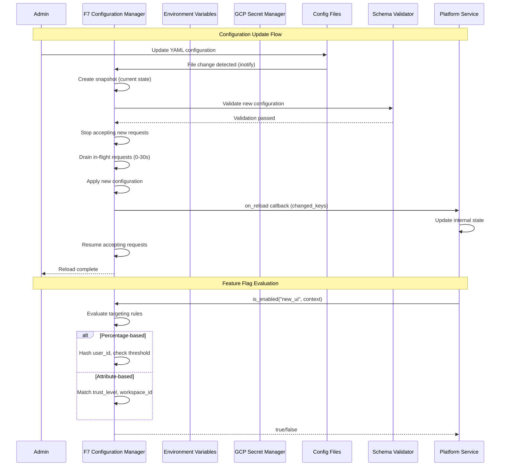
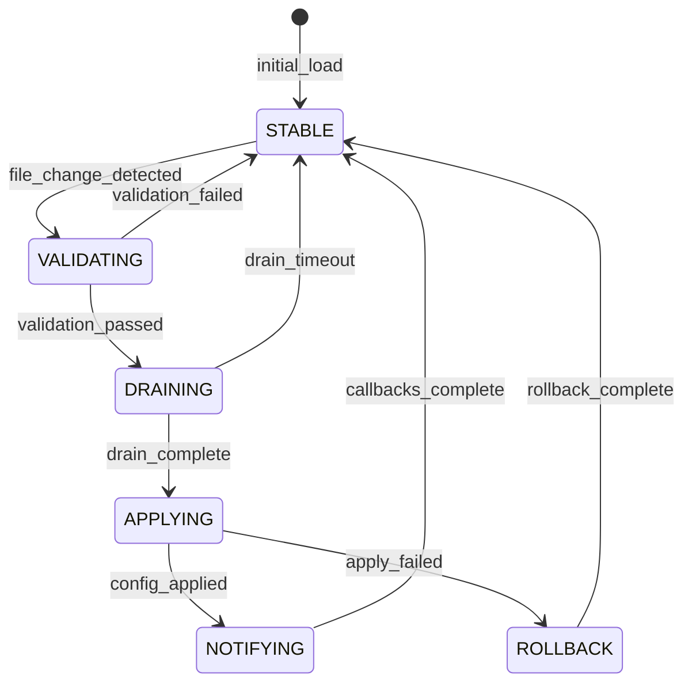
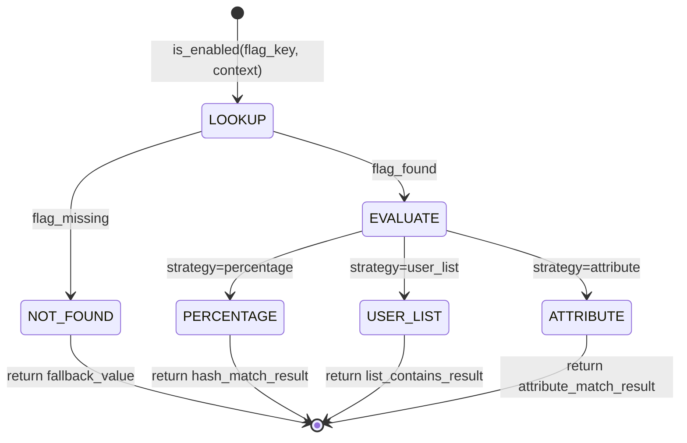

# PRD-07: F7 Configuration Manager

**Upstream guardrails**: @brd: BRD-07

**Thresholds pointer**: Define thresholds once; reuse via `@threshold:` tags.

## 1. Document Control

| Item | Details |
|------|---------|
| **Status** | Draft |
| **Version** | 1.0.0 |
| **Date Created** | 2026-02-08T00:00:00 |
| **Last Updated** | 2026-02-08T00:00:00 |
| **Author** | AI Assistant |
| **Reviewer** | Technical Lead |
| **Approver** | Chief Architect |
| **BRD Reference** | @brd: BRD.07 |
| **Priority** | High (Foundation Module) |
| **Target Release** | Phase 1 (MVP) |
| **Estimated Effort** | 10 person-weeks |
| **SYS-Ready Score** | 92/100 (Target: >=85 for MVP) |
| **EARS-Ready Score** | 90/100 (Target: >=85 for MVP) |

### 1.1 Document Revision History

| Version | Date | Author | Changes Made |
|---------|------|--------|--------------|
| 1.0.0 | 2026-02-08T00:00:00 | AI Assistant | Initial PRD generated from BRD-07 |

---

## 2. Executive Summary

The F7 Configuration Manager Module provides centralized configuration management for the AI Cost Monitoring Platform. It implements multi-source configuration loading (environment variables, secrets, files, defaults), YAML schema validation with type coercion, hot-reload without service restarts, feature flags with targeting policies, AI-powered configuration optimization, and version control with rollback capabilities. This foundation module is domain-agnostic and serves as the single source of truth for all configuration consumed by Foundation (F1-F6) and Domain (D1-D7) modules.

### 2.1 MVP Hypothesis

**We believe that** platform modules and administrators **will** achieve zero-downtime configuration changes and progressive feature rollouts **if we** implement a domain-agnostic configuration management module with multi-source loading, schema validation, hot-reload, and feature flags.

**We will know this is true when**:
- Configuration change completion <5 seconds (zero restarts)
- 100% schema validation coverage for all configurations
- Feature flag evaluation latency <5ms
- 6/6 identified F7 gaps remediated

### 2.2 Timeline Overview

| Phase | Duration | Deliverables |
|-------|----------|--------------|
| Phase 1: Core Configuration | 2 weeks | Multi-source loading, schema validation, type coercion |
| Phase 2: Hot Reload & Flags | 3 weeks | Graceful hot-reload, feature flag system, targeting |
| Phase 3: Version Control & Security | 2 weeks | Snapshots, rollback, encryption |
| Phase 4: Gap Remediation | 3 weeks | Config testing, drift detection, schema registry |
| **Total MVP** | **10 weeks** | Full F7 module operational |

---

## 3. Problem Statement

### 3.1 Current State

- **Service restart required**: Platform modules require restarts for configuration changes, causing downtime
- **No centralized validation**: Configuration errors reach production due to lack of schema validation
- **All-or-nothing releases**: Features must be released to all users simultaneously without gradual rollout
- **Missing configuration audit**: No version control or rollback capability for configuration changes
- **Inconsistent patterns**: Each module implements its own configuration handling

### 3.2 Business Impact

- Service disruptions: Each configuration change causes 2-5 minutes downtime per service restart
- Production incidents: 15% of incidents attributed to configuration errors reaching production
- Release friction: Risk-averse deployments due to inability to roll back features
- Operational overhead: Manual tracking of configuration changes across environments

### 3.3 Opportunity

Unified configuration management module providing schema validation, hot-reload, feature flags, and version control as a reusable foundation layer consumed by all platform modules.

---

## 4. Target Audience & User Personas

### 4.1 Primary User Personas

**Platform Administrator** - Configuration and feature flag manager

- **Key characteristic**: Manages system settings and feature rollouts across environments
- **Main pain point**: Configuration changes require coordinated restarts, no rollback capability
- **Success criteria**: Zero-downtime config changes, instant rollback, targeted feature releases
- **Usage frequency**: Daily, multiple configuration operations

**Service (F1-F6, D1-D7)** - Platform module consuming configuration

- **Key characteristic**: Requires consistent, validated configuration at runtime
- **Main pain point**: Configuration parsing, validation, and hot-reload implementation per module
- **Success criteria**: Single API for all config access, automatic hot-reload callbacks
- **Usage frequency**: Every service request

### 4.2 Secondary Users

| Role | Purpose | Key Needs |
|------|---------|-----------|
| DevOps Engineer | Deploy and manage configuration | Secret management, environment overrides, drift detection |
| Security/Compliance Officer | Audit configuration changes | Encryption verification, change audit trail, sensitive value protection |
| Development Team | Integrate F7 APIs | Schema definition, hot-reload callbacks, feature flag consumption |

---

## 5. Success Metrics (KPIs)

### 5.1 MVP Validation Metrics (30-Day)

| Metric | Baseline | Target | Measurement |
|--------|----------|--------|-------------|
| Configuration change downtime | Minutes (restart) | <5 seconds | Hot-reload completion time |
| Schema validation coverage | Manual review | 100% | Validation pass rate |
| Feature flag evaluation latency | N/A | <5ms | p95 via F3 Observability |
| Rollback completion time | N/A | <30 seconds | Version control metrics |

### 5.2 Business Success Metrics (90-Day)

| Metric | Target | Decision Threshold |
|--------|--------|-------------------|
| Gap remediation | 6/6 addressed | <4/6 = Escalate |
| Module integration | 100% F1-F6, D1-D7 consuming F7 | <80% = Iterate |
| Configuration service uptime | 99.9% | <99% = Critical |
| Config-related incidents | 50% reduction | <25% reduction = Investigate |

### 5.3 Go/No-Go Decision Gate

**At MVP+90 days**, evaluate:
- **Proceed to Phase 2 (Enhancement)**: All targets met, 6/6 gaps addressed
- **Iterate**: 4-5 gaps addressed, performance targets partially met
- **Escalate**: <4 gaps addressed or critical uptime issues

---

## 6. Scope & Requirements

### 6.1 In-Scope (MVP Core Features)

| # | Feature | Priority | Description | BRD Ref |
|---|---------|----------|-------------|---------|
| 1 | Multi-Source Configuration Loading | P1-Must | Environment > Secrets > Files > Defaults priority | BRD.07.01.01 |
| 2 | Schema Validation | P1-Must | YAML schema validation with type coercion | BRD.07.01.02 |
| 3 | Hot Reload | P1-Must | Graceful reload with connection draining | BRD.07.01.03 |
| 4 | Feature Flags | P1-Must | Percentage, user list, attribute targeting | BRD.07.01.04 |
| 5 | Configuration Encryption | P1-Must | AES-256-GCM for sensitive values | BRD.07.02.01 |
| 6 | Version Control | P1-Must | Snapshots, rollback, change audit | BRD.07.01.06 |
| 7 | Config Testing Framework | P1-Must | Dry-run validation, staging tests (GAP-F7-03) | BRD.07.01.09 |
| 8 | External Flag Service Integration | P2-Should | LaunchDarkly/Split adapter (GAP-F7-01) | BRD.07.01.07 |
| 9 | Config Drift Detection | P2-Should | Cross-environment drift detection (GAP-F7-02) | BRD.07.01.08 |
| 10 | Schema Registry | P2-Should | Versioned schema storage (GAP-F7-06) | BRD.07.01.12 |
| 11 | AI Optimization | P2-Should | NL-to-YAML, security checks, optimization | BRD.07.01.05 |
| 12 | Staged Rollouts for Config | P3-Future | Percentage-based config deployment (GAP-F7-04) | BRD.07.01.10 |
| 13 | Config API Gateway | P3-Future | RESTful API with rate limiting (GAP-F7-05) | BRD.07.01.11 |

### 6.2 Dependencies

| Dependency | Type | Status | Impact | Owner |
|------------|------|--------|--------|-------|
| BRD-06 (F6 Infrastructure) | Upstream | Active | PostgreSQL, GCP Secret Manager, storage | Platform Team |
| BRD-01 (F1 IAM) | Downstream | Active | F7 provides oauth2_clients config, trust level policies | IAM Team |
| BRD-02 (F2 Session) | Downstream | Active | F7 provides session timeout settings, cache TTL | Session Team |
| BRD-03 (F3 Observability) | Downstream | Active | F7 provides logging levels, alert thresholds | Observability Team |
| BRD-04 (F4 SecOps) | Downstream | Active | F7 provides security policy config, rate limits | SecOps Team |
| BRD-05 (F5 Self-Ops) | Upstream | Active | Remediation playbook triggers for config changes | Self-Ops Team |

### 6.3 Out-of-Scope (Post-MVP)

- Domain-specific configuration schemas (injected by domain layers D1-D7)
- Configuration UI (covered by D2 Adaptive UI)
- Secret generation and rotation (handled by F6 Infrastructure)
- Enterprise LDAP/AD integration (v1.3.0 roadmap)
- Staged Rollouts (P3)
- Config API Gateway (P3)

---

## 7. User Stories & User Roles

### 7.1 Core User Stories

| ID | User Story | Priority | Acceptance Criteria | BRD Ref |
|----|------------|----------|---------------------|---------|
| PRD.07.09.01 | As a Service, I want to load configuration from multiple sources, so that I get environment-aware config without code changes | P1 | Config resolved via Environment > Secrets > Files > Defaults | BRD.07.09.01 |
| PRD.07.09.02 | As a Service, I want configuration validated against schema, so that invalid configs are rejected before breaking services | P1 | Schema validation enforced, type coercion applied | BRD.07.09.02 |
| PRD.07.09.03 | As an Admin, I want to update configuration without restart, so that changes apply with zero downtime | P1 | Hot-reload <5s, zero request drops | BRD.07.09.03 |
| PRD.07.09.04 | As an Admin, I want to enable feature flag for user subset, so that I can progressively rollout features | P1 | Percentage, user list, attribute targeting functional | BRD.07.09.04 |
| PRD.07.09.05 | As a Service, I want encrypted access to secrets, so that sensitive values are protected from exposure | P1 | AES-256-GCM encryption, sensitive patterns redacted in logs | BRD.07.09.05 |
| PRD.07.09.06 | As an Admin, I want to rollback to previous configuration, so that I can recover from bad config deployment | P1 | Rollback <30s, snapshot history preserved | BRD.07.09.06 |
| PRD.07.09.07 | As a Developer, I want config change notifications, so that I can react to updates programmatically | P2 | Callback invoked on reload, changed keys provided | BRD.07.09.07 |
| PRD.07.09.08 | As an Admin, I want to view configuration diff between snapshots, so that I can audit changes over time | P2 | Diff view between any two snapshots | BRD.07.09.08 |
| PRD.07.09.09 | As an Admin, I want to test configuration before deployment, so that I can validate configs in staging | P2 | Dry-run mode, staging test support | BRD.07.09.09 |
| PRD.07.09.10 | As a Service, I want AI-powered config recommendations, so that I can optimize configuration for performance | P3 | NL-to-YAML, security checks, optimization suggestions | BRD.07.09.10 |

### 7.2 User Roles

| Role | Purpose | Permissions |
|------|---------|-------------|
| Service | Platform module consuming configuration | Read config, receive callbacks |
| Admin | Configuration and feature flag manager | CRUD config, manage flags, view snapshots |
| Developer | Integration and schema definition | Define schemas, test configs |
| Security Officer | Audit and compliance | View audit logs, encryption verification |

### 7.3 Story Summary

| Priority | Count | Notes |
|----------|-------|-------|
| P1 (Must-Have) | 6 | Required for MVP launch |
| P2 (Should-Have) | 3 | Include if time permits |
| P3 (Future) | 1 | Post-MVP enhancement |
| **Total** | 10 | |

---

## 8. Functional Requirements

### 8.1 Core Capabilities

| ID | Capability | Success Criteria | BRD Ref |
|----|------------|------------------|---------|
| PRD.07.01.01 | Multi-Source Configuration Loading | Priority: Environment > Secrets > Files > Defaults; lookup <1ms | BRD.07.01.01 |
| PRD.07.01.02 | Schema Validation | YAML schema validation with type coercion; validation <100ms | BRD.07.01.02 |
| PRD.07.01.03 | Hot Reload | Graceful reload with connection draining; <5s, 0 drops | BRD.07.01.03 |
| PRD.07.01.04 | Feature Flags | Percentage, user list, attribute targeting; evaluation <5ms | BRD.07.01.04 |
| PRD.07.01.05 | Configuration Encryption | AES-256-GCM for sensitive patterns; key rotation every 90 days | BRD.07.02.01 |
| PRD.07.01.06 | Version Control | Snapshots before reload, rollback <30s, 30-day retention | BRD.07.01.06 |
| PRD.07.01.09 | Config Testing Framework | Dry-run validation, staging tests, dependency checking | BRD.07.01.09 |

### 8.2 User Journey (Happy Path)



### 8.3 Error Handling (MVP)

| Error Scenario | User Experience | System Behavior |
|----------------|-----------------|-----------------|
| Schema validation failed | Config change rejected, current config preserved | Log error to F3, emit config.validation_failed event |
| Secret Manager unavailable | Transparent, cached value used | Use cached value (300s TTL), log warning |
| Config file unreadable | Current config preserved | Log error, keep last known good configuration |
| Hot-reload timeout | Reload aborted, current config preserved | Auto-rollback to snapshot, emit error event |
| Feature flag evaluation error | Default to false | Return fallback value, log error |

---

## 9. Quality Attributes

### 9.1 Performance (@threshold: f7_performance)

| Metric | Target | Notes |
|--------|--------|-------|
| Config lookup | <1ms | p95 |
| Schema validation | <100ms | p95 |
| Hot reload completion | <5 seconds | Full graceful reload |
| Feature flag evaluation | <5ms | p95 |
| Secret retrieval | <50ms | p95, cached at 300s |
| Rollback completion | <30 seconds | Point-in-time restore |

### 9.2 Security (@threshold: f7_security)

- [x] Encryption: AES-256-GCM for sensitive values
- [x] Sensitive patterns: *.password, *.secret, *.api_key, *.private_key, *.token
- [x] Key rotation: 90-day schedule via GCP Secret Manager
- [x] Log redaction: Sensitive values never logged in plaintext
- [x] Secret caching: 300-second TTL with secure memory handling

### 9.3 Availability (@threshold: f7_availability)

| Metric | Target |
|--------|--------|
| Configuration service uptime | 99.9% |
| Secret retrieval success rate | 99.9% |
| Recovery time (RTO) | <5 minutes |

### 9.4 Scalability (@threshold: f7_scalability)

| Metric | Target |
|--------|--------|
| Concurrent config lookups | 10,000/sec |
| Feature flag evaluations | 10,000/sec |
| Active file watchers | 1,000 |

---

## 10. Architecture Requirements

### 10.1 Infrastructure (PRD.07.32.01)

**Status**: [X] Selected

**Business Driver**: Persistent configuration storage with high availability

**MVP Approach**: PostgreSQL for feature flags and snapshots, YAML files for static config, GCP Secret Manager for secrets

**Rationale**: PostgreSQL provides ACID guarantees for flag states and snapshots; YAML files enable GitOps workflows; Secret Manager ensures secure secret storage.

**Estimated Cost**: ~$50/month (PostgreSQL allocation from F6)

@brd: BRD.07.10.01

---

### 10.2 Data Architecture (PRD.07.32.02)

**Status**: [ ] Pending

**Business Driver**: Versioned schema storage with evolution support

**Options**: PostgreSQL tables, Git-based storage, dedicated schema registry service

**PRD Requirements**: Schema versioning format, migration procedures, compatibility checking

@brd: BRD.07.10.02

---

### 10.3 Integration (PRD.07.32.03)

**Status**: [X] Selected

**Business Driver**: Secure storage for sensitive configuration values

**MVP Approach**: GCP Secret Manager with 300-second cache TTL, environment variable fallback

**Rationale**: Secret Manager provides encryption at rest, access auditing, and rotation support.

@brd: BRD.07.10.03

---

### 10.4 Security (PRD.07.32.04)

**Status**: [X] Selected

**Business Driver**: Protect sensitive configuration values at rest

**MVP Approach**: AES-256-GCM encryption with GCP Secret Manager for key management

**Rationale**: Industry-standard encryption with managed key rotation.

**PRD Requirements**: 90-day key rotation schedule, encrypted key patterns, audit logging

@brd: BRD.07.10.04

---

### 10.5 Configuration Access Control (PRD.07.32.05)

**Status**: [ ] Pending

**Business Driver**: Restrict configuration access based on role and trust level

**Options**: F1 IAM integration, dedicated config ACLs, namespace-based isolation

**PRD Requirements**: Access control model, audit trail, permission inheritance

@brd: BRD.07.10.05

---

### 10.6 Observability (PRD.07.32.06)

**Status**: [X] Selected

**Business Driver**: Track all configuration changes for compliance and debugging

**MVP Approach**: F3 Observability integration with structured event logging

**Rationale**: Consistent observability stack; events feed into existing platform monitoring.

**PRD Requirements**: Event schema, retention policy (30 days), alerting thresholds

@brd: BRD.07.10.06

---

### 10.7 AI/ML (PRD.07.32.07)

**Status**: [X] Selected

**Business Driver**: Accurate NL-to-YAML generation and configuration optimization

**MVP Approach**: Gemini 1.5 Pro via Vertex AI (P2 priority)

**Rationale**: Advanced language model for natural language to configuration generation.

**PRD Requirements**: Prompt templates, output validation, fallback behavior

@brd: BRD.07.10.07

---

### 10.8 Technology Selection (PRD.07.32.08)

**Status**: [X] Selected

**Business Driver**: Detect configuration file changes for hot-reload

**MVP Approach**: inotify (Linux) / fsevents (macOS) with 5-second interval and 2-second debounce

**Rationale**: OS-native file watching provides low-latency change detection with minimal overhead.

**PRD Requirements**: Watch interval configuration, debounce settings, retry on failure

@brd: BRD.07.10.08

---

## 11. Constraints & Assumptions

### 11.1 Constraints

| ID | Category | Description | Impact |
|----|----------|-------------|--------|
| PRD.07.03.01 | Platform | GCP as primary cloud provider | Secret Manager, Vertex AI dependency |
| PRD.07.03.02 | Technology | PostgreSQL for persistent storage | F6 infrastructure dependency |
| PRD.07.03.03 | Format | YAML as primary configuration format | Schema validation complexity |
| PRD.07.03.04 | Resource | 10 person-weeks development | Timeline constraint |

### 11.2 Assumptions

| ID | Assumption | Risk | Validation |
|----|------------|------|------------|
| PRD.07.04.01 | GCP Secret Manager availability meets 99.9% SLA | Low | Monitor Secret Manager status |
| PRD.07.04.02 | Configuration files accessible at startup | Medium | Health check on boot |
| PRD.07.04.03 | Modules can handle hot-reload callbacks | Medium | Integration testing |
| PRD.07.04.04 | YAML schema sufficient for all config types | Low | Schema extensibility review |

---

## 12. Risk Assessment

| Risk ID | Risk Description | Likelihood | Impact | Mitigation | Owner |
|---------|------------------|------------|--------|------------|-------|
| PRD.07.07.01 | Secret Manager unavailability | Low | High | Cached fallback with 300s TTL | DevOps |
| PRD.07.07.02 | Invalid configuration reaches production | Medium | Critical | Schema validation in strict mode, config testing framework | QA |
| PRD.07.07.03 | Hot-reload causes service disruption | Low | High | Graceful drain strategy, auto-rollback capability | Architect |
| PRD.07.07.04 | Feature flag misconfiguration | Medium | Medium | Targeting validation, dry-run mode, default-to-false | Product |
| PRD.07.07.05 | Configuration drift between environments | Medium | Medium | Drift detection service with alerting | DevOps |

---

## 13. Implementation Approach

### 13.1 MVP Development Phases

| Phase | Duration | Deliverables | Success Criteria |
|-------|----------|--------------|------------------|
| **Phase 1: Core Configuration** | 2 weeks | Multi-source loading, schema validation, type coercion | Config lookup <1ms, validation <100ms |
| **Phase 2: Hot Reload & Flags** | 3 weeks | Graceful hot-reload, feature flag system, targeting policies | Reload <5s, flag eval <5ms |
| **Phase 3: Version Control & Security** | 2 weeks | Snapshots, rollback, encryption, change audit | Rollback <30s, encryption verified |
| **Phase 4: Gap Remediation** | 3 weeks | Config testing, drift detection, schema registry | GAP-F7-01/02/03/06 addressed |

### 13.2 Testing Strategy (MVP)

| Test Type | Coverage | Responsible |
|-----------|----------|-------------|
| Unit Tests | 80% minimum | Development |
| Integration Tests | Multi-source loading, hot-reload, flags | Development |
| Performance Tests | Latency targets per @threshold | QA |
| Security Tests | Encryption, secret handling, log redaction | Security |
| UAT | Core user stories (10) | Product/QA |

---

## 14. Acceptance Criteria

### 14.1 Business Acceptance

- [ ] All P1 functional requirements (7 capabilities) implemented
- [ ] Multi-source configuration loading operational
- [ ] Schema validation enforced for all configurations
- [ ] Hot-reload completing <5s with zero request drops
- [ ] Feature flags functional with percentage and attribute targeting
- [ ] KPIs instrumented via F3 Observability

### 14.2 Technical Acceptance

- [ ] Config Testing Framework operational (GAP-F7-03)
- [ ] Encryption enabled for all sensitive patterns
- [ ] Rollback capability functional (<30s)
- [ ] Event emission to F3 Observability operational
- [ ] Performance targets met per Section 9.1
- [ ] Security baseline per Section 9.2 checked

### 14.3 QA Acceptance

- [ ] All P1 test cases passed
- [ ] No critical bugs open
- [ ] Basic API documentation ready
- [ ] Runbook for configuration administration created

---

## 15. Budget & Resources

### 15.1 MVP Development Cost

| Category | Estimate | Notes |
|----------|----------|-------|
| Development | 10 person-weeks | Foundation module priority |
| GCP Secret Manager | ~$10/month | ~$0.03/10K access operations |
| PostgreSQL | Included | F6 allocation |
| Vertex AI (P2) | ~$5/month | ~$0.00025/1K characters |
| **Total MVP Cost** | **10 person-weeks + $15/month** | |

### 15.2 ROI Hypothesis

**Investment**: 10 person-weeks development + $15/month infrastructure

**Expected Return**:
- 100% elimination of configuration-related downtime (vs minutes per restart)
- 50% reduction in configuration-related incidents
- Foundation for progressive feature rollouts (reduces release risk)
- Zero domain-specific configuration code (fully portable)

**Decision Logic**: If MVP metrics met, proceed to Phase 2 enhancements (AI Optimization, Staged Rollouts).

---

## 16. Traceability

### 16.1 Upstream References

| Source | Document | Relationship |
|--------|----------|--------------|
| BRD | @brd: BRD-07 | Business requirements source |
| Technical Spec | F7 Config Manager Technical Specification | Technical requirements source |
| Gap Analysis | GAP_Foundation_Module_Gap_Analysis | 6 F7 gaps identified |

### 16.2 Downstream Artifacts

| Artifact Type | Status | Notes |
|---------------|--------|-------|
| EARS | Pending | Create after PRD approval |
| BDD | Pending | Multi-source loading, hot-reload, feature flag scenarios |
| ADR | Pending | Schema Storage Strategy, Configuration Access Control |
| SYS | Pending | System requirements |

### 16.3 Traceability Tags

```markdown
@brd: BRD.07.01.01, BRD.07.01.02, BRD.07.01.03, BRD.07.01.04, BRD.07.01.05, BRD.07.01.06, BRD.07.01.07, BRD.07.01.08, BRD.07.01.09, BRD.07.01.10, BRD.07.01.11, BRD.07.01.12
@brd: BRD.07.23.01, BRD.07.23.02, BRD.07.23.03
@brd: BRD.07.10.01, BRD.07.10.02, BRD.07.10.03, BRD.07.10.04, BRD.07.10.05, BRD.07.10.06, BRD.07.10.07, BRD.07.10.08
@brd: BRD.07.02.01, BRD.07.02.02, BRD.07.02.03, BRD.07.02.04
```

### 16.4 Cross-Links (Same-Layer)

@depends: PRD-06 (F6 Infrastructure for PostgreSQL, Secret Manager, storage)
@discoverability: PRD-01 (F1 IAM - config consumer); PRD-02 (F2 Session - config consumer); PRD-03 (F3 Observability - event emission); PRD-04 (F4 SecOps - config consumer); PRD-05 (F5 Self-Ops - remediation triggers)

---

## 17. Glossary

| Term | Definition |
|------|------------|
| Hot Reload | Apply configuration changes without service restart using graceful connection draining |
| Feature Flag | Boolean or value-based feature toggle with targeting policies (percentage, user list, attributes) |
| Config Drift | Difference between intended configuration and actual running state |
| Type Coercion | Automatic conversion of string values to expected types based on naming patterns |
| Schema Registry | Central repository for versioned configuration schemas with evolution support |
| Graceful Reload | Hot-reload strategy that drains in-flight requests before applying changes |
| Snapshot | Point-in-time capture of configuration state for rollback capability |
| Targeting | Rules for determining which users/contexts receive a feature flag value |

**Master Glossary Reference**: See [BRD-00_GLOSSARY.md](../01_BRD/BRD-00_GLOSSARY.md)

---

## 18. Appendix A: Future Roadmap (Post-MVP)

### 18.1 Phase 2 Features (If MVP Succeeds)

| Feature | Priority | Estimated Effort | Dependency |
|---------|----------|------------------|------------|
| Staged Rollouts for Config | P3 | 2 weeks | MVP complete |
| Config API Gateway | P3 | 2 weeks | MVP complete |
| Enterprise LDAP/AD Integration | P3 | 3 weeks | v1.3.0 roadmap |

### 18.2 Scaling Considerations

- **Infrastructure**: Increase PostgreSQL capacity for high-volume flag evaluation
- **Performance**: Add caching layer for frequently accessed configurations
- **Features**: Multi-region configuration replication for global deployments
- **AI**: Enhanced NL-to-YAML with domain-specific training

---

## 19. EARS Enhancement Appendix

### 19.1 Timing Profile Matrix (@threshold: f7_timing)

| Operation | p50 | p95 | p99 | Unit |
|-----------|-----|-----|-----|------|
| Config lookup | 0.5ms | 1ms | 2ms | ms |
| Schema validation | 50ms | 100ms | 150ms | ms |
| Hot reload (graceful) | 2s | 5s | 10s | seconds |
| Feature flag evaluation | 2ms | 5ms | 8ms | ms |
| Secret retrieval (cached) | 1ms | 5ms | 10ms | ms |
| Secret retrieval (cold) | 30ms | 50ms | 80ms | ms |
| Rollback completion | 15s | 30s | 45s | seconds |
| Snapshot creation | 50ms | 100ms | 200ms | ms |

### 19.2 Boundary Value Matrix

| Parameter | Min | Max | Default | Unit |
|-----------|-----|-----|---------|------|
| Secret cache TTL | 60 | 3600 | 300 | seconds |
| File watch interval | 1 | 60 | 5 | seconds |
| File watch debounce | 0.5 | 10 | 2 | seconds |
| Snapshot retention (count) | 10 | 1000 | 100 | snapshots |
| Snapshot retention (days) | 7 | 365 | 30 | days |
| Feature flag percentage | 0 | 100 | 0 | percent |
| Key rotation interval | 30 | 365 | 90 | days |
| Connection drain timeout | 1 | 60 | 30 | seconds |

### 19.3 State Transition Diagrams

#### Configuration Reload State Machine



#### Feature Flag Evaluation State Machine



### 19.4 Fallback Documentation

| Failure | Fallback Behavior | User Experience |
|---------|-------------------|-----------------|
| GCP Secret Manager unavailable | Use cached value (300s TTL) | Transparent, no impact if within TTL |
| Config file unreadable | Use last known good configuration | Service continues with previous config |
| Schema validation failed | Reject new config, keep current | Config change rejected, admin notified |
| Hot-reload timeout | Auto-rollback to snapshot | Service restored to previous state |
| Feature flag service error | Return default false value | Feature disabled safely |
| PostgreSQL unavailable (flags) | Use in-memory cached flags | Slightly stale flag state (acceptable) |

### 19.5 Configuration Source Priority Resolution

```
Priority Resolution (highest to lowest):
1. Environment Variables (COSTMON_*)
   +-- Transform: COSTMON_DB_HOST -> db.host
   +-- Example: COSTMON_DB_HOST=prod.db.example.com
2. GCP Secret Manager
   +-- Pattern: costmon-{key-path}
   +-- Cache TTL: 300 seconds
3. Configuration Files (YAML)
   +-- ./config/{environment}.yaml
   +-- ./config/base.yaml (merged)
   +-- Deep merge strategy
4. Built-in Defaults
   +-- Hardcoded fallback values in schema
```

### 19.6 Type Coercion Rules

| Pattern | Source Type | Target Type | Example |
|---------|-------------|-------------|---------|
| *_port | string | integer | "5432" -> 5432 |
| *_enabled | string | boolean | "true" -> True |
| *_timeout_* | string | integer (ms) | "5000" -> 5000 |
| *_limit | string | integer | "100" -> 100 |
| *_rate | string | float | "0.5" -> 0.5 |

### 19.7 Sensitive Value Patterns

| Pattern | Auto-Encrypt | Log Redaction |
|---------|--------------|---------------|
| *.password | Yes | [REDACTED] |
| *.secret | Yes | [REDACTED] |
| *.api_key | Yes | [REDACTED] |
| *.private_key | Yes | [REDACTED] |
| *.token | Yes | [REDACTED] |
| *.credentials | Yes | [REDACTED] |
| *.connection_string | Yes | [REDACTED] |

---

**Document Version**: 1.0.0
**Template Version**: MVP 1.0
**Last Updated**: 2026-02-08T00:00:00
**Maintained By**: AI Assistant

---

*PRD-07: F7 Configuration Manager - AI Cost Monitoring Platform v4.2*
