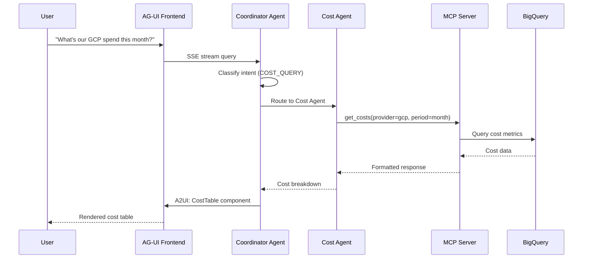

# PRD-08: D1 Agent Orchestration & MCP

> **Module Type**: Domain (Cost Monitoring-Specific)
> **Scope**: Coordinator Agent, Domain Agents, Cloud Agents, MCP Servers

@brd: BRD-08
@depends: PRD-01 (F1 IAM - authentication); PRD-02 (F2 Session - context); PRD-06 (F6 Infrastructure - Vertex AI)
@discoverability: PRD-09 (D2 Analytics - cost data); PRD-10 (D3 UX - AG-UI rendering)

---

## 1. Document Control

| Item | Details |
|------|---------|
| **Status** | Draft |
| **Version** | 1.0 |
| **Date Created** | 2026-02-09 |
| **Last Updated** | 2026-02-09 |
| **Author** | Antigravity AI |
| **Reviewer** | Chief Architect |
| **Approver** | Executive Sponsor |
| **BRD Reference** | @brd: BRD-08 |
| **Priority** | P1 - Critical |
| **Target Release** | Phase 1 MVP (GCP only) |
| **SYS-Ready Score** | 88/100 (Target: ≥85 for MVP) |
| **EARS-Ready Score** | 90/100 (Target: ≥85 for MVP) |

### 1.1 Document Revision History

| Version | Date | Author | Changes Made |
|---------|------|--------|--------------|
| 1.0 | 2026-02-09 | Antigravity AI | Initial PRD generation from BRD-08 |

---

## 2. Executive Summary

The D1 Agent Orchestration Module implements a multi-agent AI architecture for intelligent cloud cost management. It provides a Coordinator Agent for intent classification and routing, specialized Domain Agents (Cost, Optimization, Remediation, Reporting, Tenant, Cross-Cloud), Cloud Agents for provider-specific operations (GCP for MVP), and MCP Servers for uniform tool execution. The module enables natural language interactions for cost queries, recommendations, and automated remediation.

### 2.1 MVP Hypothesis

**We believe that** FinOps practitioners **will** achieve 80% faster insights and 3x higher optimization adoption **if we** provide natural language AI agents for cost queries and recommendations.

**We will know this is true when**:
- Intent classification accuracy exceeds 90%
- Query response time is <3 seconds (MVP: <5 seconds)
- Natural language understanding accuracy exceeds 85%
- User satisfaction score ≥4.0/5.0

### 2.2 Timeline Overview

| Phase | Duration | Deliverables |
|-------|----------|--------------|
| Phase 1: Coordinator & Cost Agent | 3 weeks | Intent routing, basic cost queries |
| Phase 2: Optimization Agent | 2 weeks | Recommendations, idle resources |
| Phase 3: Cloud Agents (GCP) | 2 weeks | Provider-specific integration |
| Phase 4: MCP Server Integration | 3 weeks | Uniform tool interface |

---

## 3. Problem Statement

### 3.1 Current State

- **Manual Data Navigation**: Users must navigate complex cloud provider consoles to find cost data
- **No Natural Language**: Cost queries require knowledge of specific UI paths and filters
- **Siloed Provider Views**: No unified view across multiple cloud providers
- **Delayed Insights**: Time to answer cost questions measured in hours, not seconds
- **Low Optimization Adoption**: Recommendations exist but are not easily accessible or actionable

### 3.2 Business Impact

- Time-to-insight: Hours instead of seconds
- Optimization adoption: <20% of recommendations acted upon
- Multi-cloud complexity: Separate dashboards per provider
- User frustration: High learning curve for cost analysis tools

### 3.3 Opportunity

AI-driven agent architecture enabling natural language cost queries, unified multi-cloud visibility, intelligent recommendations, and automated remediation with conversational interface.

---

## 4. Target Audience & User Personas

### 4.1 Primary User Personas

**FinOps Practitioner** - Cost Optimization Specialist
- **Key characteristic**: Analyzes cloud spend daily, identifies optimization opportunities
- **Main pain point**: Slow data retrieval, complex multi-provider analysis
- **Success criteria**: Get cost answers in natural language within seconds
- **Usage frequency**: Daily, multiple queries per session

**Cloud Operations Engineer** - Infrastructure Manager
- **Key characteristic**: Manages cloud resources, implements optimizations
- **Main pain point**: Context switching between provider consoles
- **Success criteria**: Execute remediation actions via conversational interface
- **Usage frequency**: Weekly remediation, daily monitoring

### 4.2 Secondary Users

- **Finance Manager**: Monthly cost reports and chargeback data
- **Engineering Lead**: Team-level cost attribution and trends
- **Executive**: High-level spend summaries and forecasts

---

## 5. Success Metrics (KPIs)

### 5.1 MVP Validation Metrics (30-Day)

| Metric ID | Metric | Baseline | Target | Measurement |
|-----------|--------|----------|--------|-------------|
| PRD.08.05.01 | Intent classification accuracy | 0% | ≥90% | Agent routing logs |
| PRD.08.05.02 | Query response time (p95) | N/A | <5 seconds | Performance monitoring |
| PRD.08.05.03 | Natural language understanding | 0% | ≥85% | User validation sampling |
| PRD.08.05.04 | User satisfaction | N/A | ≥4.0/5.0 | Post-query survey |

### 5.2 Business Success Metrics (90-Day)

| Metric ID | Metric | Target | Decision Threshold |
|-----------|--------|--------|-------------------|
| PRD.08.05.05 | Time-to-insight reduction | 80% faster | <50% = Iterate |
| PRD.08.05.06 | Optimization adoption rate | 3x increase | <2x = Remediate |
| PRD.08.05.07 | Multi-agent coordination success | ≥95% | <90% = Fix |
| PRD.08.05.08 | User retention (weekly active) | ≥60% | <40% = Pivot |

### 5.3 Go/No-Go Decision Gate

**At MVP+90 days**, evaluate:
- ✅ **Proceed to Full Product**: All P1 metrics met, user satisfaction ≥4.0
- 🔄 **Iterate**: 70-90% of targets met, no critical failures
- ❌ **Pivot**: <70% of targets or user satisfaction <3.5

---

## 6. Scope & Requirements

### 6.1 In-Scope (MVP Core Features)

| # | Feature | Priority | BRD Reference |
|---|---------|----------|---------------|
| 1 | Coordinator Agent (intent classification) | P1-Must | BRD.08.01.01 |
| 2 | Query routing to Domain Agents | P1-Must | BRD.08.01.02 |
| 3 | Cost Agent (cost queries, breakdowns) | P1-Must | BRD.08.02.01 |
| 4 | Optimization Agent (recommendations) | P1-Must | BRD.08.02.01 |
| 5 | GCP Cloud Agent | P1-Must | BRD.08.03.01 |
| 6 | MCP Server (get_costs, get_recommendations) | P1-Must | BRD.08.04.01 |
| 7 | Conversation context retention | P1-Must | BRD.08.01.03 |
| 8 | A2UI component selection | P2-Should | BRD.08.01.04 |
| 9 | Multi-agent coordination | P2-Should | BRD.08.02.02 |
| 10 | Error recovery and fallback | P2-Should | BRD.08.02.03 |

### 6.2 Dependencies

| Dependency | Status | Impact | Owner |
|------------|--------|--------|-------|
| F1 IAM (authentication) | Available | Blocking | IAM Team |
| F2 Session (context) | Available | Blocking | Session Team |
| F6 Infrastructure (Vertex AI) | Available | Blocking | Platform Team |
| D2 Analytics (cost data) | Available | Blocking | Analytics Team |
| LiteLLM abstraction | Available | Blocking | Platform Team |

### 6.3 Out-of-Scope (Post-MVP)

| Feature | Reason | Target Phase |
|---------|--------|--------------|
| Remediation Agent | Requires approval workflow | Phase 2 |
| Reporting Agent | Requires export infrastructure | Phase 2 |
| AWS/Azure Cloud Agents | GCP-first strategy | Phase 2 |
| Kubernetes Agent | Complex cost allocation | Phase 3 |
| Cross-Cloud Agent | Requires multi-provider data | Phase 3 |

---

## 7. User Stories & User Roles

> This section provides role definitions and story summaries. Detailed behavioral requirements are captured in EARS; executable test specifications are in BDD feature files.

### 7.1 Core User Stories

| ID | User Story | Priority | Acceptance Criteria | BRD Trace |
|----|------------|----------|---------------------|-----------|
| PRD.08.09.01 | As a FinOps user, I want to ask cost questions in natural language, so that I get answers without navigating complex UIs | P1 | Query understood with >90% accuracy, response <5s | BRD.08.01.01 |
| PRD.08.09.02 | As a FinOps user, I want cost breakdowns by service, region, and tag, so that I can identify spending patterns | P1 | Breakdown returned with correct data, <5s response | BRD.08.02.01 |
| PRD.08.09.03 | As a FinOps user, I want to see optimization recommendations, so that I can reduce cloud spend | P1 | Top recommendations prioritized by savings impact | BRD.08.02.01 |
| PRD.08.09.04 | As a FinOps user, I want the agent to remember conversation context, so that I can ask follow-up questions | P1 | 10-turn context retention across session | BRD.08.01.03 |
| PRD.08.09.05 | As an operator, I want to see idle resources identified, so that I can plan cleanup actions | P1 | Idle resources listed with metrics | BRD.08.02.01 |
| PRD.08.09.06 | As an operator, I want appropriate UI components for responses, so that data is easy to understand | P2 | Tables, charts, cards rendered correctly | BRD.08.01.04 |
| PRD.08.09.07 | As a FinOps user, I want queries to route to appropriate agents, so that I get specialized responses | P2 | Routing matches intent category | BRD.08.01.02 |
| PRD.08.09.08 | As an operator, I want graceful error handling, so that failures don't break my workflow | P2 | Errors show helpful messages, fallback available | BRD.08.02.03 |

### 7.2 User Roles

| Role | Purpose | Permissions |
|------|---------|-------------|
| FinOps User | Query costs, view recommendations | Read cost data, view recommendations |
| Operator | Execute optimizations, manage resources | Read + execute remediation actions |
| Admin | Configure agents, manage tenant | Full agent administration |
| System | Agent-to-agent communication | Internal tool execution |

### 7.3 Story Summary

| Priority | Count | Notes |
|----------|-------|-------|
| P1 (Must-Have) | 5 | Required for MVP launch |
| P2 (Should-Have) | 3 | Include if time permits |
| **Total** | 8 | |

---

## 8. Functional Requirements

### 8.1 Core Capabilities

| ID | Capability | Description | Success Criteria | BRD Trace |
|----|------------|-------------|------------------|-----------|
| PRD.08.01.01 | Intent Classification | Classify user queries into 8 intent categories | ≥90% accuracy, <200ms latency | BRD.08.01.01 |
| PRD.08.01.02 | Query Routing | Route queries to appropriate Domain Agent(s) | <200ms routing decision | BRD.08.01.02 |
| PRD.08.01.03 | Context Retention | Maintain conversation history for follow-ups | 10-turn retention | BRD.08.01.03 |
| PRD.08.01.04 | Cost Queries | Retrieve cost data by service, region, tag, time | <2s data retrieval, <5s total response | BRD.08.02.01 |
| PRD.08.01.05 | Recommendations | Fetch and prioritize optimization suggestions | Ranked by savings impact | BRD.08.02.01 |
| PRD.08.01.06 | MCP Tool Execution | Execute tools via uniform interface | <2s per tool call | BRD.08.04.01 |
| PRD.08.01.07 | A2UI Component Selection | Select appropriate UI component for response | Match response type | BRD.08.01.04 |

### 8.2 User Journey (Happy Path)



### 8.3 Error Handling (MVP)

| Error Scenario | User Experience | System Behavior |
|----------------|-----------------|-----------------|
| Intent unclear | "Could you clarify...?" | Fallback to clarification flow |
| LLM timeout | "Processing is taking longer..." | Retry with streaming indicator |
| MCP tool failure | "Couldn't retrieve data, try again" | Log error, return graceful message |
| Rate limit hit | "Please wait a moment..." | Backoff and retry automatically |
| No data found | "No data available for this query" | Return empty result with explanation |

### 8.4 Intent Classification Categories

| Intent Category | Description | Route To |
|-----------------|-------------|----------|
| COST_QUERY | Cost data retrieval, breakdowns | Cost Agent |
| OPTIMIZATION | Recommendations, savings opportunities | Optimization Agent |
| ANOMALY | Spending spikes, unusual patterns | Cost Agent + Optimization Agent |
| REMEDIATION | Execute actions, cleanup (Phase 2) | Remediation Agent |
| REPORTING | Generate reports, exports (Phase 2) | Reporting Agent |
| TENANT_ADMIN | User/account management | Tenant Agent |
| CROSS_CLOUD | Multi-provider analysis (Phase 3) | Cross-Cloud Agent |
| CONVERSATIONAL | Greetings, clarifications | Coordinator (direct response) |

---

## 9. Quality Attributes

### 9.1 Performance

| Metric | Target | MVP Target | Measurement |
|--------|--------|------------|-------------|
| Query response time (p95) | <3 seconds | <5 seconds | End-to-end tracing |
| Intent classification latency | <200ms | <500ms | Agent metrics |
| MCP tool execution | <2 seconds | <3 seconds | Tool call logs |
| First token latency (streaming) | <500ms | <1 second | SSE timing |

### 9.2 Reliability

| Metric | Target | MVP Target |
|--------|--------|------------|
| Agent availability | 99.9% | 99.5% |
| Intent classification accuracy | >95% | >90% |
| Multi-agent coordination success | >99% | >95% |
| Error recovery rate | >95% | >90% |

### 9.3 Scalability

| Metric | MVP Target | Growth Target |
|--------|------------|---------------|
| Concurrent conversations | 100 | 1,000 |
| Queries per minute | 500 | 5,000 |
| Parallel agent executions | 3 | 10 |

### 9.4 Security

- [x] Agent authentication via F1 IAM
- [x] Tenant isolation for all queries
- [x] Credential handling via Secret Manager (never cached)
- [x] Input sanitization for prompt injection prevention
- [x] Audit logging for all agent actions

---

## 10. Architecture Requirements

### 10.1 Infrastructure (PRD.08.32.01)

**Status**: N/A - Handled by F6 Infrastructure

**PRD Requirements**: None for this module (see PRD-06)

---

### 10.2 Data Architecture (PRD.08.32.02)

**Status**: [X] Selected

**Business Driver**: Agent state and conversation context storage

**MVP Approach**: Redis for agent state + F2 Session for conversation history

**Key Design Decisions**:
- Agent state TTL: 30 minutes
- Conversation history: 10 turns maximum
- Context compression for long conversations

---

### 10.3 Integration (PRD.08.32.03)

**Status**: [X] Selected

**Business Driver**: Multi-agent coordination and MCP tool execution

**MVP Approach**: Google ADK with MCP Servers via AG-UI protocol

**Key Integration Points**:
- AG-UI: SSE streaming to frontend
- MCP: Uniform tool interface for all cloud operations
- F2 Session: Conversation context injection

---

### 10.4 Security (PRD.08.32.04)

**Status**: N/A - Handled by F1 IAM and F4 SecOps

**PRD Requirements**: None for this module (see PRD-01, PRD-04)

---

### 10.5 Observability (PRD.08.32.05)

**Status**: N/A - Handled by F3 Observability

**PRD Requirements**: None for this module (see PRD-03)

---

### 10.6 AI/ML (PRD.08.32.06)

**Status**: [X] Selected

**Business Driver**: Intent classification and natural language understanding

**MVP Approach**: LiteLLM abstraction with Gemini 2.0 Flash primary, Claude fallback

**LLM Routing Rules**:
- Simple queries (cost lookup): Gemini 2.0 Flash (~$200-500/month)
- Complex reasoning (multi-step analysis): Claude 3.5 Sonnet fallback
- Model selection based on query complexity score

---

### 10.7 Technology Selection (PRD.08.32.07)

**Status**: [X] Selected

**Business Driver**: Agent framework and deployment platform

**MVP Selection**:
- Agent Framework: Google ADK
- Protocol: AG-UI (Agent-to-UI)
- MCP Implementation: Model Context Protocol
- Deployment: Cloud Run (per ADR-004)
- LLM Provider: LiteLLM abstraction (per ADR-005)

---

## 11. Constraints & Assumptions

### 11.1 Constraints

| ID | Category | Description | Impact |
|----|----------|-------------|--------|
| PRD.08.03.01 | Platform | GCP-only for MVP (ADR-002) | Single cloud provider |
| PRD.08.03.02 | Technology | LiteLLM for LLM abstraction (ADR-005) | Vendor flexibility |
| PRD.08.03.03 | Technology | Cloud Run deployment (ADR-004) | Serverless constraints |
| PRD.08.03.04 | Integration | Must use F1 IAM for authentication | Dependency on foundation |

### 11.2 Assumptions

| ID | Assumption | Risk | Validation |
|----|------------|------|------------|
| PRD.08.04.01 | LiteLLM provides adequate model abstraction | Low | Integration testing |
| PRD.08.04.02 | Gemini 2.0 Flash meets latency requirements | Medium | Performance testing |
| PRD.08.04.03 | AG-UI protocol supports required streaming | Low | Protocol testing |
| PRD.08.04.04 | MCP tools cover all required operations | Medium | Tool coverage audit |

---

## 12. Risk Assessment

| Risk ID | Risk | Likelihood | Impact | Mitigation | Owner |
|---------|------|------------|--------|------------|-------|
| PRD.08.07.01 | LLM response latency exceeds target | Medium | High | Streaming responses, model caching | AI Team |
| PRD.08.07.02 | Intent misclassification | Medium | Medium | Clarification flows, feedback loop | AI Team |
| PRD.08.07.03 | Cloud API rate limits | High | Medium | Backoff strategy, request batching | Platform |
| PRD.08.07.04 | Multi-agent coordination complexity | Medium | High | Clear routing rules, timeout policies | Architect |
| PRD.08.07.05 | Prompt injection attacks | Low | High | Input sanitization, F4 SecOps integration | Security |

---

## 13. Implementation Approach

### 13.1 MVP Development Phases

| Phase | Duration | Deliverables | Success Criteria |
|-------|----------|--------------|------------------|
| **Phase 1: Coordinator** | 3 weeks | Intent classification, routing | 90% accuracy |
| **Phase 2: Cost Agent** | 2 weeks | Cost queries, breakdowns | <5s response |
| **Phase 3: Optimization Agent** | 2 weeks | Recommendations, idle resources | Ranked by impact |
| **Phase 4: MCP Integration** | 3 weeks | Tool interface, GCP agent | All tools functional |

### 13.2 Testing Strategy (MVP)

| Test Type | Coverage | Responsible |
|-----------|----------|-------------|
| Unit Tests | 85% for agent logic | Development |
| Integration Tests | Agent-to-agent flows | Development |
| Intent Classification Tests | 1000+ query samples | AI Team |
| Performance Tests | Latency targets | QA |
| Security Tests | Prompt injection | Security |

---

## 14. Acceptance Criteria

### 14.1 MVP Launch Criteria

**Must-Have (P1)**:
- [ ] Intent classification accuracy ≥90%
- [ ] Query response time <5 seconds (p95)
- [ ] Cost Agent returning correct data for GCP
- [ ] Optimization Agent returning ranked recommendations
- [ ] Context retention for 10 conversation turns
- [ ] Error handling with graceful fallback

**Should-Have (P2)**:
- [ ] A2UI component selection for response types
- [ ] Multi-agent coordination (2 agents parallel)
- [ ] Streaming responses with first token <1s

### 14.2 User Acceptance Criteria

- [ ] Users can ask cost questions in plain English
- [ ] Responses match expected data from provider console
- [ ] Follow-up questions work without repeating context
- [ ] Errors display helpful messages, not technical details

---

## 15. Budget & Resources

### 15.1 MVP Development Cost

| Category | Estimate | Notes |
|----------|----------|-------|
| LLM API (Gemini) | $200-500/month | Based on query volume |
| LLM API (Claude fallback) | $100-300/month | Complex queries only |
| Cloud Run | Per invocation | Included in F6 |
| Development | Team allocation | 10 weeks effort |

### 15.2 ROI Hypothesis

**Investment**: D1 Agent Orchestration implementation

**Expected Return**:
- 80% reduction in time-to-insight (hours → seconds)
- 3x increase in optimization adoption rate
- Improved user satisfaction and retention

**Decision Logic**: Natural language interface removes adoption barrier for cost optimization.

---

## 16. Traceability

### 16.1 Upstream References

| Source | Document | Relationship |
|--------|----------|--------------|
| BRD | @brd: BRD-08 | Business requirements source |
| Agent Routing Spec | 03-agent-routing-spec.md | Agent communication patterns |
| MCP Contracts | 02-mcp-tool-contracts.md | Tool interface definitions |

### 16.2 Downstream Artifacts

| Artifact Type | Status | Notes |
|---------------|--------|-------|
| EARS | Pending | After PRD approval |
| BDD | Pending | After EARS |
| ADR | Existing | ADR-001, ADR-004, ADR-005, ADR-009, ADR-010 |

### 16.3 Cross-PRD References

| Related PRD | Dependency Type | Integration Point |
|-------------|-----------------|-------------------|
| PRD-01 (F1 IAM) | Upstream | Agent authentication, user permissions |
| PRD-02 (F2 Session) | Upstream | Conversation context injection |
| PRD-03 (F3 Observability) | Upstream | Agent metrics, tracing |
| PRD-09 (D2 Analytics) | Downstream | Cost data for agent responses |
| PRD-10 (D3 UX) | Downstream | AG-UI rendering of responses |
| PRD-11 (D4 Multi-Cloud) | Peer | Cloud connector integration |

### 16.4 Requirements Traceability Matrix

| PRD Requirement | BRD Source | Priority | Status |
|-----------------|------------|----------|--------|
| PRD.08.01.01 | BRD.08.01.01 | P1 | Mapped |
| PRD.08.01.02 | BRD.08.01.02 | P1 | Mapped |
| PRD.08.01.03 | BRD.08.01.03 | P1 | Mapped |
| PRD.08.01.04 | BRD.08.02.01 | P1 | Mapped |
| PRD.08.01.05 | BRD.08.02.01 | P1 | Mapped |
| PRD.08.01.06 | BRD.08.04.01 | P1 | Mapped |
| PRD.08.01.07 | BRD.08.01.04 | P2 | Mapped |

---

## 17. Glossary

| Term | Definition |
|------|------------|
| AG-UI | Agent-to-UI protocol for streaming agent responses |
| A2UI | Agent-to-UI component selection for response rendering |
| ADK | Google Agent Development Kit |
| Coordinator Agent | Central routing agent for intent classification |
| Domain Agent | Specialized agent for specific cost monitoring domain |
| Cloud Agent | Provider-specific agent for cloud API interaction |
| Intent Classification | Categorizing user queries into actionable intent types |
| LiteLLM | LLM abstraction layer for model switching |
| MCP | Model Context Protocol for uniform tool interface |

**Master Glossary Reference**: See [BRD-00_GLOSSARY.md](../01_BRD/BRD-00_GLOSSARY.md)

---

## 18. Appendix A: Future Roadmap (Post-MVP)

### 18.1 Phase 2 Features (If MVP Succeeds)

| Feature | Priority | BRD Reference | Dependency |
|---------|----------|---------------|------------|
| Remediation Agent | P1 | BRD.08.02.01 | Approval workflow |
| Reporting Agent | P1 | BRD.08.02.01 | Export infrastructure |
| AWS Cloud Agent | P1 | BRD.08.03.01 | D4 Multi-Cloud |
| Azure Cloud Agent | P1 | BRD.08.03.01 | D4 Multi-Cloud |

### 18.2 Scaling Considerations

- **Agent Pool**: Scale Cloud Run instances for concurrent conversations
- **LLM Costs**: Monitor token usage, optimize prompts
- **Multi-Model**: Expand LiteLLM support for cost optimization

---

## 19. EARS Enhancement Appendix

### 19.1 Timing Profiles

| Operation | p50 | p95 | p99 | Max |
|-----------|-----|-----|-----|-----|
| Intent classification | 100ms | 200ms | 500ms | 1000ms |
| Query routing | 50ms | 100ms | 200ms | 500ms |
| Cost data retrieval | 1s | 2s | 3s | 5s |
| Full query response | 2s | 5s | 7s | 10s |
| First token (streaming) | 200ms | 500ms | 1s | 2s |

### 19.2 Boundary Values

| Parameter | Min | Typical | Max | Invalid |
|-----------|-----|---------|-----|---------|
| Conversation turns | 1 | 5 | 10 | 0, negative |
| Query length | 5 chars | 100 chars | 2000 chars | 0, >2000 |
| Response tokens | 50 | 500 | 4000 | 0, >4000 |
| Parallel agents | 1 | 2 | 3 | 0, >3 |
| Intent confidence | 0.0 | 0.85 | 1.0 | <0, >1 |

### 19.3 State Diagrams

**Conversation State Machine**:
```text
[IDLE] --user query--> [CLASSIFYING]
[CLASSIFYING] --intent found--> [ROUTING]
[CLASSIFYING] --unclear--> [CLARIFYING]
[ROUTING] --single agent--> [EXECUTING]
[ROUTING] --multi agent--> [COORDINATING]
[CLARIFYING] --user response--> [CLASSIFYING]
[EXECUTING] --success--> [RESPONDING]
[EXECUTING] --error--> [ERROR_HANDLING]
[COORDINATING] --all complete--> [AGGREGATING]
[AGGREGATING] --complete--> [RESPONDING]
[RESPONDING] --sent--> [IDLE]
[ERROR_HANDLING] --recovered--> [RESPONDING]
[ERROR_HANDLING] --fatal--> [IDLE] (with error message)
```

---

*PRD-08: D1 Agent Orchestration & MCP - AI Cost Monitoring Platform v4.2*
*Generated: 2026-02-09 | EARS-Ready Score: 90/100*
