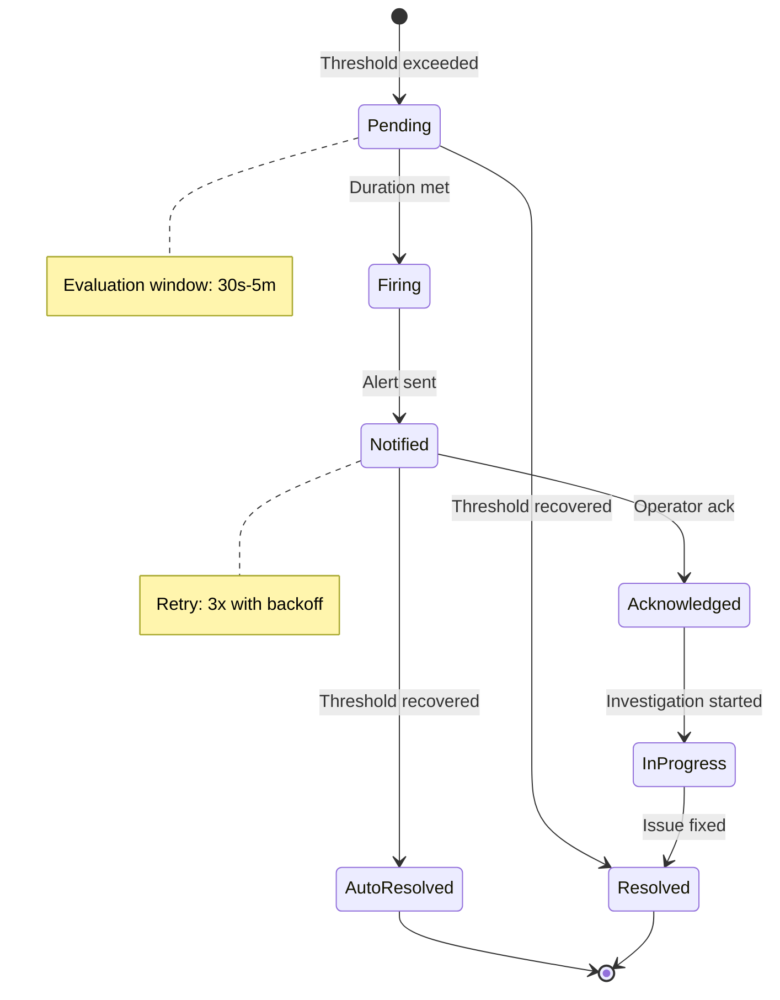
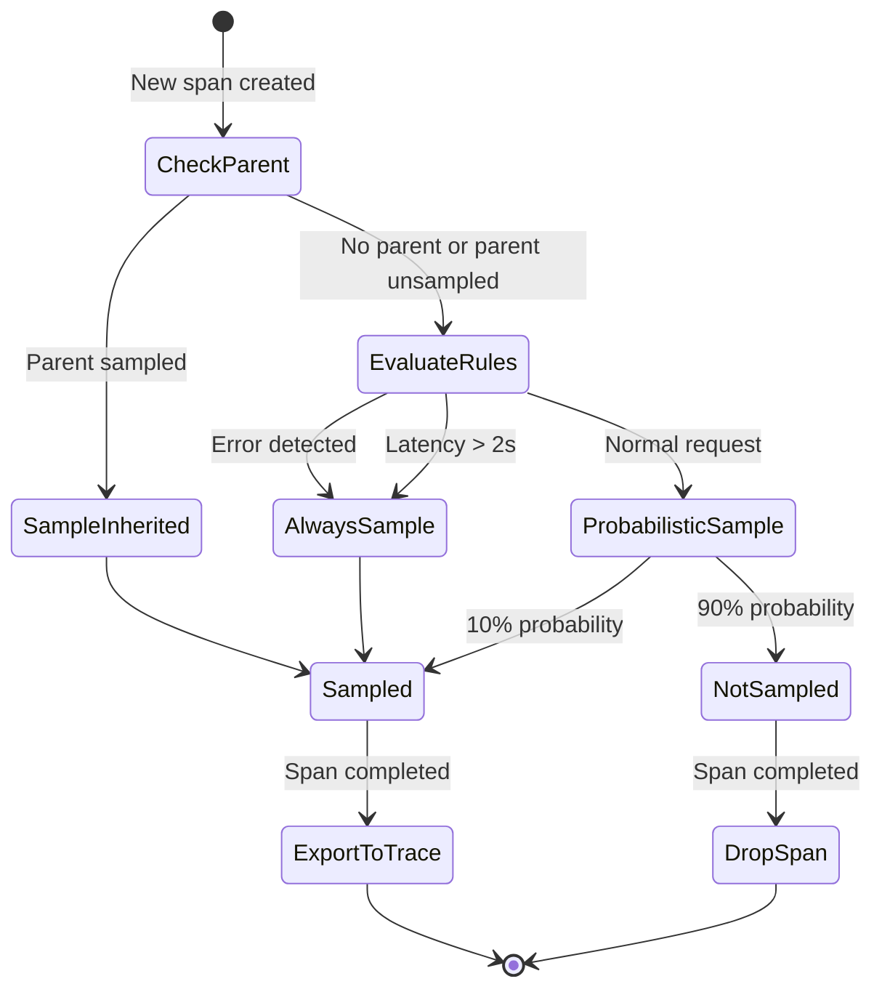
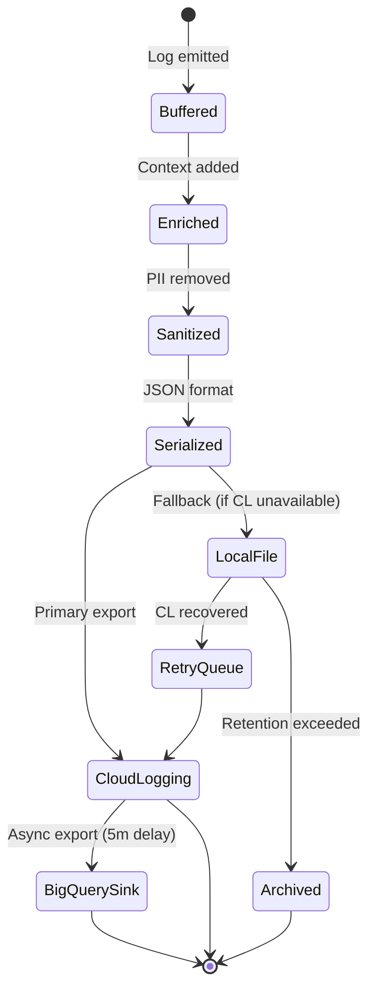

# EARS-03: F3 Observability Requirements

> **Module Type**: Foundation (Domain-Agnostic)
> **Upstream**: PRD-03 (EARS-Ready Score: 90/100)
> **Downstream**: BDD-03, ADR-03, SYS-03

@brd: BRD-03
@prd: PRD-03
@depends: EARS-01 (user_id enrichment); EARS-02 (session_id context)
@discoverability: EARS-04 (security events); EARS-05 (self-ops health metrics)

---

## 1. Document Control

| Item | Details |
|------|---------|
| **Version** | 1.0 |
| **Status** | Draft |
| **Date Created** | 2026-02-09T00:00:00 |
| **Last Updated** | 2026-02-09T00:00:00 |
| **Author** | Coder Agent (Claude) |
| **Source PRD** | @prd: PRD-03 |
| **BDD-Ready Score** | 90/100 (Target: >=90) |

---

## 2. Event-Driven Requirements (001-099)

### EARS.03.25.001: Structured Log Emission

```
WHEN application emits a log entry,
THE logging service SHALL enrich log with trace_id, user_id, session_id,
format as JSON with timestamp, level, message, and context,
write to local buffer,
and export to Cloud Logging
WITHIN 1ms (@threshold: LOG_WRITE_LATENCY).
```

**Traceability**: @brd: BRD.03.01.01 | @prd: PRD.03.01.01
**Priority**: P1 - Critical
**Acceptance Criteria**: 100% of logs contain trace_id correlation

---

### EARS.03.25.002: Metric Recording

```
WHEN application records a metric,
THE metrics service SHALL accept counter, gauge, or histogram type,
validate label cardinality (@threshold: METRIC_LABELS <= 10),
store in in-memory buffer,
and export to Prometheus/Cloud Monitoring
WITHIN 0.1ms (@threshold: METRIC_RECORD_LATENCY).
```

**Traceability**: @brd: BRD.03.01.02 | @prd: PRD.03.01.02
**Priority**: P1 - Critical
**Acceptance Criteria**: Metrics visible in Cloud Monitoring within 60s

---

### EARS.03.25.003: Distributed Trace Span Creation

```
WHEN new request enters the system,
THE tracing service SHALL create OpenTelemetry span,
propagate W3C Trace Context headers,
extract parent context if present,
and attach span to current context
WITHIN 0.5ms (@threshold: SPAN_CREATE_LATENCY).
```

**Traceability**: @brd: BRD.03.01.03 | @prd: PRD.03.01.03
**Priority**: P1 - Critical
**Acceptance Criteria**: Trace spans linked across 3+ services

---

### EARS.03.25.004: Alert Threshold Evaluation

```
WHEN metric value crosses defined threshold,
THE alerting service SHALL evaluate alert severity (Critical, High, Medium, Low),
check deduplication window (@threshold: ALERT_DEDUP_WINDOW = 5m),
create alert instance,
and route to notification channels
WITHIN 30s for Critical severity (@threshold: ALERT_CRITICAL_LATENCY).
```

**Traceability**: @brd: BRD.03.01.04 | @prd: PRD.03.01.04
**Priority**: P1 - Critical
**Acceptance Criteria**: Alert delivered within 30s of threshold breach

---

### EARS.03.25.005: Critical Alert Notification

```
WHEN alert severity is Critical,
THE notification service SHALL send to PagerDuty immediately,
send to Slack #alerts channel,
include alert context and runbook link,
and log notification attempt
WITHIN 30s (@threshold: ALERT_CRITICAL_LATENCY).
```

**Traceability**: @brd: BRD.03.01.04 | @prd: PRD.03.09.04
**Priority**: P1 - Critical
**Acceptance Criteria**: PagerDuty and Slack receive simultaneous notifications

---

### EARS.03.25.006: High Severity Alert Notification

```
WHEN alert severity is High,
THE notification service SHALL send to PagerDuty,
send to Slack #alerts channel,
and log notification attempt
WITHIN 5 minutes (@threshold: ALERT_HIGH_LATENCY).
```

**Traceability**: @brd: BRD.03.01.04 | @prd: PRD.03.09.04
**Priority**: P1 - Critical
**Acceptance Criteria**: High severity alerts delivered within 5 minutes

---

### EARS.03.25.007: LLM Call Completion Tracking

```
WHEN LLM API call completes,
THE LLM analytics service SHALL record model identifier,
capture input token count,
capture output token count,
record response latency (TTFB and total),
calculate cost based on pricing table,
and emit metrics
WITHIN 1ms.
```

**Traceability**: @brd: BRD.03.01.05 | @prd: PRD.03.09.08
**Priority**: P1 - Critical
**Acceptance Criteria**: 100% LLM call tracking, 99% cost accuracy

---

### EARS.03.25.008: Error Span Detection

```
WHEN error is detected in span,
THE tracing service SHALL set span status to ERROR,
bypass probabilistic sampling,
always export span to Cloud Trace,
and increment error counter metric.
```

**Traceability**: @brd: BRD.03.01.03 | @prd: PRD.03.01.03
**Priority**: P1 - Critical
**Acceptance Criteria**: 100% of error spans captured

---

### EARS.03.25.009: Slow Request Trace Capture

```
WHEN request latency exceeds 2 seconds,
THE tracing service SHALL bypass probabilistic sampling,
always export full trace to Cloud Trace,
tag trace with slow_request marker,
and increment slow request counter.
```

**Traceability**: @brd: BRD.03.01.03 | @prd: PRD.03.01.03
**Priority**: P1 - Critical
**Acceptance Criteria**: All requests >2s captured in Cloud Trace

---

### EARS.03.25.010: Dashboard Load

```
WHEN SRE requests dashboard view,
THE dashboard service SHALL authenticate via F1 IAM,
retrieve current metrics from Prometheus/Cloud Monitoring,
render Grafana panels,
and display dashboard
WITHIN 3s (@threshold: DASHBOARD_LOAD_TIME).
```

**Traceability**: @brd: BRD.03.01.06 | @prd: PRD.03.09.05
**Priority**: P1 - Critical
**Acceptance Criteria**: Dashboard loads in <3s with 6 panels

---

### EARS.03.25.011: Log Query Execution

```
WHEN admin executes log query in BigQuery,
THE log analytics service SHALL parse SQL query,
execute against log table,
return query results,
and log query execution
WITHIN 30s for 1M log entries (@threshold: BQ_QUERY_TIME).
```

**Traceability**: @brd: BRD.03.01.07 | @prd: PRD.03.09.07
**Priority**: P2 - High
**Acceptance Criteria**: Query 1M logs in <30s

---

### EARS.03.25.012: Error Budget Burn Rate Alert

```
WHEN error budget burn rate exceeds 2x normal rate,
THE SLO service SHALL calculate remaining error budget,
evaluate impact on SLO target,
and trigger P2 alert
WITHIN 1 minute (@threshold: ERROR_BUDGET_UPDATE).
```

**Traceability**: @brd: BRD.03.01.09 | @prd: PRD.03.09.06
**Priority**: P1 - Critical
**Acceptance Criteria**: Error budget alerts within 1 minute of threshold breach

---

### EARS.03.25.013: Trace Sampling Decision

```
WHEN new trace is initiated,
THE tracing service SHALL check parent span sampling status,
evaluate sampling rules (error, latency, probabilistic),
apply 10% default sampling rate (@threshold: TRACE_SAMPLE_RATE),
and set sampling decision on span context.
```

**Traceability**: @brd: BRD.03.01.03 | @prd: PRD.03.01.03
**Priority**: P1 - Critical
**Acceptance Criteria**: 10% probabilistic sampling rate maintained

---

### EARS.03.25.014: Metric Export Cycle

```
WHEN metrics export interval (60s) elapses,
THE metrics service SHALL batch pending metrics,
export to Prometheus endpoint (:9090/metrics),
export to Cloud Monitoring API,
and reset batch buffer.
```

**Traceability**: @brd: BRD.03.01.02 | @prd: PRD.03.01.02
**Priority**: P1 - Critical
**Acceptance Criteria**: Metrics available in Cloud Monitoring within 60s

---

### EARS.03.25.015: SLO/SLI Calculation

```
WHEN SLO evaluation interval (1 minute) elapses,
THE SLO service SHALL retrieve SLI metrics,
calculate SLO compliance percentage,
update error budget consumption,
and store results
WITHIN 1 minute (@threshold: ERROR_BUDGET_UPDATE).
```

**Traceability**: @brd: BRD.03.01.09 | @prd: PRD.03.09.06
**Priority**: P2 - High
**Acceptance Criteria**: 100% accuracy, 1-minute update frequency

---

---

## 3. State-Driven Requirements (101-199)

### EARS.03.25.101: Cloud Logging Unavailable Fallback

```
WHILE Cloud Logging is unavailable,
THE logging service SHALL buffer logs to local file,
limit buffer size to 100MB,
retry Cloud Logging export with exponential backoff,
and alert operations after 3 consecutive failures.
```

**Traceability**: @brd: BRD.03.02.02 | @prd: PRD.03.08.03
**Priority**: P1 - Critical

---

### EARS.03.25.102: Alert Notification Retry

```
WHILE alert is in Notified state and not acknowledged,
THE notification service SHALL retry delivery 3 times with exponential backoff,
attempt fallback channel if primary fails,
escalate to next tier after timeout,
and log all delivery attempts.
```

**Traceability**: @brd: BRD.03.01.04 | @prd: PRD.03.01.04
**Priority**: P1 - Critical

---

### EARS.03.25.103: Maintenance Window Alert Suppression

```
WHILE maintenance window is active,
THE alerting service SHALL suppress non-critical alerts (Medium, Low),
continue delivering Critical and High alerts,
queue suppressed alerts for post-maintenance review,
and log suppression decisions.
```

**Traceability**: @brd: BRD.03.01.04 | @prd: PRD.03.01.04
**Priority**: P1 - Critical

---

### EARS.03.25.104: Trace Context Propagation

```
WHILE processing distributed request,
THE tracing service SHALL maintain trace context across service boundaries,
propagate W3C Trace Context headers on outbound calls,
attach span to incoming context,
and preserve sampling decision.
```

**Traceability**: @brd: BRD.03.01.03 | @prd: PRD.03.01.03
**Priority**: P1 - Critical

---

### EARS.03.25.105: BigQuery Log Sink Active

```
WHILE BigQuery log sink is enabled,
THE logging service SHALL export logs to BigQuery asynchronously,
maintain export latency under 5 minutes (@threshold: LOG_EXPORT_LATENCY),
handle backpressure gracefully,
and monitor sink health.
```

**Traceability**: @brd: BRD.03.01.07 | @prd: PRD.03.01.07
**Priority**: P2 - High

---

### EARS.03.25.106: Log Retention Enforcement

```
WHILE log retention period is defined,
THE logging service SHALL enforce 30-day retention in Cloud Logging,
archive to BigQuery for 1-year extended retention,
delete logs exceeding retention period,
and maintain audit trail of deletions.
```

**Traceability**: @brd: BRD.03.02.02 | @prd: PRD.03.32.02
**Priority**: P1 - Critical

---

### EARS.03.25.107: Metrics Retention Enforcement

```
WHILE metrics retention period is defined,
THE metrics service SHALL maintain 90-day retention in Cloud Monitoring (@threshold: METRIC_RETENTION),
downsample older metrics,
and delete metrics exceeding retention period.
```

**Traceability**: @brd: BRD.03.02.02 | @prd: PRD.03.32.02
**Priority**: P1 - Critical

---

### EARS.03.25.108: F3 Self-Monitoring Active

```
WHILE F3 observability components are running,
THE health service SHALL emit F3 health metrics to dedicated namespace,
perform synthetic health checks every 30 seconds,
alert on F3 component failures,
and maintain self-monitoring independence.
```

**Traceability**: @brd: BRD.03.02.02 | @prd: PRD.03.32.05
**Priority**: P1 - Critical

---

---

## 4. Unwanted Behavior Requirements (201-299)

### EARS.03.25.201: Cloud Logging Export Failure

```
IF Cloud Logging export fails,
THE logging service SHALL buffer logs to local file,
retry with exponential backoff (1s, 2s, 4s),
alert operations after 3 consecutive failures,
and continue accepting new logs.
```

**Traceability**: @brd: BRD.03.02.02 | @prd: PRD.03.08.03
**Priority**: P1 - Critical

---

### EARS.03.25.202: Prometheus Scrape Failure

```
IF Prometheus scrape fails,
THE metrics service SHALL retry scrape on next interval,
log scrape failure event,
alert after 3 consecutive failures,
and maintain metrics buffer integrity.
```

**Traceability**: @brd: BRD.03.02.02 | @prd: PRD.03.08.03
**Priority**: P1 - Critical

---

### EARS.03.25.203: Cloud Trace Export Failure

```
IF Cloud Trace export fails,
THE tracing service SHALL buffer spans locally,
retry export asynchronously,
drop oldest spans if buffer exceeds limit,
and log export failures.
```

**Traceability**: @brd: BRD.03.02.02 | @prd: PRD.03.08.03
**Priority**: P1 - Critical

---

### EARS.03.25.204: PagerDuty Notification Timeout

```
IF PagerDuty notification times out,
THE notification service SHALL fallback to Slack immediately,
retry PagerDuty with backoff,
log timeout event,
and emit alert delivery metric.
```

**Traceability**: @brd: BRD.03.01.04 | @prd: PRD.03.08.03
**Priority**: P1 - Critical

---

### EARS.03.25.205: BigQuery Query Timeout

```
IF BigQuery query exceeds timeout (@threshold: BQ_QUERY_TIME),
THE log analytics service SHALL return partial results if available,
suggest query optimization,
log timeout event,
and recommend reducing time range or adding filters.
```

**Traceability**: @brd: BRD.03.01.07 | @prd: PRD.03.08.03
**Priority**: P2 - High

---

### EARS.03.25.206: Log Message Size Overflow

```
IF log message exceeds maximum size (@threshold: LOG_MSG_SIZE = 64KB),
THE logging service SHALL truncate message to limit,
add overflow warning marker,
log truncation event,
and emit truncation metric.
```

**Traceability**: @brd: BRD.03.02.02 | @prd: PRD.03.01.01
**Priority**: P1 - Critical

---

### EARS.03.25.207: Metric Label Cardinality Violation

```
IF metric label count exceeds limit (@threshold: METRIC_LABELS = 10),
THE metrics service SHALL reject the metric,
log cardinality violation,
emit rejection metric,
and not store partial metric.
```

**Traceability**: @brd: BRD.03.02.02 | @prd: PRD.03.01.02
**Priority**: P1 - Critical

---

### EARS.03.25.208: Span Attribute Overflow

```
IF span attribute count exceeds limit (@threshold: SPAN_ATTRS = 32),
THE tracing service SHALL ignore excess attributes,
log overflow warning,
proceed with valid attributes,
and emit overflow metric.
```

**Traceability**: @brd: BRD.03.01.03 | @prd: PRD.03.01.03
**Priority**: P2 - High

---

### EARS.03.25.209: Alert Delivery Failure

```
IF alert delivery fails on all channels,
THE alerting service SHALL escalate to emergency contact list,
log delivery failure,
emit alert_delivery_failure metric,
and retry on channel recovery.
```

**Traceability**: @brd: BRD.03.01.04 | @prd: PRD.03.01.04
**Priority**: P1 - Critical

---

### EARS.03.25.210: Low Severity Alert Handling

```
IF alert severity is Low,
THE alerting service SHALL log alert event only,
not send external notifications,
store in alert history,
and make available for dashboard review.
```

**Traceability**: @brd: BRD.03.01.04 | @prd: PRD.03.01.04
**Priority**: P2 - High

---

### EARS.03.25.211: SLO Compliance Critical Breach

```
IF error rate exceeds SLO target AND error budget remaining is less than 10%,
THE SLO service SHALL escalate to P1 alert,
notify on-call engineer,
include error budget status in alert,
and log escalation event.
```

**Traceability**: @brd: BRD.03.01.09 | @prd: PRD.03.09.06
**Priority**: P1 - Critical

---

### EARS.03.25.212: Log Volume Budget Exceeded

```
IF log volume exceeds 10K logs/second AND cost budget at 80%,
THE logging service SHALL enable log sampling,
prioritize ERROR and WARN levels,
reduce DEBUG/INFO sampling to 10%,
and alert operations.
```

**Traceability**: @brd: BRD.03.02.02 | @prd: PRD.03.12.01
**Priority**: P1 - Critical

---

---

## 5. Ubiquitous Requirements (401-499)

### EARS.03.25.401: Log Export to Cloud Logging

```
THE logging service SHALL export all logs to Cloud Logging,
within @threshold: LOG_EXPORT_LATENCY (5 minutes),
maintaining 99.9% delivery uptime,
and preserving log ordering within single source.
```

**Traceability**: @brd: BRD.03.02.02 | @prd: PRD.03.01.01
**Priority**: P1 - Critical

---

### EARS.03.25.402: Metric Recording Latency

```
THE metrics service SHALL record all metrics,
with latency under @threshold: METRIC_RECORD_LATENCY (0.1ms p99),
supporting counter, gauge, and histogram types,
and exporting to Cloud Monitoring.
```

**Traceability**: @brd: BRD.03.06.03 | @prd: PRD.03.01.02
**Priority**: P1 - Critical

---

### EARS.03.25.403: W3C Trace Context Propagation

```
THE tracing service SHALL propagate W3C Trace Context headers,
on all outbound HTTP/gRPC requests,
including traceparent and tracestate headers,
and maintaining trace continuity across service boundaries.
```

**Traceability**: @brd: BRD.03.01.03 | @prd: PRD.03.32.03
**Priority**: P1 - Critical

---

### EARS.03.25.404: PII Sanitization

```
THE logging service SHALL sanitize PII from all logs before export,
mask credit card numbers, SSNs, and email addresses,
apply sanitization rules from configuration,
and log sanitization actions.
```

**Traceability**: @brd: BRD.03.02.02 | @prd: PRD.03.09.02
**Priority**: P1 - Critical

---

### EARS.03.25.405: TLS Encryption for Telemetry

```
THE telemetry service SHALL encrypt all telemetry export using TLS 1.3,
for Cloud Logging, Cloud Monitoring, and Cloud Trace connections,
validate server certificates,
and reject connections with invalid certificates.
```

**Traceability**: @brd: BRD.03.02.02 | @prd: PRD.03.09.02
**Priority**: P1 - Critical

---

### EARS.03.25.406: Dashboard Access Authentication

```
THE dashboard service SHALL authenticate all dashboard access via F1 IAM,
enforce RBAC for dashboard visibility,
log all access attempts,
and reject unauthenticated requests.
```

**Traceability**: @brd: BRD.03.02.02 | @prd: PRD.03.09.02
**Priority**: P1 - Critical

---

### EARS.03.25.407: Log Level Support

```
THE logging service SHALL support 4 log levels (DEBUG, INFO, WARN, ERROR),
include level in structured log output,
allow runtime level configuration,
and default to INFO level.
```

**Traceability**: @brd: BRD.03.01.01 | @prd: PRD.03.01.01
**Priority**: P1 - Critical

---

### EARS.03.25.408: Audit Log Retention

```
THE logging service SHALL retain audit logs for compliance period,
encrypt audit logs at rest using GCP-managed keys,
provide immutable storage for audit trail,
and support 7-year extended retention for Security Officer access.
```

**Traceability**: @brd: BRD.03.02.02 | @prd: PRD.03.09.02
**Priority**: P1 - Critical

---

---

## 6. Quality Attributes

### 6.1 Performance Requirements

| QA ID | Requirement Statement | Metric | Target | Priority | Source |
|-------|----------------------|--------|--------|----------|--------|
| EARS.03.QA.01 | THE logging service SHALL write logs | Latency | p99 < 1ms | High | @threshold: LOG_WRITE_LATENCY |
| EARS.03.QA.02 | THE metrics service SHALL record metrics | Latency | p99 < 0.1ms | High | @threshold: METRIC_RECORD_LATENCY |
| EARS.03.QA.03 | THE tracing service SHALL create spans | Latency | p99 < 0.5ms | High | @threshold: SPAN_CREATE_LATENCY |
| EARS.03.QA.04 | THE alerting service SHALL deliver critical alerts | Latency | < 30s | High | @threshold: ALERT_CRITICAL_LATENCY |
| EARS.03.QA.05 | THE dashboard service SHALL load dashboards | Latency | p95 < 3s | High | @threshold: DASHBOARD_LOAD_TIME |
| EARS.03.QA.06 | THE log analytics service SHALL execute queries | Latency | < 30s (1M logs) | Medium | @threshold: BQ_QUERY_TIME |

### 6.2 Security Requirements

| QA ID | Requirement Statement | Control | Compliance | Priority |
|-------|----------------------|---------|------------|----------|
| EARS.03.QA.07 | THE telemetry service SHALL encrypt all exports | TLS 1.3 | Required | High |
| EARS.03.QA.08 | THE logging service SHALL sanitize PII | Data Protection | Required | High |
| EARS.03.QA.09 | THE dashboard service SHALL authenticate via F1 IAM | Authentication | Required | High |
| EARS.03.QA.10 | THE logging service SHALL encrypt logs at rest | GCP-managed keys | Required | High |
| EARS.03.QA.11 | THE dashboard service SHALL log all access attempts | Audit Trail | Required | High |

### 6.3 Reliability Requirements

| QA ID | Requirement Statement | Metric | Target | Priority |
|-------|----------------------|--------|--------|----------|
| EARS.03.QA.12 | THE logging service SHALL maintain log delivery | Uptime | 99.9% | High |
| EARS.03.QA.13 | THE metrics service SHALL maintain metrics export | Uptime | 99.9% | High |
| EARS.03.QA.14 | THE alerting service SHALL maintain alert delivery | Uptime | 99.9% | High |
| EARS.03.QA.15 | THE dashboard service SHALL maintain availability | Uptime | 99.5% | Medium |
| EARS.03.QA.16 | THE observability service SHALL recover from failure | RTO | < 5 minutes | High |

### 6.4 Scalability Requirements

| QA ID | Requirement Statement | Metric | Target | Priority |
|-------|----------------------|--------|--------|----------|
| EARS.03.QA.17 | THE logging service SHALL handle log throughput | Capacity | 10K logs/s | Medium |
| EARS.03.QA.18 | THE metrics service SHALL handle metrics throughput | Capacity | 100K metrics/s | Medium |
| EARS.03.QA.19 | THE tracing service SHALL handle trace throughput | Capacity | 1K traces/s | Medium |

---

## 7. Traceability

### 7.1 Upstream References

**Required Tags** (Cumulative Tagging Hierarchy - Layer 3):

@brd: BRD.03.01.01, BRD.03.01.02, BRD.03.01.03, BRD.03.01.04, BRD.03.01.05, BRD.03.01.06, BRD.03.01.07, BRD.03.01.09, BRD.03.02.02, BRD.03.06.01, BRD.03.06.03, BRD.03.06.05, BRD.03.06.07, BRD.03.06.11, BRD.03.06.12
@prd: PRD.03.01.01, PRD.03.01.02, PRD.03.01.03, PRD.03.01.04, PRD.03.01.05, PRD.03.01.06, PRD.03.01.07, PRD.03.01.09, PRD.03.09.01, PRD.03.09.02, PRD.03.09.03, PRD.03.09.04, PRD.03.09.05, PRD.03.09.06, PRD.03.09.07, PRD.03.09.08, PRD.03.32.02, PRD.03.32.03, PRD.03.32.05

### 7.2 Downstream Artifacts

| Artifact | Type | Status |
|----------|------|--------|
| BDD-03 | Test Scenarios | Pending |
| ADR-03 | Architecture Decisions | Pending |
| SYS-03 | System Requirements | Pending |

### 7.3 Thresholds Referenced

| Threshold ID | Category | Nominal | Warning | Critical | Source |
|--------------|----------|---------|---------|----------|--------|
| @threshold: LOG_WRITE_LATENCY | Performance | <1ms | 1-5ms | >5ms | PRD-03 Section 19.1 |
| @threshold: METRIC_RECORD_LATENCY | Performance | <0.1ms | 0.1-0.5ms | >0.5ms | PRD-03 Section 19.1 |
| @threshold: SPAN_CREATE_LATENCY | Performance | <0.5ms | 0.5-2ms | >2ms | PRD-03 Section 19.1 |
| @threshold: ALERT_CRITICAL_LATENCY | Performance | <30s | 30-60s | >60s | PRD-03 Section 19.1 |
| @threshold: ALERT_HIGH_LATENCY | Performance | <5m | 5-15m | >15m | PRD-03 Section 19.1 |
| @threshold: DASHBOARD_LOAD_TIME | Performance | <3s | 3-5s | >5s | PRD-03 Section 19.1 |
| @threshold: BQ_QUERY_TIME | Performance | <30s | 30-60s | >60s | PRD-03 Section 19.1 |
| @threshold: LOG_EXPORT_LATENCY | Performance | <5m | 5-10m | >10m | PRD-03 Section 19.1 |
| @threshold: ERROR_BUDGET_UPDATE | Performance | <1m | 1-5m | >5m | PRD-03 Section 19.1 |
| @threshold: LOG_MSG_SIZE | Boundary | 1KB | 32KB | 64KB | PRD-03 Section 19.2 |
| @threshold: METRIC_LABELS | Boundary | 5 | 8 | 10 | PRD-03 Section 19.2 |
| @threshold: LABEL_VALUE_LEN | Boundary | 64 | 96 | 128 chars | PRD-03 Section 19.2 |
| @threshold: SPAN_ATTRS | Boundary | 10 | 24 | 32 | PRD-03 Section 19.2 |
| @threshold: TRACE_SAMPLE_RATE | Boundary | 10% | 50% | 100% | PRD-03 Section 19.2 |
| @threshold: ALERT_DEDUP_WINDOW | Boundary | 5m | 15m | 30m | PRD-03 Section 19.2 |
| @threshold: SLO_WINDOW | Boundary | 7d | 14d | 30d | PRD-03 Section 19.2 |
| @threshold: LOG_RETENTION | Boundary | 30d | 60d | 90d | PRD-03 Section 19.2 |
| @threshold: METRIC_RETENTION | Boundary | 90d | 180d | 365d | PRD-03 Section 19.2 |

---

## 8. BDD-Ready Score Breakdown

```
BDD-Ready Score Breakdown
=========================
Requirements Clarity:       36/40
  EARS Syntax Compliance:   20/20
  Statement Atomicity:      11/15
  Quantifiable Constraints: 5/5

Testability:               32/35
  BDD Translation Ready:   15/15
  Observable Verification: 10/10
  Edge Cases Specified:    7/10

Quality Attributes:        14/15
  Performance Targets:     5/5
  Security Requirements:   5/5
  Reliability Targets:     4/5

Strategic Alignment:       8/10
  Business Objective Links: 5/5
  Implementation Paths:     3/5
----------------------------
Total BDD-Ready Score:     90/100 (Target: >= 90)
Status: READY FOR BDD GENERATION
```

---

## 9. Appendix: State Diagrams

### 9.1 Alert Lifecycle State Machine



### 9.2 Trace Sampling Decision Flow



### 9.3 Log Export Pipeline States



---

*Generated: 2026-02-09T00:00:00 | Coder Agent | BDD-Ready Score: 90/100*
