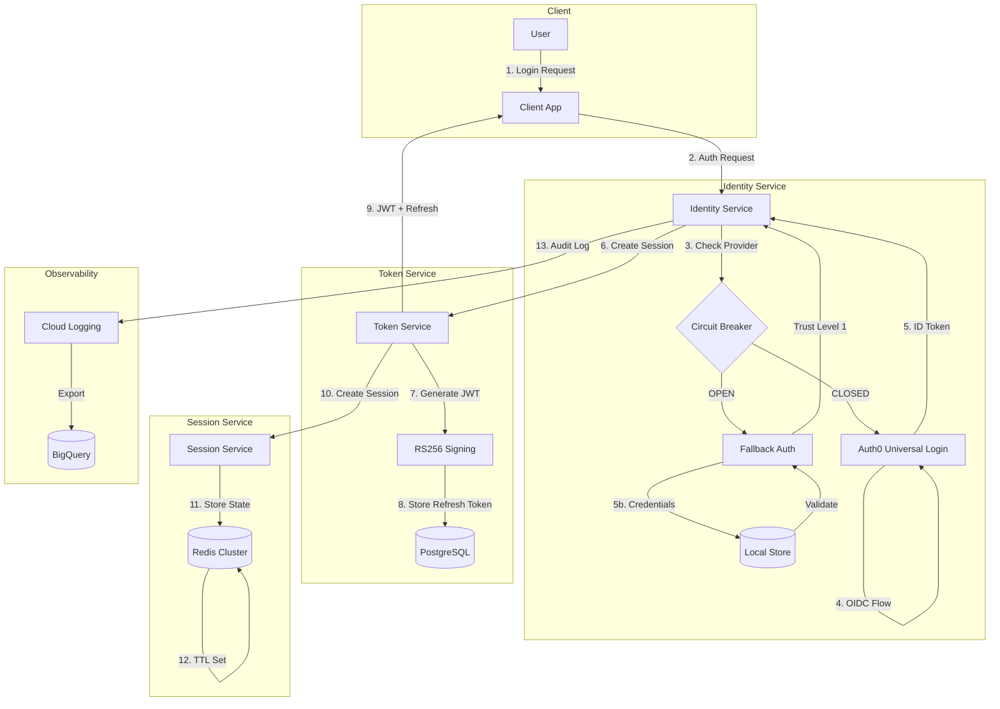
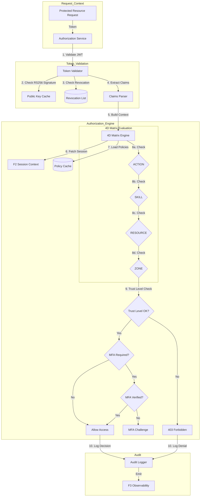
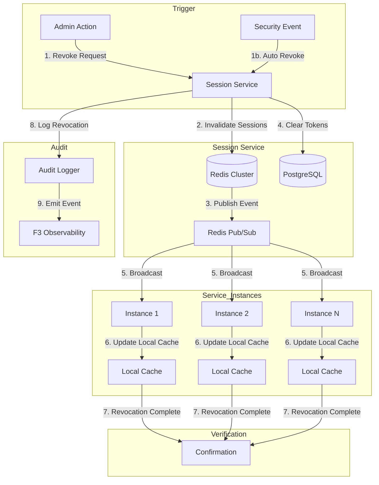

# ADR-01: F1 Identity & Access Management Architecture Decisions {#ADR-01}

> **Module Type**: Foundation (Domain-Agnostic)
> **Upstream**: BRD-01, PRD-01, EARS-01, BDD-01
> **Downstream**: SYS-01, REQ-01, Code (Execution Layer)

---

## 1. Document Control

| Item | Details |
|------|---------|
| **Project Name** | AI Cloud Cost Monitoring Platform |
| **Document Version** | 1.0 |
| **Date** | 2026-02-09T00:00:00 |
| **Document Owner** | Platform Architecture Team |
| **Prepared By** | Coder Agent (Claude) |
| **Status** | Accepted |
| **SYS-Ready Score** | 92% (Target: >=90%) |

### Document Revision History

| Version | Date | Author | Changes |
|---------|------|--------|---------|
| 1.0 | 2026-02-09T00:00:00 | Coder Agent | Initial creation covering 7 architecture decision categories |

---

## 2. Workflow Position

| Layer | Artifact | Status |
|-------|----------|--------|
| 1 | BRD-01 | Complete |
| 2 | PRD-01 | Complete |
| 3 | EARS-01 | Complete |
| 4 | BDD-01 | Complete |
| **5** | **ADR-01** | **Current** |
| 6 | SYS-01 | Pending |

---

## 3. Context

### 3.1 Problem Statement

F1 Identity & Access Management (IAM) requires architectural decisions across seven categories to implement secure, scalable authentication and authorization for the AI Cloud Cost Monitoring Platform.

**Business Drivers** (from BRD-01 Section 7.2):
- Session persistence across service restarts with sub-second access latency
- Secure token storage for stateless authentication
- Enterprise SSO and user federation
- Balance security with user experience for MFA
- Security compliance and incident investigation
- Secure password storage with future-proof algorithm

**Business Constraints** (from BRD-01 Section 8):
- Auth0 as primary identity provider (BRD.01.03.01)
- GCP platform (Secret Manager, Cloud SQL) (BRD.01.03.02)
- JWT token format with RS256 signing (BRD.01.03.03)

### 3.2 Decision Drivers

| Driver ID | Driver | Priority |
|-----------|--------|----------|
| DD-01 | p99 latency requirements (auth <100ms, authz <10ms, token <5ms) | P1 |
| DD-02 | 99.9% availability SLA | P1 |
| DD-03 | Zero-trust security model with default deny | P1 |
| DD-04 | Support 10,000 concurrent users | P2 |
| DD-05 | 5-year audit log retention for compliance | P1 |

---

## 4. Architecture Decisions

### 4.1 Infrastructure: Session State Backend (ADR.01.10.01)

**Status**: Accepted

**Decision**: Use Redis Cluster with AOF persistence for session state management.

**Business Driver**: Session persistence across service restarts with sub-second access latency.

**Options Evaluated**:

| Option ID | Option | Latency | Persistence | Scalability | Cost | Fit |
|-----------|--------|---------|-------------|-------------|------|-----|
| ADR.01.12.01 | Redis Cluster | <1ms | AOF + RDB | Horizontal | Medium | Better |
| ADR.01.12.02 | PostgreSQL | 5-10ms | Full ACID | Vertical | Low | Good |
| ADR.01.12.03 | In-memory + Replication | <0.5ms | None (volatile) | Limited | Low | Poor |

**Rationale**:
- Meets p99 <5ms session lookup requirement (@threshold: BRD.01.perf.token.p99)
- AOF persistence survives process restarts
- Cluster mode enables horizontal scaling for 10K concurrent users
- Native TTL support for session expiration (@threshold: BRD.01.sec.session.idle = 30 minutes)
- Pub/sub capability for session revocation broadcast

**Consequences**:
- Positive (ADR.01.13.01): Sub-millisecond session lookups enable fast authorization
- Positive (ADR.01.13.02): Pub/sub enables real-time session revocation propagation
- Negative (ADR.01.13.03): Requires Redis Cluster operational expertise
- Risk (ADR.01.13.04): Redis failover may cause brief session disruption; mitigated by Sentinel

---

### 4.2 Data Architecture: Token Storage Strategy (ADR.01.10.02)

**Status**: Accepted

**Decision**: Use JWT with RS256 asymmetric signing for access tokens; hash refresh tokens in database.

**Business Driver**: Secure token storage for stateless authentication.

**Options Evaluated**:

| Option ID | Option | Security | Performance | Complexity | Fit |
|-----------|--------|----------|-------------|------------|-----|
| ADR.01.12.04 | JWT RS256 + hashed refresh | High | Fast | Medium | Better |
| ADR.01.12.05 | Opaque tokens + database lookup | High | Slower | Low | Good |
| ADR.01.12.06 | JWT HS256 symmetric | Medium | Fast | Low | Poor |

**Rationale**:
- Asymmetric signing allows public key verification without exposing private key
- Refresh token hashing prevents token theft from database compromise
- Stateless access tokens reduce session lookup overhead
- Enables microservices to validate tokens independently

**Token Claim Schema**:
```json
{
  "user_id": "uuid",
  "trust_level": 1-4,
  "zones": ["paper", "live"],
  "exp": "timestamp",
  "iat": "timestamp",
  "jti": "unique-token-id"
}
```

**Key Rotation Policy**: 90-day rotation cycle

**Consequences**:
- Positive (ADR.01.13.05): Stateless validation achieves <5ms p99 (@threshold: BRD.01.perf.token.p99)
- Positive (ADR.01.13.06): Public key distribution enables distributed validation
- Negative (ADR.01.13.07): Token revocation requires additional revocation list check
- Risk (ADR.01.13.08): Key compromise requires emergency rotation; mitigated by 90-day rotation

---

### 4.3 Integration: Identity Provider Integration (ADR.01.10.03)

**Status**: Accepted

**Decision**: Use Auth0 as primary IdP with OIDC federation; implement email/password fallback.

**Business Driver**: Enterprise SSO and user federation.

**Options Evaluated**:

| Option ID | Option | SSO Support | Maintenance | Cost | Fit |
|-----------|--------|-------------|-------------|------|-----|
| ADR.01.12.07 | Auth0 OIDC | Enterprise | Managed | Medium | Better |
| ADR.01.12.08 | Keycloak self-hosted | Enterprise | Self-managed | Low | Good |
| ADR.01.12.09 | Firebase Auth | Basic | Managed | Low | Poor |

**Rationale**:
- Auth0 provides enterprise SSO out-of-box (Google, Azure AD federation)
- OIDC standard enables identity federation
- Managed service reduces operational overhead
- Fallback authentication ensures availability during Auth0 outages

**Failover Strategy**:
1. Auth0 unavailable detected (5s timeout)
2. Circuit breaker trips to OPEN state
3. Fallback email/password authentication activated
4. Session created with reduced trust level (level 1)
5. Operations team notified via F3 Observability

**Consequences**:
- Positive (ADR.01.13.09): Enterprise SSO enables Google/Azure AD federation
- Positive (ADR.01.13.10): Fallback ensures 99.9% availability
- Negative (ADR.01.13.11): Auth0 vendor dependency
- Risk (ADR.01.13.12): Auth0 outage; mitigated by circuit breaker and fallback

---

### 4.4 Security: MFA Provider Selection (ADR.01.10.04)

**Status**: Accepted

**Decision**: Use Auth0 MFA with TOTP + WebAuthn; support platform-native fallback.

**Business Driver**: Balance security with user experience.

**Options Evaluated**:

| Option ID | Option | Security | UX | Compatibility | Fit |
|-----------|--------|----------|-----|---------------|-----|
| ADR.01.12.10 | Auth0 MFA (TOTP + WebAuthn) | High | Good | Universal | Better |
| ADR.01.12.11 | SMS-only OTP | Medium | Good | Universal | Poor |
| ADR.01.12.12 | Hardware tokens only | Very High | Poor | Limited | Poor |

**Rationale**:
- TOTP provides universal compatibility (any authenticator app)
- WebAuthn offers phishing-resistant authentication
- Platform fallback ensures availability
- Required for Trust Level 3+ operations (@threshold: BRD.01.sec.mfa.required = Trust 3+)

**Recovery Flow Design**:
- 10 single-use backup codes generated at enrollment
- Account recovery requires admin intervention after backup code exhaustion

**Consequences**:
- Positive (ADR.01.13.13): WebAuthn provides phishing resistance
- Positive (ADR.01.13.14): TOTP ensures universal device support
- Negative (ADR.01.13.15): MFA adds friction to user experience
- Risk (ADR.01.13.16): User lockout from MFA; mitigated by backup codes

---

### 4.5 Security: Credential Encryption Strategy (ADR.01.10.05)

**Status**: Accepted

**Decision**: Use AES-256-GCM encryption with GCP Secret Manager for key management.

**Business Driver**: Protect stored credentials at rest.

**Options Evaluated**:

| Option ID | Option | Security | Key Management | Cost | Fit |
|-----------|--------|----------|----------------|------|-----|
| ADR.01.12.13 | AES-256-GCM + Secret Manager | High | Managed | Low | Better |
| ADR.01.12.14 | AWS KMS | High | Managed | Medium | Good |
| ADR.01.12.15 | Local key storage | Medium | Self-managed | Low | Poor |

**Rationale**:
- AES-256-GCM is industry standard for symmetric encryption
- GCP Secret Manager provides automatic key rotation
- Native GCP integration reduces complexity
- Audit logging for all key access operations

**Key Rotation Schedule**: 365-day automatic rotation

**Encryption Scope**:
- User profile data (PII)
- Refresh tokens (hashed, not encrypted)
- API credentials and secrets
- Session metadata

**Consequences**:
- Positive (ADR.01.13.17): Industry-standard encryption protects credentials
- Positive (ADR.01.13.18): Managed key rotation reduces operational burden
- Negative (ADR.01.13.19): GCP platform dependency
- Risk (ADR.01.13.20): Key compromise; mitigated by automatic rotation and audit logging

---

### 4.6 Observability: Authentication Audit Strategy (ADR.01.10.06)

**Status**: Accepted

**Decision**: Implement hybrid audit strategy using Cloud Logging + BigQuery export.

**Business Driver**: Security compliance and incident investigation.

**Options Evaluated**:

| Option ID | Option | Cost | Retention | Query Speed | Integration | Fit |
|-----------|--------|------|-----------|-------------|-------------|-----|
| ADR.01.12.16 | Hybrid (Cloud Logging + BigQuery) | Medium | Custom | Fast | Native GCP | Better |
| ADR.01.12.17 | GCP Cloud Logging only | Low | 30 days | Fast | Native GCP | Good |
| ADR.01.12.18 | Dedicated SIEM (Splunk/Datadog) | High | Custom | Very Fast | API-based | Good |

**Rationale**:
- Cloud Logging for real-time monitoring and alerting (30-day hot storage)
- BigQuery export for long-term retention (5-year compliance requirement)
- Cost-effective compared to dedicated SIEM
- Native GCP integration with existing infrastructure

**Audit Events Captured**:

| Event Type | Event Name | Severity |
|------------|------------|----------|
| Authentication | auth.login.success | Info |
| Authentication | auth.login.failure | Warning |
| Authentication | auth.logout | Info |
| Session | auth.session.revoked | Warning |
| Authorization | authz.decision.allow | Info |
| Authorization | authz.decision.deny | Warning |
| MFA | mfa.enrolled | Info |
| MFA | mfa.verified | Info |
| MFA | mfa.failed | Warning |
| Token | token.issued | Info |
| Token | token.refreshed | Info |
| Token | token.revoked | Warning |

**Alerting Thresholds**:
- 5 failed logins within 5 minutes triggers alert (@threshold: BRD.01.sec.alert.failed_logins)

**Retention Policy**:
- Hot storage (Cloud Logging): 30 days
- Cold storage (BigQuery): 5 years

**Consequences**:
- Positive (ADR.01.13.21): Real-time alerting enables rapid incident response
- Positive (ADR.01.13.22): 5-year retention meets compliance requirements
- Negative (ADR.01.13.23): BigQuery export adds data pipeline complexity
- Risk (ADR.01.13.24): Log volume growth; mitigated by sampling and aggregation

---

### 4.7 AI/ML: N/A (ADR.01.10.07)

**Status**: Not Applicable

**Business Driver**: F1 IAM is a foundation module focused on authentication and authorization infrastructure.

**Rationale**: AI/ML capabilities (anomaly detection, behavioral analysis) are handled by D1 Agent Orchestration layer, not F1 IAM.

**Consequences**:
- No AI/ML decisions required for F1 IAM
- Anomaly detection signals consumed from D1 via event interface

---

### 4.8 Technology Selection: Password Hashing Algorithm (ADR.01.10.08)

**Status**: Accepted

**Decision**: Use bcrypt with cost factor 12 for password hashing; plan Argon2 migration path.

**Business Driver**: Secure password storage with future-proof algorithm.

**Options Evaluated**:

| Option ID | Option | Security | Performance | Support | Fit |
|-----------|--------|----------|-------------|---------|-----|
| ADR.01.12.19 | bcrypt (cost 12) | High | ~250ms | Universal | Better |
| ADR.01.12.20 | Argon2id | Very High | ~300ms | Growing | Good |
| ADR.01.12.21 | PBKDF2 | Medium | Fast | Universal | Poor |
| ADR.01.12.22 | SHA-256 + salt | Low | Very Fast | Universal | Poor |

**Rationale**:
- bcrypt is well-established and widely supported
- Cost factor 12 provides ~250ms hash time (balances security and UX)
- Argon2 migration path defined for future enhancement
- Memory-hard algorithms resist GPU/ASIC attacks

**Migration Path for Algorithm Upgrades**:
1. On next password change, detect current algorithm
2. If bcrypt, rehash with Argon2id
3. Store new hash with algorithm identifier
4. Transparent to user

**Consequences**:
- Positive (ADR.01.13.25): Industry-standard protection against brute force
- Positive (ADR.01.13.26): Clear migration path to Argon2
- Negative (ADR.01.13.27): ~250ms hash time affects login latency
- Risk (ADR.01.13.28): Algorithm obsolescence; mitigated by migration path

---

## 5. Architecture Flow

### 5.1 IAM Authentication Flow



### 5.2 4D Matrix Authorization Flow



### 5.3 Session Revocation Flow



---

## 6. Verification

### 6.1 BDD Scenario Coverage

| Decision ID | BDD Scenario | Verification |
|-------------|--------------|--------------|
| ADR.01.10.01 | BDD.01.13.10, BDD.01.13.25 | Session revocation via Redis pub/sub |
| ADR.01.10.02 | BDD.01.13.04, BDD.01.13.05 | JWT validation and refresh |
| ADR.01.10.03 | BDD.01.13.01, BDD.01.13.09 | Auth0 integration and fallback |
| ADR.01.10.04 | BDD.01.13.03, BDD.01.13.07, BDD.01.13.08 | MFA enrollment and verification |
| ADR.01.10.05 | BDD.01.13.06, BDD.01.13.28 | Encryption standards compliance |
| ADR.01.10.06 | BDD.01.13.01 (audit log assertion) | Audit logging operational |
| ADR.01.10.08 | Implicit in authentication flow | Password hashing |

### 6.2 Success Metrics

| Metric | Target | Measurement |
|--------|--------|-------------|
| Authentication p99 latency | <100ms | @threshold: BRD.01.perf.auth.p99 |
| Authorization p99 latency | <10ms | @threshold: BRD.01.perf.authz.p99 |
| Token validation p99 latency | <5ms | @threshold: BRD.01.perf.token.p99 |
| Session revocation propagation | <1000ms | @threshold: BRD.01.perf.revoke.p99 |
| Auth service uptime | 99.9% | @threshold: BRD.01.avail.auth.uptime |
| Concurrent user support | 10,000 | @threshold: BRD.01.scale.users.concurrent |

---

## 7. Implementation Assessment

### 7.1 Complexity Analysis

| Decision | Complexity (1-5) | Rationale |
|----------|------------------|-----------|
| ADR.01.10.01 Redis Cluster | 3 | Requires cluster configuration and Sentinel setup |
| ADR.01.10.02 JWT RS256 | 2 | Well-documented, standard libraries available |
| ADR.01.10.03 Auth0 OIDC | 2 | Managed service with comprehensive documentation |
| ADR.01.10.04 MFA | 3 | WebAuthn requires browser API integration |
| ADR.01.10.05 AES-256-GCM | 2 | GCP Secret Manager handles complexity |
| ADR.01.10.06 Hybrid Audit | 3 | BigQuery export pipeline setup required |
| ADR.01.10.08 bcrypt | 1 | Standard library implementation |

### 7.2 Dependencies

| Decision | Upstream Dependency | Downstream Impact |
|----------|---------------------|-------------------|
| ADR.01.10.01 | F6 Infrastructure (Redis) | All session-based features |
| ADR.01.10.02 | - | Token validation in all services |
| ADR.01.10.03 | Auth0 subscription | All authentication flows |
| ADR.01.10.04 | Auth0 MFA | Trust level elevation |
| ADR.01.10.05 | F6 Infrastructure (Secret Manager) | Credential storage |
| ADR.01.10.06 | F3 Observability | Security compliance |
| ADR.01.10.08 | - | Password authentication |

### 7.3 Rollback Strategies

| Decision | Rollback Strategy |
|----------|-------------------|
| ADR.01.10.01 | Fallback to single Redis node; feature flag for cluster mode |
| ADR.01.10.02 | Dual-key signing period during key rotation |
| ADR.01.10.03 | Circuit breaker activates fallback authentication |
| ADR.01.10.04 | Disable MFA requirement via feature flag |
| ADR.01.10.05 | Key version rollback in Secret Manager |
| ADR.01.10.06 | Direct Cloud Logging query fallback |
| ADR.01.10.08 | Algorithm identifier allows multi-algorithm support |

---

## 8. Security Considerations

### 8.1 Threat Model

| Threat | Decision Mitigation | Residual Risk |
|--------|---------------------|---------------|
| Credential theft | AES-256-GCM encryption (ADR.01.10.05), bcrypt hashing (ADR.01.10.08) | Low |
| Session hijacking | Redis TTL, session fingerprinting | Low |
| Token theft | RS256 signing (ADR.01.10.02), short expiry | Medium |
| MFA bypass | WebAuthn phishing resistance (ADR.01.10.04) | Low |
| Audit log tampering | Immutable BigQuery storage (ADR.01.10.06) | Low |
| IdP compromise | Fallback authentication (ADR.01.10.03) | Medium |

### 8.2 Compliance Alignment

| Standard | Relevant Decisions |
|----------|-------------------|
| SOC 2 Type II | ADR.01.10.04 (MFA), ADR.01.10.05 (encryption), ADR.01.10.06 (audit) |
| GDPR | ADR.01.10.05 (encryption), ADR.01.10.06 (audit logging) |
| PCI DSS | ADR.01.10.04 (MFA), ADR.01.10.05 (encryption), ADR.01.10.08 (password hashing) |

---

## 9. Related Decisions

### 9.1 ADR Relationships

| Relationship | ADR | Description |
|--------------|-----|-------------|
| Depends on | ADR-008 | Database Strategy MVP (PostgreSQL for user profiles) |
| Related to | ADR-002 | GCP-Only First (platform constraint) |
| Influences | SYS-01 | F1 IAM System Requirements |

### 9.2 Supersedes

None - this is the initial ADR for F1 IAM.

---

## 10. Implementation Notes

### 10.1 Technology Stack Summary

| Component | MVP | Production | Decision Reference |
|-----------|-----|------------|-------------------|
| Primary IdP | Firebase Auth | Auth0 | ADR.01.10.03 |
| Token Format | JWT (RS256) | JWT (RS256) | ADR.01.10.02 |
| Password Hashing | Firebase managed | bcrypt (cost 12) | ADR.01.10.08 |
| MFA | Firebase (optional) | TOTP + WebAuthn | ADR.01.10.04 |
| Secrets | GCP Secret Manager | GCP Secret Manager | ADR.01.10.05 |
| Database | Firestore | PostgreSQL | ADR-008 |
| Session Cache | - | Redis Cluster | ADR.01.10.01 |
| Audit | Cloud Logging | Hybrid (CL + BQ) | ADR.01.10.06 |

### 10.2 Configuration Requirements

| Component | Configuration | Value |
|-----------|---------------|-------|
| Redis | Cluster nodes | 6 (3 primary + 3 replica) |
| Redis | AOF persistence | appendfsync everysec |
| JWT | Access token TTL | 15 minutes |
| JWT | Refresh token TTL | 7 days |
| JWT | Key rotation | 90 days |
| bcrypt | Cost factor | 12 |
| Session | Idle timeout | 30 minutes |
| Session | Absolute timeout | 24 hours |
| Session | Max concurrent | 3 |

---

## 11. Traceability

### 11.1 Cumulative Tags

**Required Tags** (Cumulative Tagging Hierarchy - Layer 5):

@brd: BRD-01
@prd: PRD-01
@ears: EARS-01
@bdd: BDD-01

### 11.2 Upstream References

| Artifact | Reference | Section |
|----------|-----------|---------|
| BRD-01 | BRD.01.10.01 - BRD.01.10.07 | Section 7.2 Architecture Decision Requirements |
| PRD-01 | PRD.01.32.01 - PRD.01.32.07 | Section 10 Architecture Requirements |
| EARS-01 | EARS.01.25.001 - EARS.01.25.012 | Event-Driven Requirements |
| BDD-01 | BDD.01.13.01 - BDD.01.13.32 | Test Scenarios |

### 11.3 Downstream Artifacts

| Artifact | Type | Status |
|----------|------|--------|
| SYS-01 | System Requirements | Pending |
| REQ-01 | Atomic Requirements | Pending |
| Code | Implementation | Pending |

### 11.4 Element ID Registry

| Element Type | ID Range | Count |
|--------------|----------|-------|
| Decisions | ADR.01.10.01 - ADR.01.10.08 | 8 |
| Alternatives | ADR.01.12.01 - ADR.01.12.22 | 22 |
| Consequences | ADR.01.13.01 - ADR.01.13.28 | 28 |

---

## References

- [BRD-01: F1 IAM](../01_BRD/BRD-01_f1_iam/BRD-01.0_index.md)
- [PRD-01: F1 IAM](../02_PRD/PRD-01_f1_iam/PRD-01.0_index.md)
- [EARS-01: F1 IAM](../03_EARS/EARS-01_f1_iam.md)
- [BDD-01: F1 IAM](../04_BDD/BDD-01_f1_iam.feature)
- [ADR-008: Database Strategy MVP](../00_REF/domain/architecture/adr/ADR-008-database-strategy-mvp.md)
- [Auth0 Documentation](https://auth0.com/docs)
- [Redis Cluster Documentation](https://redis.io/docs/management/scaling/)

---

*ADR-01: F1 Identity & Access Management - AI Cost Monitoring Platform v4.2 - February 2026*
