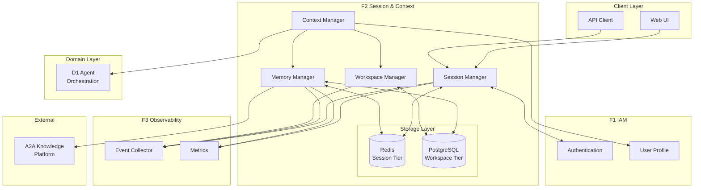
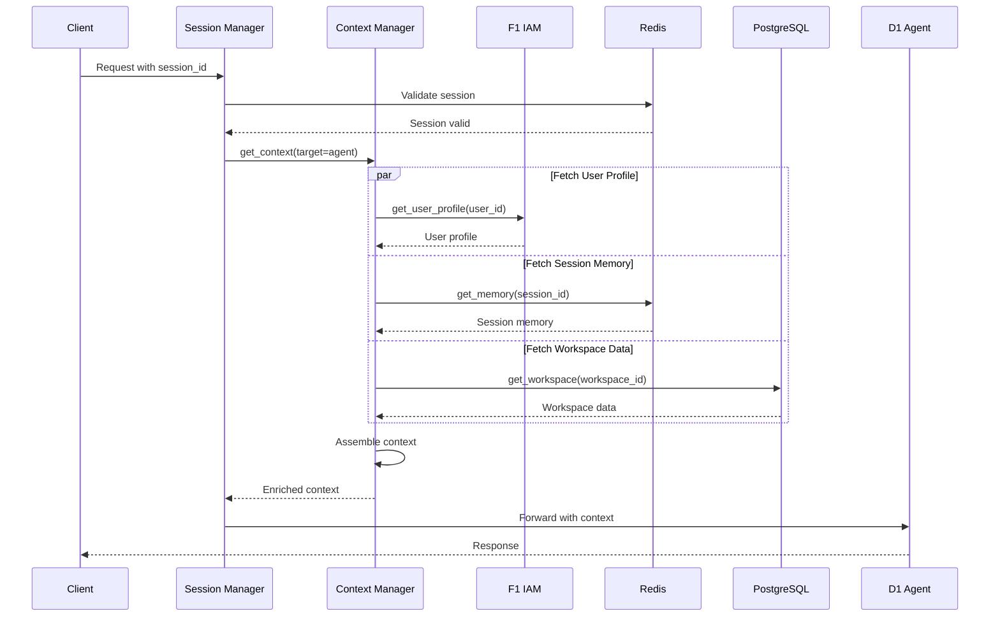

# ADR-02: F2 Session & Context Management Architecture {#ADR-02}

> **Module Type**: Foundation (Domain-Agnostic)
> **Status**: Accepted
> **Upstream**: BRD-02, PRD-02, EARS-02, BDD-02
> **Downstream**: SYS-02, REQ-02, Code

---

## 1. Document Control

| Item | Details |
|------|---------|
| **Project Name** | AI Cloud Cost Monitoring Platform |
| **Document Version** | 1.0.0 |
| **Date** | 2026-02-09T00:00:00 |
| **Document Owner** | Platform Architecture Team |
| **Prepared By** | ADR Skill (Claude) |
| **Status** | Accepted |
| **SYS-Ready Score** | 90% (Target: >=90%) |

### 1.1 Document Revision History

| Version | Date | Author | Changes Made |
|---------|------|--------|--------------|
| 1.0.0 | 2026-02-09T00:00:00 | ADR Skill (Claude) | Initial ADR generated from BRD-02, PRD-02, EARS-02, BDD-02 |

---

## 2. Context

### 2.1 Problem Statement

The AI Cost Monitoring Platform requires stateful session management across microservices to deliver personalized user experiences. Without a centralized session and context management layer, each domain module (D1-D7) would implement its own context handling, leading to:

- **Inconsistent context**: Different modules have varying views of user state
- **Session loss**: Service restarts cause session data loss without persistent backend
- **Manual workspace recreation**: Users must re-establish context each session
- **Limited personalization**: AI agents lack enriched context for personalized responses
- **Cross-device fragmentation**: Session state not synchronized across devices

**Business Driver** (from BRD Section 7.2): Session persistence across service restarts with high-performance access and tiered storage matching data lifetime patterns.

### 2.2 Business Constraints

| Constraint | Source | Impact |
|------------|--------|--------|
| GCP Platform | BRD.02.03.01 | Must use GCP Memorystore for Redis, Cloud SQL for PostgreSQL |
| F1 IAM Dependency | BRD.02.03.03 | User identity requires F1 availability for context enrichment |
| Performance Targets | PRD Section 9.1 | Session lookup <10ms, context assembly <50ms |
| MVP Timeline | PRD Section 2.2 | 8 person-weeks total development budget |

### 2.3 Technical Options Evaluated

Per PRD Section 10, the following architecture decisions require resolution:

| Decision Area | Options Evaluated | BRD Reference |
|---------------|-------------------|---------------|
| Session Storage Backend | Redis, PostgreSQL, In-Memory | BRD.02.10.01 |
| Memory Tier Strategy | Single-tier, Multi-tier, External only | BRD.02.10.02 |
| F1 IAM Integration | Sync call, Async call, Cached only | BRD.02.10.03 |
| Session Token Strategy | UUID v4, JWT, Opaque tokens | BRD.02.10.05 |
| Real-Time Sync Protocol | WebSocket, SSE, gRPC streaming | BRD.02.10.08 |

---

## 3. Decisions

### ADR.02.10.01: Session Storage Backend - Redis Primary with PostgreSQL Fallback

**Decision**: Use GCP Memorystore Redis 7+ as primary session store with automatic failover to PostgreSQL.

**Rationale**:
- Redis provides sub-millisecond latency for session lookups (target: <10ms p95)
- GCP Memorystore offers managed Redis with 99.9% SLA
- PostgreSQL fallback ensures durability during Redis maintenance windows
- Aligns with ADR-008 database strategy (Firestore MVP, PostgreSQL multi-tenant)

**Implementation**:
- Primary: Redis via GCP Memorystore Basic tier (~$50/month)
- Fallback: PostgreSQL session table with indexed session_id
- Automatic failover within 5 seconds of Redis unavailability

@brd: BRD.02.10.01 | @prd: PRD.02.32.01 | @ears: EARS.02.25.018, EARS.02.25.202

---

### ADR.02.10.02: Three-Tier Memory Architecture

**Decision**: Implement hierarchical memory system with Session, Workspace, and Profile tiers.

**Rationale**:
- Tiered storage matches data lifetime and access patterns
- Session tier (ephemeral) optimized for high-frequency, low-latency access
- Workspace tier (persistent) supports cross-session continuity
- Profile tier (permanent) enables long-term learning via A2A platform

**Implementation**:

| Tier | Storage | TTL | Size Limit | Use Case |
|------|---------|-----|------------|----------|
| Session | Redis | 30 min | 100KB | Current conversation, active analysis |
| Workspace | PostgreSQL JSONB | Persistent | 10MB | Watchlists, saved analyses, policies |
| Profile | A2A Knowledge Platform | Permanent | Unlimited | Cost patterns, learned preferences |

**Promotion API**: Explicit `promote()` method moves data from lower to higher tier.

@brd: BRD.02.10.02 | @prd: PRD.02.32.02 | @ears: EARS.02.25.006-009, EARS.02.25.102-103

---

### ADR.02.10.03: F1 IAM Integration - Synchronous with Cache

**Decision**: Synchronous API call to F1 IAM during context assembly with 5-minute cache TTL.

**Rationale**:
- Fresh permissions critical for authorization decisions
- Cache prevents F1 unavailability from blocking context assembly
- 5-minute TTL balances freshness with performance
- Async F3 event emission avoids latency impact

**Implementation**:
- Context assembly fetches user profile from F1 synchronously
- Profile cached in Redis with 5-minute TTL
- On F1 unavailability, use cached profile with staleness flag
- Emit `context.iam_unavailable` event to F3 for monitoring

@brd: BRD.02.10.03, BRD.02.10.04 | @prd: PRD.02.32.03 | @ears: EARS.02.25.013, EARS.02.25.206

---

### ADR.02.10.04: Session Token Strategy - UUID v4 with Hashing

**Decision**: Generate session tokens using UUID v4 with cryptographic randomness, hash before storage.

**Rationale**:
- UUID v4 provides 122 bits of entropy, sufficient for session security
- Hashing prevents token exposure from database breach
- Simpler than JWT for server-side session management
- No token size concerns (fixed 36 characters)

**Implementation**:
- Generate: `uuid.uuid4()` with cryptographic random source
- Storage: SHA-256 hash of token stored in Redis/PostgreSQL
- Transmission: Raw token in HTTP-only secure cookie
- Logging: Never log raw tokens; log only first 8 characters for correlation

@brd: BRD.02.10.05 | @prd: PRD.02.32.04 | @ears: EARS.02.25.401

---

### ADR.02.10.05: Memory Encryption at Rest - AES-256-GCM

**Decision**: Encrypt all session and workspace memory data at rest using AES-256-GCM.

**Rationale**:
- Protects sensitive context data in case of storage breach
- AES-256-GCM provides authenticated encryption (integrity + confidentiality)
- GCP KMS manages encryption keys with automatic rotation
- Compliant with enterprise security requirements

**Implementation**:
- Encryption: AES-256-GCM via GCP KMS
- Key management: Customer-managed encryption keys (CMEK)
- Key rotation: Automatic annual rotation with immediate revocation capability
- Redis: Application-level encryption before storage
- PostgreSQL: Column-level encryption for JSONB data

@brd: BRD.02.02.01 | @prd: PRD.02.32.04 | @ears: EARS.02.25.402

---

### ADR.02.10.06: Session Metrics via Prometheus

**Decision**: Expose session metrics via Prometheus format for F3 Observability integration.

**Rationale**:
- Standard observability stack aligns with platform monitoring
- Prometheus format compatible with Grafana dashboards (ADR-007)
- F3 aggregates metrics across all foundation modules
- Enables SLO monitoring for session service availability

**Implementation**:

| Metric | Type | Labels | Purpose |
|--------|------|--------|---------|
| `f2_session_created_total` | Counter | status | Session creation rate |
| `f2_session_active` | Gauge | - | Current active sessions |
| `f2_session_lookup_duration_seconds` | Histogram | backend | Lookup latency |
| `f2_memory_operations_total` | Counter | tier, operation | Memory usage |
| `f2_context_assembly_duration_seconds` | Histogram | target | Context latency |

@brd: BRD.02.10.07 | @prd: PRD.02.32.05 | @ears: EARS.02.25.017

---

### ADR.02.10.07: Real-Time Sync Protocol - WebSocket (Deferred)

**Decision**: Defer real-time cross-device sync to post-MVP; use polling for Phase 1.

**Rationale**:
- WebSocket adds connection management complexity
- MVP timeline (8 weeks) prioritizes core session functionality
- Polling with 30-second interval acceptable for MVP use cases
- Full WebSocket implementation planned for Phase 2 (GAP-F2-02)

**Implementation** (MVP):
- Client polls `/api/v1/session/sync` every 30 seconds
- Server returns session state hash; client refreshes on mismatch
- Event-driven updates via F3 for admin operations

**Implementation** (Post-MVP):
- WebSocket connection for real-time sync
- Reconnection with exponential backoff
- Message queuing for offline resilience

@brd: BRD.02.10.08 | @prd: PRD.02.32.07 | @ears: EARS.02.25.003

---

### ADR.02.10.08: Context Propagation - Request-Scoped Injection

**Decision**: Inject context into request scope for automatic propagation to downstream services.

**Rationale**:
- Eliminates manual context passing across service boundaries
- Request-scoped context enables consistent audit trails
- OpenTelemetry baggage propagation for distributed tracing
- Domain layers (D1-D7) access context via standard interface

**Implementation**:
- Middleware extracts session_id from cookie/header
- Context assembled and stored in request-local storage
- OpenTelemetry context propagation for distributed calls
- Context interface: `get_context(target: agent|ui|event)`

@brd: BRD.02.01.04 | @prd: PRD.02.01.04 | @ears: EARS.02.25.013, EARS.02.25.014

---

## 4. Architecture Flow

### 4.1 Session Management Architecture



### 4.2 Context Assembly Flow



### 4.3 Memory Promotion Flow

```mermaid
flowchart LR
    subgraph Session["Session Tier (Redis)"]
        S1[Ephemeral Data<br/>TTL: 30min<br/>Limit: 100KB]
    end

    subgraph Workspace["Workspace Tier (PostgreSQL)"]
        W1[Persistent Data<br/>TTL: Unlimited<br/>Limit: 10MB/ws]
    end

    subgraph Profile["Profile Tier (A2A)"]
        P1[Long-term Data<br/>TTL: Permanent<br/>Limit: Unlimited]
    end

    S1 -->|promote()| W1
    W1 -->|promote()| P1

    style S1 fill:#ff9999
    style W1 fill:#99ccff
    style P1 fill:#99ff99
```

---

## 5. Consequences

### ADR.02.13.01: Positive Consequences

| ID | Consequence | Impact |
|----|-------------|--------|
| ADR.02.13.01 | Sub-millisecond session lookup via Redis | Meets <10ms p95 target |
| ADR.02.13.02 | Automatic failover ensures 99.9% availability | Reduces session loss risk |
| ADR.02.13.03 | Three-tier memory optimizes storage costs | Session data in fast Redis, persistent in cheaper PostgreSQL |
| ADR.02.13.04 | Cached F1 profile prevents context assembly blocking | Graceful degradation on F1 unavailability |
| ADR.02.13.05 | AES-256-GCM encryption meets enterprise security | Compliance with data protection requirements |
| ADR.02.13.06 | Standard Prometheus metrics enable SLO monitoring | Integrated with existing F3 observability |

### ADR.02.13.02: Negative Consequences

| ID | Consequence | Mitigation |
|----|-------------|------------|
| ADR.02.13.07 | Redis memory cost scales with concurrent sessions | Monitor usage, implement eviction policies |
| ADR.02.13.08 | PostgreSQL fallback has higher latency (~50ms) | Limit fallback duration, alert on prolonged failover |
| ADR.02.13.09 | 5-minute cache TTL may serve stale permissions | Flag responses using cached data, refresh on critical operations |
| ADR.02.13.10 | Deferred WebSocket sync limits real-time UX | Polling acceptable for MVP, prioritize WebSocket in Phase 2 |
| ADR.02.13.11 | Application-level encryption adds compute overhead | Benchmark, optimize for hot paths |

### ADR.02.13.03: Risks

| ID | Risk | Likelihood | Impact | Mitigation |
|----|------|------------|--------|------------|
| ADR.02.13.12 | Redis service unavailability | Low | High | PostgreSQL fallback, health monitoring |
| ADR.02.13.13 | Session state loss during failover | Medium | High | Session replication, graceful degradation |
| ADR.02.13.14 | Encryption key compromise | Low | Critical | GCP KMS with audit logging, key rotation |
| ADR.02.13.15 | Context assembly latency degradation | Low | Medium | Parallel fetching, caching, timeout handling |

---

## 6. Alternatives Considered

### ADR.02.12.01: Session Storage Alternatives

| Alternative | Pros | Cons | Fit Score |
|-------------|------|------|-----------|
| Redis Only (no fallback) | Simpler architecture | No durability during maintenance | Poor |
| PostgreSQL Only | Strong durability | Higher latency (10-50ms) | Good |
| **Redis + PostgreSQL Fallback** | Low latency + durability | Dual maintenance | Better |
| In-Memory Only | Fastest | No persistence | Poor |

**Selected**: Redis + PostgreSQL Fallback - balances latency and durability requirements.

---

### ADR.02.12.02: Memory Tier Alternatives

| Alternative | Pros | Cons | Fit Score |
|-------------|------|------|-----------|
| Single-tier (Redis only) | Simple | No long-term storage | Poor |
| Two-tier (Session + Profile) | Simpler than three | Missing workspace persistence | Good |
| **Three-tier (Session + Workspace + Profile)** | Full data lifecycle | More complexity | Better |
| External only (A2A) | Unified storage | Latency for ephemeral data | Poor |

**Selected**: Three-tier - matches PRD data lifecycle requirements.

---

### ADR.02.12.03: Token Strategy Alternatives

| Alternative | Pros | Cons | Fit Score |
|-------------|------|------|-----------|
| JWT | Self-contained, stateless | Token size, revocation complexity | Good |
| **UUID v4 + Hash** | Simple, secure | Requires server-side lookup | Better |
| Opaque tokens | Flexible | Implementation overhead | Good |
| Session ID in URL | Simple | Security risk (URL logging) | Poor |

**Selected**: UUID v4 + Hash - simple implementation with strong security.

---

### ADR.02.12.04: Real-Time Sync Alternatives

| Alternative | Pros | Cons | Fit Score |
|-------------|------|------|-----------|
| WebSocket | True real-time | Connection management complexity | Better |
| Server-Sent Events | Simpler than WebSocket | One-way only | Good |
| gRPC Streaming | Efficient binary | Browser support limited | Good |
| **Polling (MVP)** | Simple to implement | Higher latency | Good |

**Selected**: Polling for MVP, WebSocket for Phase 2 - balances timeline with functionality.

---

## 7. Implementation Assessment

### 7.1 Complexity Assessment

| Component | Complexity (1-5) | Effort | Dependencies |
|-----------|------------------|--------|--------------|
| Redis Session Manager | 3 | 1 week | GCP Memorystore |
| PostgreSQL Fallback | 2 | 0.5 week | F6 Infrastructure |
| Three-tier Memory | 4 | 2 weeks | Redis, PostgreSQL, A2A |
| Context Assembly | 3 | 1 week | F1 IAM, Memory Manager |
| Encryption Layer | 3 | 0.5 week | GCP KMS |
| Metrics Integration | 2 | 0.5 week | F3 Observability |

**Total Estimated Effort**: 5.5 weeks (within 8-week MVP budget)

### 7.2 Rollback Strategy

| Decision | Rollback Approach | Effort |
|----------|-------------------|--------|
| Redis Primary | Switch to PostgreSQL-only mode | Config change |
| Three-tier Memory | Disable promotion, use session-only | Code change |
| F1 Cache | Increase cache TTL or disable caching | Config change |
| Encryption | Feature flag to disable encryption | Config change |

### 7.3 Success Metrics

| Metric | Target | Measurement |
|--------|--------|-------------|
| Session lookup p95 | <10ms | F3 Prometheus histogram |
| Context assembly p95 | <50ms | F3 Prometheus histogram |
| Session service uptime | 99.9% | F3 availability monitoring |
| Redis failover time | <5 seconds | F3 alerting |
| Memory promotion success | 100% | F3 counter metrics |

---

## 8. Verification

### 8.1 BDD Scenario Coverage

| Decision | BDD Scenarios | Verification |
|----------|---------------|--------------|
| Redis Storage | BDD.02.13.01, BDD.02.13.02 | Session creation, lookup |
| PostgreSQL Fallback | BDD.02.13.30 | Redis unavailability fallback |
| Three-tier Memory | BDD.02.13.06-08, BDD.02.13.12-13 | Memory get/set, promotion |
| F1 Integration | BDD.02.13.10, BDD.02.13.24 | Context assembly, IAM unavailability |
| Token Security | BDD.02.13.27 | Session token security |
| Encryption | BDD.02.13.28 | Memory encryption at rest |

### 8.2 Performance Validation

| Test | Methodology | Success Criteria |
|------|-------------|------------------|
| Session lookup latency | Load test with 1000 concurrent sessions | p95 <10ms |
| Context assembly latency | End-to-end timing with parallel fetch | p95 <50ms |
| Failover timing | Chaos engineering (Redis kill) | Failover <5 seconds |
| Memory throughput | Sustained load test | 10,000 ops/sec |

### 8.3 Security Validation

| Control | Validation Method | Responsible |
|---------|-------------------|-------------|
| Token entropy | Cryptographic analysis | Security team |
| Encryption strength | Penetration testing | Security team |
| Data isolation | Access control testing | QA team |

---

## 9. Related Decisions

### 9.1 Upstream ADRs

| ADR | Relationship | Impact |
|-----|--------------|--------|
| ADR-002 | GCP-Only First | Constrains to GCP Memorystore, Cloud SQL |
| ADR-007 | Grafana + AG-UI Hybrid | Defines metrics visualization approach |
| ADR-008 | Database Strategy MVP | PostgreSQL for multi-tenant, aligns with fallback strategy |

### 9.2 Downstream Artifacts

| Artifact | Relationship |
|----------|--------------|
| SYS-02 | System requirements implementing these decisions |
| REQ-02 | Atomic requirements derived from decisions |
| SPEC-02 | Technical specifications for implementation |

### 9.3 Related Foundation Modules

| Module | Relationship |
|--------|--------------|
| F1 IAM | Provides user identity for context enrichment |
| F3 Observability | Receives session events and metrics |
| F6 Infrastructure | Provides PostgreSQL and Redis infrastructure |
| F7 Config | Provides session timeout and memory limit settings |

---

## 10. Implementation Notes

### 10.1 Configuration Parameters

| Parameter | Default | Range | Source |
|-----------|---------|-------|--------|
| `session.idle_timeout_minutes` | 30 | 5-1440 | F7 Config |
| `session.absolute_timeout_minutes` | 1440 | 60-1440 | F7 Config |
| `session.concurrent_limit` | 3 | 1-10 | F7 Config |
| `memory.session_size_limit_kb` | 100 | 10-500 | F7 Config |
| `memory.workspace_size_limit_mb` | 10 | 1-100 | F7 Config |
| `context.iam_cache_ttl_minutes` | 5 | 1-60 | F7 Config |
| `redis.failover_timeout_seconds` | 5 | 1-30 | F7 Config |

### 10.2 API Endpoints

| Endpoint | Method | Purpose |
|----------|--------|---------|
| `/api/v1/session` | POST | Create session |
| `/api/v1/session/{id}` | GET | Get session |
| `/api/v1/session/{id}` | DELETE | Terminate session |
| `/api/v1/session/{id}/memory` | GET/PUT | Memory operations |
| `/api/v1/session/{id}/context` | GET | Context assembly |
| `/api/v1/workspace` | CRUD | Workspace management |

### 10.3 Event Schema

| Event Type | Payload Fields | Destination |
|------------|----------------|-------------|
| `session.created` | session_id, user_id, device_id, timestamp | F3 |
| `session.terminated` | session_id, reason, timestamp | F3 |
| `session.expired` | session_id, idle_duration, timestamp | F3 |
| `memory.updated` | session_id, tier, key, size, timestamp | F3 |
| `memory.promoted` | session_id, from_tier, to_tier, key, timestamp | F3 |
| `workspace.switched` | session_id, from_ws, to_ws, timestamp | F3 |
| `context.assembled` | session_id, target, duration_ms, timestamp | F3 |
| `storage.failover` | from_backend, to_backend, timestamp | F3 |

---

## 11. Traceability

### 11.1 Required Tags (Cumulative Tagging Hierarchy - Layer 5)

@brd: BRD-02
@prd: PRD-02
@ears: EARS-02
@bdd: BDD-02

### 11.2 Element ID Summary

| Category | ID Range | Count |
|----------|----------|-------|
| Decisions | ADR.02.10.01 - ADR.02.10.08 | 8 |
| Alternatives | ADR.02.12.01 - ADR.02.12.04 | 4 |
| Consequences | ADR.02.13.01 - ADR.02.13.15 | 15 |

### 11.3 Upstream Source References

| Source | Section | Reference |
|--------|---------|-----------|
| BRD-02 | Section 7.2 | Architecture Decision Requirements |
| PRD-02 | Section 10 | Architecture Requirements |
| EARS-02 | Sections 2-5 | EARS requirements |
| BDD-02 | All scenarios | Test coverage |

### 11.4 Cross-References

| Related ADR | Dependency Type |
|-------------|-----------------|
| ADR-002 (GCP-Only First) | Constrains platform selection |
| ADR-007 (Grafana Hybrid) | Influences metrics visualization |
| ADR-008 (Database Strategy) | Aligns fallback approach |

---

## 12. References

- [BRD-02: F2 Session & Context Management](../01_BRD/BRD-02_f2_session/)
- [PRD-02: F2 Session & Context Management](../02_PRD/PRD-02_f2_session.md)
- [EARS-02: F2 Session Requirements](../03_EARS/EARS-02_f2_session.md)
- [BDD-02: F2 Session Scenarios](../04_BDD/BDD-02_f2_session.feature)
- [ADR-002: GCP-Only First](../00_REF/domain/architecture/adr/002-gcp-only-first.md)
- [ADR-007: Grafana Plus AG-UI Hybrid](../00_REF/domain/architecture/adr/007-grafana-plus-agui-hybrid.md)
- [ADR-008: Database Strategy MVP](../00_REF/domain/architecture/adr/008-database-strategy-mvp.md)
- [F2 Technical Specification](../00_REF/foundation/F2_Session_Technical_Specification.md)

---

*ADR-02: F2 Session & Context Management Architecture - AI Cost Monitoring Platform v4.2*
*Generated: 2026-02-09T00:00:00 | SYS-Ready Score: 90%*
