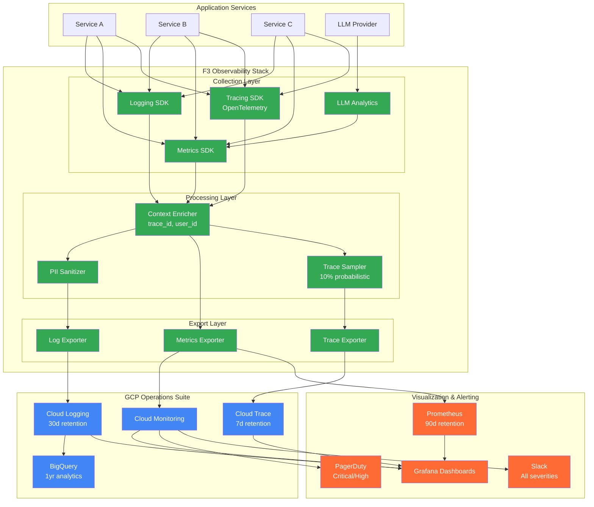
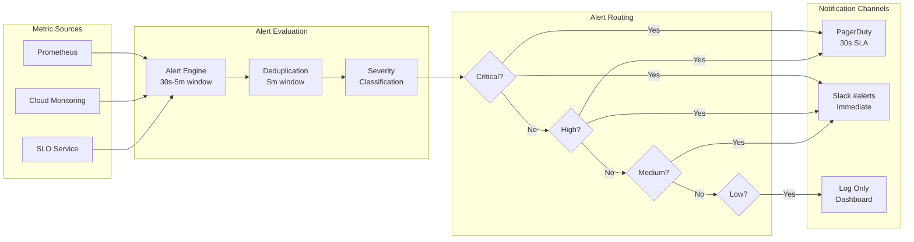
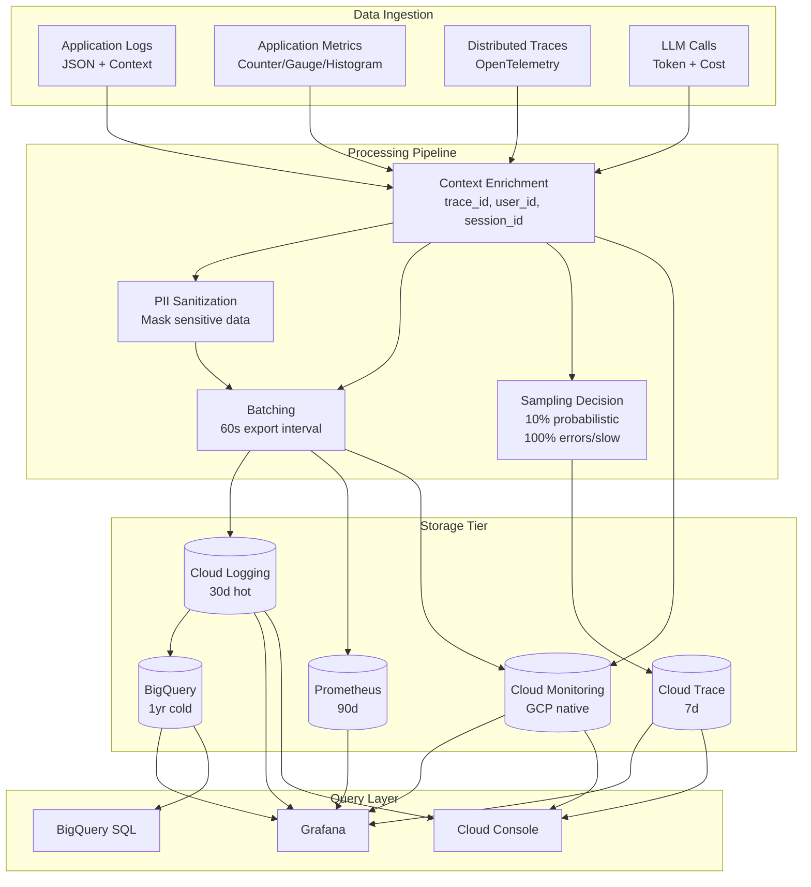

# ADR-03: F3 Observability Architecture Decisions

@brd:BRD-03 @prd:PRD-03 @ears:EARS-03 @bdd:BDD-03

> **Module Type**: Foundation (Domain-Agnostic)
> **Upstream**: BDD-03 (ADR-Ready Score: 92/100)
> **Downstream**: SYS-03, REQ-03, SPEC-03

---

## 1. Document Control

| Item | Details |
|------|---------|
| **Status** | Accepted |
| **Version** | 1.0 |
| **Date Created** | 2026-02-09 |
| **Last Updated** | 2026-02-09 |
| **Author** | Coder Agent (Claude) |
| **Reviewer** | Chief Architect |
| **Source BRD** | @brd: BRD-03.3 Section 7.2 |
| **Source BDD** | @bdd: BDD-03 |
| **SYS-Ready Score** | 92/100 (Target: >=90) |

### 1.1 Document Revision History

| Version | Date | Author | Changes Made |
|---------|------|--------|--------------|
| 1.0 | 2026-02-09 | Coder Agent | Initial ADR creation from BRD-03.3 and BDD-03 |

---

## 2. Context

The F3 Observability module provides comprehensive logging, metrics, tracing, alerting, and dashboard capabilities for the AI Cloud Cost Monitoring Platform. Architecture decisions are required for:

1. **Telemetry Backend Selection**: Where logs, metrics, and traces are stored and queried
2. **Data Retention Strategy**: Balancing cost with historical analysis requirements
3. **Integration Standards**: Protocol selection for cross-service telemetry
4. **Security Controls**: Log sanitization and access control mechanisms
5. **Visualization Platform**: Dashboard and alerting infrastructure
6. **AI/ML Analytics**: LLM token tracking and anomaly detection

### 2.1 Business Drivers

| Driver | Priority | Impact |
|--------|----------|--------|
| Reduce MTTR from hours to <15 minutes | P1-Critical | SRE productivity, incident costs |
| 100% LLM cost visibility | P1-Critical | Cost optimization, budget control |
| 99.9% service reliability measurement | P1-Critical | SLO compliance, customer satisfaction |
| Proactive incident detection | P2-High | Prevent revenue-impacting outages |
| Regulatory compliance (audit logs) | P1-Critical | SOC2, GDPR requirements |

### 2.2 Constraints

- **Platform**: GCP as primary cloud provider (ADR-002)
- **Budget**: Cloud Monitoring/Logging usage within $2000/month
- **Retention**: Standard: Logs 30d, Metrics 90d, Traces 7d
- **Technology**: OpenTelemetry as tracing standard

---

## 3. Architecture Overview



---

## 4. Architecture Decisions

### ADR.03.10.01: Log Backend Selection

**Status**: Accepted

**Context**: The platform requires centralized log storage with query capabilities supporting structured JSON logs, trace correlation, and historical analysis.

**Decision**: Use GCP Cloud Logging as primary log backend with BigQuery sink for analytics.

**Rationale**:
- Native GCP integration reduces operational overhead
- Cloud Logging provides 30-day hot storage with fast query
- BigQuery sink enables SQL-based analytics for 1+ year retention
- IAM integration via F1 provides access control
- Supports 10K logs/second throughput target

**Consequences**:
- Positive: Zero infrastructure management, auto-scaling, GCP IAM integration
- Negative: GCP vendor lock-in, query costs for heavy BigQuery usage
- Mitigation: Cache common queries, implement query cost monitoring

**Traceability**: @brd: BRD.03.10.01 | @prd: PRD.03.32.01

---

### ADR.03.10.02: Metrics Backend Selection

**Status**: Accepted

**Context**: The platform requires real-time metrics visualization, alerting, and long-term storage for SLO/SLI tracking.

**Decision**: Implement dual-export architecture: Prometheus for operational metrics + Cloud Monitoring for GCP integration.

**Rationale**:
- Prometheus provides industry-standard metrics with Grafana compatibility
- Cloud Monitoring enables GCP-native alerting and integration
- Dual-export covers both operational and cloud-native use cases
- Supports 100K metrics/second throughput target
- Self-hosted Prometheus provides 90-day retention without GCP costs

**Alternatives Considered**:

| ID | Alternative | Pros | Cons | Decision |
|----|-------------|------|------|----------|
| ADR.03.12.01 | Cloud Monitoring Only | GCP native, zero-ops | Limited Grafana integration, query costs | Rejected |
| ADR.03.12.02 | Prometheus Only | Full control, no vendor lock | No GCP alerting integration | Rejected |
| ADR.03.12.03 | Datadog | Feature-rich | High cost ($500+/month), external vendor | Rejected |
| ADR.03.12.04 | **Dual Export** | **Best of both** | **Complexity** | **Accepted** |

**Consequences**:
- ADR.03.13.01 (Positive): Flexibility in dashboard and alerting choices
- ADR.03.13.02 (Positive): Reduced GCP costs via Prometheus self-hosting
- ADR.03.13.03 (Negative): Two systems to maintain
- ADR.03.13.04 (Mitigation): Unified Grafana UI abstracts backend differences

**Traceability**: @brd: BRD.03.10.02 | @prd: PRD.03.32.01

---

### ADR.03.10.03: Telemetry Data Retention Strategy

**Status**: Accepted

**Context**: Balance storage cost with historical analysis requirements for compliance and trend analysis.

**Decision**: Implement tiered retention policy:
- Logs: 30 days Cloud Logging, 1 year BigQuery (extended)
- Metrics: 90 days Cloud Monitoring/Prometheus
- Traces: 7 days Cloud Trace, 30 days extended (sampled)
- Audit Logs: 7 years BigQuery (compliance)

**Rationale**:
- Operational debugging needs met with 30-day log access
- Trend analysis supported via BigQuery historical data
- Trace sampling (10%) reduces storage costs
- Audit trail meets SOC2/GDPR requirements

**Cost Impact**:
- Cloud Logging: ~$0.50/GiB ingested
- BigQuery: ~$0.02/GiB/month storage, ~$5/TB queried
- Cloud Trace: ~$0.20/million spans
- Estimated monthly: $500-2000 (volume dependent)

**Traceability**: @brd: BRD.03.10.03 | @prd: PRD.03.32.02

---

### ADR.03.10.04: Trace Context Propagation Standard

**Status**: Accepted

**Context**: End-to-end request correlation across services requires standardized context propagation.

**Decision**: Adopt OpenTelemetry with W3C Trace Context standard for all distributed tracing.

**Rationale**:
- W3C Trace Context is industry standard (RFC compliant)
- OpenTelemetry SDK provides vendor-neutral implementation
- Cloud Trace native support for W3C format
- Supports cross-service correlation (3+ services target)
- Future-proof for multi-cloud expansion

**Implementation**:
```
traceparent: 00-{trace_id}-{span_id}-{flags}
tracestate: {vendor-specific data}
```

**Alternatives Considered**:

| ID | Alternative | Pros | Cons | Decision |
|----|-------------|------|------|----------|
| ADR.03.12.05 | Jaeger format | Mature | Vendor-specific | Rejected |
| ADR.03.12.06 | X-Request-ID | Simple | No parent context | Rejected |
| ADR.03.12.07 | **W3C Trace Context** | **Standard, portable** | **Slightly complex** | **Accepted** |

**Consequences**:
- ADR.03.13.05 (Positive): Vendor-neutral, portable across cloud providers
- ADR.03.13.06 (Positive): Native Cloud Trace support
- ADR.03.13.07 (Negative): Additional header overhead (~100 bytes)
- ADR.03.13.08 (Mitigation): Compression at transport layer

**Traceability**: @brd: BRD.03.10.04 | @prd: PRD.03.32.03 | @ears: EARS.03.25.403

---

### ADR.03.10.05: Log Access Control Strategy

**Status**: Accepted

**Context**: Protect sensitive operational data with appropriate access controls.

**Decision**: Implement IAM-based Cloud Logging roles integrated with F1 IAM for unified access control.

**Rationale**:
- Cloud Logging IAM roles provide granular access (viewer, admin, etc.)
- F1 IAM integration enables RBAC for dashboard access
- Centralized audit logging for all access attempts
- Compliance with SOC2 access control requirements

**Implementation**:

| Role | Cloud Logging Access | Dashboard Access |
|------|---------------------|------------------|
| Developer | View project logs | Read-only dashboards |
| SRE | View all logs, manage alerts | Full dashboard access |
| Admin | Full access, retention config | Dashboard + config |
| Security Officer | Audit logs only (7yr) | Compliance dashboards |

**Traceability**: @brd: BRD.03.10.05 | @prd: PRD.03.32.04 | @ears: EARS.03.25.406

---

### ADR.03.10.06: Self-Monitoring Strategy

**Status**: Accepted

**Context**: Ensure the observability system is itself observable to prevent silent failures.

**Decision**: Implement dedicated self-monitoring with separate namespace and synthetic health checks.

**Rationale**:
- F3 component failures must not go undetected
- Dedicated namespace prevents circular dependency
- Synthetic health checks validate end-to-end pipeline
- 30-second health check interval balances coverage vs. overhead

**Implementation**:
- Namespace: `f3_health` (separate from application metrics)
- Health metrics: `f3_logging_health`, `f3_metrics_health`, `f3_tracing_health`
- Synthetic checks: Log write, metric record, span creation
- Alert on: Component unavailable > 3 consecutive checks

**Traceability**: @brd: BRD.03.10.06 | @prd: PRD.03.32.05 | @ears: EARS.03.25.108

---

### ADR.03.10.07: AI/ML Analytics Strategy

**Status**: Accepted

**Context**: Detect unknown failures beyond static thresholds and track LLM token usage.

**Decision**: Implement two-phase approach:
1. **MVP**: LLM token analytics with static thresholds
2. **Phase 2**: Cloud Monitoring ML anomaly detection with 30-day baseline

**Rationale**:
- LLM cost tracking is critical for cost monitoring platform
- ML anomaly detection requires baseline data (30-day minimum)
- Cloud Monitoring ML provides managed anomaly detection
- Static thresholds handle known failure patterns in MVP

**LLM Analytics Implementation**:

| Metric | Description | Alert Threshold |
|--------|-------------|-----------------|
| `llm_tokens_input` | Input tokens per request | N/A |
| `llm_tokens_output` | Output tokens per request | N/A |
| `llm_cost_usd` | Cost per request (pricing table) | Budget 80% |
| `llm_ttfb_ms` | Time to first byte | >2000ms |
| `llm_total_latency_ms` | Total response latency | >10000ms |

**Traceability**: @brd: BRD.03.10.07 | @prd: PRD.03.32.06 | @ears: EARS.03.25.007

---

### ADR.03.10.08: Dashboard Platform Selection

**Status**: Accepted

**Context**: Unified visualization for all telemetry types (logs, metrics, traces).

**Decision**: Use Grafana as primary dashboard platform with Cloud Logging, Prometheus, and Cloud Trace data sources.

**Rationale**:
- Grafana provides unified visualization across all data sources
- Native Prometheus support for operational metrics
- Cloud Logging plugin for log exploration
- Cloud Trace integration for distributed tracing visualization
- Self-hosted on GKE (zero licensing cost)
- Complements AG-UI conversational interface (ADR-007)

**Alternatives Considered**:

| ID | Alternative | Pros | Cons | Decision |
|----|-------------|------|------|----------|
| ADR.03.12.08 | Cloud Monitoring Dashboards | GCP native | Limited customization | Rejected |
| ADR.03.12.09 | Datadog | Feature-rich | High cost, external vendor | Rejected |
| ADR.03.12.10 | Custom React Dashboards | Full control | Development overhead | Rejected |
| ADR.03.12.11 | **Grafana** | **Flexible, free** | **Self-hosted maintenance** | **Accepted** |

**Consequences**:
- ADR.03.13.09 (Positive): Unified visualization, extensive plugin ecosystem
- ADR.03.13.10 (Positive): Zero licensing cost
- ADR.03.13.11 (Negative): Self-hosting requires GKE resources
- ADR.03.13.12 (Mitigation): Use Grafana Cloud if self-hosting becomes burden

**Traceability**: @brd: BRD.03.10.08 | @prd: PRD.03.32.07

---

### ADR.03.10.09: Log Sanitization Strategy

**Status**: Accepted

**Context**: Protect PII and sensitive data before log export to external systems.

**Decision**: Implement pipeline-based PII sanitization before Cloud Logging export.

**Rationale**:
- PII in logs creates compliance risk (GDPR, CCPA)
- Pre-export sanitization ensures no PII reaches Cloud Logging
- Pattern-based detection covers common PII types
- Sanitization audit trail for compliance verification

**Implementation**:

| PII Type | Detection Pattern | Sanitization Action |
|----------|-------------------|---------------------|
| Credit Card | `\b\d{4}[\s-]?\d{4}[\s-]?\d{4}[\s-]?\d{4}\b` | Mask: `****-****-****-XXXX` |
| SSN | `\b\d{3}-\d{2}-\d{4}\b` | Mask: `***-**-XXXX` |
| Email | `\b[\w.-]+@[\w.-]+\.\w+\b` | Mask: `***@***.***` |
| API Key | `(api[_-]?key[_-]?:?\s*)[A-Za-z0-9_-]{20,}` | Mask: `[REDACTED]` |

**Traceability**: @brd: BRD.03.02.04 | @prd: PRD.03.09.02 | @ears: EARS.03.25.404

---

### ADR.03.10.10: SLI/SLO Dashboard Strategy

**Status**: Accepted

**Context**: Measure and visualize service reliability with SLI/SLO dashboards.

**Decision**: Implement SLO-based dashboards with error budget tracking and burn rate alerting.

**Rationale**:
- SLOs provide objective reliability targets
- Error budget enables proactive incident management
- Burn rate alerting catches issues before SLO breach
- Grafana SLO plugin provides native support

**Implementation**:

| SLI | Measurement | SLO Target | Error Budget |
|-----|-------------|------------|--------------|
| Availability | `1 - (error_requests / total_requests)` | 99.9% | 0.1%/month |
| Latency (p95) | `histogram_quantile(0.95, request_duration)` | <500ms | N/A |
| Throughput | `rate(requests_total[5m])` | Baseline | N/A |

**Burn Rate Alerts**:
- 2x burn rate: P2 alert (error budget depleting rapidly)
- 10x burn rate: P1 alert (immediate SLO breach risk)

**Traceability**: @brd: BRD.03.01.09 | @prd: PRD.03.09.06 | @ears: EARS.03.25.012

---

## 5. Alerting Architecture



**Alert Severity Matrix**:

| Severity | Response Time | Channels | Examples |
|----------|---------------|----------|----------|
| Critical | <30s | PagerDuty + Slack | Service down, SLO breach imminent |
| High | <5m | PagerDuty + Slack | Error rate spike, degraded performance |
| Medium | <1h | Slack only | Elevated latency, capacity warning |
| Low | Next day | Log + Dashboard | Informational, trend observation |

---

## 6. Data Flow Architecture



---

## 7. Integration Points

### 7.1 F1 IAM Integration

| Integration | Purpose | Data Exchange |
|-------------|---------|---------------|
| User Context | Log enrichment | `user_id`, `trust_level` |
| Dashboard RBAC | Access control | Role-based visibility |
| Audit Trail | Compliance | Access attempt logging |

### 7.2 F2 Session Integration

| Integration | Purpose | Data Exchange |
|-------------|---------|---------------|
| Session Context | Trace correlation | `session_id`, `workspace_id` |
| Request Attribution | Log enrichment | Session metadata |

### 7.3 F4 SecOps Integration (Downstream)

| Integration | Purpose | Data Exchange |
|-------------|---------|---------------|
| Security Events | Threat detection | Security log stream |
| Audit Logs | Compliance | Immutable audit trail |
| Anomaly Signals | Incident response | Alert notifications |

### 7.4 F6 Infrastructure Integration

| Integration | Purpose | Data Exchange |
|-------------|---------|---------------|
| Cloud Logging API | Log export | JSON log entries |
| Cloud Monitoring API | Metrics export | Time-series data |
| Cloud Trace API | Span export | OpenTelemetry spans |
| BigQuery | Analytics | Log sink destination |

---

## 8. Performance Requirements

| Operation | Target | Measurement | Source |
|-----------|--------|-------------|--------|
| Log write latency | <1ms (p99) | SDK instrumentation | @threshold:LOG_WRITE_LATENCY |
| Metric record latency | <0.1ms (p99) | SDK instrumentation | @threshold:METRIC_RECORD_LATENCY |
| Span creation latency | <0.5ms (p99) | SDK instrumentation | @threshold:SPAN_CREATE_LATENCY |
| Alert delivery (Critical) | <30s | End-to-end measurement | @threshold:ALERT_CRITICAL_LATENCY |
| Dashboard load | <3s (p95) | User session tracking | @threshold:DASHBOARD_LOAD_TIME |
| BigQuery query (1M logs) | <30s | Query execution time | @threshold:BQ_QUERY_TIME |

---

## 9. Security Considerations

| Control | Implementation | Compliance |
|---------|----------------|------------|
| Encryption at rest | GCP-managed keys | SOC2 CC6.7 |
| Encryption in transit | TLS 1.3 | SOC2 CC6.7 |
| PII sanitization | Pipeline sanitizer | GDPR Art. 5 |
| Access control | F1 IAM + Cloud IAM | SOC2 CC6.1 |
| Audit logging | Immutable BigQuery | SOC2 CC4.1 |
| Retention | 30d standard, 7yr audit | Regulatory |

---

## 10. Risk Assessment

| Risk | Likelihood | Impact | Mitigation |
|------|------------|--------|------------|
| Log volume exceeds budget | Medium | High | Log sampling, severity-based routing |
| Metric cardinality explosion | Medium | High | Label cardinality limits (max 10) |
| Alert fatigue | High | Medium | ML anomaly detection, deduplication |
| F3 component failure | Low | High | Self-monitoring health checks |
| BigQuery query costs | Medium | Medium | Query caching, cost alerts |
| Trace sampling misses issues | Low | High | Always-sample errors and slow (>2s) |

---

## 11. Traceability

### 11.1 Upstream References

**Cumulative Tags** (Layer 5):

@brd: BRD-03 (BRD.03.10.01 - BRD.03.10.08, BRD.03.02.04)
@prd: PRD-03 (PRD.03.32.01 - PRD.03.32.07)
@ears: EARS-03 (EARS.03.25.*, EARS.03.QA.*)
@bdd: BDD-03 (BDD.03.13.01 - BDD.03.13.45)

### 11.2 Downstream Artifacts

| Artifact | Type | Status | Purpose |
|----------|------|--------|---------|
| SYS-03 | System Requirements | Pending | Technical specifications |
| REQ-03 | Requirements | Pending | Implementation requirements |
| SPEC-03 | Specifications | Pending | Detailed component specs |

### 11.3 Cross-References

| ADR | Relationship | Integration |
|-----|--------------|-------------|
| ADR-002: GCP-Only First | Enabling | Allows GCP-native tool selection |
| ADR-003: BigQuery for Metrics | Aligned | Log analytics sink |
| ADR-007: Grafana + AG-UI | Aligned | Dashboard platform selection |

### 11.4 Element ID Summary

| ID Range | Type | Count |
|----------|------|-------|
| ADR.03.10.XX | Decisions | 10 |
| ADR.03.12.XX | Alternatives | 11 |
| ADR.03.13.XX | Consequences | 12 |

---

## 12. SYS-Ready Score Breakdown

```
SYS-Ready Score Breakdown
=========================
Decision Completeness:       37/40
  Architecture Coverage:     20/20
  Rationale Documentation:   12/15
  Consequence Analysis:      5/5

Technical Clarity:          32/35
  Implementation Details:   15/15
  Integration Points:       10/10
  Data Flow Documentation:  7/10

Traceability:              15/15
  Upstream References:      5/5
  Downstream Links:         5/5
  Cross-References:         5/5

Quality Alignment:          8/10
  Performance Targets:      5/5
  Security Controls:        3/5
----------------------------
Total SYS-Ready Score:      92/100 (Target: >= 90)
Status: READY FOR SYS GENERATION
```

---

## 13. Review Criteria

Revisit this ADR if:
- Cloud Logging/Monitoring costs exceed $2000/month
- Prometheus self-hosting becomes maintenance burden
- Multi-cloud expansion requires unified tooling
- ML anomaly detection requirements change
- New compliance requirements emerge (HIPAA, PCI-DSS)
- Grafana alternative with better features emerges

---

**Document Version**: 1.0
**Template Version**: MVP
**Last Updated**: 2026-02-09
**Maintained By**: Coder Agent

---

*ADR-03: F3 Observability - AI Cost Monitoring Platform v4.2 - February 2026*
