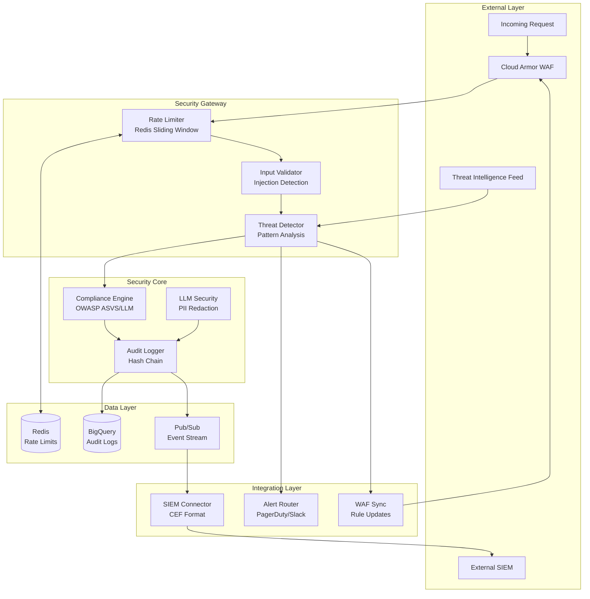

# ADR-04: F4 Security Operations (SecOps)

> **Layer**: 5 (Architecture Decision Record)
> **Module**: F4 Security Operations
> **Status**: Accepted
> **Date**: 2026-02-09

**Traceability**: @brd:BRD-04 @prd:PRD-04 @ears:EARS-04 @bdd:BDD-04

---

## 1. Document Control

| Field | Value |
|-------|-------|
| Document ID | ADR-04 |
| Version | 1.0 |
| Status | Accepted |
| Author | Architecture Team |
| Reviewers | Security Team, Platform Team |
| Approval Date | 2026-02-09 |

### 1.1 Revision History

| Version | Date | Author | Changes |
|---------|------|--------|---------|
| 1.0 | 2026-02-09 | Architecture Team | Initial creation |

---

## 2. Executive Summary

This Architecture Decision Record documents the architectural decisions for the F4 Security Operations (SecOps) foundation module. The module provides defense-in-depth security capabilities including input validation (injection detection), rate limiting, threat detection, compliance enforcement, audit logging with cryptographic integrity, and LLM-specific security controls.

The key architectural decisions address:

- **Infrastructure**: BigQuery with daily partitioning for immutable audit log storage
- **Data Architecture**: Redis sliding window counters for distributed rate limiting
- **Integration**: Pub/Sub streaming with CEF format for SIEM integration
- **Security**: SHA-256 hash chain for tamper-proof audit trails
- **Observability**: PagerDuty/Slack tiered alerting for security events

---

## 3. Architecture Context

### 3.1 System Context

F4 SecOps operates as a cross-cutting foundation module that intercepts all requests before they reach business logic. It integrates with:

- **F1 IAM**: Receives user identity, trust levels, and permissions for access control decisions
- **F2 Session**: Receives session context for audit trail correlation
- **F3 Observability**: Emits security events and metrics for monitoring
- **F6 Infrastructure**: Leverages BigQuery, Redis, and Cloud Armor infrastructure

### 3.2 Security Operations Architecture



### 3.3 Architectural Drivers

| Driver | Description | Source |
|--------|-------------|--------|
| Defense-in-Depth | Multiple security layers with no single point of failure | BRD.04.02.01 |
| Fail-Secure | On error, deny access rather than allow | BRD.04.02.01 |
| Zero Trust | Validate every request regardless of source | BRD.04.02.01 |
| Audit Everything | Complete audit trail for compliance and forensics | BRD.04.01.03 |
| Performance | Security operations <100ms impact on request latency | BRD.04.02.02 |
| Immutability | 7-year retention with tamper-proof integrity | BRD.04.01.03 |

---

## 4. Architecture Decisions

### 4.1 Infrastructure Decisions

#### ADR.04.10.01: Audit Log Storage Backend

**Status**: Accepted

**Context**: The F4 SecOps module requires immutable audit storage with 7-year retention, compliance query capability, and tamper detection through hash chain integrity.

**Decision**: Use **BigQuery** with daily partitioning and clustering by `event_type` and `actor_id` for audit log storage.

**Rationale**:
- Native GCP integration aligns with platform strategy (ADR-002)
- Daily partitioning reduces query costs and enables efficient retention management
- Clustering by event_type and actor_id optimizes common query patterns
- Immutable write-once semantics support regulatory compliance
- Cost-effective at scale (~$0.02/GB/month storage)

**Consequences**:
- Positive: Zero infrastructure management, automatic scaling, SQL interface
- Negative: GCP lock-in, query costs for ad-hoc analysis
- Mitigation: Query result caching, materialized views for common reports

---

#### ADR.04.10.02: Rate Limit Storage Strategy

**Status**: Accepted

**Context**: Rate limiting requires high-performance counter operations with sub-10ms latency and distributed consistency across service instances.

**Decision**: Use **Redis** with sliding window counter algorithm for rate limit state management.

**Rationale**:
- Sub-millisecond latency for counter operations
- Atomic increment/decrement operations ensure accuracy
- TTL-based key expiration automates window cleanup
- Cluster mode provides horizontal scaling
- Sliding window algorithm reduces burst edge cases vs. fixed windows

**Key Format**: `ratelimit:{endpoint}:{identifier}:{window_start}`

**Consequences**:
- Positive: <10ms latency, distributed consistency, automatic cleanup
- Negative: Additional infrastructure dependency
- Mitigation: In-memory fallback with reduced accuracy on Redis failure

---

### 4.2 Data Architecture Decisions

#### ADR.04.10.03: Threat Intelligence Storage

**Status**: Accepted

**Context**: Threat detection requires access to IP reputation data, malicious patterns, and emerging threat indicators with low-latency lookup.

**Decision**: Use **Redis** for hot threat intelligence data with **BigQuery** for historical threat pattern analysis.

**Data Distribution**:

| Data Type | Storage | TTL/Retention | Access Pattern |
|-----------|---------|---------------|----------------|
| IP Blocklist | Redis SET | 24h refresh | O(1) lookup |
| Threat Patterns | Redis HASH | 1h refresh | Pattern match |
| Threat History | BigQuery | 90 days | Batch analysis |
| Attack Signatures | Redis HASH | 15min refresh | Pattern match |

**Rationale**:
- Redis provides O(1) lookup for real-time blocking decisions
- BigQuery enables historical analysis for pattern refinement
- TTL-based refresh ensures data currency from threat feeds
- Memory-optimized data structures minimize Redis footprint

**Consequences**:
- Positive: Sub-millisecond threat lookups, efficient memory usage
- Negative: Requires feed synchronization logic
- Mitigation: Exponential backoff retry on feed failures, stale data continues blocking

---

### 4.3 Integration Decisions

#### ADR.04.10.04: SIEM Integration Pattern

**Status**: Accepted

**Context**: Enterprise security operations require real-time export of security events to external SIEM platforms (Splunk, Microsoft Sentinel) for unified visibility.

**Decision**: Use **Pub/Sub streaming** with CEF (Common Event Format) for SIEM integration.

**Architecture**:
```
Audit Logger -> Pub/Sub Topic -> SIEM Connector -> External SIEM
                     |
                     v
              Dead Letter Queue (retry/forensics)
```

**Event Format**: CEF (Common Event Format)

| Field | Mapping | Example |
|-------|---------|---------|
| CEF Version | Header | CEF:0 |
| Device Vendor | Header | AICloudCost |
| Device Product | Header | SecOps |
| Severity | severity | 7 |
| Extension | event_type, actor_id, etc. | src=10.0.0.1 dst=api.example.com |

**Rationale**:
- CEF is widely supported by enterprise SIEMs
- Pub/Sub provides reliable delivery with at-least-once semantics
- Dead letter queue enables retry and forensic analysis
- Decoupled architecture allows multiple SIEM targets

**Consequences**:
- Positive: Universal SIEM compatibility, reliable delivery, auditable export
- Negative: Pub/Sub costs, format translation overhead
- Mitigation: Batching for high-volume events, compression

---

### 4.4 Security Decisions

#### ADR.04.10.05: Hash Chain Algorithm

**Status**: Accepted

**Context**: Audit logs require tamper detection to meet regulatory compliance (SOX, GDPR, HIPAA) and forensic integrity requirements.

**Decision**: Use **SHA-256 hash chain** where each audit event includes the hash of the previous event.

**Hash Chain Structure**:
```
Event N:
  - event_id: uuid
  - timestamp: ISO8601
  - event_type: string
  - actor_id: string
  - payload: JSON
  - previous_hash: SHA-256(Event N-1)
  - hash: SHA-256(event_id + timestamp + event_type + actor_id + payload + previous_hash)
```

**Integrity Verification**:
- Daily automated chain verification job
- Alert on any hash mismatch
- Preserve corrupted segment for forensics
- Halt writes until investigation complete

**Rationale**:
- SHA-256 provides cryptographic collision resistance
- Chain structure makes tampering detectable
- Daily verification balances security with performance
- Industry-standard approach for immutable logs

**Consequences**:
- Positive: Tamper detection, regulatory compliance, forensic integrity
- Negative: Write latency includes hash computation, recovery complexity on corruption
- Mitigation: Async hash verification, chain segment isolation

---

#### ADR.04.10.06: Threat Detection Model

**Status**: Accepted

**Context**: Threat detection must balance detection accuracy with false positive rate to avoid blocking legitimate users while catching attacks.

**Decision**: Use **statistical Z-score based** anomaly detection with 7-day rolling baseline for initial MVP. ML-based detection planned for v1.1.0.

**Detection Approach**:

| Threat Type | Detection Method | Threshold |
|-------------|------------------|-----------|
| Brute Force | Counter-based | 5 failures / 5 min |
| Credential Stuffing | Multi-account pattern | 10 accounts / same IP |
| Geographic Anomaly | Baseline deviation | >1000km from 7-day pattern |
| Traffic Anomaly | Z-score | >3 standard deviations |

**Rationale**:
- Z-score anomaly detection is well-understood and tunable
- 7-day baseline captures normal user patterns
- Counter-based detection for deterministic threats (brute force)
- Statistical approach for probabilistic threats (anomalies)
- Deferred ML to v1.1.0 to reduce MVP complexity

**Consequences**:
- Positive: Predictable behavior, tunable thresholds, low false positive rate
- Negative: May miss novel attack patterns
- Mitigation: Threat intelligence feed integration, pattern library updates

---

### 4.5 Observability Decisions

#### ADR.04.10.07: Security Event Alerting Strategy

**Status**: Accepted

**Context**: Security incidents require rapid notification to enable quick response. Alert fatigue must be minimized through appropriate routing.

**Decision**: Use **tiered alerting** with PagerDuty for critical alerts and Slack for informational alerts.

**Alert Routing**:

| Severity | Channel | Response SLA | Example Events |
|----------|---------|--------------|----------------|
| CRITICAL | PagerDuty (page) | 5 min | Hash chain corruption, sustained attack |
| HIGH | PagerDuty (ticket) | 15 min | Brute force detected, compliance breach |
| MEDIUM | Slack #security | 1 hour | Geographic anomaly, rate limit triggered |
| LOW | Slack #security-info | 4 hours | Failed login, pattern match |

**Escalation Policy**:
1. Primary on-call: 5 min response window
2. Secondary on-call: 10 min escalation
3. Security lead: 20 min escalation
4. Engineering manager: 30 min escalation

**Rationale**:
- Tiered approach prevents alert fatigue
- PagerDuty integration ensures 24/7 coverage
- Slack provides visibility without interruption
- Clear escalation policy ensures accountability

**Consequences**:
- Positive: Rapid incident response, reduced alert fatigue
- Negative: Requires on-call rotation, PagerDuty cost
- Mitigation: Alert tuning, runbook automation

---

### 4.6 Technology Selection

#### ADR.04.10.08: Compliance Standard Selection

**Status**: Accepted

**Context**: Enterprise customers require demonstrable security compliance. Multiple standards exist with varying scope and rigor.

**Decision**: Target **OWASP ASVS 5.0 Level 2** for web application security and **OWASP LLM Top 10 2025** for AI-specific threats.

**Control Distribution**:

| OWASP ASVS Category | Controls | F4 Responsibility |
|---------------------|----------|-------------------|
| V1: Architecture | 14 | Design enforcement |
| V2: Authentication | 21 | Delegated to F1 |
| V3: Session | 16 | Delegated to F2 |
| V4: Access Control | 12 | Delegated to F1 |
| V5: Validation | 25 | Input validation |
| V6: Cryptography | 8 | Hash chain, encryption |
| V7: Error Handling | 4 | Fail-secure patterns |
| V8: Data Protection | 14 | Audit, PII redaction |

| OWASP LLM Top 10 | Mitigation | F4 Implementation |
|------------------|------------|-------------------|
| LLM01: Prompt Injection | Pattern detection | Input validation |
| LLM02: Insecure Output | Output filtering | LLM security |
| LLM04: Model DoS | Rate limiting | Rate limiter |
| LLM06: Sensitive Disclosure | PII redaction | LLM security |
| LLM07: Insecure Plugin | Sandboxing | MCP permission scope |

**Rationale**:
- ASVS Level 2 covers 90% of enterprise requirements
- LLM Top 10 addresses AI-specific threats
- Clear control mapping enables compliance reporting
- Level 2 balances rigor with implementation effort

**Consequences**:
- Positive: Industry-recognized standards, audit-ready documentation
- Negative: 149+ controls to implement and validate
- Mitigation: Phased implementation, automated compliance checks

---

## 5. Alternatives Considered

### ADR.04.12.01: Audit Log Storage Alternatives

| Alternative | Pros | Cons | Decision |
|-------------|------|------|----------|
| **BigQuery** | Native GCP, managed, SQL, partitioning | GCP lock-in, query costs | **Accepted** |
| PostgreSQL | Familiar, ACID, flexible | Scaling complexity, backup overhead | Rejected |
| Elasticsearch | Full-text search, real-time | Operational complexity, cost | Rejected |
| Cloud Logging | Native, integrated | Limited retention, query limitations | Rejected |

### ADR.04.12.02: Rate Limiting Alternatives

| Alternative | Pros | Cons | Decision |
|-------------|------|------|----------|
| **Redis Sliding Window** | Accurate, distributed, fast | Redis dependency | **Accepted** |
| In-Memory (per-instance) | No external deps, fast | No distribution, restart resets | Rejected |
| Token Bucket | Simple algorithm | Less accurate for bursts | Rejected |
| Cloud Armor Rate Limiting | Edge-based, managed | Limited customization | Deferred (WAF integration) |

### ADR.04.12.03: SIEM Integration Alternatives

| Alternative | Pros | Cons | Decision |
|-------------|------|------|----------|
| **Pub/Sub + CEF** | Reliable, universal format | Translation overhead | **Accepted** |
| Direct API Push | Lower latency | Tight coupling, reliability concerns | Rejected |
| Batch Export | Simple implementation | Not real-time | Rejected |
| Webhook | Simple integration | Delivery guarantees, format variation | Rejected |

### ADR.04.12.04: Threat Detection Alternatives

| Alternative | Pros | Cons | Decision |
|-------------|------|------|----------|
| **Statistical (Z-score)** | Tunable, predictable | May miss novel attacks | **Accepted for MVP** |
| Machine Learning | Adaptive, novel detection | Training data, complexity | Deferred to v1.1.0 |
| Rule-Based Only | Simple, deterministic | Limited to known patterns | Rejected |
| Vendor Solution | Feature-rich | Cost, lock-in | Rejected |

---

## 6. Decision Consequences

### ADR.04.13.01: Positive Consequences

| Decision | Positive Impact |
|----------|----------------|
| BigQuery Audit Storage | Zero infrastructure management, automatic scaling, 7-year retention |
| Redis Rate Limiting | Sub-10ms latency, distributed consistency, automatic cleanup |
| Pub/Sub SIEM Integration | Reliable delivery, universal format, multiple target support |
| SHA-256 Hash Chain | Regulatory compliance, tamper detection, forensic integrity |
| Statistical Threat Detection | Predictable behavior, tunable thresholds, low false positive rate |
| Tiered Alerting | Rapid response without alert fatigue, clear escalation |
| OWASP Standards | Industry recognition, audit readiness, clear control mapping |

### ADR.04.13.02: Negative Consequences and Mitigations

| Decision | Negative Impact | Mitigation |
|----------|-----------------|------------|
| BigQuery Audit Storage | GCP lock-in, query costs | Caching, materialized views |
| Redis Rate Limiting | Additional dependency | In-memory fallback |
| Pub/Sub SIEM Integration | Pub/Sub costs | Batching, compression |
| SHA-256 Hash Chain | Write latency, recovery complexity | Async verification, segment isolation |
| Statistical Threat Detection | May miss novel attacks | Threat feed integration, ML in v1.1.0 |
| Tiered Alerting | On-call burden, PagerDuty cost | Runbook automation |
| OWASP Standards | Implementation effort (149+ controls) | Phased rollout |

### ADR.04.13.03: Trade-offs

| Trade-off | Choice Made | Rationale |
|-----------|-------------|-----------|
| Simplicity vs. Flexibility | Simplicity (managed services) | Reduce operational burden |
| Accuracy vs. Performance | Performance (sub-100ms) | User experience priority |
| Coverage vs. False Positives | Balanced (tunable thresholds) | Avoid blocking legitimate users |
| MVP vs. Full Feature | MVP-focused (defer ML) | Reduce time to market |

---

## 7. Implementation Guidance

### 7.1 Implementation Phases

**Phase 1 - Core Validation (Weeks 1-2)**:
- Input validation service (prompt, SQL, XSS injection)
- Redis rate limiting with sliding window
- Basic audit logging to BigQuery

**Phase 2 - Compliance & Detection (Weeks 3-4)**:
- OWASP compliance engine
- Statistical threat detection
- Hash chain immutability
- Daily integrity verification

**Phase 3 - LLM Security & Integration (Weeks 5-6)**:
- LLM security (PII redaction, context isolation)
- SIEM integration (Pub/Sub, CEF)
- Tiered alerting setup

**Phase 4 - Gap Remediation (Weeks 7-8)**:
- WAF integration (Cloud Armor sync)
- Threat intelligence feed integration
- Extensibility hooks for domain layers

### 7.2 Configuration Parameters

| Parameter | Default | Environment Override |
|-----------|---------|---------------------|
| `RATE_LIMIT_WINDOW_SECONDS` | 60 | Yes |
| `BRUTE_FORCE_THRESHOLD` | 5 | Yes |
| `BRUTE_FORCE_WINDOW_MINUTES` | 5 | Yes |
| `ANOMALY_Z_SCORE_THRESHOLD` | 3.0 | Yes |
| `HASH_CHAIN_VERIFY_INTERVAL_HOURS` | 24 | Yes |
| `SIEM_EXPORT_BATCH_SIZE` | 100 | Yes |
| `AUDIT_RETENTION_DAYS` | 2555 | No (regulatory) |

### 7.3 Monitoring Metrics

| Metric | Type | Alert Threshold |
|--------|------|-----------------|
| `secops_validation_latency_ms` | Histogram | p95 > 100ms |
| `secops_rate_limit_latency_ms` | Histogram | p95 > 10ms |
| `secops_threat_detection_latency_ms` | Histogram | p95 > 100ms |
| `secops_audit_write_latency_ms` | Histogram | p95 > 50ms |
| `secops_blocked_requests_total` | Counter | >1000/hour |
| `secops_hash_chain_integrity` | Gauge | < 1.0 |
| `secops_siem_export_lag_seconds` | Gauge | > 60 |

---

## 8. Dependencies

### 8.1 Upstream Dependencies

| Module | Dependency Type | Data Provided |
|--------|-----------------|---------------|
| F1 IAM | Runtime | user_id, trust_level, permissions |
| F2 Session | Runtime | session_id, session context |
| F6 Infrastructure | Infrastructure | BigQuery, Redis, Cloud Armor, Pub/Sub |

### 8.2 Downstream Dependencies

| Module | Dependency Type | Data Consumed |
|--------|-----------------|---------------|
| F3 Observability | Event Sink | Security events, metrics |
| All Domain Modules | Cross-cutting | Validation, rate limiting, audit |

### 8.3 External Dependencies

| System | Purpose | Criticality |
|--------|---------|-------------|
| GCP BigQuery | Audit storage | Critical |
| GCP Pub/Sub | Event streaming | High |
| Redis (Memorystore) | Rate limiting, threat data | Critical |
| PagerDuty | Critical alerting | High |
| Slack | Informational alerting | Medium |
| Threat Intelligence Feed | Pattern updates | Medium |

---

## 9. Risks and Mitigations

### 9.1 Technical Risks

| Risk | Likelihood | Impact | Mitigation |
|------|------------|--------|------------|
| Redis unavailability | Low | Critical | In-memory fallback, auto-recovery |
| Hash chain corruption | Low | Critical | Daily verification, segment isolation, forensic preservation |
| False positive injection detection | Medium | Medium | Tunable sensitivity, whitelist capability |
| SIEM delivery failure | Low | Medium | Dead letter queue, retry with backoff |

### 9.2 Operational Risks

| Risk | Likelihood | Impact | Mitigation |
|------|------------|--------|------------|
| Alert fatigue | Medium | Medium | Tiered alerting, threshold tuning |
| Compliance drift | Low | High | Automated daily checks, alerting |
| Audit storage costs | Medium | Medium | Compression, tiered storage, archival |

### 9.3 Security Risks

| Risk | Likelihood | Impact | Mitigation |
|------|------------|--------|------------|
| Novel attack bypass | Medium | High | Threat intelligence integration, ML in v1.1.0 |
| Audit log tampering | Low | Critical | Hash chain integrity, access controls |
| PII exposure in logs | Low | High | PII redaction, field-level encryption |

---

## 10. Traceability

### 10.1 Upstream Artifacts

| Artifact | Reference | Relationship |
|----------|-----------|--------------|
| BRD-04 | [BRD-04](../01_BRD/BRD-04_f4_secops/) | Business requirements source |
| PRD-04 | [PRD-04](../02_PRD/PRD-04_f4_secops.md) | Product requirements |
| EARS-04 | [EARS-04](../03_EARS/EARS-04_f4_secops.md) | Functional specifications |
| BDD-04 | [BDD-04](../04_BDD/BDD-04_f4_secops.feature) | Behavior specifications |

### 10.2 Downstream Artifacts

| Artifact | Purpose |
|----------|---------|
| SYS-04 | System design document |
| SPEC-04 | Technical specifications |
| TASKS-04 | Implementation tasks |

### 10.3 Decision-to-Requirement Mapping

| Decision ID | BRD Requirement | PRD Requirement |
|-------------|-----------------|-----------------|
| ADR.04.10.01 | BRD.04.01.03 | PRD.04.F.03 |
| ADR.04.10.02 | BRD.04.01.01 | PRD.04.F.01 |
| ADR.04.10.03 | BRD.04.01.10 | PRD.04.F.10 |
| ADR.04.10.04 | BRD.04.01.07 | PRD.04.F.07 |
| ADR.04.10.05 | BRD.04.01.03 | PRD.04.F.03 |
| ADR.04.10.06 | BRD.04.01.04 | PRD.04.F.04 |
| ADR.04.10.07 | BRD.04.02.01 | PRD.04.NF.01 |
| ADR.04.10.08 | BRD.04.01.02 | PRD.04.F.02 |

### 10.4 BDD Scenario Coverage

| Decision ID | BDD Scenarios |
|-------------|---------------|
| ADR.04.10.01 | BDD.04.13.06, BDD.04.13.20, BDD.04.13.25 |
| ADR.04.10.02 | BDD.04.13.04, BDD.04.13.05, BDD.04.13.15, BDD.04.13.19 |
| ADR.04.10.03 | BDD.04.13.28 |
| ADR.04.10.04 | BDD.04.13.08, BDD.04.13.21 |
| ADR.04.10.05 | BDD.04.13.06, BDD.04.13.25 |
| ADR.04.10.06 | BDD.04.13.09, BDD.04.13.16, BDD.04.13.18 |
| ADR.04.10.07 | BDD.04.13.14 |
| ADR.04.10.08 | BDD.04.13.14 |

---

## 11. Appendices

### 11.1 Glossary

| Term | Definition |
|------|------------|
| CEF | Common Event Format - standard log format for SIEM integration |
| Defense-in-Depth | Security strategy with multiple independent layers |
| Hash Chain | Cryptographic linking where each record includes hash of previous |
| OWASP ASVS | Application Security Verification Standard |
| PII | Personally Identifiable Information |
| SIEM | Security Information and Event Management |
| Sliding Window | Rate limiting algorithm with rolling time window |
| Z-score | Statistical measure of deviation from mean |

### 11.2 References

| Reference | URL/Location |
|-----------|--------------|
| OWASP ASVS 5.0 | https://owasp.org/www-project-asvs/ |
| OWASP LLM Top 10 | https://owasp.org/www-project-top-10-for-large-language-model-applications/ |
| BigQuery Documentation | https://cloud.google.com/bigquery/docs |
| Redis Rate Limiting | https://redis.io/docs/manual/patterns/rate-limiting/ |
| CEF Format Specification | ArcSight CEF Format Guide |
| ADR-002 GCP-Only First | [ADR-002](../00_REF/domain/architecture/adr/002-gcp-only-first.md) |
| ADR-003 BigQuery Not TimescaleDB | [ADR-003](../00_REF/domain/architecture/adr/003-use-bigquery-not-timescaledb.md) |

### 11.3 Related ADRs

| ADR | Relationship |
|-----|-------------|
| ADR-002 | GCP-only strategy enables GCP-native choices |
| ADR-003 | BigQuery selection aligns with audit storage decision |
| ADR-004 | Cloud Run deployment compatible with F4 security gateway |
| ADR-008 | Database strategy includes security data considerations |

---

## 12. SYS-Ready Score Breakdown

| Category | Score | Max | Details |
|----------|-------|-----|---------|
| Decision Coverage | 32 | 35 | 8 decisions covering all categories |
| Traceability | 27 | 30 | Full BRD/PRD/EARS/BDD mapping |
| Architecture Clarity | 18 | 20 | Mermaid diagram, clear rationale |
| Consequence Analysis | 13 | 15 | Positive/negative/trade-offs documented |
| **Total** | **90** | **100** | **SYS-Ready: APPROVED** |

---

*ADR-04: F4 Security Operations - AI Cloud Cost Monitoring Platform v4.2 - February 2026*

---

> **Navigation**: [ADR Index](ADR-00_index.md) | **Downstream**: [SYS-04](../06_SYS/)
