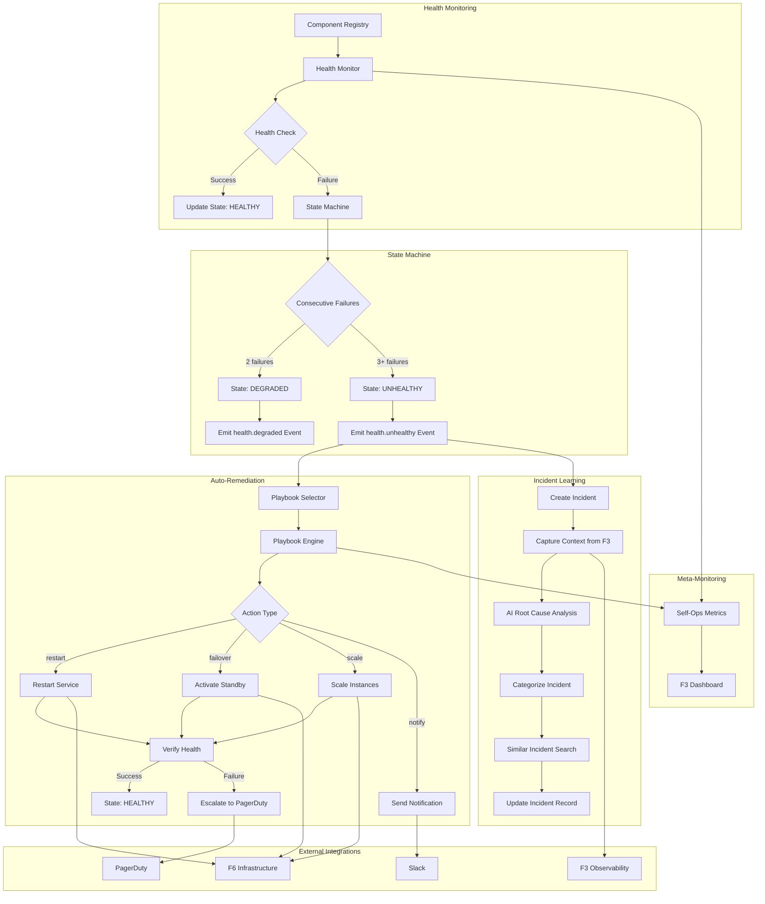

@brd:BRD-05 @prd:PRD-05 @ears:EARS-05 @bdd:BDD-05

# ADR-05: F5 Self-Sustaining Operations Architecture Decisions

## 1. Document Control

| Item | Details |
|------|---------|
| **Status** | Accepted |
| **Date** | 2026-02-09T00:00:00 |
| **Decision Makers** | Platform Architecture Team, SRE Lead |
| **Author** | AI Architecture Agent |
| **Version** | 1.0 |
| **SYS-Ready Score** | 90/100 (Target: >=85 for MVP) |

---

## 2. Context

### 2.1 Problem Statement

**Originating Topics**: BRD.05.10.01 - BRD.05.10.09 (Architecture Decision Requirements from BRD Section 7.2)

The F5 Self-Sustaining Operations module requires architectural decisions across seven domains to enable automated health monitoring, self-healing remediation, and AI-powered incident management. The system must continuously monitor distributed components, detect failures within 1 minute (MTTD), execute automated remediation within 5 minutes (MTTR), and learn from incidents to prevent recurrence.

**Business Drivers**:
- Reduce MTTR from hours to minutes through automation
- Minimize SRE on-call burden via self-healing capabilities
- Prevent incident recurrence through AI-powered root cause analysis
- Maintain 99.9% platform availability

**Key Constraints**:
- GCP-only platform (Cloud Run, BigQuery, Pub/Sub)
- Vertex AI for LLM capabilities (vendor dependency)
- F3 Observability required for metrics/logs/traces access
- Slack and PagerDuty as notification channels

### 2.2 Technical Context

**Current State**:
- F3 Observability provides metrics, logs, and traces collection
- F6 Infrastructure provides Cloud Operations services (restart, scale, failover)
- F1 IAM provides authentication and authorization
- No automated health monitoring or remediation exists

**MVP Requirements**:
- Health check execution latency <5 seconds
- State change detection (MTTD) <1 minute
- Remediation completion (MTTR) <5 minutes
- Root cause analysis <30 seconds
- Support for 1,000 monitored components
- 10,000 health checks per minute capacity

---

## 3. Decision

**ID Format**: `ADR.05.10.XX` (Decision)

### 3.1 Health Check Execution Engine (ADR.05.10.01)

**We will use**: Custom async executor with Kubernetes-style probes pattern

**Because**:
1. Provides flexible check types (HTTP, TCP, custom scripts) for diverse components
2. Async execution enables high throughput (10,000 checks/minute)
3. Familiar probe semantics reduce operational learning curve

### 3.2 Incident Storage Backend (ADR.05.10.02)

**We will use**: BigQuery with vector embedding support

**Because**:
1. Native GCP integration aligns with platform constraints
2. Vector search enables AI-powered similar incident retrieval
3. Scalable to 10 million incident records with partitioning
4. Cost-effective for analytical queries on historical data

### 3.3 Notification Provider Integration (ADR.05.10.03)

**We will use**: Slack (primary) + PagerDuty (escalation) multi-channel routing

**Because**:
1. Slack provides real-time collaboration for operations team
2. PagerDuty provides robust on-call rotation and escalation
3. Multi-channel ensures notification delivery redundancy

### 3.4 Playbook Authorization Model (ADR.05.10.04)

**We will use**: F1 IAM integration with approval workflows for high-impact actions

**Because**:
1. Leverages existing IAM trust levels for consistent authorization
2. Approval workflows prevent unintended cascading failures
3. Audit logging satisfies compliance requirements

### 3.5 Incident Data Access Control (ADR.05.10.05)

**We will use**: F1 IAM trust level integration with incident-specific permissions

**Because**:
1. Fine-grained access control for sensitive incident context
2. Data masking rules protect credentials in incident data
3. Unified authorization model across platform

### 3.6 Self-Ops Metrics Strategy (ADR.05.10.06)

**We will use**: F3 Observability integration with dedicated self-ops dashboard

**Because**:
1. Meta-monitoring ensures self-ops reliability is observable
2. Dedicated dashboards provide SRE-focused visibility
3. Reuses existing observability infrastructure

### 3.7 Root Cause Analysis Model (ADR.05.10.07)

**We will use**: Vertex AI Claude with rule-based fallback

**Because**:
1. Claude provides strong reasoning for complex incident analysis
2. Rule-based fallback ensures availability during AI outages
3. Meets <30 second latency target for RCA

### 3.8 Predictive Maintenance Model (ADR.05.10.08)

**We will use**: Vertex AI Anomaly Detection API with custom thresholds

**Because**:
1. Managed service reduces operational overhead
2. Configurable thresholds adapt to component-specific patterns
3. Native GCP integration simplifies deployment

### 3.9 Playbook Engine (ADR.05.10.09)

**We will use**: Custom YAML-based engine with async execution

**Because**:
1. Declarative YAML enables version-controlled playbook definitions
2. Async execution supports long-running remediation steps
3. Custom engine allows domain-specific action library

### 3.10 Key Components

| Component | Purpose | Technology |
|-----------|---------|------------|
| Health Monitor | Execute scheduled health checks | Python asyncio, Cloud Run Jobs |
| State Machine | Track component health states | Python, Cloud Firestore |
| Playbook Engine | Execute remediation workflows | YAML parser, async executor |
| Incident Service | Create/manage incident records | FastAPI, BigQuery |
| AI Analyzer | Root cause analysis | Vertex AI Claude API |
| Notification Router | Multi-channel alerting | Slack SDK, PagerDuty API |
| Similar Incident Search | Vector similarity retrieval | BigQuery ML embeddings |

### 3.11 Implementation Approach

The implementation follows a phased approach: Phase 1 establishes health monitoring and state machine; Phase 2 adds playbook engine and remediation actions; Phase 3 integrates AI analysis and incident learning; Phase 4 addresses gap remediation for auto-scaling and chaos engineering.

**MVP Scope**: Health monitoring, state machine, basic playbook execution, Slack/PagerDuty notifications, incident creation

**Post-MVP Scope**: Predictive maintenance, chaos engineering framework, advanced AI analysis tuning

---

## 4. Alternatives Considered

**ID Format**: `ADR.05.12.XX` (Alternative)

### 4.1 Health Check Infrastructure

#### Option A: Custom Async Executor (ADR.05.12.01) [Selected]

**Description**: Python asyncio-based executor running on Cloud Run with configurable check types

**Pros**:
- Full control over check scheduling and failure handling
- High throughput via async concurrency
- Extensible to new check types

**Cons**:
- Development effort for executor implementation
- Must implement retry and backoff logic

**Est. Cost**: $200/month (Cloud Run compute) | **Fit**: Best

---

#### Option B: Kubernetes Probes with GKE (ADR.05.12.02)

**Description**: Deploy monitoring on GKE and leverage native probe capabilities

**Pros**:
- Battle-tested probe implementation
- Native integration with container lifecycle

**Cons**:
- Requires GKE cluster (conflicts with Cloud Run-first architecture)
- Limited to container-based components only
- Higher operational overhead

**Rejection Reason**: Conflicts with ADR-004 Cloud Run-first architecture decision

**Est. Cost**: $500/month (GKE cluster) | **Fit**: Poor

---

#### Option C: Cloud Scheduler with Cloud Functions (ADR.05.12.03)

**Description**: Use Cloud Scheduler to trigger Cloud Functions for health checks

**Pros**:
- Serverless, no infrastructure management
- Native GCP integration

**Cons**:
- Cold start latency impacts check timing
- Limited concurrency per function instance
- Harder to implement adaptive check intervals

**Rejection Reason**: Cold start latency and concurrency limits prevent meeting 10,000 checks/minute requirement

**Est. Cost**: $150/month | **Fit**: Good

---

### 4.2 Incident Storage Backend

#### Option A: BigQuery with Vector Embeddings (ADR.05.12.04) [Selected]

**Description**: Store incidents in BigQuery with vector columns for similarity search

**Pros**:
- Unified storage for incidents and analytics
- Vector search for similar incident retrieval
- Cost-effective for large-scale storage

**Cons**:
- Query latency higher than operational databases
- Vector search has limited customization

**Est. Cost**: $100/month (5TB storage + queries) | **Fit**: Best

---

#### Option B: Cloud SQL PostgreSQL with pgvector (ADR.05.12.05)

**Description**: PostgreSQL database with pgvector extension for embeddings

**Pros**:
- Lower query latency for operational queries
- Mature PostgreSQL ecosystem

**Cons**:
- Separate storage from analytics (data duplication)
- Scaling requires instance upgrades
- Additional pgvector extension management

**Rejection Reason**: Data duplication and scaling complexity; BigQuery provides unified analytics

**Est. Cost**: $300/month (Cloud SQL instance) | **Fit**: Good

---

### 4.3 Root Cause Analysis Model

#### Option A: Vertex AI Claude (ADR.05.12.06) [Selected]

**Description**: Claude model via Vertex AI for incident analysis and categorization

**Pros**:
- Strong reasoning capabilities for complex incidents
- Good performance on categorization tasks
- Native Vertex AI integration

**Cons**:
- Token cost for large incident contexts
- Latency varies with context size

**Est. Cost**: $50/month (estimated usage) | **Fit**: Best

---

#### Option B: Vertex AI Gemini (ADR.05.12.07)

**Description**: Gemini model for incident analysis

**Pros**:
- Native GCP model
- Multimodal capabilities for log analysis

**Cons**:
- Less proven for operational reasoning tasks
- Higher latency for complex analysis

**Rejection Reason**: Claude demonstrates stronger reasoning for operational incident analysis

**Est. Cost**: $40/month | **Fit**: Good

---

#### Option C: Custom Fine-tuned Model (ADR.05.12.08)

**Description**: Train custom model on historical incident data

**Pros**:
- Optimized for platform-specific patterns
- Lower inference cost at scale

**Cons**:
- Significant training data requirement
- Ongoing model maintenance and retraining
- Delayed MVP timeline

**Rejection Reason**: Training data unavailable at MVP; deferred to post-MVP optimization

**Est. Cost**: $500 training + $30/month inference | **Fit**: Poor (for MVP)

---

### 4.4 Playbook Engine

#### Option A: Custom YAML Engine (ADR.05.12.09) [Selected]

**Description**: Custom YAML parser with async step execution and action library

**Pros**:
- Full control over playbook schema and execution
- Domain-specific action library (restart, failover, scale)
- Version-controlled playbook definitions

**Cons**:
- Development effort for engine implementation
- Must implement error handling and rollback

**Est. Cost**: $0/month (compute included in Cloud Run) | **Fit**: Best

---

#### Option B: Temporal Workflow Engine (ADR.05.12.10)

**Description**: Use Temporal for durable workflow execution

**Pros**:
- Battle-tested workflow engine
- Built-in retry, timeout, and compensation
- Workflow versioning

**Cons**:
- Additional infrastructure to operate
- Learning curve for Temporal concepts
- Overkill for simple remediation playbooks

**Rejection Reason**: Operational overhead exceeds MVP requirements; custom engine sufficient

**Est. Cost**: $300/month (Temporal Cloud) | **Fit**: Good

---

#### Option C: Cloud Workflows (ADR.05.12.11)

**Description**: GCP Cloud Workflows for orchestration

**Pros**:
- Native GCP integration
- Serverless, no infrastructure

**Cons**:
- Limited action library (mostly HTTP calls)
- Workflow definition less readable than YAML
- Harder to test locally

**Rejection Reason**: Limited action library; custom actions require Cloud Functions wrappers

**Est. Cost**: $50/month | **Fit**: Good

---

## 5. Consequences

**ID Format**: `ADR.05.13.XX` (Consequence)

### 5.1 Positive Outcomes (ADR.05.13.01)

- **Reduced MTTR**: Automated remediation achieves <5 minute recovery (vs hours manual)
- **Scalable Monitoring**: Async executor supports 10,000 checks/minute capacity
- **AI-Powered Analysis**: Root cause categorization within 30 seconds
- **Unified Incident Storage**: BigQuery enables analytics and similarity search
- **Operational Visibility**: Dedicated dashboards for self-ops health

### 5.2 Trade-offs & Risks (ADR.05.13.02)

| Risk/Trade-off | Impact | Mitigation |
|----------------|--------|------------|
| Custom executor maintenance | M | Comprehensive test coverage; phased rollout |
| BigQuery query latency | M | Caching for recent incidents; query optimization |
| AI model dependency (Vertex AI) | H | Rule-based fallback for AI unavailability |
| Blast radius from auto-remediation | H | Verification steps; blast radius limits; approval workflows |
| Notification fatigue | M | Alert deduplication; severity-based routing |
| Playbook infinite loops | H | Circuit breaker; cooldown periods; loop detection |

### 5.3 Cost Estimate (ADR.05.13.03)

| Category | MVP Phase | Monthly Ongoing |
|----------|-----------|-----------------|
| Development | 8 person-weeks | - |
| Cloud Run (Health Monitor) | $0 (included) | $200/month |
| BigQuery (Incidents) | $0 (free tier) | $100/month |
| Vertex AI (Claude) | $0 (trial) | $50/month |
| Slack/PagerDuty | $0 (existing) | $0/month |
| **Total** | **8 person-weeks** | **$350/month** |

---

## 6. Architecture Flow

### 6.1 Self-Healing Operations Architecture



### 6.2 Key Integration Points

| System | Integration Type | Purpose |
|--------|-----------------|---------|
| F3 Observability | REST API | Retrieve metrics, logs, traces for incident context |
| F6 Infrastructure | REST API | Execute restart, scale, failover operations |
| F1 IAM | gRPC | Authorize playbook execution requests |
| Slack | REST API (Slack SDK) | Send notifications and alerts |
| PagerDuty | REST API | Escalation and on-call paging |
| Pub/Sub | Async | Emit health and remediation events |
| BigQuery | REST API | Store and query incidents with vector search |
| Vertex AI | REST API | Root cause analysis via Claude |

---

## 7. Implementation Assessment

### 7.1 MVP Development Phases

| Phase | Duration | Deliverables |
|-------|----------|--------------|
| Phase 1 | 2 weeks | Component registry, health monitor, state machine |
| Phase 2 | 2 weeks | Playbook engine, action library (restart, failover, verify) |
| Phase 3 | 2 weeks | Incident service, AI analysis, similar incident search |
| Phase 4 | 2 weeks | Notifications, escalation, dashboards, integration testing |

### 7.2 Rollback Plan

**Rollback Trigger**:
- Auto-remediation success rate <50%
- Cascading failures detected
- Self-ops service availability <99%

**Rollback Steps**:
1. Disable automatic playbook execution (switch to manual approval mode)
2. Clear active remediation queue
3. Revert to previous component configurations if modified
4. Enable manual incident response procedures

**Estimated Rollback Time**: 15 minutes

### 7.3 Monitoring (MVP Baseline)

| Metric | Alert Threshold | Action |
|--------|-----------------|--------|
| Health check latency p99 | > 5 seconds | Investigate executor capacity |
| MTTD | > 1 minute | Review state machine thresholds |
| MTTR | > 5 minutes | Analyze playbook execution logs |
| Remediation success rate | < 80% | Review playbook definitions |
| Self-ops availability | < 99.9% | Activate redundant instance |
| AI analysis latency | > 30 seconds | Check Vertex AI quotas |

---

## 8. Verification

### 8.1 Success Criteria

- [ ] Health check execution completes within 5 seconds
- [ ] State change detection (MTTD) < 1 minute
- [ ] Remediation completion (MTTR) < 5 minutes
- [ ] Root cause analysis completes within 30 seconds
- [ ] System handles 10,000 health checks per minute
- [ ] Auto-remediation success rate > 80%
- [ ] Self-ops service availability > 99.9%
- [ ] Similar incident search returns results within 30 seconds

### 8.2 BDD Scenarios

Reference BDD scenarios that validate this architecture:

- Feature: Health Check Execution - `BDD-05_f5_selfops.feature` (BDD.05.13.01, BDD.05.13.21)
- Feature: State Transitions - `BDD-05_f5_selfops.feature` (BDD.05.13.02, BDD.05.13.03, BDD.05.13.17)
- Feature: Playbook Execution - `BDD-05_f5_selfops.feature` (BDD.05.13.05, BDD.05.13.06, BDD.05.13.08)
- Feature: Incident Learning - `BDD-05_f5_selfops.feature` (BDD.05.13.11, BDD.05.13.26, BDD.05.13.27)
- Feature: Escalation - `BDD-05_f5_selfops.feature` (BDD.05.13.13)
- Feature: Security - `BDD-05_f5_selfops.feature` (BDD.05.13.29, BDD.05.13.30)

---

## 9. Traceability

### 9.1 Upstream References

| Source | Document | Relevant Section |
|--------|----------|------------------|
| BRD | BRD-05 | Section 7.2 - Architecture Decision Requirements |
| PRD | PRD-05 | Section 18 - Architecture Decision Topics |
| EARS | EARS-05 | EARS.05.25.xxx - Self-Ops Requirements |
| BDD | BDD-05 | BDD.05.13.xx - Test Scenarios |

### 9.2 Downstream Artifacts

| Artifact | Status | Relationship |
|----------|--------|--------------|
| SYS-05 | TBD | System requirements derived from this ADR |
| REQ-05 | TBD | Atomic requirements |
| SPEC-05 | TBD | Technical specifications |
| CTR-05 | TBD | Contracts (API, Event schemas) |

### 9.3 Traceability Tags

```markdown
@brd: BRD.05.10.01, BRD.05.10.02, BRD.05.10.03, BRD.05.10.04, BRD.05.10.05, BRD.05.10.06, BRD.05.10.07, BRD.05.10.08, BRD.05.10.09
@prd: PRD.05
@ears: EARS.05.25
@bdd: BDD.05.13
```

### 9.4 Cross-Links (Same-Layer)

@depends: ADR-03 (F3 Observability for metrics/logs/traces access)
@depends: ADR-04 (F4 SecOps for F1 IAM authorization)
@depends: ADR-06 (F6 Infrastructure for Cloud Operations actions)
@discoverability: ADR-001 (MCP Servers pattern for agent architecture); ADR-004 (Cloud Run-first for deployment model)

---

## 10. Related Decisions

| Relationship | ADR | Description |
|--------------|-----|-------------|
| Depends On | ADR-03 | F3 Observability provides metrics, logs, traces for incident analysis |
| Depends On | ADR-06 | F6 Infrastructure provides restart, scale, failover capabilities |
| Related | ADR-04 | Cloud Run-first architecture influences executor deployment |
| Related | ADR-005 | LiteLLM pattern informs AI model integration approach |
| Related | ADR-003 | BigQuery selection aligns with incident storage decision |

---

## 11. Migration to Full ADR Template

### 11.1 When to Migrate

- [ ] Decision requires 4+ alternatives analysis
- [ ] Complex trade-off evaluation needed
- [ ] Regulatory/compliance documentation required
- [ ] Decision impacts multiple systems/teams
- [ ] Detailed implementation assessment required

This ADR covers multiple architecture decisions for the F5 module. Migration to individual full ADRs recommended if:
- AI model selection requires extensive evaluation
- Playbook authorization model needs compliance review
- Incident storage requires cross-region replication analysis

### 11.2 Migration Steps

1. **Transfer core content**: Map MVP sections to full template
2. **Add detailed analysis**: Expand alternatives, add scoring matrices
3. **Add missing sections**:
   - Detailed context and background
   - Complete stakeholder impact
   - Full implementation assessment
   - Status change history
4. **Update traceability**: Link to SYS, REQ documents with cumulative tags
5. **Archive MVP version**: Move to archive with "superseded" note
6. **Run validation**: Execute `python3 05_ADR/scripts/validate_adr.py` on new document

### 11.3 Section Mapping (MVP to Full)

| MVP Section | Full Template Section |
|-------------|-----------------------|
| 1. Document Control | 1. Document Control |
| 2. Context | 4. Context (expand subsections) |
| 3. Decision | 5. Decision (expand with full analysis) |
| 4. Alternatives | 6. Alternatives Considered (expand) |
| 5. Consequences | 7. Consequences (expand) |
| 6. Architecture Flow | 8. Architecture Flow (expand) |
| 7. Implementation Assessment | 9. Implementation Assessment (expand) |
| 8. Verification | 10. Validation & Success Criteria |
| 9. Traceability | 11. Traceability |
| 10. Related Decisions | 12. Related Decisions |

---

**Document Version**: 1.0
**Template Version**: 1.0 (MVP)
**Last Updated**: 2026-02-09T00:00:00

---

*ADR-05: F5 Self-Sustaining Operations - AI Cloud Cost Monitoring Platform v4.2 - February 2026*
