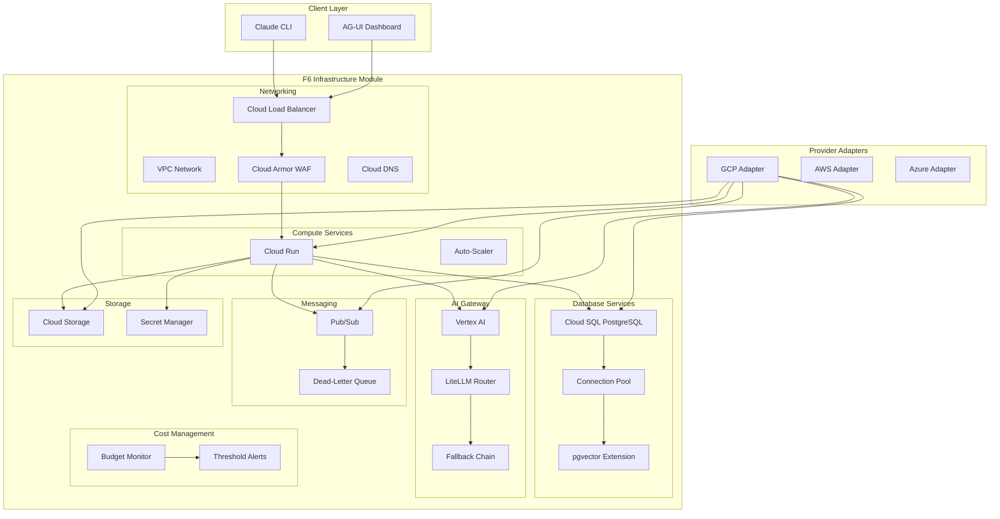
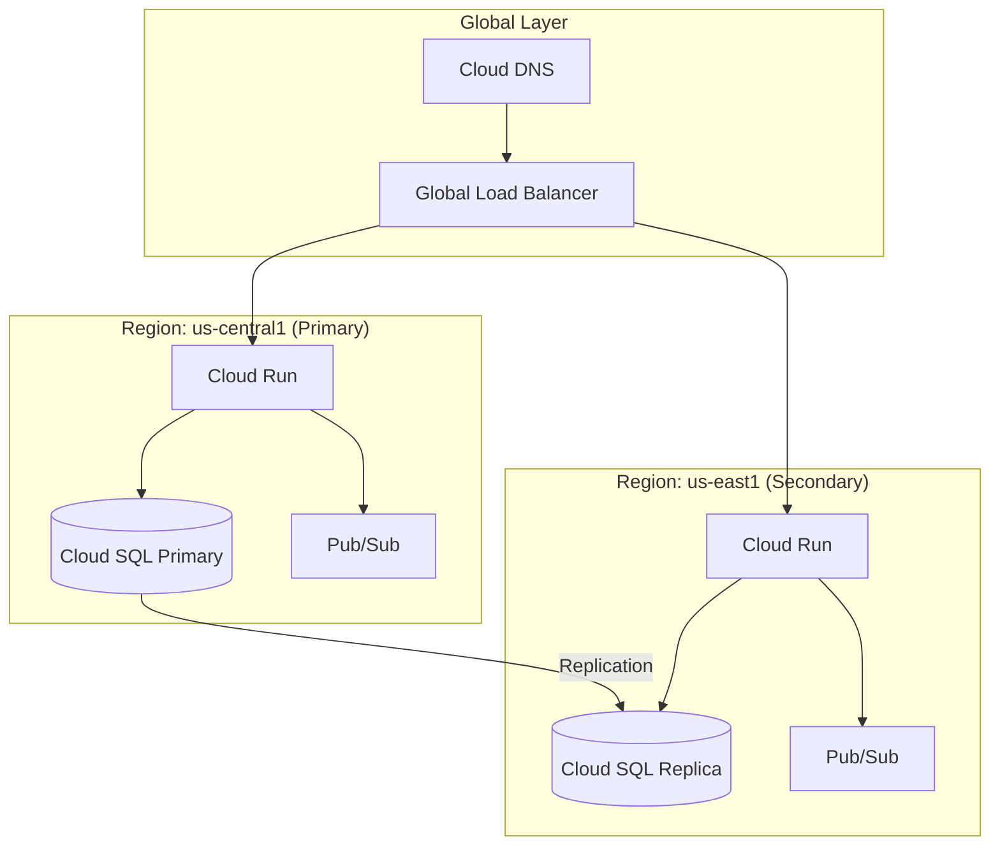

@brd:BRD-06 @prd:PRD-06 @ears:EARS-06 @bdd:BDD-06

# ADR-06: F6 Infrastructure Platform Architecture Decisions

## 1. Document Control

| Item | Details |
|------|---------|
| **Status** | Accepted |
| **Date** | 2026-02-09 |
| **Decision Makers** | Chief Architect, Platform Lead |
| **Author** | Coder Agent (Claude) |
| **Version** | 1.0 |
| **SYS-Ready Score** | 92/100 (Target: >=85 for MVP) |

---

## 2. Context

### 2.1 Problem Statement

**Originating Topic**: BRD.06.10.01-10 - Infrastructure Architecture Decisions (BRD Section 7.2)

The AI Cost Monitoring Platform requires a cloud-agnostic infrastructure foundation that supports compute, database, AI gateway, messaging, storage, networking, and cost management services. The platform must enable multi-cloud portability while optimizing for GCP as the primary provider during MVP phase.

**Business Driver**: Multi-cloud portability, vendor risk mitigation, cost optimization, and zero-downtime deployments for enterprise reliability.

**Key Constraints**:
- $200/month infrastructure budget cap for MVP phase
- GCP as primary cloud provider (ADR-002 decision)
- PostgreSQL required for relational data with pgvector support
- Zero direct cloud SDK calls in application code (cloud-agnostic requirement)

### 2.2 Technical Context

**Current State**:
- New greenfield implementation for AI Cost Monitoring Platform v4.2
- Existing reference ADRs (001-010) establish core patterns: MCP servers, GCP-first, BigQuery, Cloud Run, LiteLLM
- Foundation modules F1-F5, F7 depend on F6 for infrastructure services

**MVP Requirements**:
- Cloud Run compute with auto-scaling (0-10 instances)
- PostgreSQL 16 with HA, pgvector, connection pooling (30 connections)
- Vertex AI gateway with ensemble voting and multi-provider fallback
- Multi-region deployment capability for disaster recovery
- Blue-green deployment for zero-downtime releases
- Service deployment: p95 < 60 seconds
- Database connection: p95 < 100ms
- LLM response: p99 < 5 seconds

---

## 3. Decision

**ID Format**: `ADR.06.10.XX` (Decision)

### 3.1 Chosen Solution (ADR.06.10.01)

**We will use**: GCP-native serverless architecture with provider adapter abstraction

**Because**:
1. Aligns with ADR-002 (GCP-first) strategy for cost optimization and simplified operations
2. Cloud Run provides serverless compute with scale-to-zero, reducing MVP costs to $10-50/month
3. Provider adapter pattern enables future multi-cloud expansion without application code changes

### 3.2 Key Components

| Component | Purpose | Technology |
|-----------|---------|------------|
| Compute Platform | Container orchestration, auto-scaling | Cloud Run (GCP), ECS Fargate (AWS), Container Apps (Azure) |
| Database Services | Relational storage, vector search | Cloud SQL PostgreSQL 16 with pgvector |
| AI Gateway | LLM abstraction, multi-model routing | Vertex AI Model Garden + LiteLLM (ADR-005) |
| Messaging | Event-driven communication | Cloud Pub/Sub with dead-letter queues |
| Storage | Object storage, secrets | Cloud Storage + Secret Manager |
| Networking | Security, load balancing | VPC + Cloud Armor WAF + Cloud Load Balancing |
| IaC | Infrastructure provisioning | Terraform with GCP provider |

### 3.3 Implementation Approach

Provider adapters abstract all cloud-specific APIs behind unified interfaces, enabling seamless provider switching. GCP is implemented first with AWS and Azure adapters following the same interface contracts.

**MVP Scope**: GCP adapter implementation, Cloud Run compute, Cloud SQL database, Vertex AI gateway, Pub/Sub messaging, VPC networking, cost management with budget alerts.

**Post-MVP Scope**: AWS/Azure adapters, hybrid cloud integration, Terraform export, database sharding.

---

## 4. Alternatives Considered

**ID Format**: `ADR.06.12.XX` (Alternative)

### 4.1 Option A: Cloud Run Serverless (Selected) (ADR.06.12.01)

**Description**: Serverless container platform with auto-scaling, pay-per-request pricing, and managed infrastructure.

**Pros**:
- Scale-to-zero reduces idle costs
- Deploy in minutes vs days for Kubernetes
- Google manages OS patches, security, SSL
- $10-50/month vs $160+/month for GKE

**Cons**:
- 60-minute request timeout limit
- Cold start latency (~1 second)
- Less networking customization than GKE

**Est. Cost**: $10-50/month | **Fit**: Best

---

### 4.2 Option B: GKE Kubernetes (ADR.06.12.02)

**Description**: Full Kubernetes cluster with complete container orchestration control.

**Pros**:
- Full control over networking, load balancing
- Advanced deployment strategies (canary, A/B)
- Enterprise-grade service mesh support

**Cons**:
- $160+/month minimum (control plane + nodes)
- Requires DevOps expertise for cluster management
- Over-engineering for MVP with 2-3 microservices
- Weeks of setup vs hours for Cloud Run

**Rejection Reason**: Over-engineering for MVP phase; revisit when traffic exceeds 500 requests/second sustained.

**Est. Cost**: $160-300/month | **Fit**: Poor for MVP

---

### 4.3 Option C: PostgreSQL vs AlloyDB (ADR.06.12.03)

**Description**: AlloyDB is Google's PostgreSQL-compatible database with enhanced performance.

**Pros**:
- 4x faster analytical queries
- Automatic columnar engine
- Native PostgreSQL compatibility

**Cons**:
- Higher cost ($500+/month vs $50-100/month for Cloud SQL)
- Overkill for MVP data volumes
- Limited regional availability

**Rejection Reason**: Cost prohibitive for MVP; Cloud SQL PostgreSQL sufficient for initial scale.

**Est. Cost**: $500+/month | **Fit**: Poor for MVP

---

### 4.4 Option D: Direct Cloud SDK vs Provider Adapter (ADR.06.12.04)

**Description**: Direct GCP SDK calls without abstraction layer.

**Pros**:
- Simpler initial implementation
- No adapter overhead
- Faster time-to-first-deployment

**Cons**:
- Vendor lock-in across entire codebase
- Migration requires full rewrite
- Violates cloud-agnostic requirement (BRD.06.03.01)

**Rejection Reason**: Violates cloud-agnostic business requirement; migration cost exceeds adapter development cost.

**Est. Cost**: $0 development | **Fit**: Poor (technical debt)

---

## 5. Consequences

**ID Format**: `ADR.06.13.XX` (Consequence)

### 5.1 Positive Outcomes (ADR.06.13.01)

- **Cost reduction**: 20x cheaper than GKE ($10-50/month vs $160+/month)
- **Operational simplicity**: Zero cluster management, Google handles infrastructure
- **Cloud portability**: Provider adapter enables multi-cloud without application changes
- **Zero-downtime deployments**: Blue-green pattern with instant rollback
- **Multi-region readiness**: Architecture supports active-active deployment

### 5.2 Trade-offs & Risks (ADR.06.13.02)

| Risk/Trade-off | Impact | Mitigation |
|----------------|--------|------------|
| Cloud Run cold starts (~1s) | Medium | Set minScale=1 for production (+$5/month) |
| 60-minute request timeout | Low | Acceptable for all current use cases |
| Limited networking control | Medium | Sufficient for MVP; migrate to GKE if needed |
| Vendor-specific optimizations | Low | Provider adapter isolates cloud-specific code |
| Single region initial deployment | High | Multi-region deployment in Phase 4 (GAP-F6-01) |

### 5.3 Cost Estimate

| Category | MVP Phase | Monthly Ongoing |
|----------|-----------|-----------------|
| Development | 12 person-weeks | - |
| Cloud Run | One-time setup | $10-50/month |
| Cloud SQL PostgreSQL | One-time setup | $50-100/month |
| Vertex AI (LLM) | - | Usage-based (~$50/month) |
| Cloud Storage + Secrets | - | $5-10/month |
| Cloud Armor WAF | - | $20-30/month |
| **Total** | **12 person-weeks** | **$135-240/month** |

---

## 6. Architecture Flow

### 6.1 High-Level Architecture



### 6.2 Multi-Region Deployment Architecture



### 6.3 Key Integration Points

| System | Integration Type | Purpose |
|--------|-----------------|---------|
| F1 IAM | Internal API | User profiles in PostgreSQL, credentials in Secret Manager |
| F2 Session | Internal API | Workspace storage in PostgreSQL, session cache in Redis |
| F3 Observability | Event/Async | Cloud Logging, Monitoring, Trace infrastructure |
| F4 SecOps | Policy | Cloud Armor WAF rules, VPC firewall policies |
| F5 Self-Ops | Internal API | Cloud Run scaling APIs, health check endpoints |
| F7 Config | Internal API | Configuration storage, Secret Manager for sensitive values |

---

## 7. Implementation Assessment

### 7.1 MVP Development Phases

| Phase | Duration | Deliverables |
|-------|----------|--------------|
| Phase 1: Core Infrastructure | 3 weeks | GCP adapter, Cloud Run, Cloud SQL, cost foundation |
| Phase 2: Services | 3 weeks | Vertex AI gateway, Pub/Sub, Cloud Storage, Secret Manager |
| Phase 3: Networking & Security | 3 weeks | VPC, load balancer, Cloud Armor WAF, SSL certificates |
| Phase 4: Gap Remediation | 3 weeks | Multi-region (GAP-F6-01), Blue-Green (GAP-F6-05), FinOps Dashboard (GAP-F6-03) |

### 7.2 Rollback Plan

**Rollback Trigger**: Service degradation exceeding 5-minute window, deployment failure, critical bug discovery

**Rollback Steps**:
1. Identify failing revision in Cloud Run console
2. Route 100% traffic to previous stable revision
3. Mark failed revision for investigation
4. Notify operations team via Pub/Sub alert

**Estimated Rollback Time**: 30 seconds (blue-green switch)

### 7.3 Monitoring (MVP Baseline)

| Metric | Alert Threshold | Action |
|--------|-----------------|--------|
| Service deployment time | > 60 seconds | Investigate Cloud Build pipeline |
| Database connection latency | > 100ms p95 | Scale connection pool or investigate query |
| LLM response time | > 5 seconds p99 | Check Vertex AI quotas, activate fallback |
| Error rate | > 1% | Trigger on-call escalation |
| Budget utilization | > 90% | Send critical alert, review scaling limits |

---

## 8. Verification

### 8.1 Success Criteria

- [ ] Zero direct cloud SDK calls in application code (code scan verification)
- [ ] Service deployment completes within 60 seconds (p95)
- [ ] Database connection acquired within 100ms (p95)
- [ ] Database failover completes within 60 seconds
- [ ] LLM request processed within 5 seconds (p99)
- [ ] Budget alerts triggered before threshold exceeded (100% accuracy)
- [ ] Blue-green deployment switch within 30 seconds
- [ ] Multi-region failover within 5 minutes

### 8.2 BDD Scenarios

Reference BDD scenarios validating infrastructure architecture decisions:

| Scenario ID | Title | EARS Reference |
|-------------|-------|----------------|
| BDD.06.13.01 | Service deployment completes successfully | EARS.06.25.001 |
| BDD.06.13.02 | Auto-scaling responds to load trigger | EARS.06.25.002 |
| BDD.06.13.04 | Database connection acquired from pool | EARS.06.25.004 |
| BDD.06.13.05 | LLM request processed through primary model | EARS.06.25.006 |
| BDD.06.13.10 | LLM fallback activated when primary unavailable | EARS.06.25.007 |
| BDD.06.13.12 | Blue-green deployment switch to green environment | EARS.06.25.016 |
| BDD.06.13.22 | Budget threshold alerts at configured percentages | EARS.06.25.015 |
| BDD.06.13.25 | Database failover promotes standby replica | EARS.06.25.005 |
| BDD.06.13.27 | Multi-region failover activates secondary region | EARS.06.25.018 |
| BDD.06.13.44 | Provider adapter pattern abstracts cloud SDKs | EARS.06.25.401 |

Feature file: `docs/04_BDD/BDD-06_f6_infrastructure.feature`

---

## 9. Traceability

### 9.1 Upstream References

| Source | Document | Relevant Section |
|--------|----------|------------------|
| BRD | BRD-06 | Section 7.2 - Architecture Decision Requirements |
| PRD | PRD-06 | Section 6 - Scope & Requirements |
| EARS | EARS-06 | Event-Driven Requirements (EARS.06.25.001-408) |

### 9.2 Downstream Artifacts

| Artifact | Status | Relationship |
|----------|--------|--------------|
| SYS-06 | Pending | System requirements derived from ADR-06 decisions |
| REQ-06 | Pending | Atomic requirements for infrastructure components |
| SPEC-06 | Pending | Technical specifications for provider adapters |
| CTR-06 | Pending | Interface contracts for F6 APIs |

### 9.3 Traceability Tags

```markdown
@brd: BRD.06.10.01, BRD.06.10.02, BRD.06.10.03, BRD.06.10.05, BRD.06.10.06, BRD.06.10.08, BRD.06.10.09
@prd: PRD.06.01.01, PRD.06.01.02, PRD.06.01.03, PRD.06.01.06, PRD.06.01.07, PRD.06.01.08, PRD.06.01.12
@ears: EARS.06.25.001, EARS.06.25.004, EARS.06.25.006, EARS.06.25.015, EARS.06.25.016, EARS.06.25.018, EARS.06.25.401
```

### 9.4 Cross-Links (Same-Layer)

@depends: ADR-002 (GCP-first strategy); ADR-004 (Cloud Run not Kubernetes); ADR-005 (LiteLLM for LLMs); ADR-008 (Database strategy)
@discoverability: ADR-001 (MCP servers - deployment target); ADR-003 (BigQuery - cost analytics storage); ADR-006 (Cloud-native task queues)

---

## 10. Related Decisions

| Relationship | ADR | Description |
|--------------|-----|-------------|
| Depends On | ADR-002 | GCP-Only First - Establishes GCP as primary provider |
| Depends On | ADR-004 | Cloud Run Not Kubernetes - Compute platform selection |
| Depends On | ADR-005 | Use LiteLLM for LLMs - AI gateway routing strategy |
| Depends On | ADR-008 | Database Strategy MVP - Firestore MVP, PostgreSQL multi-tenant |
| Related | ADR-001 | Use MCP Servers - Defines what infrastructure deploys |
| Related | ADR-003 | Use BigQuery - Cost analytics data storage |
| Related | ADR-006 | Cloud-Native Task Queues - Async processing pattern |

---

## 11. Migration to Full ADR Template

### 11.1 When to Migrate

- [ ] Decision requires 4+ alternatives analysis (e.g., multi-cloud provider evaluation)
- [ ] Complex trade-off evaluation needed (e.g., cost vs performance optimization)
- [ ] Regulatory/compliance documentation required (e.g., SOC2, HIPAA)
- [ ] Decision impacts multiple systems/teams (e.g., platform-wide change)
- [ ] Detailed implementation assessment required (e.g., migration planning)

### 11.2 Migration Steps

1. **Transfer core content**: Map MVP sections to full template
2. **Add detailed analysis**: Expand alternatives, add scoring matrices
3. **Add missing sections**:
   - Detailed context and background
   - Complete stakeholder impact
   - Full implementation assessment
   - Status change history
4. **Update traceability**: Link to SYS, REQ documents with cumulative tags
5. **Archive MVP version**: Move to archive with "superseded" note
6. **Run validation**: Execute ADR validator on new document

### 11.3 Section Mapping (MVP to Full)

| MVP Section | Full Template Section |
|-------------|-----------------------|
| 1. Document Control | 1. Document Control |
| 2. Context | 4. Context (expand subsections) |
| 3. Decision | 5. Decision (expand with full analysis) |
| 4. Alternatives | 6. Alternatives Considered (expand) |
| 5. Consequences | 7. Consequences (expand) |
| 6. Architecture Flow | 8. Architecture Flow (expand) |
| 7. Implementation Assessment | 9. Implementation Assessment (expand) |
| 8. Verification | 10. Validation & Success Criteria |
| 9. Traceability | 11. Traceability |
| 10. Related Decisions | 12. Related Decisions |
| 11. Migration Guide | N/A (MVP-only section) |

---

**Document Version**: 1.0
**Template Version**: ADR-MVP-TEMPLATE 1.0
**Last Updated**: 2026-02-09

---

> **Architecture Decision Summary**:
> F6 Infrastructure Platform adopts GCP-native serverless architecture (Cloud Run, Cloud SQL, Vertex AI) with provider adapter abstraction for multi-cloud portability. This decision optimizes for MVP cost efficiency ($135-240/month) while maintaining cloud-agnostic design through the adapter pattern. Key capabilities include auto-scaling compute, PostgreSQL with pgvector, AI gateway with fallback, and blue-green deployments for zero-downtime releases.
