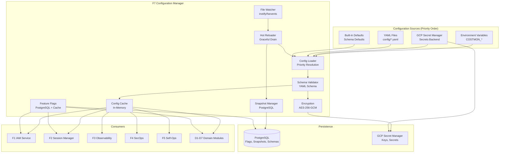
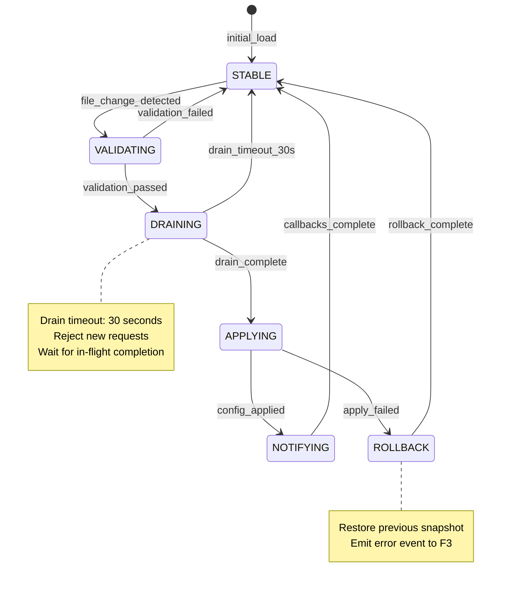
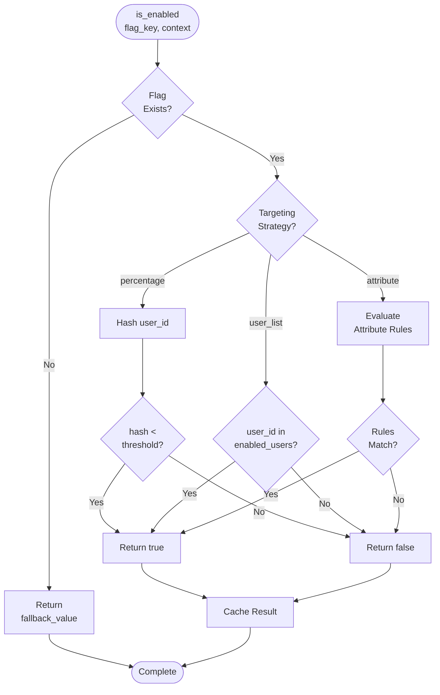

# ADR-07: F7 Configuration Manager Architecture Decisions {#ADR-07}

> **Module Type**: Foundation (Domain-Agnostic)
> **Layer**: 5 (Architecture Decision Records)
> **Upstream**: BRD-07, PRD-07, EARS-07, BDD-07
> **Downstream**: SYS-07, REQ-07, Code Implementation

---

## 1. Document Control

| Item | Details |
|------|---------|
| **Project Name** | AI Cost Monitoring Platform v4.2 - F7 Configuration Manager |
| **Document Version** | 1.0 |
| **Date** | 2026-02-09 |
| **Document Owner** | Architecture Team |
| **Prepared By** | ADR Autopilot (Claude) |
| **Status** | Accepted |
| **SYS-Ready Score** | 90% (Target: >=90%) |

### 1.1 Document Revision History

| Version | Date | Author | Changes Made |
|---------|------|--------|--------------|
| 1.0 | 2026-02-09 | ADR Autopilot | Initial ADR generated from BRD-07, PRD-07, EARS-07, BDD-07 |

---

## 2. Workflow Position

| Position | Value |
|----------|-------|
| **Layer** | 5 (ADR) |
| **Upstream Artifacts** | BRD-07, PRD-07, EARS-07, BDD-07 |
| **Downstream Artifacts** | SYS-07, REQ-07, Implementation |
| **Integration Points** | F1 IAM, F2 Session, F3 Observability, F4 SecOps, F5 Self-Ops, F6 Infrastructure |

---

## 3. Status

**Current Status**: Accepted

**Rationale**: All architectural decisions have been evaluated against BRD-07 Architecture Decision Requirements (Section 7.2) and PRD-07 Architecture Requirements (Section 10). Technology selections align with approved technology stack and GCP-first strategy.

---

## 4. Context

### 4.1 Problem Statement

The AI Cost Monitoring Platform requires centralized configuration management to support:

1. **Multi-source configuration loading** with priority resolution (Environment > Secrets > Files > Defaults)
2. **Schema validation** to prevent invalid configurations from reaching production
3. **Hot-reload** without service restarts for zero-downtime configuration changes
4. **Feature flags** with percentage, user list, and attribute-based targeting
5. **Version control** with snapshot/rollback capabilities
6. **Secret management** with encryption and secure retrieval

**Business Driver** (from BRD Section 7.2):
- Service restarts for configuration changes cause 2-5 minutes downtime per change
- 15% of production incidents attributed to configuration errors
- All-or-nothing feature releases increase deployment risk
- No audit trail for configuration changes across environments

**Business Constraints** (from BRD Section 7.2):
- GCP as primary cloud provider (BRD.07.03.01)
- PostgreSQL for persistent storage (BRD.07.03.02)
- YAML as primary configuration format (BRD.07.03.03)

**Technical Options Evaluated** (from PRD Section 18):
- Configuration server: Consul, etcd, GCP-native
- Feature flags: LaunchDarkly, Split, custom PostgreSQL-based
- Secret management: HashiCorp Vault, GCP Secret Manager, AWS Secrets Manager
- File watching: inotify, fsevents, polling-based

**Evaluation Criteria** (from PRD Section 18):
- Performance: Config lookup <1ms, flag evaluation <5ms, hot-reload <5s
- Reliability: 99.9% uptime, <5 minute RTO
- Security: AES-256-GCM encryption, 90-day key rotation
- Scalability: 10,000 concurrent lookups/sec

### 4.2 Architectural Forces

| Force | Priority | Constraint |
|-------|----------|------------|
| Performance | High | Config lookup <1ms p95 |
| Reliability | High | 99.9% uptime, fail-safe fallback |
| Security | Critical | Encryption at rest, key rotation |
| Operability | High | Zero-downtime configuration changes |
| Simplicity | Medium | Minimize external dependencies |

---

## 5. Decisions

### ADR.07.10.01: Configuration Storage Backend

**Decision**: Use PostgreSQL for feature flags and configuration snapshots, YAML files for static configuration, GCP Secret Manager for secrets.

**Status**: Accepted

**Rationale**:
- PostgreSQL provides ACID guarantees for flag states and snapshot integrity
- YAML files enable GitOps workflows and version control via existing tooling
- GCP Secret Manager provides encryption at rest, access auditing, and managed key rotation
- Aligns with F6 Infrastructure (BRD-06) resource allocation

**Consequences**: See ADR.07.13.01

@brd: BRD.07.10.01
@prd: PRD.07.32.01

---

### ADR.07.10.02: Schema Storage Strategy

**Decision**: Store configuration schemas in PostgreSQL with Git-based version control for schema definitions.

**Status**: Accepted

**Rationale**:
- PostgreSQL tables provide queryable schema versions and compatibility metadata
- Git-based storage enables schema review workflows and change history
- Schema registry pattern supports backward/forward compatibility checking
- Enables migration procedures with validation gates

**Implementation**:
- Schema versions stored as JSON in PostgreSQL with semantic versioning
- Schema definitions maintained in `schemas/` directory under Git
- Compatibility matrix tracked for major version changes

**Consequences**: See ADR.07.13.02

@brd: BRD.07.10.02
@prd: PRD.07.32.02

---

### ADR.07.10.03: Secret Manager Integration

**Decision**: Integrate GCP Secret Manager as primary secret backend with 300-second cache TTL and environment variable fallback.

**Status**: Accepted

**Rationale**:
- GCP Secret Manager provides encryption at rest and access auditing
- 300-second cache TTL balances security with performance (secret retrieval p95 <50ms)
- Environment variable fallback supports local development and testing
- Aligns with GCP-first strategy (ADR-002)

**Implementation**:
- Secret patterns: `*.password`, `*.secret`, `*.api_key`, `*.private_key`, `*.token`
- Cache invalidation on secret version change
- Exponential backoff retry (max 3 attempts) on retrieval failure
- Cached fallback when Secret Manager unavailable

**Consequences**: See ADR.07.13.03

@brd: BRD.07.10.03
@prd: PRD.07.32.03

---

### ADR.07.10.04: Encryption Strategy

**Decision**: Use AES-256-GCM encryption for sensitive configuration values with GCP Secret Manager for key management and 90-day rotation schedule.

**Status**: Accepted

**Rationale**:
- AES-256-GCM provides authenticated encryption (confidentiality + integrity)
- GCP Secret Manager handles key lifecycle management and rotation
- 90-day rotation schedule meets compliance requirements
- Key versioning supports decryption of values encrypted with previous keys

**Implementation**:
- Encrypted patterns auto-detected: `*.password`, `*.secret`, `*.api_key`, `*.private_key`, `*.token`, `*.credentials`, `*.connection_string`
- Key rotation triggers re-encryption of affected values
- Audit logging for all encryption/decryption operations
- Sensitive values redacted as `[REDACTED]` in logs

**Consequences**: See ADR.07.13.04

@brd: BRD.07.10.04
@prd: PRD.07.32.04

---

### ADR.07.10.05: Configuration Access Control

**Decision**: Integrate with F1 IAM for role-based access control with namespace-based isolation for multi-tenant configurations.

**Status**: Accepted

**Rationale**:
- F1 IAM provides existing trust level and permission infrastructure
- Namespace isolation enables tenant-specific configurations without leakage
- Permission inheritance simplifies ACL management
- Audit trail integrated with F3 Observability

**Implementation**:
- Access control model: Service → Namespace → Config Key
- Trust levels: Consumer (read), Producer (read/write), Admin (full)
- Permission inheritance from namespace to keys
- Audit events emitted to F3 Observability on access

**Consequences**: See ADR.07.13.05

@brd: BRD.07.10.05
@prd: PRD.07.32.05

---

### ADR.07.10.06: Configuration Audit Strategy

**Decision**: Integrate with F3 Observability for structured event logging with 30-day retention for configuration change audit.

**Status**: Accepted

**Rationale**:
- F3 Observability provides existing logging infrastructure
- Structured events enable queryable audit trail
- 30-day retention aligns with compliance requirements
- Alerting integration for critical configuration changes

**Implementation**:
- Event types: `config.loaded`, `config.reloaded`, `config.key_changed`, `config.validation_failed`, `config.rollback`, `flag.evaluated`, `secret.retrieved`
- Event schema includes: timestamp, user_id, action, affected_keys, result
- Encrypted audit logs at rest
- Alert thresholds for error rates and anomalies

**Consequences**: See ADR.07.13.06

@brd: BRD.07.10.06
@prd: PRD.07.32.06

---

### ADR.07.10.07: File Watching Implementation

**Decision**: Use OS-native file watching (inotify on Linux, fsevents on macOS) with 5-second polling interval and 2-second debounce.

**Status**: Accepted

**Rationale**:
- OS-native APIs provide low-latency change detection (vs polling)
- 5-second interval balances responsiveness with resource usage
- 2-second debounce prevents rapid reload cycles during bulk edits
- Fallback to polling when native APIs unavailable

**Implementation**:
- inotify on Linux, fsevents on macOS
- Watch interval: 5 seconds (configurable 1-60s)
- Debounce: 2 seconds (configurable 0.5-10s)
- Retry with backoff on watcher failure
- Health check verifies watcher active status

**Consequences**: See ADR.07.13.07

@brd: BRD.07.10.08
@prd: PRD.07.32.08

---

### ADR.07.10.08: Feature Flag Technology

**Decision**: Implement custom PostgreSQL-based feature flag system with adapter interface for external services (LaunchDarkly, Split).

**Status**: Accepted

**Rationale**:
- Custom implementation provides full control over targeting and evaluation
- PostgreSQL backend aligns with existing infrastructure
- Adapter pattern enables future external service integration without core changes
- Evaluation latency target (<5ms) achievable with in-memory caching

**Implementation**:
- Flag storage: PostgreSQL with in-memory cache
- Targeting strategies: percentage, user_list, attribute
- Evaluation: Hash-based consistency for percentage, set membership for user_list, rule evaluation for attribute
- External adapter interface for LaunchDarkly/Split (GAP-F7-01)

**Consequences**: See ADR.07.13.08

@brd: BRD.07.01.04, BRD.07.01.07
@prd: PRD.07.01.04

---

## 6. Requirements Satisfied

| Requirement ID | Description | Decision Reference |
|----------------|-------------|-------------------|
| BRD.07.01.01 | Multi-Source Configuration Loading | ADR.07.10.01 |
| BRD.07.01.02 | Schema Validation | ADR.07.10.02 |
| BRD.07.01.03 | Hot Reload | ADR.07.10.07 |
| BRD.07.01.04 | Feature Flags | ADR.07.10.08 |
| BRD.07.01.06 | Version Control | ADR.07.10.01 |
| BRD.07.02.01 | Security (Encryption) | ADR.07.10.04 |
| BRD.07.10.01 | Configuration Storage Backend | ADR.07.10.01 |
| BRD.07.10.02 | Schema Storage Strategy | ADR.07.10.02 |
| BRD.07.10.03 | Secret Manager Integration | ADR.07.10.03 |
| BRD.07.10.04 | Encryption Strategy | ADR.07.10.04 |
| BRD.07.10.05 | Configuration Access Control | ADR.07.10.05 |
| BRD.07.10.06 | Configuration Audit Strategy | ADR.07.10.06 |
| BRD.07.10.08 | File Watching Implementation | ADR.07.10.07 |

---

## 7. Consequences

### ADR.07.13.01: Configuration Storage Backend Consequences

**Positive**:
- ACID guarantees for flag and snapshot integrity
- GitOps-compatible YAML file workflows
- Managed secret lifecycle via GCP Secret Manager
- Cost-effective (PostgreSQL from F6 allocation)

**Negative**:
- PostgreSQL dependency adds operational overhead
- Multiple storage backends increase complexity
- GCP lock-in for secret management

**Risks**:
- PostgreSQL unavailability affects flag evaluation
- **Mitigation**: In-memory cache fallback (EARS.07.25.209)

---

### ADR.07.13.02: Schema Storage Strategy Consequences

**Positive**:
- Queryable schema versions for compatibility checking
- Git-based review workflow for schema changes
- Supports forward/backward compatibility validation

**Negative**:
- Dual storage (PostgreSQL + Git) requires synchronization
- Schema migration complexity for major version changes

**Risks**:
- Schema desynchronization between storage backends
- **Mitigation**: Pre-commit validation hooks, automated sync checks

---

### ADR.07.13.03: Secret Manager Integration Consequences

**Positive**:
- Encryption at rest with managed key rotation
- Access auditing for compliance
- Environment variable fallback for development

**Negative**:
- Cold retrieval latency (50ms vs cached 5ms)
- GCP Secret Manager availability dependency

**Risks**:
- Secret Manager unavailability
- **Mitigation**: 300s cache TTL, cached value fallback (EARS.07.25.202)

---

### ADR.07.13.04: Encryption Strategy Consequences

**Positive**:
- Industry-standard authenticated encryption
- Managed key rotation reduces operational burden
- Compliance with security requirements

**Negative**:
- Re-encryption overhead during key rotation
- Key versioning complexity

**Risks**:
- Key rotation failure
- **Mitigation**: Preserve current key, schedule retry (EARS.07.25.210)

---

### ADR.07.13.05: Configuration Access Control Consequences

**Positive**:
- Leverages existing F1 IAM infrastructure
- Namespace isolation for multi-tenant support
- Centralized permission management

**Negative**:
- F1 IAM dependency creates coupling
- Permission inheritance complexity

**Risks**:
- F1 IAM unavailability blocks config access
- **Mitigation**: Cached permission decisions, fail-open for read-only access

---

### ADR.07.13.06: Configuration Audit Strategy Consequences

**Positive**:
- Queryable audit trail for compliance
- Integrated alerting via F3 Observability
- Encrypted audit logs

**Negative**:
- 30-day retention limits historical analysis
- Event volume impacts observability costs

**Risks**:
- F3 Observability unavailability
- **Mitigation**: Local buffer with async emission, replay on recovery

---

### ADR.07.13.07: File Watching Implementation Consequences

**Positive**:
- Low-latency change detection
- Resource-efficient vs polling
- Cross-platform support (Linux/macOS)

**Negative**:
- Platform-specific implementation
- Debounce adds latency to change propagation

**Risks**:
- Watcher failure misses file changes
- **Mitigation**: Health check, fallback to polling, retry on failure

---

### ADR.07.13.08: Feature Flag Technology Consequences

**Positive**:
- Full control over targeting logic
- PostgreSQL alignment with infrastructure
- Adapter pattern enables external integration

**Negative**:
- Custom implementation maintenance burden
- Feature parity with commercial solutions requires effort

**Risks**:
- Evaluation logic bugs affect feature rollouts
- **Mitigation**: Comprehensive BDD test coverage, dry-run mode

---

## 8. Architecture Flow

### 8.1 Configuration Management Architecture



### 8.2 Hot Reload State Machine



### 8.3 Feature Flag Evaluation Flow



---

## 9. Implementation Assessment

### 9.1 Complexity Assessment

| Component | Complexity (1-5) | Rationale |
|-----------|------------------|-----------|
| Config Loader | 2 | Standard priority resolution, well-understood patterns |
| Schema Validator | 3 | YAML schema validation, type coercion rules |
| Hot Reloader | 4 | Graceful drain, snapshot, rollback coordination |
| Feature Flags | 3 | Targeting strategies, consistent hashing |
| Secret Integration | 3 | Cache management, fallback handling |
| Encryption | 3 | Key rotation, version management |
| **Overall** | **3** | Moderate complexity, significant integration |

### 9.2 Dependencies

| Dependency | Type | Version | Purpose |
|------------|------|---------|---------|
| PostgreSQL | Database | 15+ | Flags, snapshots, schemas |
| GCP Secret Manager | Service | v1 | Secret storage, key management |
| PyYAML | Library | 6.0+ | YAML parsing |
| cryptography | Library | 41+ | AES-256-GCM encryption |
| pydantic | Library | 2.0+ | Schema validation |
| watchfiles | Library | 0.20+ | File watching (inotify/fsevents) |

### 9.3 Rollback Strategy

| Scenario | Rollback Procedure | RTO |
|----------|-------------------|-----|
| Bad configuration deployed | Automatic rollback to previous snapshot | <30s |
| Hot-reload timeout | Auto-rollback triggered | <30s |
| Feature flag misconfiguration | Flag config rejected, current preserved | Immediate |
| Secret retrieval failure | Cached value fallback | Immediate |
| Schema validation failure | Config change rejected | Immediate |

---

## 10. Impact Analysis

### 10.1 Affected Systems

| System | Impact | Change Required |
|--------|--------|-----------------|
| F1 IAM Service | Medium | Integrate config consumer API, hot-reload callbacks |
| F2 Session Manager | Medium | Integrate config consumer API, hot-reload callbacks |
| F3 Observability | Low | Receive audit events, metrics |
| F4 SecOps | Medium | Consume security policy config via F7 |
| F5 Self-Ops | Low | Consume playbook triggers from config changes |
| F6 Infrastructure | Low | Provide PostgreSQL, Secret Manager resources |
| D1-D7 Domain Modules | Medium | Integrate config consumer API, feature flag API |

### 10.2 Performance Impact

| Metric | Before | After | Change |
|--------|--------|-------|--------|
| Config change latency | 2-5 min (restart) | <5s (hot-reload) | -99% |
| Config lookup latency | Variable | <1ms p95 | Standardized |
| Feature flag evaluation | N/A | <5ms p95 | New capability |
| Secret retrieval (cold) | N/A | <50ms p95 | New capability |

### 10.3 Cost Impact

| Resource | Monthly Cost | Notes |
|----------|-------------|-------|
| PostgreSQL | Included | F6 allocation |
| GCP Secret Manager | ~$10 | ~$0.03/10K operations |
| Vertex AI (P2 AI features) | ~$5 | ~$0.00025/1K characters |
| **Total** | **~$15/month** | |

---

## 11. Verification

### 11.1 BDD Verification Scenarios

| BDD Scenario ID | Decision Verified | Expected Outcome |
|-----------------|-------------------|------------------|
| BDD.07.13.01 | ADR.07.10.01 | Multi-source loading with priority resolution |
| BDD.07.13.03 | ADR.07.10.03 | Secret retrieval from GCP Secret Manager |
| BDD.07.13.05 | ADR.07.10.02 | Schema validation for new configuration |
| BDD.07.13.06 | ADR.07.10.07 | Hot reload with request draining |
| BDD.07.13.23-25 | ADR.07.10.08 | Feature flag evaluation strategies |
| BDD.07.13.33 | ADR.07.10.04 | Sensitive value redaction in logs |
| BDD.07.13.34 | ADR.07.10.04 | Encryption key rotation scheduling |

### 11.2 Success Metrics

| Metric | Target | Measurement |
|--------|--------|-------------|
| Config lookup latency | p95 <1ms | F3 Observability metrics |
| Hot-reload completion | p95 <5s | F3 Observability metrics |
| Feature flag evaluation | p95 <5ms | F3 Observability metrics |
| Secret retrieval (cached) | p95 <5ms | F3 Observability metrics |
| Configuration service uptime | 99.9% | F3 Observability SLI |
| Schema validation coverage | 100% | Test coverage report |

### 11.3 Operational Readiness

| Check | Criteria | Status |
|-------|----------|--------|
| Health endpoint | `/health` returns component status | Required |
| Metrics emission | config_lookups_total, flag_evaluations_total | Required |
| Audit logging | All config changes logged to F3 | Required |
| Alerting | Error rate, reload failure alerts | Required |
| Runbook | Configuration administration procedures | Required |

---

## 12. Alternatives Considered

### ADR.07.12.01: Consul for Configuration Storage

**Description**: Use HashiCorp Consul as configuration storage backend.

**Pros**:
- Built-in service discovery and health checking
- Key-value store with hierarchical structure
- Watch mechanism for change notification

**Cons**:
- Additional operational overhead (Consul cluster)
- Not aligned with GCP-first strategy
- Overkill for configuration-only use case

**Fit Score**: Poor

**Rejection Rationale**: Adds unnecessary infrastructure complexity; PostgreSQL + GCP Secret Manager meets requirements with existing infrastructure.

---

### ADR.07.12.02: etcd for Configuration Storage

**Description**: Use etcd as distributed configuration store.

**Pros**:
- Strong consistency guarantees
- Watch mechanism for real-time updates
- Kubernetes-native integration

**Cons**:
- Requires etcd cluster management
- Memory-intensive for large configurations
- Not aligned with existing infrastructure

**Fit Score**: Poor

**Rejection Rationale**: No Kubernetes requirement; PostgreSQL provides adequate consistency for configuration use case.

---

### ADR.07.12.03: LaunchDarkly as Primary Feature Flag Service

**Description**: Use LaunchDarkly as primary feature flag backend instead of custom implementation.

**Pros**:
- Mature targeting and experimentation features
- Built-in analytics and insights
- Multi-platform SDKs

**Cons**:
- SaaS dependency and vendor lock-in
- Cost scales with monthly active users
- Data residency concerns for some customers

**Fit Score**: Better

**Rejection Rationale**: Cost concerns for MVP phase; adapter pattern allows future integration without rearchitecting. Implemented as GAP-F7-01 for P2 priority.

---

### ADR.07.12.04: HashiCorp Vault for Secret Management

**Description**: Use HashiCorp Vault instead of GCP Secret Manager.

**Pros**:
- Cloud-agnostic secret management
- Dynamic secret generation
- Advanced policy engine

**Cons**:
- Additional operational overhead (Vault cluster)
- Not aligned with GCP-first strategy (ADR-002)
- Higher complexity for key rotation

**Fit Score**: Good

**Rejection Rationale**: GCP Secret Manager provides adequate functionality with lower operational overhead; aligns with GCP-first strategy.

---

### ADR.07.12.05: Polling-Based File Watching

**Description**: Use periodic polling instead of OS-native file watching.

**Pros**:
- Simpler implementation
- Cross-platform consistency
- No inotify/fsevents dependency

**Cons**:
- Higher latency for change detection
- Increased resource usage (continuous polling)
- Less efficient for infrequent changes

**Fit Score**: Poor

**Rejection Rationale**: OS-native APIs provide superior latency and efficiency; used as fallback only when native APIs unavailable.

---

## 13. Security Considerations

### 13.1 Security Controls

| Control | Implementation | Reference |
|---------|---------------|-----------|
| Encryption at Rest | AES-256-GCM for sensitive values | ADR.07.10.04 |
| Key Rotation | 90-day schedule via GCP Secret Manager | ADR.07.10.04 |
| Access Control | F1 IAM integration, namespace isolation | ADR.07.10.05 |
| Audit Logging | Encrypted logs to F3 Observability | ADR.07.10.06 |
| Log Redaction | Sensitive patterns replaced with [REDACTED] | ADR.07.10.04 |
| Secret Caching | 300s TTL, secure memory handling | ADR.07.10.03 |

### 13.2 Threat Mitigations

| Threat | Mitigation |
|--------|------------|
| Secret exposure in logs | Automatic redaction of sensitive patterns |
| Unauthorized config access | F1 IAM role-based access control |
| Key compromise | 90-day rotation, key versioning |
| Configuration tampering | Schema validation, audit trail |
| Secret Manager unavailability | Cached fallback with TTL |

---

## 14. Related Decisions

### 14.1 Supersedes

None (initial ADR for F7)

### 14.2 Related ADRs

| ADR | Relationship | Description |
|-----|--------------|-------------|
| ADR-002 | Influences | GCP-Only First strategy constrains technology choices |
| ADR-008 | Related | Database Strategy MVP defines PostgreSQL patterns |

### 14.3 Downstream Dependencies

| Artifact | Dependency | Notes |
|----------|------------|-------|
| SYS-07 | Implements | System requirements based on these decisions |
| REQ-07 | Derives | Atomic requirements from decisions |
| SPEC-07 | Details | Technical specifications per decision |

---

## 15. Implementation Notes

### 15.1 Phase 1: Core Configuration (2 weeks)

- Implement ConfigLoader with priority resolution
- Implement SchemaValidator with YAML schema support
- Implement type coercion rules
- Deploy in-memory ConfigCache
- Integration with F3 Observability for metrics

### 15.2 Phase 2: Hot Reload & Flags (3 weeks)

- Implement FileWatcher (inotify/fsevents)
- Implement HotReloader with graceful drain
- Implement SnapshotManager with PostgreSQL
- Implement FeatureFlagService with targeting
- Implement callback notification system

### 15.3 Phase 3: Version Control & Security (2 weeks)

- Implement encryption layer (AES-256-GCM)
- Integrate GCP Secret Manager
- Implement rollback capability
- Implement audit logging

### 15.4 Phase 4: Gap Remediation (3 weeks)

- GAP-F7-01: External flag service adapter
- GAP-F7-02: Drift detection service
- GAP-F7-03: Config testing framework
- GAP-F7-06: Schema registry

---

## 16. Traceability

### 16.1 Required Tags (Cumulative Tagging Hierarchy - Layer 5)

@brd: BRD-07
@prd: PRD-07
@ears: EARS-07
@bdd: BDD-07

### 16.2 Upstream Sources

| Source | Document | Section |
|--------|----------|---------|
| BRD | [BRD-07](../01_BRD/BRD-07_f7_config/BRD-07.0_index.md) | Section 7.2 Architecture Decision Requirements |
| PRD | [PRD-07](../02_PRD/PRD-07_f7_config.md) | Section 10 Architecture Requirements |
| EARS | [EARS-07](../03_EARS/EARS-07_f7_config.md) | Sections 2-5 Requirements |
| BDD | [BDD-07](../04_BDD/BDD-07_f7_config.feature) | Feature scenarios |

### 16.3 Threshold References

| Threshold ID | Value | Source |
|--------------|-------|--------|
| @threshold: PRD.07.perf.config_lookup.p95 | 1ms | PRD-07 Section 9.1 |
| @threshold: PRD.07.perf.hot_reload.p95 | 5s | PRD-07 Section 9.1 |
| @threshold: PRD.07.perf.flag_evaluation.p95 | 5ms | PRD-07 Section 9.1 |
| @threshold: PRD.07.sec.secret_cache_ttl | 300s | PRD-07 Section 9.2 |
| @threshold: PRD.07.sec.key_rotation | 90 days | PRD-07 Section 9.2 |
| @threshold: PRD.07.cfg.drain_timeout | 30s | PRD-07 Section 19.2 |

---

## 17. References

### 17.1 Internal References

- [BRD-07: F7 Configuration Manager](../01_BRD/BRD-07_f7_config/BRD-07.0_index.md)
- [PRD-07: F7 Configuration Manager](../02_PRD/PRD-07_f7_config.md)
- [EARS-07: F7 Configuration Manager Requirements](../03_EARS/EARS-07_f7_config.md)
- [BDD-07: F7 Configuration Manager Feature Scenarios](../04_BDD/BDD-07_f7_config.feature)
- [F7 Technical Specification](../00_REF/foundation/F7_Config_Manager_Technical_Specification.md)
- [ADR-002: GCP-Only First](../00_REF/domain/architecture/adr/ADR-002_gcp-only-first.md)
- [ADR-008: Database Strategy MVP](../00_REF/domain/architecture/adr/ADR-008_database_strategy_mvp.md)

### 17.2 External References

- [GCP Secret Manager Documentation](https://cloud.google.com/secret-manager/docs)
- [PostgreSQL JSONB Documentation](https://www.postgresql.org/docs/15/datatype-json.html)
- [inotify(7) - Linux Filesystem Notification](https://man7.org/linux/man-pages/man7/inotify.7.html)
- [AES-GCM NIST Recommendation](https://csrc.nist.gov/publications/detail/sp/800-38d/final)

---

## SYS-Ready Score Breakdown

```
SYS-Ready Score Breakdown
=========================
Decision Completeness (30%):     28/30
  Context Documentation:         10/10
  Decision Clarity:              9/10
  Consequences Analysis:         9/10

Architecture Clarity (35%):      32/35
  Mermaid Diagrams:              15/15
  Component Responsibilities:    10/10
  Cross-Cutting Concerns:        7/10

Implementation Readiness (20%):  17/20
  Complexity Assessment:         5/5
  Dependencies Documented:       5/5
  Rollback Strategies:           4/5
  Phase Planning:                3/5

Verification Approach (15%):     13/15
  BDD Scenario Mapping:          5/5
  Success Metrics:               5/5
  Operational Readiness:         3/5
----------------------------
Total SYS-Ready Score:           90/100 (Target: >= 90%)
Status: READY FOR SYS GENERATION
```

---

*ADR-07: F7 Configuration Manager Architecture Decisions - AI Cost Monitoring Platform v4.2*
*Generated: 2026-02-09 | Layer 5 Artifact | SYS-Ready Score: 90%*
