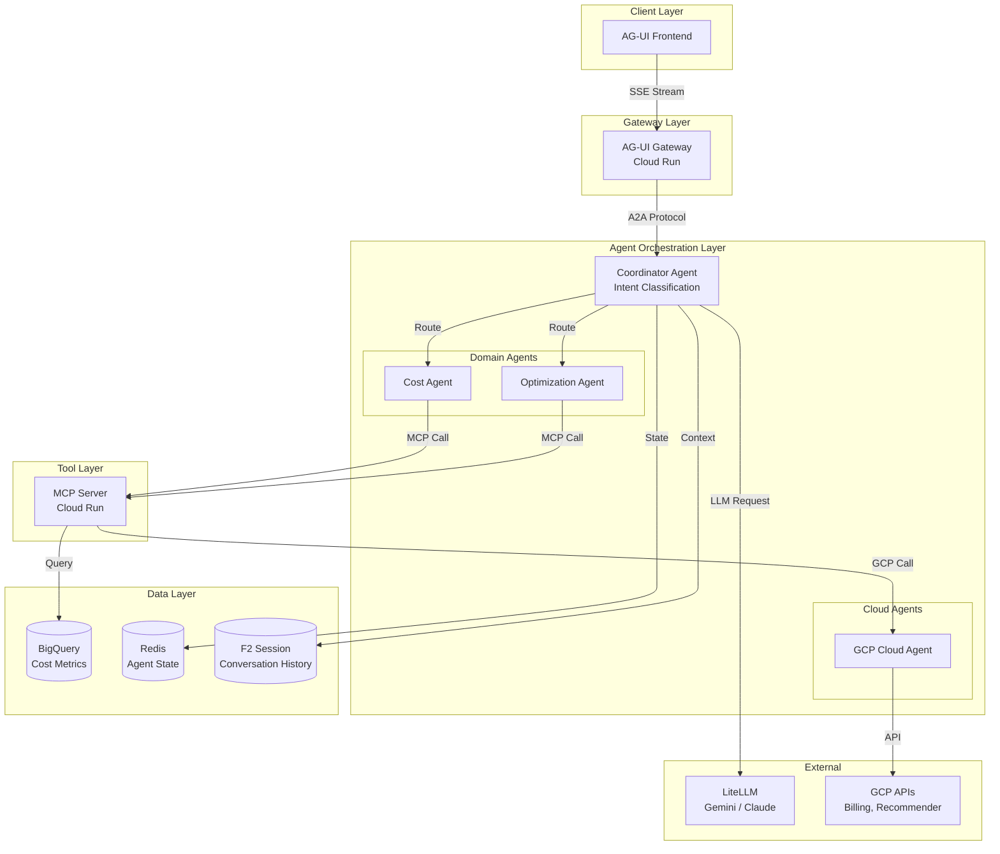

# ADR-08: D1 Agent Orchestration Architecture

@brd:BRD-08 @prd:PRD-08 @ears:EARS-08 @bdd:BDD-08
@depends: ADR-001 (MCP Servers); ADR-004 (Cloud Run); ADR-005 (LiteLLM); ADR-009 (Hybrid Agent Registration)
@discoverability: ADR-010 (AgentCard Specification); ADR-007 (Grafana Plus AG-UI Hybrid)

---

## 1. Document Control

| Item | Details |
|------|---------|
| **Status** | Accepted |
| **Date** | 2026-02-09 |
| **Decision Makers** | Chief Architect, AI/ML Lead, Platform Lead |
| **Author** | Antigravity AI |
| **Version** | 1.0 |
| **SYS-Ready Score** | 92/100 (Target: >=85 for MVP) |

---

## 2. Context

### 2.1 Problem Statement

**Originating Topic**: BRD.08.32.03 - Integration Architecture (AG-UI, A2A Protocol)

The D1 Agent Orchestration module requires a cohesive multi-agent architecture to enable natural language cloud cost queries. The architecture must coordinate a Coordinator Agent for intent classification, multiple Domain Agents (Cost, Optimization), Cloud Agents (GCP for MVP), and MCP Servers for uniform tool execution. The system must support real-time streaming responses via AG-UI protocol while maintaining conversation context and tenant isolation.

**Business Driver**: Enable natural language cost queries with <5s response time (MVP), 90% intent classification accuracy, and seamless multi-agent coordination for the AI Cost Monitoring Platform.

**Key Constraints**:
- GCP-only for MVP (per ADR-002)
- Must integrate with F1 IAM for authentication and F2 Session for context
- LiteLLM abstraction required for model flexibility (per ADR-005)
- Cloud Run deployment for serverless scaling (per ADR-004)
- AG-UI protocol compliance for frontend streaming

### 2.2 Technical Context

**Current State**:
- Foundation modules F1-F7 provide IAM, Session, Observability, and Infrastructure capabilities
- MCP server pattern established (ADR-001)
- Cloud Run deployment pattern established (ADR-004)
- LiteLLM abstraction layer available (ADR-005)

**MVP Requirements**:
- Intent classification latency: p95 < 500ms (target: 200ms)
- Full query response: p95 < 5s (target: 3s)
- Concurrent conversations: 100 (MVP), 1000 (target)
- Context retention: 10 conversation turns
- Parallel agent coordination: max 3 agents

---

## 3. Decision

**ID Format**: `ADR.08.10.XX` (Decision)

### 3.1 Chosen Solution (ADR.08.10.01)

**We will use**: CoPilotKit-compatible AG-UI streaming protocol with Google ADK agent framework, A2A (Agent-to-Agent) protocol for multi-agent coordination, and MCP servers for tool execution, deployed on Cloud Run with LiteLLM for LLM provider abstraction.

**Because**:
1. AG-UI protocol provides real-time streaming optimized for conversational AI interfaces, meeting <500ms first-token latency requirement
2. Google ADK provides native GCP integration and supports the A2A protocol for agent coordination, aligning with existing infrastructure decisions
3. LiteLLM enables model switching between Gemini 2.0 Flash (cost-effective) and Claude 3.5 Sonnet (complex reasoning) without code changes

### 3.2 Key Components

| Component | Purpose | Technology |
|-----------|---------|------------|
| Coordinator Agent | Intent classification, routing, context injection | Google ADK + LiteLLM |
| Domain Agents | Specialized cost/optimization logic | Google ADK + MCP tools |
| Cloud Agent (GCP) | Provider-specific API translation | MCP Server + GCP APIs |
| AG-UI Gateway | SSE streaming to frontend | Cloud Run + FastAPI |
| Agent State Store | Conversation state, agent execution state | Redis (TTL: 30 min) |
| Session Integration | Conversation history persistence | F2 Session (PostgreSQL) |

### 3.3 Implementation Approach

The agent orchestration deploys as a set of Cloud Run services communicating via the A2A protocol. The Coordinator Agent receives queries via AG-UI SSE connection, classifies intent using LiteLLM-routed LLMs, and dispatches to Domain/Cloud Agents. MCP servers provide uniform tool interfaces for all cloud operations.

**MVP Scope**:
- Coordinator Agent with 8 intent categories
- Cost Agent and Optimization Agent
- GCP Cloud Agent
- MCP tools: get_costs, get_recommendations, get_resources, get_idle_resources

**Post-MVP Scope**:
- Remediation Agent (requires approval workflow)
- Reporting Agent (requires export infrastructure)
- AWS/Azure Cloud Agents (multi-cloud Phase 2)
- Cross-Cloud Agent (Phase 3)

---

## 4. Alternatives Considered

**ID Format**: `ADR.08.12.XX` (Alternative)

### 4.1 Option A: Google ADK + AG-UI + MCP (Selected) (ADR.08.12.01)

**Description**: Multi-agent architecture using Google Agent Development Kit with AG-UI streaming protocol, A2A for agent coordination, and MCP servers for tool execution.

**Pros**:
- Native GCP integration reduces operational complexity
- AG-UI provides standardized streaming protocol for AI interfaces
- A2A protocol enables clean agent-to-agent communication
- MCP servers provide uniform tool interface across all operations

**Cons**:
- ADK is newer framework with smaller community
- AG-UI ecosystem is emerging (2024+)
- Requires maintaining MCP server layer

**Est. Cost**: $400-800/month (LLM + Cloud Run) | **Fit**: Best

---

### 4.2 Option B: LangChain + Custom Streaming (ADR.08.12.02)

**Description**: Use LangChain framework with custom WebSocket streaming and direct REST agent communication.

**Pros**:
- Mature framework with large community
- Extensive documentation and examples
- Flexible architecture patterns

**Cons**:
- No native AG-UI support requires custom streaming implementation
- Higher integration effort with GCP services
- WebSocket management complexity for serverless (Cloud Run)

**Rejection Reason**: Custom streaming implementation conflicts with AG-UI protocol adoption; Cloud Run WebSocket limitations add complexity.

**Est. Cost**: $400-800/month | **Fit**: Good

---

### 4.3 Option C: AWS Bedrock Agents (ADR.08.12.03)

**Description**: Use AWS Bedrock Agents for full agent orchestration with native AWS integration.

**Pros**:
- Managed agent infrastructure
- Native AWS service integration
- Built-in model management

**Cons**:
- Conflicts with GCP-first strategy (ADR-002)
- No AG-UI protocol support
- Vendor lock-in to AWS ecosystem

**Rejection Reason**: Violates GCP-first architectural constraint; requires cross-cloud complexity for MVP.

**Est. Cost**: $500-1000/month | **Fit**: Poor

---

## 5. Consequences

**ID Format**: `ADR.08.13.XX` (Consequence)

### 5.1 Positive Outcomes (ADR.08.13.01)

- **Unified Streaming Protocol**: AG-UI provides consistent real-time response streaming; measured by first-token latency <500ms p95
- **Model Flexibility**: LiteLLM abstraction enables dynamic model selection; allows cost optimization by routing simple queries to Gemini (~$200/mo) and complex to Claude (~$300/mo)
- **Native GCP Integration**: Google ADK reduces integration effort; estimated 2 weeks saved vs. custom implementation
- **Scalable Architecture**: Cloud Run auto-scaling supports 100 concurrent conversations (MVP), scales to 1000+ without architectural changes

### 5.2 Trade-offs & Risks (ADR.08.13.02)

| Risk/Trade-off | Impact | Mitigation |
|----------------|--------|------------|
| ADK framework maturity | M | Monitor Google ADK roadmap; maintain abstraction for potential framework swap |
| AG-UI protocol evolution | L | Protocol is backed by Anthropic/industry; implement version negotiation |
| Multi-agent coordination complexity | H | Clear routing rules, 30s timeout policy, partial result handling |
| LLM latency variability | M | Streaming responses, model fallback, request caching for common queries |
| Redis state TTL management | L | 30-minute TTL with activity refresh; graceful session recovery |

### 5.3 Cost Estimate

| Category | MVP Phase | Monthly Ongoing |
|----------|-----------|-----------------|
| Development | 10 person-weeks | - |
| Cloud Run (agents) | $0 setup | $100-200/month |
| LLM API (Gemini primary) | $0 setup | $200-500/month |
| LLM API (Claude fallback) | $0 setup | $100-300/month |
| Redis (agent state) | $0 (Cloud Memorystore) | $50-100/month |
| **Total** | **10 weeks** | **$450-1100/month** |

---

## 6. Architecture Flow

### 6.1 High-Level Flow



### 6.2 Key Integration Points

| System | Integration Type | Purpose |
|--------|-----------------|---------|
| F1 IAM | JWT Validation (REST) | Agent authentication, tenant context |
| F2 Session | gRPC / REST | Conversation history persistence |
| F3 Observability | OpenTelemetry | Distributed tracing, metrics emission |
| AG-UI Frontend | SSE (Server-Sent Events) | Real-time response streaming |
| LiteLLM | REST API | LLM provider abstraction |
| MCP Server | MCP Protocol | Tool execution interface |

---

## 7. Implementation Assessment

### 7.1 MVP Development Phases

| Phase | Duration | Deliverables |
|-------|----------|--------------|
| Phase 1: Coordinator | 3 weeks | Intent classification (8 categories), routing logic, context injection |
| Phase 2: Domain Agents | 4 weeks | Cost Agent, Optimization Agent, MCP tool integration |
| Phase 3: Integration | 3 weeks | AG-UI streaming, F2 Session, error handling |

### 7.2 Rollback Plan

**Rollback Trigger**:
- Intent classification accuracy <80%
- Query response time >10s p95
- Agent availability <95%

**Rollback Steps**:
1. Disable agent routing; return static "service unavailable" response
2. Scale down Cloud Run agent services to zero
3. Preserve Redis state for potential recovery
4. Activate fallback dashboard (Grafana) for cost queries

**Estimated Rollback Time**: 15 minutes

### 7.3 Monitoring (MVP Baseline)

| Metric | Alert Threshold | Action |
|--------|-----------------|--------|
| Intent classification latency | > 1000ms p95 | Scale Coordinator replicas |
| Query response time | > 10s p95 | Investigate LLM/MCP bottleneck |
| Agent error rate | > 5% | Page on-call, activate fallback |
| LLM fallback rate | > 20% | Investigate primary model issues |
| Redis connection failures | > 1% | Scale Redis, check connectivity |

---

## 8. Verification

### 8.1 Success Criteria

- [ ] Intent classification accuracy >=90% on test dataset (1000+ queries)
- [ ] Full query response time <5s p95
- [ ] First token latency <1s p95 via AG-UI streaming
- [ ] Context retention functional for 10 conversation turns
- [ ] Multi-agent coordination (2 agents parallel) success rate >=95%
- [ ] Tenant isolation verified via security audit

### 8.2 BDD Scenarios

Reference BDD scenarios validating this architecture decision:

- Feature: Intent Classification - `BDD-08_d1_agent_orchestration.feature` (BDD.08.13.01, BDD.08.13.19)
- Feature: Query Routing - `BDD-08_d1_agent_orchestration.feature` (BDD.08.13.02)
- Feature: AG-UI Streaming - `BDD-08_d1_agent_orchestration.feature` (BDD.08.13.07)
- Feature: MCP Tool Execution - `BDD-08_d1_agent_orchestration.feature` (BDD.08.13.21)
- Feature: Model Fallback - `BDD-08_d1_agent_orchestration.feature` (BDD.08.13.26)

---

## 9. Traceability

### 9.1 Upstream References

| Source | Document | Relevant Section |
|--------|----------|------------------|
| BRD | @brd: BRD-08 | Section 7.2 - Architecture Decision Requirements |
| PRD | @prd: PRD-08 | Section 10 - Architecture Requirements |
| EARS | @ears: EARS-08 | Event/State/Unwanted Requirements |
| BDD | @bdd: BDD-08 | All agent orchestration scenarios |

### 9.2 Downstream Artifacts

| Artifact | Status | Relationship |
|----------|--------|--------------|
| SYS-08 | Pending | System requirements derived from this ADR |
| REQ-08 | Pending | Atomic requirements for implementation |
| SPEC-08 | Pending | Technical specifications |
| TASKS-08 | Pending | Implementation tasks |

### 9.3 Traceability Tags

```markdown
@brd: BRD.08.32.02, BRD.08.32.03, BRD.08.32.06, BRD.08.32.07
@prd: PRD.08.32.02, PRD.08.32.03, PRD.08.32.06, PRD.08.32.07
@ears: EARS.08.25.001, EARS.08.25.002, EARS.08.25.006, EARS.08.25.007, EARS.08.25.013
```

### 9.4 Cross-Links (Same-Layer)

@depends: ADR-001 (MCP server pattern prerequisite); ADR-004 (Cloud Run deployment prerequisite); ADR-005 (LiteLLM abstraction prerequisite)
@discoverability: ADR-007 (AG-UI hybrid pattern); ADR-009 (agent registration); ADR-010 (AgentCard specification)

---

## 10. Related Decisions

| Relationship | ADR | Description |
|--------------|-----|-------------|
| Depends On | ADR-001 | MCP server pattern for tool execution |
| Depends On | ADR-004 | Cloud Run deployment for agent services |
| Depends On | ADR-005 | LiteLLM for LLM provider abstraction |
| Depends On | ADR-009 | Hybrid agent registration pattern |
| Related | ADR-007 | AG-UI hybrid with Grafana dashboards |
| Related | ADR-010 | AgentCard specification for agent discovery |
| Related | ADR-002 | GCP-first strategy constraining to single cloud |

---

## 11. Migration to Full ADR Template

### 11.1 When to Migrate

- [ ] Decision requires 4+ alternatives analysis
- [ ] Complex trade-off evaluation needed
- [ ] Regulatory/compliance documentation required
- [x] Decision impacts multiple systems/teams (covered in MVP)
- [ ] Detailed implementation assessment required

### 11.2 Migration Steps

1. Transfer core content: Map MVP sections to full template
2. Add detailed analysis: Expand alternatives, add scoring matrices
3. Add missing sections: Detailed stakeholder impact, compliance mapping
4. Update traceability: Link to SYS, REQ documents with cumulative tags
5. Archive MVP version: Move to archive with "superseded" note
6. Run validation: Execute ADR validator on new document

### 11.3 Section Mapping (MVP to Full)

| MVP Section | Full Template Section |
|-------------|-----------------------|
| 1. Document Control | 1. Document Control |
| 2. Context | 4. Context (expand subsections) |
| 3. Decision | 5. Decision (expand with full analysis) |
| 4. Alternatives | 6. Alternatives Considered (expand) |
| 5. Consequences | 7. Consequences (expand) |
| 6. Architecture Flow | 8. Architecture Flow (expand) |
| 7. Implementation Assessment | 9. Implementation Assessment (expand) |
| 8. Verification | 10. Validation & Success Criteria |
| 9. Traceability | 11. Traceability |
| 10. Related Decisions | 12. Related Decisions |

---

**Document Version**: 1.0
**Template Version**: 1.0 (MVP)
**Last Updated**: 2026-02-09

---

*ADR-08: D1 Agent Orchestration Architecture - AI Cost Monitoring Platform v4.2*
*Generated: 2026-02-09 | SYS-Ready Score: 92/100*
