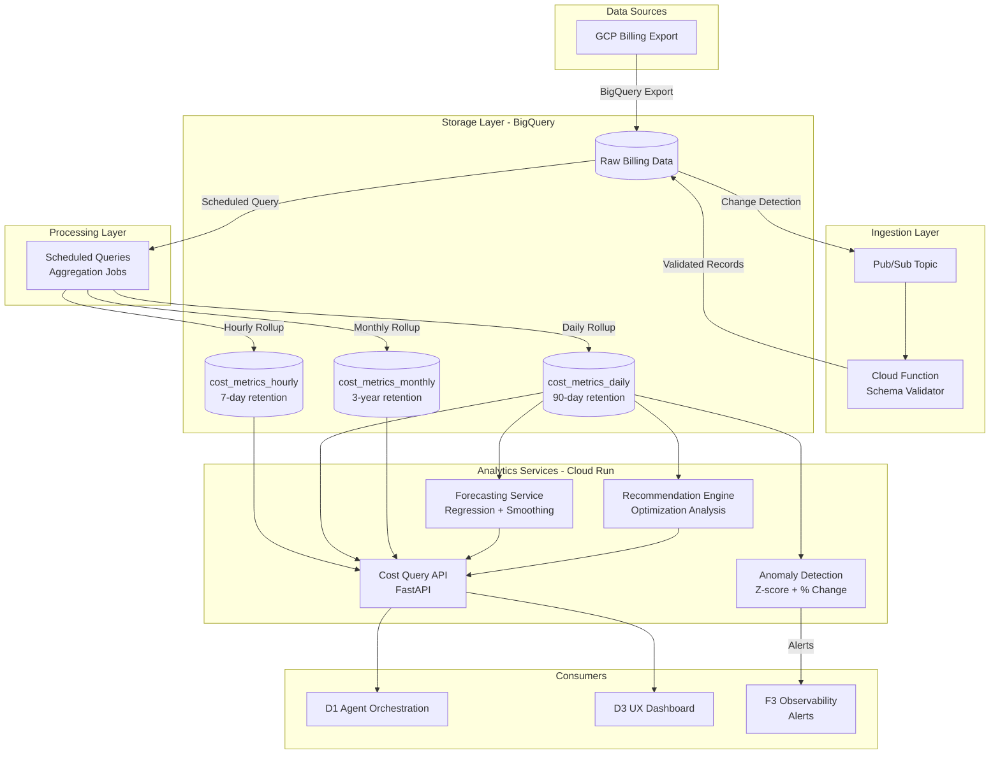

# ADR-09: D2 Cloud Cost Analytics Architecture

> **Module Type**: Domain (Cost Monitoring-Specific)
> **Scope**: Cost ingestion, aggregation, anomaly detection, forecasting, optimization

@brd:BRD-09 @prd:PRD-09 @ears:EARS-09 @bdd:BDD-09

---

## 1. Document Control

| Item | Details |
|------|---------|
| **Status** | Accepted |
| **Date** | 2026-02-09 |
| **Decision Makers** | Chief Architect, Platform Lead |
| **Author** | Antigravity AI |
| **Version** | 1.0 |
| **SYS-Ready Score** | 90/100 (Target: >=85 for MVP) |

---

## 2. Context

### 2.1 Problem Statement

**Originating Topic**: BRD.09.32.02 - Data Architecture, BRD.09.32.03 - Integration, BRD.09.32.06 - AI/ML, BRD.09.32.07 - Technology Selection

The D2 Cloud Cost Analytics module requires a scalable, performant architecture to support:
- Cost data ingestion from GCP billing exports
- Multi-granularity aggregation (hourly/daily/monthly)
- Real-time anomaly detection
- Cost forecasting with configurable horizons
- Optimization recommendation generation

**Business Driver**: FinOps teams require unified cost visibility with <4 hour data freshness to identify 15-30% cost savings opportunities.

**Key Constraints**:
- GCP billing export provides data with ~4 hour lag
- BigQuery query costs must remain under $500/month
- MVP limited to GCP; multi-cloud (AWS/Azure) deferred to Phase 2
- 2-engineer team with 6-week timeline
- Tenant isolation required for multi-tenant SaaS model

### 2.2 Technical Context

**Current State**:
- GCP billing export already configured to BigQuery (per ADR-003)
- F6 Infrastructure module provides BigQuery provisioning
- F1 IAM module provides authentication/authorization
- F3 Observability module provides monitoring infrastructure

**MVP Requirements**:
- Data freshness: <4 hours
- Query performance: p95 <5 seconds for core queries
- Anomaly detection: >80% precision, <10% false positive rate
- Forecast accuracy: 7-day +/-10%, 30-day +/-15%
- Concurrent users: 10 (MVP)

---

## 3. Decision

**ID Format**: `ADR.09.10.XX` (Decision)

### 3.1 Chosen Solution (ADR.09.10.01)

**We will use**: BigQuery-native cost analytics pipeline with three-tier aggregation, statistical anomaly detection, and time-series forecasting.

**Because**:
1. **Native GCP integration**: Billing export data already in BigQuery eliminates ETL complexity
2. **Cost efficiency**: Pay-per-query model optimal for analytical workloads
3. **Scalability**: Serverless architecture handles tenant growth without provisioning
4. **SQL familiarity**: Team expertise in SQL reduces development time

### 3.2 Key Components

| Component | Purpose | Technology |
|-----------|---------|------------|
| Data Ingestion | Detect and process billing export updates | Cloud Functions + Pub/Sub |
| Cost Storage | Multi-granularity metrics storage | BigQuery (partitioned tables) |
| Aggregation Engine | Hourly/daily/monthly rollups | BigQuery Scheduled Queries |
| Anomaly Detection | Statistical deviation detection | Python (NumPy/SciPy) on Cloud Run |
| Forecasting Service | Cost prediction with confidence intervals | Python (statsmodels) on Cloud Run |
| Query API | Cost data access for agents/dashboards | FastAPI on Cloud Run |
| Recommendation Engine | Optimization opportunity identification | Python on Cloud Run |

### 3.3 Implementation Approach

MVP implementation focuses on GCP billing data with automated ingestion, three-tier aggregation, and statistical analysis services deployed on Cloud Run.

**MVP Scope**:
- GCP billing export ingestion
- Hourly/daily/monthly aggregation tables
- Z-score and percentage-change anomaly detection
- Linear regression and exponential smoothing forecasting
- RESTful API for D1 agents and D3 dashboards

**Post-MVP Scope**:
- AWS Cost and Usage Report integration (Phase 2)
- Azure Cost Management integration (Phase 2)
- Vertex AI-based ML models (Phase 2)
- Automated optimization execution (Phase 3)

---

## 4. Alternatives Considered

**ID Format**: `ADR.09.12.XX` (Alternative)

### 4.1 Option A: BigQuery-Native Pipeline (SELECTED) (ADR.09.12.01)

**Description**: Use BigQuery as primary storage with Cloud Functions for ingestion and Cloud Run for analytics services.

**Pros**:
- Zero ETL required - billing data already in BigQuery
- Serverless scaling for all components
- Native GCP tooling and monitoring
- Lowest operational overhead
- Pay-per-use cost model

**Cons**:
- GCP vendor lock-in
- Query costs scale with usage
- Limited real-time streaming capability

**Est. Cost**: $100-500/month | **Fit**: Best

---

### 4.2 Option B: Dataflow Streaming Pipeline (ADR.09.12.02)

**Description**: Use Apache Beam on Dataflow for real-time streaming ingestion with BigQuery storage.

**Pros**:
- True real-time processing
- Unified batch/stream processing model
- Portable to other clouds via Beam

**Cons**:
- Over-engineered for 4-hour data freshness requirement
- Higher cost ($200-800/month minimum)
- Increased operational complexity
- Billing export is batch, not stream

**Rejection Reason**: GCP billing export has inherent 4-hour lag; streaming provides no benefit for batch source data.

**Est. Cost**: $200-800/month | **Fit**: Poor

---

### 4.3 Option C: ClickHouse Time-Series Database (ADR.09.12.03)

**Description**: Deploy ClickHouse for high-performance time-series analytics with custom ETL from BigQuery.

**Pros**:
- Excellent query performance for time-series
- High data compression
- Open-source, portable

**Cons**:
- Requires ETL pipeline from BigQuery
- Infrastructure management overhead
- Duplicates data storage
- Additional operational burden

**Rejection Reason**: Data already in BigQuery; ClickHouse adds complexity without proportional benefit.

**Est. Cost**: $150-400/month | **Fit**: Poor

---

## 5. Consequences

**ID Format**: `ADR.09.13.XX` (Consequence)

### 5.1 Positive Outcomes (ADR.09.13.01)

- **Simplified architecture**: No ETL layer reduces failure points
- **Cost efficiency**: Estimated $100-300/month for MVP workloads
- **Rapid development**: Team familiarity with BigQuery SQL
- **Native integration**: Seamless with GCP billing, monitoring, IAM
- **Elastic scaling**: No capacity planning required

### 5.2 Trade-offs and Risks (ADR.09.13.02)

| Risk/Trade-off | Impact | Mitigation |
|----------------|--------|------------|
| GCP vendor lock-in | Medium | Abstract query layer for future multi-cloud |
| Query cost growth | Low | Materialized views, caching, query optimization |
| BigQuery cold start | Low | Keep scheduled queries running |
| Data freshness limited by export | Low | Set user expectations; cannot improve on source |
| Tenant isolation complexity | Medium | Row-level security, mandatory tenant_id filter |

### 5.3 Cost Estimate

| Category | MVP Phase | Monthly Ongoing |
|----------|-----------|-----------------|
| Development | 6 person-weeks | - |
| BigQuery Storage | - | $50-100 |
| BigQuery Queries | - | $50-400 |
| Cloud Run (API) | - | $50-100 |
| Cloud Functions | - | $10-20 |
| **Total** | **$60,000** | **$160-620/month** |

---

## 6. Architecture Flow

### 6.1 High-Level Architecture



### 6.2 Key Integration Points

| System | Integration Type | Purpose |
|--------|-----------------|---------|
| GCP Billing Export | BigQuery Table | Source cost data |
| F1 IAM Module | REST/JWT | Authentication and tenant authorization |
| F3 Observability | Prometheus/Cloud Monitoring | Pipeline health metrics |
| D1 Agent Orchestration | REST API | Cost query execution for AI agents |
| D3 UX Module | REST API | Dashboard data source |

---

## 7. Implementation Assessment

### 7.1 MVP Development Phases

| Phase | Duration | Deliverables |
|-------|----------|--------------|
| Phase 1 - Data Pipeline | 2 weeks | Ingestion, schema validation, aggregation |
| Phase 2 - Analytics | 1.5 weeks | Query API, anomaly detection |
| Phase 3 - Forecasting | 1 week | 7-day and 30-day prediction |
| Phase 4 - Integration | 1 week | D1/D3 integration, recommendations |
| Phase 5 - Polish | 0.5 weeks | Bug fixes, documentation |

### 7.2 Rollback Plan

**Rollback Trigger**:
- Query latency exceeds 30 seconds consistently
- Data freshness exceeds 8 hours
- BigQuery costs exceed $1000/month

**Rollback Steps**:
1. Disable scheduled aggregation jobs
2. Switch API to read directly from raw billing table
3. Disable forecasting/recommendation services
4. Revert to manual cost analysis workflow

**Estimated Rollback Time**: 2 hours

### 7.3 Monitoring (MVP Baseline)

| Metric | Alert Threshold | Action |
|--------|-----------------|--------|
| Data freshness lag | > 6 hours | Investigate billing export |
| Query latency (p95) | > 10 seconds | Optimize query, add caching |
| Anomaly false positive rate | > 15% | Tune detection thresholds |
| Forecast accuracy | > 20% error | Retrain model, review data quality |
| BigQuery monthly cost | > $400 | Query optimization audit |

---

## 8. Verification

### 8.1 Success Criteria

- [ ] Data ingestion completes within 4 hours of billing export
- [ ] Cost breakdown queries return in <5 seconds (p95)
- [ ] Anomaly detection achieves >80% precision
- [ ] 7-day forecast accuracy within +/-10%
- [ ] 30-day forecast accuracy within +/-15%
- [ ] API integration with D1 agents operational
- [ ] API integration with D3 dashboards operational

### 8.2 BDD Scenarios

Reference BDD scenarios that validate this architecture decision:

- Feature: D2 Cloud Cost Analytics - `04_BDD/BDD-09_d2_cost_analytics.feature`
  - Scenario: BDD.09.13.01 - GCP billing export data ingestion completes within SLA
  - Scenario: BDD.09.13.02 - Cost aggregation by service returns results within SLA
  - Scenario: BDD.09.13.04 - Statistical anomaly detection identifies cost spike
  - Scenario: BDD.09.13.05 - 7-day cost forecast generated within SLA
  - Scenario: BDD.09.13.25 - Cost analytics service handles concurrent users

---

## 9. Traceability

### 9.1 Upstream References

| Source | Document | Relevant Section |
|--------|----------|------------------|
| BRD | @brd:BRD-09 | Section 7.2 - Architecture Decision Requirements |
| PRD | @prd:PRD-09 | Section 10 - Architecture Requirements |
| EARS | @ears:EARS-09 | Sections 2-5 - EARS Requirements |
| BDD | @bdd:BDD-09 | All Sections - Test Scenarios |

### 9.2 Downstream Artifacts

| Artifact | Status | Relationship |
|----------|--------|--------------|
| SYS-09 | Pending | System requirements derived from this ADR |
| REQ-09 | Pending | Atomic requirements for implementation |
| SPEC-09 | Pending | Technical specifications |
| TASKS-09 | Pending | Implementation tasks |

### 9.3 Traceability Tags

```markdown
@brd: BRD.09.32.02, BRD.09.32.03, BRD.09.32.04, BRD.09.32.05, BRD.09.32.06, BRD.09.32.07
@prd: PRD.09.32.01, PRD.09.32.02, PRD.09.32.03, PRD.09.32.04, PRD.09.32.05, PRD.09.32.06, PRD.09.32.07
@ears: EARS.09.25.001, EARS.09.25.003, EARS.09.25.006, EARS.09.25.009, EARS.09.25.011, EARS.09.25.013
@bdd: BDD.09.13.01, BDD.09.13.02, BDD.09.13.04, BDD.09.13.05, BDD.09.13.10, BDD.09.13.25
```

### 9.4 Cross-Links (Same-Layer)

@depends: ADR-003 (BigQuery over TimescaleDB decision)
@depends: ADR-006 (Cloud-native task queues decision)
@discoverability: ADR-08 (D1 Agent architecture - cost data consumer); ADR-10 (D3 UX architecture - dashboard data source)

---

## 10. Related Decisions

| Relationship | ADR | Description |
|--------------|-----|-------------|
| Depends On | ADR-003 | BigQuery as primary analytics database |
| Depends On | ADR-006 | Cloud Scheduler + Cloud Functions for pipelines |
| Related | ADR-08 | D1 Agent architecture (cost data API consumer) |
| Related | ADR-10 | D3 UX architecture (dashboard data source) |
| Informs | ADR-011 | D4 Multi-Cloud data normalization strategy |

---

## 11. Migration to Full ADR Template

### 11.1 When to Migrate

- [ ] Decision requires 4+ alternatives analysis
- [ ] Complex trade-off evaluation needed
- [ ] Regulatory/compliance documentation required
- [ ] Decision impacts multiple systems/teams
- [ ] Detailed implementation assessment required

**Current Assessment**: MVP template sufficient for initial implementation.

### 11.2 Migration Triggers

Migrate to full ADR template when:
- Multi-cloud integration (AWS/Azure) begins
- Advanced ML models require evaluation
- Enterprise compliance requirements emerge
- Architecture review identifies complexity growth

### 11.3 Section Mapping (MVP to Full)

| MVP Section | Full Template Section |
|-------------|-----------------------|
| 1. Document Control | 1. Document Control |
| 2. Context | 4. Context (expand subsections) |
| 3. Decision | 5. Decision (expand with full analysis) |
| 4. Alternatives | 6. Alternatives Considered (expand) |
| 5. Consequences | 7. Consequences (expand) |
| 6. Architecture Flow | 8. Architecture Flow (expand) |
| 7. Implementation Assessment | 9. Implementation Assessment (expand) |
| 8. Verification | 10. Verification and Success Criteria |
| 9. Traceability | 11. Traceability |
| 10. Related Decisions | 12. Related Decisions |

---

**Document Version**: 1.0
**Template Version**: 1.0 (MVP)
**Last Updated**: 2026-02-09

---

*ADR-09: D2 Cloud Cost Analytics Architecture - AI Cost Monitoring Platform v4.2*
*Generated: 2026-02-09 | SYS-Ready Score: 90/100*
