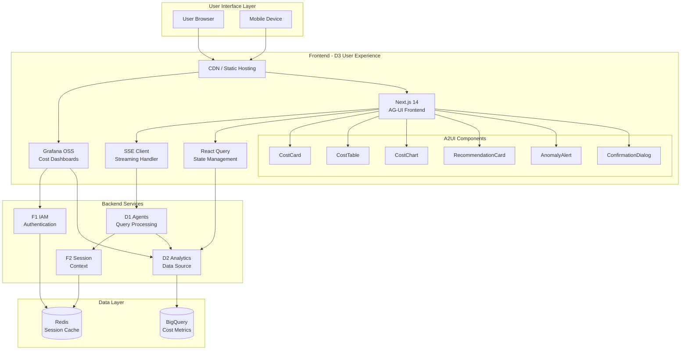

# ADR-10: D3 User Experience Architecture

> **Module Type**: Domain (Cost Monitoring-Specific)
> **Scope**: Grafana dashboards, AG-UI conversational interface, A2UI components, SSE streaming

@brd:BRD-10 @prd:PRD-10 @ears:EARS-10 @bdd:BDD-10
@depends: ADR-007 (Grafana + AG-UI Hybrid); PRD-01 (F1 IAM); PRD-02 (F2 Session); PRD-09 (D2 Analytics)
@discoverability: ADR-10 (D3 UX frontend architecture); PRD-08 (D1 Agents - A2UI component selection)

---

## 1. Document Control

| Item | Details |
|------|---------|
| **Status** | Accepted |
| **Date** | 2026-02-09T00:00:00 |
| **Decision Makers** | Chief Architect, Platform Engineering Lead |
| **Author** | Coder Agent (Claude) |
| **Version** | 1.0 |
| **SYS-Ready Score** | 90/100 (Target: >=85 for MVP) |

---

## 2. Context

### 2.1 Problem Statement

**Originating Topic**: BRD.10.32.03 - Integration; BRD.10.32.07 - Technology Selection

The D3 User Experience module requires a comprehensive frontend architecture to deliver Grafana-based cost monitoring dashboards with AG-UI conversational capabilities. The architecture must support:

- Pre-built dashboards for cost overview, breakdown, anomalies, and recommendations
- Real-time streaming responses for conversational AI interactions (Phase 3)
- A2UI component library for intelligent response rendering
- Responsive design for desktop and mobile devices
- Secure authentication and multi-tenant data isolation

**Business Driver**: Enable FinOps practitioners to achieve 80% reduction in time-to-insight through intuitive dashboards combined with natural language AI queries.

**Key Constraints**:
- Budget: Must use open-source tools where possible (Grafana OSS, CopilotKit)
- Performance: Dashboard load <5 seconds; streaming first token <500ms
- Security: Multi-tenant data isolation; role-based access via F1 IAM
- Phased delivery: Grafana dashboards (Phase 1), AG-UI conversational (Phase 3)

### 2.2 Technical Context

**Current State**:
- ADR-007 established Grafana + AG-UI hybrid approach
- F1 IAM provides authentication and authorization
- F2 Session manages conversation context
- D2 Analytics provides BigQuery data source

**MVP Requirements**:
- 4 pre-built Grafana dashboards
- Filter support (date, service, region, tag)
- Export capability (CSV, PDF)
- Dashboard load time: <5 seconds (MVP target)
- A2UI component render: <100ms per component

---

## 3. Decision

**ID Format**: `ADR.10.10.SS` (Decision)

### 3.1 Chosen Solution (ADR.10.10.01)

**We will use**: Grafana OSS for dashboards with CopilotKit/Next.js 14 for AG-UI conversational interface, shadcn/ui for component library, and SSE for streaming.

**Because**:
1. **ADR-007 alignment**: Hybrid approach provides best of both worlds (speed + flexibility)
2. **Technical maturity**: Grafana is proven for dashboards; CopilotKit enables AG-UI protocol compliance
3. **Cost efficiency**: All components are open-source, reducing licensing costs
4. **Developer productivity**: Modern React stack with TypeScript enables rapid development

### 3.2 Key Components

| Component | Purpose | Technology |
|-----------|---------|------------|
| Dashboard Platform | Cost monitoring visualizations | Grafana OSS 10.x |
| Conversational UI | Natural language queries | CopilotKit + Next.js 14 |
| Component Library | A2UI response rendering | shadcn/ui + Tailwind CSS |
| State Management | Client-side data caching | React Query (TanStack Query) |
| Streaming Protocol | Real-time token delivery | Server-Sent Events (SSE) |
| Static Hosting | Frontend asset delivery | Cloud Run + CDN |

### 3.3 Implementation Approach

**MVP Scope (Phase 1)**:
- Grafana deployment on Cloud Run with BigQuery data source
- 4 pre-built dashboards with filter support
- CSV/PDF export capability
- Mobile responsive layout

**Post-MVP Scope (Phase 3)**:
- CopilotKit AG-UI integration
- 10 A2UI component types for response rendering
- SSE streaming with <500ms first token
- Multi-turn conversation context via F2 Session

---

## 4. Alternatives Considered

**ID Format**: `ADR.10.12.SS` (Alternative)

### 4.1 Option A: Grafana + CopilotKit Hybrid (ADR.10.12.01)

**Description**: Use Grafana OSS for dashboards and CopilotKit for conversational AG-UI, with both systems loosely coupled and querying the same data layer.

**Pros**:
- Best of both worlds: instant dashboards + flexible natural language
- Each system can evolve independently
- Proven technologies with active communities
- Aligns with ADR-007 decision

**Cons**:
- Two systems to maintain
- Potential user confusion about which UI to use
- Need to ensure data consistency across both UIs

**Est. Cost**: $150/month (hosting) | **Fit**: Best

---

### 4.2 Option B: Metabase Alternative (ADR.10.12.02)

**Description**: Replace Grafana with Metabase for simpler dashboard setup.

**Pros**:
- Simpler initial setup
- SQL-native query interface
- Embedded analytics capability

**Cons**:
- Less mature for time-series visualization
- Fewer customization options
- Smaller community than Grafana
- Would require ADR-007 revision

**Rejection Reason**: Grafana has stronger time-series visualization for cost monitoring use case; ADR-007 already accepted Grafana.

**Est. Cost**: $0-500/month | **Fit**: Good

---

### 4.3 Option C: Custom React Dashboard (ADR.10.12.03)

**Description**: Build custom dashboards from scratch using React and D3.js.

**Pros**:
- Full control over UI/UX
- Single technology stack with AG-UI
- No third-party dashboard dependency

**Cons**:
- 3-6 months additional development time
- Reinventing mature dashboard features
- Ongoing maintenance burden
- Not our core value proposition

**Rejection Reason**: Opportunity cost too high; Grafana provides equivalent features out of the box.

**Est. Cost**: $40,000+ (development) | **Fit**: Poor

---

## 5. Consequences

**ID Format**: `ADR.10.13.SS` (Consequence)

### 5.1 Positive Outcomes (ADR.10.13.01)

- **Reduced time-to-insight**: 80% improvement via dashboard + conversational combination
- **User flexibility**: Different personas use different interfaces (dashboards vs. chat)
- **Rapid deployment**: Grafana dashboards deployable within 2 weeks
- **Future-proof**: AG-UI layer enables advanced AI capabilities in Phase 3

### 5.2 Trade-offs and Risks (ADR.10.13.02)

| Risk/Trade-off | Impact | Mitigation |
|----------------|--------|------------|
| Two UIs to maintain | Medium | Shared data layer reduces duplication; Grafana is low-maintenance |
| User confusion | Low | Clear documentation: "Dashboard for monitoring, Chat for investigation" |
| SSE reliability | Medium | Automatic reconnection within 2 seconds; fallback to polling |
| CopilotKit breaking changes | High | Version pinning; abstraction layer between CopilotKit and components |
| Mobile experience | Medium | Responsive design testing; vertical panel stacking |

### 5.3 Cost Estimate

| Category | MVP Phase | Monthly Ongoing |
|----------|-----------|-----------------|
| Development | 4 person-weeks | - |
| Grafana hosting | $0 one-time | $100/month (Cloud Run) |
| CDN (static assets) | $0 one-time | $50/month |
| Third-party services | $0 | $0 (all open source) |
| **Total** | **4 person-weeks** | **$150/month** |

---

## 6. Architecture Flow

### 6.1 High-Level Flow



### 6.2 Key Integration Points

| System | Integration Type | Purpose |
|--------|-----------------|---------|
| F1 IAM | OAuth 2.0 / JWT | Authentication and authorization |
| F2 Session | REST API | Conversation context retrieval |
| D1 Agents | SSE Stream | Natural language query processing |
| D2 Analytics | BigQuery SQL | Dashboard data source |
| CDN | HTTPS | Static asset delivery |

---

## 7. Implementation Assessment

### 7.1 MVP Development Phases

| Phase | Duration | Deliverables |
|-------|----------|--------------|
| Phase 1: Grafana Setup | 1 week | Grafana on Cloud Run, BigQuery connection |
| Phase 2: Dashboard Build | 2 weeks | 4 dashboards with panels and filters |
| Phase 3: Polish | 1 week | Export, mobile responsive, UAT |
| Phase 4: AG-UI (Future) | 4 weeks | CopilotKit integration, A2UI components |

### 7.2 Rollback Plan

**Rollback Trigger**: Dashboard load time exceeds 10 seconds consistently; Grafana service unavailable for >1 hour.

**Rollback Steps**:
1. Revert Grafana deployment to previous version via Cloud Run revision
2. Restore BigQuery data source configuration from backup
3. Verify dashboard functionality with smoke tests
4. Notify users of temporary service restoration

**Estimated Rollback Time**: 15 minutes

### 7.3 Monitoring (MVP Baseline)

| Metric | Alert Threshold | Action |
|--------|-----------------|--------|
| Dashboard load time | > 5 seconds (p95) | Investigate BigQuery query performance |
| Panel render errors | > 1% | Check data source connectivity |
| Grafana availability | < 99.5% | Trigger on-call escalation |
| SSE connection failures (Phase 3) | > 0.1% | Review SSE endpoint health |
| Export failures | > 5% | Check export service logs |

---

## 8. Verification

### 8.1 Success Criteria

- [ ] 4 dashboards available (Cost Overview, Breakdown, Anomalies, Recommendations)
- [ ] Dashboard load time <5 seconds (p95)
- [ ] Filter response time <3 seconds
- [ ] CSV and PDF export functional
- [ ] Mobile responsive layout verified
- [ ] F1 IAM authentication integrated
- [ ] BigQuery data source connected
- [ ] (Phase 3) Streaming first token <500ms
- [ ] (Phase 3) A2UI components render <100ms

### 8.2 BDD Scenarios

Reference BDD-10 scenarios that validate this architecture:

- Feature: Cost Overview Dashboard - `BDD.10.13.01` (Dashboard load success)
- Feature: Dashboard Filtering - `BDD.10.13.05`, `BDD.10.13.06`, `BDD.10.13.07` (Filter application)
- Feature: Export Capability - `BDD.10.13.17`, `BDD.10.13.18` (CSV/PDF export)
- Feature: SSE Streaming - `BDD.10.13.09` (Token streaming)
- Feature: A2UI Components - `BDD.10.13.11` through `BDD.10.13.16` (Component rendering)
- Feature: Error Handling - `BDD.10.13.19` through `BDD.10.13.27` (Graceful failures)

---

## 9. Traceability

### 9.1 Upstream References

| Source | Document | Relevant Section |
|--------|----------|------------------|
| BRD | BRD-10 | Section 7.2 - Architecture Decision Requirements |
| PRD | PRD-10 | Section 10 - Architecture Requirements |
| EARS | EARS-10 | Sections 2-5 - Functional and Quality Requirements |
| BDD | BDD-10 | All scenarios validating UX behavior |
| ADR | ADR-007 | Grafana + AG-UI Hybrid decision |

### 9.2 Downstream Artifacts

| Artifact | Status | Relationship |
|----------|--------|--------------|
| SYS-10 | Pending | System requirements derived from this ADR |
| REQ-10 | Pending | Atomic requirements for implementation |
| SPEC-10 | Pending | Technical specifications |
| TASKS-10 | Pending | Implementation tasks |

### 9.3 Traceability Tags

```markdown
@brd: BRD.10.32.03, BRD.10.32.07
@prd: PRD.10.32.03, PRD.10.32.07
@ears: EARS.10.25.001, EARS.10.25.002, EARS.10.25.003, EARS.10.25.004, EARS.10.25.010
@bdd: BDD.10.13.01, BDD.10.13.08, BDD.10.13.09, BDD.10.13.11
```

### 9.4 Cross-Links (Same-Layer)

@depends: ADR-007 (Grafana + AG-UI hybrid architecture is prerequisite)
@discoverability: ADR-001 (MCP servers for AG-UI backend); ADR-003 (BigQuery as data layer)

---

## 10. Related Decisions

| Relationship | ADR | Description |
|--------------|-----|-------------|
| Depends On | ADR-007 | Grafana + AG-UI hybrid interface decision |
| Depends On | ADR-003 | BigQuery as data layer for dashboards |
| Related | ADR-001 | MCP servers provide AG-UI backend |
| Related | ADR-004 | Cloud Run hosting for Grafana |

---

## 11. Migration to Full ADR Template

### 11.1 When to Migrate

- [ ] Decision requires 4+ alternatives analysis
- [ ] Complex trade-off evaluation needed
- [ ] Regulatory/compliance documentation required
- [ ] Decision impacts multiple systems/teams
- [ ] Detailed implementation assessment required

### 11.2 Migration Steps

1. **Transfer core content**: Map MVP sections to full template
2. **Add detailed analysis**: Expand alternatives, add scoring matrices
3. **Add missing sections**: Detailed context, stakeholder impact, status history
4. **Update traceability**: Link to SYS, REQ documents with cumulative tags
5. **Archive MVP version**: Move to archive with "superseded" note
6. **Run validation**: Execute ADR validator on new document

### 11.3 Section Mapping (MVP to Full)

| MVP Section | Full Template Section |
|-------------|-----------------------|
| 1. Document Control | 1. Document Control |
| 2. Context | 4. Context (expand subsections) |
| 3. Decision | 5. Decision (expand with full analysis) |
| 4. Alternatives | 6. Alternatives Considered (expand) |
| 5. Consequences | 7. Consequences (expand) |
| 6. Architecture Flow | 8. Architecture Flow (expand) |
| 7. Implementation Assessment | 9. Implementation Assessment (expand) |
| 8. Verification | 10. Validation and Success Criteria |
| 9. Traceability | 11. Traceability |
| 10. Related Decisions | 12. Related Decisions |

---

**Document Version**: 1.0
**Template Version**: 1.0 (MVP)
**Last Updated**: 2026-02-09T00:00:00

---

> **Architecture Decision Summary**:
> This ADR documents the D3 User Experience frontend architecture, implementing the Grafana + AG-UI hybrid approach from ADR-007. The architecture provides pre-built Grafana dashboards for cost monitoring with CopilotKit-based conversational AI for Phase 3. Key technologies include Grafana OSS, Next.js 14, shadcn/ui, React Query, and SSE streaming. The SYS-Ready Score of 90/100 indicates readiness for downstream system requirements generation.
