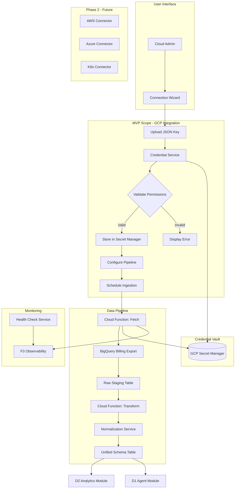

# ADR-11: D4 Multi-Cloud Integration Architecture Decisions

> **Module Type**: Domain (Cost Monitoring-Specific)
> **Scope**: GCP connection, credential security, schema normalization, provider abstraction

@brd:BRD-11 @prd:PRD-11 @ears:EARS-11 @bdd:BDD-11

---

## 1. Document Control

| Item | Details |
|------|---------|
| **Status** | Proposed |
| **Date** | 2026-02-09 |
| **Decision Makers** | Chief Architect, Platform Team Lead |
| **Author** | Antigravity AI |
| **Version** | 1.0 |
| **SYS-Ready Score** | 90/100 (Target: >=85 for MVP) |

---

## 2. Context

### 2.1 Problem Statement

**Originating Topic**: BRD.11.32.02 - Data Architecture, BRD.11.32.03 - Integration, BRD.11.32.04 - Security

Organizations operate workloads across multiple cloud providers (GCP, AWS, Azure, Kubernetes), each with unique billing APIs, data formats, and authentication mechanisms. The D4 Multi-Cloud Integration module requires architectural decisions to enable unified cost visibility while maintaining security and operational efficiency.

**Business Driver**: Unified multi-cloud cost monitoring with secure credential management and normalized data schema for cross-provider analytics.

**Key Constraints**:
- GCP-only for MVP (per ADR-002); AWS, Azure, Kubernetes deferred to Phase 2
- Must support per-tenant credential isolation with zero credential exposure
- Data freshness target: 4 hours maximum lag
- 100% schema compliance required for normalized billing data

### 2.2 Technical Context

**Current State**:
- Platform runs on GCP infrastructure (Cloud Run, BigQuery, Cloud SQL)
- Foundation modules (F1 IAM, F4 SecOps, F6 Infrastructure, F7 Config) provide core capabilities
- No existing multi-cloud connector framework

**MVP Requirements**:
- GCP BigQuery billing export ingestion
- Service Account credential storage in GCP Secret Manager
- Automatic permission verification
- Unified schema transformation with service taxonomy mapping
- Connection health monitoring

---

## 3. Decision

**ID Format**: `ADR.11.10.XX` (Decision)

### 3.1 Chosen Solution (ADR.11.10.01)

**We will use**: Provider abstraction pattern with native cloud APIs, BigQuery-based unified schema, and GCP Secret Manager for credential vault.

**Because**:
1. Native APIs provide full control over data ingestion without third-party dependencies
2. BigQuery enables cost-effective storage with powerful cross-provider analytics
3. Secret Manager provides enterprise-grade encryption with per-tenant isolation
4. Provider abstraction pattern enables Phase 2 expansion without architectural changes

### 3.2 Key Components

| Component | Purpose | Technology |
|-----------|---------|------------|
| Cloud Connectors | Provider-specific API integration | Python SDK per provider |
| Credential Vault | Secure credential storage | GCP Secret Manager |
| ETL Pipeline | Data ingestion and transformation | Cloud Functions + Cloud Scheduler |
| Unified Schema | Normalized billing data | BigQuery with partitioning |
| Health Monitor | Connection status tracking | Cloud Monitoring + custom metrics |

### 3.3 Implementation Approach

MVP implements GCP connector with BigQuery billing export integration, credential storage in Secret Manager with tenant-scoped paths, and schema transformation pipeline using Cloud Functions. The provider abstraction layer (CloudCostProvider interface) enables AWS/Azure connectors in Phase 2 without modifying core architecture.

**MVP Scope**: GCP connection wizard, credential storage, BigQuery ingestion, schema normalization

**Post-MVP Scope**: AWS CUR integration, Azure Cost Management, Kubernetes OpenCost, automatic credential rotation

---

## 4. Alternatives Considered

**ID Format**: `ADR.11.12.XX` (Alternative)

### 4.1 Option A: Native Cloud APIs with Provider Abstraction (ADR.11.12.01)

**Description**: Direct integration with each cloud provider's native billing APIs (GCP BigQuery Export, AWS CUR, Azure Cost Management) using a provider abstraction layer.

**Pros**:
- Full control over data retrieval and transformation
- Zero additional cost beyond cloud API calls
- Direct access to all billing data fields
- Predictable performance characteristics

**Cons**:
- Requires provider-specific connector development
- Must handle API versioning per provider

**Est. Cost**: $110/month (Secret Manager + Cloud Functions + Scheduler) | **Fit**: Best

---

### 4.2 Option B: Third-Party Cost Aggregation Service (ADR.11.12.02)

**Description**: Use a third-party service (CloudHealth, Flexera, Cloudability) for multi-cloud cost data aggregation.

**Pros**:
- Pre-built connectors for all major providers
- Managed service with vendor support
- Advanced analytics features included

**Cons**:
- Monthly subscription cost ($500-5000/month based on spend)
- Data latency dependent on third-party sync
- Limited customization of data schema
- Vendor lock-in risk

**Rejection Reason**: Cost prohibitive for MVP and reduces data ownership/control

**Est. Cost**: $500-5000/month | **Fit**: Poor

---

### 4.3 Option C: Real-Time Streaming Architecture (ADR.11.12.03)

**Description**: Implement real-time cost data streaming using Pub/Sub with streaming analytics.

**Pros**:
- Sub-minute data freshness
- Event-driven architecture

**Cons**:
- Over-engineered for cost monitoring use case
- GCP billing export has 4-hour inherent lag
- Higher infrastructure complexity and cost
- Most providers don't support real-time cost APIs

**Rejection Reason**: Billing data has inherent 4-hour lag; real-time architecture provides no benefit

**Est. Cost**: $300/month | **Fit**: Poor

---

## 5. Consequences

**ID Format**: `ADR.11.13.XX` (Consequence)

### 5.1 Positive Outcomes (ADR.11.13.01)

- **Unified visibility**: Single normalized schema enables cross-cloud analytics
- **Cost efficiency**: $110/month infrastructure vs $500+ for third-party solutions
- **Data ownership**: Full control over billing data transformation and storage
- **Extensibility**: Provider abstraction pattern enables Phase 2 expansion with minimal changes

### 5.2 Trade-offs & Risks (ADR.11.13.02)

| Risk/Trade-off | Impact | Mitigation |
|----------------|--------|------------|
| API rate limits from cloud providers | Medium | Request batching, exponential backoff, caching |
| Credential expiration disrupts ingestion | High | 90-day rotation reminders, health monitoring |
| Provider API schema changes | Medium | Schema versioning, monitoring, automated alerts |
| Service taxonomy drift across providers | Low | Centralized mapping table, fallback to "other" category |

### 5.3 Cost Estimate

| Category | MVP Phase | Monthly Ongoing |
|----------|-----------|-----------------|
| Development | 5 person-weeks | - |
| Secret Manager | - | $50/month |
| Cloud Functions | - | $50/month |
| Cloud Scheduler | - | $10/month |
| **Total** | **~$50,000** | **$110/month** |

---

## 6. Architecture Flow

### 6.1 High-Level Flow



### 6.2 Key Integration Points

| System | Integration Type | Purpose |
|--------|-----------------|---------|
| GCP BigQuery | REST API | Billing export query execution |
| GCP Secret Manager | gRPC | Credential storage and retrieval |
| GCP Cloud Asset Inventory | REST API | Resource metadata sync |
| F1 IAM (PRD-01) | Internal API | Tenant authorization context |
| F3 Observability (PRD-03) | Cloud Logging | Audit trail and metrics |
| F4 SecOps (PRD-04) | Internal API | Credential access audit |

---

## 7. Implementation Assessment

### 7.1 MVP Development Phases

| Phase | Duration | Deliverables |
|-------|----------|--------------|
| Phase 1: Connection | 1.5 weeks | GCP wizard, credential storage, permission verification |
| Phase 2: Ingestion | 1.5 weeks | BigQuery pipeline, Cloud Scheduler jobs |
| Phase 3: Normalization | 1 week | Schema transformation, service mapping |
| Phase 4: Monitoring | 0.5 weeks | Health checks, alerting |

### 7.2 Rollback Plan

**Rollback Trigger**: >10% connection failures, credential exposure incident, data corruption

**Rollback Steps**:
1. Disable new connection wizard in UI
2. Pause Cloud Scheduler jobs for data ingestion
3. Retain existing credentials in Secret Manager
4. Restore previous pipeline version from Cloud Functions revision

**Estimated Rollback Time**: 30 minutes

### 7.3 Monitoring (MVP Baseline)

| Metric | Alert Threshold | Action |
|--------|-----------------|--------|
| Connection success rate | <95% | Page on-call, investigate failures |
| Data freshness lag | >6 hours | Alert operations, check pipeline |
| Credential access anomaly | Any unauthorized | Immediate security review |
| Schema validation failures | >1% | Alert engineering, review records |

---

## 8. Verification

### 8.1 Success Criteria

- [ ] GCP connection wizard completes in <5 minutes
- [ ] Credentials stored encrypted in Secret Manager with tenant isolation
- [ ] Permission verification runs automatically on all connections
- [ ] Data freshness <4 hours from BigQuery export
- [ ] 100% schema compliance on normalized records
- [ ] Connection health check runs every 60 seconds

### 8.2 BDD Scenarios

Reference to BDD scenarios that validate this decision:

- Feature: GCP Account Connection - `04_BDD/BDD-11_d4_multi_cloud.feature`
  - Scenario: BDD.11.13.01 - GCP connection wizard displays Service Account setup instructions
  - Scenario: BDD.11.13.02 - GCP Service Account JSON key is uploaded and stored securely
  - Scenario: BDD.11.13.03 - GCP credentials are verified with required permissions
  - Scenario: BDD.11.13.04 - BigQuery billing export data is ingested successfully
  - Scenario: BDD.11.13.06 - Provider-specific schema is transformed to unified format
  - Scenario: BDD.11.13.17 - Per-tenant secret isolation prevents cross-tenant access
  - Scenario: BDD.11.13.24 - Security controls are enforced for credential handling

---

## 9. Traceability

### 9.1 Upstream References

| Source | Document | Relevant Section |
|--------|----------|------------------|
| BRD | @brd:BRD-11 | Section 7.2 - Architecture Decision Requirements |
| PRD | @prd:PRD-11 | Section 10 - Architecture Requirements |
| EARS | @ears:EARS-11 | Sections 2-5 - Event/State/Unwanted/Ubiquitous Requirements |
| BDD | @bdd:BDD-11 | All scenario categories |

### 9.2 Downstream Artifacts

| Artifact | Status | Relationship |
|----------|--------|--------------|
| SYS-11 | TBD | System requirements derived from this ADR |
| REQ-11 | TBD | Atomic requirements for implementation |
| SPEC-11 | TBD | Technical specifications for connectors |
| TASKS-11 | TBD | Implementation tasks |

### 9.3 Traceability Tags

```markdown
@brd: BRD.11.32.01, BRD.11.32.02, BRD.11.32.03, BRD.11.32.04, BRD.11.32.05, BRD.11.32.07
@prd: PRD.11.32.01, PRD.11.32.02, PRD.11.32.03, PRD.11.32.04, PRD.11.32.07
@ears: EARS.11.25.001-014, EARS.11.25.101-106, EARS.11.25.201-210, EARS.11.25.401-406
```

### 9.4 Cross-Links (Same-Layer)

@depends: ADR-002 (GCP-only first decision); ADR-003 (BigQuery decision); ADR-006 (Cloud-native task queues); ADR-008 (Database strategy)

@discoverability: ADR-001 (MCP Servers - connector pattern relevance); ADR-004 (Cloud Run - runtime for connectors)

---

## 10. Related Decisions

| Relationship | ADR | Description |
|--------------|-----|-------------|
| Depends On | ADR-002 | GCP-only first approach for MVP |
| Depends On | ADR-003 | BigQuery as primary data store |
| Depends On | ADR-006 | Cloud Functions + Cloud Scheduler for pipelines |
| Depends On | ADR-008 | Secret Manager for credential storage |
| Related | ADR-001 | MCP server pattern for cloud agent integration |
| Related | ADR-004 | Cloud Run for connector service deployment |

---

## 11. Migration to Full ADR Template

### 11.1 When to Migrate

- [ ] Decision requires 4+ alternatives analysis (Phase 2 provider selection)
- [ ] Complex trade-off evaluation needed (multi-region deployment)
- [ ] Regulatory/compliance documentation required (SOC2, GDPR)
- [ ] Decision impacts multiple systems/teams (cross-domain data sharing)
- [ ] Detailed implementation assessment required (enterprise scale)

### 11.2 Migration Steps

1. **Assess complexity**: Evaluate if Phase 2 decisions warrant full template
2. **Transfer core content**: Map MVP sections to full template
3. **Add detailed analysis**: Expand alternatives with scoring matrices
4. **Add missing sections**:
   - Detailed stakeholder impact analysis
   - Complete implementation assessment with risk scoring
   - Status change history
5. **Update traceability**: Link to SYS, REQ documents with cumulative tags
6. **Archive MVP version**: Move to archive with "superseded" note
7. **Run validation**: Execute ADR validation against full schema

### 11.3 Section Mapping (MVP - Full)

| MVP Section | Full Template Section |
|-------------|-----------------------|
| 1. Document Control | 1. Document Control |
| 2. Context | 4. Context (expand subsections) |
| 3. Decision | 5. Decision (expand with full analysis) |
| 4. Alternatives | 6. Alternatives Considered (expand with scoring matrix) |
| 5. Consequences | 7. Consequences (expand risk analysis) |
| 6. Architecture Flow | 8. Architecture Flow (add sequence diagrams) |
| 7. Implementation Assessment | 9. Implementation Assessment (expand phases) |
| 8. Verification | 10. Validation & Success Criteria |
| 9. Traceability | 11. Traceability |
| 10. Related Decisions | 12. Related Decisions |

---

**Document Version**: 1.0
**Template Version**: 1.0 (MVP)
**Last Updated**: 2026-02-09

---

*ADR-11: D4 Multi-Cloud Integration - AI Cost Monitoring Platform v4.2*
*Generated: 2026-02-09 | SYS-Ready Score: 90/100*
