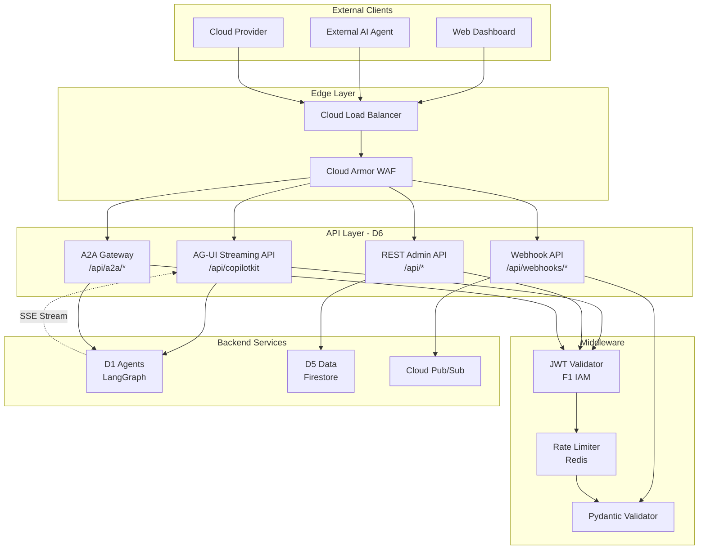

# ADR-13: D6 REST APIs & Integrations Architecture Decisions

> **Module Type**: Domain (Cost Monitoring-Specific)
> **Scope**: AG-UI Streaming, Admin API, Rate Limiting, Webhooks, A2A Gateway

@brd:BRD-13 @prd:PRD-13 @ears:EARS-13 @bdd:BDD-13
@depends: ADR-01 (F1 IAM - JWT authentication); ADR-04 (F4 SecOps - rate limiting, API security)
@discoverability: ADR-08 (D1 Agents - AG-UI streaming backend); ADR-10 (D3 UX - API consumption patterns)

---

## 1. Document Control

| Item | Details |
|------|---------|
| **Status** | Accepted |
| **Date** | 2026-02-09 |
| **Decision Makers** | Chief Architect, Platform Engineering Lead |
| **Author** | Coder Agent (Claude) |
| **Version** | 1.0 |
| **SYS-Ready Score** | 90/100 (Target: >=85 for MVP) |

---

## 2. Context

### 2.1 Problem Statement

**Originating Topic**: BRD.13.32.03 - Integration Architecture, BRD.13.32.04 - API Security, BRD.13.32.07 - Technology Selection

The AI Cloud Cost Monitoring Platform requires a comprehensive API layer to expose four distinct surfaces: (1) AG-UI Streaming API for conversational AI interactions via Server-Sent Events, (2) REST Admin API for dashboard and resource management, (3) Webhook Ingestion API for cloud provider events, and (4) A2A Gateway API for external AI agent integration. Each surface has unique authentication, rate limiting, and response format requirements that must be addressed through unified architectural decisions.

**Business Driver**: Enable multiple client types (interactive users, dashboards, cloud providers, external AI agents) to interact with the platform through well-defined, secure, and performant API interfaces.

**Key Constraints**:
- Must support real-time streaming responses with <1 second first-token latency (MVP)
- Must integrate with F1 IAM for JWT-based authentication
- Must enforce multi-tier rate limiting via F4 SecOps and Redis
- Must maintain 99.5% API uptime for MVP phase
- Must generate OpenAPI 3.0 documentation automatically

### 2.2 Technical Context

**Current State**:
- No standardized API layer exists for the platform
- Agent orchestration (D1) requires streaming interface for AG-UI protocol
- Data persistence (D5) requires CRUD endpoints for resource management
- Cloud providers need webhook endpoints for event ingestion

**MVP Requirements**:
- AG-UI streaming endpoint with SSE support
- REST Admin API for Tenant, Cloud Accounts, Users, Recommendations, Dashboard
- Multi-tier rate limiting (IP, User, Tenant, Agent)
- JWT authentication via F1 IAM integration
- OpenAPI 3.0 documentation with Swagger UI
- Response time p95 <1 second for all endpoints

---

## 3. Decision

**ID Format**: `ADR.13.10.XX` (Decision)

### 3.1 Chosen Solution (ADR.13.10.01)

**We will use**: FastAPI (Python) with Server-Sent Events on Google Cloud Run, integrated with Redis for distributed rate limiting and Cloud Armor for WAF protection.

**Because**:
1. FastAPI provides native async support and automatic OpenAPI 3.0 generation, reducing documentation drift
2. Cloud Run aligns with GCP-first strategy (per ADR-004) and supports SSE connections
3. Redis enables distributed rate limiting with atomic operations across multiple API instances
4. Cloud Armor provides DDoS protection and integrates natively with Cloud Load Balancer

### 3.2 Key Components

| Component | Purpose | Technology |
|-----------|---------|------------|
| API Framework | Request routing, validation, OpenAPI | FastAPI 0.100+ |
| Streaming Protocol | Real-time AI responses | Server-Sent Events (SSE) |
| Rate Limiting | Distributed request throttling | Redis + Cloud Armor |
| Authentication | JWT validation | F1 IAM integration |
| Validation | Request/response schemas | Pydantic v2 |
| Documentation | Interactive API docs | Swagger UI (built-in) |
| WAF Protection | DDoS, injection prevention | Cloud Armor |
| Load Balancer | SSL termination, routing | Cloud Load Balancer |

### 3.3 Implementation Approach

FastAPI application deployed on Cloud Run with auto-scaling (1-10 instances for MVP). Rate limiting implemented via Redis middleware with fallback to in-memory limiting if Redis is unavailable. All endpoints require JWT authentication except health checks. SSE streaming endpoint at `/api/copilotkit` integrates with D1 Agents via internal service mesh.

**MVP Scope**: AG-UI streaming, REST Admin API (Tenant, Cloud Accounts, Users, Recommendations, Dashboard), multi-tier rate limiting, JWT authentication, OpenAPI documentation

**Post-MVP Scope**: Webhook ingestion with signature verification, A2A Gateway with mTLS, adaptive rate limiting, API versioning (v2)

---

## 4. Alternatives Considered

**ID Format**: `ADR.13.12.XX` (Alternative)

### 4.1 Option A: FastAPI + Cloud Run (ADR.13.12.01) - SELECTED

**Description**: Python-based FastAPI framework deployed on Cloud Run with Redis for rate limiting and Cloud Armor for WAF.

**Pros**:
- Native async support for SSE streaming
- Automatic OpenAPI 3.0 specification generation
- Pydantic integration for type-safe validation
- Cloud Run supports SSE connections with configurable timeouts
- Python ecosystem aligns with D1 Agents (LangGraph)

**Cons**:
- Python performance lower than compiled languages for CPU-bound tasks
- Cloud Run cold start latency (mitigated by min instances)

**Est. Cost**: $400/month (MVP) | **Fit**: Best

---

### 4.2 Option B: Express.js + Cloud Run (ADR.13.12.02)

**Description**: Node.js-based Express framework with custom OpenAPI middleware.

**Pros**:
- Single-threaded event loop efficient for I/O-bound APIs
- Large ecosystem of middleware packages
- TypeScript support for type safety

**Cons**:
- Manual OpenAPI documentation maintenance
- Separate validation library required
- Language mismatch with D1 Agents (Python/LangGraph)

**Rejection Reason**: Language fragmentation increases maintenance burden; manual OpenAPI documentation creates drift risk.

**Est. Cost**: $350/month | **Fit**: Good

---

### 4.3 Option C: Cloud Endpoints + Cloud Functions (ADR.13.12.03)

**Description**: GCP-managed API Gateway with serverless Cloud Functions for each endpoint group.

**Pros**:
- GCP-native API management
- Automatic scaling per endpoint
- Built-in API key management

**Cons**:
- SSE streaming not supported by Cloud Functions
- Higher latency due to function cold starts
- Complex deployment for multi-endpoint APIs

**Rejection Reason**: SSE streaming is a critical requirement for AG-UI; Cloud Functions do not support persistent connections.

**Est. Cost**: $200-500/month | **Fit**: Poor (SSE not supported)

---

## 5. Consequences

**ID Format**: `ADR.13.13.XX` (Consequence)

### 5.1 Positive Outcomes (ADR.13.13.01)

- **Unified API Framework**: Single technology stack (FastAPI) for all API surfaces reduces operational complexity
- **Auto-Generated Documentation**: OpenAPI 3.0 specification generated from code annotations ensures 100% endpoint coverage
- **SSE Streaming**: Native async support enables <1 second first-token latency for conversational AI
- **Type-Safe Validation**: Pydantic v2 provides automatic request validation and serialization
- **GCP Integration**: Cloud Run + Cloud Armor + Cloud Load Balancer provides native GCP observability

### 5.2 Trade-offs & Risks (ADR.13.13.02)

| Risk/Trade-off | Impact | Mitigation |
|----------------|--------|------------|
| Python performance for CPU tasks | Medium | Offload compute to D1 Agents; API layer is I/O-bound |
| Cloud Run cold start latency | Low | Set min instances = 1 for MVP; use warmup requests |
| Redis single point of failure | Medium | Fallback to in-memory rate limiting; Redis HA for production |
| SSE connection limits (browser 6 per domain) | Low | Connection pooling; educate users on tab limits |
| Rate limit bypass via IP rotation | Low | Multi-tier limits (User, Tenant) combined with Cloud Armor |

### 5.3 Cost Estimate

| Category | MVP Phase | Monthly Ongoing |
|----------|-----------|-----------------|
| Development | 8 person-weeks | - |
| Cloud Run (API instances) | $50 setup | $200/month |
| Redis (Memorystore) | $0 | $50/month |
| Cloud Armor | $0 | $100/month |
| Cloud Load Balancer | $0 | $50/month |
| **Total** | **$50** | **$400/month** |

---

## 6. Architecture Flow

### 6.1 High-Level Flow



### 6.2 Key Integration Points

| System | Integration Type | Purpose |
|--------|-----------------|---------|
| F1 IAM | REST (Internal) | JWT validation, user context extraction |
| F4 SecOps | Middleware | Rate limiting policies, security logging |
| D1 Agents | gRPC/Internal | AG-UI query execution via LangGraph |
| D5 Data | Internal | CRUD operations via Firestore SDK |
| Cloud Pub/Sub | Async | Webhook event queuing |
| Cloud Logging | SDK | Structured request/response logging |

---

## 7. Implementation Assessment

### 7.1 MVP Development Phases

| Phase | Duration | Deliverables |
|-------|----------|--------------|
| Phase 1 | 2 weeks | FastAPI setup, OpenAPI configuration, health endpoints |
| Phase 2 | 2 weeks | AG-UI streaming endpoint with SSE |
| Phase 3 | 2 weeks | REST Admin API (Tenant, Cloud Accounts, Users) |
| Phase 4 | 2 weeks | Rate limiting with Redis, Cloud Armor integration |

### 7.2 Rollback Plan

**Rollback Trigger**: API error rate >5% for 15 minutes, or streaming failure rate >10%

**Rollback Steps**:
1. Route traffic to previous Cloud Run revision via Load Balancer
2. Disable new revision serving
3. Verify health checks pass on previous revision
4. Investigate root cause using Cloud Logging

**Estimated Rollback Time**: 5 minutes (Cloud Run traffic migration)

### 7.3 Monitoring (MVP Baseline)

| Metric | Alert Threshold | Action |
|--------|-----------------|--------|
| Error rate (5xx) | > 1% for 5 min | Page on-call, investigate logs |
| API latency (p95) | > 1000ms | Alert, check D1/D5 dependencies |
| SSE first-token (p95) | > 1500ms | Alert, check D1 Agents |
| Rate limit rejections | > 100/min | Review for abuse patterns |
| Redis availability | < 99% | Fallback to in-memory, alert ops |

---

## 8. Verification

### 8.1 Success Criteria

- [ ] AG-UI streaming endpoint returns first token within 1 second (p95)
- [ ] REST Admin API provides full CRUD for Tenant, Cloud Accounts, Users, Recommendations, Dashboard
- [ ] Rate limiting enforces IP (100/min), User (300/min), Tenant (1000/min), Agent (10/min) tiers
- [ ] All protected endpoints require valid JWT from F1 IAM
- [ ] OpenAPI 3.0 specification covers 100% of endpoints
- [ ] All error responses follow RFC 7807 Problem Details format
- [ ] API uptime exceeds 99.5% during MVP phase

### 8.2 BDD Scenarios

Reference to BDD scenarios that validate this decision:

- Feature: AG-UI Streaming - `docs/04_BDD/BDD-13_d6_rest_apis.feature` (Scenarios BDD.13.13.01-03)
- Feature: REST Admin API - `docs/04_BDD/BDD-13_d6_rest_apis.feature` (Scenarios BDD.13.13.04-08)
- Feature: Rate Limiting - `docs/04_BDD/BDD-13_d6_rest_apis.feature` (Scenarios BDD.13.13.09-13)
- Feature: Authentication - `docs/04_BDD/BDD-13_d6_rest_apis.feature` (Scenarios BDD.13.13.20-23)
- Feature: Error Handling - `docs/04_BDD/BDD-13_d6_rest_apis.feature` (Scenarios BDD.13.13.24-28)

---

## 9. Traceability

### 9.1 Upstream References

| Source | Document | Relevant Section |
|--------|----------|------------------|
| BRD | BRD-13 | Section 7.2 - Architecture Decision Requirements |
| PRD | PRD-13 | Section 10 - Architecture Requirements |
| EARS | EARS-13 | Sections 2-5 - Functional and Quality Requirements |
| BDD | BDD-13 | All scenarios (33 + 2 outlines) |

### 9.2 Downstream Artifacts

| Artifact | Status | Relationship |
|----------|--------|--------------|
| SYS-13 | Pending | System requirements derived from this ADR |
| REQ-13 | Pending | Atomic requirements for implementation |
| CTR-13 | Pending | OpenAPI contract specification |
| SPEC-13 | Pending | Technical implementation specifications |

### 9.3 Traceability Tags

```markdown
@brd: BRD.13.32.03, BRD.13.32.04, BRD.13.32.07
@prd: PRD.13.01.01-PRD.13.01.20, PRD.13.08.01-PRD.13.08.12
@ears: EARS.13.25.001-EARS.13.25.015, EARS.13.25.101-EARS.13.25.105, EARS.13.25.201-EARS.13.25.210, EARS.13.25.401-EARS.13.25.408
@bdd: BDD.13.13.01-BDD.13.13.33
```

### 9.4 Cross-Links (Same-Layer)

- `@depends: ADR-01` - F1 IAM provides JWT authentication infrastructure
- `@depends: ADR-04` - F4 SecOps provides rate limiting policies and security controls
- `@discoverability: ADR-08 (D1 Agents - AG-UI streaming backend)` - AG-UI streaming connects to D1 agent orchestration
- `@discoverability: ADR-10 (D3 UX - dashboard consumes REST Admin API)` - Dashboard UI consumes REST Admin endpoints
- `@discoverability: ADR-12 (D5 Data - CRUD data persistence)` - REST Admin API persists data via D5

---

## 10. Related Decisions

| Relationship | ADR | Description |
|--------------|-----|-------------|
| Depends On | ADR-001 | MCP Server pattern for agent tools |
| Depends On | ADR-004 | Cloud Run deployment strategy |
| Depends On | ADR-007 | AG-UI + Grafana hybrid visualization |
| Related | ADR-008 | Database strategy for API data persistence |
| Related | ADR-009 | Hybrid agent registration for A2A gateway |

---

## 11. Migration to Full ADR Template

### 11.1 When to Migrate

- [ ] Decision requires 4+ alternatives analysis
- [ ] Complex trade-off evaluation needed
- [ ] Regulatory/compliance documentation required
- [ ] Decision impacts multiple systems/teams
- [ ] Detailed implementation assessment required

**Current Status**: MVP ADR sufficient for current scope. Migration to full template recommended when:
- A2A Gateway mTLS implementation begins (Post-MVP)
- API versioning strategy (v2) is designed
- GraphQL API layer is considered

### 11.2 Migration Steps

1. Transfer core content: Map MVP sections to full template
2. Add detailed analysis: Expand alternatives, add scoring matrices
3. Add missing sections: Stakeholder impact, detailed context, status history
4. Update traceability: Link to SYS, REQ documents with cumulative tags
5. Archive MVP version: Move to archive with "superseded" note
6. Run validation: Execute validator on new document

### 11.3 Section Mapping (MVP to Full)

| MVP Section | Full Template Section |
|-------------|-----------------------|
| 1. Document Control | 1. Document Control |
| 2. Context | 4. Context (expand subsections) |
| 3. Decision | 5. Decision (expand with full analysis) |
| 4. Alternatives | 6. Alternatives Considered (expand with scoring) |
| 5. Consequences | 7. Consequences (expand risk analysis) |
| 6. Architecture Flow | 8. Architecture Flow (add sequence diagrams) |
| 7. Implementation Assessment | 9. Implementation Assessment (expand) |
| 8. Verification | 10. Validation & Success Criteria |
| 9. Traceability | 11. Traceability |
| 10. Related Decisions | 12. Related Decisions |
| 11. Migration | (Remove in full template) |

---

**Document Version**: 1.0
**Template Version**: ADR-MVP-TEMPLATE v1.0
**Last Updated**: 2026-02-09
**SYS-Ready Score**: 90/100

---

*ADR-13: D6 REST APIs & Integrations - AI Cloud Cost Monitoring Platform v4.2*
*Generated: 2026-02-09 | SYS-Ready: 90/100*
