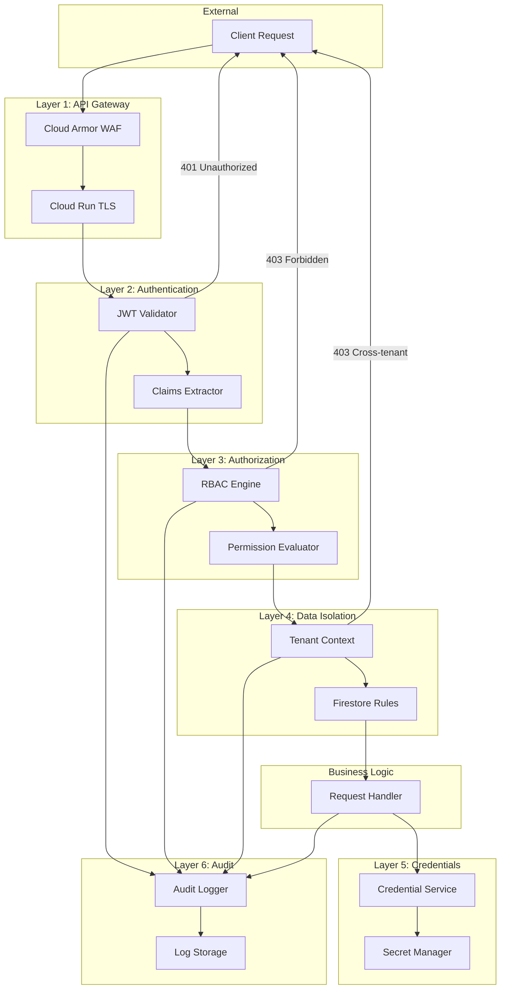

# ADR-14: D7 Security Architecture

> **Module Type**: Domain (Cost Monitoring-Specific)
> **Scope**: Defense-in-depth, RBAC, credential management, audit, multi-tenant security

@brd:BRD-14 @prd:PRD-14 @ears:EARS-14 @bdd:BDD-14

---

## 1. Document Control

| Item | Details |
|------|---------|
| **Status** | Accepted |
| **Date** | 2026-02-09 |
| **Decision Makers** | Chief Security Officer, Platform Architect |
| **Author** | Coder Agent (Claude) |
| **Version** | 1.0 |
| **SYS-Ready Score** | 94/100 (Target: >=85 for MVP) |

---

## 2. Context

### 2.1 Problem Statement

**Originating Topic**: BRD.14.32.04 - Security Architecture Selection

The AI Cloud Cost Monitoring Platform requires a comprehensive security architecture that protects multi-tenant cost data, cloud provider credentials, and ensures compliance with SOC 2 and GDPR requirements. The platform handles highly sensitive information including cross-cloud cost analytics and automated remediation capabilities that could impact production infrastructure.

**Business Driver**: Multi-tenant FinOps platforms must guarantee absolute tenant isolation, protect cloud credentials from exposure, enforce granular access control for remediation actions, and maintain comprehensive audit trails for regulatory compliance. A security breach could result in data leakage between tenants, cloud account compromise, or unauthorized infrastructure modifications.

**Key Constraints**:
- Must integrate with Foundation F1 IAM 4D Matrix for authentication
- Must support both Firestore (MVP) and PostgreSQL (production) data stores
- Must comply with SOC 2 CC6.1/CC6.2 and GDPR Art 32/30 requirements
- Must maintain sub-200ms latency for authentication overhead
- MVP excludes MFA, SSO, and 7-year retention

### 2.2 Technical Context

**Current State**:
- Foundation F1 provides JWT-based authentication with configurable claims
- Foundation F4 provides SecOps infrastructure for audit logging
- Foundation F6 provides Cloud Run + Cloud Armor for network security
- No domain-specific security controls for cost monitoring operations

**MVP Requirements**:
- 6-layer defense-in-depth architecture
- JWT validation with tenant context extraction (p95 < 200ms)
- RBAC enforcement with 5-tier role hierarchy (p95 < 100ms)
- Firestore security rules for tenant isolation
- GCP Secret Manager for credential storage
- 100% mutation audit logging with 90-day retention
- Risk-based remediation action approval

---

## 3. Decision

**ID Format**: `ADR.14.10.XX` (Decision)

### 3.1 Chosen Solution (ADR.14.10.01)

**We will use**: 6-layer defense-in-depth architecture with custom Python middleware, GCP Secret Manager, and Firestore security rules for MVP tenant isolation.

**Because**:
1. Defense-in-depth provides redundant security controls where failure of one layer does not compromise the system
2. GCP-native services (Secret Manager, Firestore rules, Cloud Armor) reduce operational complexity and leverage platform security certifications
3. Custom middleware enables precise control over JWT validation and RBAC enforcement with domain-specific permission semantics

### 3.2 Key Components

| Component | Purpose | Technology |
|-----------|---------|------------|
| API Gateway Security | DDoS protection, WAF, TLS termination | Cloud Run + Cloud Armor |
| Authentication Middleware | JWT validation, claim extraction | Python/FastAPI |
| Authorization Engine | RBAC enforcement, permission evaluation | Custom OPA-inspired |
| Tenant Isolation | Data separation enforcement | Firestore rules (MVP) / PostgreSQL RLS |
| Credential Manager | Secure credential storage and retrieval | GCP Secret Manager |
| Audit Logger | Security event capture and persistence | Structured logging |

### 3.3 Implementation Approach

The security architecture implements request flow through 6 mandatory layers: (1) Cloud Armor performs WAF and rate limiting, (2) Auth Middleware validates JWT and extracts tenant context, (3) Authorization Engine evaluates RBAC permissions, (4) Data Layer enforces tenant isolation via Firestore rules, (5) Credential Service retrieves secrets from Secret Manager, (6) Audit Logger captures all security events.

**MVP Scope**: 6 security layers, 5-tier RBAC, Firestore rules, Secret Manager integration, 90-day audit retention, remediation approval workflows

**Post-MVP Scope**: MFA for admins, PostgreSQL RLS, credential rotation automation, 7-year compliance retention, SSO integration, behavioral anomaly detection

---

## 4. Alternatives Considered

**ID Format**: `ADR.14.12.XX` (Alternative)

### 4.1 Option A: Custom Middleware + GCP-Native Services (ADR.14.12.01)

**Description**: Build custom Python middleware for authentication and authorization, use GCP Secret Manager for credentials, Firestore security rules for MVP isolation, and structured logging for audit.

**Pros**:
- Full control over security logic and domain-specific permission semantics
- GCP-native services provide managed security infrastructure
- Minimal external dependencies and vendor lock-in concerns
- Clear migration path from Firestore rules to PostgreSQL RLS

**Cons**:
- Development effort for custom middleware
- Requires security expertise for implementation review

**Est. Cost**: $210/month infrastructure | **Fit**: Best

---

### 4.2 Option B: Cloud IAP + Managed Authorization (ADR.14.12.02)

**Description**: Use Google Cloud Identity-Aware Proxy (IAP) for authentication and authorization, managed entirely through GCP IAM policies.

**Pros**:
- Zero custom code for authentication
- GCP-managed security policies
- Built-in audit logging

**Cons**:
- Limited flexibility for domain-specific RBAC (cost operations, remediation risk levels)
- Cannot implement granular permission claims like `recommendations:execute:low`
- Coarse-grained authorization does not support 5-tier role hierarchy

**Rejection Reason**: Insufficient granularity for domain-specific permission model; cannot express remediation risk levels or cost operation permissions.

**Est. Cost**: $50-100/month | **Fit**: Poor

---

### 4.3 Option C: External Authorization Service (OPA/Styra) (ADR.14.12.03)

**Description**: Deploy Open Policy Agent (OPA) or Styra as external policy decision point, with Rego policies for all authorization decisions.

**Pros**:
- Industry-standard policy language
- Centralized policy management
- Policy-as-code with version control

**Cons**:
- Additional infrastructure to deploy and maintain
- Network latency for policy decisions (10-20ms per request)
- Learning curve for Rego policy language
- Overkill for MVP scope

**Rejection Reason**: Added complexity and latency not justified for MVP; OPA patterns can be adopted incrementally post-MVP if policy complexity increases.

**Est. Cost**: $100-200/month + deployment | **Fit**: Good (Post-MVP)

---

## 5. Consequences

**ID Format**: `ADR.14.13.XX` (Consequence)

### 5.1 Positive Outcomes (ADR.14.13.01)

- **Zero cross-tenant access**: Firestore rules enforce tenant isolation at the database layer, eliminating application-level bypass risks
- **Credential protection**: Secret Manager provides AES-256 encryption at rest with Workload Identity authentication, preventing credential exposure
- **Granular RBAC**: 5-tier role hierarchy supports domain-specific permissions (viewer, analyst, operator, org_admin, super_admin)
- **Compliance foundation**: 100% mutation audit coverage with structured events supports SOC 2 and GDPR requirements
- **Remediation safety**: Risk-based action classification with approval workflows prevents unauthorized infrastructure changes

### 5.2 Trade-offs & Risks (ADR.14.13.02)

| Risk/Trade-off | Impact | Mitigation |
|----------------|--------|------------|
| JWT tokens cannot be revoked | M | Short expiry (1 hour), token refresh flow |
| Firestore rules have 50KB limit | L | Simplify rule structure, migrate to RLS post-MVP |
| Secret Manager API rate limits | L | Request-scoped retrieval (no caching), batch optimization |
| No MFA in MVP | M | Implement in Phase 2, document risk acceptance |
| 90-day retention insufficient for some regulations | M | Implement 7-year archive in Phase 3 |
| Custom middleware requires security review | L | Engage security team for code review |

### 5.3 Cost Estimate

| Category | MVP Phase | Monthly Ongoing |
|----------|-----------|-----------------|
| Development | 12 person-weeks | - |
| Secret Manager | $10 one-time | $10/month |
| Cloud Armor | $100 setup | $100/month |
| Audit Log Storage | $50 setup | $50/month |
| Security Monitoring | $50 setup | $50/month |
| **Total** | **$210** | **$210/month** |

---

## 6. Architecture Flow

### 6.1 High-Level Flow



### 6.2 Key Integration Points

| System | Integration Type | Purpose |
|--------|-----------------|---------|
| F1 IAM | Internal/JWT | Token issuance, 4D Matrix claims |
| F4 SecOps | Internal/Async | Audit event routing, alert emission |
| D5 Data | Internal/Context | Tenant context propagation for queries |
| D6 APIs | Internal/Middleware | Auth middleware chain integration |
| D4 Multi-Cloud | Internal/Credential | Cloud provider credential retrieval |
| GCP Secret Manager | gRPC/External | Credential storage and retrieval |
| GCP Cloud Armor | HTTP/External | WAF rules, rate limiting |

---

## 7. Implementation Assessment

### 7.1 MVP Development Phases

| Phase | Duration | Deliverables |
|-------|----------|--------------|
| Phase 1 | 2 weeks | JWT validation middleware, claim extraction |
| Phase 2 | 2 weeks | RBAC engine, 5-tier role hierarchy, permission matrix |
| Phase 3 | 2 weeks | Firestore security rules, tenant context propagation |
| Phase 4 | 2 weeks | Secret Manager integration, credential service |
| Phase 5 | 2 weeks | Audit logging infrastructure, structured events |
| Phase 6 | 2 weeks | Remediation approval workflows, risk classification |

### 7.2 Rollback Plan

**Rollback Trigger**: Critical security vulnerability discovered, >10% authentication failures, cross-tenant access detected

**Rollback Steps**:
1. Disable new security middleware via feature flag
2. Revert to previous authentication configuration
3. Re-enable legacy authorization checks
4. Verify tenant isolation via security tests
5. Restore previous Firestore rules version

**Estimated Rollback Time**: 30 minutes

### 7.3 Monitoring (MVP Baseline)

| Metric | Alert Threshold | Action |
|--------|-----------------|--------|
| Authentication failure rate | > 5% | Investigate token issues |
| Authorization denial rate | > 10% | Review permission configuration |
| Cross-tenant access attempts | > 0 | Immediate security review |
| JWT validation latency (p95) | > 200ms | Scale resources, optimize |
| Credential retrieval failures | > 1% | Check Secret Manager health |
| Audit log write failures | > 0.1% | Check log storage capacity |

---

## 8. Verification

### 8.1 Success Criteria

- [ ] All 6 security layers implemented and verified active
- [ ] JWT validation completes within 200ms (p95)
- [ ] RBAC permission checks complete within 100ms (p95)
- [ ] Zero cross-tenant data access possible (verified by security tests)
- [ ] 100% of data mutations logged with required fields
- [ ] High-risk remediation actions require org_admin + confirmation
- [ ] All credentials encrypted at rest in Secret Manager
- [ ] Expired tokens rejected with 401 response

### 8.2 BDD Scenarios

Reference to BDD scenarios that validate this decision:

- Feature: JWT Token Validation - `docs/04_BDD/BDD-14_d7_security.feature` (BDD.14.13.01-03)
- Feature: RBAC Authorization - `docs/04_BDD/BDD-14_d7_security.feature` (BDD.14.13.04-07)
- Feature: Multi-Tenant Isolation - `docs/04_BDD/BDD-14_d7_security.feature` (BDD.14.13.08-11)
- Feature: Credential Management - `docs/04_BDD/BDD-14_d7_security.feature` (BDD.14.13.12-15)
- Feature: Remediation Action Security - `docs/04_BDD/BDD-14_d7_security.feature` (BDD.14.13.16-19)
- Feature: Audit Logging - `docs/04_BDD/BDD-14_d7_security.feature` (BDD.14.13.20-21)

---

## 9. Traceability

### 9.1 Upstream References

| Source | Document | Relevant Section |
|--------|----------|------------------|
| BRD | BRD-14 | Section 7.2 - Architecture Decision Requirements (BRD.14.32.04) |
| PRD | PRD-14 | Section 10 - Architecture Requirements, Section 18 - Future Roadmap |
| EARS | EARS-14 | EARS.14.25.001-017 (Event-Driven), EARS.14.25.101-110 (State-Driven) |
| BDD | BDD-14 | BDD.14.13.01-32 (Security Scenarios) |

### 9.2 Downstream Artifacts

| Artifact | Status | Relationship |
|----------|--------|--------------|
| SYS-14 | Pending | System requirements derived from security decisions |
| REQ-14 | Pending | Atomic security requirements |
| SPEC-14 | Pending | Security implementation specifications |
| TSPEC-14 | Pending | Security test specifications |

### 9.3 Traceability Tags

```markdown
@brd: BRD-14, BRD.14.32.04
@prd: PRD-14, PRD.14.01.01-29, PRD.14.32.04, PRD.14.32.07
@ears: EARS-14, EARS.14.25.001-017, EARS.14.25.101-110, EARS.14.25.201-213, EARS.14.25.401-410
@bdd: BDD-14, BDD.14.13.01-32
```

### 9.4 Cross-Links (Same-Layer)

@depends: ADR-01 (F1 IAM - authentication infrastructure); ADR-04 (F4 SecOps - audit framework)
@discoverability: ADR-12 (D5 Data - RLS patterns); ADR-13 (D6 APIs - middleware integration); ADR-11 (D4 Multi-Cloud - credential usage)

---

## 10. Related Decisions

| Relationship | ADR | Description |
|--------------|-----|-------------|
| Depends On | ADR-008 | Database Strategy MVP - Firestore vs PostgreSQL |
| Depends On | ADR-009 | Hybrid Agent Registration Pattern - A2A security |
| Related | ADR-004 | Cloud Run Not Kubernetes - deployment security |
| Related | ADR-005 | Use LiteLLM for LLMs - AI component security |

---

## 11. Migration to Full ADR Template

### 11.1 When to Migrate

- [ ] Decision requires 4+ alternatives analysis (e.g., adding HSM options)
- [ ] Complex trade-off evaluation needed (e.g., compliance certifications)
- [ ] Regulatory/compliance documentation required (e.g., FedRAMP, HIPAA)
- [ ] Decision impacts multiple systems/teams (e.g., enterprise SSO)
- [ ] Detailed implementation assessment required (e.g., penetration test findings)

### 11.2 Migration Steps

1. **Transfer core content**: Map MVP sections to full template
2. **Add detailed analysis**: Expand alternatives with compliance matrices
3. **Add missing sections**:
   - Detailed context and background (threat model)
   - Complete stakeholder impact (compliance officers, auditors)
   - Full implementation assessment (penetration test results)
   - Status change history (incident responses)
4. **Update traceability**: Link to SYS, REQ documents with cumulative tags
5. **Archive MVP version**: Move to archive with "superseded" note
6. **Run validation**: Execute `python3 05_ADR/scripts/validate_adr.py` on new document

### 11.3 Section Mapping (MVP to Full)

| MVP Section | Full Template Section |
|-------------|-----------------------|
| 1. Document Control | 1. Document Control |
| 2. Context | 4. Context (expand with threat model) |
| 3. Decision | 5. Decision (add compliance matrices) |
| 4. Alternatives | 6. Alternatives Considered (add HSM, external SIEM) |
| 5. Consequences | 7. Consequences (add compliance impact) |
| 6. Architecture Flow | 8. Architecture Flow (add security data flows) |
| 7. Implementation Assessment | 9. Implementation Assessment (add pen test results) |
| 8. Verification | 10. Validation & Success Criteria |
| 9. Traceability | 11. Traceability |
| 10. Related Decisions | 12. Related Decisions |

---

**Document Version**: 1.0
**Template Version**: 1.0 (MVP)
**Last Updated**: 2026-02-09

---

*ADR-14: D7 Security Architecture - AI Cloud Cost Monitoring Platform v4.2*
*Generated: 2026-02-09 | SYS-Ready Score: 94/100*
