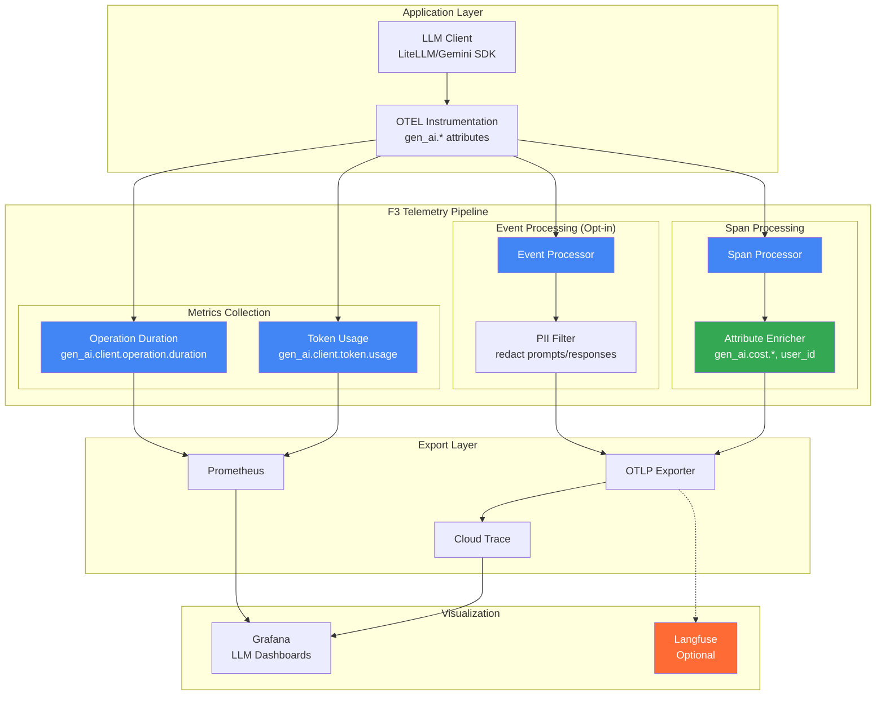
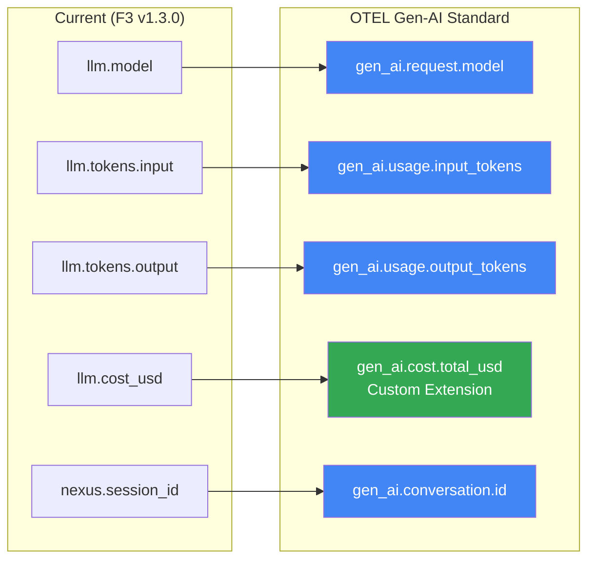

# ADR-15: OTEL Gen-AI Semantic Conventions Adoption

@brd:BRD-03 @prd:PRD-03 @ears:EARS-03 @bdd:BDD-03

> **Module Type**: Foundation (Cross-Cutting Enhancement to F3)
> **Upstream**: ADR-03 (F3 Observability), BDD-03
> **Downstream**: SYS-03, REQ-03-OTEL-GENAI, SPEC-03-GENAI

---

## 1. Document Control

| Item | Details |
|------|---------|
| **Status** | Accepted |
| **Version** | 1.0 |
| **Date Created** | 2026-02-10T00:00:00 |
| **Last Updated** | 2026-02-10T00:00:00 |
| **Author** | Coder Agent (Claude) |
| **Reviewer** | Chief Architect |
| **Source BRD** | @brd: BRD-03.3 Section 7.2 |
| **Source ADR** | @adr: ADR-03 (F3 Observability) |
| **SYS-Ready Score** | ✅ 92/100 (Target: ≥90) |

### 1.1 Document Revision History

| Version | Date | Author | Changes Made |
|---------|------|--------|--------------|
| 1.0 | 2026-02-10T00:00:00 | Coder Agent | Initial ADR for OTEL Gen-AI Semantic Conventions |

---

## 2. Context

### 2.1 Problem Statement

**Originating Topic**: BRD.03.32.07 - LLM Observability Standards

The AI Cloud Cost Monitoring Platform uses custom LLM telemetry attributes (`llm.model`, `llm.tokens.input`, `llm.cost_usd`) that do not align with industry standards. This creates:

1. **Tool Incompatibility**: Third-party observability tools (Datadog, Honeycomb, Langfuse) expect standard Gen-AI attributes
2. **Vendor Lock-in**: Custom attributes limit migration options
3. **Documentation Gaps**: No standardized approach for LLM prompt/response capture
4. **Interoperability**: Cannot share traces with other OTEL-instrumented systems

**Business Driver**: Enable vendor-neutral LLM observability with best-in-class tooling support while maintaining cost tracking capabilities critical to the platform's value proposition.

**Key Constraints**:
- Must preserve existing cost tracking functionality (platform differentiator)
- Must support PII filtering for prompt/response capture (GDPR/CCPA)
- Must maintain backward compatibility during migration
- Must align with OpenTelemetry Semantic Conventions v1.37+

### 2.2 Technical Context

**Current State** (F3 v1.3.0):
- Custom `llm.*` namespace attributes
- LLM metrics tracked but non-standard naming
- No structured event capture for prompts/responses
- OpenTelemetry tracing adopted (W3C Trace Context) per ADR.03.10.04

**OTEL Gen-AI Standard** (v1.37+):
- Standardized `gen_ai.*` namespace (spans, metrics, events)
- Provider-specific conventions (OpenAI, Anthropic, Vertex AI)
- Structured event schemas for prompt/response capture
- Industry adoption by major vendors (Datadog, Honeycomb, Traceloop)

**MVP Requirements**:
- Adopt `gen_ai.*` namespace for all LLM telemetry
- Preserve cost tracking as custom extensions (`gen_ai.cost.*`)
- Enable opt-in prompt/response capture with PII filtering

---

## 3. Decision

**ID Format**: `ADR.15.10.SS` (Decision)

### 3.1 Chosen Solution (ADR.15.10.01)

**We will adopt**: OpenTelemetry Gen-AI Semantic Conventions v1.37+ as the standard for all LLM/GenAI observability, with custom cost tracking extensions.

**Because**:
1. **Industry Standard**: OTEL Gen-AI is the emerging standard adopted by major observability vendors
2. **Tool Compatibility**: Enables use of Langfuse, Traceloop, Datadog LLM Observability
3. **Future-Proof**: W3C-backed specification with active development
4. **Cost Preservation**: Custom `gen_ai.cost.*` namespace maintains platform differentiator

### 3.2 Key Components

| Component | Current (F3 v1.3.0) | Standard (OTEL Gen-AI) | Notes |
|-----------|---------------------|------------------------|-------|
| Operation Type | N/A | `gen_ai.operation.name` | Required: chat, embeddings, etc. |
| Provider | N/A | `gen_ai.provider.name` | Required: openai, anthropic, gcp.vertex_ai |
| Model | `llm.model` | `gen_ai.request.model` | Migration required |
| Input Tokens | `llm.tokens.input` | `gen_ai.usage.input_tokens` | Migration required |
| Output Tokens | `llm.tokens.output` | `gen_ai.usage.output_tokens` | Migration required |
| Cost | `llm.cost_usd` | `gen_ai.cost.total_usd` | Custom extension (preserved) |
| Session | `nexus.session_id` | `gen_ai.conversation.id` | Map to standard |

### 3.3 Implementation Approach

**MVP Scope**:
- Implement all required OTEL Gen-AI span attributes
- Add standard metrics: `gen_ai.client.token.usage`, `gen_ai.client.operation.duration`
- Add custom cost extension attributes: `gen_ai.cost.input_usd`, `gen_ai.cost.output_usd`, `gen_ai.cost.total_usd`
- Implement opt-in events with PII filtering for prompts/responses

**Post-MVP Scope**:
- Add server-side metrics (`gen_ai.server.time_to_first_token`)
- Implement agent-specific conventions when OTEL finalizes spec
- Add evaluation event support (`gen_ai.evaluation.result`)

---

## 4. Alternatives Considered

**ID Format**: `ADR.15.12.SS` (Alternative)

### 4.1 Option A: OTEL Gen-AI with Cost Extensions ✓ (ADR.15.12.01)

**Description**: Adopt full OTEL Gen-AI semantic conventions with custom cost tracking namespace.

**Pros**:
- Industry standard compliance
- Third-party tool compatibility
- Preserves platform cost tracking differentiator
- Future-proof with active OTEL development

**Cons**:
- Migration effort from current `llm.*` attributes
- Cost extensions not in official OTEL spec (custom)

**Est. Cost**: $0/month (OSS) | **Fit**: Best

---

### 4.2 Option B: Custom LLM Namespace (Status Quo) (ADR.15.12.02)

**Description**: Continue with existing `llm.*` and `nexus.*` custom attributes.

**Pros**:
- No migration effort
- Full control over attribute naming

**Cons**:
- No third-party tool compatibility
- Vendor lock-in to custom implementation
- Documentation and training overhead
- Not future-proof

**Rejection Reason**: Prevents adoption of emerging LLM observability ecosystem tools.

**Est. Cost**: $0/month | **Fit**: Poor

---

### 4.3 Option C: Vendor-Specific SDK (Langfuse/Traceloop) (ADR.15.12.03)

**Description**: Adopt a vendor-specific LLM observability SDK instead of OTEL standard.

**Pros**:
- Feature-rich out of box
- Managed dashboards and analytics

**Cons**:
- Vendor lock-in to specific provider
- Monthly costs ($200-500+/month)
- Duplicate telemetry with existing OTEL setup
- Less control over data

**Rejection Reason**: Creates vendor dependency and duplicates existing OTEL infrastructure.

**Est. Cost**: $200-500/month | **Fit**: Poor

---

## 5. Consequences

**ID Format**: `ADR.15.13.SS` (Consequence)

### 5.1 Positive Outcomes (ADR.15.13.01)

- **Tool Ecosystem Access**: Enables Langfuse, Traceloop, Datadog LLM Observability integration
- **Standardized Documentation**: Industry-recognized attribute names reduce onboarding friction
- **Vendor Neutrality**: Can switch observability backends without re-instrumentation
- **Future Compatibility**: Automatic support for new OTEL Gen-AI features

### 5.2 Trade-offs & Risks (ADR.15.13.02)

| Risk/Trade-off | Impact | Mitigation |
|----------------|--------|------------|
| Migration Effort | M | Phased rollout, deprecation warnings for old attributes |
| Custom Cost Attributes | L | Document as platform extension, propose to OTEL community |
| Spec Stability (Development Phase) | M | Pin to v1.37, upgrade path documented |
| PII in Events | H | Opt-in only, mandatory PII filtering pipeline |

### 5.3 Cost Estimate

| Category | MVP Phase | Monthly Ongoing |
|----------|-----------|-----------------|
| Development | 2 person-weeks | - |
| Infrastructure | $0 (existing OTEL) | $0/month |
| Third-party services | $0 | $0/month |
| **Total** | **2 person-weeks** | **$0/month** |

---

## 6. Architecture Flow

### 6.1 Gen-AI Telemetry Flow



### 6.2 Attribute Mapping



### 6.3 Key Integration Points

| System | Integration Type | Data Flow |
|--------|------------------|-----------|
| LiteLLM | SDK Callback | Span attributes, token counts |
| Gemini API | Instrumentation | Request/response spans |
| Cloud Trace | OTLP Export | Traces with gen_ai.* attributes |
| Prometheus | Metrics Export | Histogram metrics |
| Grafana | Query | Dashboard visualization |

---

## 7. Implementation Assessment

### 7.1 MVP Development Phases

| Phase | Duration | Deliverables |
|-------|----------|--------------|
| Phase 1 | 1 week | Span attributes migration, metrics implementation |
| Phase 2 | 1 week | Events with PII filtering, Grafana dashboards |

### 7.2 Rollback Plan

**Rollback Trigger**: >5% error rate in LLM telemetry pipeline

**Rollback Steps**:
1. Revert instrumentation code to v1.3.0
2. Disable gen_ai.* attribute emission
3. Re-enable legacy llm.* attributes
4. Verify Grafana dashboards restore

**Estimated Rollback Time**: 30 minutes (feature flag toggle)

### 7.3 Monitoring (MVP Baseline)

| Metric | Alert Threshold | Action |
|--------|-----------------|--------|
| Span export error rate | > 1% | Page SRE, check OTLP endpoint |
| Missing gen_ai.operation.name | > 0.1% | Log warning, investigate SDK |
| PII leak detection | Any occurrence | P1 alert, disable events |

---

## 8. Specification Details

### 8.1 Required Span Attributes (OTEL Gen-AI v1.37+)

| Attribute | Type | Requirement | Description |
|-----------|------|-------------|-------------|
| `gen_ai.operation.name` | string | Required | Operation type: chat, embeddings, text_completion, generate_content |
| `gen_ai.provider.name` | string | Required | Provider: openai, anthropic, gcp.vertex_ai, aws.bedrock |
| `gen_ai.request.model` | string | Cond. Required | Requested model name |
| `gen_ai.response.model` | string | Recommended | Actual responding model |
| `gen_ai.usage.input_tokens` | int | Recommended | Input token count |
| `gen_ai.usage.output_tokens` | int | Recommended | Output token count |
| `gen_ai.response.id` | string | Recommended | Provider response ID |
| `gen_ai.response.finish_reasons` | string[] | Recommended | stop, length, tool_calls |
| `gen_ai.conversation.id` | string | Cond. Required | Session/conversation tracking |

### 8.2 Custom Cost Extension Attributes

| Attribute | Type | Description |
|-----------|------|-------------|
| `gen_ai.cost.input_usd` | float | Input token cost in USD |
| `gen_ai.cost.output_usd` | float | Output token cost in USD |
| `gen_ai.cost.total_usd` | float | Total request cost in USD |
| `gen_ai.cost.model_pricing.input` | float | Price per 1K input tokens |
| `gen_ai.cost.model_pricing.output` | float | Price per 1K output tokens |

### 8.3 Standard Metrics

| Metric | Type | Unit | Attributes |
|--------|------|------|------------|
| `gen_ai.client.token.usage` | Histogram | {token} | operation.name, provider.name, token.type, request.model |
| `gen_ai.client.operation.duration` | Histogram | s | operation.name, provider.name, request.model, error.type |

### 8.4 Provider Name Values

| Provider | gen_ai.provider.name |
|----------|---------------------|
| Google Vertex AI | `gcp.vertex_ai` |
| Google AI Studio | `google.generative_ai` |
| OpenAI | `openai` |
| Azure OpenAI | `azure.ai.openai` |
| Anthropic | `anthropic` |
| AWS Bedrock | `aws.bedrock` |
| Cohere | `cohere` |

### 8.5 Event Capture (Opt-In with PII Filtering)

**Configuration**:
```yaml
gen_ai_events:
  enabled: false  # Opt-in
  capture_input: true
  capture_output: true
  pii_filtering:
    enabled: true
    patterns:
      - credit_card: '\b\d{4}[\s-]?\d{4}[\s-]?\d{4}[\s-]?\d{4}\b'
      - ssn: '\b\d{3}-\d{2}-\d{4}\b'
      - email: '\b[A-Za-z0-9._%+-]+@[A-Za-z0-9.-]+\.[A-Z|a-z]{2,}\b'
      - api_key: '\b(sk-|api[_-]?key)[a-zA-Z0-9]{20,}\b'
    replacement: '[REDACTED]'
```

---

## 9. Verification

### 9.1 Success Criteria

- [ ] All LLM spans include `gen_ai.operation.name` and `gen_ai.provider.name`
- [ ] Token usage tracked via `gen_ai.client.token.usage` histogram
- [ ] Cost attributes preserved in `gen_ai.cost.*` namespace
- [ ] PII filtering removes sensitive data from events (100% effectiveness)
- [ ] Grafana dashboards updated for new attribute names
- [ ] Zero regression in existing F3 observability functionality

### 9.2 BDD Scenarios

Reference to BDD scenarios validating this decision:

- Feature: Gen-AI Telemetry - `04_BDD/BDD-03_f3_observability/BDD-03.15_genai_telemetry.feature`

**Scenario Outline**:
```gherkin
Scenario: LLM span includes required OTEL Gen-AI attributes
  Given an LLM request to provider "<provider>" with model "<model>"
  When the request completes successfully
  Then the span MUST have attribute "gen_ai.operation.name" = "chat"
  And the span MUST have attribute "gen_ai.provider.name" = "<provider>"
  And the span MUST have attribute "gen_ai.request.model" = "<model>"
  And the span SHOULD have attribute "gen_ai.usage.input_tokens"
  And the span SHOULD have attribute "gen_ai.cost.total_usd"

  Examples:
    | provider       | model              |
    | gcp.vertex_ai  | gemini-1.5-flash   |
    | openai         | gpt-4o             |
    | anthropic      | claude-3-5-sonnet  |
```

---

## 10. Traceability

### 10.1 Upstream References

| Source | Document | Relevant Section |
|--------|----------|------------------|
| BRD | BRD-03 | §7.2 - Architecture Decision Requirements |
| PRD | PRD-03 | §18 - Architecture Decision Topics |
| EARS | EARS-03 | EARS.03.25.xxx - Telemetry requirements |
| ADR | ADR-03 | F3 Observability Architecture (depends on) |

### 10.2 Downstream Artifacts

| Artifact | Status | Relationship |
|----------|--------|--------------|
| SYS-03 | Update Required | Add Gen-AI functional requirements |
| REQ-03-OTEL-GENAI | TBD | Atomic requirements for Gen-AI instrumentation |
| SPEC-03-GENAI | TBD | Technical implementation specification |

### 10.3 Traceability Tags

```markdown
@brd: BRD.03.32.07
@prd: PRD.03.18.07
@ears: EARS.03.25.410
@adr: ADR-03
```

### 10.4 Cross-Links (Same-Layer)

@depends: ADR-03 (F3 Observability - OpenTelemetry adoption)
@discoverability: ADR-03 (base observability); ADR-07 (F7 Config - feature flags for opt-in)

---

## 11. Related Decisions

| Relationship | ADR | Description |
|--------------|-----|-------------|
| Depends On | ADR-03 | F3 Observability with OpenTelemetry foundation |
| Related | ADR-07 | F7 Config for feature flag management |
| Related | ADR-04 | F4 SecOps for PII filtering alignment |
| Supersedes | None | First Gen-AI specific ADR |

---

## 12. References

### 12.1 External Standards

| Reference | URL | Description |
|-----------|-----|-------------|
| OTEL Gen-AI Spans | https://opentelemetry.io/docs/specs/semconv/gen-ai/ | Official semantic conventions |
| OTEL Gen-AI Metrics | https://opentelemetry.io/docs/specs/semconv/gen-ai/gen-ai-metrics/ | Metrics specification |
| OTEL Gen-AI Events | https://opentelemetry.io/docs/specs/semconv/gen-ai/gen-ai-events/ | Events specification |
| GitHub Spec | https://github.com/open-telemetry/semantic-conventions/blob/main/docs/gen-ai/gen-ai-spans.md | Source specification |

### 12.2 Internal Documents

| Document | Path | Purpose |
|----------|------|---------|
| F3 Tech Spec | docs/00_REF/foundation/F3_Observability_Technical_Specification.md | Current implementation |
| ADR-03 | docs/05_ADR/ADR-03_f3_observability.md | Base observability decisions |

---

*ADR-15: OTEL Gen-AI Semantic Conventions Adoption v1.0 — AI Cloud Cost Monitoring Platform v4.2 — February 2026*
