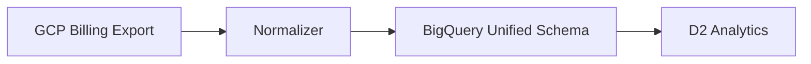

# SYS-11: D4 Multi-Cloud Integration System Requirements

## 1. Document Control

| Item | Details |
|------|---------|
| **Status** | Draft |
| **Version** | 1.0.0 |
| **Date Created** | 2026-02-09 |
| **Last Updated** | 2026-02-09 |
| **Author** | Integration Team |
| **Owner** | Integration Team |
| **Priority** | Medium |
| **EARS-Ready Score** | ✅ 91% (Target: ≥90%) |
| **REQ-Ready Score** | ✅ 90% (Target: ≥90%) |

## 2. Executive Summary

D4 Multi-Cloud Integration provides cloud provider connectivity and cost data normalization for the AI Cloud Cost Monitoring Platform. For MVP, it implements GCP-only integration with provider abstraction pattern and unified BigQuery schema to enable future multi-cloud expansion.

### 2.1 System Context

- **Architecture Layer**: Domain (Integration Layer)
- **Owned by**: Integration Team
- **Criticality Level**: Business-critical (data source connectivity)

## 3. Scope

### 3.1 System Boundaries

#### Included Capabilities (MVP)

- **GCP Integration**: Billing Export, Cloud Asset Inventory, Recommender API
- **Provider Abstraction**: Interface pattern for future providers
- **Unified Schema**: BigQuery normalized cost schema
- **Credential Management**: GCP Secret Manager with tenant isolation
- **Connection Health**: 60-second health checks

#### Excluded Capabilities (Phase 2)

- **AWS Integration**: Cost Explorer, Organizations APIs
- **Azure Integration**: Cost Management APIs
- **Kubernetes**: Cost attribution for K8s workloads

## 4. Functional Requirements

### 4.1 Core System Behaviors

#### SYS.11.01.01: GCP Connector

- **Capability**: Connect to GCP APIs for cost and resource data
- **Inputs**: Service account credentials, project IDs
- **Processing**: API calls via Cloud Client Libraries
- **Outputs**: Raw GCP data
- **Success Criteria**: Connection success rate > @threshold: PRD.11.perf.connection.success (95%)

#### SYS.11.01.02: Cost Normalizer

- **Capability**: Transform provider-specific data to unified schema
- **Inputs**: Raw provider cost data
- **Processing**: Field mapping, currency normalization
- **Outputs**: Normalized cost records
- **Success Criteria**: 100% schema compliance on output

#### SYS.11.01.03: Credential Manager

- **Capability**: Securely store and manage provider credentials
- **Inputs**: Credential enrollment, retrieval requests
- **Processing**: Encrypt with GCP Secret Manager
- **Outputs**: Secure credential access
- **Success Criteria**: Zero credential exposure

#### SYS.11.01.04: Health Monitor

- **Capability**: Monitor connection health
- **Inputs**: Connection configuration
- **Processing**: Periodic health checks (60s interval)
- **Outputs**: Health status, alerts
- **Success Criteria**: Health check latency < 5s

## 5. Quality Attributes

### 5.1 Performance Requirements

| Metric | Target |
|--------|--------|
| Data freshness | < 4 hours |
| Connection success | > 95% |
| Health check interval | 60 seconds |
| Schema compliance | 100% |

### 5.2 Reliability Requirements

- **Connection Retry**: Exponential backoff
- **Data Durability**: BigQuery storage
- **Credential Rotation**: 90-day reminders

### 5.3 Security Requirements

- **Tenant Isolation**: Per-tenant credentials
- **Encryption**: AES-256 for credentials
- **Least Privilege**: Minimal IAM permissions

## 6. Interface Specifications

### 6.1 Provider Abstraction Interface

```python
class CloudProvider(Protocol):
    def connect(self, credentials: ProviderCredentials) -> Connection
    def get_billing_data(self, date_range: DateRange) -> List[CostRecord]
    def get_resources(self) -> List[Resource]
    def health_check(self) -> HealthStatus
```

### 6.2 Unified Cost Schema

```yaml
cost_record:
  provider: "gcp|aws|azure"
  account_id: "project/account/subscription"
  service: "normalized_service_name"
  region: "normalized_region"
  resource_id: "unique_resource_id"
  usage_date: "YYYY-MM-DD"
  usage_amount: 123.45
  usage_unit: "hours|GB|requests"
  cost: 45.67
  currency: "USD"
  labels: {}
  source_record_id: "provider_specific_id"
```

### 6.3 Supported GCP APIs

| API | Purpose | Data Type |
|-----|---------|-----------|
| Billing Export | Cost data | BigQuery table |
| Cloud Asset | Resources | Inventory |
| Recommender | Optimization | Recommendations |

## 7. Data Management Requirements

### 7.1 Data Flow



### 7.2 Credential Storage

| Provider | Secret Path | Rotation |
|----------|-------------|----------|
| GCP | `/tenants/{id}/gcp/sa_key` | 90-day reminder |
| AWS | `/tenants/{id}/aws/access_key` | Phase 2 |
| Azure | `/tenants/{id}/azure/sp_creds` | Phase 2 |

## 8. Deployment and Operations

### 8.1 Infrastructure Requirements

| Resource | Provider | Configuration |
|----------|----------|---------------|
| ETL | Cloud Functions | Event-triggered |
| Scheduler | Cloud Scheduler | Hourly sync |
| Secrets | Secret Manager | Per-tenant |
| Storage | BigQuery | Unified schema |

### 8.2 Scheduled Jobs

| Job | Schedule | Purpose |
|-----|----------|---------|
| Cost sync | Hourly | Ingest billing data |
| Resource sync | Daily | Update inventory |
| Health check | Every 60s | Connection monitoring |

## 9. Acceptance Criteria

- [ ] GCP connection success > 95%
- [ ] Data freshness < 4 hours
- [ ] 100% schema compliance
- [ ] Zero credential exposure
- [ ] Health checks functional

## 10. Traceability

### 10.1 Upstream Sources

| Source | Document ID |
|--------|-------------|
| BRD | [BRD-11](../01_BRD/BRD-11_d4_multi_cloud.md) |
| PRD | [PRD-11](../02_PRD/PRD-11_d4_multi_cloud.md) |
| EARS | [EARS-11](../03_EARS/EARS-11_d4_multi_cloud.md) |
| ADR | [ADR-11](../05_ADR/ADR-11_d4_multi_cloud.md) |

### 10.2 Traceability Tags

```markdown
@brd: BRD-11
@prd: PRD-11
@ears: EARS-11
@bdd: null
@adr: ADR-11
```

## 11. Change History

| Date | Version | Change | Author |
|------|---------|--------|--------|
| 2026-02-09 | 1.0.0 | Initial system requirements | Integration Team |
